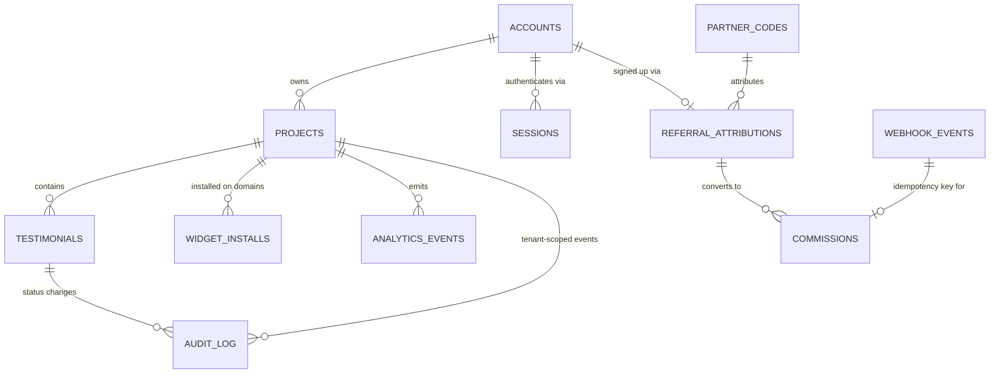

# Architecture — Proofwall

> SPARC Phase: **Architecture**. Источники: [`PRD.md`](PRD.md), [`Specification.md`](Specification.md).
> Architecture Constraints пайплайна (не обсуждаются в этом документе, только выражаются):
> pattern = Distributed Monolith (Monorepo), containers = Docker + Docker Compose,
> infrastructure = VPS (AdminVPS/HOSTKEY), deploy = Docker Compose direct deploy,
> ai_integration = MCP servers. Стек продукта: Next.js + **PostgreSQL в контейнере compose** +
> **MinIO (S3-совместимое объектное хранилище) в контейнере compose** + Claude API (только через
> MCP) + отдельный JS-виджет. Managed BaaS (Supabase, Firebase, Neon и т.п.) не используется —
> см. §9 «Миграция со стека Supabase».

## 1. Обзор системы и границы

Proofwall — distributed monolith в одном монорепозитории. Все данные и файлы продукта живут в
контейнерах, которыми мы владеем и которые деплоятся вместе на один VPS.

- **Внутри границы:** Next.js-приложение (дашборд, форма сбора, публичная стена, API-роуты,
  аутентификация владельцев), отдельно собираемый JS-бандл виджета, MCP-сервер транскрипции,
  фоновый воркер очереди видео, **PostgreSQL** (основная БД) и **MinIO** (хранилище видео) —
  оба как контейнеры docker-compose нашего стека, а не внешние сервисы.
- **На границе (внешние системы):** Claude API (только через MCP-сервер, см. §5), платёжный
  провайдер (webhook, см. ADR-006), сайт клиента-владельца (хост для виджета) и его посетители.
- **Вне scope недели** (см. PRD §1.2): импорт с 30+ платформ, AI-редактирование отзывов, роли/seats,
  Zapier и публичный API. Ни один компонент ниже не проектируется «с запасом» под эти фичи.

Ключевой архитектурный факт недели: **единственный growth loop — badge loop** (FR-GROWTH-003),
и он ломается, если тариф проверяется на клиенте. Это определяет структуру §4.

## 2. Монорепо: разбиение на пакеты

```
proofwall/
├── apps/
│   ├── web/                 # Next.js: дашборд, /f/<slug>, /w/<slug>, все API-роуты, аутентификация
│   └── widget/               # Отдельный билд: только JS-виджет, свой esbuild/vite конфиг
├── services/
│   ├── mcp-claude/           # MCP-сервер: единственная точка входа к Claude API
│   └── worker/                # Фоновый обработчик очереди видео (polling jobs-таблицы)
├── packages/
│   ├── shared-types/          # TS-типы: Testimonial, Project, AnalyticsEvent и т.д.
│   ├── db/                    # SQL-миграции (Postgres), RLS-политики, сгенерированные типы
│   └── ui/                    # Общие React-компоненты дашборда и формы (НЕ виджета)
├── docker-compose.yml
└── docker-compose.prod.yml
```

**Почему `apps/widget` отдельно от `apps/web`:** NFR требует ≤30 KB gzip и отсутствие блокировки
рендера хоста (FR-NFR-PERF-001); Next.js chunk неизбежно тянет фреймворк-рантайм. Виджет —
отдельный минимальный тулчейн (vanilla TS + esbuild), без React, публикуется как статический файл
по пути `/widget.js` (см. §8).

**Почему `services/mcp-claude` — отдельный сервис, а не библиотека в `apps/web`:** Constraint
`ai_integration: MCP servers` требует не вызывать Claude API напрямую из бизнес-кода. MCP-сервер
физически предоставляет **только один инструмент — `transcribe_video`**: граница FR-NFR-SEC-002
(ADR-005) выражена в наборе доступных tool'ов, а не в промпте, который можно случайно изменить.

## 3. Модель данных



| Таблица | Ключевые поля | Назначение |
|---|---|---|
| `accounts` | `id`, `email` unique, `password_hash`, `created_at` | Владелец. Аутентификация — внутри монолита, см. §3.2 |
| `sessions` | `id`, `account_id`, `token_hash`, `expires_at`, `revoked_at` | Активные сессии владельцев (§3.2) |
| `projects` | `id`, `account_id`, `slug` unique, `branding jsonb`, `tier enum(free,paid)`, `noindex bool` | Единица арендатора; **всё в системе принадлежит проекту** |
| `testimonials` | `id`, `project_id` NOT NULL, `status enum(pending,approved,rejected,hidden)`, `text`, `video_object_key`, `transcript`, `transcript_status enum(pending,completed,failed) default pending`, `transcript_source enum(machine) default machine` | FR-002…FR-004 |
| `widget_installs` | `id`, `project_id`, `domain`, `first_seen_at`, `last_seen_at`, unique(`project_id`,`domain`) | Источник **метрики недели** и события `widget_installed` |
| `rate_limit_events` | `id`, `scope`, `key`, `created_at`, index(`scope`,`key`,`created_at`) | Единый счётчик скользящего окна для anti-fraud/rate-limit, см. §3.4 |
| `analytics_events` | `id`, `project_id` nullable, `account_id` nullable, `event_type`, `domain`, `metadata jsonb`, `created_at` | Единый append-only журнал §6 |
| `partner_codes` | `id`, `code` unique, `partner_name`, `status enum(active,revoked)` | FR-GROWTH-004 |
| `referral_attributions` | `id`, `account_id` nullable до сайнапа, `partner_code_id`, `source enum(cookie,promo_code)`, `status enum(pending,converted,blocked)` | FR-GROWTH-002 |
| `commissions` | `id`, `referral_attribution_id`, `payment_event_id` unique | Начисление, идемпотентно (ADR-006) |
| `checkout_sessions` | `id`, `project_id`, `provider_session_id` unique, `status enum(pending,completed,expired)`, `created_at` | FR-008 — привязка вебхука оплаты к проекту при апгрейде тарифа |
| `webhook_events` | `provider`, `event_id` unique, `processed_at` | Дедупликация повторной доставки вебхука |
| `audit_log` | `id`, `project_id` nullable, `entity_type`, `entity_id`, `actor_id`, `action`, `reason`, `created_at` | Модерация, self-referral, suspected_fraud, noindex-события |

### 3.1 Мульти-арендная изоляция (FR-NFR-SEC-001) — где именно проверяется

Изоляция проверяется в **двух независимых местах**, и оба обязательны (defense in depth). RLS —
фича самого PostgreSQL, поэтому уход от Supabase её никак не меняет; меняется только то, **как
задаётся контекст арендатора** в соединении (раньше это делал Supabase через `auth.uid()`, теперь —
наш собственный код).

1. **RLS на каждой таблице с `project_id`, роль `app_authenticated`.** Дашборд/модерация открывают
   транзакцию и первым делом задают контекст арендатора:
   ```sql
   SET LOCAL app.current_account_id = '<account_id из проверенной сессии>';
   create policy "tenant_isolation_select" on testimonials
     for select using (project_id in (
       select id from projects where account_id = current_setting('app.current_account_id')::uuid
     ));  -- аналогично для update/delete
   ```
   `SET LOCAL` действует только внутри текущей транзакции — следующий запрос из пула не наследует
   чужой контекст; даже баг в клиентском коде не даст прочитать чужой проект.

2. **Явная проверка `project_id` в каждом публичном API-роуте, роль `app_service` (BYPASSRLS).**
   Анонимные пути (форма, виджет, Wall of Love) идут через роль `BYPASSRLS` — RLS осознанно
   обходится (нет `account_id` для `SET LOCAL`), изоляция — обязанность кода: каждый запрос
   резолвит `slug → project_id` и фильтрует `.where('project_id', projectId).where('status',
   'approved')`. Ни один роут не принимает `project_id` от клиента, только `slug`. `app_service` —
   аналог Supabase service-role, но роль своя, объявлена в `packages/db`-миграциях.

Тест-контракт: интеграционный тест «проект A не может прочитать отзыв проекта B» гоняется и через
аутентифицированный дашборд-путь (проверяет RLS + `SET LOCAL`), и через анонимный API (проверяет
фильтрацию в коде под `app_service`).

### 3.2 Аутентификация владельцев (без Supabase Auth)

Коротко, без изобретательства сверх нужд MVP:

- Пароль хешируется (`argon2id`/`bcrypt`) в `accounts.password_hash`, сверяется константным по
  времени сравнением при входе.
- Сессия — непрозрачный токен в httpOnly+Secure cookie; в `sessions` хранится хеш токена
  (`token_hash`), не сам токен — компрометация БД не даёт захватить активные сессии.
- Логаут = `revoked_at = now()`; «на всех устройствах» = revoke всех строк `account_id`. TTL —
  разумный дефолт — `[GAP: TTL сессии/политика ротации — реализовать разумный дефолт]`.
- Middleware на каждый запрос дашборда: cookie → валидная сессия → `account_id` → транзакция под
  `app_authenticated`, `SET LOCAL app.current_account_id` (§3.1) — запросы RLS-scoped автоматически.

### 3.3 Момент ценности и метрика недели — одна гранулярность (PRD §2.4.1, находка C-1)

PRD §2.4.1 фиксирует: **считаем сайты, а не людей**. `widget_installed` и `invite_shown` — оба на
**одну и ту же** гранулярность, пару (`project_id`, `domain`), и оба живут за счёт **одной**
таблицы `widget_installs`, `unique(project_id, domain)` — отдельная таблица/столбец под
`invite_shown` не нужны. Механизм дедупликации — атомарная вставка, без отдельной проверки:

```sql
INSERT INTO widget_installs (project_id, domain, first_seen_at, last_seen_at)
VALUES ($1, $2, now(), now())
ON CONFLICT (project_id, domain) DO NOTHING
RETURNING id;
-- строка вернулась ⇒ НОВЫЙ домен ⇒ пишем ОБА события: widget_installed + invite_shown
-- 0 строк (конфликт) ⇒ домен уже известен ⇒ ни одного события, только last_seen_at обновляется
```

`ON CONFLICT ... RETURNING` сама защищает от гонки при двух параллельных рендерах одного нового
домена — строку получает только один вызов, только он инициирует события. Повторный рендер
известного домена — конфликт по определению — не порождает событий вовсе. Следствие: share-CTA
(`invite_shown`) показывается **при каждой новой установке на новый домен**, не только при первой
в жизни проекта. Канонические имена (`widget_installs`, `/api/widget/config`) — см. §10.

### 3.4 Anti-fraud и rate limiting — один механизм на три требования (находка W-1)

Три Must-требования — один класс задачи: «не более N событий за интервал T по ключу», счётчик в
скользящем окне:

| Требование | `scope` | `key` | окно | порог | действие при превышении |
|---|---|---|---|---|---|
| FR-NFR-SEC-003 (форма) | `form_submission` | `ip`+`project_id` | 1 час | 5 | 429, `testimonials` не создаётся |
| FR-GROWTH-004 `@security` (партнёрский код) | `signup_via_partner_code` | `ip`, только для регистраций с непустым `referral_attributions.partner_code_id` | 10 мин | 50 | Регистрация не блокируется; `audit_log(reason='suspected_fraud')`, `referral_attributions.status='blocked'` — комиссия не начисляется (ADR-006) |
| FR-GROWTH-005 `@security` (создание проектов) | `project_created` | `account_id` | 1 час | 20 | Новые проекты аккаунта → `noindex=true` (механизм для уже описанного поведения ADR-004) |

**Решение: одна таблица Postgres, без Redis** — единый серверный помощник (`packages/db`),
вызывается из трёх соответствующих API-роутов `apps/web`, а не дублируется в каждом:

```sql
create table rate_limit_events (
  id bigserial primary key, scope text not null, key text not null,
  created_at timestamptz not null default now()
);
create index rate_limit_events_scope_key_created_idx on rate_limit_events (scope, key, created_at desc);

-- помощник: insert + count за окно, count >= порог ⇒ exceeded = true, роут решает действие
insert into rate_limit_events (scope, key) values ($scope, $key);
select count(*) from rate_limit_events
  where scope = $scope and key = $key and created_at > now() - $window::interval;
```

Таблица намеренно без FK (`key` — разный формат под каждый `scope`: IP, account_id, IP+project —
единый FK создал бы ложную связность).

**Почему Postgres, а не Redis, при масштабе «одна неделя, один VPS»:** b-tree индекс
`(scope, key, created_at)` даёт `COUNT` за доли миллисекунды на объёмах в тысячи строк — весь
трафик недельного MVP. Redis добавил бы четвёртый контейнер, отдельную (не)стратегию бэкапа и
новый режим отказа (fail-open/fail-closed при недоступном Redis) без выигрыша на этом масштабе —
тот же аргумент, которым в §5 уже обоснован Postgres-`SKIP LOCKED` вместо Redis/BullMQ для
очереди видео.

**Очистка:** `services/worker` (уже поллит Postgres для очереди видео, §5) дополнительно раз в час
удаляет строки старше 24 часов — самый широкий порог здесь 1 час, отдельный сервис под TTL не нужен.

**Путь миграции при росте** (тот же стиль, что и MinIO→volume в §5): заменить SQL-запрос в
помощнике на Redis `INCR`+`EXPIRE` — контракт (`scope, key, window, limit → exceeded: bool`) не меняется.

### 3.5 Checkout и обновление тарифа (FR-008)

Инициация — `apps/web` (`POST /api/checkout`, роль `app_authenticated`, владелец проекта): создаёт
`checkout_sessions (project_id, provider_session_id, status='pending')`, обращается к провайдеру
`[GAP: выбор платёжного провайдера, см. §11]` — контракт `project_id → {provider_session_id,
redirect_url}` провайдер-агностичен.

Подтверждение — тот же вебхук-канал, что и FR-GROWTH-002: `onPaymentWebhook` (Pseudocode §7.2 —
подпись/идемпотентность/self-referral, не меняется) возвращает HTTP 200 только после проверки
подписи; отдельный шаг `applyTariffUpgrade` (Pseudocode §7.3, новый) та же route-обёртка вызывает
ПОСЛЕ него тем же `raw_body`: `event.checkout_session_id → checkout_sessions.project_id →
projects.tier='paid'`. Идемпотентно по природе (`paid`→`paid` не меняет состояние), отдельного
стора не требуется — в отличие от комиссии в §7.2. Отклонённый/просроченный платёж не даёт
`payment_succeeded` — тариф не трогается. `web` дополнительно получает `PAYMENT_WEBHOOK_SECRET`
(уже объявлен под `mcp-claude`, §7) — вебхук-роут физически исполняется в `apps/web` (§2).

## 4. Схема виджета

### 4.1 Изоляция от стилей хоста

Виджет рендерится в `Shadow DOM` (`element.attachShadow({mode: 'open'})`), все стили инжектятся
внутрь shadow-root через `<style>`. Полный разбор компромиссов — [ADR-001](ADR.md#adr-001).

### 4.2 Конфигурация и рендер (последовательность)

```
<script src="https://cdn.proofwall.app/widget.js" data-slug="acme" async></script>
```

1. Скрипт находит свой `<script>`-тег, читает `data-slug`, определяет `window.location.hostname`.
2. `GET /api/widget/config?slug=acme&domain=host.example.com` — единственный сетевой запрос.
3. Сервер (Next.js API route, соединение с Postgres под ролью `app_service`):
   - резолвит `slug → project`, **читает `project.tier`**, вычисляет `badge_required = tier !== 'paid'`,
   - атомарная вставка в `widget_installs (project_id, domain)` с `ON CONFLICT DO NOTHING
     RETURNING id` (§3.3) — строка вернулась ⇒ новый домен ⇒ пишет **оба** события,
     `widget_installed`+`invite_shown` (§6); конфликт ⇒ ни одного события, только `last_seen_at`,
   - пишет `badge_impression`, возвращает JSON: `{ testimonials: [...approved], branding, badge_required }`.
4. Клиент рендерит карточки внутри shadow-root; если `badge_required`, рендерит badge-элемент.

### 4.3 Почему проверка тарифа обязана быть серверной

`badge_required` — **вычисленное сервером булево поле в ответе**, а не что-то, что клиент решает
сам. Виджет физически не получает `tier` — он получает уже готовое решение. Убрать badge, не имея
API-ключа проекта, невозможно: подделка ответа требует MITM на собственный трафик хоста, что уже
вне модели угроз клиентского JS. Полный разбор — [ADR-002](ADR.md#adr-002).

Дополнительный клиентский anti-tamper (не замена серверной проверке, вторая линия): `MutationObserver`
на shadow-host восстанавливает `style`/`hidden`, если хост их меняет. Не защищает от `display:none`
на самом host-элементе целиком — честно зафиксировано как остаточный риск в ADR-002.

## 5. Хранение и обработка видео

- **Storage:** объектное хранилище — **MinIO** (S3-совместимое API), контейнер docker-compose,
  приватный bucket `testimonial-videos`, key `project_id/testimonial_id.ext`. Публичный доступ —
  только через presigned URL с TTL, выдаваемый API-роутом Wall of Love/виджета (никогда не отдаём
  постоянный публичный URL — совместимо с NFR по мульти-арендности).
  - **Почему MinIO, а не просто Docker volume:** presigned upload/download — часть S3-протокола;
    голый bind-mount не умеет выдавать временные подписанные ссылки, а значит заставил бы
    проксировать видео через `apps/web` (противоречит следующему пункту). MinIO даёт S3 API
    «бесплатно» в своём контейнере, без внешнего облака.
  - **Путь миграции на голый volume** (если MinIO станет избыточным): том `videos_data:/data`,
    отдача через authenticated-роут `apps/web` с HMAC-подписанной ссылкой (`object_key + expiry`).
    Контракт `signed URL с TTL`, на который завязаны §4 и Wall of Love, не меняется.
- **Приём:** форма загружает файл напрямую в MinIO через presigned upload URL (не проксируется
  через `apps/web`, чтобы не упереться в лимиты serverless-функций по размеру тела запроса).
- **Транскрипция — очередь, не синхронный вызов:**
  1. После загрузки видео в `testimonials` пишется `video_object_key` (ключ объекта в MinIO, **не**
     presigned URL — тот временный и не переживёт до момента, когда до записи дойдёт очередь; см.
     §10) и `transcript_status = 'pending'`.
  2. `services/worker` поллит записи `transcript_status = 'pending'` (`SELECT ... FOR UPDATE SKIP
     LOCKED` по Postgres — без Redis ради простоты недели, тот же принцип, что и в §3.4).
  3. Worker формирует presigned GET URL **из `video_object_key`** и вызывает `services/mcp-claude`
     (MCP, инструмент `transcribe_video(video_url)`) — presigned URL живёт только на время вызова,
     в БД не попадает.
  4. MCP-сервер скачивает видео, отправляет аудио-дорожку в Claude API **только с промптом
     транскрипции**, возвращает текст воркеру.
  5. Worker пишет `transcript`, `transcript_source = 'machine'`, `transcript_status = 'completed'`.
     Неудачный вызов MCP → `transcript_status = 'failed'`, отзыв виден в модерации без
     транскрипта; retry — `[GAP: политика повторных попыток — вне scope MVP-недели]`.
- **На Wall of Love** транскрипт рендерится с явной пометкой «Машинная расшифровка» — того требует
  FR-NFR-SEC-002 / ADR-005.

## 6. Где живут события аналитики (обязательный слот)

Единая таблица `analytics_events` (append-only, без апдейтов), пишется **только серверным кодом**
(никогда напрямую с клиента — иначе события можно подделать или потерять при блокировщиках рекламы).

| Событие | Где инструментируется | Триггер |
|---|---|---|
| `widget_installed` | `apps/web`, API-роут `/api/widget/config` (§3.3, §4.2 п.3) | `ON CONFLICT DO NOTHING RETURNING id` в `widget_installs` вернул строку — новая пара (`project_id`, `domain`) |
| `invite_shown` | `apps/web`, тот же API-роут `/api/widget/config`, тот же момент | Та же успешная вставка — один и тот же новый домен показывает и метрику, и share-CTA владельцу (PRD §2.4.1) |
| `invite_sent` | `apps/web`, API-роут `/api/share` | Владелец подтвердил диалог публикации (FR-GROWTH-001 @security — без подтверждения запрос не уходит) |
| `badge_impression` | `apps/web`, API-роут `/api/widget/config` | Каждый ответ конфигурации виджета с `badge_required = true` |
| `badge_click` | `apps/web`, API-роут `/api/widget/badge-click` (виджет шлёт `navigator.sendBeacon`, сервер валидирует и пишет событие + добавляет UTM) | Клик по badge-ссылке |
| `signup_from_badge` | `apps/web`, обработчик после успешной регистрации (модуль аутентификации, §3.2) | Регистрация с UTM-меткой источника badge в query/cookie |
| `referral_attributed` | `apps/web`, платёжный webhook-обработчик (см. ADR-006) | Оплата с непустой `referral_attributions` |

Все обработчики событий — тонкие вставки в уже существующие серверные пути (нет отдельного
«аналитического сервиса» ради простоты недели). `metadata jsonb` хранит контекст (domain, UTM,
partner_code) без изменения схемы под каждое новое поле. `widget_installed`/`invite_shown` пишутся
из одного места кода одним условием (§3.3) — осознанно, не дублирование: PRD §2.4.1 требует
идентичной гранулярности и условия срабатывания для обоих.

## 7. Docker Compose

Все сервисы — наши; managed-зависимостей больше нет. Одна команда `docker compose up` поднимает
полный стек.

```yaml
services:
  postgres:
    image: postgres:16-alpine
    environment:
      - POSTGRES_DB
      - POSTGRES_USER
      - POSTGRES_PASSWORD       # секреты — только имена переменных, значения в .env / secrets
    volumes:
      - postgres_data:/var/lib/postgresql/data
    healthcheck:
      test: ["CMD-SHELL", "pg_isready -U $$POSTGRES_USER"]
      interval: 5s
      timeout: 5s
      retries: 5

  minio:
    image: minio/minio
    command: server /data
    environment:
      - MINIO_ROOT_USER
      - MINIO_ROOT_PASSWORD
    volumes:
      - minio_data:/data
    expose: ["9000"]
    healthcheck:
      test: ["CMD", "curl", "-f", "http://localhost:9000/minio/health/live"]
      interval: 5s
      timeout: 5s
      retries: 5

  web:
    build: ./apps/web
    environment:
      - DATABASE_URL             # postgres:// строка, включает роли app_authenticated/app_service
      - SESSION_SECRET
      - S3_ENDPOINT
      - S3_BUCKET
      - S3_ACCESS_KEY
      - S3_SECRET_KEY
      - MCP_CLAUDE_URL=http://mcp-claude:7331
      - PAYMENT_WEBHOOK_SECRET   # FR-008: onPaymentWebhook/applyTariffUpgrade исполняются в apps/web (§3.5)
    ports: ["3000:3000"]
    depends_on:
      postgres:
        condition: service_healthy
      minio:
        condition: service_healthy
      mcp-claude:
        condition: service_started

  worker:
    build: ./services/worker
    environment:
      - DATABASE_URL
      - S3_ENDPOINT
      - S3_BUCKET
      - S3_ACCESS_KEY
      - S3_SECRET_KEY
      - MCP_CLAUDE_URL=http://mcp-claude:7331
    depends_on:
      postgres:
        condition: service_healthy
      minio:
        condition: service_healthy
      mcp-claude:
        condition: service_started

  mcp-claude:
    build: ./services/mcp-claude
    environment:
      - PAYMENT_WEBHOOK_SECRET   # HMAC входящих вебхуков оплаты (FR-GROWTH-002 @security)
      - ANTHROPIC_API_KEY
    expose: ["7331"]

  caddy:
    image: caddy:2-alpine
    ports: ["80:80", "443:443"]
    volumes:
      - ./Caddyfile:/etc/caddy/Caddyfile
      - caddy_data:/data
    depends_on:
      web:
        condition: service_started

volumes:
  postgres_data:
  minio_data:
  caddy_data:
```

**Порядок запуска (W-4 — короткий синтаксис `depends_on: [a, b]` ждёт только старта контейнера, не
здоровья; исправлено на `condition: service_healthy`):** `postgres`+`minio` healthy → `mcp-claude`
started (нет healthcheck на этой неделе) → `web`/`worker` → `caddy`. Миграции (`packages/db`)
прогоняются CI-шагом до `up -d` на новых версиях образа `web`, не отдельным сервисом compose.

**Что бэкапить (теперь наша ответственность, раньше — задача Supabase):**
- `postgres`: логический дамп (`pg_dump` по расписанию, cron вне compose) — консистентность важнее
  скорости для объёма данных недели.
- `minio_data`: зеркалирование бакета (`mc mirror`) на внешнее хранилище; синхронизировать по
  времени с дампом БД — `video_object_key` ссылается на файл в MinIO, рассинхрон бэкапов создаёт
  «битые» ссылки после restore.
- `caddy_data` бэкапить не обязательно — переиздаётся автоматически (Let's Encrypt, см. ADR-007).

`widget.js` собирается в CI и копируется в `apps/web/public/widget.js` на этапе билда — отдельного
контейнера для виджета не заводим, раздаёт его `web`/`caddy`.

## 8. Деплой на VPS

- **Инфраструктура:** один VPS (AdminVPS/HOSTKEY), Docker + Docker Compose, без оркестратора —
  оправдано масштабом «одна неделя, один продукт».
- **Пайплайн:** CI (GitHub Actions) → build образов → миграции `packages/db` → `docker compose -f
  docker-compose.prod.yml pull && up -d` по SSH на VPS. Секреты — через CI secrets, инжектятся в
  `.env` на сервере, не коммитятся.
- **TLS/reverse proxy:** Caddy перед `web` — автоматический HTTPS по домену (обоснование выбора,
  альтернативы и поведение при провале сертификата — [ADR-007](ADR.md#adr-007)), отдаёт `widget.js`
  с агрессивным `Cache-Control` (файл версионируется по content-hash в имени при билде).
- **Домены Wall of Love:** MVP отдаёт `/w/<slug>` под собственным доменом продукта
  (`proofwall.app/w/<slug>`), без кастомного CNAME клиента — `[GAP: нужно решение по Q3 PRD —
  собственный поддомен vs CNAME клиента; блокирует SEO-стратегию FR-GROWTH-005 за пределами MVP]`.
- **Откат:** предыдущий tag образа хранится в registry; откат — `docker compose up -d` с прошлым
  тегом. Данные не откатываются вместе с образом — откат кода не равен откату схемы БД, миграции
  пишутся обратимыми там, где дёшево. Blue/green — вне scope недели.

## 9. Миграция со стека Supabase

В исходную постановку задачи по ошибке попал Supabase (managed BaaS) — прямой конфликт с
Architecture Constraints пайплайна (`containers: Docker + Docker Compose`, база данных должна жить
в контейнере compose на своём VPS, а не в стороннем облаке). Решение пересмотрено на этапе
Architecture, без потери принятых продуктовых и ADR-решений:

- **Postgres** переехал из managed-облака Supabase в контейнер `postgres` docker-compose (§7).
- **Supabase Auth** заменён аутентификацией внутри монолита: `accounts.password_hash` + `sessions`
  (§3.2) — тот же контракт «владелец залогинен → есть `account_id`», другая реализация.
- **Supabase Storage** заменён контейнером **MinIO** (§5) — presigned upload/download сохранён как
  паттерн, изменился только эндпоинт.
- **RLS не убирался** — фича PostgreSQL, а не Supabase; изменился только способ задать контекст
  арендатора (`SET LOCAL app.current_account_id` вместо `auth.uid()`, §3.1).
- ADR-001…006, схема данных (кроме `accounts`/`sessions`), growth-события §6 и разбиение монорепо
  §2 остались как есть — конфликт был только в инфраструктурном слое.

## 10. Канонические имена (находка W-10)

Валидация нашла расхождения в именах между `Architecture.md` и `Pseudocode.md`. Ниже — канон;
`Pseudocode.md` приводится к этой таблице, не наоборот.

| Сущность | Канон (этот документ) | Не использовать | Почему канон — этот вариант |
|---|---|---|---|
| Таблица установок | `widget_installs` | `widget_install_events` | Уже используется во всех местах Architecture.md/C4/ADR-006-стиля идемпотентности; переименование добавило бы правку без пользы |
| Путь конфигурации виджета | `GET /api/widget/config` | `/api/widget-config` | Уже используется в §4.2, §6, ADR-002 — три независимых места ссылаются на этот путь |
| Поле файла видео | `testimonials.video_object_key` | `video_url` | NFR по мульти-арендности требует не хранить постоянный публичный URL; presigned URL истекает, поэтому в БД хранится ключ объекта, а не ссылка (§5) |
| Поле текста транскрипта | `testimonials.transcript` | `video_transcript` | Короче, без избыточного префикса `video_` (таблица и так `testimonials`, поле уже про видео-отзыв) |
| Поле статуса транскрипции | `testimonials.transcript_status enum(pending,completed,failed)` | `pending_transcription bool` | Булево не могло выразить неудачный вызов MCP; enum добавляет `failed` без изменения количества полей (§5) |
| Поле источника транскрипта | `testimonials.transcript_source enum(machine)` | `video_transcript_is_machine bool` | Единообразно с `transcript_status`/`transcript`; расширяемо, если когда-нибудь появится ручная расшифровка — не в scope MVP |
| Момент ценности | `widget_installed` + `invite_shown`, оба на `widget_installs` | отдельная таблица/поле под `invite_shown` | PRD §2.4.1 (пересмотрено): оба события — одна гранулярность (`project_id`,`domain`), см. §3.3 |

## 11. Открытые пробелы (GAP)

- `[GAP: нужна конкретная цена платного тарифа (PRD Q1) — влияет только на биллинг-копирайт, не на схему данных]`
- `[GAP: нужен лимит бесплатного тарифа по числу отзывов (PRD Q2) — влияет на constraint в `projects`/`testimonials`, схема готова принять любое число]`
- `[GAP: нужно решение по домену Wall of Love (PRD Q3) — влияет на §8 и на будущую поддержку CNAME]`
- `[GAP: нужен выбор платёжного провайдера (Stripe и т.п. не назван в исходных документах) — ADR-006 описывает контракт идемпотентности провайдер-агностично; тот же GAP закрывает checkout FR-008, §3.5]`
- `[GAP: TTL сессии владельца и политика ротации/revoke-all не зафиксированы в исходных документах — реализовать разумный дефолт (§3.2)]`
- `[GAP: политика бэкапов Postgres/MinIO (частота, retention, offsite-копия) не зафиксирована в исходных документах — реализовать разумный дефолт (ежедневный `pg_dump` + `mc mirror`), уточнить при росте нагрузки]`
