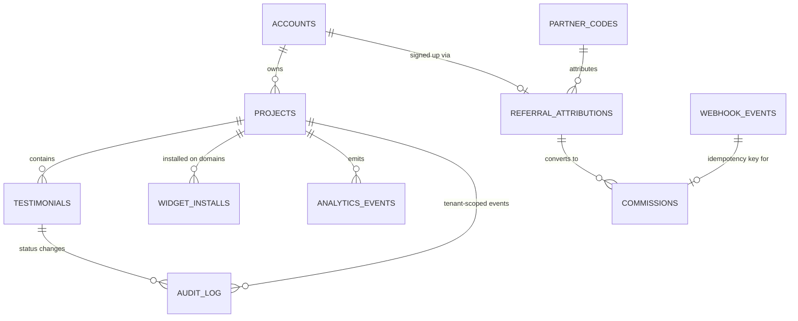

# Architecture — Proofwall

> SPARC Phase: **Architecture**. Источники: [`PRD.md`](PRD.md), [`Specification.md`](Specification.md).
> Architecture Constraints пайплайна (не обсуждаются в этом документе, только выражаются):
> pattern = Distributed Monolith (Monorepo), containers = Docker + Docker Compose,
> infrastructure = VPS (AdminVPS/HOSTKEY), deploy = Docker Compose direct deploy,
> ai_integration = MCP servers. Стек продукта: Next.js + Supabase + Claude API + отдельный JS-виджет.

## 1. Обзор системы и границы

Proofwall — distributed monolith в одном монорепозитории. Границы системы:

- **Внутри границы:** Next.js-приложение (дашборд, форма сбора, публичная стена, API-роуты),
  отдельно собираемый JS-бандл виджета, MCP-сервер транскрипции, фоновый воркер очереди видео.
- **На границе (внешние системы):** Supabase (Postgres + Auth + Storage) как managed-зависимость,
  Claude API (только через MCP-сервер, см. §5), платёжный провайдер (webhook, см. ADR-006),
  сайт клиента-владельца (хост для виджета) и его посетители.
- **Вне scope недели** (см. PRD §1.2): импорт с 30+ платформ, AI-редактирование отзывов, роли/seats,
  Zapier и публичный API. Ни один компонент ниже не проектируется «с запасом» под эти фичи.

Ключевой архитектурный факт недели: **единственный growth loop — badge loop** (FR-GROWTH-003),
и он ломается, если тариф проверяется на клиенте. Это определяет структуру §4.

## 2. Монорепо: разбиение на пакеты

```
proofwall/
├── apps/
│   ├── web/                 # Next.js: дашборд, /f/<slug>, /w/<slug>, все API-роуты
│   └── widget/               # Отдельный билд: только JS-виджет, свой esbuild/vite конфиг
├── services/
│   ├── mcp-claude/           # MCP-сервер: единственная точка входа к Claude API
│   └── worker/                # Фоновый обработчик очереди видео (polling jobs-таблицы)
├── packages/
│   ├── shared-types/          # TS-типы: Testimonial, Project, AnalyticsEvent и т.д.
│   ├── db/                    # Supabase migrations, RLS policies, generated types
│   └── ui/                    # Общие React-компоненты дашборда и формы (НЕ виджета)
├── docker-compose.yml
└── docker-compose.prod.yml
```

**Почему `apps/widget` отдельно от `apps/web`, а не общий bundle Next.js:**
NFR требует ≤30 KB gzip и отсутствие блокировки рендера хоста (FR-NFR-PERF-001). Next.js chunk
неизбежно тянет фреймворк-рантайм. Виджет собирается отдельным минимальным тулчейном (vanilla TS +
esbuild), без React, и публикуется как статический файл, который `apps/web` раздаёт по пути
`/widget.js` (либо через CDN-кэш перед VPS — см. §8).

**Почему `services/mcp-claude` — отдельный сервис, а не библиотека внутри `apps/web`:**
Constraint `ai_integration: MCP servers` требует, чтобы Claude API не вызывался напрямую из
бизнес-кода. Дополнительный архитектурный эффект: MCP-сервер физически предоставляет **только один
инструмент — `transcribe_video`**. У него нет инструмента «переписать текст отзыва» или «улучшить
формулировку» — граница FR-NFR-SEC-002 (см. ADR-005) выражена в наборе доступных tool'ов, а не
только в промпте, который можно случайно изменить.

## 3. Модель данных



| Таблица | Ключевые поля | Назначение |
|---|---|---|
| `accounts` | `id` (= `auth.users.id`), `email` | Владелец, привязан к Supabase Auth |
| `projects` | `id`, `account_id`, `slug` unique, `branding jsonb`, `tier enum(free,paid)`, `noindex bool` | Единица арендатора; **всё в системе принадлежит проекту** |
| `testimonials` | `id`, `project_id` NOT NULL, `status enum(pending,approved,rejected,hidden)`, `text`, `video_url`, `video_transcript`, `video_transcript_is_machine bool default true` | FR-002…FR-004 |
| `widget_installs` | `id`, `project_id`, `domain`, `first_seen_at`, `last_seen_at`, unique(`project_id`,`domain`) | Источник **метрики недели** и события `widget_installed` |
| `analytics_events` | `id`, `project_id` nullable, `account_id` nullable, `event_type`, `domain`, `metadata jsonb`, `created_at` | Единый append-only журнал §6 |
| `partner_codes` | `id`, `code` unique, `partner_name`, `status enum(active,revoked)` | FR-GROWTH-004 |
| `referral_attributions` | `id`, `account_id` nullable до сайнапа, `partner_code_id`, `source enum(cookie,promo_code)`, `status enum(pending,converted,blocked)` | FR-GROWTH-002 |
| `commissions` | `id`, `referral_attribution_id`, `payment_event_id` unique | Начисление, идемпотентно (ADR-006) |
| `webhook_events` | `provider`, `event_id` unique, `processed_at` | Дедупликация повторной доставки вебхука |
| `audit_log` | `id`, `project_id` nullable, `entity_type`, `entity_id`, `actor_id`, `action`, `reason`, `created_at` | Модерация, self-referral, suspected_fraud, noindex-события |

### 3.1 Мульти-арендная изоляция (FR-NFR-SEC-001) — где именно проверяется

Изоляция проверяется в **двух независимых местах**, и оба обязательны (defense in depth):

1. **Supabase RLS на каждой таблице с `project_id`.** Для аутентифицированного пути (дашборд,
   модерация) политика вида:
   ```sql
   create policy "tenant_isolation_select" on testimonials
     for select using (
       project_id in (select id from projects where account_id = auth.uid())
     );
   -- аналогично для update/delete; insert — только через service-role в API-роуте формы
   ```
   Это гарантирует, что даже баг в клиентском коде дашборда не даст прочитать чужой проект —
   RLS работает на уровне Postgres, а не приложения.

2. **Явная проверка `project_id` в каждом публичном API-роуте.** Анонимные пути (форма сбора,
   виджет, Wall of Love) обращаются к Supabase **сервисной ролью** (RLS обходится намеренно), поэтому
   для них изоляция — обязанность кода: каждый запрос обязан резолвить `slug → project_id` и
   фильтровать `.eq('project_id', projectId).eq('status', 'approved')`. Ни один API-роут не
   принимает `project_id` напрямую от клиента — только `slug`, который резолвится сервером.

Тест-контракт: интеграционный тест «проект A не может прочитать отзыв проекта B» гоняется и через
аутентифицированный дашборд-путь (проверяет RLS), и через анонимный API (проверяет фильтрацию в коде).

## 4. Схема виджета

### 4.1 Изоляция от стилей хоста

Виджет рендерится в `Shadow DOM` (`element.attachShadow({mode: 'open'})`), все стили инжектятся
внутрь shadow-root через `<style>`. Полный разбор компромиссов — [ADR-001](ADR.md#adr-001).

### 4.2 Конфигурация и рендер (последовательность)

```
<script src="https://cdn.proofwall.app/widget.js" data-slug="acme" async></script>
```

1. Скрипт находит свой `<script>`-тег, читает `data-slug`, определяет `window.location.hostname`.
2. `GET /api/widget/config?slug=acme&domain=host.example.com` — единственный сетевой запрос.
3. Сервер (Next.js API route, service-role Supabase-клиент):
   - резолвит `slug → project`,
   - **читает `project.tier` из БД** и вычисляет `badge_required = tier !== 'paid'`,
   - `upsert` в `widget_installs (project_id, domain)` — если это первая запись для пары
     `(project_id, domain)`, пишет событие `widget_installed` (метрика недели, см. §6),
   - пишет событие `badge_impression`,
   - возвращает JSON: `{ testimonials: [...approved], branding, badge_required }`.
4. Клиент рендерит карточки внутри shadow-root; если `badge_required`, рендерит badge-элемент.

### 4.3 Почему проверка тарифа обязана быть серверной

`badge_required` — **вычисленное сервером булево поле в ответе**, а не что-то, что клиент решает
сам. Виджет физически не получает `tier` — он получает уже готовое решение. Убрать badge, не имея
API-ключа проекта, невозможно: подделка ответа требует MITM на собственный трафик хоста, что уже
вне модели угроз клиентского JS. Полный разбор — [ADR-002](ADR.md#adr-002).

Дополнительный клиентский anti-tamper (не замена серверной проверке, а вторая линия против
`display:none` через DOM хоста): `MutationObserver` на shadow-host элементе восстанавливает
`style`/`hidden` атрибуты, если внешний скрипт хоста их меняет. Он не может обойти CSS хоста,
который скрывает **сам host-элемент** целиком (`<div id="proofwall-widget">` с `display:none`
вокруг shadow host) — это честно зафиксировано как остаточный риск в ADR-002.

## 5. Хранение и обработка видео

- **Storage:** Supabase Storage, приватный bucket `testimonial-videos`, path `project_id/testimonial_id.ext`.
  Публичный доступ — только через signed URL с TTL, выдаваемый API-роутом Wall of Love/виджета
  (никогда не отдаём permanent public URL — совместимо с NFR по мульти-арендности).
- **Приём:** форма загружает файл напрямую в Storage через presigned upload URL (не проксируется
  через `apps/web`, чтобы не упереться в лимиты serverless-функций по размеру тела запроса).
- **Транскрипция — очередь, не синхронный вызов:**
  1. После успешной загрузки видео в `testimonials` пишется строка `pending_transcription = true`.
  2. `services/worker` поллит эту очередь (простой `SELECT ... FOR UPDATE SKIP LOCKED` по
     Postgres — без Redis/доп. инфраструктуры ради простоты недели).
  3. Worker вызывает `services/mcp-claude` по MCP-протоколу, инструмент `transcribe_video(video_url)`.
  4. MCP-сервер скачивает видео по signed URL, отправляет аудио-дорожку в Claude API **только с
     промптом транскрипции**, получает текст, возвращает его воркеру.
  5. Worker пишет результат в `testimonials.video_transcript`, помечает
     `video_transcript_is_machine = true`, `pending_transcription = false`.
- **На Wall of Love** транскрипт рендерится с явной пометкой «Машинная расшифровка» — того требует
  FR-NFR-SEC-002 / ADR-005.

## 6. Где живут события аналитики (обязательный слот)

Единая таблица `analytics_events` (append-only, без апдейтов), пишется **только серверным кодом**
(никогда напрямую с клиента — иначе события можно подделать или потерять при блокировщиках рекламы).

| Событие | Где инструментируется | Триггер |
|---|---|---|
| `invite_shown` | `apps/web`, дашборд SSR-компонент | Первый успешный рендер виджета на **внешнем** домене владельца (см. §4.2 п.3) — читает `widget_installs`, показывает CTA |
| `invite_sent` | `apps/web`, API-роут `/api/share` | Владелец подтвердил диалог публикации (FR-GROWTH-001 @security — без подтверждения запрос не уходит) |
| `badge_impression` | `apps/web`, API-роут `/api/widget/config` | Каждый ответ конфигурации виджета с `badge_required = true` |
| `badge_click` | `apps/web`, API-роут `/api/widget/badge-click` (виджет шлёт `navigator.sendBeacon`, сервер валидирует и пишет событие + добавляет UTM) | Клик по badge-ссылке |
| `signup_from_badge` | `apps/web`, обработчик после Supabase Auth callback | Регистрация с UTM-меткой источника badge в query/cookie |
| `widget_installed` | `apps/web`, API-роут `/api/widget/config` (§4.2 п.3) | Первая запись пары `(project_id, domain)` в `widget_installs` |
| `referral_attributed` | `apps/web`, платёжный webhook-обработчик (см. ADR-006) | Оплата с непустой `referral_attributions` |

Все обработчики событий — тонкие вставки в уже существующие серверные пути (нет отдельного
«аналитического сервиса» ради простоты недели). `metadata jsonb` хранит контекст (domain, UTM,
partner_code) без изменения схемы под каждое новое поле.

## 7. Docker Compose

```yaml
services:
  web:
    build: ./apps/web
    environment:
      - SUPABASE_URL
      - SUPABASE_SERVICE_ROLE_KEY   # секреты — только имена переменных, значения в .env / secrets
      - SUPABASE_ANON_KEY
      - MCP_CLAUDE_URL=http://mcp-claude:7331
    ports: ["3000:3000"]
    depends_on: [mcp-claude]

  worker:
    build: ./services/worker
    environment:
      - SUPABASE_URL
      - SUPABASE_SERVICE_ROLE_KEY
      - MCP_CLAUDE_URL=http://mcp-claude:7331
    depends_on: [mcp-claude]

  mcp-claude:
    build: ./services/mcp-claude
    environment:
      - ANTHROPIC_API_KEY
    expose: ["7331"]

  caddy:
    image: caddy:2-alpine
    ports: ["80:80", "443:443"]
    volumes:
      - ./Caddyfile:/etc/caddy/Caddyfile
      - caddy_data:/data
    depends_on: [web]

volumes:
  caddy_data:
```

**Supabase не входит в docker-compose** — это managed-зависимость (облачный проект), а не
самостоятельно хостимый сервис. Обоснование: самохостинг Supabase (Postgres + GoTrue + Storage +
Realtime как отдельный docker-compose stack) — существенная операционная нагрузка, несовместимая с
недельным MVP и не требуемая constraint'ом (`containers: Docker + Docker Compose` относится к
нашим сервисам, а не обязывает самохостить каждую внешнюю зависимость). При росте нагрузки —
кандидат на пересмотр отдельным ADR.

`widget.js` собирается в CI и копируется в `apps/web/public/widget.js` на этапе билда — отдельного
контейнера для виджета не заводим, раздаёт его `web`/`caddy`.

## 8. Деплой на VPS

- **Инфраструктура:** один VPS (AdminVPS/HOSTKEY), Docker + Docker Compose, без оркестратора —
  оправдано масштабом «одна неделя, один продукт».
- **Пайплайн:** CI (GitHub Actions) → build образов → `docker compose -f docker-compose.prod.yml
  pull && up -d` по SSH на VPS. Секреты — через CI secrets, инжектятся в `.env` на сервере, не
  коммитятся.
- **TLS/reverse proxy:** Caddy перед `web` — автоматический HTTPS по домену, отдаёт `widget.js` с
  агрессивным `Cache-Control` (файл версионируется по content-hash в имени при билде, чтобы кэш
  не мешал релизам).
- **Домены Wall of Love:** MVP отдаёт `/w/<slug>` под собственным доменом продукта
  (`proofwall.app/w/<slug>`), без кастомного CNAME клиента — `[GAP: нужно решение по Q3 PRD —
  собственный поддомен vs CNAME клиента; блокирует SEO-стратегию FR-GROWTH-005 за пределами MVP]`.
- **Откат:** предыдущий tag образа хранится в registry; откат — `docker compose up -d` с прошлым
  тегом. Отдельного blue/green нет — вне scope недели.

## 9. Открытые пробелы (GAP)

- `[GAP: нужна конкретная цена платного тарифа (PRD Q1) — влияет только на биллинг-копирайт, не на схему данных]`
- `[GAP: нужен лимит бесплатного тарифа по числу отзывов (PRD Q2) — влияет на constraint в `projects`/`testimonials`, схема готова принять любое число]`
- `[GAP: нужно решение по домену Wall of Love (PRD Q3) — влияет на §8 и на будущую поддержку CNAME]`
- `[GAP: нужен выбор платёжного провайдера (Stripe и т.п. не назван в исходных документах) — ADR-006 описывает контракт идемпотентности провайдер-агностично]`
