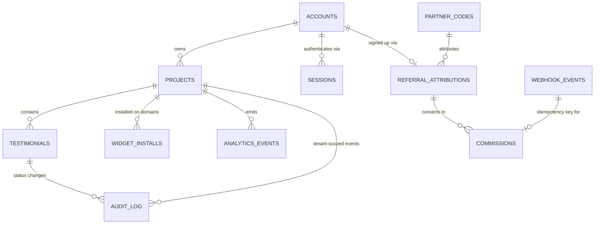

# Architecture — Proofwall

> SPARC Phase: **Architecture**. Источники: [`PRD.md`](PRD.md), [`Specification.md`](Specification.md).
> Architecture Constraints пайплайна (не обсуждаются в этом документе, только выражаются):
> pattern = Distributed Monolith (Monorepo), containers = Docker + Docker Compose,
> infrastructure = VPS (AdminVPS/HOSTKEY), deploy = Docker Compose direct deploy,
> ai_integration = MCP servers. Стек продукта: Next.js + **PostgreSQL в контейнере compose** +
> **MinIO (S3-совместимое объектное хранилище) в контейнере compose** + Claude API (только через
> MCP) + отдельный JS-виджет. Managed BaaS (Supabase, Firebase, Neon и т.п.) не используется —
> см. §9 «Миграция со стека Supabase».

## 1. Обзор системы и границы

Proofwall — distributed monolith в одном монорепозитории. Все данные и файлы продукта живут в
контейнерах, которыми мы владеем и которые деплоятся вместе на один VPS.

- **Внутри границы:** Next.js-приложение (дашборд, форма сбора, публичная стена, API-роуты,
  аутентификация владельцев), отдельно собираемый JS-бандл виджета, MCP-сервер транскрипции,
  фоновый воркер очереди видео, **PostgreSQL** (основная БД) и **MinIO** (хранилище видео) —
  оба как контейнеры docker-compose нашего стека, а не внешние сервисы.
- **На границе (внешние системы):** Claude API (только через MCP-сервер, см. §5), платёжный
  провайдер (webhook, см. ADR-006), сайт клиента-владельца (хост для виджета) и его посетители.
- **Вне scope недели** (см. PRD §1.2): импорт с 30+ платформ, AI-редактирование отзывов, роли/seats,
  Zapier и публичный API. Ни один компонент ниже не проектируется «с запасом» под эти фичи.

Ключевой архитектурный факт недели: **единственный growth loop — badge loop** (FR-GROWTH-003),
и он ломается, если тариф проверяется на клиенте. Это определяет структуру §4.

## 2. Монорепо: разбиение на пакеты

```
proofwall/
├── apps/
│   ├── web/                 # Next.js: дашборд, /f/<slug>, /w/<slug>, все API-роуты, аутентификация
│   └── widget/               # Отдельный билд: только JS-виджет, свой esbuild/vite конфиг
├── services/
│   ├── mcp-claude/           # MCP-сервер: единственная точка входа к Claude API
│   └── worker/                # Фоновый обработчик очереди видео (polling jobs-таблицы)
├── packages/
│   ├── shared-types/          # TS-типы: Testimonial, Project, AnalyticsEvent и т.д.
│   ├── db/                    # SQL-миграции (Postgres), RLS-политики, сгенерированные типы
│   └── ui/                    # Общие React-компоненты дашборда и формы (НЕ виджета)
├── docker-compose.yml
└── docker-compose.prod.yml
```

**Почему `apps/widget` отдельно от `apps/web`, а не общий bundle Next.js:**
NFR требует ≤30 KB gzip и отсутствие блокировки рендера хоста (FR-NFR-PERF-001). Next.js chunk
неизбежно тянет фреймворк-рантайм. Виджет собирается отдельным минимальным тулчейном (vanilla TS +
esbuild), без React, и публикуется как статический файл, который `apps/web` раздаёт по пути
`/widget.js` (либо через CDN-кэш перед VPS — см. §8).

**Почему `services/mcp-claude` — отдельный сервис, а не библиотека внутри `apps/web`:**
Constraint `ai_integration: MCP servers` требует, чтобы Claude API не вызывался напрямую из
бизнес-кода. Дополнительный архитектурный эффект: MCP-сервер физически предоставляет **только один
инструмент — `transcribe_video`**. У него нет инструмента «переписать текст отзыва» или «улучшить
формулировку» — граница FR-NFR-SEC-002 (см. ADR-005) выражена в наборе доступных tool'ов, а не
только в промпте, который можно случайно изменить.

## 3. Модель данных



| Таблица | Ключевые поля | Назначение |
|---|---|---|
| `accounts` | `id`, `email` unique, `password_hash`, `created_at` | Владелец. Аутентификация — внутри монолита, см. §3.2 |
| `sessions` | `id`, `account_id`, `token_hash`, `expires_at`, `revoked_at` | Активные сессии владельцев (§3.2) |
| `projects` | `id`, `account_id`, `slug` unique, `branding jsonb`, `tier enum(free,paid)`, `noindex bool` | Единица арендатора; **всё в системе принадлежит проекту** |
| `testimonials` | `id`, `project_id` NOT NULL, `status enum(pending,approved,rejected,hidden)`, `text`, `video_object_key`, `transcript`, `transcript_status enum(pending,completed,failed) default pending`, `transcript_source enum(machine) default machine` | FR-002…FR-004 |
| `widget_installs` | `id`, `project_id`, `domain`, `first_seen_at`, `last_seen_at`, unique(`project_id`,`domain`) | Источник **метрики недели** и события `widget_installed` |
| `rate_limit_events` | `id`, `scope`, `key`, `created_at`, index(`scope`,`key`,`created_at`) | Единый счётчик скользящего окна для anti-fraud/rate-limit, см. 3.3 |
| `analytics_events` | `id`, `project_id` nullable, `account_id` nullable, `event_type`, `domain`, `metadata jsonb`, `created_at` | Единый append-only журнал §6 |
| `partner_codes` | `id`, `code` unique, `partner_name`, `status enum(active,revoked)` | FR-GROWTH-004 |
| `referral_attributions` | `id`, `account_id` nullable до сайнапа, `partner_code_id`, `source enum(cookie,promo_code)`, `status enum(pending,converted,blocked)` | FR-GROWTH-002 |
| `commissions` | `id`, `referral_attribution_id`, `payment_event_id` unique | Начисление, идемпотентно (ADR-006) |
| `webhook_events` | `provider`, `event_id` unique, `processed_at` | Дедупликация повторной доставки вебхука |
| `audit_log` | `id`, `project_id` nullable, `entity_type`, `entity_id`, `actor_id`, `action`, `reason`, `created_at` | Модерация, self-referral, suspected_fraud, noindex-события |

### 3.1 Мульти-арендная изоляция (FR-NFR-SEC-001) — где именно проверяется

Изоляция проверяется в **двух независимых местах**, и оба обязательны (defense in depth). RLS —
фича самого PostgreSQL, поэтому уход от Supabase её никак не меняет; меняется только то, **как
задаётся контекст арендатора** в соединении (раньше это делал Supabase через `auth.uid()`, теперь —
наш собственный код).

1. **RLS на каждой таблице с `project_id`, роль `app_authenticated`.** Аутентифицированный путь
   (дашборд, модерация) открывает транзакцию и первым делом задаёт контекст арендатора:
   ```sql
   -- в начале транзакции, до любого запроса приложения:
   SET LOCAL app.current_account_id = '<account_id из проверенной сессии>';

   create policy "tenant_isolation_select" on testimonials
     for select using (
       project_id in (
         select id from projects
         where account_id = current_setting('app.current_account_id')::uuid
       )
     );
   -- аналогично для update/delete
   ```
   `SET LOCAL` действует только внутри текущей транзакции — следующий запрос из пула соединений
   не наследует чужой контекст. Это гарантирует, что даже баг в клиентском коде дашборда не даст
   прочитать чужой проект — RLS работает на уровне Postgres, а не приложения.

2. **Явная проверка `project_id` в каждом публичном API-роуте, роль `app_service` (BYPASSRLS).**
   Анонимные пути (форма сбора, виджет, Wall of Love) обращаются к Postgres через отдельную роль
   БД с атрибутом `BYPASSRLS` — RLS для них осознанно обходится (нет `account_id`, который можно
   было бы подставить в `SET LOCAL`), поэтому для них изоляция — обязанность кода: каждый запрос
   обязан резолвить `slug → project_id` и фильтровать `.where('project_id', projectId).where('status',
   'approved')`. Ни один API-роут не принимает `project_id` напрямую от клиента — только `slug`,
   который резолвится сервером. `app_service` — это прямой аналог Supabase service-role: тот же
   принцип (доверенный серверный код обходит RLS осознанно), но роль своя, объявленная в
   `packages/db`-миграциях, а не выданная платформой.

Тест-контракт: интеграционный тест «проект A не может прочитать отзыв проекта B» гоняется и через
аутентифицированный дашборд-путь (проверяет RLS + `SET LOCAL`), и через анонимный API (проверяет
фильтрацию в коде под `app_service`).

### 3.2 Аутентификация владельцев (без Supabase Auth)

Коротко, без изобретательства сверх нужд MVP:

- Пароль хешируется при регистрации (`argon2id`/`bcrypt`) в `accounts.password_hash`, сверяется
  константным по времени сравнением при входе.
- Сессия — непрозрачный токен в httpOnly+Secure cookie; в `sessions` хранится не сам токен, а его
  хеш (`token_hash`) — как и с паролем, компрометация БД не даёт захватить активные сессии.
- Логаут = `revoked_at = now()` для строки сессии; логаут «на всех устройствах» = revoke всех
  строк `account_id`. TTL сессии — sliding-разумный дефолт, точное число не зафиксировано в
  исходных документах — `[GAP: TTL сессии/политика ротации — реализовать разумный дефолт]`.
- Middleware `apps/web` на каждый запрос дашборда: cookie → валидная (не revoked, не expired)
  сессия → `account_id` → открывает транзакцию под ролью `app_authenticated`, делает `SET LOCAL
  app.current_account_id` (см. §3.1) — дальше все запросы этой транзакции автоматически
  RLS-scoped.

### 3.3 Момент ценности vs метрика недели — два разных события (PRD §2.4.1, находка C-1)

`invite_shown` и `widget_installed` — намеренно **разные** события с разной уникальностью, а не
одна и та же запись под двумя именами:

| Событие | Когда | Уникальность | Где хранится факт «уже случилось» |
|---|---|---|---|
| `widget_installed` | виджет впервые отрендерился на **новом** домене | на каждую пару (`project_id`,`domain`) | `widget_installs`, `unique(project_id, domain)` — upsert в §4.2 п.3 |
| `invite_shown` | владелец впервые увидел свою стену живой на внешнем домене | **один раз на проект** | `projects.invite_shown_at` (nullable timestamptz) |

Уникальность `invite_shown` не требует отдельной таблицы: `projects` уже даёт ровно одну строку на
проект, поэтому единственность обеспечивается условным апдейтом одного столбца, а не вторым
`unique`-индексом:

```sql
-- дашборд SSR, при каждом рендере страницы проекта:
-- 1) есть ли хоть одна установка?
SELECT EXISTS(SELECT 1 FROM widget_installs WHERE project_id = $1) AS has_install;
-- 2) если has_install И invite_shown_at ещё не проставлен — это первый показ:
UPDATE projects SET invite_shown_at = now()
  WHERE id = $1 AND invite_shown_at IS NULL
  RETURNING id;               -- вернулась строка ⇒ CTA рендерим и пишем событие invite_shown
                               -- 0 строк ⇒ уже показывали, событие не пишем повторно
```
`RETURNING`-проверка — тот же приём идемпотентности, что и `unique`-constraint в ADR-006: только
один одновременный вызов может выиграть условный `UPDATE ... WHERE invite_shown_at IS NULL`.

**Явное следствие для реализации** (снимает саму находку C-1): установка виджета на **первом**
домене проекта порождает **оба** события — `widget_installed` немедленно при упсерте
`widget_installs`, `invite_shown` при следующем визите владельца в дашборд (п.2 выше находит
`has_install = true` и пустой `invite_shown_at`). Установка на **втором и любом следующем** домене
того же проекта порождает **только** `widget_installed` — `invite_shown_at` уже не `NULL`, второй
`UPDATE` вернёт 0 строк. Таблица `widget_installs` (не `widget_install_events`) и путь
`/api/widget/config` (не `/api/widget-config`) — канонические имена, см. §10.

### 3.4 Anti-fraud и rate limiting — один механизм на три требования (находка W-1)

Три Must-требования из Specification.md — один и тот же класс задачи: «не более N событий за
интервал T по такому-то ключу», то есть счётчик в скользящем окне:

| Требование | `scope` | `key` | окно | порог |
|---|---|---|---|---|
| FR-NFR-SEC-003 (форма) | `form_submission` | `ip || ':' || project_id` | 1 час | 5 |
| FR-GROWTH-004 `@security` (партнёрский код) | `signup_via_partner_code` | `ip` (только для регистраций с непустым `referral_attributions.partner_code_id`) | 10 минут | 50 |
| FR-GROWTH-005 `@security` (создание проектов) | `project_created` | `account_id` | 1 час | 20 |

**Решение: одна таблица Postgres, без Redis.**

```sql
create table rate_limit_events (
  id bigserial primary key,
  scope text not null,
  key text not null,
  created_at timestamptz not null default now()
);
create index rate_limit_events_scope_key_created_idx
  on rate_limit_events (scope, key, created_at desc);
```

Единый серверный помощник (`packages/db`, вызывается из трёх соответствующих API-роутов
`apps/web`, а не размазан по коду каждого роута отдельно):

```sql
insert into rate_limit_events (scope, key) values ($scope, $key);
select count(*) from rate_limit_events
  where scope = $scope and key = $key and created_at > now() - $window::interval;
-- count >= порог ⇒ helper возвращает exceeded = true, роут решает, что делать дальше
```

**Действие при превышении — разное для каждого случая, механизм подсчёта — один:**
- FR-NFR-SEC-003: роут формы отвечает 429, отправка не создаёт `testimonials`.
- FR-GROWTH-004: регистрация не блокируется (не наказываем добросовестного пользователя по
  чужому паттерну IP), но пишется `audit_log` (`reason = 'suspected_fraud'`),
  `referral_attributions.status` для этих записей → `blocked` — комиссия не начисляется
  (ADR-006 уже даёт безопасное «не начислить», отменять начисленное не требуется).
- FR-GROWTH-005: новые проекты аккаунта получают принудительный `noindex = true` — это уже
  описанное поведение ADR-004, здесь только появляется механизм, которым оно вычисляется.

**Почему Postgres, а не Redis, при масштабе «одна неделя, один VPS»:** таблица с
b-tree индексом `(scope, key, created_at)` даёт `COUNT` за доли миллисекунды на объёмах
в тысячи строк — ровно тот трафик, который получит недельный MVP. Redis добавил бы четвёртый
контейнер, отдельную (не)стратегию бэкапа и новый режим отказа (что делать при недоступном
Redis — fail-open или fail-closed), не улучшая ничего на этом масштабе. Это тот же аргумент,
которым в §5 уже обосновано `SELECT ... FOR UPDATE SKIP LOCKED` вместо Redis/BullMQ для очереди
видео — решение согласовано с прецедентом, а не изобретено заново.

Таблица не привязана внешним ключом ни к чему конкретному (`key` — составной текст, разный формат
на каждый `scope`) — это осознанно: разные scope адресуют разные сущности (IP, аккаунт, пара
IP+проект), единый FK создал бы ложную связность.

**Очистка:** `services/worker` (уже поллит Postgres для очереди видео, см. §5) дополнительно раз в
час удаляет строки старше 24 часов — не заводим отдельный сервис ради TTL, который Redis дал бы
«бесплатно», потому что самый широкий порог здесь — 1 час, и 24-часовой запас с большим отрывом
покрывает любую разумную задержку между проверками.

**Путь миграции, если масштаб вырастет** (тот же стиль, что и переход MinIO→volume в §5): при
реальной нагрузке заменить SQL-запрос в помощнике на Redis `INCR`+`EXPIRE` — контракт помощника
(`scope, key, window, limit → exceeded: bool`) не меняется, меняется только реализация под ним.

## 4. Схема виджета

### 4.1 Изоляция от стилей хоста

Виджет рендерится в `Shadow DOM` (`element.attachShadow({mode: 'open'})`), все стили инжектятся
внутрь shadow-root через `<style>`. Полный разбор компромиссов — [ADR-001](ADR.md#adr-001).

### 4.2 Конфигурация и рендер (последовательность)

```
<script src="https://cdn.proofwall.app/widget.js" data-slug="acme" async></script>
```

1. Скрипт находит свой `<script>`-тег, читает `data-slug`, определяет `window.location.hostname`.
2. `GET /api/widget/config?slug=acme&domain=host.example.com` — единственный сетевой запрос.
3. Сервер (Next.js API route, соединение с Postgres под ролью `app_service`):
   - резолвит `slug → project`,
   - **читает `project.tier` из БД** и вычисляет `badge_required = tier !== 'paid'`,
   - `upsert` в `widget_installs (project_id, domain)` — если это первая запись для пары
     `(project_id, domain)`, пишет событие `widget_installed` (метрика недели, см. §6),
   - пишет событие `badge_impression`,
   - возвращает JSON: `{ testimonials: [...approved], branding, badge_required }`.
4. Клиент рендерит карточки внутри shadow-root; если `badge_required`, рендерит badge-элемент.

### 4.3 Почему проверка тарифа обязана быть серверной

`badge_required` — **вычисленное сервером булево поле в ответе**, а не что-то, что клиент решает
сам. Виджет физически не получает `tier` — он получает уже готовое решение. Убрать badge, не имея
API-ключа проекта, невозможно: подделка ответа требует MITM на собственный трафик хоста, что уже
вне модели угроз клиентского JS. Полный разбор — [ADR-002](ADR.md#adr-002).

Дополнительный клиентский anti-tamper (не замена серверной проверке, а вторая линия против
`display:none` через DOM хоста): `MutationObserver` на shadow-host элементе восстанавливает
`style`/`hidden` атрибуты, если внешний скрипт хоста их меняет. Он не может обойти CSS хоста,
который скрывает **сам host-элемент** целиком (`<div id="proofwall-widget">` с `display:none`
вокруг shadow host) — это честно зафиксировано как остаточный риск в ADR-002.

## 5. Хранение и обработка видео

- **Storage:** объектное хранилище — **MinIO** (S3-совместимое API), контейнер docker-compose,
  приватный bucket `testimonial-videos`, key `project_id/testimonial_id.ext`. Публичный доступ —
  только через presigned URL с TTL (стандартный механизм S3-API), выдаваемый API-роутом Wall of
  Love/виджета (никогда не отдаём постоянный публичный URL — совместимо с NFR по
  мульти-арендности).
  - **Почему MinIO, а не просто Docker volume:** presigned upload/download URL — это часть
    S3-протокола; голый bind-mount том не умеет выдавать временные подписанные ссылки, а значит
    заставил бы проксировать загрузку и отдачу видео через `apps/web`, что прямо противоречит
    следующему пункту (не проксировать тело видео через serverless-путь). MinIO даёт S3 API
    «бесплатно» в своём контейнере, сохраняя presigned-паттерн без внешнего облака.
  - **Путь миграции на голый volume** (если MinIO когда-то станет избыточным для масштаба):
    хранить файлы на bind-mount томе `videos_data:/data`, отдавать через отдельный
    authenticated-роут `apps/web` с собственной короткоживущей подписанной ссылкой (HMAC над
    `object_key + expiry`), проверяемой в middleware. Меняется только реализация выдачи ссылки —
    контракт `signed URL с TTL`, на который завязан §4 и Wall of Love, не меняется.
- **Приём:** форма загружает файл напрямую в MinIO через presigned upload URL (не проксируется
  через `apps/web`, чтобы не упереться в лимиты serverless-функций по размеру тела запроса).
- **Транскрипция — очередь, не синхронный вызов:**
  1. После успешной загрузки видео в `testimonials` пишется `video_object_key` (ключ объекта в
     MinIO, **не** presigned URL — presigned-ссылка временная и не переживёт до момента, когда до
     неё дойдёт очередь; см. §10 «Канонические имена») и `transcript_status = 'pending'`.
  2. `services/worker` поллит записи с `transcript_status = 'pending'` (простой
     `SELECT ... FOR UPDATE SKIP LOCKED` по Postgres — без Redis/доп. инфраструктуры ради
     простоты недели; тот же принцип применён к anti-fraud счётчикам в §3.4).
  3. Worker формирует presigned GET URL **из `video_object_key`** на объект в MinIO и вызывает
     `services/mcp-claude` по MCP-протоколу, инструмент `transcribe_video(video_url)` — presigned
     URL живёт только на время этого вызова, в БД он не попадает.
  4. МCP-сервер скачивает видео по presigned URL, отправляет аудио-дорожку в Claude API **только с
     промптом транскрипции**, получает текст, возвращает его воркеру.
  5. Worker пишет результат в `testimonials.transcript`, `transcript_source = 'machine'`,
     `transcript_status = 'completed'`. Если вызов MCP не удался —
     `transcript_status = 'failed'`, отзыв остаётся видимым в модерации без транскрипта; авто-retry
     — `[GAP: политика повторных попыток транскрипции не зафиксирована — вне scope MVP-недели]`.
- **На Wall of Love** транскрипт рендерится с явной пометкой «Машинная расшифровка» — того требует
  FR-NFR-SEC-002 / ADR-005.

## 6. Где живут события аналитики (обязательный слот)

Единая таблица `analytics_events` (append-only, без апдейтов), пишется **только серверным кодом**
(никогда напрямую с клиента — иначе события можно подделать или потерять при блокировщиках рекламы).

| Событие | Где инструментируется | Триггер |
|---|---|---|
| `invite_shown` | `apps/web`, дашборд SSR-компонент | Первый успешный рендер виджета на **внешнем** домене владельца (см. §4.2 п.3) — читает `widget_installs`, показывает CTA |
| `invite_sent` | `apps/web`, API-роут `/api/share` | Владелец подтвердил диалог публикации (FR-GROWTH-001 @security — без подтверждения запрос не уходит) |
| `badge_impression` | `apps/web`, API-роут `/api/widget/config` | Каждый ответ конфигурации виджета с `badge_required = true` |
| `badge_click` | `apps/web`, API-роут `/api/widget/badge-click` (виджет шлёт `navigator.sendBeacon`, сервер валидирует и пишет событие + добавляет UTM) | Клик по badge-ссылке |
| `signup_from_badge` | `apps/web`, обработчик после успешной регистрации (модуль аутентификации, §3.2) | Регистрация с UTM-меткой источника badge в query/cookie |
| `widget_installed` | `apps/web`, API-роут `/api/widget/config` (§4.2 п.3) | Первая запись пары `(project_id, domain)` в `widget_installs` |
| `referral_attributed` | `apps/web`, платёжный webhook-обработчик (см. ADR-006) | Оплата с непустой `referral_attributions` |

Все обработчики событий — тонкие вставки в уже существующие серверные пути (нет отдельного
«аналитического сервиса» ради простоты недели). `metadata jsonb` хранит контекст (domain, UTM,
partner_code) без изменения схемы под каждое новое поле.

## 7. Docker Compose

Все сервисы — наши; managed-зависимостей больше нет. Одна команда `docker compose up` поднимает
полный стек.

```yaml
services:
  postgres:
    image: postgres:16-alpine
    environment:
      - POSTGRES_DB
      - POSTGRES_USER
      - POSTGRES_PASSWORD       # секреты — только имена переменных, значения в .env / secrets
    volumes:
      - postgres_data:/var/lib/postgresql/data
    healthcheck:
      test: ["CMD-SHELL", "pg_isready -U $$POSTGRES_USER"]

  minio:
    image: minio/minio
    command: server /data
    environment:
      - MINIO_ROOT_USER
      - MINIO_ROOT_PASSWORD
    volumes:
      - minio_data:/data
    expose: ["9000"]

  web:
    build: ./apps/web
    environment:
      - DATABASE_URL             # postgres:// строка, включает роли app_authenticated/app_service
      - SESSION_SECRET
      - S3_ENDPOINT
      - S3_BUCKET
      - S3_ACCESS_KEY
      - S3_SECRET_KEY
      - MCP_CLAUDE_URL=http://mcp-claude:7331
    ports: ["3000:3000"]
    depends_on: [postgres, minio, mcp-claude]

  worker:
    build: ./services/worker
    environment:
      - DATABASE_URL
      - S3_ENDPOINT
      - S3_BUCKET
      - S3_ACCESS_KEY
      - S3_SECRET_KEY
      - MCP_CLAUDE_URL=http://mcp-claude:7331
    depends_on: [postgres, minio, mcp-claude]

  mcp-claude:
    build: ./services/mcp-claude
    environment:
      - ANTHROPIC_API_KEY
    expose: ["7331"]

  caddy:
    image: caddy:2-alpine
    ports: ["80:80", "443:443"]
    volumes:
      - ./Caddyfile:/etc/caddy/Caddyfile
      - caddy_data:/data
    depends_on: [web]

volumes:
  postgres_data:
  minio_data:
  caddy_data:
```

**Порядок запуска:** `postgres` и `minio` — первыми (healthcheck перед стартом зависимых), затем
`mcp-claude` (не зависит ни от кого), затем `web`/`worker`, затем `caddy`. Миграции (`packages/db`)
прогоняются CI-шагом до `up -d` на новых версиях образа `web`, не как отдельный сервис compose.

**Что бэкапить (теперь наша ответственность, раньше — задача Supabase):**
- `postgres`: логический дамп (`pg_dump`) по расписанию (cron на VPS вне compose, либо
  `docker compose exec postgres pg_dump ...`), а не сырое копирование тома — консистентность
  важнее скорости для объёма данных недели.
- `minio_data`: зеркалирование содержимого бакета (`mc mirror`) на внешнее хранилище/другой VPS.
  Дамп БД и зеркало видео стоит синхронизировать по времени — `testimonials.video_object_key`
  ссылается на файл в MinIO, рассинхрон бэкапов создаёт «битые» ссылки после restore.
- `caddy_data` бэкапить не обязательно — переиздаётся автоматически (Let's Encrypt).

`widget.js` собирается в CI и копируется в `apps/web/public/widget.js` на этапе билда — отдельного
контейнера для виджета не заводим, раздаёт его `web`/`caddy`.

## 8. Деплой на VPS

- **Инфраструктура:** один VPS (AdminVPS/HOSTKEY), Docker + Docker Compose, без оркестратора —
  оправдано масштабом «одна неделя, один продукт».
- **Пайплайн:** CI (GitHub Actions) → build образов → миграции `packages/db` → `docker compose -f
  docker-compose.prod.yml pull && up -d` по SSH на VPS. Секреты — через CI secrets, инжектятся в
  `.env` на сервере, не коммитятся.
- **TLS/reverse proxy:** Caddy перед `web` — автоматический HTTPS по домену, отдаёт `widget.js` с
  агрессивным `Cache-Control` (файл версионируется по content-hash в имени при билде, чтобы кэш
  не мешал релизам).
- **Домены Wall of Love:** MVP отдаёт `/w/<slug>` под собственным доменом продукта
  (`proofwall.app/w/<slug>`), без кастомного CNAME клиента — `[GAP: нужно решение по Q3 PRD —
  собственный поддомен vs CNAME клиента; блокирует SEO-стратегию FR-GROWTH-005 за пределами MVP]`.
- **Откат:** предыдущий tag образа хранится в registry; откат — `docker compose up -d` с прошлым
  тегом. Данные (`postgres`, `minio`) не откатываются вместе с образом — откат кода не равен
  откату схемы БД, миграции пишутся обратимыми там, где это дёшево. Отдельного blue/green нет —
  вне scope недели.

## 9. Миграция со стека Supabase

В исходную постановку задачи по ошибке попал Supabase (managed BaaS) — прямой конфликт с
Architecture Constraints пайплайна (`containers: Docker + Docker Compose`, база данных должна жить
в контейнере compose на своём VPS, а не в стороннем облаке). Решение пересмотрено на этапе
Architecture, без потери принятых продуктовых и ADR-решений:

- **Postgres** переехал из managed-облака Supabase в контейнер `postgres` docker-compose (§7).
- **Supabase Auth** заменён аутентификацией внутри монолита: `accounts.password_hash` +
  `sessions` (§3.2) — тот же контракт «владелец залогинен → есть `account_id`», другая реализация.
- **Supabase Storage** заменён контейнером **MinIO** (S3-совместимое API, §5) — presigned
  upload/download сохранён как паттерн, изменился только эндпоинт.
- **RLS не убирался и не менялся** — это фича PostgreSQL, а не Supabase; изменился только способ
  задать контекст арендатора (`SET LOCAL app.current_account_id` вместо `auth.uid()`, §3.1).
- Все ADR-001…006, схема данных (кроме `accounts`/`sessions`), growth-события §6 и разбиение
  монорепо §2 остались как есть — конфликт был только в инфраструктурном слое.

## 10. Открытые пробелы (GAP)

- `[GAP: нужна конкретная цена платного тарифа (PRD Q1) — влияет только на биллинг-копирайт, не на схему данных]`
- `[GAP: нужен лимит бесплатного тарифа по числу отзывов (PRD Q2) — влияет на constraint в `projects`/`testimonials`, схема готова принять любое число]`
- `[GAP: нужно решение по домену Wall of Love (PRD Q3) — влияет на §8 и на будущую поддержку CNAME]`
- `[GAP: нужен выбор платёжного провайдера (Stripe и т.п. не назван в исходных документах) — ADR-006 описывает контракт идемпотентности провайдер-агностично]`
- `[GAP: TTL сессии владельца и политика ротации/revoke-all не зафиксированы в исходных документах — реализовать разумный дефолт (§3.2)]`
- `[GAP: политика бэкапов Postgres/MinIO (частота, retention, offsite-копия) не зафиксирована в исходных документах — реализовать разумный дефолт (ежедневный `pg_dump` + `mc mirror`), уточнить при росте нагрузки]`
