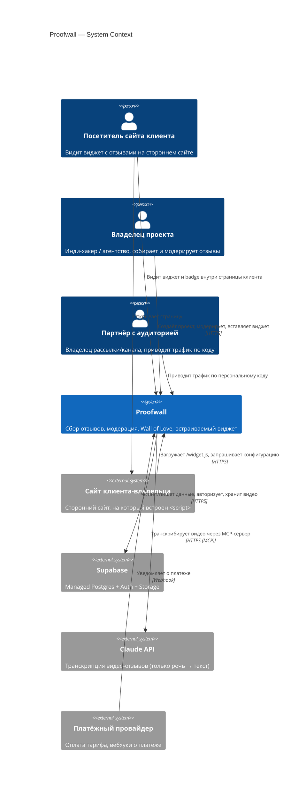
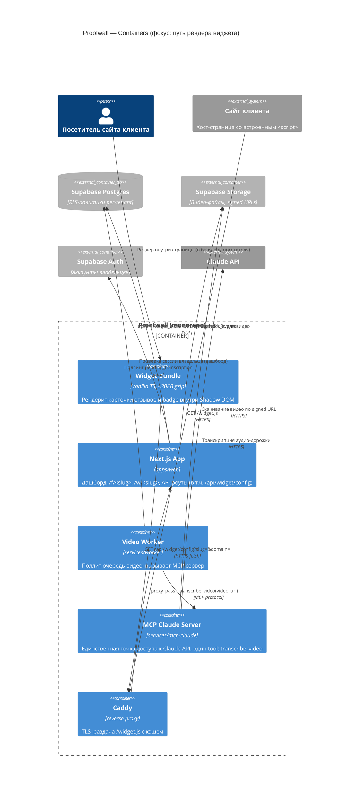
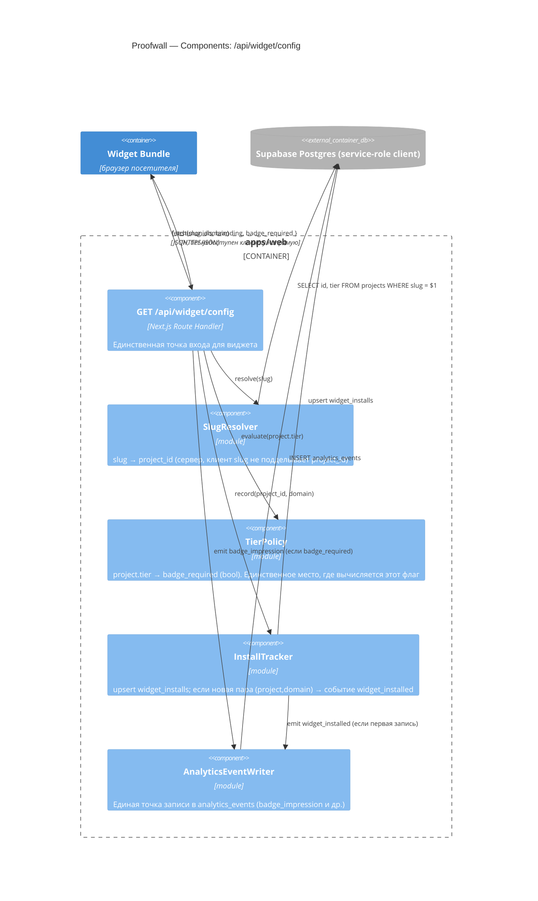

# C4 Diagrams — Proofwall

> Ключевой поток для детализации: **рендер виджета с серверной проверкой тарифа**
> (FR-006, FR-GROWTH-003). См. [`Architecture.md`](Architecture.md) §4 для прозы.

## Уровень 1 — System Context

## Уровень 2 — Container

## Уровень 3 — Component (внутри `apps/web`: рендер виджета + проверка тарифа)

## Примечания к диаграммам

- Виджет **никогда** не получает поле `tier` — только вычисленное `badge_required`. Это архитектурно
  исключает подмену тарифа на клиенте (см. [ADR-002](ADR.md#adr-002)).
- `TierPolicy` — единственное место в кодовой базе, принимающее решение о badge. Дублирования этой
  логики в других роутах быть не должно (проверяется код-ревью / линт-правилом на импорт модуля).
- Уровень 3 намеренно ограничен одним потоком (виджет + тариф), как задано в требовании к документу;
  остальные потоки (модерация, партнёрская атрибуция) детализируются по необходимости отдельно.
