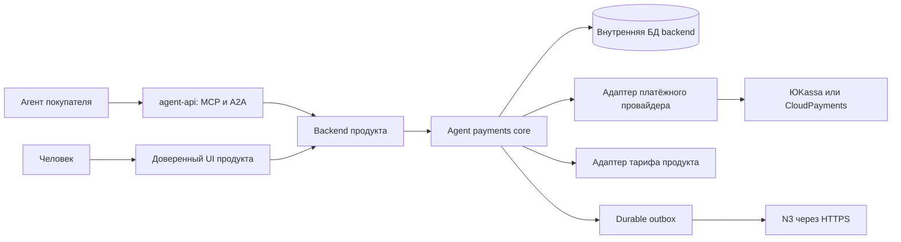

# Переносимый модуль агентных покупок

Дата: 2026-09-10. Статус: **архитектура для реализации**, код пакетов ещё не создан.
Продолжает [сценарий покупки](plan.md) и учитывает
[исследование готовых решений](../../research/agentic-payments-build-vs-buy.md).
Профиль риска XL: деньги, идентификация, делегирование. Этот документ проектирует
модуль; он не подтверждает работоспособность новых платёжных сценариев.

## Решение и границы переносимости

Создаём библиотеку с независимым ядром и адаптерами. В первой версии ядро работает
в backend продукта, рядом с его биллингом. Отдельный Docker-контейнер `agent-api`
предоставляет MCP/A2A и вызывает backend по аутентифицированному внутреннему API.
Это соответствует распределённому монолиту: одна предметная логика покупки,
несколько контейнеров с явными обязанностями.

Модуль не знает о Proofwall, виджетах, цене 990 ₽, N3 и партнёрской ставке 20%.
Он знает покупателя, продавца, ресурс, предложение, поручение, заказ и платёж.
Цена, eligibility, активация тарифа и реферальная политика подключаются адаптерами продукта.

**Переносим код и контракты, а не согласия, карты и деньги между магазинами.**
У каждого продукта собственное развёртывание, credentials, namespace данных и
разрешения. Общего платёжного сервера на восемь проектов в v1 нет.
Техническая переносимость не означает опубликованную лицензию: лицензию отдельного
пакета владелец выбирает перед внешним распространением.

## Состав будущего пакета

Предлагаемое место исходников внутри P1:
`packages/agent-payments/`. Это переносимый workspace с независимым manifest,
lockfile и проверками; остальные приложения подключают только его публичные exports.
Ниже имена модулей внутри workspace, а не уже опубликованные npm-пакеты.

```text
packages/agent-payments/
  modules/contracts/             DTO, версии событий и JSON Schema
  modules/core/                  поручения, бюджет, заказы, переходы состояний
  modules/storage-postgres/      миграции, транзакции, блокировки, inbox/outbox
  modules/provider-yookassa/     create, query, verify, saved-method handling
  modules/provider-cloudpayments/ отдельный последующий адаптер
  modules/transport-http/        backend command API
  modules/transport-mcp/         MCP tools -> те же команды
  modules/transport-a2a/         A2A tasks -> те же команды
  examples/reference-host/       минимальный продукт без Proofwall и N3
  conformance/                   контрактные и конкурентные проверки
  README.md                     подключение, миграции, эксплуатация
```

Обязательные v1: contracts/core/Postgres/HTTP/ЮKassa/MCP и согласованный A2A-сценарий.
CloudPayments — отдельный адаптер по потребности, ACP/UCP — будущие входные адаптеры.
Не генерируем пустые «готовые интеграции». AP2-совместимость потребует самостоятельной
проверки участвующих сторон, как указано в исследовании.

Зависимости направлены внутрь: transport → contracts, core → contracts/ports,
адаптеры реализуют ports. `core` не импортирует Next.js, MCP SDK, SDK PSP или код продукта.
Product host собирает зависимости. В адаптерах нет второго обработчика списания.

## High level



Стрелки показывают вызовы, а не новые контейнеры для каждой коробки.
`core`, provider/product adapters и storage входят в backend/его worker.
Только backend и backend worker имеют доступ к сети БД. У `agent-api` нет DB credentials
или ключей PSP. БД не публикует порты даже в тестах, пароли случайные.
Между контейнерами проектов 1 и 3 общей сети нет. Проверка портов обязательна до запуска.

## Контракты расширения

| Port | Ответственность host/адаптера | Гарантия для core |
|---|---|---|
| `IdentityPort` | Проверить субъект, проект и аутентифицированное подтверждение человека | Стабильные scoped IDs; роль owner не выводится из слов агента |
| `OfferPort` | Рассчитать цену, товар, срок услуги, eligibility и версию условий | Авторитетный quote; core сохраняет snapshot с expiry |
| `ProviderPort` | Создать/найти/проверить платёж, подтвердить сохранение метода | Явные capabilities, нормализованное состояние и закрытые provider evidence |
| `FulfillmentPort` | Применить оплаченный продукт и обработать возврат | Идемпотентность по domain event ID; поддержка локального UnitOfWork |
| `AttributionPort` | Проверить рекомендацию и подготовить внешний заказ до оплаты | Только проверенный opaque binding; политика комиссии вне core |
| `StorePort` | Транзакции, уникальность, budget reservations, audit, inbox/outbox | Нельзя заменить набором независимых CRUD-запросов |
| `Clock`, `IdPort`, `SecretResolver` | Время, ID и обращение к секретам | Управляемые тесты; секреты не появляются в публичных DTO |

Пример формы контракта, не реализация:

```ts
type Money = { currency: string; minor: string }; // целое число, не float
type Scope = { merchantId: string; buyerId: string; resourceId: string };
type PaymentState = 'prepared' | 'action_required' | 'pending'
  | 'unknown' | 'succeeded' | 'failed' | 'canceled';
type NextAction = { kind: 'open_url'; url: string; expiresAt: string }
  | { kind: 'wait'; retryAfterSeconds: number } | { kind: 'none' };
type OrderView = {
  orderId: string; paymentStatus: PaymentState;
  fulfillmentStatus: 'not_started' | 'pending' | 'active' | 'review_required';
  attributionStatus: 'none' | 'pending' | 'confirmed' | 'rejected';
  nextAction: NextAction;
};
```

Money хранится как целое число минимальных единиц; provider adapter проверяет
поддерживаемую валюту и границы. Наличие currency в схеме не включает конвертацию
или мультивалютный бюджет: каждый бюджет относится к одной валюте.
`Scope` строит сервер после проверки identity, клиент не назначает себе merchant/buyer.

Команды ядра: `GetOffer`, `StartBuyerLink`, `GetBuyerLink`, `AttachAttribution`,
`CreateOrder`, `ExecutePayment`, `GetOrder`, `RevokeGrant`, `RevokeMandate`.
UI, MCP, A2A и worker используют один command handler. Права на каждую команду
проверяются внутри backend, включая запросы от доверенного транспорта.
Service credential gateway подтверждает вызывающий сервис, но не заменяет buyer grant.
Backend проверяет audience токена и принадлежность всех объектов на каждой команде.
Worker имеет отдельную сервисную identity; он не изображает пользователя или агента
и может продлевать только по явно выданному разрешению на автоматическое расписание.

`CreateOrder` не списывает деньги. Только `ExecutePayment` проходит финансовые
проверки и может вызвать PSP. UI выдачи/отзыва согласия — отдельный authenticated путь;
агент не получает инструмент «выдать самому себе поручение».

## Модель данных и единственный источник состояния

Storage adapter владеет таблицами с namespace `agent_payments`, миграциями и индексами:

- `buyer_links`, `agent_grants`, `payment_consents`, `mandates` — отдельные сущности;
- `method_refs` — закрытые ссылки на средства PSP с merchant/provider/account binding;
- `quotes`, `orders`, `payment_attempts` — snapshot и история операций;
- `budget_accounts`, `budget_reservations`, `spend_entries` — общий расход;
- `inbox`, `outbox`, `audit_events` — повторная доставка и расследование результата.

Каждая сущность имеет merchant scope. Внешние provider IDs уникальны в паре
с provider account; запрос по одному чужому `orderId` не даёт доступ.
Agent grant, согласие на сохранение метода и финансовое поручение не взаимозаменяемы.
Отзыв одного grant запрещает этому агенту исполнение, но не означает отзыв всех
поручений. Отзыв mandate блокирует новые исполнения по нему независимо от инициатора.

Для legacy Proofwall существующие invoice/intent остаются авторитетными для текущего
UI checkout до отдельного перевода. Новый order хранит уникальную ссылку на этот intent;
одно PSP-событие маршрутизируется к одному владельцу перехода состояния. Перед
подключением нового checkout фиксируем таблицу владельцев полей и cutover-план:
нельзя дать legacy webhook и модулю независимо продлить один тариф.

Новый модуль отвечает за разрешение/резерв/attempt, существующий финансовый pipeline
P1 — за применение подтверждённой оплаты и тариф до завершения миграции. Adapter
передаёт один проверенный результат в этот pipeline и получает идемпотентный receipt.
После перехода на модуль provider status имеет одного владельца, без двойной записи.

Событие содержит `eventId`, `schemaVersion`, `merchantId`, `orderId`, `attemptId`,
`aggregateVersion`, тип, сумму, ресурс, время и correlation ID. Повтор сохраняет ID.
Потребитель дедуплицирует событие и бизнес-эффект, сверяет порядок версий; поздний paid
не отменяет уже известный refund. Есть durable retry, очередь неразобранных ошибок
и сверка. Токены методов, secrets и полные платёжные payload в события не попадают.

## Исполнение и сбои

1. Backend проверяет identity, grant, quote, поручение, метод, eligibility и attribution.
2. В короткой транзакции блокирует общий budget account, проверяет лимиты и период,
   создаёт order/attempt и резерв. Scope идемпотентности включает merchant, субъект,
   операцию и hash payload. Тот же ключ с другим payload возвращает конфликт.
3. Отдельный dispatch шаг повторно проверяет expiry/revoke, фиксирует право одной
   попытки на отправку. Сетевой вызов PSP идёт вне SQL-транзакции.
4. Provider получает стабильный ключ попытки. При потере ответа состояние `unknown`:
   сохраняются резерв и запрет второго списания до сверки. После истечения окна
   идемпотентности PSP нельзя слепо повторять create даже с прежним ключом.
5. Проверенный результат применяется один раз: платёж, расход, fulfillment и outbox.
   Webhook и poll вызывают один обработчик, уникальность защищает от конкуренции.
6. N3 получает событие через outbox; временный сбой N3 не отменяет оплаченный тариф.

Способ проверки webhook зависит от PSP: подпись и/или серверное получение объекта
по правилам конкретного провайдера. Универсального предположения «все подписывают HMAC»
нет. Adapter проверяет merchant account, TEST/live режим, сумму и валюту; внутренние
provider reasons сохраняет, не смешивая разные причины pending в публичное «успешно».

Отзыв и отправка имеют явный порядок: если отзыв зафиксирован раньше dispatch fence,
вызова PSP не будет. Если отправка уже разрешена, платёж досверяется; обещания
«мгновенно отменить уже отправленное списание» нет. Lease worker не должен разрешать
вторую отправку при неизвестном результате первой.

Budget account общий для всех grants и поручений одной расходной области покупателя:
новый агент или перевыпуск mandate не обнуляют месячный расход. Проверяются и общий
лимит, и ограничения конкретного поручения. Unique resource/billing-period запрещает
обход через новый idempotency key. UI и worker должны использовать тот же учёт.

Успешный платёж не превращается в failed при рефанде. Возвраты — отдельные события
с уникальными IDs и суммой, включая частичные; fulfillment может требовать review,
N3 обрабатывает корректировку своим адаптером. Возврат не восстанавливает бюджет v1.
После окончательного отказа нет автоматического создания нового списания в v1.

## Транзакционная граница и возможное выделение сервиса

**Режим v1: библиотека в backend.** Изменение payment state, запись outbox и локальное
применение тарифа используют один UnitOfWork существующей БД. FulfillmentPort не
открывает независимую транзакцию и не вызывает внешнюю сеть внутри неё. Внешние эффекты
публикуются через outbox. Если тариф нельзя применить локально, он остаётся pending.

**Будущий режим: отдельный payment service.** Это отдельная миграция, а не смена URL:
сервис владеет своей БД, продукт принимает версионированные события через inbox,
применяет тариф и возвращает receipt. Нужны повторная доставка, сверка, права доступа
и отдельная проверка eventual consistency. Распределённой SQL-транзакции нет.
Публичный статус уже разделяет payment/fulfillment, поэтому контракт клиента сохраняется.

Предпочтение v1 сокращает операционные расходы и сохраняет локальную атомарность.
Код при этом отчуждаем: его независимость доказывается reference host, а не количеством
микросервисов. N3 остаётся внешним потребителем бизнес-событий в обоих режимах.

## Подключение другого продукта

1. Подключить фиксированную версию workspace/пакета и прогнать миграции на своей БД.
2. Реализовать Identity/Offer/Fulfillment; Attribution подключить только при необходимости.
3. Настроить собственный PSP account через secret references и проверить capabilities.
   Отсутствующий saved-method capability даёт assisted flow, а не фиктивную автономность.
4. Подключить доверенный UI связи, согласия и отзыва. URL handoff создаёт сервер,
   допускает только заданные origins; one-time pairing имеет expiry и защиту от CSRF/replay.
5. Запустить gateway без DB/PSP credentials и включить команды в конкретном агентном клиенте.
6. Пройти conformance-набор на TEST, затем продуктовый E2E покупки и возврата.

N3 подключается опциональным адаптером в host-продукте. Без него core может продавать
продукт, но не сообщает об успешной реферальной атрибуции. Обязательность атрибуции
для конкретного предложения задаёт host; её нельзя молча выключить при сбое N3.

Конфигурация не содержит цену или лимиты по умолчанию. При отсутствии денежной политики
автономное исполнение выключено. Нужные поля: merchant namespace, provider account ref,
supported currencies, allowed handoff origins, quote/pairing TTL, policy version,
budget calendar/timezone, capabilities и подписчики событий. Лимиты подтверждает человек.

## Версионирование, отчуждение и приёмка

Публичные exports и события имеют версию; изменения несовместимой семантики требуют
новой major/schema version. Provider payload остаётся внутренним и очищается в audit.
Миграции последовательные, с проверкой совместимости приложения; rollback приложения
допустим только при совместимой схеме. Не обещаем автоматический downgrade данных.

Готовность к переносу проверяем следующими условиями:

- reference host вне исходников P1 собирается из чистого checkout модуля;
- нет импортов Proofwall/N3, root `.claude`, секретов VPS или абсолютных путей;
- второй host использует другую цену/товар и работает без реферального адаптера;
- два merchant namespace не читают чужие orders, grants и method refs;
- все transports исполняют одинаковые команды и отказы;
- конкуренция, повтор webhook, новый ключ, refund и restart не дублируют деньги/тариф;
- grant/mandate revoke, expiry, price change и неизвестный результат закрыты тестами;
- ослабление бюджетной/merchant/дедуп-проверки ловится мутационным тестом;
- первый human handoff и последующий разрешённый повтор проходят UI/agent E2E в TEST;
- README позволяет подключить пакет без знаний монорепозитория; лицензии зависимостей
  и выбранная лицензия модуля проверены перед публикацией.

Первый этап реализации: contracts/core и reference host с fake PSP, затем Proofwall
adapter и assisted checkout, после этого реальный TEST saved-method сценарий.
Публикация npm, отдельный GitHub-репозиторий и выделенный центральный сервис не входят
в текущую задачу проектирования.

Независимое архитектурное ревью: получен и проверен 1/1 файловый результат.
Его условия транзакционной границы, cutover, authority и порядка событий включены выше.
[Телеметрия проектирования](../../telemetry/p-replicator/20260910T070614Z-agent-payments-module-3116/run.json).
