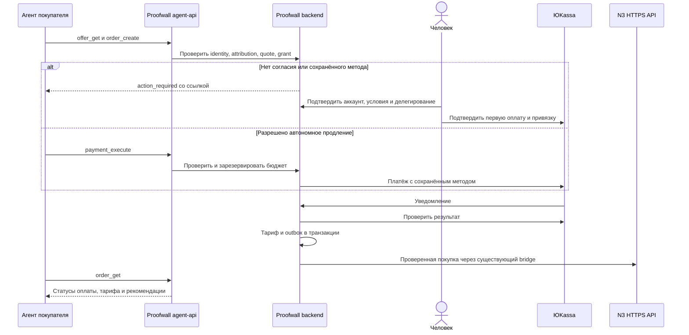

# Агент-покупатель Proofwall: сценарии и план реализации

Дата: 2026-09-10. Статус: **утверждён владельцем 2026-09-10, реализация начата**.
Риск XL: деньги, идентификация, делегирование и межпроектная атрибуция.
Цель: агент получает предложение, связывается с покупателем, оформляет покупку,
сохраняет рекомендацию и проверяет получение тарифа без ручной навигации по сайту.

Дополнение по запросу владельца: [архитектура переносимого модуля](modular-architecture.md)
определяет независимое ядро, адаптеры продукта/PSP/транспорта и критерии подключения
других проектов. Оно уточняет устройство реализации, не меняя границ согласия
человека и TEST-этапов этого плана.

## Ответ на главный вопрос

**Агент сможет инициировать платёж без участия человека в момент списания**,
если пользователь заранее подключил разрешённый способ автоплатежа в этом
магазине и выдал агенту действующее ограниченное поручение. Само списание
выполняет ЮKassa по серверному запросу Proofwall, а не модель с реквизитами карты.

ЮKassa документирует сохранение способа оплаты с согласием пользователя и
повторные списания без дополнительного подтверждения. По умолчанию автоплатежи
доступны в тестовом магазине, для реального требуется обращение к менеджеру.
Это возможность провайдера, не подтверждение настройки нашего магазина.
[Источник: основы автоплатежей](https://yookassa.ru/developers/payment-acceptance/scenario-extensions/recurring-payments/basics).

**Первое знакомство с продуктом и согласие на деньги не исчезают.** В предлагаемой
версии человек связывает свой аккаунт с агентом, подтверждает условия и, при
необходимости, проходит платёжную форму/банк. Сохранённая карта сама по себе
не означает согласия на любые будущие решения модели.

## Матрица участия человека

| Ситуация | Агент | Человек | Поведение системы |
|---|---|---|---|
| Новый покупатель без аккаунта | Получает предложение и ссылку связывания | Регистрируется/входит, подтверждает email, выбирает проект и права | До завершения нет доступа к приватным данным и оплате |
| Первая покупка без сохранённого метода | Создаёт заказ | Подтверждает условия, платит на странице провайдера, при необходимости проходит банк | Заказ ждёт подтверждения провайдера |
| Разовая покупка существующим клиентом без автономного поручения | Готовит заказ | Подтверждает каждую покупку | Сохранённый метод не включает автономность автоматически |
| Повторное продление с действующим поручением | Проверяет срок, получает quote, инициирует списание в лимитах | Не участвует в штатной покупке | Backend проверяет все ограничения, затем вызывает ЮKassa |
| Подорожание, другой продукт, валюта или превышенный лимит | Сообщает, какое согласие нужно | Подтверждает новые условия или отказывает | Прежнее согласие не расширяется автоматически |
| Метод не сохранён, недействителен или разрешение отозвано | Возвращает action required | Выбирает и подтверждает оплату | Без автоматического перебора карт и способов |
| Ответ провайдера потерян | Читает прежний заказ | Обычно не нужен | Сверка, без новой попытки списания вслепую |
| Длительно неясный результат | Показывает pending/reconciliation | При необходимости оператор | Не предлагать повторную оплату до сверки |
| Платёж успешен, N3 недоступен | Сообщает об активном тарифе и ожидающей обработке рекомендации | Не нужен | Outbox повторяет доставку комиссии |

## Сценарий A — первая покупка с человеком

1. Агент получает `offer`: Proofwall, проект покупателя, тариф 30 дней,
   990 ₽/RUB для первой версии, версия условий, срок действия предложения.
2. Получает партнёрскую ссылку/промокод от пользователя. Сервер проверяет
   источник; данные сторонних страниц не считаются инструкциями к оплате.
3. Если аккаунт не связан, создаётся короткоживущая заявка связи. Человек открывает
   страницу Proofwall, входит/регистрируется, подтверждает почту и видит имя агента,
   продукт, проект и запрашиваемые права. Пароль/почтовый токен не передаются агенту.
4. Человек подтверждает разовую покупку и отдельно, по желанию, условия будущих
   автоплатежей. По умолчанию разрешено только подготовить заказ и прочитать статус.
5. Backend сохраняет проверенную атрибуцию по стабильному покупателю и дожидается
   подтверждения N3, как существующий bridge. Создаёт intent и внешний заказ N3.
6. Для оплаты выдаётся `nextAction: open_url` на доверенную платёжную страницу.
   Человек вводит платёжные данные у провайдера и проходит банковскую проверку,
   если она требуется. Агент не просит CVV, пароль банка или код из SMS.
7. Агент периодически вызывает `order.get`. Return URL и фраза клиента «я оплатил»
   не меняют финансовое состояние.
8. Проверенный webhook/сверка применяет тариф и outbox атомарно. N3 повторно
   проверяет провайдера и рассчитывает комиссию. Агент покупателя получает только
   статус обработки рекомендации, без чужих комиссий и личных данных партнёра.

Участие банка зависит от сценария подтверждения. Оно может включать 3-D Secure
или SMS, но не обязательно одинаково для каждой покупки.
[Источник: процесс платежа](https://yookassa.ru/developers/payment-acceptance/getting-started/payment-process).

## Сценарий B — последующее продление без нового клика человека

Предлагаемый пример поручения, а не уже включённая настройка:

> Разрешаю агенту продлевать тариф Proofwall для проекта X на 30 дней,
> не более 990 ₽ за покупку и 990 ₽ в календарный месяц по Europe/Moscow,
> только в последние 3 дня оплаченного срока, не более одного заказа продления
> на один расчётный период. Разрешение действует 90 дней и может быть отозвано.

1. Метод привязан именно к магазину Proofwall, поручение действительно, цена и
   продукт совпадают. Нельзя перенести его на проект 02 или другого продавца.
2. Агент вызывает `order.create`, затем `payment.execute` с quote и ключом повтора.
3. Backend проверяет аккаунт, grant, поручение, текущую цену, период, предыдущие
   заказы, общий расход всех агентов и доступный бюджет. Резервирует сумму.
4. Сервер подставляет сохранённый `payment_method_id`; агент не выбирает произвольный
   идентификатор платёжного средства и не получает credentials магазина.
5. ЮKassa принимает запрос без новой пользовательской формы в этом сценарии.
   Результат может быть успехом, ожиданием или отказом, а не гарантированным списанием.
6. Backend подтверждает результат, активирует тариф, отправляет событие N3 и
   фиксирует расход бюджета. Агент сообщает результат пользователю.

ЮKassa описывает запрос с `payment_method_id` для автоплатежа. `pending` возможен,
например, при ожидании регистрации чека; его нельзя трактовать как успех.
[Источник: проведение автоплатежа](https://yookassa.ru/developers/payment-acceptance/scenario-extensions/recurring-payments/pay-with-saved).

Для привязки во время первоначальной оплаты используется `save_payment_method`.
Хранить метод как пригодный к повторам можно только после серверной проверки
`payment_method.saved=true`, с привязкой к владельцу и магазину. Отказ сохранить
метод не отменяет уже успешную разовую покупку.
[Источник: сохранение метода](https://yookassa.ru/developers/payment-acceptance/scenario-extensions/recurring-payments/save-payment-method/save-during-payment).

## Отказы и возвращение человека в цепочку

Нельзя обещать, что любое автосписание превратится в интерактивный 3DS challenge.
При окончательном отказе система показывает причину и предлагает новый
интерактивный заказ только после подтверждения пользователем.
При `permission_revoked` ЮKassa требует новую оплату с подтверждением пользователя.
Статус `canceled` окончательный, повторная покупка создаёт новый объект платежа.
[Источник: неуспешные платежи](https://yookassa.ru/developers/payment-acceptance/after-the-payment/declined-payments).

Предлагаемые ограничения: никаких автоматических повторных списаний после
окончательного отказа в первой версии. Повтор HTTP с тем же ключом при сетевом
сбое допустим как доставка одной операции. Пока результат неизвестен, бюджет
зарезервирован и альтернативный checkout для того же периода запрещён.

Отзыв блокирует новые попытки на стадии отправки, но не может гарантированно
остановить запрос, уже принятый провайдером. Такой платёж нужно досверить.
Отмена поручения не является возвратом денег по завершённым покупкам.

## Два независимых разрешения

1. **Пользователь → магазин:** согласие на сохранение метода и правила повторных
   списаний. Версия условий, время, срок, порядок отзыва фиксируются в БД.
2. **Пользователь → агент:** ограниченный grant на конкретные операции и отдельное
   финансовое поручение. Он не расширяет права магазина или другого агента.

Согласия подтверждаются в аутентифицированном интерфейсе Proofwall. Текстовое
`approved:true` от модели, содержимое промпта и наличие connector key не принимаются
как согласие. Привязка заказа к согласию включает пользователя, проект, продукт,
валюту, сумму/лимит, версию условий, срок и магазин. Изменение требует пересогласования.

## Контракт и архитектура

Отдельный контейнер `agent-api` в каждом проекте — адаптер транспорта, без собственной
БД и бизнес-правил оплаты. Предлагаемые имена инструментов:

| Инструмент | Результат | Денежное действие |
|---|---|---|
| `offer_get` | Версионированное предложение и ограничения | Нет |
| `buyer_link_start`, `buyer_link_status` | Связь с покупателем и human action | Нет |
| `referral_attach` | Проверенная атрибуция/объяснение отказа | Нет |
| `order_create` | Заказ и режим оплаты | Нет списания |
| `payment_execute` | Исполнение только в разрешённом режиме | Возможно списание |
| `order_get` | Оплата, тариф, состояние доставки рекомендации | Нет |

MCP и A2A обращаются к одному command handler. A2A-задача может ожидать пользователя;
текущий N3-адаптер не имеет такого сценария — это новая реализация P1, а не готовая
возможность существующих `registry|partner|credit` задач. Streaming не нужен для MVP.
Состояние сохраняется в БД, агент может отключиться и продолжить по ID заказа.

В v1 клиент явно конфигурирует scoped Bearer token через доверенную страницу связи.
Автоматическая совместимость с OAuth discovery всех MCP-хостов не обещается:
выбор целевого клиента и проверка подключения входят в стадию валидации контракта.
Код транспорта/валидации можно переиспользовать, но токены и магазины не общие.

БД только во внутренней сети backend, без портов наружу и дефолтных паролей,
включая тесты. `agent-api` не подключается к сети БД. P1 и N3 не объединяют
Docker-сети, общаются публичным HTTPS. Порты проверяются до Compose up.

## Данные и несущие инварианты

Новые сущности: заявки связи, grants агента, согласия/поручения, сохранённые методы,
quotes, привязки агентного заказа к существующему intent, резервирования бюджета,
журнал действий. Конкретные SQL-имена и миграции — на стадии IMPLEMENT после валидации.

- Ключ идемпотентности scoped по аккаунту и операции, привязан к хешу payload.
  Смена ключа не обходит уникальность продления `(account, project, billing_period)`.
- Расход и резерв считаются общими для всех агентов поручения, атомарно под блокировкой.
  Возврат не восстанавливает лимит автоматически в v1.
- Проверка и резерв выполняются в короткой транзакции, сеть — вне неё.
  Перед отправкой повторно проверяются отзыв и срок, фиксируется dispatch fence.
- Webhook применяет один и тот же существующий тариф/outbox pipeline. Дубликат
  не увеличивает срок подписки и комиссию. Неизвестный исход требует сверки.
- Состояния независимы: `paymentStatus`, `entitlementStatus`, `referralStatus`.
  Поле `nextAction` описывает шаг человека, а не подтверждает оплату.
- Потеря соединения MCP/A2A и отмена задачи не отменяют уже принятый платёж.
- Секреты карты/CVV/OTP не входят в tool arguments, логи и выдачу агенту.
  Сохранённый ID метода остаётся серверным, привязанным к покупателю и магазину.

## Атрибуция без браузера и связь с N3

Предлагается использовать существующие visit token/промокод. Агент передаёт только
ссылку N3 из разрешённого origin или промокод; P1 разрешает её сервером, без загрузки
произвольных URL. Токен переносится через заявку связи, а не через cookie агента.
На странице согласия человек видит рекомендацию и раскрытие вознаграждения.
Источник окончательно закрепляется при первом связывании подтверждённого клиента.

Приоритет промокода, окно атрибуции, self-referral и неизменность customer binding
остаются в N3. Для ранее зарегистрированного, но ещё не связанного клиента требуется
явное правило eligibility — предлагается не приписывать прошлые покупки партнёру
и не менять существующую атрибуцию. Это отдельный AC и предмет утверждения.
Отсутствие подтверждённой атрибуции не выдаётся за успешную партнёрскую покупку.

## Состояние исходников сегодня

[`payment.ts`](../../../apps/web/src/lib/payment.ts) всегда создаёт redirect checkout
и ожидает confirmation URL. Нет сохранения метода и пути `payment_method_id`.
[`n3-checkout.ts`](../../../apps/web/src/lib/n3-checkout.ts) требует подтверждённую
привязку email, [`n3-payment.ts`](../../../apps/web/src/lib/n3-payment.ts) проверяет
990 ₽/RUB/TEST. Эти проверки нельзя просто отключить ради нового сценария.
Нужен отдельный тип ответа автоплатежа и согласованное расширение биллинга.

## План этапов и критерии приёмки

1. **PLAN → VALIDATE (XL):** согласовать этот сценарий, клиент MCP, модель поручения,
   правила существующего покупателя, API и состояния. Проверить текущую конфигурацию
   тестового магазина без списаний. Утвердить plan до изменения денег/identity.
2. **Identity и transport:** контейнер, pairing с пользователем, ограниченные grants,
   offer/referral/status. Проверки чужого аккаунта/проекта, отзыва, истечения, SSRF,
   подмены quote и источника, изоляции секретов. Ни одного списания на этой стадии.
3. **Assisted purchase:** заказ через агентный клиент, human handoff, первая TEST-оплата,
   тариф и комиссия. Сначала изолированный E2E, затем настоящий TEST-магазин с человеком.
4. **Autonomous renewal:** сохранение метода, отдельное поручение и бюджет, одно
   продление без human interaction после предварительного согласия. Проверить через
   настоящий TEST API, а не только имитатор. Никаких live списаний в этом этапе.
5. **Failure/review:** конкуренция двух агентов и UI, дубли, потерянные ответы/рестарт,
   исчерпанный бюджет, отзыв во время запроса, отказ провайдера, истёкший метод,
   новая цена, возврат, недоступность N3. Мутационные проверки ключевых инвариантов.
6. **Демо и release gate:** записать человека на первом согласии и отсутствие его
   участия при разрешённом продлении. Показать второй заказ/тариф/комиссию и отрицательные
   сценарии. Запуск live — отдельное решение после подтверждения возможностей магазина,
   условий согласия и требуемого сценария чеков с ответственным за биллинг.

Команда по политике `compact-quality-first-v2`: координатор/архитектура и финансовый
review — Astra, ограниченный transport — Terra или Sol, сложный billing/QE — Astra.
Это план назначения, не утверждение фактического переключения моделей. На данном
этапе работает один исполнитель; actual model/usage недоступны.
Планирование и изменения core последовательно, независимые review/transport/tests
можно делегировать в отдельных worktree после закрепления контрактов.
Команды: полный `/feature` XL по корневому complexity-router, затем стадии
PLAN → VALIDATE → IMPLEMENT → REVIEW. Общий `.claude/` не копируется в проекты.

Порядок приёмки: сначала работающая покупка с передачей человеку, затем автономное
продление. Возможность второго этапа зависит от фактической проверки сохранённого
метода в нашем TEST-магазине. Фиксированный срок релиза до этой проверки не обещается.

## Утверждённые решения

1. Реализовать обе стадии: assisted purchase и ограниченное autonomous renewal.
2. Первая привязка аккаунта/метода и согласие — человеком в защищённом интерфейсе.
3. Начальный автономный сценарий — только продление своего Proofwall проекта,
   990 ₽, 30 дней, лимиты примера выше. Произвольные покупки за пределами поручения исключены.
4. Только TEST до отдельного live release gate. Общее ядро оплаты переиспользуется.
5. Покупатель-агент получает статус рекомендации, но не чужие партнёрские суммы.

Связанный документ N3: [агентная покупка магазина](../../../../03-affiliate-rewardful/docs/integrations/agent-purchase-plan.md).
Телеметрия планирования: [run.json](../../telemetry/20260910-agent-purchase-plan/run.json).
