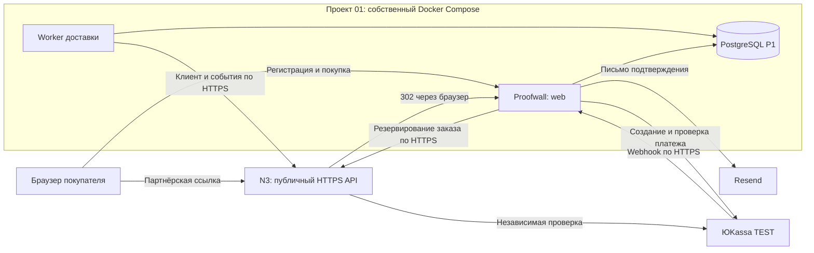
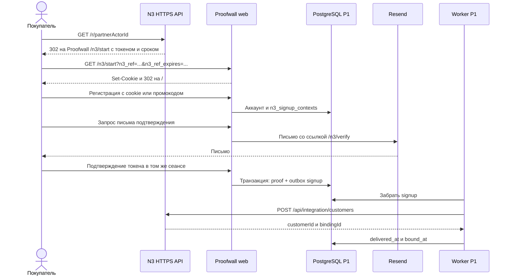
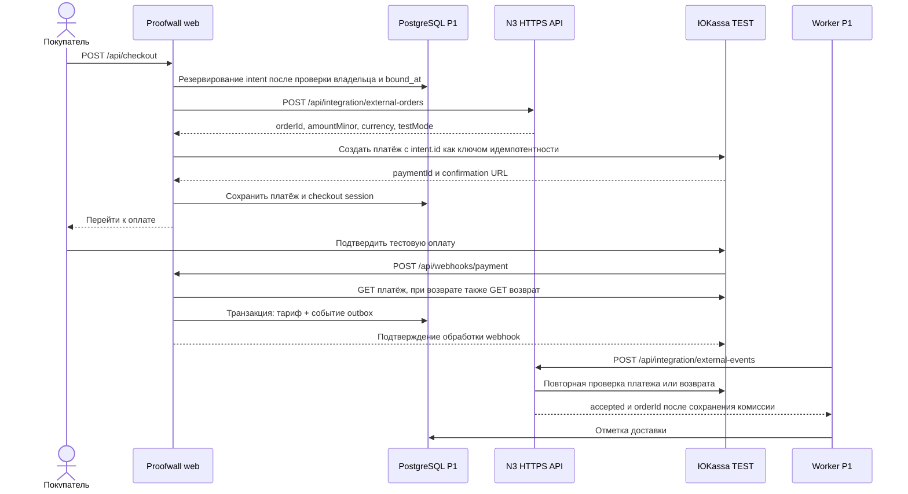

# Proofwall → N3: архитектура партнёрской продажи

Срез реализации на 2026-09-09. Документ описывает сторону магазина — проект 01.
Сторона партнёрской платформы и сквозная схема:
[архитектура N3](../../03-affiliate-rewardful/docs/integrations/proofwall-architecture.md).
Это описание существующего кода, без изменения работающего приложения.

## High level: ответственность и границы

Proofwall продаёт свой тариф, регистрирует покупателя и предоставляет доступ после
подтверждённой оплаты. N3 хранит программу, партнёров, атрибуцию и журнал комиссий.
ЮKassa подтверждает факт оплаты/возврата. Resend доставляет письмо для подтверждения
почты покупателя. Наличие одной партнёрской ссылки не сообщает N3 о покупке:
для этого в Proofwall добавлен серверный интеграционный слой.

Каждый проект остаётся распределённым монолитом в своих контейнерах.
Связь продуктов — через публичные HTTPS API. Общая БД, межпроектный SQL,
объединение внутренних Docker-сетей и обращение к контейнерам N3 по DNS не нужны.
Общий входной TLS-прокси на VPS не является каналом доступа к БД.
БД доступны только серверным компонентам своего проекта, без внешних портов
и дефолтных паролей; это относится и к тестовым стендам.

## Low level: компоненты Proofwall

| Компонент | Ответственность и исходник |
|---|---|
| Приём перехода | [`/n3/start`](../apps/web/src/app/n3/start/route.ts): проверяет форму токена и срок, ставит cookie, перенаправляет на `/` |
| Контекст регистрации | [`n3-referral.ts`](../apps/web/src/lib/n3-referral.ts): читает cookie/промокод, сохраняет источник у аккаунта |
| Подтверждение почты | [`n3-proof.ts`](../apps/web/src/lib/n3-proof.ts): одноразовый токен, привязанный к аккаунту, почте и сеансу; после подтверждения ставит `signup` в очередь |
| Создание покупки | [`n3-checkout.ts`](../apps/web/src/lib/n3-checkout.ts): резервирует локальный intent, заказ N3 и нативную оплату ЮKassa |
| Приём события | [`webhook`](../apps/web/src/app/api/webhooks/payment/route.ts) и [`n3-payment.ts`](../apps/web/src/lib/n3-payment.ts): проверяют провайдера, обновляют тариф и очередь в транзакции |
| Надёжная доставка | [`n3-outbox.ts`](../services/worker/src/n3-outbox.ts): забирает задания из PostgreSQL, отправляет, проверяет подтверждение, повторяет ошибки |
| Серверный транспорт | [`n3-client.ts`](../services/worker/src/n3-client.ts): HTTPS, Bearer-ключ, таймаут 8 секунд, запрет перенаправлений |

### Локальные данные

Схема: [`019_n3_bridge.sql`](../packages/db/migrations/019_n3_bridge.sql).

| Таблица | Что сохраняется |
|---|---|
| `n3_signup_contexts` | `account_id`, организация N3, токен перехода и/или промокод |
| `n3_email_tokens` | Хеш одноразового токена, аккаунт, почта, сеанс, срок и состояние доставки |
| `n3_email_proofs` | Подтверждение почты; `bound_at` после подтверждённой доставки клиента в N3 |
| `n3_checkout_intents` | Связь аккаунта и проекта Proofwall с заказом N3 и платежом ЮKassa |
| `n3_bridge_outbox` | Событие, полезная нагрузка, попытки, аренда задания, ошибка, время доставки |
| `n3_refund_reviews` | Проверенный возврат и необходимость ручной проверки тарифа |

Существующие `checkout_sessions`, `webhook_events` и данные тарифа продолжают
участвовать в покупке. Таблицы N3 не заменяют собственный биллинг Proofwall.

## Data flow: переход и регистрация

Cookie `n3_ref_<tenantId>` устанавливается **сервером** с `HttpOnly`, `Secure`,
`SameSite=Lax`, `Path=/`. Это не общий JavaScript-трекер N3. Действующая cookie
сохраняется при новом переходе; URL очищается перенаправлением, ответ содержит
`no-store` и `no-referrer`. Окончательную действительность источника проверяет N3.
Промокод имеет приоритет над cookie на стороне N3.

Подтверждение почты и доставка привязки — разные состояния. Пока нет `bound_at`,
реферальный checkout блокируется. Простой переход уже существующего аккаунта
не означает автоматической ретроактивной привязки: контекст захватывается при регистрации.

## Data flow: оплата и возврат

Metadata платежа связывает `order_id` N3, `proofwall_invoice_id` локального intent
и `project_id` Proofwall. Metadata — подсказка для поиска; сервер сверяет её
с сохранённым intent, магазином, суммой, валютой и режимом платежа.
Возврат проверяется через API провайдера, передаётся в N3 для корректировки комиссии,
а в Proofwall создаёт `manual_review`: срок тарифа автоматически не пересчитывается.
При возврате также ставится событие исходной оплаты, поэтому потерянное уведомление
о ней не мешает восстановить цепочку.

### Транзакции и повторная доставка

- Общей транзакции P1/N3/ЮKassa нет. Согласование между системами происходит постепенно.
- Тариф и outbox сохраняются атомарно. Недоступность N3 после оплаты не блокирует
  локальное применение тарифа при доступной БД и свободной ёмкости очереди.
- Очередь ограничена 10 000 недоставленных заданий; переполнение откатывает
  обработку, включая захват webhook, сохраняя возможность повтора.
- Worker опрашивает очередь через 5 секунд после завершения партии: до 10 заданий,
  до 4 отправок одновременно, `FOR UPDATE SKIP LOCKED`, аренда 60 секунд.
  Ошибки повторяются с задержкой от 60 секунд до часа. Постоянная ошибка требует
  оператора; успешный HTTP-ответ дополнительно проверяется по полям подтверждения.
- Уникальность `(kind,business_key)` защищает очередь; `(account_id,request_key)`
  и один незавершённый intent на проект защищают checkout. Повтор после 23 часов
  для неоднозначного intent требует сверки, а не создания новой покупки вслепую.

## Ограничения и эксплуатация

Текущий bridge явно проверяет **990 ₽, RUB, test=true**. Это рабочая интеграция
с тестовым магазином, не универсальный коннектор для произвольных тарифов и боевых денег.
Повторная покупка может дать новое начисление; автоматическое рекуррентное списание
этот слой само по себе не реализует.

Серверные настройки: `N3_BRIDGE_ENABLED`, `N3_BASE_URL`, `N3_TENANT_ID`,
`N3_CONNECTOR_KEY`; значения ключей не публикуются. Проверка ЮKassa в обеих системах
требует согласованных настроек одного магазина.

Историческая проверка: изолированный E2E покрывал оплату, дубли и частичный возврат
с имитацией провайдеров; настоящая TEST-покупка была сверена через API с восстановлением
пропущенного события оператором. Это не доказывает автоматическую доставку следующего
webhook или возврат через настоящий TEST API.

Операционные действия и границы проверки:
[runbook](../../03-affiliate-rewardful/docs/integrations/proofwall-operations.md),
[демонстрация](../../03-affiliate-rewardful/docs/integrations/proofwall-demo.md).
