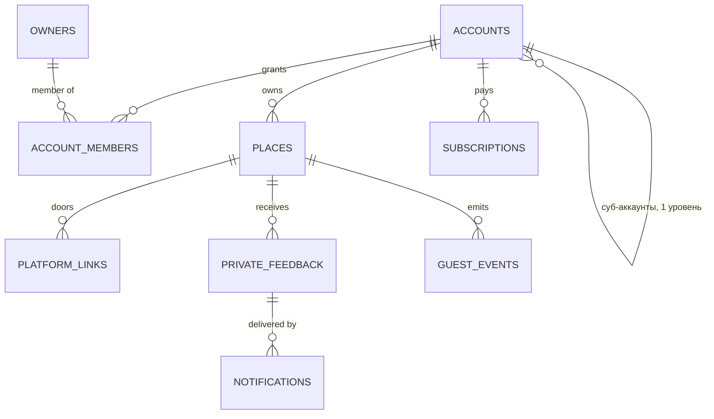

# Architecture — умный QR для отзывов (рабочее имя `reviewqr`)

> SPARC Phase: **Architecture**. Источники: [`DECISIONS-PHASE-0.md`](DECISIONS-PHASE-0.md) ·
> [`discovery/03-legal-gating-boundary.md`](discovery/03-legal-gating-boundary.md) §7–§8 ·
> [`discovery/04b-shared-constraints.md`](discovery/04b-shared-constraints.md) §0 ·
> [`discovery/02-product-discovery-brief.md`](discovery/02-product-discovery-brief.md) §Т.5, §М4.2, §М5.
> Architecture Constraints пайплайна (не обсуждаются, только выражаются): Distributed Monolith
> (монорепо) · Docker + Docker Compose · VPS · деплой compose напрямую · **PostgreSQL в контейнере**,
> managed BaaS запрещён · **у БД нет публикации на хост**, кроме петли `127.0.0.1`/`::1`.
> Площадки: **Яндекс.Карты и 2ГИС**; Google выведен из состава (README, редакция четвёртая).

## 1. Обзор системы и границы

Продукт даёт заведению QR, ведущий на **нашу** страницу выбора, где гостю одновременно и
равновесно показаны все двери: публичные площадки и приватный канал к владельцу. Никакой
маршрутизации по тональности нет — и, что важнее, **её нечем выразить**: этому подчинена вся
структура ниже (§3).

- **Внутри границы:** Next.js-кабинет владельца (`apps/web`), **отдельное** гостевое приложение
  (`apps/guest`), **отдельный** сервис приёма приватных сообщений (`services/intake`), сервис
  доставки в мессенджеры (`services/notifier`), PostgreSQL в контейнере, Caddy как единственная дверь.
- **На границе:** Яндекс.Карты и 2ГИС (только как целевые URL, API у нас нет и не будет — бриф §М3.4),
  Telegram Bot API и MAX Bot API (доставка приватных сообщений), ЮKassa (подписка, ADR-009).
- **Вне scope недели:** ответы на публичные отзывы, парсинг рейтингов, white-label агентств,
  интеграции с кассами и CRM. Ни один компонент не проектируется «с запасом» под них.

Ключевой архитектурный факт: **единственное, чем продукт отличается от конкурента за 900 ₽, —
отказ от гейтинга** ([`04c`](discovery/04c-offer-gap.md)). Отличие, выраженное обещанием, стоит
ноль, поэтому оно выражено конструкцией и проверяется скриптом (§3, §11).

## 2. Монорепо: разбиение на пакеты

```
reviewqr/
├── apps/
│   ├── web/            # Next.js: лендинг, кабинет владельца, онбординг, оплата, все owner-API
│   └── guest/          # ТОЛЬКО GET /r/:slug и GET /go/:slug/:platform. Роль СУБД: app_render
├── services/
│   ├── intake/         # ТОЛЬКО POST /api/feedback/private. Роль СУБД: app_intake
│   └── notifier/       # Доставка в Telegram/MAX, ретраи. Роль СУБД: app_notify
├── packages/           # db (миграции, роли, ГРАНТЫ, RLS) · shared-types · ui (кабинет, НЕ guest)
├── scripts/            # Стражи T1…T10 (§11)
├── docker-compose.yml
└── docker-compose.prod.yml
```

> ⚠️ **Не путать с командой `/go` конвейера p-replicator** (`.claude/commands/go.md`,
> маршрутизатор реализации фич). Здесь и далее `/go/:slug/:platform` — **HTTP-маршрут
> продукта**, редирект гостя на выбранную им площадку. Совпадение имён случайно; в
> документах проекта маршрут пишется только в полной форме, чтобы не смешивались.


**Почему `apps/guest` и `services/intake` — отдельные контейнеры, а не роуты внутри `apps/web`**
(ADR-002). Граница гейтинга держится на том, что у кода страницы выбора **нет прав** читать
приватные обращения. Внутри одного процесса это требует двух пулов и дисциплины «не импортируй не
тот пул» — слоя 4 по лестнице стоимости обнаружения. Отдельный контейнер получает **одну** строку
`DATABASE_URL` и не имеет доступа к другим: неправильный импорт невозможен, потому что
импортировать нечего. **Один контейнер — одна роль СУБД** — инвариант деплоя, проверяемый T3.

`packages/ui` намеренно не используется в `apps/guest`: гостевая страница — утилита на чужом
телефоне за три секунды ([`04b`](discovery/04b-shared-constraints.md) §0.2.1), а общая зависимость —
путь, по которому в неё однажды приедет логика кабинета.

## 3. Три слоя структурной невыразимости гейтинга

Несущая часть документа. От самого сильного к самому общему; **ни один слой не заменяет другой** —
каждый ловит то, что пропускают остальные ([`03`](discovery/03-legal-gating-boundary.md) §7.5).

### 3.1 Слой 1 — гранты СУБД: у рендера нет права читать тональность

Четыре роли, у каждой — свой контейнер и свой пул. Матрица прав задаётся миграцией в
`packages/db`, а не настройкой на сервере.

| Роль | `places` | `platform_links` | `private_feedback` | `guest_events` | `notifications` | остальное |
|---|---|---|---|---|---|---|
| `app_render` (`apps/guest`) | SELECT | SELECT | **нет вообще** | **INSERT, без SELECT** | нет | нет |
| `app_intake` (`services/intake`) | SELECT | нет | **INSERT, без SELECT** | нет | INSERT | нет |
| `app_notify` (`services/notifier`) | SELECT | нет | SELECT | нет | SELECT, UPDATE | `analytics_events`: INSERT |
| `app_owner` (`apps/web`) | ALL под RLS | ALL под RLS | SELECT под RLS | SELECT под RLS | SELECT | ALL под RLS |

```sql
REVOKE ALL ON private_feedback FROM app_render;      -- не «не читаем», а «не можем»
GRANT  SELECT (id, slug, name, branding_required) ON places    TO app_render;
GRANT  SELECT (place_id, platform, url, link_kind) ON platform_links TO app_render;
GRANT  INSERT                            ON guest_events    TO app_render;  -- SELECT НЕ выдаётся
GRANT  INSERT                            ON private_feedback TO app_intake; -- SELECT НЕ выдаётся
```

**Что это даёт.** Попытка обусловить разметку тональностью падает не на ревью и не на тесте, а на
`permission denied for table private_feedback` при первом запуске — сдвиг со **слоя 4** на **слой 1**.

**Почему у `app_render` есть INSERT, хотя в discovery написано «записи: НЕТ».** Метрика недели
требует считать сканы, а единственное место, где скан наблюдаем, — `GET /r/:slug`. Формулировка
discovery сокращала настоящий инвариант: гейтинг обеспечивает **чтение**, а не запись. Запись,
результат которой некому прочитать, повлиять на ответ не может. Условие корректности этой уступки —
**`SELECT` на `guest_events` не выдан ни в каком виде**, и отсюда два следствия, оба проверяемые:

- `INSERT … RETURNING` требует в PostgreSQL `SELECT`-привилегии на возвращаемые колонки — рендер
  не получает обратно даже собственную вставку;
- на `guest_events` **нет ни одного UNIQUE-индекса**, поэтому `ON CONFLICT DO NOTHING` не выразим —
  а именно он был бы каналом чтения («строка уже была» = «гость уже приходил» = персонализация под
  постоянного). Отсутствие индекса — часть защиты, а не деталь производительности; страж — T8.

Дедупликация устройств за неделю выполняется **при агрегации** (роль `app_owner`), а не при вставке.

### 3.2 Слой 2 — отсутствие полей и роутов

Запрет через отсутствие выразительных средств: настройка `gating_enabled = false` есть гейтинг,
отложенный до первого тикета в поддержку.

**Каких полей нет в схеме — поимённо** (T1/T2 читают `information_schema`, а не миграции):

| Не существует | Почему |
|---|---|
| `places.gating_enabled`, `places.rating_threshold`, `places.min_stars_for_public`, `settings.review_routing_mode` | Любой тумблер режима означает, что гейтинг выразим и штатен |
| `guest_events.rating`, `scans.rating`, `sessions.pre_rating`, `intake.score`, `*.sentiment`, `*.nps` — на любой сущности **до** развилки | Поле, куда кладётся оценка до выбора, — половина гейтинга; вторая дописывается за час |
| `places.positive_destination` / `.negative_destination`; `platform_links.show_if` / `.condition` / `.min_rating` | Пара «маршрут для хороших / для плохих» — гейтинг в чистом виде, даже если оба поля указывают в одно место; условная видимость двери — его мягкая форма |
| `platform_links.position` / `.sort_order` | Ручка «поднять карты» — это положение Р2, а решение владельца зафиксировано Р1 (D-03). Порядок вычисляется, а не хранится (§5.1) |
| `qr_codes.variant` / `.experiment_arm` | A/B по заметности дверей и отдельный QR «для постоянных» — избирательное приглашение |

**Единственное поле с оценкой во всей схеме — `private_feedback.rating`,** и разница не в наличии
поля, а в направлении стрелки: в гейтинге оценка — **вход** маршрутизации, здесь — **выход** уже
сделанного гостем выбора. Строка `private_feedback` физически не может возникнуть раньше выбора:
её создаёт только `services/intake`, а у него нет ни одного роута, вызываемого до развилки.

**Публичные пути — исчерпывающий список из трёх:**

| Метод | Путь | Контракт |
|---|---|---|
| `GET` | `/r/:slug` | Страница выбора. Все двери в первичном рендере. Query-параметры игнорируются целиком |
| `GET` | `/go/:slug/:platform` | `302` на URL площадки. Аргументы — только из пути. См. ADR-004 и предупреждение ниже |
| `POST` | `/api/feedback/private` | `{ slug, body, rating?, contact? }` → `201`. Не возвращает ни URL, ни редиректа |

> ⚠️ **Сознательное отклонение от [`03`](discovery/03-legal-gating-boundary.md) §7.3.** Discovery
> объявляет исчерпывающим список из **двух** путей и запрещает «роут, возвращающий 3xx». Но D-01
> требует инструментировать **долю гостей, выбравших публичную дверь**, а статический `<a href>`
> такого числа не даёт. Конфликт разрешён в пользу измеримости (ADR-004); несущая часть §7.3
> сохранена: **роута, принимающего оценку**, не существует, а `/go/:slug/:platform` принимает только дверь, которую
> гость **уже** выбрал, и закрыт теми же стражами чистоты, что и `/r/:slug` (§5.2).

**Каких роутов нет:** `POST /api/feedback/route → { next_url }`; `GET /r/:slug/next?rating=N`;
`POST /r/:slug/decide`; любой путь, принимающий оценку до создания `private_feedback`; любой
параметр `GET /r/:slug` или `GET /go/…`, влияющий на ответ.

### 3.3 Слой 3 — чистота ответа, выраженная сигнатурами

Инвариант одной строкой:

> **`GET /r/:slug` — чистая функция от `slug`.** Ответ не зависит ни от query, ни от cookie, ни от
> заголовков, ни от времени, ни от IP, ни от User-Agent, ни от Accept-Language, ни от единой строки
> в БД, кроме карточки заведения и его набора площадок.

Чистота относится к **ответу**, а не к процессу: журнал сканов — побочный эффект, не часть ответа.
Чтобы это различение не жило в комментарии (в проекте 01 порядок операций был записан в шапке
файла, и код всё равно его нарушал — [`security-operation-order`](../../../.claude/rules/security-operation-order.md)),
оно закреплено **типами**:

```ts
// apps/guest/src/render.ts и resolve.ts — единственные модули, порождающие ответ
export function renderChoicePage(slug: string): Html                    // нет Request, заголовков, Date
export function resolvePlatformUrl(slug: string, platform: Platform): Url   // то же для `/go/:slug/:platform`
// apps/guest/src/journal.ts — единственный модуль, видящий запрос
export function recordGuestEvent(req: Request, kind: EventKind): void   // нет возвращаемого значения
```

**У функций, порождающих ответ, нет аргумента, в который можно подать контекст запроса; у функции
журналирования нет возвращаемого значения, через которое контекст мог бы вернуться.** Пути от
контекста к ответу не существует — не потому, что он запрещён, а потому, что оба его конца
отсутствуют. Это относится к **обоим** ответам гостевой поверхности: разметке `/r/:slug` и
`Location` у `/go/:slug/:platform`. Страж T9 (по исходнику, паттерн
[`source-parsing-invariant-guard`](../../../.claude/patterns/source-parsing-invariant-guard.md))
утверждает: ни `render.ts`, ни `resolve.ts` не импортируют `headers()`, `cookies()`, `Date`, гео- и
UA-разбор, и сигнатура `recordGuestEvent` возвращает `void`.

**Кэш — на нашем origin, а не на CDN.** Discovery предлагала edge-кэш по ключу `slug` («добавленная
позже ветка не доедет до гостя — её съест кэш»). Взято свойство, отброшена площадка: edge-кэш съел
бы вместе с веткой и **сканы**, а метрика недели считается по ним. Рендер кэшируется **в процессе**
`apps/guest` (LRU по `slug`, инвалидация при правке карточки и смене плана), наружу — `no-store`:
каждый скан доезжает до origin, а байты у всех одни, потому что источник один. Цена: разгрузки от
CDN нет, на сотнях точек она и не нужна, при росте — пересматривать.

**`GET /r/:slug` не ставит ни одной cookie и не содержит инлайновых скриптов.** Отсюда у ответа нет
ни CSP-nonce, ни CSRF-токена, ни `Set-Cookie` — то есть **список нормализаций для T4 пуст**, и
sha256 сравнивается по сырому телу. Это самая сильная форма теста: нормализация — место, где страж
однажды начнёт стирать настоящее различие.

**CSRF-токена нет намеренно.** У гостя нет сессии, значит нет и амбиентных полномочий, которые
CSRF мог бы использовать: подделанный кросс-сайтовый POST создаёт ровно то же, что создаёт форма, —
приватное сообщение владельцу. Защита от этого — не токен, а ограничение частоты (§7.2) и проверка
`Origin`. Отсутствие токена — **условие** байтовой идентичности, а не экономия.

## 4. Модель данных



| Таблица | Ключевые поля | Назначение |
|---|---|---|
| `accounts` | `id`, `name`, `plan enum(free,point,network,agency)`, `parent_account_id NULL`, `created_at` | Арендатор. Самоссылка — суб-аккаунты агентства, **ровно один уровень** (ADR-008) |
| `owners` / `sessions` | `id`, `email unique`, `password_hash` / `owner_id`, `token_hash`, `expires_at`, `revoked_at` | Человек и его сессии кабинета. Аутентификация внутри монолита |
| `account_members` | `account_id`, `owner_id`, `role enum(admin,manager,viewer)`, unique(`account_id`,`owner_id`) | Кто и с какими правами видит арендатора |
| `places` | `id`, `account_id NOT NULL`, `slug unique`, `name`, `address`, `branding_required bool NOT NULL DEFAULT true`, `created_at`, `archived_at NULL` | Точка. `slug` — единственный аргумент рендера; `branding_required` денормализовано с плана, чтобы рендер не читал `accounts` (§5.1) |
| `platform_links` | `id`, `place_id`, `platform enum(yandex_maps,twogis)`, `url`, `link_kind enum(review_form,card)`, `verified_at NULL`, unique(`place_id`,`platform`) | **Множество дверей.** Без полей условий и без хранимого порядка (§3.2) |
| `private_feedback` | `id`, `place_id`, `body`, `rating smallint NULL`, `contact text NULL`, `created_at` | Создаётся **только** после того, как гость сам выбрал приватную дверь. Единственное место с оценкой |
| `notifications` | `id`, `private_feedback_id`, `channel enum(telegram,max)`, `status enum(pending,sent,failed)`, `attempts`, `last_error`, `sent_at NULL` | Очередь доставки. Отделена от `private_feedback`, чтобы у `app_intake` не было UPDATE (§7.1) |
| `channel_bindings` | `id`, `place_id`, `channel`, `chat_id`, `bind_token_hash`, `bound_at NULL` | Привязка мессенджера владельца одноразовым токеном |
| `guest_events` | `id`, `place_id`, `kind enum(scan,door_click)`, `platform NULL`, `device_hash`, `created_at` | Append-only журнал гостевой поверхности. **Без UNIQUE-индексов** (§3.1) |
| `public_review_counts` | `id`, `place_id`, `observed_at`, `count`, `source enum(manual)` | Ручной недельный замер числа отзывов на карточке — API у площадок нет (§8.3) |
| `checkout_sessions` | `id`, `account_id`, `provider_session_id unique`, `status enum(pending,completed,expired)` | Привязка вебхука оплаты к арендатору |
| `subscriptions` | `id`, `account_id`, `plan`, `places_limit`, `current_period_end`, `status` | Действующая подписка |
| `webhook_events` | `provider`, `event_id unique`, `payload`, `processed_at` | Дедупликация повторной доставки (ADR-009) |
| `analytics_events` | `id`, `account_id NULL`, `event_type`, `metadata jsonb`, `created_at` | Owner-side воронка: онбординг, инвайты, `i` и `conv%` (§8.2) |
| `rate_limit_events` | `id`, `scope`, `key`, `created_at`, index(`scope`,`key`,`created_at`) | Единый счётчик скользящего окна (§7.2) |
| `audit_log` | `id`, `account_id NULL`, `entity_type`, `entity_id`, `actor_id`, `action`, `reason`, `created_at` | Изменения ссылок площадок, смена плана, отвязка канала |

**Индексы, несущие смысл:** `places(slug)` unique — вход рендера; `platform_links(place_id)` —
набор дверей одним запросом; `guest_events(place_id, created_at)` — метрика недели;
`private_feedback(place_id, created_at DESC)` — лента кабинета; `notifications(status, created_at)`
— очередь воркера; `rate_limit_events(scope, key, created_at)` — окно лимита.
**Индекса `guest_events(place_id, device_hash)` НЕТ намеренно** (§3.1).

**Уникальность устройства без хранения персональных данных.** `device_hash =
HMAC-SHA256(секрет ‖ ISO-номер-недели, IP ‖ User-Agent)`, усечённый до 16 байт. Соль привязана к
календарной неделе — окно уникальности задано криптографически и совпадает с определением метрики
([`04b`](discovery/04b-shared-constraints.md) §5.1); связать устройство между неделями нельзя даже
нам, а сырые IP и UA не сохраняются нигде.

### 4.1 Мульти-арендная изоляция

Два независимых места, оба обязательны.

1. **RLS для `app_owner`.** Транзакция кабинета первым делом задаёт контекст:
   ```sql
   SET LOCAL app.current_account_id = '<account_id из проверенной сессии>';
   create policy tenant_isolation on places for all using (
     account_id = current_setting('app.current_account_id')::uuid
     or account_id in (select id from accounts
                       where parent_account_id = current_setting('app.current_account_id')::uuid));
   ```
   `SET LOCAL` живёт внутри транзакции — соединение из пула не наследует чужой контекст.
   Вложенность **ровно один уровень**: агентство видит клиентов, клиент — никого (ADR-008).
2. **Гостевые роли RLS не используют вовсе** — им нечего задавать в контекст, и изоляция там
   сильнее: они резолвят `slug → place_id` и **не принимают идентификатор арендатора никак**.

Тест-контракт: «арендатор A не читает точку арендатора B» гоняется и через кабинет, и через
гостевые пути.

## 5. Гостевая поверхность

### 5.1 `GET /r/:slug`

1. Резолв `slug → places` (только `id`, `slug`, `name`). Нет строки — `404`, одинаковый для всех.
2. Выборка `platform_links` точки. Двери = все площадки **плюс** приватная.
3. **Порядок дверей — детерминированная перестановка:** сортировка по `sha256(slug ‖ door_key)` —
   фиксирована для точки, одинакова для всех гостей, не выразима как ручка. Это и есть **Р1
   «равновесно»** (D-03): убирает и случайный A/B, и соблазн «показать сначала карты». Переход к Р2
   стоит одну строку сортировки и один порог в тесте — та дешевизна ослабления, ради которой взят Р1.
4. Разметка: одинаковые плоские строки, ни одна не за раскрытием; бренд-строка сервиса при
   `places.branding_required` (вычисляется **только сервером**, клиенту `plan` не передаётся).
   Состав экрана, измеренная геометрия, два анти-паттерна с живого экрана конкурента и цифровой
   критерий равновесности — **[`Architecture-UI.md`](Architecture-UI.md)**.
5. `recordGuestEvent(req, 'scan')` — побочный эффект, `void` (§3.3).

Ответ: HTML без инлайн-скриптов и cookie, `Cache-Control: no-store`.

### 5.2 `GET /go/:slug/:platform`

`302` на `resolvePlatformUrl(slug, platform)` — **ровно два аргумента, оба из пути**; `Request` в
сигнатуре нет, поэтому ветвить по `?rating`, cookie или заголовку не по чему (§3.3). Читает
`platform_links` и `places`; `SELECT` на `private_feedback` и на `guest_events` у роли нет —
истории гостя роут не видит, даже собственных записей. `recordGuestEvent(req, 'door_click')` перед
редиректом. Неизвестная пара — `404`, не редирект «куда-нибудь»
([`fail-closed-defaults`](../../../.claude/rules/fail-closed-defaults.md)). Чистота проверяется
T4b и T9 — теми же стражами, что и `/r/:slug`, а не отдельным послаблением.

### 5.3 `POST /api/feedback/private`

`{ slug, body, rating?, contact? }` → `201 { ok: true }`. Порядок операций несущий
([`security-operation-order`](../../../.claude/rules/security-operation-order.md)):

1. **Ограничение частоты — ДО валидации** (иначе перебор мусорными телами бесплатен), по ключам
   `device_hash` и `place_id`, вне транзакции.
2. Валидация: `body` непустое и ≤ 4000 символов, `rating` — целое 1–5 либо отсутствует; любое
   неопознанное значение → отказ, а не подстановка.
3. Резолв `slug → place_id`; **одна транзакция:** `INSERT private_feedback` +
   `INSERT notifications(status='pending')`; ответ `201`.
4. **Сетевой вызов мессенджера — вне транзакции и вне запроса:** его делает `services/notifier`,
   забирая очередь (§7.1), поэтому соединение пула не удерживается на время ответа Telegram/MAX
   ([`shared-resource-verification`](../../../.claude/rules/shared-resource-verification.md)).

Ответ **не содержит** ни URL, ни редиректа, ни подсказки «а теперь оставьте отзыв на картах» —
последнее было бы гейтингом наизнанку.

## 6. Кабинет владельца и онбординг

Четыре шага (CJM вариант A, экраны 4–7): точка → **ссылки площадок** → мессенджер → печатный макет.

**Шаг 2 — главный источник отвала, и он ручной по факту, а не по лени.** Диплинка «оставить отзыв»
у 2ГИС **нет** (установлено по документации), у Яндекса **не установлен** (в первоисточниках не
найден; блуждающий `?add-review=true` не подтверждён). Продукт не может собрать ссылку сам ни для
одной из двух площадок — владелец вставляет её из кабинета площадки (ADR-005).

Валидация ссылки — **allowlist доменов и формы, отказ вместо подчистки**:

| Площадка | Допустимые хосты | `link_kind` |
|---|---|---|
| Яндекс.Карты | `yandex.ru/maps/org/…`, `yandex.ru/maps/-/…` | `card`, пока Q1 не закрыт |
| 2ГИС | `2gis.ru/firm/…`, `go.2gis.com/…` | `card` |

Неизвестный хост или форма → **отказ на онбординге** с текстом про цену ошибки: опечатка
превращает QR на пятидесяти столах в битую ссылку, и узнаем мы об этом от гостя. Конверсия шага
меряется отдельным событием (§8.2) — это главный отвал воронки.

**Шаг 4 — печатный макет.** QR кодирует `${BASE_URL}/r/${slug}`. По умолчанию — **уносимые
носители** (подвал счёта, оборот визитки, наклейка на упаковке); тейбл-тент с предупреждением о
гостевом Wi-Fi и общем устройстве ([`04b`](discovery/04b-shared-constraints.md) §0.4.2). Сценарий
«общий планшет или стойка со сканом» **не проектируется вовсе** — его нет в продукте.

**`BASE_URL` не имеет дефолта в проде** ([`silent-fallbacks`](../../../.claude/rules/silent-fallbacks.md)):
он определяет каждую ссылку, уходящую **в печать**, и с дефолтом все они повели бы на localhost —
навсегда, потому что носители не перепечатать. Генератор QR дополнительно отказывается работать,
если `BASE_URL` не абсолютный `https`; исключение для этапа сборки — явное, как в проекте 01.

## 7. Приватный канал

### 7.1 Доставка

`services/notifier` опрашивает `notifications(status='pending')`, отправляет в Telegram Bot API или
MAX Bot API по `channel_bindings`, обновляет статус. Ретраи с экспоненциальной задержкой, предел —
6 попыток, после — `failed` и запись в `audit_log`. Если гость оставил контакт, владелец отвечает
ему прямо из мессенджера.

**Момент ценности — `private_message_delivered` с меткой времени внутри смены** (бриф §М2.4).
Отсюда NFR: **p95 задержки от `201` до `sent` ≤ 30 секунд**; задержка меряется и хранится, потому
что «в ту же смену» без числа непроверяемо. Недоступность мессенджера — **не потеря сообщения**:
строка `notifications` создана в одной транзакции с `private_feedback`, доставка возобновится.
Обратный порядок (отправить, потом записать) терял бы сообщение при любом сетевом сбое.

### 7.2 Ограничение частоты

Единый механизм `rate_limit_events` на три требования: спам приватными сообщениями, перебор по
`/api/feedback/private`, аномалия сканов одной точки. Клиентский IP — **предпоследний элемент**
`X-Forwarded-For`, что корректно **только** за нашим Caddy и работает лишь потому, что `intake` не
опубликован на хост (§9): опубликованный рядом сервис дал бы обойти прокси и обнулить лимит сменой
заголовка — дефект проекта 01 ([`deployment-seams`](../../../.claude/rules/deployment-seams.md)).
Тест — **конкурентный**: 20 одновременных запросов по одному ключу, число занятых соединений пула
не растёт с числом ожидающих.

## 8. Метрики и события

### 8.1 Метрика недели

> **Число точек, у которых за календарную неделю ≥ 1 скан с уникального устройства. Цель — 10.**

`SELECT count(DISTINCT place_id) FROM (SELECT place_id, device_hash FROM guest_events WHERE
kind='scan' AND created_at >= date_trunc('week', now()) GROUP BY 1,2) t` — под ролью `app_owner`.
Дедупликация именно здесь, а не при вставке (§3.1).

### 8.2 Три числа, без которых неделя не засчитывается (D-01)

| Число | Источник | Инструментируется |
|---|---|---|
| Доля гостей, выбравших публичную дверь | `guest_events`: `door_click(platform≠null)` / `scan` | ADR-004, с первого релиза |
| Доля дошедших до публикации отзыва | `public_review_counts` — **ручной** недельный замер | §8.3, с первого релиза |
| «Принимаю размен» из 10 разговоров | вне продукта, скрипт продаж §2 | — |

Owner-side воронка в `analytics_events`: `signup`, `onboarding_place_created`,
`onboarding_links_saved` ← **конверсия главного отвала**, `onboarding_channel_bound`,
`onboarding_layout_downloaded`, `invite_sent`, `paywall_shown`, `subscription_activated`.
`i = invite_sent / владельцы с ≥1 активной точкой` и `conv% = регистрации по инвайту / invite_sent`
считаются **раздельно** и с первого релиза: постфактум события не восстанавливаются.
Все события пишутся **только серверным кодом**; гостевые — через `recordGuestEvent`, без единого
клиентского скрипта, поэтому блокировщики и отключённый JS на метрику не влияют.

### 8.3 Чего измерить нельзя, и это сказано прямо

Публикацию отзыва продукт не наблюдает: API отзывов у Яндекса нет, 2ГИС его не отдаст (бриф §М3.4),
данные Яндекс API ППО хранить запрещено лицензией. «Доля дошедших до публикации» — **ручной замер**
в `public_review_counts` с `source='manual'`; enum с единственным значением — именно поэтому.

## 9. Docker Compose и деплой

```yaml
name: reviewqr                       # без name соседний стек вытесняет этот (compose-hygiene §1)
services:
  postgres:
    image: postgres:16.4-alpine      # явный тег: latest ломает воспроизводимость
    environment: [POSTGRES_DB, POSTGRES_USER, POSTGRES_PASSWORD]
    volumes: [postgres_data:/var/lib/postgresql/data]
    healthcheck: {test: ["CMD-SHELL","pg_isready -U $$POSTGRES_USER"], interval: 5s, retries: 5}
    restart: unless-stopped   # ports: НЕТ И НЕ ПОЯВИТСЯ — Правило №0 (.claude/rules/docker-ports.md)

  web:      {build: ./apps/web,          environment: [DATABASE_URL_OWNER,  BASE_URL, SESSION_SECRET, YOOKASSA_SHOP_ID, YOOKASSA_SECRET_KEY], restart: unless-stopped}
  guest:    {build: ./apps/guest,        environment: [DATABASE_URL_RENDER, BASE_URL, DEVICE_HASH_SECRET],                                     restart: unless-stopped}
  intake:   {build: ./services/intake,   environment: [DATABASE_URL_INTAKE, DEVICE_HASH_SECRET],                                               restart: unless-stopped}
  notifier: {build: ./services/notifier, environment: [DATABASE_URL_NOTIFY, TELEGRAM_BOT_TOKEN, MAX_BOT_TOKEN],                                restart: unless-stopped}

  caddy:
    image: caddy:2.8-alpine
    ports: ["${HTTP_PORT:-80}:80", "${HTTPS_PORT:-443}:443"]   # только числа через переменные
    volumes: [./Caddyfile:/etc/caddy/Caddyfile, caddy_data:/data]
    restart: unless-stopped
volumes: {postgres_data: , caddy_data: }
```

`depends_on: {condition: service_healthy}` опущен ради места, но обязателен у всех четырёх
приложений: `service_started` означает «процесс запущен», а не «готов принимать».

**Четыре разные строки подключения — не украшение, а условие §3.1:** своя роль и свой пароль в
каждой, суперроли нет ни у кого. `web`, `guest`, `intake`, `notifier` **не публикуются на хост
вовсе** — единственная дверь Caddy, иначе граница доверия к прокси обходится вместе с лимитом
частоты (§7.2). Маршрутизация: `/r/*` и `/go/*` → `guest`, `/api/feedback/private` → `intake`,
остальное → `web`. **Ошибка маршрутизации отменяет всю конструкцию** — страница выбора, отданная
контейнером `web`, работает под `app_owner` и читает приватные обращения, — поэтому она
проверяется T3b, а не глазами.

**Самопроверка роли — команда контейнера, а не роут.** `docker compose exec guest node
selftest-role.js` пытается `SELECT 1 FROM private_feedback LIMIT 1` и требует **ошибку прав**;
успех или «ноль строк» — красный. Это CLI, а не HTTP-путь: список публичных путей остаётся из трёх.

Деплой: CI → образы → миграции `packages/db` → `docker compose -f docker-compose.prod.yml up -d`
по SSH. Перед **любым** `up` — `node .claude/hooks/check-ports.cjs .` и
`bash scripts/check-port-conflicts.sh .`: эта машина держит `80`, `443`, `8080` занятыми.
Бэкап — `pg_dump` по расписанию вне compose.

## 10. Оплата

ЮKassa. Подлинность — две независимые проверки: сеть источника (allowlist подсетей **в коде**) и
перезапрос статуса через API; HMAC нет, провайдер не подписывает. Порядок: **подлинность → заявка
на `event_id` → применение тарифа**; недоступность провайдера — исключение, откатывающее заявку.
Полный разбор и отвергнутые альтернативы — **ADR-009**.

## 11. Проверки

Все — детерминированные скрипты, ни один не требует суждения. Три кода возврата: `0` соблюдено,
`1` нарушено, **`2` проверка НЕ ВЫПОЛНЕНА**.

| Тест | Скрипт | Что утверждает |
|---|---|---|
| **T1** | `check-schema-fields.sh` | По `information_schema`: колонки `/(rating\|score\|stars\|nps\|sentiment)/i` нет нигде, **кроме явного исключения `private_feedback.rating`**. Регэксп имён — `[a-z][a-z0-9_]*`, **с цифрами** |
| **T2** | `check-schema-fields.sh` | Нет колонок `/(gating\|threshold\|min_stars\|route_by\|positive_\|negative_\|show_if\|experiment\|position\|sort_order)/i` |
| **T3** | `check-db-grants.sh` | `role_table_grants`: у `app_render` нет SELECT на `private_feedback`, у `app_intake` есть INSERT и **нет** SELECT. Плюс со стороны приложения — `selftest-role.js` в каждом контейнере требует **ошибку прав**, а не пустую выборку |
| **T3b** | `check-routing.sh` | `GET /r/:slug` обслуживается контейнером `guest`: `selftest-role` того контейнера, который реально отвечает по внешнему адресу, возвращает «denied» |
| **T4** / **T4b** | `check-single-door.sh` [`--go`] | N запросов `GET /r/:slug` по **внешнему** адресу, различающихся ровно одним измерением (query, cookie, UA, Accept-Language, X-Forwarded-For, время суток) → sha256 тела совпадает у всех; **список нормализаций пуст** (§3.3). `--go`: то же для `GET /go/:slug/:platform` — совпадают статус и `Location` |
| **T5** | `check-door-parity.sh` | В первичном рендере: число видимых дверей = `platform_links` + 1; ни один узел и ни один его предок не несёт `hidden`, `aria-hidden`, `display:none`, `visibility:hidden`, нулевой высоты, `<details>` или таба; высота, типографика, `box-shadow`, `border`, `background` совпадают у всех строк |
| **T6** | `check-door-parity.sh` | В разметке нет `<input>`/`<button>` с `name`/`data-*` по `/(rating\|score\|stars\|nps\|sentiment)/i` и нет виджета звёзд |
| **T8** | `check-schema-fields.sh` | На `guest_events` нет ни одного UNIQUE-индекса (§3.1) |
| **T9** | `check-render-purity.sh` | По исходнику: **ни `render.ts`, ни `resolve.ts`** не импортируют `headers()`/`cookies()`/`Date`/гео/UA-разбор и не принимают `Request`; сигнатура `recordGuestEvent` возвращает `void` |
| **T10** | `check-guards-fail.sh` | **Мета-тест**, см. ниже |

**T10 — каждый страж испытан внедрённым дефектом**
([`guard-must-be-able-to-fail`](../../../.claude/rules/guard-must-be-able-to-fail.md)): страж, ни
разу не показавший красное, не является стражем.

| Внедрить в фикстуру | Обязан упасть с кодом 1 |
|---|---|
| колонка `guest_events.rating` · `places.gating_enabled` · UNIQUE на `guest_events(place_id, device_hash)` · `GRANT SELECT ON private_feedback TO app_render` · маршрут `/r/*` переведён на `web` | T1 · T2 · T8 · T3 · T3b |
| ветвление в шаблоне по `?rating=` · **ветвление по `?rating` в `/go/:slug/:platform`** · `hidden` на блоке приватной двери · виджет звёзд · тень на приватной строке · импорт `headers()` в `render.ts` **или в `resolve.ts`** | T4 · **T4b** · T5 · T6 · T5 · T9 |
| **стенд недоступен / БД не отвечает / `docker compose config` нечитаем** | **все — с кодом 2**, «проверка НЕ ВЫПОЛНЕНА», **никогда с 0** |

Последняя строка отдельно: страж проекта 01, печатавший ✅ на нечитаемом конфиге, стоил
компрометации машины при зелёном отчёте. T4 и T5 гоняются **на развёрнутом стенде по внешнему
адресу**, а не на localhost: внешний адрес — часть конфигурации, и именно он ломался.

## 12. Канонические имена

Расхождение имён между `Architecture.md` и `Pseudocode.md` — известный дефект пайплайна (PR-005).
Ниже канон; `Pseudocode.md` приводится к таблице, не наоборот.

| Сущность | Канон | Не использовать | Почему канон — этот вариант |
|---|---|---|---|
| Точка | `places`, `places.slug` | `venues`, `spots`, `locations` | `slug` — единственный аргумент гостевого рендера, имя таблицы обязано читаться рядом с ним |
| Двери площадок | `platform_links` | `destinations`, `routes`, `links` | `destination`/`route` — словарь гейтинга; имя не должно допускать «positive_destination» даже в разговоре |
| Значения площадок | `yandex_maps`, `twogis` | `yandex`, `2gis`, `dgis` | Идентификатор не может начинаться с цифры; префикс `yandex_maps` отделяет Карты от прочих сервисов Яндекса |
| Приватные обращения | `private_feedback` | `messages`, `negative_feedback` | «negative» вернуло бы тональность в схему; `complaints` сужает — гость пишет и благодарности |
| Гостевой журнал | `guest_events`, `kind enum(scan, public_door_click, private_door_click)` | `scans`+`clicks` двумя таблицами; `door_click` + `platform IS NULL` | Одна таблица = один грант `INSERT` и одно место, где проверяется отсутствие `SELECT`. Значения enum взяты **дословно из FR-012**; `NULL` не несёт смысла «приватная дверь» — смысл в `NULL` это тихий дефект, ждущий читателя |
| Рендер и журнал | `renderChoicePage(slug)` · `recordGuestEvent(req, kind): void` | `renderPage(req)` · `trackEvent(): EventId` | Обе сигнатуры **и есть** инвариант §3.3: у рендера один аргумент, у журнала нет возвращаемого значения — канала утечки контекста в ответ |
| Роли СУБД | `app_render`, `app_intake`, `app_notify`, `app_owner` | `app_public`, `app_anon` | `public`/`anon` описывают аудиторию; нам нужно, чтобы имя описывало **право** |
| Роуты гостя | `GET /r/:slug` · `GET /go/:slug/:platform` | `/review/:slug` · `/redirect`, `/out`, `/click` | Короткий путь печатается в QR и произносится вслух при продаже; `platform` в пути делает видимым, что аргумент — уже сделанный выбор, а не оценка |
| Приём | `POST /api/feedback/private` | `/api/feedback` | Слово `private` напоминает, что парного роута для публичной двери не существует |

## 13. Открытые пробелы (GAP)

- `[GAP: Q1 — открывает ли ссылка форму отзыва Яндекс.Карт напрямую; Q2 — стабилен ли URL в QR из
  «Промоматериалов» Яндекс Бизнеса. Обе — блокирующая ручная проверка на физическом телефоне
  (iOS + Android + веб). Схема готова: меняется `link_kind`, без миграции]`
- `[GAP: маркетинговое название и домен не выбраны — влияет на `BASE_URL` и печатный макет]`
- `[GAP: TTL сессии владельца и политика бэкапов Postgres — разумные дефолты]`
