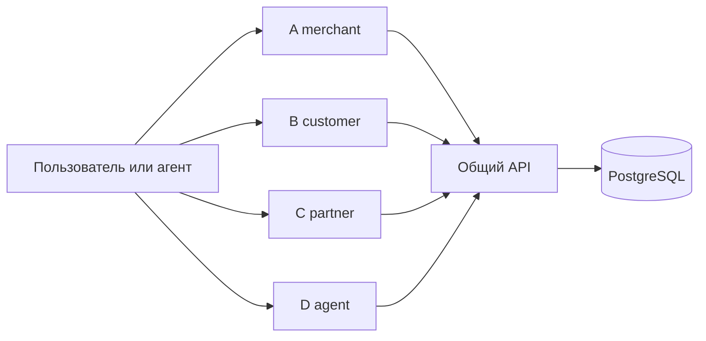

# Архитектура N3

Распределённый монолит в monorepo, Docker Compose на VPS. Владелец подтвердил этот обязательный выбор `/replicate` 2026-09-08. Четыре frontend-контейнера имеют отдельные точки входа и общий клиентский код; единый API исполняет общую бизнес-логику и обращается к PostgreSQL. Модули выпускаются совместно и используют одну схему БД. Границы доменов и rationale: [variant architecture](variant-architecture.md); конкретные поля, политики и API: [runtime contract](runtime-contract.md).

## Размещение и зависимости

`variants/<slug>/app/` — четыре композиции интерфейсов. `shared/client/` — HTTP фасад и управление fixture session; `shared/contracts/` — DTO и допустимые операции; `shared/ui/` — компоненты отображения и дизайн. В браузере нет денежных расчётов, pg или provider SDK.

`shared/domain/` — money/policy/ledger/registry/credit/task invariants. `shared/application/` — authorization, idempotent command execution, проекции и оркестрация use cases. `shared/infrastructure/` — pg, миграции, fixture seed. `apps/api/` — HTTP transport. Граница `shared/transports/` зарезервирована для W4 protocol adapters; до реализации не считается работающим MCP/A2A.

PostgreSQL: единый authority для tenant/actors/sessions, policy versions, payment/refund inbox, immutable ledger, registry revisions, allocations/transfers, reservations, grants/tasks и audit. Команды исполняются короткой транзакцией на одном pg client; row lock tenant сериализует финансовые изменения одного run. Разные tenants не разделяют row lock. Statement/lock/connection timeout ограничены; внешние обращения вне транзакции. Уникальные business keys сохраняют повторобезопасность после restart и при втором процессе.

## Docker и секреты

PostgreSQL находится в отдельной `internal: true` Docker-сети только с API. Нет `ports`, `network_mode: host` или подключения UI к db-сети. API и UI общаются по другой bridge-сети. DB случайный пароль из Docker secret; создание секрета отдельным идемпотентным локальным скриптом, файл0600 в ignored `.runtime/`, не print и не commit. При отсутствии или default значении запуск отказывается. Это относится также к тестам: integration suite запускается внутри backend-контейнера, БД не публикуется даже на loopback.

Порты UI предварительно проверены inventory Docker/ss: кандидаты13031–13034, API/launcher13030. До записи каждого Compose и непосредственно до up — повторная проверка, переменные `${N3_A_PORT:-13031}` и аналоги. По умолчанию binding127.0.0.1. Не трогать чужие контейнеры/сети/порты. Любой Compose имеет собственный `name`, tagged images, healthchecks, restart unless-stopped. Shared core поднимается первым, затем A→B→C→D; каждый variant Compose подключает готовую API-сеть, БД не дублирует.

## Режим и безопасность

Публичный доступ A–D добавлен 2026-09-09 по явному поручению владельца: существующий Caddy80/443 проксирует четыре точных HTTPS-имени n3-{a,b,c,d}.212.192.0.33.sslip.io в уникальные frontend-контейнеры. Только frontends дополнительно подключены к сети talk-ai-public; API остаётся в n3-frontend/n3-database, БД — только в n3-database без host ports. Host-порты API/UI остаются loopback. Матрица shared/contracts/deployment.mjs задаёт точные origin для CORS/CSP, iframe и D→A; wildcard и произвольный Host не дают прав. [Конфигурация и операции](../config/public-web/README.md).

F1 — явно помеченный synthetic demo, ephemeral identity authority bootstrap, отдельный tenant на независимый сеанс. Production mode запрещён до отдельного пилота. Opaque session tokens хранятся hashed; grant ограничен actor/scope/expiry и не включает approve/pay/send. Artifact handoff сохраняет тот же tenant/id/revision/hash. UI выбор роли не заменяет server membership.

Обязательные browser E2E перед передачей UI владельцу: A/B/C/D, desktop/mobile, ошибки и refresh persistence; B на foreign origin с hostile CSS/CSP/CORS. Backend tests проверяют реальные pg transactions, race/replay/refund/unknown/revoke. Mutation guards должны показать красный результат при внесённом дефекте. Source-bound receipts сохраняются в docs/telemetry.

## External Dependencies

F1 runtime: No external dependencies — this product calls no third-party service. PostgreSQL — наш собственный контейнер, fixture provider — локальный adapter. Registry/npm image downloads относятся к сборке, не product capability.

Публичный веб-доступ имеет отдельные инфраструктурные зависимости: DNS sslip.io и выпуск/обновление сертификатов Let's Encrypt через Caddy. Это не интеграции денежных операций и не вызовы LLM. Функциональность локального ядра от них не зависит, доступность публичных URI — зависит.

F2 capabilities пока не запускаются: YooKassa receive payment verification, marketplace split payouts, CloudPayments payments/payouts, production identity/SSO, external MCP/A2A client interoperability. Evidence/capability matrix проверяется отдельно перед этими этапами; их отсутствие не заменяется fallback на fake success.
