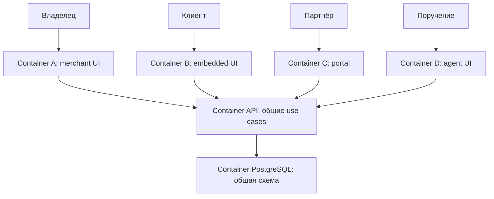

# C4 — контекст и контейнеры N3

Владелец SaaS организует программу и выплаты; клиент рекомендует за credit; партнёр получает cash commission; личный агент действует по ограниченной делегации. В F1 внешняя платёжная система заменена явным fixture adapter, никаких внешних денежных вызовов.

API и PostgreSQL разделяют private internal db network; frontends туда не входят. Browser обращается к своему frontend, тот проксирует API; shared modules поставляются одной версией. Никакие базы не публикуют host ports, в том числе тестовые. Компоненты внутри API: identity/authorization, programme/enrollment, event ledger, registry/settlement, credit billing, grants/tasks, repository/audit. Эта декомпозиция не создаёт независимые микросервисы или четыре схемы денег.
