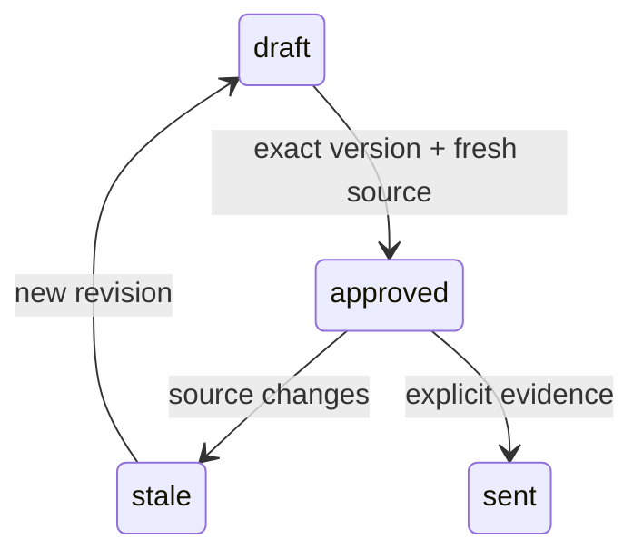

# Pseudocode — a-merchant

## Data Structures

UUID identifiers and created_at timestamps for tenant, actor, policy, payment, ledger, registry revision, allocation, transfer, credit reservation, grant, task. Tenant-owned records never use client tenant as authority. Поля/состояния/API: [runtime contract](../../runtime-contract.md).

## Core Algorithms

### Algorithm: US-101 Настроить программу
REQUIREMENT: `FR-a-merchant-101`
REQUIREMENT: `AC-a-merchant-1011`
REQUIREMENT: `AC-a-merchant-1012`
REALISES: SC-US-101-1, SC-US-101-2
INPUT: Authenticated actor context and schema-validated command; frozen F1 policy.
OUTPUT: Authorized result or typed error without partial mutation.
STEPS: Render programme form from program.read. Validate required kind/bps/window/hold/recurring server-side. program.save appends policy version. Display returned current terms and version; invalid input remains in form with error.
COMPLEXITY: O(n) in affected tenant rows; bounded F1 datasets and database statement timeout.

### Algorithm: US-102 Проверить начисление
REQUIREMENT: `FR-a-merchant-102`
REQUIREMENT: `AC-a-merchant-1021`
REQUIREMENT: `AC-a-merchant-1022`
REALISES: SC-US-102-1, SC-US-102-2
INPUT: Authenticated actor context and schema-validated command; frozen F1 policy.
OUTPUT: Authorized result or typed error without partial mutation.
STEPS: Fixture lab submits confirmed payment using stable identity to shared handler. dashboard displays source/policy/amount/hold. Refund adds adjustment; replay same payment returns prior event without undoing refund. Refresh retrieves persisted server state.
COMPLEXITY: O(n) in affected tenant rows; bounded F1 datasets and database statement timeout.

### Algorithm: US-103 Закрыть месяц
REQUIREMENT: `FR-a-merchant-103`
REQUIREMENT: `AC-a-merchant-1031`
REQUIREMENT: `AC-a-merchant-1032`
REALISES: SC-US-103-1, SC-US-103-2
INPUT: Authenticated actor context and schema-validated command; frozen F1 policy.
OUTPUT: Authorized result or typed error without partial mutation.
STEPS: Owner chooses month, prepares artifact, reads exclusions, approves exact revision/hash, downloads server CSV. UI keeps exported separate from sent; explicit evidence/date then registry.sent; display operator/time and no claim of bank receipt.
COMPLEXITY: O(n) in affected tenant rows; bounded F1 datasets and database statement timeout.

### Algorithm: US-104 Пригласить и передать работу агенту
REQUIREMENT: `FR-a-merchant-104`
REQUIREMENT: `AC-a-merchant-1041`
REQUIREMENT: `AC-a-merchant-1042`
REALISES: SC-US-104-1, SC-US-104-2
INPUT: Authenticated actor context and schema-validated command; frozen F1 policy.
OUTPUT: Authorized result or typed error without partial mutation.
STEPS: program.read returns enrollment URL distinct from personal referral URL. Copy only after click. Handoff from D opens persisted artifact in A using owner context and identical id/revision/hash; no new bootstrap when valid handoff provided.
COMPLEXITY: O(n) in affected tenant rows; bounded F1 datasets and database statement timeout.

## Scenario Coverage

Scenarios in 01_specification.md: 8 · claimed by an algorithm: 8
Not claimed by any algorithm:
none
Claimed by an algorithm but absent from specification:
none

## API Contracts

POST /api/command, Authorization: Bearer; action/input/actorId/grantId/idempotencyKey. 200 data or 400/401/403/404/409 error code/message. POST /api/demo is fixture-only. Body64KiB and explicit origin allowlist.

## State Transitions

## Error Handling Strategy

Validation400; unauthenticated401; denied403; foreign/missing resource404; stale/conflicting409; unavailable503. Rollback failed transaction and release client in finally. Unknown billing keeps reservation; API timeout never fabricates success.
