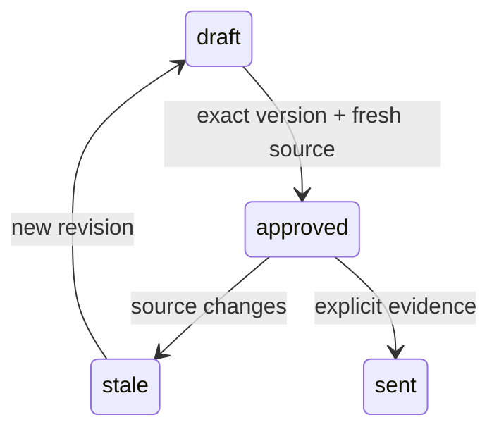

# Pseudocode — b-customer

## Data Structures

UUID identifiers and created_at timestamps for tenant, actor, policy, payment, ledger, registry revision, allocation, transfer, credit reservation, grant, task. Tenant-owned records never use client tenant as authority. Поля/состояния/API: [runtime contract](../../runtime-contract.md).

## Core Algorithms

### Algorithm: US-201 Предложить участие вовремя
REQUIREMENT: `FR-b-customer-201`
REQUIREMENT: `AC-b-customer-2011`
REQUIREMENT: `AC-b-customer-2012`
REALISES: SC-US-201-1, SC-US-201-2
INPUT: Authenticated actor context and schema-validated command; frozen F1 policy.
OUTPUT: Authorized result or typed error without partial mutation.
STEPS: Render value moment and invitation, with decline action preserving parent product. Do not join on load/read. Explicit consent calls enrollment.join once for own customer. Display participation status from server.
COMPLEXITY: O(n) in affected tenant rows; bounded F1 datasets and database statement timeout.

### Algorithm: US-202 Получить бонус за оплату
REQUIREMENT: `FR-b-customer-202`
REQUIREMENT: `AC-b-customer-2021`
REQUIREMENT: `AC-b-customer-2022`
REALISES: SC-US-202-1, SC-US-202-2
INPUT: Authenticated actor context and schema-validated command; frozen F1 policy.
OUTPUT: Authorized result or typed error without partial mutation.
STEPS: Only fixture confirmed payment attributed to distinct enrolled customer causes credit reward with hold. Click/signup/unverified/self-referral produces no available bonus. credit.read explains pending/held/rejected source.
COMPLEXITY: O(n) in affected tenant rows; bounded F1 datasets and database statement timeout.

### Algorithm: US-203 Использовать баланс
REQUIREMENT: `FR-b-customer-203`
REQUIREMENT: `AC-b-customer-2031`
REQUIREMENT: `AC-b-customer-2032`
REQUIREMENT: `AC-b-customer-2033`
REALISES: SC-US-203-1, SC-US-203-2, SC-US-203-3
INPUT: Authenticated actor context and schema-validated command; frozen F1 policy.
OUTPUT: Authorized result or typed error without partial mutation.
STEPS: Reserve credit in transaction after both available balance and invoice remaining checks. Concurrent requests cannot overspend. Unknown billing retains same reservation; success applies once, known failure releases once. Render server invoice and separate reservation/applied states.
COMPLEXITY: O(n) in affected tenant rows; bounded F1 datasets and database statement timeout.

### Algorithm: US-204 Рекомендовать через удобный канал
REQUIREMENT: `FR-b-customer-204`
REQUIREMENT: `AC-b-customer-2041`
REQUIREMENT: `AC-b-customer-2042`
REALISES: SC-US-204-1, SC-US-204-2
INPUT: Authenticated actor context and schema-validated command; frozen F1 policy.
OUTPUT: Authorized result or typed error without partial mutation.
STEPS: Only enrolled own customer receives personal link and disclosure. Share/copy is user initiated, no external send. Read-only grant cannot enroll/reserve; wrong role cannot view owner billing. Foreign-origin iframe isolates CSS and restricts postMessage origin/source/schema.
COMPLEXITY: O(n) in affected tenant rows; bounded F1 datasets and database statement timeout.

## Scenario Coverage

Scenarios in 01_specification.md: 9 · claimed by an algorithm: 9
Not claimed by any algorithm:
none
Claimed by an algorithm but absent from specification:
none

## API Contracts

POST /api/command, Authorization: Bearer; action/input/actorId/grantId/idempotencyKey. 200 data or 400/401/403/404/409 error code/message. POST /api/demo is fixture-only. Body64KiB and explicit origin allowlist.

## State Transitions

## Error Handling Strategy

Validation400; unauthenticated401; denied403; foreign/missing resource404; stale/conflicting409; unavailable503. Rollback failed transaction and release client in finally. Unknown billing keeps reservation; API timeout never fabricates success.
