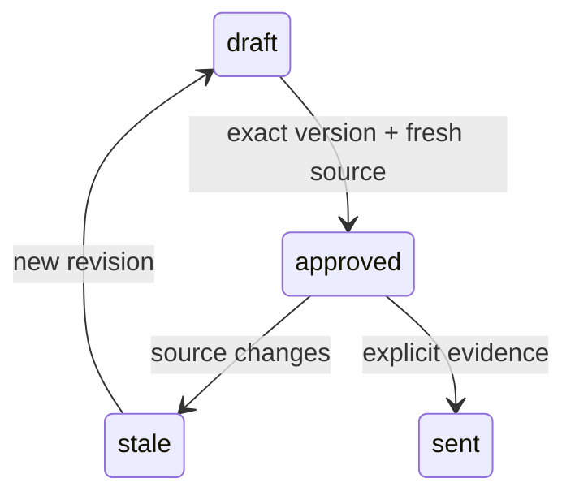

# Pseudocode — c-partner

## Data Structures

UUID identifiers and created_at timestamps for tenant, actor, policy, payment, ledger, registry revision, allocation, transfer, credit reservation, grant, task. Tenant-owned records never use client tenant as authority. Поля/состояния/API: [runtime contract](../../runtime-contract.md).

## Core Algorithms

### Algorithm: US-301 Понять условия до вступления
REQUIREMENT: `FR-c-partner-301`
REQUIREMENT: `AC-c-partner-3011`
REQUIREMENT: `AC-c-partner-3012`
REALISES: SC-US-301-1, SC-US-301-2
INPUT: Authenticated actor context and schema-validated command; frozen F1 policy.
OUTPUT: Authorized result or typed error without partial mutation.
STEPS: Read published programme terms before enrollment. Show policy rate/window/hold/due date/version. Existing ledger entries retain their policy version even after current policy changes; public terms omit private ledger.
COMPLEXITY: O(n) in affected tenant rows; bounded F1 datasets and database statement timeout.

### Algorithm: US-302 Вступить и получить ссылку
REQUIREMENT: `FR-c-partner-302`
REQUIREMENT: `AC-c-partner-3021`
REQUIREMENT: `AC-c-partner-3022`
REALISES: SC-US-302-1, SC-US-302-2
INPUT: Authenticated actor context and schema-validated command; frozen F1 policy.
OUTPUT: Authorized result or typed error without partial mutation.
STEPS: Validate explicit consent and own actor. Unique tenant/actor enrollment returns same record across retries. Personal referral URL and promo differ from programme enrollment URL. Share kit contains reward disclosure and no auto-send.
COMPLEXITY: O(n) in affected tenant rows; bounded F1 datasets and database statement timeout.

### Algorithm: US-303 Понять свою выплату
REQUIREMENT: `FR-c-partner-303`
REQUIREMENT: `AC-c-partner-3031`
REQUIREMENT: `AC-c-partner-3032`
REALISES: SC-US-303-1, SC-US-303-2
INPUT: Authenticated actor context and schema-validated command; frozen F1 policy.
OUTPUT: Authorized result or typed error without partial mutation.
STEPS: Authorize own partner projection; show only own entries and transfer facts. Explain hold/refund/period and due date. Owner sent record changes partner status after refresh; bank credited remains unknown.
COMPLEXITY: O(n) in affected tenant rows; bounded F1 datasets and database statement timeout.

### Algorithm: US-304 Спросить своего агента
REQUIREMENT: `FR-c-partner-304`
REQUIREMENT: `AC-c-partner-3041`
REQUIREMENT: `AC-c-partner-3042`
REALISES: SC-US-304-1, SC-US-304-2
INPUT: Authenticated actor context and schema-validated command; frozen F1 policy.
OUTPUT: Authorized result or typed error without partial mutation.
STEPS: UI and delegated channel call same partner.read. Enforce actor/target equality; changing target ID or requesting global registry denied before data projection. Return source timestamp and same own amount.
COMPLEXITY: O(n) in affected tenant rows; bounded F1 datasets and database statement timeout.

## Scenario Coverage

Scenarios in 01_specification.md: 8 · claimed by an algorithm: 8
Not claimed by any algorithm:
none
Claimed by an algorithm but absent from specification:
none

## API Contracts

POST /api/command, Authorization: Bearer; action/input/actorId/grantId/idempotencyKey. 200 data or 400/401/403/404/409 error code/message. POST /api/demo is fixture-only. Body64KiB and explicit origin allowlist.

## State Transitions

## Error Handling Strategy

Validation400; unauthenticated401; denied403; foreign/missing resource404; stale/conflicting409; unavailable503. Rollback failed transaction and release client in finally. Unknown billing keeps reservation; API timeout never fabricates success.
