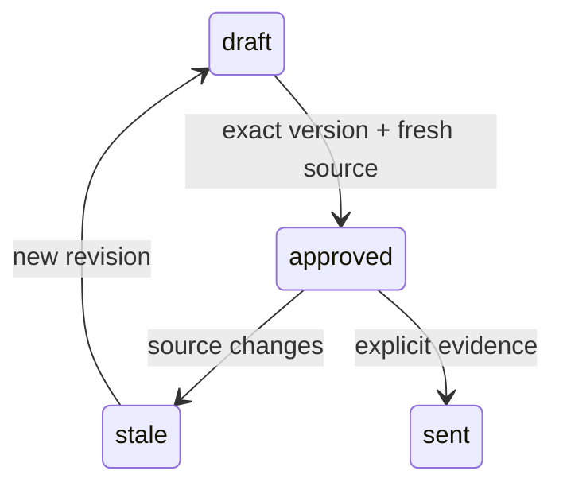

# Pseudocode — d-agent

## Data Structures

UUID identifiers and created_at timestamps for tenant, actor, policy, payment, ledger, registry revision, allocation, transfer, credit reservation, grant, task. Tenant-owned records never use client tenant as authority. Поля/состояния/API: [runtime contract](../../runtime-contract.md).

## Core Algorithms

### Algorithm: US-401 Делегировать задачу
REQUIREMENT: `FR-d-agent-401`
REQUIREMENT: `AC-d-agent-4011`
REQUIREMENT: `AC-d-agent-4012`
REALISES: SC-US-401-1, SC-US-401-2
INPUT: Authenticated actor context and schema-validated command; frozen F1 policy.
OUTPUT: Authorized result or typed error without partial mutation.
STEPS: Direct owner selects role-scoped read/draft actions and bounded expiry. Server intersects allowlist; no approve/send. Render grant scope and expiry. Revoke/expiry denies subsequent delegated call while direct owner remains valid.
COMPLEXITY: O(n) in affected tenant rows; bounded F1 datasets and database statement timeout.

### Algorithm: US-402 Получить один результат
REQUIREMENT: `FR-d-agent-402`
REQUIREMENT: `AC-d-agent-4021`
REQUIREMENT: `AC-d-agent-4022`
REALISES: SC-US-402-1, SC-US-402-2
INPUT: Authenticated actor context and schema-validated command; frozen F1 policy.
OUTPUT: Authorized result or typed error without partial mutation.
STEPS: Create persisted logical task under grant; repeated idempotency key returns same task. Execute registry.prepare in shared layer; returns exact artifact. Refund changes source; prepare same artifact creates new unapproved revision and updated explanations.
COMPLEXITY: O(n) in affected tenant rows; bounded F1 datasets and database statement timeout.

### Algorithm: US-403 Проверить и продолжить вручную
REQUIREMENT: `FR-d-agent-403`
REQUIREMENT: `AC-d-agent-4031`
REQUIREMENT: `AC-d-agent-4032`
REALISES: SC-US-403-1, SC-US-403-2
INPUT: Authenticated actor context and schema-validated command; frozen F1 policy.
OUTPUT: Authorized result or typed error without partial mutation.
STEPS: Owner reads exact artifact independently, then approves and exports direct. Grant never approves. Handoff sends artifact reference to A with same owner session, including after revoke; A reads current revision instead of reseeding.
COMPLEXITY: O(n) in affected tenant rows; bounded F1 datasets and database statement timeout.

### Algorithm: US-404 Вести задачу между агентами
REQUIREMENT: `FR-d-agent-404`
REQUIREMENT: `AC-d-agent-4041`
REQUIREMENT: `AC-d-agent-4042`
REALISES: SC-US-404-1, SC-US-404-2
INPUT: Authenticated actor context and schema-validated command; frozen F1 policy.
OUTPUT: Authorized result or typed error without partial mutation.
STEPS: Own partner task id is unique and persisted. Retry same key returns same task. Cancel prevents run/result publication; T1 late result cannot complete T2. Completed external facts are not rolled back by task cancellation.
COMPLEXITY: O(n) in affected tenant rows; bounded F1 datasets and database statement timeout.

### Algorithm: US-405 Личный кредит клиента
REQUIREMENT: `FR-d-agent-405`
REQUIREMENT: `AC-d-agent-4051`
REQUIREMENT: `AC-d-agent-4052`
REALISES: SC-US-405-1, SC-US-405-2
INPUT: Authenticated actor context and schema-validated command; frozen F1 policy.
OUTPUT: Authorized result or typed error without partial mutation.
STEPS: Customer grant permits own credit.read and returns same projection as B. UI explains available/reserved/held. Attempt credit.reserve under read-only grant fails without balance change; cash ledger never included.
COMPLEXITY: O(n) in affected tenant rows; bounded F1 datasets and database statement timeout.

## Scenario Coverage

Scenarios in 01_specification.md: 10 · claimed by an algorithm: 10
Not claimed by any algorithm:
none
Claimed by an algorithm but absent from specification:
none

## API Contracts

POST /api/command, Authorization: Bearer; action/input/actorId/grantId/idempotencyKey. 200 data or 400/401/403/404/409 error code/message. POST /api/demo is fixture-only. Body64KiB and explicit origin allowlist.

## State Transitions

## Error Handling Strategy

Validation400; unauthenticated401; denied403; foreign/missing resource404; stale/conflicting409; unavailable503. Rollback failed transaction and release client in finally. Unknown billing keeps reservation; API timeout never fabricates success.
