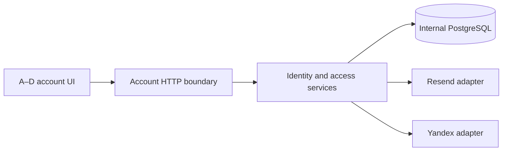

# Architecture — f3-access-onboarding

## Style and components

Preserve distributed monolith: one shared backend/PostgreSQL, A–D frontend containers. Extend shared/identity with email/OAuth services and provider primitives. Reuse donors without their Next.js/Proofwall account model. No message queue or new auth microservice. apps/api owns transport/cookies; provider modules never import SQL. Frontend remains common account UI, security surface available while email policy blocks business surfaces.

## Data and trust boundaries

02_pseudocode.md owns exact fields/APIs/limits. Email tokens hash-only, purpose-bound. PKCE verifier stored privately only for short-lived OAuth flow; access tokens never stored. Account before token/session/identity update locks; provider identity key serializes first-login race. Database unique constraints remain final guard. External network and KDF outside SQL. Revocation version blocks sessions, agent credentials and referral credentials; explicit revoked_at updates provide audit clarity.

## Deployment and backward compatibility

Add nullable password_hash, email_verified_at and auth tables without backfilling verification. Existing accounts/memberships preserved. Disabled providers explicitly unavailable. New email registration unavailable until configured; old account login retained until independently enabled mandatory verification. Sticky persisted policy cannot auto-downgrade on outage or restart. Yandex can create account with unverified contact, security-only if enforcement active. Frontend forwards original Host to fixed backend target for callback equality comparison; no redirect destination is constructed from Host. Exact stored allowed HTTPS origin controls destination.

After nullable SSO account or enabled policy exists, rollback requires access-compatible code, not old image; otherwise stop ingress and forward-fix. Existing referral no-F2-rollback boundary also retained. No schema down migration, no credential resurrection. No public test override or retrieval endpoint.

## Reconciliation with Pseudocode

Расхождений с `02_pseudocode.md` не найдено. Сверены сущности: accounts, user_sessions, email_flows, access_limits, oauth_flows, sso_identities, access_policy; алгоритмы: issuance, proof/revoke, OAuth, linking/enforcement, UI/provider operations, regression/deployment. Physical schema types use UUID/timestamptz/text exactly as canonical data structures; no parallel field definition here.

## External Dependencies

Resend send-email HTTP, Yandex authorize/token/userinfo HTTP. YooKassa existing verified read-back unchanged; CloudPayments documented only. Real delivery/consent requires dedicated owner credentials and domain readiness, not inferred from provider stubs.
