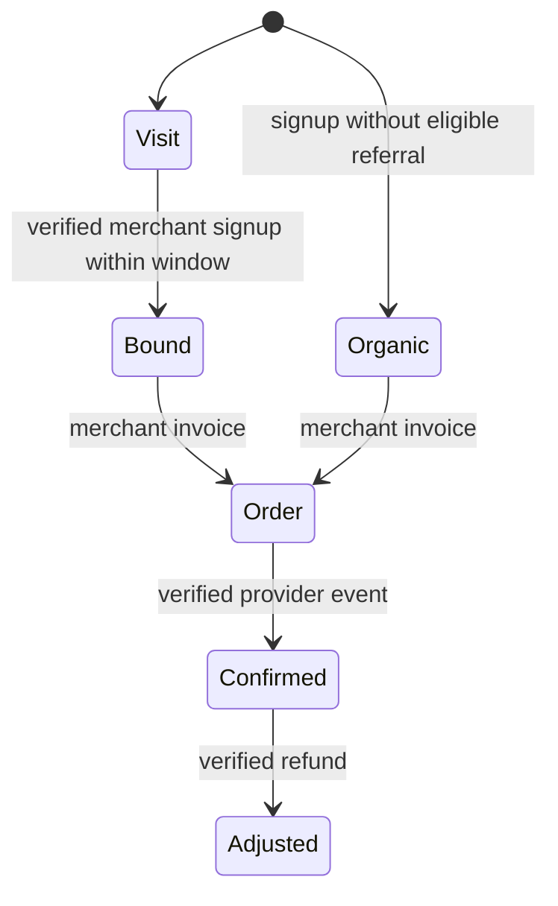

# Pseudocode — f3-referral-funnel

## Data Structures

All new row IDs are UUID (except hashed bearer/visit tokens), created_at is timestamptz. referral_programs: tenant_id primary FK; landing_url/return_url text; updated_at. referral_credentials: token_hash primary; tenant/account/version; expires_at/revoked_at/created_at. referral_visits: id, token_hash unique, tenant/beneficiary/policy UUID, created_at/expires_at. referral_customers: id UUID, tenant_id, external_id text≤160, email_hash, beneficiary_id nullable UUID, channel link/promo/none, attributed_at nullable, registered_at, source_id nullable UUID; UNIQUE(tenant_id,external_id). checkout_orders add source legacy/connector defaultlegacy, attribution JSONB nullable and return_url nullable. Historical rows remain sourcelegacy. Logical contract below is the field owner; architecture maps it without redefining fields.

## Core Algorithms

### Algorithm: Configure and authorize

REQUIREMENT: `AC-f3-referral-funnel-11`

REALISES: SC-US-001-1
INPUT: validated scoped request
OUTPUT: persisted result or explicit error
STEPS: Merchant session → lock membership/account then tenant → validate HTTPS destinations same origin, no URL credentials/fragment/reserved n3_ref query → upsert program. Issue32byte key, hash in connector table, revoke previous key atomically, bind account version, TTL90days. Auth returns tenant+expiry and a final fresh check; actor must remain merchant.
COMPLEXITY: indexed lookups plus O(n) bounded tenant ledger projection.

### Algorithm: Visit and capture

REQUIREMENT: `AC-f3-referral-funnel-12`

REALISES: SC-US-001-1
INPUT: validated scoped request
OUTPUT: persisted result or explicit error
STEPS: Lookup membership actor in real tenant; require cash partner enrollment and configured published policy. Lock tenant; admit capped visit, random32byte token hash, frozen createdAt/expiresAt from current window. Return configured landing URL with n3_ref token and n3_ref_expires server expiry; no redirect query accepted. Tracker script serves public program window, enforces configured merchant origin, keeps existing unexpired first-touch cookie, never refreshes expiry, strips n3_ref/n3_ref_expires and emits no network identity event.
COMPLEXITY: indexed lookups plus O(n) bounded tenant ledger projection.

### Algorithm: Customer binding

REQUIREMENT: `AC-f3-referral-funnel-13`
REQUIREMENT: `AC-f3-referral-funnel-14`

REALISES: SC-US-001-1
INPUT: validated scoped request
OUTPUT: persisted result or explicit error
STEPS: Validate private caller and exact input. Under tenant lock look up unique customerId first; existing same email returns original binding, unknown extra fields refuse. Explicit promo resolves eligible enrolled cash partner or rejects; otherwise validate token shape/hash/tenant, expiry produces no-attribution. Compare trusted normalized email hash with partner/owner email; self-referral refuses. Persist customer with snapshot channel/source/beneficiary/time; organic beneficiary null. No identity/session is minted and no N3 owner organization is created.
COMPLEXITY: indexed lookups plus O(n) bounded tenant ledger projection.

### Algorithm: Checkout and webhook

REQUIREMENT: `AC-f3-referral-funnel-21`
REQUIREMENT: `AC-f3-referral-funnel-22`

REALISES: SC-US-001-2
INPUT: validated scoped request
OUTPUT: persisted result or explicit error
STEPS: Resolve current connector; lock tenant then customer/order. Require configured matching shop, published cash policy; new order binds trusted invoice amount and saved customer attribution, source connector, frozen return URL. Commit then call provider with saved orderUUID idempotence key; reauthorize after IO. Webhook verified outsideSQL, then tenant→order locks, read durable snapshot, apply real event through domain trusted-binding path; compute zero for null beneficiary, preserve frozen recipient, policy.recurring controls later rewards. Persist order+ledger/refund atomically. Authenticated status returns only own connector order; redirect/create response never sets succeeded.
COMPLEXITY: indexed lookups plus O(n) bounded tenant ledger projection.

### Algorithm: Metrics and UI

REQUIREMENT: `AC-f3-referral-funnel-31`
REQUIREMENT: `AC-f3-referral-funnel-32`

REALISES: SC-US-001-3
INPUT: validated scoped request
OUTPUT: persisted result or explicit error
STEPS: Owner may read own full funnel counts; partner only its own slice; fixture/manual legacy events excluded from new funnel counts. Count observed visits, unique bindings and unique customer IDs with verified connector payments, separate provider test/live and preserve paidAt for first positive live commission UTC-week0/1 milestone. Refund does not erase historical first confirmed milestone; net balance still reflects correction. UI uses sequence/membership guard for async responses; keys erased on logout/change, no persistence. Serve merchant tracker and runnable server-side client helper; documentation states fulfillment checks and setup limits.
COMPLEXITY: indexed lookups plus O(n) bounded tenant ledger projection.

### Algorithm: Bounded validation and rollout

REQUIREMENT: `AC-f3-referral-funnel-41`
REQUIREMENT: `AC-f3-referral-funnel-42`

REALISES: SC-US-001-4
INPUT: validated scoped request
OUTPUT: persisted result or explicit error
STEPS: Use existing fixed-pool DB transaction timeouts, connector/visitor admission, per-tenant max100000visits,10000customers,5000orders and bounded provider4active. Network outsideSQL; tenant-before-order locking. Additive tables/nullable order columns preserve legacy interpretation. Verify full build/core/account/protocol/A–D plus isolated merchant E2E, mutation failures, deployment inventory, source hashes and package gates; no external credentials means live acceptance NOTPERFORMED, not fallback.
COMPLEXITY: indexed lookups plus O(n) bounded tenant ledger projection.

## API Contracts

JSON responses `{data:...}` / `{error:{code,message}}`. Public GET `/r/:actorId` →302 Location configured HTTPS merchant destination + n3_ref/n3_ref_expires; `/api/referrals/:tenantId/tracker.js` → JS (public, no credentials). Cookie-auth owner POST `/api/account/referral-settings` `{membershipId,input:{landingUrl,returnUrl}}`; `/api/account/referral-key` `{membershipId}` rotates; `/api/account/referral-revoke` `{membershipId}` revokes; `/api/account/referral-status` `{membershipId}` returns configured destinations and metrics (partner scope metrics only). Cookie mutations require existing exact Origin check.

Private backend POST `/api/integration/customers` `{customerId,email,emailVerified:true,visitToken?,promoCode?}`; `/api/integration/checkout` `{customerId,amountMinor,idempotencyKey}`; `/api/integration/order` `{orderId}`. All three require Authorization Bearer key, reject Origin-bearing browser requests, accept only exact keys, and return no raw secrets. No tenant is accepted in a private request; it comes from key. Customer bind output `{customerId,bindingId,attribution:{channel,beneficiaryId,attributedAt},registeredAt}`; order output `{orderId,paymentId,status,confirmationUrl}`; status includes amount/customer and verified/testMode indicators.

Public calls have no credentials and disclose only necessary configuration. Configured merchant URL may choose any public HTTPS hostname; never fetched server-side. Browser script and server client use separate code paths. Errors:400invalid input/referral,401expired/revoked key,403scope/browser,404unknown program/order,409policy/idempotency/self-referral,429caps/rate,503provider/DB/config unavailable.

## Internal integration contract

`createReferrals({pool,identity,now})` returns `configure(token,membershipId,input)`, `rotate(token,membershipId)`, `revoke(token,membershipId)`, `status(token,membershipId)`, `visit(actorId)`, `trackerConfig(tenantId)`, `bind(connector,input)`, and INTERNAL `authorize(client,connector)`, `customer(client,tenantId,customerId)`, `fresh(resolved)`. `authorize` joins current account version, active key, real tenant and merchant role; returns `{tenant_id,account_id,actor_id,expires_at}`. Public visit returns `{location}`; trackerConfig returns `{tenantId,windowDays,landingOrigin}`. `customer` returns raw immutable SQL row or404. `status` returns `{configured,landingUrl?,returnUrl?,keyActive,keyExpiresAt,metrics:{visits,registrations,payingCustomers,testPayingCustomers,firstCommissionAt,firstLiveCommissionAt,activatedThisWeek,mrr:null}}`, with partner-scope filtering and no customer email/secret.

Coordinator adds `createPayments({...,referrals})`, `.connectorCheckout(connector,input,key)` and `.connectorOrder(connector,orderId)`, owns order migration and trusted domain event handling. Referral worker owns only new referral schema/service/helpers/tests; it does not edit payments/API/identity files. UI worker owns new tracker/client/UI modules and integration guide; coordinator wires them into current account/app and HTML. `referralMigration` is appended after identity/payment migrations by coordinator. Clock is injected `now():milliseconds`.

## State Transitions

## Scenario Coverage

Scenarios in01_specification.md:4 · claimed by an algorithm:4.
Not claimed by any algorithm: none.
Claimed by an algorithm but absent from specification: none.

## Error Handling Strategy

Unknown or unavailable evidence never becomes a confirmed payment or another tenant. Invalid explicit promo does not silently choose the cookie. Client retries use the same identifiers; no telemetry estimate is labeled measured.
