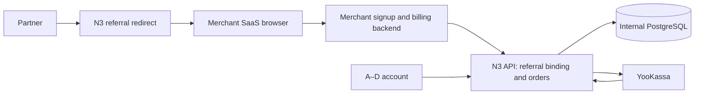

# Architecture — f3-referral-funnel

## Architecture Overview

Existing distributed monolith: four Docker UI containers → one API → private PostgreSQL. External merchant browser/backend integrates through scoped HTTP routes. No new daemon, queue, database or global orchestration configuration.

## Component Breakdown

`shared/referrals/`: program config, scoped credentials, public visit receipts, immutable external customer bindings, projections. `shared/payments/`: connector-authorized order creation/status and existing verified payment/refund service. `shared/domain/events.mjs`: explicit trusted binding for connector events, nullable organic beneficiary, legacy behavior unchanged. `apps/api/referrals.mjs`: public/integration routing; account handler wires owner actions. Frontend proxies /r/ to backend. `shared/ui/account/referrals.mjs`: integration forms and real funnel metrics; browser tracker and merchant server helper kept separate. New tests isolate merchant app and N3 with an injected provider.

## Technology Stack

Existing Node22 ES modules/pg/PostgreSQL16 and browser JS/CSS. No new runtime dependency planned. No cache or queue. Docker Compose/internal DB network and random Docker secrets stay in use. Cookie snippet is first-party on merchant site; no integration key in browser.

## External Dependencies

| Capability needed | Provider / API | Evidence | Verdict | Requirements relying on it |
|---|---|---|---|---|
| Payment creation and redirect confirmation | YooKassa quick start | https://yookassa.ru/developers/payment-acceptance/getting-started/quick-start · checked2026-09-09; “Для оплаты перенаправьте пользователя на `confirmation_url`.”; existing F2 adapter reused | CONFIRMED | AC-f3-referral-funnel-21 |
| Payment/refund event and current-status verification | YooKassa webhook API | https://yookassa.ru/developers/using-api/webhooks · checked2026-09-09; “Проверьте текущий статус объекта” | CONFIRMED | AC-f3-referral-funnel-22 |
| Persistent client cookie can expire early | WebKit ITP2.1 | https://webkit.org/blog/8613/intelligent-tracking-prevention-2-1/ · checked2026-09-09; “capped to a seven day expiry” (historical stated constraint, not a claim every current Safari cookie has exactly7days) | CONFIRMED | AC-f3-referral-funnel-12, AC-f3-referral-funnel-14 |

Our merchant backend contract requires verified signup and authoritative invoice amount; the isolated example tests those obligations. Actual third-party deployment is external acceptance and not presumed. Dedicated live YooKassa credentials remain unavailable until configured by owner.

## Data Architecture

Physical tables mirror Data Structures in02_pseudocode.md: program and binding tenant FKs; credentials account/version join; unique token hashes/customer namespace; time/cap indexes. Additive checkout columns preserve old rows. No second competing field model. JSONB tenant money state remains serialized under tenant lock, then order lock; provider IO outside transactions. Binding rows are immutable after insertion and snapshots are copied into orders before network.

## Security Architecture

Random32byte visitor receipts convey attribution only; random32byte90day connector keys convey scoped tenant operations, hash-only storage, revoke/rotation and version invalidation. Merchant backend cannot pick foreign beneficiary through request fields. Verified email comparison detects exact-identity self-referrals only; it is not universal fraud prevention. HTTPS fixed config destinations, no request-supplied redirects or server fetching. Private backend endpoints reject Origin-bearing requests and do not enable credentialed CORS. Account security and upcoming email/OAuth work share current identity rather than a duplicate account store.

## Reconciliation with Pseudocode

Расхождений с02_pseudocode.md не найдено. Сверены сущности: program, credential, visit, customer binding, order; алгоритмы: configure/auth, capture, bind, checkout/webhook, metrics, rollout. Organic beneficiary is explicitly nullable in storage and domain. Customer binding window is visit→signup, frozen and distinct from future recurring orders.

## Scalability Considerations

Public referral300/minute/socket peer and private integration600/minute/socket peer, separate buckets from account traffic; existing limiter max2048entries and60second expiry. Shared proxy/NAT callers share that bucket; do not claim per-person or cross-tenant fairness within it. Ordinary account traffic must remain usable during a public referral flood. At most1credential row/tenant; rotate replaces superseded row, revoke marks it. Per-tenant100000visits/10000customers/5000orders, existing pool4, connection timeout3s, statement timeout5s, lock timeout2s, provider4active. Public route and connector rate admission must not serialize provider waits with SQL. Metrics are bounded ledger scans for pilot, indexed SQL counts for visits/bindings. Raw IP/user agent not stored as analytics identities.
