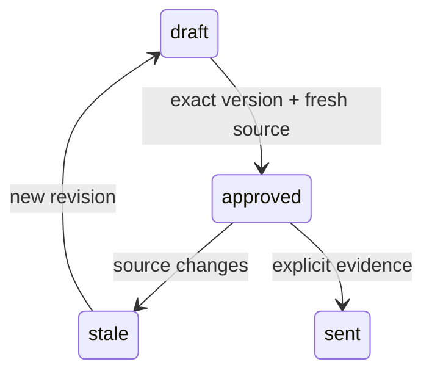

# Pseudocode — shared-core

## Data Structures

UUID identifiers and created_at timestamps for tenant, actor, policy, payment, ledger, registry revision, allocation, transfer, credit reservation, grant, task. Tenant-owned records never use client tenant as authority. Поля/состояния/API: [runtime contract](../../runtime-contract.md).

## Core Algorithms

### Algorithm: US-001 ограничение доступа
REQUIREMENT: `FR-shared-core-1`
REQUIREMENT: `AC-shared-core-11`
REQUIREMENT: `AC-shared-core-12`
REQUIREMENT: `AC-shared-core-13`
REALISES: SC-US-001-1, SC-US-001-2, SC-US-001-3
INPUT: Authenticated actor context and schema-validated command; frozen F1 policy.
OUTPUT: Authorized result or typed error without partial mutation.
STEPS: Resolve opaque token → tenant and membership; reject requested actor outside membership. Resolve resource only within tenant. Apply role allowlist and own-subject equality. If grant supplied, intersect with direct permissions and recheck expiry/revoke before cached or new result. Never use UI variant as authority.
COMPLEXITY: O(n) in affected tenant rows; bounded F1 datasets and database statement timeout.

### Algorithm: US-002 атрибуция и повторные оплаты
REQUIREMENT: `FR-shared-core-2`
REQUIREMENT: `AC-shared-core-21`
REQUIREMENT: `AC-shared-core-22`
REQUIREMENT: `AC-shared-core-23`
REQUIREMENT: `AC-shared-core-24`
REALISES: SC-US-002-1, SC-US-002-2, SC-US-002-3, SC-US-002-4
INPUT: Authenticated actor context and schema-validated command; frozen F1 policy.
OUTPUT: Authorized result or typed error without partial mutation.
STEPS: Verify fixture source first; unknown throws before inbox. Lock tenant; unique provider payment identity; compare payload hash on replay. Resolve promo before cookie, invalid explicit denies attribution. New recurring id yields new payment with historical policy; insert reward only once; apply pending refunds in the same transaction.
COMPLEXITY: O(n) in affected tenant rows; bounded F1 datasets and database statement timeout.

### Algorithm: US-003 объяснимое вознаграждение
REQUIREMENT: `FR-shared-core-3`
REQUIREMENT: `AC-shared-core-31`
REQUIREMENT: `AC-shared-core-32`
REQUIREMENT: `AC-shared-core-33`
REALISES: SC-US-003-1, SC-US-003-2, SC-US-003-3
INPUT: Authenticated actor context and schema-validated command; frozen F1 policy.
OUTPUT: Authorized result or typed error without partial mutation.
STEPS: Store integer minor-unit entries, kind and source references immutably. For cumulative refunds compute remaining gross reward and append delta reversal; never overwrite earned entry. Cash and credit projections separate. If sent/applied obligation reversed, append exception; keep old transfer/invoice fact.
COMPLEXITY: O(n) in affected tenant rows; bounded F1 datasets and database statement timeout.

### Algorithm: US-004 ручной месячный реестр
REQUIREMENT: `FR-shared-core-4`
REQUIREMENT: `AC-shared-core-41`
REQUIREMENT: `AC-shared-core-42`
REQUIREMENT: `AC-shared-core-43`
REQUIREMENT: `AC-shared-core-44`
REQUIREMENT: `AC-shared-core-45`
REQUIREMENT: `AC-shared-core-46`
REQUIREMENT: `AC-shared-core-47`
REQUIREMENT: `AC-shared-core-48`
REALISES: SC-US-004-1, SC-US-004-2, SC-US-004-3, SC-US-004-4, SC-US-004-5, SC-US-004-6, SC-US-004-7, SC-US-004-8
INPUT: Authenticated actor context and schema-validated command; frozen F1 policy.
OUTPUT: Authorized result or typed error without partial mutation.
STEPS: Lock tenant and resolve current sourceVersion. Prepare immutable revision with eligible unsent cash and exclusions. Approve exact id/revision/hash/source and claim unique allocations atomically. Export only approved fresh snapshot. Record sent once with operator/evidence. Refund invalidates approval and releases unsent only; stale external transfer is separate reconciliation fact.
COMPLEXITY: O(n) in affected tenant rows; bounded F1 datasets and database statement timeout.

### Algorithm: US-005 одинаковые действия UI и агентов
REQUIREMENT: `FR-shared-core-5`
REQUIREMENT: `AC-shared-core-51`
REQUIREMENT: `AC-shared-core-52`
REQUIREMENT: `AC-shared-core-53`
REQUIREMENT: `AC-shared-core-54`
REALISES: SC-US-005-1, SC-US-005-2, SC-US-005-3, SC-US-005-4
INPUT: Authenticated actor context and schema-validated command; frozen F1 policy.
OUTPUT: Authorized result or typed error without partial mutation.
STEPS: Create scoped expiring grant within actor allowlist. Task uses same execute and persisted artifact. Check grant before steps/result; revoke stops subsequent access. Owner may read artifact independently. Cancel terminal task cannot accept late response or advance another task ID.
COMPLEXITY: O(n) in affected tenant rows; bounded F1 datasets and database statement timeout.

### Algorithm: US-006 сравнение без перемешивания данных
REQUIREMENT: `FR-shared-core-6`
REQUIREMENT: `AC-shared-core-61`
REQUIREMENT: `AC-shared-core-62`
REQUIREMENT: `AC-shared-core-63`
REALISES: SC-US-006-1, SC-US-006-2, SC-US-006-3
INPUT: Authenticated actor context and schema-validated command; frozen F1 policy.
OUTPUT: Authorized result or typed error without partial mutation.
STEPS: Create fresh tenant/run with pinned seed; bind opaque token and actors. All queries/commands use authenticated tenant. New experiment clone does not share balances; explicit handoff carries existing token/artifact without reset. One production environment has one API/ledger; production mode is unavailable in F1.
COMPLEXITY: O(n) in affected tenant rows; bounded F1 datasets and database statement timeout.

## Scenario Coverage

Scenarios in 01_specification.md: 25 · claimed by an algorithm: 25
Not claimed by any algorithm:
none
Claimed by an algorithm but absent from specification:
none

## API Contracts

POST /api/command, Authorization: Bearer; action/input/actorId/grantId/idempotencyKey. 200 data or 400/401/403/404/409 error code/message. POST /api/demo is fixture-only. Body64KiB and explicit origin allowlist.

## State Transitions

## Error Handling Strategy

Validation400; unauthenticated401; denied403; foreign/missing resource404; stale/conflicting409; unavailable503. Rollback failed transaction and release client in finally. Unknown billing keeps reservation; API timeout never fabricates success.
