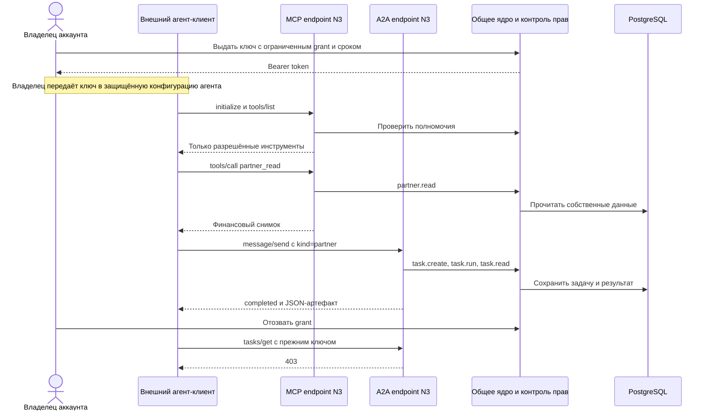

# N3 как сервис для агента: сценарии MCP и A2A

Проверено **2026-09-10** на публичном deployment варианта D. Это проверка
настоящих HTTPS-протоколов, backend и PostgreSQL, а не кнопок демонстрационного UI.
Код продукта в рамках этой проверки не менялся.

## Что уже работает

Потребителем API может быть программный агент. Владелец аккаунта сначала выдаёт
ограниченный по правам и времени ключ; далее агент обращается к продукту без
браузера, используя MCP tools или структурированные задачи A2A.

| Роль агента | Доступные задачи |
|---|---|
| Агент владельца программы | Прочитать dashboard/условия, подготовить и прочитать черновик реестра |
| Агент партнёра | Прочитать условия, собственные вознаграждения и данные для рекомендации |
| Агент клиента | Прочитать условия, собственный credit и данные для рекомендации |

Это максимум разрешённых действий роли; конкретный ключ может давать меньше прав.
Ключ не позволяет самостоятельно расширять права, утверждать/экспортировать реестр
или отправлять деньги. Он отличается от серверного connector key магазина Proofwall.

## Сценарий 1: «Агент, подготовь реестр за прошлый месяц»

1. Владелец выдаёт ключ с `dashboard`, `registry.prepare`, `registry.read`.
   В проверке ключ действовал 300 секунд.
2. Клиент подключается к MCP, выполняет инициализацию и `tools/list`.
3. Вызывает `registry_prepare` с периодом `2026-08` и стабильным ключом
   идемпотентности. N3 возвращает `artifactId` черновика.
4. Через A2A клиент отправляет задачу `registry` с тем же периодом и `artifactId`.
   N3 сохраняет задачу и возвращает `completed` с артефактом результата.
5. Два одновременных одинаковых `message/send` возвращают одну и ту же задачу.
6. Обычный account API видит один реестр и одну задачу: протоколы работают
   с тем же состоянием, что кабинет пользователя.
7. После отзыва ключа чтение задачи через A2A возвращает 403.

**Фактический результат:** PASS. Реестр создан в отдельной тестовой организации,
без покупок и реальных обязательств к выплате. Подготовка черновика не означает
перевод денег и не доказывает корректность реестра с боевыми платежами.

## Сценарий 2: «Мой агент, покажи мои партнёрские вознаграждения»

1. Тестовый партнёр принимает приглашение в отдельную организацию.
2. Получает ключ только с `program.read`, `partner.read`, `share.read`.
3. MCP обнаруживает `partner_read` и `share_read`; инструментов реестра и оплаты
   в списке нет. `partner_read` возвращает собственный финансовый снимок.
4. Попытка прочитать другого партнёра возвращает ошибку инструмента.
5. A2A-задача `partner` возвращает те же бизнес-данные, что MCP. Время снимка
   может отличаться, поскольку запросы выполняются последовательно.
6. Повтор `messageId` возвращает ту же задачу. Новый MCP-клиент читает её через
   `task_read`, а account API показывает её в `task.list`.
7. Попытка агента партнёра подготовить реестр через A2A получает 403.
8. Ключ отзывается: A2A-чтение задачи и MCP discovery больше не доступны.

**Фактический результат:** PASS на публичном сервере и реальной PostgreSQL.
Баланс тестового партнёра нулевой: в этом сценарии не создавалась оплата Proofwall.
Проверено сохранение между запросами и новым клиентским соединением, без перезапуска БД.

## Поток взаимодействий



## Адреса и минимальные запросы

- MCP: `https://n3-d.212.192.0.33.sslip.io/mcp`
- A2A: `https://n3-d.212.192.0.33.sslip.io/a2a`
- Discovery: `https://n3-d.212.192.0.33.sslip.io/.well-known/agent-card.json`

MCP использует официальный `@modelcontextprotocol/sdk` 1.30.0,
Streamable HTTP, stateless JSON responses. Проверено согласование версии
`2025-11-25`. A2A — JSON-RPC 0.3.0, без streaming и push notifications.
Для обоих интерфейсов нужен `Authorization: Bearer <AGENT_TOKEN>`.

Пример MCP `tools/call` после инициализации клиента:

```json
{
  "jsonrpc": "2.0",
  "id": 1,
  "method": "tools/call",
  "params": {
    "name": "partner_read",
    "arguments": { "input": {} }
  }
}
```

Эквивалентная A2A-задача:

```json
{
  "jsonrpc": "2.0",
  "id": 2,
  "method": "message/send",
  "params": {
    "message": {
      "kind": "message",
      "role": "user",
      "messageId": "partner-summary-unique-request-001",
      "parts": [{ "kind": "data", "data": { "kind": "partner", "input": {} } }]
    }
  }
}
```

Повторять тот же `messageId` нужно при повторной доставке **того же задания**.
Для нового актуального снимка создаётся новый ID: повтор завершённой задачи
возвращает сохранённый результат, а не обещает свежий баланс. JSON-RPC `id`
связывает запрос с ответом и не заменяет бизнес-ключ `messageId`.

## Насколько это агентная схема

**Транспорт и выполнение бизнес-команд работают.** MCP-клиент совместим с
официальным SDK; A2A умеет принять структурированную задачу, сохранить её,
вернуть результат, обработать повтор, чтение и допустимую отмену.

**Внутри N3 нет LLM-планировщика.** Обработка задач детерминированная.
Свободный текст вроде «купи подписку» A2A сейчас отклоняет: ожидается JSON data part
с `kind: registry|partner|credit`. Преобразование человеческой просьбы в такой
вызов — ответственность внешнего агента. В проверке использован программный
клиент, без отдельного вызова LLM; автономное планирование моделью не оценивалось.

**Агент-покупатель Proofwall пока не реализован сквозным образом.** В текущем
наборе MCP/A2A нет регистрации покупателя, создания заказа Proofwall, подтверждения
email или оплаты. Рабочая HTTPS-интеграция магазина с N3 и наличие MCP/A2A у N3
сами по себе не дают агенту возможности купить тариф без UI.

Для такого продолжения понадобятся отдельный контракт магазина для агента,
делегированная идентификация покупателя, перенос атрибуции без браузерной cookie,
создание заказа с идемпотентностью и явное согласование оплаты. Это предложение
следующего этапа, не уже реализованные функции.

## Проверки и артефакты

| Уровень | Результат | Ограничение |
|---|---|---|
| `tests/agent-transport.test.mjs` | 7 PASS | Настоящие HTTP/SDK/domain, хранение и credential store имитируются |
| `tests/e2e/public-agent.mjs` | 1 PASS | Публичные HTTPS/backend/PostgreSQL, тестовый пустой реестр |
| `tests/e2e/public-partner-agent.mjs` | 1 PASS после корректировки теста | Публичные HTTPS/backend/PostgreSQL, новый партнёр без оплат |

Негативные проверки включают истечение/отзыв ключа, чужую задачу/партнёра,
выход за scope, подмену контекста, неправильные версии и формат, лимит тела,
запрет утечки секретов в ошибках. Не все эти негативные случаи повторялись
на публичном сервере — публичный набор явно указан выше.

Первый прогон нового партнёрского теста ошибочно сравнивал timestamps разных
снимков как равные. Исправлен тест: сравниваются все бизнес-поля и порядок времени.
Продуктовый дефект этим расхождением не подтверждён.

Созданы отдельные тестовые аккаунты и задачи на публичном сервере. Данные сохранены
для аудита, агентные ключи отозваны, сеансы завершены. Секреты не записаны в отчёт.
Платежи, банковские переводы, рассылки и изменение существующих программ не выполнялись.

[Телеметрия](../telemetry/20260910-agent-scenario/run.json),
[проверка владельца](../telemetry/20260910-agent-scenario/owner.json),
[проверка партнёра](../telemetry/20260910-agent-scenario/partner.json).
