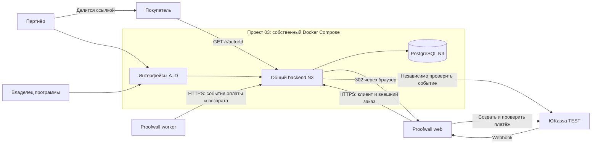
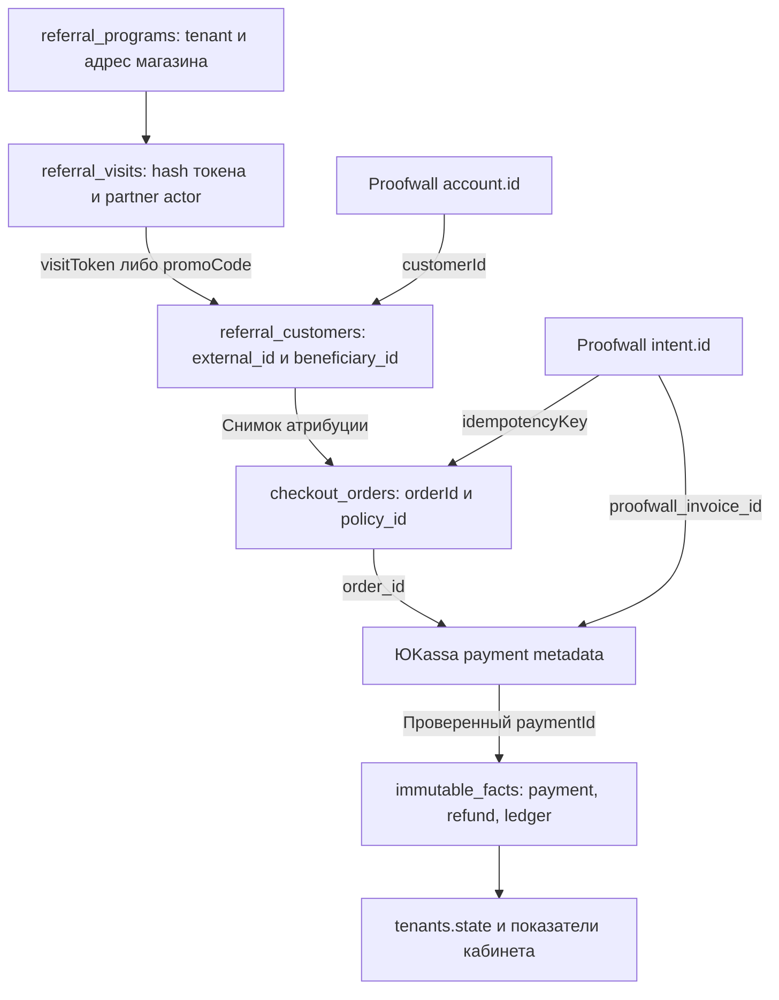
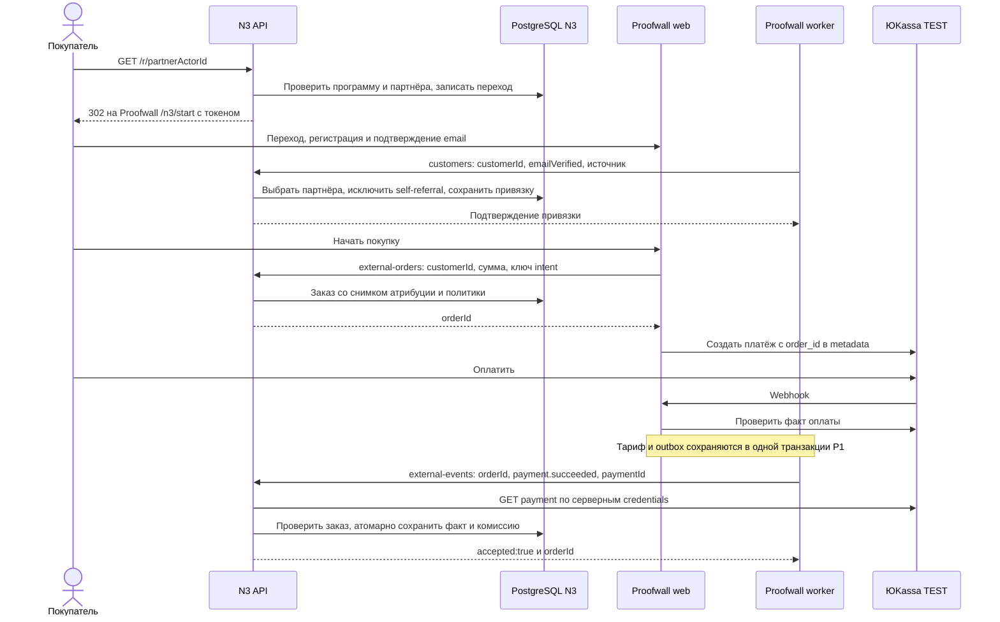
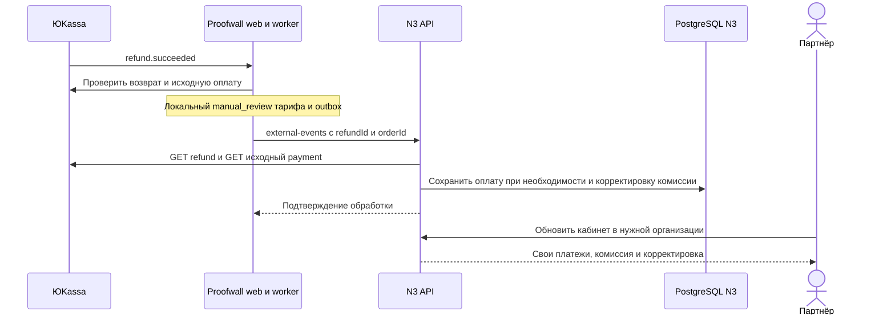

# N3 ↔ Proofwall: архитектура и сквозной поток данных

Срез реализации на 2026-09-09. N3 — партнёрская платформа; Proofwall (проект 01) —
подключённый магазин. Детали регистрации, cookie, checkout и очереди магазина:
[документ проекта 01](../../../01-testimonials-senja/docs/n3-integration-architecture.md).
Имена участников и идентификаторы в схемах условные; секретов и персональных данных нет.

## High level: кто за что отвечает

| Участник | Ответственность |
|---|---|
| Владелец программы в N3 | Публикует условия, подключает магазин, видит показатели программы |
| Партнёр в N3 | Получает ссылку/промокод, видит свои рекомендации и вознаграждения |
| Покупатель в Proofwall | Регистрируется, подтверждает почту, оплачивает тариф магазина |
| Proofwall web и worker | Сохраняют источник, создают платёж, предоставляют тариф, доставляют события |
| N3 API и общее ядро | Проверяют атрибуцию и провайдера, сохраняют комиссию и корректировки |
| ЮKassa | Источник подтверждения платежей и возвратов |

Архитектура каждого продукта — распределённый монолит в Docker-контейнерах.
Интеграция проходит через **публичный HTTPS**, без общей БД, межпроектного SQL,
общих учётных данных БД или соединения внутренних Docker-сетей проектов.
PostgreSQL N3 доступен только его backend по внутренней сети; UI и P1 не имеют
доступа к нему. Внешних портов БД и дефолтных паролей нет, включая тестовые стенды.
Общий TLS-прокси VPS обслуживает входной HTTP-трафик и не меняет эти границы.

## Low level: API и модули N3

Маршруты реализованы в [`apps/api/referrals.mjs`](../../apps/api/referrals.mjs).

| Метод и путь | Данные / результат | Кто вызывает |
|---|---|---|
| `GET /r/:actorId` | Создаёт переход, возвращает 302 с `n3_ref` и `n3_ref_expires` | Браузер покупателя |
| `GET /api/referrals/:tenantId/tracker.js` | Общий JS-трекер; в Proofwall вместо него используется серверный `/n3/start` | Другие интеграции магазина |
| `POST /api/integration/customers` | `customerId`, `email`, `emailVerified:true`, необязательные `visitToken`, `promoCode`; ответ `customerId`, `bindingId`, атрибуция | Worker P1 после подтверждения почты |
| `POST /api/integration/external-orders` | `customerId`, `amountMinor`, `idempotencyKey`; ответ `orderId`, сумма, валюта, режим | Backend P1 перед созданием платежа |
| `POST /api/integration/external-events` | `orderId`, `event`, `objectId`; ответ `accepted:true`, `orderId` | Worker P1 |
| `POST /api/integration/order` | `orderId`; проверенное состояние и суммы заказа | Серверный клиент для сверки |

Успешный ответ интеграции имеет HTTP 200 и оболочку `{ "data": ... }`.
Приватные маршруты требуют `Authorization: Bearer <connectorKey>` и отклоняют
запросы с заголовком `Origin`: ключ не предназначен для браузера.
Организация определяется по ключу, а не по присланному `tenantId`.
Ключ проверяется на срок, отзыв, версию аккаунта, подтверждение почты владельца
и его действующее членство с ролью merchant.

Реализация:

- [`shared/referrals/service.mjs`](../../shared/referrals/service.mjs) — программа,
  ключи, переходы, привязка покупателя, проверка полномочий.
- [`shared/payments/service.mjs`](../../shared/payments/service.mjs) — резервирование
  внешнего заказа, проверка события и сохранение результата.
- [`shared/payments/yookassa.mjs`](../../shared/payments/yookassa.mjs) — запросы к провайдеру.
- [`shared/domain/events.mjs`](../../shared/domain/events.mjs) — бизнес-ключи,
  начисление, удержание и корректировки возврата.
- [`shared/infrastructure/journal.mjs`](../../shared/infrastructure/journal.mjs) —
  неизменяемые факты и обновление состояния организации в одной транзакции.
- [`shared/referrals/metrics.mjs`](../../shared/referrals/metrics.mjs) — показатели воронки.

### Модель данных и связи

Это логические связи, а не межбазовые foreign key. N3 хранит внешнее обозначение
покупателя в `(tenant_id, external_id)`, хеш нормализованного email, выбранного
партнёра и канал атрибуции. Письмо и `emailVerified:true` приходят по доверенному
серверному каналу; N3 не проверяет владение почтой покупателя самостоятельно.
Секрет connector хранится на стороне N3 в виде хеша.

`checkout_orders` сохраняет магазин, test mode, сумму, версию политики и снимок
атрибуции. Ограничения `UNIQUE(tenant_id,command_key)` и
`UNIQUE(shop_id,provider_id)` защищают идентичность заказа/платежа.
Схемы: [referrals](../../shared/referrals/schema.mjs),
[payments](../../shared/payments/schema.mjs).

## Data flow: от рекомендации до комиссии

### Правила атрибуции

1. Источник фиксируется при привязке покупателя. Повтор с тем же внешним ID и email
   возвращает прежний результат, а не переназначает партнёра задним числом.
2. Явно переданный промокод имеет приоритет над токеном перехода. Невалидный код
   вызывает ошибку, без тихого возврата к cookie.
3. Срок перехода берётся из `windowDays` опубликованной политики. Просроченный
   существующий токен даёт клиента без атрибуции; неизвестный токен — ошибку.
4. Проверяются участие партнёра и self-referral: совпадение нормализованной почты
   покупателя с выбранным партнёром либо владельцем программы отклоняется.
   Это проверка по почте, не полная антифрод-идентификация человека.
5. При создании заказа атрибуция и политика сохраняются в заказе. Браузер не может
   назначить получателя комиссии в событии оплаты.

### Почему доставка не равна начислению

Worker передаёт идентификаторы события, не доверенную сумму комиссии.
N3 сначала проверяет права на внешний заказ, затем запрашивает ЮKassa,
после сетевого вызова повторно проверяет полномочия и блокирует организацию/заказ.
Сверяются статус `succeeded`, `paid`, дата оплаты, metadata `order_id`, магазин,
сумма и test mode. Только после этого создаётся доменное событие.

Комиссия рассчитывается по сохранённой политике; `availableAt` учитывает её
`holdDays`. Факты оплаты идентифицируются комбинацией провайдер/магазин/объект,
а журнал сохраняет неизменяемые записи. Повтор подтверждённого события не должен
повторно увеличивать комиссию. Таймаут после коммита N3 безопасно приводит к
повторной доставке из P1 — распределённой транзакции между проектами нет.

## Data flow: возврат и кабинеты

Частичный возврат уменьшает комиссию с учётом накопленной суммы возвратов и
округления, а не повторно вычитает исходное начисление целиком.
История не переписывается: добавляется корректирующая запись. Возврат после
отмеченной отправки выплаты формирует исключение для разбора; автоматического
возврата денег с банковского счёта партнёра нет.

Owner и партнёр используют `/account`, но права задаёт членство в выбранной
организации. Owner видит программу целиком, партнёр — свои показатели.
Роль владельца в собственной организации не даёт прав владельца в чужой.
Показатели обновляются после обработки очереди и обновления кабинета;
момент возврата браузера из ЮKassa не является подтверждением комиссии.

## Границы текущей реализации и проверки

- Proofwall bridge ограничен **990 ₽ / RUB / TEST**; N3 проверяет тот же магазин.
  Ключ интеграции не заменяет серверные credentials провайдера на стороне N3.
  Это ещё не универсальное самостоятельное подключение любого магазина.
- 990 ₽ при политике 20% дают 198 ₽ **тестовой комиссии**; частичный возврат
  495 ₽ оставляет 99 ₽ по этой покупке. Это пример политики, не константа ставки.
  Тестовые начисления не становятся доступными реальными выплатами.
- Новая подтверждённая покупка учитывается отдельно. Автосписание подписки,
  массовая отправка выплат и MCP/A2A не являются шагами этой HTTPS-цепочки.
- В изолированном E2E проверены регистрация, подтверждение, покупка, дубли и
  частичный возврат с имитацией ЮKassa/Resend. Настоящая TEST-покупка проверена
  через API с операторским восстановлением пропущенного события. Автодоставка
  следующего webhook и настоящий TEST-возврат требуют отдельного подтверждения.

Запуск демо: [proofwall-demo.md](proofwall-demo.md).
Настройка, сбои и сверка: [proofwall-operations.md](proofwall-operations.md).
Общий контракт воронки: [referral-funnel.md](referral-funnel.md).
Детали магазина: [архитектура P1](../../../01-testimonials-senja/docs/n3-integration-architecture.md).
