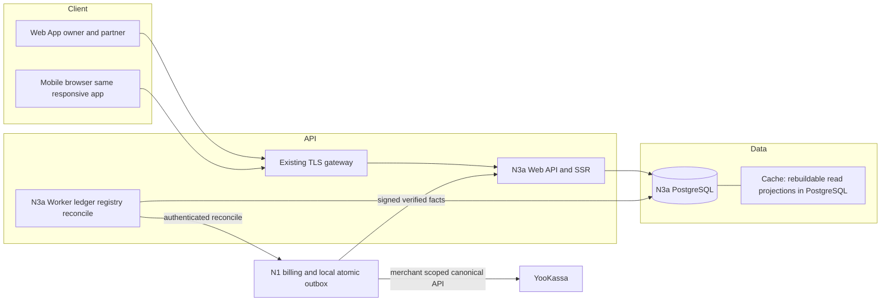

# Architecture — N3a, CJM A

Дата: 2026-09-09. **Предложенный XL-план, не реализация.** Outcomes — [Specification](Specification.md); логические поля, типы и алгоритмы — только [Pseudocode](Pseudocode.md). Решения [ADR-001..008](ADR.md) ещё проходят независимую Phase2-валидацию и checkpoint до кода.

## Architecture Overview

Style: **Monolith** — модульный монолит с отдельными web/worker процессами и своей PostgreSQL. N1 — единственный первоначальный billing authority. N2 — source donor, не runtime. N3a владеет партнёрским ledger, календарными allocations и receipts ручных переводов.

Нет отдельного mobile app, API gateway продукта, Redis или брокера, скрытых за шаблонными блоками диаграммы. TLS gateway — ingress стенда, подключение которого проверяется при foundation. Выбранный runtime не развернут.

## Component Breakdown

| Компонент | Ответственность и граница |
|---|---|
| Identity/access | Сессии, owner/operator/partner scopes, явное принятие условий; адаптация доноров после re-audit |
| Programs/attribution | Immutable every-payment/lifetime rate policy and calendar, append-only partner/asset eligibility history, N1 first-party cookie handoff, registration snapshot |
| N1 adapter (код N1, отдельный owner) | Проверяет YooKassa; resolve local checkout; local billing+outbox commit; signed dispatch/cursor feed/cutover bypass |
| Intake/reconciliation | HMAC raw-body, scoped N1 attestations, immutable identities, rejects/gaps, bounded retry; не хранит provider credentials |
| Ledger | Одна комиссия на business payment, parent-locked canonical refund allocation plus append-only period corrections; денежный source of truth |
| Registry/tax | Calendar close/allocations/carry, налоговые версии/YTD, immutable snapshot и manual-transfer evidence |
| Read/growth | Scoped projections, honest unknown MRR, добровольный share, free badge, отдельный platform-leads context |
| Operations | Worker leases, resource limits, sanitized audit, restore gate и external-transfer reconciliation |

## Technology Stack

| Layer | Technology | Rationale |
|---|---|---|
| Frontend | Предлагаются Next.js/React, TypeScript, Rubik asset из выбранного HTML | Совместимость с N1 UI donor и серверный badge/role rendering |
| Backend | Предлагаются Node22/TypeScript, единые N3a модули web/worker | Минимальный перенос пригодных primitives; exact lockfiles решаются после текущего donor audit |
| Database | PostgreSQL с SQL migrations и pg; major/image pin выбирается в foundation | ACID, composite FK/uniqueness, row/advisory locks; отдельная БД/roles |
| Cache | PostgreSQL materialized/read projections по необходимости | Воспроизводимые агрегаты, без cache authority над деньгами |
| Queue | Durable PostgreSQL outbox/worker leases | Нет требования внешнего broker; N1 outbox находится в N1 DB |
| Infrastructure | Docker Compose, web/worker/db, существующий TLS ingress | Отдельные namespace/networks/volumes, private DB; не обещание production SLA |

Версии здесь — проектное предложение, не заявление проверенной совместимости. Не переносить package manifests/lockfiles соседей целиком. Перед переносом повторно открыть текущие N1/N2 исходники, собрать минимальные зависимости и перенести релевантные tests с provenance; pin images/dependencies и выполнить build/security/regression. Не нужно внешнего notification vendor: первый этап использует dashboard/local audit и ручной разбор.

## External Dependencies

| Capability needed | Provider / API | Evidence | Verdict | Requirements relying on it |
|---|---|---|---|---|
| Уведомления о смене статуса payment/refund и повтор при отсутствии ACK, на стороне N1 | YooKassa notifications | [Официальная инструкция](https://yookassa.ru/developers/using-api/webhooks) · checked 2026-09-09 · «ЮKassa продолжит доставлять уведомление в течение 24 часов.» | CONFIRMED | FR-N1-001, NFR-RELIABILITY-001 |
| Canonical payment lookup для проверки оплаты N1 | YooKassa API payment information | [Справочник](https://yookassa.ru/developers/api) · checked 2026-09-09 · «Информация о платеже»; [формат](https://yookassa.ru/developers/using-api/interaction-format) показывает `/v3/payments/{payment_id}` | CONFIRMED | FR-N1-001, FR-COMMISSION-001, NFR-SECURITY-002 |
| Canonical refund lookup для проверки корректировок N1 | YooKassa API refund information | [Справочник](https://yookassa.ru/developers/api) · checked 2026-09-09 · «Информация о возврате» | CONFIRMED | FR-COMMISSION-002, FR-PAYOUT-004 |
| Merchant-scoped authentication API проверки на стороне N1 | YooKassa HTTP Basic Auth | [Формат взаимодействия](https://yookassa.ru/developers/using-api/interaction-format) · checked 2026-09-09 · «HTTP Basic Auth (основной)» | CONFIRMED | FR-N1-001, NFR-SECURITY-002 |

Таблица подтверждает **возможности провайдера**, не N1/N3a implementation, подключённый тестовый магазин или право на конкретный платёжный способ. Проверенные первичные источники и bounded quotes сохранены также в [source evidence](discovery/prd-source-evidence.md). Partial refund зависит от payment method; N1 подтверждает реально существующий refund, N3a не инициирует возвраты/выплаты через API. Доверие на N3a-входе — signed N1 attestation; N3a не вызывает YooKassa API и не получает копию N1 credentials.

**Implementation dependencies, не external CONFIRMED:** N1 atomic outbox, registration/payment/refund bridge, authenticated cursor/checkout reconciliation и legacy-writer bypass отсутствуют в аудированном baseline. Их нужно реализовать и испытать у N1 integration owner. Они не выдаются за уже существующий внешний сервис; денежное ядро может разрабатываться по этому контракту, но end-to-end/live readiness закрыта до реального адаптера. N1 metadata defect и одноразовые комиссии нельзя перенести; source baseline — `bccd5bb`, [reuse inventory](discovery/reuse-inventory.md). Текущий N1 меняется параллельно: перед кодом новый audit обязателен.

НПД status/limit/receipt и налоговые approvals — проверенные ручные evidence inputs, не заявленные ФНС API. Автосписания, MRR API, message sending и bank payout API не входят в MVP. Предложенная staged граница dogfooding для owner review: own-program enrollment/link/code/lead tracking как purpose=platform_leads; это не полный денежный dogfooding; денежный billing source платформы не реализован и не подменяется N1 payment.

## Data Architecture

Физическая схема отображает **все и только** логические поля [Pseudocode: Data Structures](Pseudocode.md#data-structures), snake_case таблицы, без второй таблицы полей. UUID→uuid, Timestamp→timestamptz, Date→date, Month→date первого числа с CHECK, Money→bigint, Hash→bytea фиксированной длины, enums→text+CHECK с точными наборами из логического контракта. Typed snapshots→jsonb с versioned boundary validator; NULL остаётся неизвестностью, не нулём. Финансовые операции считают bigint/rational, JSON выдаёт money как decimal-string для сохранения int64 точности в JS.

| Логические сущности | Physical mapping / relationships / constraints |
|---|---|
| User, Session, Membership, EnrollmentGrant | users/sessions/memberships/enrollment_grants; verified identity hash and hashed session token unique; user→membership→program/partner; identity-only session before consent; trusted owner bootstrap/operator grant, partner membership inserted atomically at consent; role+scope and tenant restrictions checked in SQL/service |
| Program, PolicyVersion | programs/policy_versions; unique(program,version), immutable history, запрет overlapping effective versions; public_slug unique; ставка nullable только для platform_leads; recurring only every_eligible_payment/lifetime; calendar_locked_at makes timezone immutable after activation/first attribution; no monetary intake for lead-only |
| Partner, Invitation, PartnerAsset, EligibilityFact | partners/invitations/partner_assets/eligibility_facts; unique(subject_kind,subject_id,version); append-only server-dated validity changes; temporal lookup at registration/capture; unique(program,user) where user nonnull; token hashes; unique(program,public_code); ownership composite FK |
| Attribution, Connection | attributions/connections; unique(connection,customer,project); FK policy/program/partner and immutable eligibility fact IDs; signature keys scoped per connection/environment; no merchant secret column |
| ProviderProof, EventReceipt | provider_proofs/event_receipts; stored N1 attestation; unique(connection,event_id), immutable body_hash; receipt and effect same transaction |
| Payment, Refund, LedgerEntry, RefundAllocationRevision | payments/refunds/ledger_entries/refund_allocation_revisions; unique(connection,provider_payment_id), unique(connection,provider_refund_id), unique(payment) WHERE commission; unique(payment,refund_set_hash) revision and unique(revision,basis_month) difference; immutable refund facts/ledger, signed reallocation allowed; counters protected parent lock and CHECK bounds |
| AccountingPeriod, Registry, RegistryRow | accounting_periods/registries/registry_rows; unique(program,month), unique(period), unique(registry,partner); immutable frozen rows; canonical economic snapshot/row hash separate from delivery-history audit_artifact_hash; period close under same program lock as all ledger posting |
| Allocation, Carry | allocations/carries; unique(ledger_entry), unique(source_row), unique(carry consumption); one carry successor; FK rows; no duplicated debt by re-allocation |
| TaxProfile, TaxRule, TaxYTD, TaxSnapshot, PayerYearGuard | tax_profiles/tax_rules/tax_ytd/tax_snapshots/payer_year_guards; unique(payer,person,year) durable guard for ALL models/programs; unique(payer,person,year,base) YTD only base math; persisted active reservation and observation blockers, NPD declared/covered/internal income versions; immutable tax snapshots |
| PayoutPreparation, PayoutConfirmation | payout_preparations/payout_confirmations; unique(tenant,request_id), unique(row) confirmation; at most one live prepared/reconciliation_required per row; all-model reservation in persistent PayerYearGuard; superseded preparation retains replaces/observation links; old/actual-year guards locked in sorted order during reconciliation |
| ReconcileException, AuditEvent, GrowthEvent, Entitlement, RecoveryGate | separate tables; append-only audit, scoped exception workflow; unique(program,actor) for first_value_offer; unique(program,subject,kind) for qualified_lead with explicit owner evidence; action request dedupe; evidenced entitlement; RecoveryGate is a deployment singleton (not tenant-owned); observation-only writes and authorized evidence reconciliation allowed under closed gate, other financial commits shared-lock/check normal |
| N1Outbox | N1-only outbox table and local billing transaction; never in N3a DB; unique(event_id), durable lease/attempt/cursor indexes; both RegistrationEvent and BusinessEvent payloads versioned |

Indexes lead with tenant/program on financial read paths, followed by accounted month/partner/created/id for pagination. Composite foreign keys prevent linking one tenant's payment to another tenant's attribution/row; application authorization precedes queries. Migration role alone can change schema; web/worker grants cannot delete or rewrite ledger, frozen receipts, policy history or confirmations. Mutable counters/states are projections with recorded transitions; repairs use explicit audited reconciliation. RLS can provide a second barrier but must be tested under actual non-owner roles; table owner bypass is not tenant isolation.

**Atomic boundaries:** N1 provider lookup→outside transaction; N1 billing+claim+outbox→one commit; N3a attestation validation/reconciliation→outside transaction; N3a receipt+business uniqueness+ledger/counters→one commit; registry+allocations+carry+close→one commit; tax preparation+all-model persistent guard reservation→one commit; confirmation+actual guard income and applicable YTD→one commit. Observation-only records immutable external facts under recovery lock; evidence-backed cross-year reconciliation atomically supersedes old preparation and consumes/moves guard reservation with confirmation, without a new-transfer window. No distributed DB transaction and no remote call while a DB lock is held.

Calendar policy from ADR-005: Sep payment received Oct2 can enter open September; after September freeze it posts as a late adjustment to next open current period, original instant preserved. Close never silently drops simultaneous posting; program lock resolves which side of freeze owns the event. Due date is the manual TRANSFER deadline on the 5th, unchanged on weekends. Ordinary prepare/confirm requires this date; actual early/late transfers use observation/reconciliation and expose the deviation without erasing facts or moving due_date. NPD receipt due after payment is a tracked document obligation, not impossible prepayment proof. Actual transfer contradicting tax preparation is preserved by the separate observation route even under closed RecoveryGate or without preparation. Late reporting is tested against actual transfer validity, not report time; evidence reconciliation updates old/actual guards and YTD atomically. History cannot pretend the transfer did not occur.

## Security Architecture

REQUIREMENT: FR-AUTH-001, NFR-SECURITY-001, NFR-SECURITY-002, NFR-PRIVACY-001

Browser session: hashed opaque token, Secure/HttpOnly/SameSite, short expiry/revocation; CSRF + allowlisted Origin on mutations. Password hash donor must be independently audited; password work occurs outside DB transaction with bounded CPU concurrency. Invite tokens are high-entropy, hash-only, single-use and expiry-limited. Signup/login creates an identity-only session; only own invitation acceptance is allowed without Membership. Trusted owner bootstrap and owner-issued operator grants cannot be selected by client role fields; partner acceptance inserts fixed read-only membership and assets in one commit. Owner/operator/partner authorization is server-derived and object-specific; partner has no payout authority, guessed IDs get uniform404.

Internal N1→N3a HMAC includes raw bytes, timestamp, path/method/connection/key ID; signature constant-time first, freshness second, JSON third, durable receipt last. New retry timestamp + stable body/event ID makes long outages recoverable. YooKassa→N1 uses trusted-proxy canonical source IP and provider API facts; its protocol has no invented HMAC. Detailed failure classes: [webhook-contract](webhook-contract.md). Untrusted request data never selects arbitrary reconciliation URL; N1 origin/path and provider merchant scope are configured server-side to prevent SSRF/confused deputy.

Encrypt tax/contract/evidence data and backups with deployment secrets outside repo; only authorized staff can dereference evidence. No raw webhook body, credentials, full bank details or tax document in logs/URLs/CSV. Exports mask recipient identifiers and escape formula-leading text; financial integer cells remain numeric. HTML escaped, CSP configured, inputs validated at boundaries; rate limiting before validation, quota charging after validation. Audit auth denials and financial state transitions with safe correlation IDs.

N1 cutover follows ADR-002: manifest + program authority change atomically stops legacy payable writer. Earlier debts stay with N1 and are not imported; older pending sessions/attributions need an explicit mapped disposition. App rollback cannot automatically reenable legacy debt creation. Restore follows ADR-007: payment/refund/rounding/close/ordinary prepare/confirm shared-lock/check RecoveryGate normal at commit; observation/evidenced recovery remains available while closed until reconciliation with N1 and independently retained frozen snapshots/transfer evidence. Secrets rotate on restoration as required; rotating a transport key does not mint new event identities.

## Scalability Considerations

REQUIREMENT: NFR-PERFORMANCE-001, NFR-RELIABILITY-001, NFR-AVAILABILITY-001, NFR-OBSERVABILITY-001

Proposed pilot capacity budget: web pool10, worker pool4, migration/admin2; PostgreSQL max_connections≥40 leaves headroom. One HTTP/provider verification operation acquires no database connection while waiting on network/body/hash. Admission caps incoming verification concurrency8 with bounded queue32; timeout5s and 429/503 overload response. DB acquire timeout1s, normal lock wait1s, statement timeout5s; registry job has explicit separate≤60s transaction budget, at most one close/program and one global close worker in pilot. Exact values are proposed acceptance settings, not benchmark results.

Worker fetch/dispatch batches≤100, remote calls outside lease transaction, expire leases on crash, SKIP LOCKED prevents two workers owning one live lease. Poison events remain visible exceptions; retries are capped per cycle with backoff, durable retention and manual replay, never silently discarded. Provider/network retry and DB retry have separate budgets. Lock order starts RecoveryGate shared lock (restore transition exclusive), then program→attribution→payment for ledger; persistent payer/person/year guards sorted→base YTD sorted→row→preparation for tax; close never takes tax locks while holding program lock, it only snapshots existing previews or review reasons.

Before horizontal scaling recompute total DB pools, not just per-process values. Financial throughput serializes per program/payment/persistent payer-year guard; independent programs/customers can proceed. Load test must include malicious same-key duplicates **and** honest different users behind same NAT while dashboard/login use the same pool. Prove bounded connections/CPU/queue and no starvation; no sequential-only evidence. NFR p95 reads≤500ms and registry≤60s/10000 entries are unmeasured targets.

Compose uses explicit unique project names for production/test/demo, tagged images pinned after validation, healthchecks with service_healthy. Only web joins controlled ingress network; DB/worker stay private, DB has `expose:` and **no host ports**. No host ports are needed for this proposal. Before any container start run repository port-conflict check. Backups/restore drills occur in separate namespace/volumes. Production SLO/RPO/RTO/retention are not established and require Completion gates.

## Reconciliation with Pseudocode

V2: перепрочитаны Data Structures и Core Algorithms после PSEUDO-01..06/CH-01..05, первоначальное утверждение о чистоте v1 заменено этой сверкой. Сверены сущности: User, EnrollmentGrant, Session, Membership, Program, PolicyVersion, Partner, Invitation, EligibilityFact, PartnerAsset, Attribution, Connection, N1Outbox, EventReceipt, ProviderProof, Payment, Refund, RefundAllocationRevision, LedgerEntry, AccountingPeriod, Registry, RegistryRow, Allocation, Carry, TaxProfile, TaxRule, TaxYTD, PayerYearGuard, TaxSnapshot, PayoutPreparation, PayoutConfirmation, ReconcileException, AuditEvent, GrowthEvent, Entitlement, RecoveryGate; typed values BusinessEvent, RegistrationEvent, ProviderVerification, TransferObservation. Все14 алгоритмов от AuthenticateSession до ReconcileAndRecover перечитаны вместе с отображением выше.

| Сущность.поле | Вид расхождения | Что сделано |
|---|---|---|
| TaxYTD.active_preparation_id → PayerYearGuard | отсутствующая колонка/неверная область | Перенесён durable reserve на payer/person/year для всех режимов; YTD остаётся per-base; явные NPD covered/internal counters |
| PayoutPreparation.state/replaces_id | несовпадение набора значений/отсутствующая колонка | Добавлен superseded и linkage; observation route допускает null preparation, cross-year replacement атомарен |
| Refund.reversal_amount / LedgerEntry.kind | смена смысла/несовпадение набора значений | Убран order-dependent refund amount; immutable canonical revision + signed reallocation by basis_month, separate semantic/audit hashes |
| Partner.user_id / EnrollmentGrant.role | смена типа/набор значений | Nullable invited placeholder; operator grants и identity-only enrollment; membership после согласия |
| Attribution.eligibility_fact_ids/status | отсутствующая колонка/переход | Добавлены immutable temporal facts и registration eligibility snapshot; pending→eligible и min first_paid_at явны |
| Program.calendar_locked_at / PolicyVersion | отсутствующая колонка/набор значений | Calendar frozen after activation; unrequested first-only/finite modes removed, lifetime recurring only |

Расхождений с `Pseudocode.md` после этих исправлений не найдено в документальной проверке полей/enum/операций; независимый повторный review ещё требуется. Физическая схема остаётся отображением единственного логического списка, не второй моделью. Runtime/schema/concurrency tests не выполнены.
