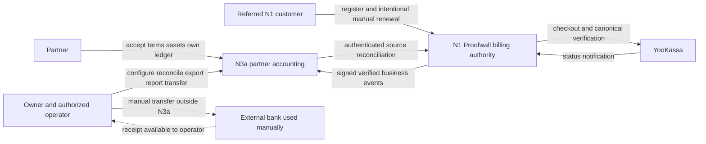
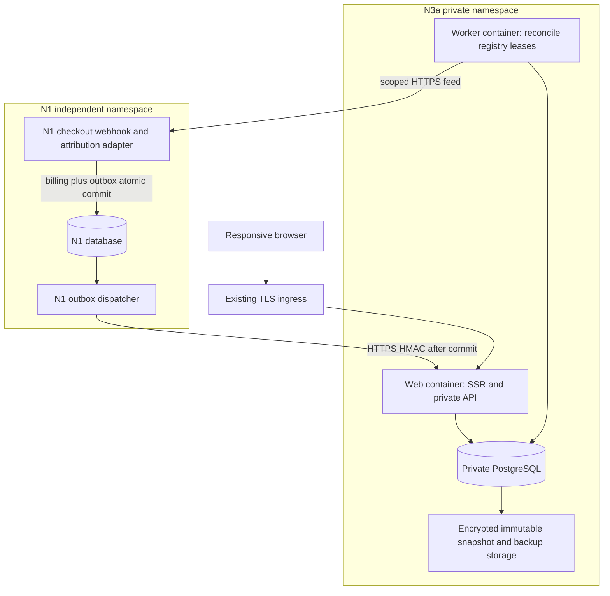
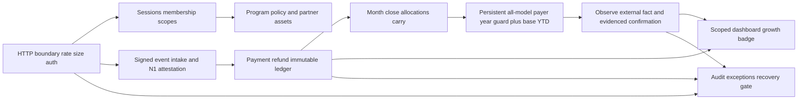
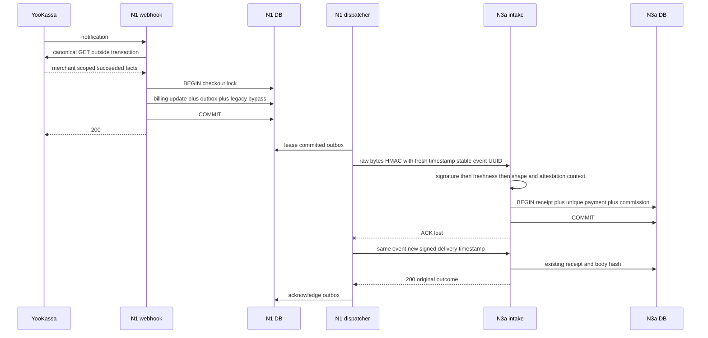
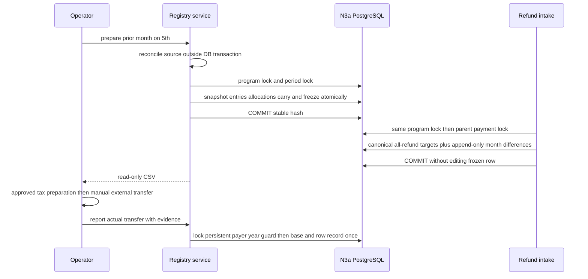
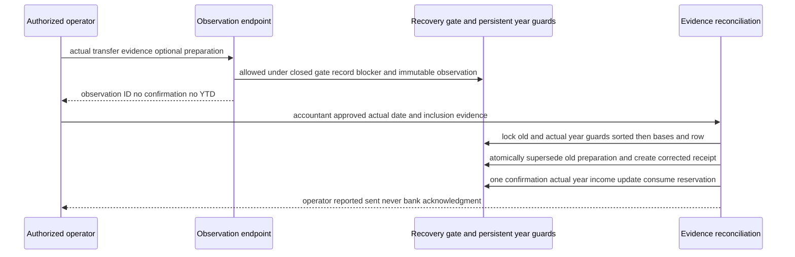

# C4 — N3a, предложенная топология

Дата: 2026-09-09. План до кода. Границы согласованы с [Architecture](Architecture.md), [Pseudocode](Pseudocode.md), [ADR-001..008](ADR.md). Mermaid использует обычные flowchart/sequence для переносимого отображения C4-уровней; блоки не означают уже запущенные сервисы.

## Level 1 — Context

N3a не вызывает банк и не подтверждает получение денег. YooKassa credentials принадлежат N1. Platform referral enrollment/leads — отдельный контекст N3a без второго денежного connector; N1 продажи не считаются продажами платформы.

## Level 2 — Containers

Нет связи N3a→N1DB, cross-project runtime import или host DB port. Web — единственный участник ingress network; worker/DB приватны. Node22/TypeScript/Next.js и pg предлагаются до exact dependency audit. Изолированные test/demo namespaces не переиспользуют production volumes.

## Level 3 — Components

Финансовые модули — внутри одного приложения и одной N3a DB, не самостоятельные микросервисы. Read projections не могут изменять debt. Persistent Tax guard and observation blockers охватывают payer/person/year across programs and all tax models; program lock охватывает close и postings.

## Critical sequence — successful payment, lost ACK, repeat

Отдельный sender event UUID не отменяет unique provider payment identity: новый transport ID той же оплаты также не начисляет повторно. Refund-before-payment ожидает parent/reconciliation; every new partial refund recomputes ALL canonical parent refund allocations, appending period differences. Prefreeze rechecks targets; semantic hash independent of delivery history, separate audit hash preserves it. Отказ до любого commit не оставляет consumed claim без денежного результата.

## Critical sequence — freeze and late refund

Смена фактической даты/налогового года не разрешает фиктивный sent: сохраняется external-transfer exception и нужна сверка. Из уже отправленной строки ничего не списывается повторно; следующая отрицательная сумма переносится ровно одной carry chain. Export не вызывает ConfirmManualTransfer.

## Recovery exception sequence — observation is not authorization

Payment/refund/rounding/close/ordinary tax preparation/confirmation hold RecoveryGate shared lock and require normal through commit. Restore transition takes exclusive lock. Observation and evidenced recovery remain available while closed; no ordinary transfer can occupy a reserved/blocked payer-year gap. Signup yields session-only context; acceptance of the user's own trusted invitation atomically grants partner read scope and assets, then enables program reads.
