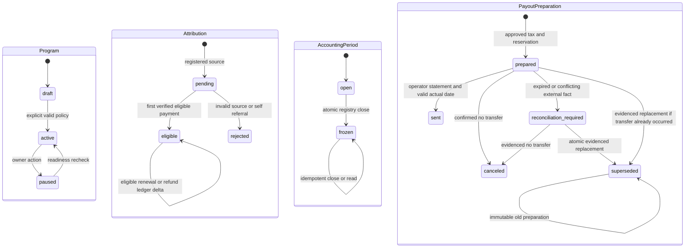

# Pseudocode — N3a, CJM A

Дата: 2026-09-09. Проектный алгоритмический контракт до реализации; источник outcomes — [Specification](Specification.md). Решения календаря, eligibility и налоговой области предложены для XL-checkpoint. [ADR](ADR.md) определяет причины выбора. Этот документ — **единственный владелец логических полей и наборов состояний**; Architecture описывает физическое отображение.

## Data Structures

Общие типы: `UUID`, `Timestamp` (UTC instant), `Date` (ISO local date), `Month` (YYYY-MM), `Money` (signed int64 minor units, арифметика arbitrary-precision с проверкой границ перед хранением), `Currency=RUB`, `Hash=SHA256`, `OpaqueID` (не UUID провайдера), `EvidenceRef` (закрытая ссылка/id + hash, без содержимого документа), `ReasonCode` (версионированный код причины). `?` означает nullable, не неявный default.

Каждая перечисленная ниже persisted entity **содержит `id: UUID`, `created_at: Timestamp`**. Все N3a tenant-owned entities дополнительно содержат `tenant_id: UUID`; для User/Session/ProviderProof/RecoveryGate это не требуется. RecoveryGate — deployment singleton; PayerYearGuard принадлежит проверенному payer ownership scope, один guard на его person/year для всех его программ, независимо от base category. Все внешние ID namespace-scoped; FK на tenant/program сверяются совместно. JSON snapshot использует ровно названный тип, не произвольный объект.

| Entity | Логические поля кроме общих |
|---|---|
| User | identity_hash:Hash, password_hash:string, enabled:boolean |
| EnrollmentGrant | program_id:UUID, invited_identity_hash:Hash, role:owner/operator/partner, scopes:set(read,configure,invite,payout,tax,reconcile), partner_id:UUID?, token_hash:Hash, expires_at:Timestamp, consumed_at:Timestamp?, enrolled_user_id:UUID?, issued_by:UUID, authority_evidence:EvidenceRef |
| Session | user_id:UUID, token_hash:Hash, expires_at:Timestamp, revoked_at:Timestamp? |
| Membership | user_id:UUID, program_id:UUID, role:owner/operator/partner, partner_id:UUID?, scopes:set(read,configure,invite,payout,tax,reconcile), status:active/revoked |
| Program | owner_id:UUID, name:string, public_slug:string, purpose:n1_commissions/platform_leads, status:draft/active/paused, current_policy_id:UUID?, timezone:string, calendar_locked_at:Timestamp?, currency:Currency |
| PolicyVersion | program_id:UUID, version:int, terms_hash:Hash, effective_at:Timestamp, rate_bp:int[1..10000]?, attribution_days:30/60/90, conflict_rule:explicit_promo_else_last_valid_cookie, recurring_mode:every_eligible_payment, commission_duration:lifetime, currency:Currency |
| Partner | program_id:UUID, user_id:UUID?, status:invited/active/suspended, accepted_policy_id:UUID?, accepted_at:Timestamp? |
| Invitation | program_id:UUID, partner_id:UUID, enrollment_grant_id:UUID, token_hash:Hash, expires_at:Timestamp, consumed_at:Timestamp? |
| EligibilityFact | program_id:UUID, subject_kind:partner/asset, subject_id:UUID, version:int, valid_from:Timestamp, status:invited/active/suspended/revoked, expires_at:Timestamp?, consent_policy_id:UUID?, actor_id:UUID, evidence:EvidenceRef |
| PartnerAsset | program_id:UUID, partner_id:UUID, kind:link/promo, public_code:string, status:active/revoked, expires_at:Timestamp?, cohort:string |
| Attribution | connection_id:UUID, program_id:UUID, partner_id:UUID?, customer_id:OpaqueID, project_id:OpaqueID, asset_id:UUID?, source:promo/cookie/none, reason:ReasonCode, policy_id:UUID, registered_at:Timestamp, registration_payload_hash:Hash, eligibility_fact_ids:list(UUID), registration_eligible:boolean, eligibility_reason:ReasonCode, first_paid_at:Timestamp?, status:pending/eligible/rejected, consent_evidence:EvidenceRef? |
| Connection | program_id:UUID, source:N1, environment:test/live, merchant_id:OpaqueID, verification_contract_ref:EvidenceRef, hmac_key_ids:set(string), status:configured/active/paused, cutover_at:Timestamp?, cutover_manifest:EvidenceRef?, reconcile_cursor:string?, verified_watermark:Timestamp? |
| N1Outbox | N1-owned only: connection_id:UUID, event_id:UUID, event:BusinessEvent/RegistrationEvent, body_hash:Hash, sequence:int64, status:pending/leased/acknowledged, attempts:int, next_attempt_at:Timestamp, lease_until:Timestamp?, acknowledged_at:Timestamp? |
| EventReceipt | connection_id:UUID, event_id:UUID, event_type:payment.succeeded/refund.succeeded, body_hash:Hash, provider_object_id:OpaqueID, result:applied/duplicate_business, applied_at:Timestamp |
| ProviderProof | connection_id:UUID, object_id:OpaqueID, kind:payment/refund, merchant_id:OpaqueID, environment:test/live, status:succeeded, amount:Money, currency:Currency, parent_payment_id:OpaqueID?, occurred_at:Timestamp, fetched_at:Timestamp, response_hash:Hash, verified_by:N1, signature_event_id:UUID, event_time_basis:payment_captured_at/refund_created_at |
| Payment | connection_id:UUID, program_id:UUID, attribution_id:UUID?, provider_payment_id:OpaqueID, customer_id:OpaqueID, checkout_id:OpaqueID, amount:Money, currency:Currency, occurred_at:Timestamp, proof_id:UUID, policy_id:UUID?, commission_amount:Money, refunded_amount:Money, reversed_commission:Money, eligible:boolean, reason:ReasonCode |
| Refund | connection_id:UUID, payment_id:UUID, provider_refund_id:OpaqueID, amount:Money, occurred_at:Timestamp, proof_id:UUID |
| RefundAllocationRevision | payment_id:UUID, refund_set_hash:Hash, basis_totals:map(Month,Money), source_receipt_id:UUID |
| LedgerEntry | program_id:UUID, partner_id:UUID, payment_id:UUID, refund_id:UUID?, policy_id:UUID, kind:commission/refund_adjustment/refund_reallocation, allocation_revision_id:UUID?, basis_month:Month, delta:Money, currency:Currency, occurred_at:Timestamp, accounted_month:Month, recorded_at:Timestamp, source_receipt_id:UUID |
| AccountingPeriod | program_id:UUID, month:Month, timezone:string, state:open/frozen, due_date:Date, closed_at:Timestamp?, register_id:UUID? |
| Registry | program_id:UUID, period_id:UUID, revision:int, frozen_at:Timestamp, due_date:Date, source_watermark:Timestamp, snapshot_hash:Hash, audit_artifact_hash:Hash |
| RegistryRow | registry_id:UUID, partner_id:UUID, gross_delta:Money, carry_in:Money, payable_gross:Money, carry_out:Money, initial_tax_snapshot_id:UUID?, exceptions:list(UUID), row_hash:Hash |
| Allocation | row_id:UUID, ledger_entry_id:UUID |
| Carry | program_id:UUID, partner_id:UUID, source_row_id:UUID, amount:Money<=0, consumed_by_row_id:UUID? |
| TaxProfile | partner_id:UUID, payer_id:OpaqueID, person_id:OpaqueID, legal_form:individual/ip/company, npd:boolean, residency:string, base_category:string, contract_ref:EvidenceRef, valid_from:Date, valid_until:Date?, status:review/approved, status_evidence:EvidenceRef, npd_limit_evidence:EvidenceRef?, npd_receipt_evidence:EvidenceRef?, approved_by:UUID?, approved_at:Timestamp? |
| TaxRule | version:string, effective_from:Date, effective_until:Date?, residency:string, base_category:string, brackets:list(upper_minor:Money?,rate_bp:int), base_rule_ref:EvidenceRef, rounding_rule_ref:EvidenceRef, npd_rules_ref:EvidenceRef, approved_by:UUID, approved_at:Timestamp |
| TaxYTD | payer_id:OpaqueID, person_id:OpaqueID, year:int, base_category:string, opening_base:Money?, opening_withheld:Money?, opening_evidence:EvidenceRef?, paid_base:Money, withheld:Money, version:int |
| PayerYearGuard | payer_id:OpaqueID, person_id:OpaqueID, year:int, active_preparation_id:UUID?, blocked_observation_ids:set(UUID), confirmed_income:Money, npd_confirmed_income:Money, npd_declared_total:Money?, npd_covered_income:Money?, npd_evidence:EvidenceRef?, version:int |
| TaxSnapshot | row_id:UUID, profile_id:UUID, rule_id:UUID, actual_payment_date:Date, year:int, guard_id:UUID, guard_version:int, ytd_version:int?, tax_model:withholding/npd/no_withholding, gross:Money, taxable_base:Money?, calculated_tax:Money?, withheld_tax:Money?, net:Money?, eligibility:review/approved, reason:ReasonCode, accountant_id:UUID?, approval_ref:EvidenceRef?, inclusion_evidence:EvidenceRef?, historical_basis:HistoricalTaxBasis?, current_counter_plan:CurrentCounterPlan? |
| PayoutPreparation | row_id:UUID, request_id:UUID, tax_snapshot_id:UUID, state:prepared/canceled/sent/reconciliation_required/superseded, replaces_id:UUID?, reconciliation_observation_id:UUID?, prepared_by:UUID, expires_at:Timestamp, transfer_reference:EvidenceRef? |
| PayoutConfirmation | row_id:UUID, preparation_id:UUID, request_id:UUID, actor_id:UUID, actual_date:Date, gross:Money, withheld:Money, net:Money, transfer_reference:EvidenceRef, statement:operator_reported_sent |
| ReconcileException | connection_id:UUID?, program_id:UUID, event_id:UUID?, object_id:OpaqueID?, body_hash:Hash?, reason:ReasonCode, status:open/resolved, evidence:EvidenceRef?, due_at:Timestamp?, external_transfer:TransferObservation?, resolved_by:UUID?, resolved_at:Timestamp? |
| AuditEvent | actor_id:UUID?, program_id:UUID?, action:string, target_id:UUID?, result:string, reason:ReasonCode?, correlation_id:UUID, sanitized_evidence:EvidenceRef? |
| GrowthEvent | program_id:UUID, partner_id:UUID?, actor_id:UUID?, kind:click/signup/qualified_lead/first_value_offer/share_open/share_intent/badge_impression/badge_click, asset_id:UUID?, qualification_evidence:EvidenceRef?, subject_id:OpaqueID, source_ledger_id:UUID?, client_request_id:UUID? |
| Entitlement | program_id:UUID, capability:remove_badge, status:active/revoked, valid_until:Timestamp?, grant_evidence:EvidenceRef |
| RecoveryGate | state:normal/reconciliation_required, backup_watermark:Timestamp?, reconciliation_evidence:EvidenceRef?, approved_by:UUID?, approved_at:Timestamp? |

`BusinessEvent` is an immutable versioned transport value, not another N3a entity: `{schema_version:1,event_id:UUID,event_type:payment.succeeded|refund.succeeded,connection_id:UUID,sequence:int64,customer_id:OpaqueID,project_id:OpaqueID,checkout_id:OpaqueID,attribution_id:UUID?,program_id:UUID,partner_id:UUID?,provider_payment_id:OpaqueID,provider_refund_id:OpaqueID?,amount_minor:Money,currency:RUB,occurred_at:Timestamp,event_time_basis:payment_captured_at|refund_created_at,environment:test|live,subscription_facts:null,verification:ProviderVerification}`. Refund amount is this refund's delta. Payment occurred_at is canonical payment.captured_at; refund occurred_at is canonical refund.created_at (creation time of a refund subsequently verified succeeded, not a fictional success timestamp). The signed event_time_basis names this distinction. Missing/unparseable required timestamp or implausible future value creates a reconciliation exception; delivery/received_at is never substituted. N1 v1 carries `subscription_facts:null`; future nonnull shape requires a new version.

`RegistrationEvent={schema_version:1,event_id:UUID,event_type:customer.registered,connection_id:UUID,sequence:int64,program_id:UUID,customer_id:OpaqueID,project_id:OpaqueID,registered_at:Timestamp,explicit_promo:string?,cookie_asset_id:UUID?,cookie_captured_at:Timestamp?,consent_evidence:EvidenceRef?}`. It has its own attribution endpoint; immutable payload hash and connection/customer/project uniqueness make retries stable. `TransferObservation={request_id:UUID,row_id:UUID,preparation_id:UUID?,actual_date:Date,gross:Money,withheld:Money,net:Money,actor_id:UUID,evidence:EvidenceRef}` records an alleged external fact under review; it does not authorize a transfer or mint a valid Confirmation.

`ProviderVerification={object_id:OpaqueID,kind:payment/refund,merchant_id:OpaqueID,environment:test/live,status:succeeded,amount:Money,currency:RUB,parent_payment_id:OpaqueID?,occurred_at:Timestamp,fetched_at:Timestamp,response_hash:Hash,event_time_basis:payment_captured_at/refund_created_at}` is a signed N1 attestation of its canonical API lookup, stored as ProviderProof in N3a. Only N1 holds provider credentials and performs provider GET; N3a verifies connection authenticity and attested facts, then reconciles against the authenticated N1 source. No shared secrets from the YooKassa account are copied to N3a. `ProviderProof` contains sanitized verified facts, not secrets/card data. Pilot policy is every_eligible_payment/lifetime only; first-only and finite caps are deferred, not silently configured. first_paid_at is MIN occurred_at of all eligible verified payments, a display projection rather than an eligibility frontier. Program.timezone is immutable after activation or first attribution/ledger, including while paused; AccountingPeriod copies that calendar once. Registration-time policy version stays fixed. Cross-tenant person identity is never inferred from email: payer-controlled verified identity authorizes YTD consolidation across its programs only.

`HistoricalTaxBasis` is an immutable accountant-approved reconstruction immediately BEFORE the observed transfer, not a current DB balance: `{observation_id:UUID,payer_id:OpaqueID,person_id:OpaqueID,year:int,actual_date:Date,transfer_key:OpaqueID,profile_id:UUID,rule_id:UUID,tax_model:withholding/npd/no_withholding,base_category:string,transfer_gross:Money,transfer_base:Money?,pre_base_total:Money?,pre_withheld_total:Money?,pre_npd_declared:Money?,pre_npd_internal:Money?,pre_npd_covered:Money?,ordered_prefix_hash:Hash,ordering_evidence:EvidenceRef,balance_evidence:EvidenceRef,approved_by:UUID,approved_at:Timestamp}`. The ordering proof names the transfer's position and complete preceding balances, excluding this transfer and later ones (including same-day order). Withholding requires pre_base/pre_withheld; NPD requires all three pre-NPD components with0≤covered≤internal; irrelevant mode inputs are explicitly null. Missing/ambiguous historical order or required balance is review, never current minus guessed gross.

`CurrentCounterPlan` independently describes CURRENT inclusion after any later payments/opening imports: `{observation_id:UUID,payer_id:OpaqueID,person_id:OpaqueID,year:int,expected_guard_version:int,expected_ytd_version:int?,current_npd_declared:Money?,declaration_contains_transfer:boolean?,declaration_evidence:EvidenceRef?,decisions:map(guard_total|npd_internal|npd_coverage|base_total|withheld_total,CounterDecision),approved_by:UUID,approved_at:Timestamp,evidence:EvidenceRef}`. `CounterDecision={inclusion:already_included/add_missing/not_applicable,current_inclusive_value:Money?,contribution:Money,delta:Money,evidence:EvidenceRef}`; already_included→delta0, add_missing→delta=contribution, not_applicable→contribution/delta0. Base/withheld current_inclusive_value includes opening+paid; any missing delta goes only to paid_base/withheld, never silently edits opening. guard_total contribution=gross; npd_internal=gross only for NPD; base/withheld contributions come from HISTORICAL calculation, not current marginal rate. npd_coverage contribution=gross only when CURRENT declaration already contains this transfer; its independent coverage inclusion decision determines delta0 versus add_missing; declaration inclusion is independently evidenced, not derived from internal inclusion. All five decisions are mandatory and may differ. Partial/unknown inclusion stays review pending a separate approved correction, not inferred from equal totals. Both typed values are persisted inside the new TaxSnapshot (ordinary prospective snapshot may leave them null); EvidenceRef supplies supporting documents, not a substitute for these fields.

## Core Algorithms

### Algorithm: AuthenticateSession
REQUIREMENT: `FR-AUTH-001`
REALISES: SC-US-001-3, SC-US-002-3, SC-US-013-1, SC-US-013-2, SC-US-013-3, SC-US-013-4, SC-US-013-5, SC-US-013-6
INPUT: explicit signup/login/logout, password, invitation/enrollment token.
OUTPUT: authenticated session or safe denial.
STEPS:
1. Bound rate/body/admission first. Login/signup yields identity-only session, not implicit program access. Signup requires unexpired EnrollmentGrant matching verified identity; existing User logs in and binds that same grant without duplicate account. A session can access only own enrollment/accept/logout until a Membership is active.
2. Minimal trusted issuance: integration owner provisions pilot Program draft plus owner EnrollmentGrant with verified N1-owner evidence, never a client-selected owner. Existing program owner with invite scope creates partner placeholder+bound Invitation/Grant atomically, or operator Grant with an explicit subset of its delegable scopes (no owner/configure/invite by default). These are narrow existing onboarding operations, not a new admin product. Issuer and evidence are persisted; caller role fields ignored.
3. Adapt audited N1 Argon2id with random salt/versioned bounded work factors and hash-only opaque sessions; foundation fixes concrete settings and 24-hour absolute session expiry in docs/features/foundation/03_architecture.md. Generic credential failure/dummy verification for absent identity; KDF outside DB transaction, concurrency2/queue8 per web process. BEGIN locks grant if binding; create unique User or verify existing session identity; set enrolled_user_id, create Session, COMMIT. Do not consume partner grant or insert partner Membership before consent.
4. For owner/operator grant acceptance, authenticated bound user explicitly accepts; BEGIN lock program+grant, recheck issuer authority/scope ceiling/expiry, insert unique(program,user,role) Membership with grant scopes, consume grant and audit, COMMIT. Partner grant acceptance delegates to AcceptPartnerAndAssets. Replay same grant returns own existing membership; conflicting identity returns404.
5. Login compares hash outside transaction, rechecks User.enabled before Session creation. Return Secure/HttpOnly/SameSite cookie; CSRF/Origin on mutations. Every protected program request resolves active current Membership; identity-only session still can accept its bound invitation. Logout/revocation writes Session.revoked_at; revoked/expired session rejected even for enrollment. RETURN only authorized session context.
COMPLEXITY: O(1) indexed records plus bounded password KDF cost.

### Algorithm: AuthorizeAndConfigure
REQUIREMENT: `FR-PROGRAM-001`
REQUIREMENT: `FR-PROGRAM-002`
REALISES: SC-US-001-1, SC-US-001-2, SC-US-001-3, SC-US-006-4
INPUT: session, program ID, explicit policy fields, expected current version.
OUTPUT: active version or denied/validation/conflict.
STEPS:
1. Apply bounded rate limit before body validation; authenticate session and server membership. IF configure scope absent THEN audit denied and RETURN 404 without existence disclosure.
2. For n1_commissions validate % rate, every-payment/lifetime acknowledgment, 30/60/90 window, RUB, timezone and terms; missing→422 named fields, no20% default. For proposed platform_leads validate explicit lead-only terms/calendar and prohibit monetary activation/rate promises; nullable rate is permitted only there.
3. For purpose=platform_leads, explicit lead-only terms may activate enrollment/asset tracking with rate_bp=null and no Connection; they promise no payment. The N1 monetary program still requires all monetary inputs. BEGIN; lock Program; IF calendar_locked_at is nonnull and submitted timezone differs THEN rollback RETURN409 immutable_calendar. First activation atomically sets calendar_locked_at; fallback first attribution/ledger sets it if absent. IF expected version differs THEN rollback RETURN 409. Insert immutable PolicyVersion effective now or later; no retroactive date. Monetary activation requires selected current version and configured N1 connection readiness. Select current_policy_id only from versions with effective_at≤now; future version cannot activate early. Registration always resolves max(effective_at≤registered_at), so stale cached pointer cannot override policy. Update status, audit; COMMIT.
4. RETURN version; existing Attribution.policy_id and LedgerEntry are unchanged.
COMPLEXITY: O(1) indexed reads/writes.

### Algorithm: AcceptPartnerAndAssets
REQUIREMENT: `FR-PARTNER-001`
REQUIREMENT: `NFR-SECURITY-001`
REALISES: SC-US-002-1, SC-US-002-2, SC-US-002-3, SC-US-011-3, SC-US-013-5, SC-US-013-6
INPUT: session, invitation token, accepted policy ID; asset/cohort requests.
OUTPUT: own link/promo or safe denial.
STEPS:
1. Authenticate identity-only session; hash token, verify own Invitation→EnrollmentGrant identity/partner/program, expiry and enrolled_user_id. This narrowly scoped acceptance endpoint requires no preexisting partner Membership; asset/ledger reads still require active Membership and own partner ID.
2. BEGIN; lock program→grant→invitation→partner. IF invitation already consumed by this user THEN RETURN existing membership/assets after COMMIT. ELSE recheck current effective terms and submitted version; stale terms→rollback409, foreign/revoked token→404. Existing User follows exactly the same path, without resetting other memberships.
3. Save explicit actor/time/policy consent; set Partner.user_id and active status; append EligibilityFact(active,valid_from=server now,consent_policy_id) and active asset facts. Create unique(program,user,role=partner) Membership active with scopes={read}, partner_id bound server-side. Insert one link/promo with unique public code, bounded collision retry3 then failure. Consume grant+invitation, audit and COMMIT all changes together.
4. Owner-authorized suspension/reactivation/revocation later appends new EligibilityFact at server transaction time (unique subject/version, no backdating/deletion), then updates current-state projection and corresponding Membership access status atomically (suspended/revoked disables portal access; reactivation restores only its prior approved minimal scopes). Asset expiry belongs to its immutable fact. RETURN own assets; two concurrent acceptances cannot create a second membership or assets.
COMPLEXITY: O(1) apart from bounded collision retries.

### Algorithm: CaptureAttribution
REQUIREMENT: `FR-ATTRIBUTION-001`
REQUIREMENT: `FR-ATTRIBUTION-002`
REQUIREMENT: `FR-GROWTH-004`
REALISES: SC-US-003-2, SC-US-003-3, SC-US-011-2, SC-US-003-4
INPUT: N1 registration identity, explicit promo?, valid first-party cookie?, signed connection context.
OUTPUT: stable Attribution or rejected reason, no commission.
STEPS:
1. Program link redirects only to allowlisted N1 origin/path with opaque asset; N1 stores first-party signed Secure/HttpOnly/SameSite=Lax referral cookie with captured_at, bounded by policy window/consent. Record sanitized click once; no third-party cookie dependency.
2. N1 registration commits local customer/project/referral facts and RegistrationEvent outbox together; asynchronous delivery retries. Unsynced attribution blocks monetary intake, never falls back to guessed no-referral. N3a verifies signed event and registered_at; authenticity failure cannot populate historical authority.
3. BEGIN; lock Program and resolve policy max(effective_at≤registered_at). Resolve each asset/partner EligibilityFact by latest(valid_from,version)≤registered_at; expires_at checked at registration, not arrival. History starts at immutable creation (partner invited, asset active); a timestamp before creation/acceptance is known invalid. If historical data/consent completeness is genuinely unknown, rollback with retryable review, not a rejected current-state guess. Later suspension/reactivation/revocation does not retroactively change valid facts. Selected fact IDs and registration_eligible are saved in Attribution.
4. Explicit promo valid at registered_at wins; explicitly invalid/revoked-then/expired-then promo rejects without cookie fallback. Otherwise choose last cookie whose asset was valid at capture and registration and whose captured_at+policy window covers registration. No source yields rejected no_referral; self-referral by verified identity yields rejected, ambiguous identity waits review. Preserve source, reason, policy and historical fact IDs.
5. Insert unique(connection,customer,project) Attribution with pending if historical decision eligible, otherwise rejected; first_paid_at=null. Identical retry checks registration_payload_hash and returns original decision, conflicting hash→exception. Ensure calendar_locked_at set. COMMIT; RETURN pending/rejected. Current status can restrict portal access, but cannot reassign a historically valid customer's later commission.
COMPLEXITY: O(1) indexed lookup.

### Algorithm: N1VerifiedBillingOutbox
REQUIREMENT: `FR-N1-001`
REALISES: SC-US-003-1, SC-US-004-1
INPUT: YooKassa notification or scheduled canonical reconciliation fact.
OUTPUT: durable N1 billing + outbox, then provider HTTP 200; or retryable failure.
STEPS:
1. Bound rate/body/read time; enforce trusted-proxy source CIDR for webhook. Parse minimal object identity; retrieve canonical YooKassa payment/refund outside any DB transaction with scoped merchant credentials and timeout. IF unavailable/mismatch/not terminal succeeded THEN no durable claim; RETURN retryable error or explicit mismatch exception.
2. Resolve local N1 checkout/customer/project; compare canonical ID, merchant, mode, amount/currency and local checkout. Never trust missing account_id metadata or redirect success. Canceled/older nonterminal events cannot reduce paid_until or overwrite completed checkout.
3. BEGIN N1 transaction; lock checkout and local integration authority; validate immutable checkout again. IF business fact already applied THEN RETURN durable existing outcome after COMMIT. ELSE claim business fact, apply local billing (max(now, paid_until)+30 days for new payment), append outbox with sender UUID and monotonic sequence in **same commit**. Refund processing records verified refund/outbox; N3a does not invent N1 tariff-refund policy.
4. Enforce cutover manifest: before boundary legacy debt only; after boundary bypass legacy commission writer. Unknown attribution/migration mapping remains outbox exception, never parallel payable debt. COMMIT; only now dispatch asynchronously and RETURN provider 200.
5. Dispatcher leases bounded batch, signs immutable bytes with fresh delivery timestamp for each retry. Network calls after lease transaction; success ACK saved afterward. Lost ACK replays same event; backoff and reconcile retain undelivered events beyond provider's 24h window. No in-memory-only queue.
COMPLEXITY: O(1) per payment; O(b) dispatch batch b.

### Algorithm: AuthenticateAndVerifyIntake
REQUIREMENT: `NFR-SECURITY-002`
REALISES: SC-US-003-3, SC-US-004-3, SC-US-005-3, SC-US-004-4
INPUT: POST raw bytes, connection URL, signed headers.
OUTPUT: verified BusinessEvent/ProviderProof or deterministic error/exception.
STEPS:
1. Bound admission, raw body ≤64 KiB and read deadline 5 s before DB transaction. Obtain configured key via untrusted bounded key ID; compute HMAC over canonical header prefix+raw bytes, length-check then constant-time compare. IF invalid THEN uniform 401, no claim/body parse.
2. AFTER signature, check signed timestamp ±300 s, active key/connection; IF stale THEN 401. Parse strict v1 JSON; compare URL connection, tenant/program/mode and allowed IDs/types; reject unknown shape with 422.
3. Read receipt by connection/event UUID: IF present and hash equal THEN RETURN original applied/duplicate outcome; ELSE hash mismatch → 409 + exception. This optimization follows auth and validates an already committed receipt only.
4. Check signed verification attestation against event: succeeded, provider ID, configured merchant/mode, amount/RUB, parent refund and N1 checkout/customer identity; validate expected checkout snapshot through bounded authenticated N1 reconciliation when absent locally. Network work stays outside transaction. IF N1 reconciliation unavailable THEN503 and no claim. IF mismatch THEN422 + exception, no financial claim. N3a does not possess YooKassa credentials or invent its webhook HMAC.
5. RETURN verified facts to PostPayment/PostRefund, which revalidate local versions and atomically insert receipt with money. Refund without known parent → 409 dependency_missing + exception, no terminal receipt; recover parent through reconcile and retry.
COMPLEXITY: O(bytes) for HMAC plus O(1) bounded N1 verification lookup when required.

### Algorithm: PostPayment
REQUIREMENT: `FR-COMMISSION-001`
REQUIREMENT: `FR-GROWTH-002`
REALISES: SC-US-003-1, SC-US-004-1, SC-US-004-3, SC-US-011-1, SC-US-003-4
INPUT: verified payment event/proof.
OUTPUT: one positive commission or durable no-commission reason.
STEPS:
1. Reject platform_leads monetary intake. BEGIN; acquire RecoveryGate shared lock and require normal, then program→attribution→payment locks. Recheck cutover, ownership, source proof and persisted registration eligibility/fact IDs. Missing attribution/history→rollback retryable exception, never guessed eligibility. Every financial transaction holds this gate lock through commit; restore changes gate with exclusive lock.
2. Atomically claim receipt unique(connection,event_id); same hash returns original outcome. Payment unique(connection,provider_payment_id) independently excludes a second commission with another transport UUID; identical business duplicate adds duplicate_business receipt only, changed facts→rollback exception.
3. Eligibility requires registration_eligible=true, succeeded positive RUB, payment≥registered_at and cutover, original frozen percentage; every eligible payment is commissioned for lifetime in pilot. Current partner/asset status and first_paid_at never change this historical decision. If ineligible persist Payment zero/reason and receipt; Attribution stays rejected (invalid registration) or retains prior pending/eligible (this payment alone invalid); COMMIT RETURN reason.
4. commission=roundHalfUp(amount_minor×rate_bp/10000), exact integer arithmetic. Save immutable Payment, counters0, original policy/proof; AssignPeriod chooses basis/accounted month using locked immutable calendar. Insert unique positive-kind commission LedgerEntry (zero amount allowed for audit, not growth).
5. In same transaction set Attribution.status=eligible and first_paid_at=min(existing nonnull,occurred_at), including eligible payment with rounded commission0. Save receipt/payment/ledger together, recheck gate normal and COMMIT. Delayed earlier eligible payment adjusts only first_paid_at projection; no earlier commission is invalidated. RETURN applied.
COMPLEXITY: O(1) indexed operations; exact integer arithmetic.

### Algorithm: PostRefund
REQUIREMENT: `FR-COMMISSION-002`
REQUIREMENT: `NFR-RELIABILITY-001`
REALISES: SC-US-005-1, SC-US-005-2, SC-US-005-3, SC-US-005-4
INPUT: canonical succeeded refund with known parent payment.
OUTPUT: linked immutable negative delta or duplicate.
STEPS:
1. BEGIN; shared-lock RecoveryGate and require normal; lock program→parent Payment. Missing parent/legacy/unknown attribution→rollback exception without consumed receipt. Verify immutable parent, positive amount/RUB/merchant/mode.
2. Claim receipt and Refund unique(connection,provider_refund_id) atomically. Identical existing refund returns original outcome; changed amount/parent→rollback exception. Sum ALL persisted parent refunds plus candidate; if total>paid amount rollback, never clamp bad facts. Refund records are immutable source facts; no order-dependent reversal amount is stored on them.
3. Canonical reconciliation over ALL parent refunds, across prior batches: sort by (occurred_at,provider_refund_id byte order). For each sorted refund i compute d_i=roundHalfUp(C×prefix_amount_i/P)−roundHalfUp(C×prefix_amount_(i−1)/P), with full total P forcing total C. Group desired negative deltas −d_i by basis month=max(refund event month,parent accounted month). Sum desired is bounded [−C,0]; same known facts always give same per-month targets.
4. Hash canonical sorted provider refund IDs/amounts/timestamps, parent provider payment identity/amount/original commission as refund_set_hash; exclude local UUIDs/receipt IDs. Compare desired basis-month totals with actual sum of every earlier refund_adjustment/refund_reallocation LedgerEntry by basis_month. Insert one immutable RefundAllocationRevision(unique payment,set_hash) and signed difference entries per basis_month: initial negative allocation kind refund_adjustment; later changes kind refund_reallocation may be positive or negative. Unique(revision,basis_month) makes replay safe; zero difference needs no entry. Never edit earlier Refund/LedgerEntry. For a frozen basis month route new difference to next open current month while retaining basis_month and late reason; never rewrite frozen/sent history.
5. Update parent refunded_amount=sum amounts, reversed_commission=canonical cumulative target; assert ledger refund total=−target. Receipt/refund/revision/differences/counters commit together under gate. Run the same canonical reconcile under parent locks immediately before freeze; a new earlier fact arriving after freeze gets append-only future correction. RETURN applied. For P100/C1 and Sep30 refund30 + Oct1 refund30 delivered in either order onOct2, targets are Sep0/Oct−1, even across separate batches.
COMPLEXITY: O(r log r) for r parent refunds plus O(m) changed basis months; bounded reconciliation job for oversized parent, freeze waits for it.

### Algorithm: AssignPeriodAndFreezeRegistry
REQUIREMENT: `FR-PAYOUT-001`
REQUIREMENT: `FR-PAYOUT-002`
REQUIREMENT: `FR-PAYOUT-004`
REQUIREMENT: `NFR-INTEGRITY-001`
REQUIREMENT: `NFR-PERFORMANCE-001`
REALISES: SC-US-006-1, SC-US-006-2, SC-US-005-2, SC-US-005-4, SC-US-006-4
INPUT: verified event instant for posting; or scoped owner close request for preceding month.
OUTPUT: accounted_month or stable frozen Registry + rows.
STEPS:
1. AssignPeriod under program lock converts occurred_at to immutable Program.timezone; period create uses unique(program,month), copies exact timezone and due_date=5th next month. Any existing period timezone mismatch is an exception, never overwritten. IF month open and not before integration start THEN use it even for Sep payment arriving Oct2. ELSE choose earliest open month at/after intended month and current local month; mark late reason. Never include October occurred payment in September. Refund accounted month also cannot precede parent accounted month.
2. Freeze request requires payout scope, RecoveryGate normal and local day≥5 for preceding month; missed prior months closed explicitly in chronological order, due date stays original 5th. Read/reconcile provider/N1 feeds outside transaction; unresolved financial exceptions block freeze and show incomplete preview. Preview creates no allocations/debt.
3. BEGIN; shared-lock RecoveryGate and require normal, then acquire same program lock as every posting; lock period. IF already frozen THEN RETURN existing Registry/hash. Recheck watermark/exception versions after external work; on drift retry reconciliation. Under parent locks run PostRefund canonical reconciliation for every affected payment (no new receipt when set unchanged); assert period targets settled before close. Capture all unallocated period LedgerEntries and predecessor negative Carry; no arbitrary hold or minimum threshold.
4. For each partner, gross_delta=sum(entries), carry_in=sum(unconsumed Carry.amount), payable_gross=max(0,gross_delta+carry_in), carry_out=min(0,gross_delta+carry_in). Create immutable row and unique Allocation per entry; consume each carry once. IF carry_out<0 THEN create one new Carry(source_row,amount); ELSE none. A carry is not another ledger refund and its source entries never reallocate.
5. Attach available immutable tax preview snapshot or explicit tax-review exception; unknown tax/net remain null, never 0. snapshot_hash hashes canonical economic rows (stable business IDs, month, net basis totals, carry, original policy and normalized tax inputs), excluding delivery IDs, correction-row IDs and local created_at; row_hash follows the same rule. audit_artifact_hash separately hashes full frozen rows/allocations/provenance including delivery-dependent append-only corrections. Save Registry and freeze atomically under gate. Equivalent complete business facts yield identical economic snapshot_hash, not necessarily identical audit_artifact_hash. Tax evidence later creates linked versioned payout receipt, never overwrites this frozen snapshot.
6. RETURN stable snapshot; export is read-only and displays snapshot/preparation version, gross and known/null tax/net. Unsent positive rows remain on this registry; don't auto-carry them into another payout. Failure/timeout rolls back all allocations/close; async job reports explicit failure.
COMPLEXITY: O(n log n) deterministic order/hash for n entries, n≤10000 pilot; batch work deadline≤60 s, no network under lock.

### Algorithm: CalculateAndPrepareTax
REQUIREMENT: `FR-TAX-001`
REQUIREMENT: `FR-TAX-002`
REQUIREMENT: `FR-TAX-003`
REQUIREMENT: `FR-TAX-004`
REALISES: SC-US-007-1, SC-US-007-2, SC-US-007-3, SC-US-007-4
INPUT: frozen row, planned actual transfer date, approved profile/rules/base/YTD/evidence, request UUID.
OUTPUT: immutable TaxSnapshot + prepared operation, or review exception.
STEPS:
1. Authorize payout/tax scope and row, validate gross>0 and approved date-valid payer/person/profile/contract/rules outside transaction; missing evidence→review. Normal planned actual date is Registry.due_date (5th); a late catch-up preparation requires explicit owner approval, recorded reason and current/future planned date, keeps the original due_date and visible late status, and still passes all tax/guard checks. Early planned dates and unresolved row TransferObservation are rejected. No automatic rescheduling. No tax model bypasses the shared preparation guard.
2. BEGIN; shared-lock RecoveryGate require normal; create/lock persistent PayerYearGuard unique(payer,person,actual year), independent of program/base/tax model, then needed TaxYTD base and RegistryRow. Recheck profile/evidence versions, no Confirmation, no blocked observation and active_preparation_id=null. Same request returns existing preparation; another active prepared/reconciliation_required reservation→409 even after its transaction committed. Payer-authorized internal scope can coordinate its programs; clients cannot inspect foreign program detail through guard.
3. IF withholding: require known opening_base/opening_withheld/evidence plus current base TaxYTD; compute B by approved base/deduction rule. Y=opening_base+paid_base; T(x)=approved rounding of marginal band portions (main-scale13/15/18/20/22%, thresholds2.4/5/20/50million RUB where applicable). due=T(Y+B)−(opening_withheld+withheld); invalid/negative/exceed-gross→review rollback, not clamp. Store calculated versus to-withhold explicitly. ELSE skip withholding formula; require approved no-withholding legal basis and set tax0/net=gross, not unknown-as0.
4. IF NPD: under same guard require current eligibility/contract, npd_evidence, npd_declared_total and npd_covered_income. Covered income is the exact guard.npd_confirmed_income already included in the declared aggregate evidence; require 0≤covered≤npd_confirmed_income. Known total=declared_total+(npd_confirmed_income−covered_income); candidate=known total+gross (existing reserved amount cannot coexist). If candidate>240000000 or external-income evidence unknown/stale→review rollback, no split or6% withholding. New declaration replaces baseline only with approved coverage reconciliation to prevent double counting. Future receipt is due-after-payment obligation; already-due missing evidence blocks preparation.
5. Advance guard.version and save immutable approved TaxSnapshot with resulting guard_id/version, tax_model and optional base YTD version; create prepared PayoutPreparation and persist guard.active_preparation_id in SAME commit for withholding, NPD and other models. Preparation is not paid income. Gate stays locked to commit; unrelated payer/person can proceed. RETURN preparation and expiry=end planned local transfer date.
6. Proven no-transfer cancellation locks same guard/row, marks canceled and clears reservation atomically; expiry alone marks reconciliation_required and retains reservation. An observed transfer follows ConfirmManualTransfer observation/reconciliation modes, never cancellation merely to make room.
COMPLEXITY: O(k) bands plus indexed guard/base/row locks; k=5 in applicable main-scale rule.

### Algorithm: ConfirmManualTransfer
REQUIREMENT: `FR-PAYOUT-003`
REALISES: SC-US-006-3, SC-US-007-3, SC-US-007-5, SC-US-006-5, SC-US-006-6
INPUT: authorized operator, mode, optional preparation ID, request UUID, actual date/amounts and evidence; reconcile_observation additionally requires approved HistoricalTaxBasis and independent CurrentCounterPlan.
OUTPUT: one operator_reported_sent confirmation or reconciliation_required.
STEPS:
1. Three explicit modes: observe, ordinary_confirm, reconcile_observation. All authenticate own row plus payout scope; reconciliation additionally requires reconcile+tax approval. observe accepts optional preparation_id and is available even when RecoveryGate is closed. observe BEGIN locks RecoveryGate (closed allowed), then identified old/actual guards sorted and row; it inserts immutable TransferObservation in ReconcileException unique(tenant,request_id), validates hash on repeat, records evidence/actual amounts/date, and blocks row. It locks/adds observation blocker to known old/actual PayerYearGuards without replacing reservation. Unknown payer/year identity sets global RecoveryGate closed until resolved. No Confirmation/YTD/transfer action in this mode; audit and COMMIT, RETURN observation ID.
2. Ordinary_confirm BEGIN shared-lock gate require normal; lock persistent guard→base YTD→row→preparation; validate reservation and row uniqueness. Require actual_date=Registry.due_date for ordinary on-time confirmation; early/late actual transfers go to observe and evidence reconciliation, keeping original due_date and derived schedule deviation visible. Validate readiness at actual transfer date/instant, not recording wallclock: late reporting of a transfer made within approved validity is allowed if evidence confirms unchanged inputs. Unknown/stale actual-date facts, absent preparation, changed year or closed gate cannot confirm; rollback ordinary branch and persist via observe, never erase the alleged transfer.
3. For valid ordinary confirmation require exact approved gross/base/withheld/net, current guard/YTD versions, no blocker; atomically insert unique Confirmation(row) and request key, mark preparation sent, add gross to guard.confirmed_income/version for EVERY model, also npd_confirmed_income only for NPD-eligible income, and update base paid_base/withheld only for withholding. Clear matching reservation; COMMIT. Replays return same observation/confirmation, conflicting facts→exception.
4. reconcile_observation is an audited exception transaction allowed under closed recovery gate. Accountant-approved immutable evidence must establish actual transfer identity/date, correct tax model/base/rules and which internal confirmations/opening balances already include it. BEGIN; shared-lock gate (closed allowed only here); lock OLD and ACTUAL payer/person/year guards in sorted key order, then all affected base YTD keys, row and preparations. Recheck evidence/version/hash and no existing conflicting Confirmation. If actual guard is held by an unrelated preparation, retain blockers and RETURN409; never steal another row's reservation.
5. Validate HistoricalTaxBasis identity/year/date/gross, applicable rule/profile and approved ordered-prefix/balance evidence against observation. Compute historical withholding ONLY as T(pre_base_total+transfer_base)−pre_withheld_total under historical rule/rounding; NPD ONLY as pre_npd_declared+(pre_npd_internal−pre_npd_covered)+transfer_gross against the historical approved limit. Reuse pure legal/base/rounding rules, NOT CalculateAndPrepareTax current-balance reads or prospective reservation preflight. Match evidenced actual withheld/net. Later payment balances and current declaration inclusion cannot enter this historical calculation; never reconstruct by subtracting this gross from current totals. Missing/invalid evidence or mismatch→rollback review with observation/reservation intact.
6. Independently validate CurrentCounterPlan against locked CURRENT versions, inclusive counter values and current declaration/evidence. For each of five counters verify actual transfer's inclusion by identified source records/opening evidence, not total equality. Apply its approved delta exactly once; NPD declaration remains unchanged, but npd_internal and npd_coverage may BOTH increase when the declaration already includes a transfer missing internally. Require resulting0≤covered≤internal and evidenced economic total consistency; do not add gross again to current known total as an eligibility test. Current totals may include later transfers; they govern storage deltas only, never historical tax. Any unapproved/mixed-unknown/partial inclusion→rollback review, no Confirmation.
7. Persist both approved typed inputs, computed historical amounts and inclusion evidence in immutable TaxSnapshot. In the SAME transaction mark old unsent preparation superseded, create linked replacement(replaces_id,observation_id) immediately sent with one Confirmation; move/consume matching old/actual guard reservations, clear only this observation's blockers, advance versions and apply approved actual-year deltas. Preserve old-year unpaid counters and original due_date. No intermediate release/commit and no expiry-at-recording test invalidates approved evidence of an already-made transfer.
8. Commit all guard changes+supersession+snapshot+Confirmation+evidence resolution together. If no preparation existed, same evidence transaction creates a linked reconciliation preparation and confirmation once. Uncertain evidence stays open with reservations/blockers retained. No bank request is ever issued; RETURN operator_reported_sent plus schedule_deviation=early/on_time/late derived by comparing actual_date with unchanged Registry.due_date, not bank acknowledgment. RecoveryGate normal can be restored only by ReconcileAndRecover after all relevant external facts/receipts reconcile.
COMPLEXITY: O(g+b) bounded old/actual guard and tax-base keys, deterministic lock order; no network while held.

### Algorithm: DashboardAndGrowth
REQUIREMENT: `FR-DASHBOARD-001`
REQUIREMENT: `FR-DASHBOARD-002`
REQUIREMENT: `FR-GROWTH-001`
REQUIREMENT: `NFR-PRIVACY-001`
REALISES: SC-US-004-2, SC-US-008-1, SC-US-008-2, SC-US-008-3, SC-US-009-1, SC-US-009-2, SC-US-009-3, SC-US-009-4
INPUT: session/program/partner view, explicit share actions.
OUTPUT: scoped ledger-derived metrics and optional recommendation draft.
STEPS:
1. Resolve server membership, tenant/program/partner filters before query or cache lookup. IF object outside scope THEN uniform404; no foreign rows in totals/exports. Page by stable cursor≤100; include proof/adjustment/row provenance and visible exceptions, mask sensitive fields.
2. Count accepted clicks and registrations separately; distinct paying customer by verified eligible payments. Show accrued/adjusted/allocated/sent as different projections of the same ledger/receipts. N1 MRR=null with reason unknown because v1 subscription_facts=null; don't derive it from990/paid_until.
3. Find first positive live non-test commission for this participant/program. IF none THEN no first-value offer. ELSE on authorized view atomically record unique first_value_offer(program,actor) linked to original ledger and show recommendation once. Subsequent refunds preserve that historical offer fact; tests/demo/duplicate events cannot trigger another.
4. Proposed staged dogfooding (owner review required; not completed monetary dogfooding) uses a separate purpose=platform_leads program: explicit enrollment/terms, personal link/promo and N3a lead cohorts use the same Partner/Asset/Growth modules. For a qualified platform lead, an authorized platform-program owner supplies verified qualification evidence and stable lead subject ID with the valid referring asset; atomically insert GrowthEvent qualified_lead unique(program,subject,kind), returning same record on replay and rejecting conflicting attribution. Qualification is an explicit manual input, not inferred from click/signup/payment; UI metric labels this source. Its leads never mint commissions or reuse N1 billing IDs. Explicit open records share_open; explicit copy/native-share handoff records share_intent with request ID dedupe. Prepare text only, include no private customer/tax data; no server email/Slack/API send. Cancel/close creates no share_intent or delivered-message metric. Dogfooding context clearly names platform recommendation, never substitutes N1 sales as platform billing.
5. RETURN metrics/draft; data source per value is DB or sanitized journal, not an unimplemented external API.
COMPLEXITY: O(p) page rows plus indexed aggregates; preaggregations are rebuildable, never debt authority.

### Algorithm: RenderProgramBadge
REQUIREMENT: `FR-GROWTH-003`
REQUIREMENT: `FR-LOOK-001`
REQUIREMENT: `FR-LOOK-002`
REQUIREMENT: `FR-LOOK-003`
REQUIREMENT: `FR-LOOK-004`
REQUIREMENT: `NFR-ACCESSIBILITY-001`
REALISES: SC-US-010-1, SC-US-010-2, SC-US-010-3
INPUT: public program route, server entitlement, explicit badge interaction.
OUTPUT: CJM A public page with required badge and separate metrics.
STEPS:
1. Read only public active program projection; never expose ledger/profile. Server checks active evidenced remove_badge entitlement and expiry. IF absent/invalid THEN render N3a badge; localStorage/query/CSS claims cannot change server entitlement.
2. IF pricing not configured THEN removal request displays unavailable offer without invented price/checkout. Existing N1 payment cannot mint a platform entitlement. All public-cache keys include entitlement version/state or are invalidated on change.
3. Render A, Rubik/slate/white/blue CTA, responsive hero, separate accrued/payout states, semantic labels/focus. Record badge_impression and badge_click separately with bounded duplicate/bot handling; don't rewrite N1 widget assets.
4. RETURN page. Client can modify its own DOM; security claim is server output and authority, not prevention of local CSS editing.
COMPLEXITY: O(1) public metadata + bounded render.

### Algorithm: ReconcileAndRecover
REQUIREMENT: `NFR-AVAILABILITY-001`
REQUIREMENT: `NFR-OBSERVABILITY-001`
REALISES: SC-US-008-2, SC-US-007-5, SC-US-006-5
INPUT: bounded N1 cursor feed, signed verified facts, N3a receipts, recovery state.
OUTPUT: accounted missing facts, visible unresolved exceptions, verified watermark.
STEPS:
1. Fetch N1 immutable outbox feed and N1 canonical-provider reconciliation attestations outside transactions, limit≤100, stable increasing cursor; compare checkout/payment/refund identities and receipts, not mere counts. Cursor advances only after each result durably recorded or explicit unresolved exception; incomplete ranges don't advance verified_watermark.
2. While gate normal, reprocess missing events through same HMAC/version/N1-attestation/posting invariants (replay timestamps fresh). While recovering, stage verified missing N1 facts in a bounded replay manifest/exception without ledger writes; they are not accounted and do not advance verified_watermark. IF feed unavailable/gap/amount mismatch THEN preserve cursor/exception and RETURN incomplete; no zero estimate or successful freeze.
3. After restore set RecoveryGate reconciliation_required with exclusive lock before admitting financial writes; every payment/refund/rounding/close/ordinary prepare/confirm transaction shared-locks and checks it through commit. Only observe and evidence-backed reconcile_observation modes may write observation/recovery corrections while closed. Reconcile restored receipts/allocations/confirmations with N1 and independently retained immutable registry/export/transfer evidence, especially external transfers after backup. Unknown transfer blocks affected preparation/confirmation and freeze.
4. Only authorized reconciliation approval with evidence, resolved transfer observations, reconciled guard/YTD/opening inclusions and a reviewed missing-fact replay manifest returns gate to normal. After unlock standard intake replays staged facts; freeze remains blocked by unresolved source exceptions until replay completes; never replay a bank transfer or auto-enable N1 legacy writer. Outbox replay after restore uses original event IDs and same business uniqueness.
5. RETURN observed lag, accepted/duplicate/rejected/reconciliation-needed counts and watermark; RPO/RTO remain not established until measured restore drill.
COMPLEXITY: O(b) per bounded page; O(n) reconciliation backlog.

## API Contracts

Private app API: `Authorization: Bearer <opaque short-lived session token>` for authenticated nonbrowser callers; browser uses equivalent Secure/HttpOnly/SameSite session cookie and CSRF token + allowed Origin on mutations. Bearer tokens are not stored in localStorage. Public invitation token is hashed server-side. No public developer API is promised.

| Method/path (proposed) | Authorization; body | Response 200 data/meta; 4xx/5xx error |
|---|---|---|
| POST /api/auth/signup; POST /api/auth/login; POST /api/auth/logout | signup enrollment grant/password; login identity/password; logout session+CSRF | data:{session/user}, meta; 401/409/422/429/503; Secure cookie, no password echo |
| POST /api/programs/{id}/policy | configure; explicit PolicyVersion inputs, expected version | data:{policy_id,status}, meta:{request_id}; 404/409/422/503 |
| POST /api/programs/{id}/enrollments; POST /api/enrollments/accept | owner invite scope to issue bound partner/operator grant; identity-only session to accept own grant | data:{grant/membership_id}, meta; 404/409/422; role/scopes server-owned |
| POST /api/partners/accept | identity-only session+own invite token+policy_id | data:{partner_id,assets}, meta; 404/409/422/429 |
| POST /internal/v1/n1/{connection}/attributions | scoped HMAC; registration/asset facts | data:{attribution_id,status,reason}, meta; 401/409/422/503 |
| POST /internal/v1/n1/{connection}/events | scoped HMAC; raw BusinessEvent | data:{event_id,result:applied/duplicate_business}, meta; 401/409/413/422/429/503 |
| GET N1 /internal/v1/n3a/{connection}/events?cursor&limit | scoped connection Bearer; limit≤100 | data:{events}, meta:{next_cursor,watermark}; 401/409/429/503; adapter not built |
| GET /api/programs/{id}/dashboard | read scoped owner/operator/partner | data:{metrics,ledger,exceptions,mrr:null}, meta:{next_cursor}; 404/503 |
| POST /api/programs/{id}/registries | payout; month, request_id | data:{registry_id,hash,rows}, meta; 404/409/422/503; asynchronous acceptance may return202 job ID |
| GET /api/registries/{id}/export | payout; no mutation | CSV with immutable version/hash; 404/409/503, formula-escaped text, no secrets/full bank details |
| POST /api/registry-rows/{id}/prepare | payout+tax authority; request_id,date,evidence | data:{preparation_id,tax_snapshot}, meta; 404/409/422/503 |
| POST /api/registry-rows/{id}/observations | payout; request_id,optional preparation,date,amounts,evidence; allowed under recovery gate | data:{observation_id}, meta; 404/409/422/503; no sent/YTD |
| POST /api/registry-rows/{id}/reconcile-observation | payout+reconcile+tax approval; observation_id,HistoricalTaxBasis,CurrentCounterPlan,evidence | data:{confirmation_id}, meta; 404/409/422/503; atomic reservation replacement |
| POST /api/registry-rows/{id}/confirm | payout; request_id,preparation,date,amounts,reference | data:{confirmation_id,state:sent,statement}, meta; 404/409/422/503 |
| POST /api/growth/qualified-lead | platform-program owner; stable subject,asset,qualification evidence | data:{lead_event_id}, meta; 404/409/422; no ledger effect |
| POST /api/growth/share | scoped session; kind=open/intent,request_id | data:{draft,recorded}, meta; 404/422/429; no external send |
| GET /programs/{public_slug} | public safe projection | HTML A+server badge; 404/429 |

JSON errors: `{error:{code,message},meta:{request_id}}`; no stack/secret/object-existence leak. Deadlock/serialization retry≤3 with bounded jitter; exhausted returns503 and transaction rolled back. Frozen snapshot reads never imply bank action. HMAC byte contract and planned replay tests are in [webhook-contract](webhook-contract.md).

## State Transitions

`sent` is a projection of immutable Confirmation, not a bank status. Resolving reconciliation uses ConfirmManualTransfer reconcile_observation: old preparation becomes superseded, replacement and confirmation created in one transaction under old/actual year guards; the replacement is a historical evidence receipt, not readiness for a new transfer. EventReceipt exists only for committed terminal processing; rejected/waiting events live in ReconcileException and remain retryable. Payment terminal succeeded facts are immutable; no cancel transition reverses billing/commission, only verified refund delta.

## Error Handling Strategy

| Category | Response and handling |
|---|---|
| Authentication/authorization | uniform401/404, safe audit; no financial receipt |
| Invalid version/money/identity | 422 or409, visible exception; no monetary effect |
| Retryable provider/DB/parent dependency | 503 or409 dependency_missing, durable sender retry, no consumed financial claim |
| Duplicate | 200 original outcome, business/transport identity distinguished |
| Tax/uncertain manual transfer | review/reconciliation_required, keep obligation visible; no invented net or automatic reschedule |
| Resource pressure | 429/503 Retry-After, bounded queue/pools; no external calls under DB lock |

Each FR/NFR has one owning REQUIREMENT declaration; helper algorithms implement shared checks through the numbered steps and may legitimately share REALISES scenario claims.

## Scenario Coverage

Scenarios in Specification.md: 51 · claimed by an algorithm: 48.

Not claimed by any algorithm:

| Scenario | Reason |
|---|---|
| SC-US-012-1 | ui-only |
| SC-US-012-2 | ui-only |
| SC-US-012-3 | ui-only |

Claimed by an algorithm but absent from Specification.md:

none

Coverage is a mutual naming claim, not proof of working code. UI-only scenarios require browser/security verification in Refinement; algorithm steps and schema require independent Phase2 review before implementation.
