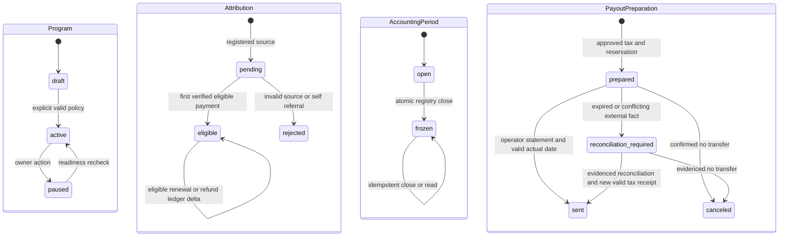

# Pseudocode — N3a, CJM A

Дата: 2026-09-09. Проектный алгоритмический контракт до реализации; источник outcomes — [Specification](Specification.md). Решения календаря, eligibility и налоговой области предложены для XL-checkpoint. [ADR](ADR.md) определяет причины выбора. Этот документ — **единственный владелец логических полей и наборов состояний**; Architecture описывает физическое отображение.

## Data Structures

Общие типы: `UUID`, `Timestamp` (UTC instant), `Date` (ISO local date), `Month` (YYYY-MM), `Money` (signed int64 minor units, арифметика arbitrary-precision с проверкой границ перед хранением), `Currency=RUB`, `Hash=SHA256`, `OpaqueID` (не UUID провайдера), `EvidenceRef` (закрытая ссылка/id + hash, без содержимого документа), `ReasonCode` (версионированный код причины). `?` означает nullable, не неявный default.

Каждая перечисленная ниже persisted entity **содержит `id: UUID`, `created_at: Timestamp`**. Все N3a tenant-owned entities дополнительно содержат `tenant_id: UUID`; для User/Session/ProviderProof это не требуется. Все внешние ID namespace-scoped; FK на tenant/program сверяются совместно. JSON snapshot использует ровно названный тип, не произвольный объект.

| Entity | Логические поля кроме общих |
|---|---|
| User | identity_hash:Hash, password_hash:string, enabled:boolean |
| EnrollmentGrant | program_id:UUID, invited_identity_hash:Hash, role:owner/partner, partner_id:UUID?, token_hash:Hash, expires_at:Timestamp, consumed_at:Timestamp?, issued_by:UUID, authority_evidence:EvidenceRef |
| Session | user_id:UUID, token_hash:Hash, expires_at:Timestamp, revoked_at:Timestamp? |
| Membership | user_id:UUID, program_id:UUID, role:owner/operator/partner, partner_id:UUID?, scopes:set(read,configure,invite,payout,tax), status:active/revoked |
| Program | owner_id:UUID, name:string, public_slug:string, purpose:n1_commissions/platform_leads, status:draft/active/paused, current_policy_id:UUID?, timezone:string, currency:Currency |
| PolicyVersion | program_id:UUID, version:int, terms_hash:Hash, effective_at:Timestamp, rate_bp:int[1..10000]?, attribution_days:30/60/90, conflict_rule:explicit_promo_else_last_valid_cookie, recurring_mode:first_payment_only/every_eligible_payment, commission_months:positiveint?, currency:Currency |
| Partner | program_id:UUID, user_id:UUID, status:invited/active/suspended, accepted_policy_id:UUID?, accepted_at:Timestamp? |
| Invitation | program_id:UUID, partner_id:UUID, token_hash:Hash, expires_at:Timestamp, consumed_at:Timestamp? |
| PartnerAsset | program_id:UUID, partner_id:UUID, kind:link/promo, public_code:string, status:active/revoked, expires_at:Timestamp?, cohort:string |
| Attribution | connection_id:UUID, program_id:UUID, partner_id:UUID?, customer_id:OpaqueID, project_id:OpaqueID, asset_id:UUID?, source:promo/cookie/none, reason:ReasonCode, policy_id:UUID, registered_at:Timestamp, registration_payload_hash:Hash, first_paid_at:Timestamp?, status:pending/eligible/rejected, consent_evidence:EvidenceRef? |
| Connection | program_id:UUID, source:N1, environment:test/live, merchant_id:OpaqueID, verification_contract_ref:EvidenceRef, hmac_key_ids:set(string), status:configured/active/paused, cutover_at:Timestamp?, cutover_manifest:EvidenceRef?, reconcile_cursor:string?, verified_watermark:Timestamp? |
| N1Outbox | N1-owned only: connection_id:UUID, event_id:UUID, event:BusinessEvent/RegistrationEvent, body_hash:Hash, sequence:int64, status:pending/leased/acknowledged, attempts:int, next_attempt_at:Timestamp, lease_until:Timestamp?, acknowledged_at:Timestamp? |
| EventReceipt | connection_id:UUID, event_id:UUID, event_type:payment.succeeded/refund.succeeded, body_hash:Hash, provider_object_id:OpaqueID, result:applied/duplicate_business, applied_at:Timestamp |
| ProviderProof | connection_id:UUID, object_id:OpaqueID, kind:payment/refund, merchant_id:OpaqueID, environment:test/live, status:succeeded, amount:Money, currency:Currency, parent_payment_id:OpaqueID?, occurred_at:Timestamp, fetched_at:Timestamp, response_hash:Hash, verified_by:N1, signature_event_id:UUID, event_time_basis:payment_captured_at/refund_created_at |
| Payment | connection_id:UUID, program_id:UUID, attribution_id:UUID?, provider_payment_id:OpaqueID, customer_id:OpaqueID, checkout_id:OpaqueID, amount:Money, currency:Currency, occurred_at:Timestamp, proof_id:UUID, policy_id:UUID?, commission_amount:Money, refunded_amount:Money, reversed_commission:Money, eligible:boolean, reason:ReasonCode |
| Refund | connection_id:UUID, payment_id:UUID, provider_refund_id:OpaqueID, amount:Money, occurred_at:Timestamp, proof_id:UUID, reversal_amount:Money |
| LedgerEntry | program_id:UUID, partner_id:UUID, payment_id:UUID, refund_id:UUID?, policy_id:UUID, kind:commission/refund_adjustment, delta:Money, currency:Currency, occurred_at:Timestamp, accounted_month:Month, recorded_at:Timestamp, source_receipt_id:UUID |
| AccountingPeriod | program_id:UUID, month:Month, timezone:string, state:open/frozen, due_date:Date, closed_at:Timestamp?, register_id:UUID? |
| Registry | program_id:UUID, period_id:UUID, revision:int, frozen_at:Timestamp, due_date:Date, source_watermark:Timestamp, snapshot_hash:Hash |
| RegistryRow | registry_id:UUID, partner_id:UUID, gross_delta:Money, carry_in:Money, payable_gross:Money, carry_out:Money, initial_tax_snapshot_id:UUID?, exceptions:list(UUID), row_hash:Hash |
| Allocation | row_id:UUID, ledger_entry_id:UUID |
| Carry | program_id:UUID, partner_id:UUID, source_row_id:UUID, amount:Money<=0, consumed_by_row_id:UUID? |
| TaxProfile | partner_id:UUID, payer_id:OpaqueID, person_id:OpaqueID, legal_form:individual/ip/company, npd:boolean, residency:string, base_category:string, contract_ref:EvidenceRef, valid_from:Date, valid_until:Date?, status:review/approved, status_evidence:EvidenceRef, npd_total_declared:Money?, npd_limit_evidence:EvidenceRef?, npd_receipt_evidence:EvidenceRef?, approved_by:UUID?, approved_at:Timestamp? |
| TaxRule | version:string, effective_from:Date, effective_until:Date?, residency:string, base_category:string, brackets:list(upper_minor:Money?,rate_bp:int), base_rule_ref:EvidenceRef, rounding_rule_ref:EvidenceRef, npd_rules_ref:EvidenceRef, approved_by:UUID, approved_at:Timestamp |
| TaxYTD | payer_id:OpaqueID, person_id:OpaqueID, year:int, base_category:string, opening_base:Money?, opening_withheld:Money?, opening_evidence:EvidenceRef?, paid_base:Money, withheld:Money, version:int, active_preparation_id:UUID? |
| TaxSnapshot | row_id:UUID, profile_id:UUID, rule_id:UUID, actual_payment_date:Date, year:int, ytd_version:int?, gross:Money, taxable_base:Money?, calculated_tax:Money?, withheld_tax:Money?, net:Money?, eligibility:review/approved, reason:ReasonCode, accountant_id:UUID?, approval_ref:EvidenceRef? |
| PayoutPreparation | row_id:UUID, request_id:UUID, tax_snapshot_id:UUID, state:prepared/canceled/sent/reconciliation_required, prepared_by:UUID, expires_at:Timestamp, transfer_reference:EvidenceRef? |
| PayoutConfirmation | row_id:UUID, preparation_id:UUID, request_id:UUID, actor_id:UUID, actual_date:Date, gross:Money, withheld:Money, net:Money, transfer_reference:EvidenceRef, statement:operator_reported_sent |
| ReconcileException | connection_id:UUID?, program_id:UUID, event_id:UUID?, object_id:OpaqueID?, body_hash:Hash?, reason:ReasonCode, status:open/resolved, evidence:EvidenceRef?, due_at:Timestamp?, external_transfer:TransferObservation?, resolved_by:UUID?, resolved_at:Timestamp? |
| AuditEvent | actor_id:UUID?, program_id:UUID?, action:string, target_id:UUID?, result:string, reason:ReasonCode?, correlation_id:UUID, sanitized_evidence:EvidenceRef? |
| GrowthEvent | program_id:UUID, partner_id:UUID?, actor_id:UUID?, kind:click/signup/first_value_offer/share_open/share_intent/badge_impression/badge_click, subject_id:OpaqueID, source_ledger_id:UUID?, client_request_id:UUID? |
| Entitlement | program_id:UUID, capability:remove_badge, status:active/revoked, valid_until:Timestamp?, grant_evidence:EvidenceRef |
| RecoveryGate | state:normal/reconciliation_required, backup_watermark:Timestamp?, reconciliation_evidence:EvidenceRef?, approved_by:UUID?, approved_at:Timestamp? |

`BusinessEvent` is an immutable versioned transport value, not another N3a entity: `{schema_version:1,event_id:UUID,event_type:payment.succeeded|refund.succeeded,connection_id:UUID,sequence:int64,customer_id:OpaqueID,project_id:OpaqueID,checkout_id:OpaqueID,attribution_id:UUID?,program_id:UUID,partner_id:UUID?,provider_payment_id:OpaqueID,provider_refund_id:OpaqueID?,amount_minor:Money,currency:RUB,occurred_at:Timestamp,event_time_basis:payment_captured_at|refund_created_at,environment:test|live,subscription_facts:null,verification:ProviderVerification}`. Refund amount is this refund's delta. Payment occurred_at is canonical payment.captured_at; refund occurred_at is canonical refund.created_at (creation time of a refund subsequently verified succeeded, not a fictional success timestamp). The signed event_time_basis names this distinction. Missing/unparseable required timestamp or implausible future value creates a reconciliation exception; delivery/received_at is never substituted. N1 v1 carries `subscription_facts:null`; future nonnull shape requires a new version.

`RegistrationEvent={schema_version:1,event_id:UUID,event_type:customer.registered,connection_id:UUID,sequence:int64,program_id:UUID,customer_id:OpaqueID,project_id:OpaqueID,registered_at:Timestamp,explicit_promo:string?,cookie_asset_id:UUID?,cookie_captured_at:Timestamp?,consent_evidence:EvidenceRef?}`. It has its own attribution endpoint; immutable payload hash and connection/customer/project uniqueness make retries stable. `TransferObservation={row_id:UUID,actual_date:Date,gross:Money,withheld:Money,net:Money,actor_id:UUID,evidence:EvidenceRef}` records an alleged external fact under review; it does not authorize a transfer or mint a valid Confirmation.

`ProviderVerification={object_id:OpaqueID,kind:payment/refund,merchant_id:OpaqueID,environment:test/live,status:succeeded,amount:Money,currency:RUB,parent_payment_id:OpaqueID?,occurred_at:Timestamp,fetched_at:Timestamp,response_hash:Hash,event_time_basis:payment_captured_at/refund_created_at}` is a signed N1 attestation of its canonical API lookup, stored as ProviderProof in N3a. Only N1 holds provider credentials and performs provider GET; N3a verifies connection authenticity and attested facts, then reconciles against the authenticated N1 source. No shared secrets from the YooKassa account are copied to N3a. `ProviderProof` contains sanitized verified facts, not secrets/card data. Policy months null explicitly means lifetime; duration starts first eligible confirmed payment, end is exclusive calendar-month addition in program timezone (end-of-month clamped). For first_payment_only, chronological first verified eligible payment wins; a late earlier payment creates an exception until reconciliation establishes order. Registration-time policy version stays fixed. Cross-tenant person identity is never inferred from email: payer-controlled verified identity authorizes YTD consolidation across its programs only.

## Core Algorithms

### Algorithm: AuthenticateSession
REQUIREMENT: `FR-AUTH-001`
REALISES: SC-US-001-3, SC-US-002-3, SC-US-013-1, SC-US-013-2, SC-US-013-3, SC-US-013-4
INPUT: explicit signup/login/logout, password, invitation/enrollment token.
OUTPUT: authenticated session or safe denial.
STEPS:
1. Bound rate/body/admission first; signup requires unexpired single-use EnrollmentGrant matching identity and role/program. Pilot owner grant comes from integration owner with verified N1-owner authority evidence; an open signup never self-assigns owner/operator. Partner account may exist before acceptance, but active partner membership requires AcceptPartnerAndAssets.
2. Adapt audited N2 scrypt password hashing and N1/N2 hash-only opaque session primitives with provenance/tests; use random salt and versioned audited work factors, generic credential error and dummy verification for missing identity. Run KDF outside transactions, proposed concurrency2 and queue8 per web process; overload429, no connection held while waiting.
3. Signup BEGIN locks grant; recheck expiry/unconsumed and unique identity, create User and allowed Membership, consume grant atomically. Login compares hash outside transaction then rechecks enabled/revoked state before creating session. Generate high-entropy random bearer token, store only hash/expiry; COMMIT. Never log password/token, never trust submitted role or tenant.
4. Return token only via Secure/HttpOnly/SameSite cookie for browser or authorized bearer response for private client; CSRF/Origin guards on state changes. Logout/revocation atomically sets Session.revoked_at; all requests check expiry/revocation and current Membership. IF suspended/revoked THEN deny even when cookie remains. Audit safe outcomes without identity enumeration.
5. RETURN session context; donor code is not copied unreviewed and no admin console or external identity service is introduced.
COMPLEXITY: O(1) indexed records plus bounded password KDF cost.

### Algorithm: AuthorizeAndConfigure
REQUIREMENT: `FR-PROGRAM-001`
REQUIREMENT: `FR-PROGRAM-002`
REALISES: SC-US-001-1, SC-US-001-2, SC-US-001-3
INPUT: session, program ID, explicit policy fields, expected current version.
OUTPUT: active version or denied/validation/conflict.
STEPS:
1. Apply bounded rate limit before body validation; authenticate session and server membership. IF configure scope absent THEN audit denied and RETURN 404 without existence disclosure.
2. Validate % rate, recurring mode/duration, 30/60/90 window, RUB, timezone and terms. IF any omitted THEN RETURN 422 named fields; never insert 20% implicitly.
3. For purpose=platform_leads, explicit lead-only terms may activate enrollment/asset tracking with rate_bp=null and no Connection; they promise no payment. The N1 monetary program still requires all monetary inputs. BEGIN; lock Program; IF expected version differs THEN rollback RETURN 409. Insert immutable PolicyVersion effective now or later; no retroactive date. Monetary activation requires selected current version and configured N1 connection readiness. Select current_policy_id only from versions with effective_at≤now; future version cannot activate early. Registration always resolves max(effective_at≤registered_at), so stale cached pointer cannot override policy. Update status, audit; COMMIT.
4. RETURN version; existing Attribution.policy_id and LedgerEntry are unchanged.
COMPLEXITY: O(1) indexed reads/writes.

### Algorithm: AcceptPartnerAndAssets
REQUIREMENT: `FR-PARTNER-001`
REQUIREMENT: `NFR-SECURITY-001`
REALISES: SC-US-002-1, SC-US-002-2, SC-US-002-3, SC-US-011-3
INPUT: session, invitation token, accepted policy ID; asset/cohort requests.
OUTPUT: own link/promo or safe denial.
STEPS:
1. Authenticate; hash token, verify invitation expiry and intended partner. IF cross-partner/program asset request THEN audit and RETURN 404.
2. BEGIN; lock invitation/partner/program; compare current terms and submitted version. IF stale THEN rollback RETURN 409 current terms; IF already consumed by this partner THEN RETURN existing assets; ELSE reject foreign/revoked token.
3. Save explicit consent actor/time/version, activate partner; create one active link and promo with unique program public_code, collision retry bounded to 3, then explicit failure. Consume invitation atomically; COMMIT.
4. RETURN only own assets/cohort; customer status alone never grants partner membership or codes.
COMPLEXITY: O(1) apart from bounded collision retries.

### Algorithm: CaptureAttribution
REQUIREMENT: `FR-ATTRIBUTION-001`
REQUIREMENT: `FR-ATTRIBUTION-002`
REQUIREMENT: `FR-GROWTH-004`
REALISES: SC-US-003-2, SC-US-003-3, SC-US-011-2
INPUT: N1 registration identity, explicit promo?, valid first-party cookie?, signed connection context.
OUTPUT: stable Attribution or rejected reason, no commission.
STEPS:
1. N3a program link redirects only to allowlisted N1 origin/path with opaque asset; N1 stores first-party signed referral cookie (Secure, HttpOnly, SameSite=Lax), bounded by configured window/consent. Third-party cookie is never required. Record sanitized click once by request ID.
2. On registration N1 persists local referral source/customer/project and registration identity transactionally; registration outbox/signed idempotent attribution request retries after commit. N3a unavailability leaves attribution pending sync, not silently absent; payment waits/reconciles unresolved attribution.
3. Authenticate N1 request, resolve policy effective at registered_at and server-side asset ownership. IF explicit promo supplied THEN validate it; invalid/revoked/expired returns rejected reason with NO cookie fallback. ELSE choose last valid unexpired cookie; ELSE source none. Window applies to click→registration, not independently to every renewal.
4. IF verified customer matches partner/owner self-referral identity THEN reject; ambiguous identity becomes review. Save one Attribution per connection/customer/project and its snapshot, chosen source/reason. Concurrent retry returns same decision; conflicting immutable payload becomes exception.
5. RETURN pending/rejected attribution. Signup/cancel/unverified payment cannot post money. Valid preexisting attribution is not reassigned by later cookies or code revocation.
COMPLEXITY: O(1) indexed lookup.

### Algorithm: N1VerifiedBillingOutbox
REQUIREMENT: `FR-N1-001`
REALISES: SC-US-003-1, SC-US-004-1
INPUT: YooKassa notification or scheduled canonical reconciliation fact.
OUTPUT: durable N1 billing + outbox, then provider HTTP 200; or retryable failure.
STEPS:
1. Bound rate/body/read time; enforce trusted-proxy source CIDR for webhook. Parse minimal object identity; retrieve canonical YooKassa payment/refund outside any DB transaction with scoped merchant credentials and timeout. IF unavailable/mismatch/not terminal succeeded THEN no durable claim; RETURN retryable error or explicit mismatch exception.
2. Resolve local N1 checkout/customer/project; compare canonical ID, merchant, mode, amount/currency and local checkout. Never trust missing account_id metadata or redirect success. Canceled/older nonterminal events cannot reduce paid_until or overwrite completed checkout.
3. BEGIN N1 transaction; lock checkout and local integration authority; validate immutable checkout again. IF business fact already applied THEN RETURN durable existing outcome after COMMIT. ELSE claim business fact, apply local billing (max(now, paid_until)+30 days for new payment), append outbox with sender UUID and monotonic sequence in **same commit**. Refund processing records verified refund/outbox; N3a does not invent N1 tariff-refund policy.
4. Enforce cutover manifest: before boundary legacy debt only; after boundary bypass legacy commission writer. Unknown attribution/migration mapping remains outbox exception, never parallel payable debt. COMMIT; only now dispatch asynchronously and RETURN provider 200.
5. Dispatcher leases bounded batch, signs immutable bytes with fresh delivery timestamp for each retry. Network calls after lease transaction; success ACK saved afterward. Lost ACK replays same event; backoff and reconcile retain undelivered events beyond provider's 24h window. No in-memory-only queue.
COMPLEXITY: O(1) per payment; O(b) dispatch batch b.

### Algorithm: AuthenticateAndVerifyIntake
REQUIREMENT: `NFR-SECURITY-002`
REALISES: SC-US-003-3, SC-US-004-3, SC-US-005-3
INPUT: POST raw bytes, connection URL, signed headers.
OUTPUT: verified BusinessEvent/ProviderProof or deterministic error/exception.
STEPS:
1. Bound admission, raw body ≤64 KiB and read deadline 5 s before DB transaction. Obtain configured key via untrusted bounded key ID; compute HMAC over canonical header prefix+raw bytes, length-check then constant-time compare. IF invalid THEN uniform 401, no claim/body parse.
2. AFTER signature, check signed timestamp ±300 s, active key/connection; IF stale THEN 401. Parse strict v1 JSON; compare URL connection, tenant/program/mode and allowed IDs/types; reject unknown shape with 422.
3. Read receipt by connection/event UUID: IF present and hash equal THEN RETURN original applied/duplicate outcome; ELSE hash mismatch → 409 + exception. This optimization follows auth and validates an already committed receipt only.
4. Check signed verification attestation against event: succeeded, provider ID, configured merchant/mode, amount/RUB, parent refund and N1 checkout/customer identity; validate expected checkout snapshot through bounded authenticated N1 reconciliation when absent locally. Network work stays outside transaction. IF N1 reconciliation unavailable THEN503 and no claim. IF mismatch THEN422 + exception, no financial claim. N3a does not possess YooKassa credentials or invent its webhook HMAC.
5. RETURN verified facts to PostPayment/PostRefund, which revalidate local versions and atomically insert receipt with money. Refund without known parent → 409 dependency_missing + exception, no terminal receipt; recover parent through reconcile and retry.
COMPLEXITY: O(bytes) for HMAC plus O(1) bounded N1 verification lookup when required.

### Algorithm: PostPayment
REQUIREMENT: `FR-COMMISSION-001`
REQUIREMENT: `FR-GROWTH-002`
REALISES: SC-US-003-1, SC-US-004-1, SC-US-004-3, SC-US-011-1
INPUT: verified payment event/proof.
OUTPUT: one positive commission or durable no-commission reason.
STEPS:
1. Reject purpose=platform_leads from monetary intake until an independently specified own billing contract exists. BEGIN; acquire program accounting lock then attribution/payment locks in stable ID order. Check cutover/RecoveryGate, attribution ownership and policy snapshot. Missing attribution synchronization, uncertain first-payment order or unsatisfied reconciliation → rollback retryable exception, not no-referral guess.
2. Atomically insert receipt unique(connection,event_id); on conflict compare hash and return same committed result. Payment unique(connection,provider_payment_id) is separate: different transport ID with same identical business facts adds duplicate_business receipt only; differing facts become exception and rollback.
3. Eligibility: approved partner at registered_at, non-self attribution, payment at/after cutover, after registration, verified positive RUB, policy duration from first eligible occurred_at. first_payment_only rejects later distinct payments; every_eligible_payment allows each during exclusive duration. IF ineligible THEN persist Payment with zero commission and reason plus receipt; COMMIT RETURN reason.
4. commission = roundHalfUp(amount_minor × rate_bp / 10000) using exact nonnegative integer division. Set Payment commission_amount, refunded_amount=0,reversed_commission=0; preserve policy/proof. Choose accounted month using AssignPeriod.
5. Insert single positive LedgerEntry unique(payment_id,kind=commission), even if rounded delta=0 (not positive-value growth); update Attribution first_paid_at only with verified chronological basis. COMMIT receipt/payment/ledger together; RETURN applied.
COMPLEXITY: O(1) indexed operations; duration calendar arithmetic O(1).

### Algorithm: PostRefund
REQUIREMENT: `FR-COMMISSION-002`
REQUIREMENT: `NFR-RELIABILITY-001`
REALISES: SC-US-005-1, SC-US-005-2, SC-US-005-3
INPUT: canonical succeeded refund with known parent payment.
OUTPUT: linked immutable negative delta or duplicate.
STEPS:
1. BEGIN; lock program accounting then parent Payment. IF parent absent/legacy/unknown attribution THEN rollback and exception; do not consume receipt. Verify amount>0, RUB, merchant/mode and immutable parent.
2. Claim receipt unique(connection,event_id) and refund unique(connection,provider_refund_id) atomically. IF existing identical refund THEN record duplicate_business receipt and RETURN unchanged; conflicting identity/amount → rollback exception.
3. cumulative = Payment.refunded_amount + refund.amount. IF cumulative > Payment.amount THEN rollback exception; never silently cap bad provider facts. target = roundHalfUp(Payment.commission_amount × cumulative / Payment.amount); IF cumulative==Payment.amount THEN target=Payment.commission_amount. delta=target−Payment.reversed_commission; assert 0≤delta≤remaining commission.
4. Store Refund including delta; append LedgerEntry(kind=refund_adjustment,delta=−delta,parent payment, original policy) if eligible, including zero correction for audit. AssignPeriod uses refund occurred_at unless parent accounted month is later or its intended period frozen; then next open period and visible late-correction reason. Update parent cumulative counters atomically.
5. Never edit original ledger, RegistryRow or Confirmation; a sent payout yields future adjustment/carry. COMMIT refund/receipt/counters/entry together. RETURN applied. Refund permutations share the same cumulative final reversal; canceled event never undoes succeeded fact.
COMPLEXITY: O(1) per refund under parent lock.

### Algorithm: AssignPeriodAndFreezeRegistry
REQUIREMENT: `FR-PAYOUT-001`
REQUIREMENT: `FR-PAYOUT-002`
REQUIREMENT: `FR-PAYOUT-004`
REQUIREMENT: `NFR-INTEGRITY-001`
REQUIREMENT: `NFR-PERFORMANCE-001`
REALISES: SC-US-006-1, SC-US-006-2, SC-US-005-2
INPUT: verified event instant for posting; or scoped owner close request for preceding month.
OUTPUT: accounted_month or stable frozen Registry + rows.
STEPS:
1. AssignPeriod under program lock converts occurred_at to configured calendar month. IF month open and not before integration start THEN use it even for Sep payment arriving Oct2. ELSE choose earliest open month at/after intended month and current local month; mark late reason. Never include October occurred payment in September. Refund accounted month also cannot precede parent accounted month.
2. Freeze request requires payout scope, RecoveryGate normal and local day≥5 for preceding month; missed prior months closed explicitly in chronological order, due date stays original 5th. Read/reconcile provider/N1 feeds outside transaction; unresolved financial exceptions block freeze and show incomplete preview. Preview creates no allocations/debt.
3. BEGIN; acquire same program lock as every posting; lock period. IF already frozen THEN RETURN existing Registry/hash. Recheck watermark/exception versions after external work; on drift retry reconciliation. Capture all unallocated period LedgerEntries and predecessor negative Carry; no arbitrary hold or minimum threshold.
4. For each partner, gross_delta=sum(entries), carry_in=sum(unconsumed Carry.amount), payable_gross=max(0,gross_delta+carry_in), carry_out=min(0,gross_delta+carry_in). Create immutable row and unique Allocation per entry; consume each carry once. IF carry_out<0 THEN create one new Carry(source_row,amount); ELSE none. A carry is not another ledger refund and its source entries never reallocate.
5. Attach available immutable tax preview snapshot or explicit tax-review exception; unknown tax/net remain null, never 0. Hash ordered rows+allocations+policy/proof/tax refs; save Registry, freeze period and commit atomically. Tax evidence later creates linked versioned payout receipt, never overwrites this frozen snapshot.
6. RETURN stable snapshot; export is read-only and displays snapshot/preparation version, gross and known/null tax/net. Unsent positive rows remain on this registry; don't auto-carry them into another payout. Failure/timeout rolls back all allocations/close; async job reports explicit failure.
COMPLEXITY: O(n log n) deterministic order/hash for n entries, n≤10000 pilot; batch work deadline≤60 s, no network under lock.

### Algorithm: CalculateAndPrepareTax
REQUIREMENT: `FR-TAX-001`
REQUIREMENT: `FR-TAX-002`
REQUIREMENT: `FR-TAX-003`
REQUIREMENT: `FR-TAX-004`
REALISES: SC-US-007-1, SC-US-007-2, SC-US-007-3
INPUT: frozen row, planned actual transfer date, approved profile/rules/base/YTD/evidence, request UUID.
OUTPUT: immutable TaxSnapshot + prepared operation, or review exception.
STEPS:
1. Authenticate payout/tax scope, row ownership and RecoveryGate. IF gross<=0 THEN RETURN no_transfer. Obtain verified payer/person identity, date-valid profile, contract/accountant approval, status and rule. Missing/unknown inputs → review with accrued gross still visible; no sent-ready value.
2. Evaluate legal form, npd and contract eligibility explicitly. IF npd THEN require status evidence, accountant-approved contract eligibility, current declared aggregate income/limit evidence and receipt workflow; if unknown/lost eligibility or declared year income+payment>240000000 kopecks THEN review, no split. Applicable confirmed NPD sets payer withholding=0, not 6%; recipient-tax informational estimate is not withheld tax. Receipt evidence due after payment is tracked as an open document obligation with approved due-date rule, not an impossible prepayment condition; missing already-due receipt or unresolved eligibility blocks the next preparation.
3. IF applicable withholding model THEN BEGIN; lock TaxYTD by payer/person/year/base across all programs plus RegistryRow. Require verified opening_base/opening_withheld (including other payments by this payer) and current paid_base/withheld. IF missing or active preparation exists THEN rollback review/conflict. IF another tax model applies THEN require explicit accountant-approved no-withholding/base rule, never infer from label.
4. Compute taxable increment B via approved base/adjustment/deduction rule, not equal gross by assumption. Y=opening_base+paid_base. T(x)=approved rounding of sum over marginal bracket portions of x×rate; proposed applicable main-scale rates 13/15/18/20/22% with boundaries 2.4/5/20/50 million RUB from2025. due=T(Y+B)−(opening_withheld+withheld); IF due<0 or due>gross or inconsistent evidence THEN review (no silent clamp/refund). Store calculated_tax and planned withheld separately per approved rule.
5. Require accountant evidence for this immutable calculation, date/year, rule, gross/base/withheld/net. Save TaxSnapshot with ytd_version; create unique request PayoutPreparation prepared, reserve active_preparation_id in TaxYTD (for withholding model), commit. Preparation does not count as paid YTD and cannot invoke bank API.
6. RETURN preparation + expires_at (proposed end of local payment date). Cancellation releases reservation only if operator confirms no transfer occurred; timeout is reconciliation_required, never automatic release for an uncertain manual transfer.
COMPLEXITY: O(k) tax brackets, k=5 in proposed main-scale rule; bounded indexed locks.

### Algorithm: ConfirmManualTransfer
REQUIREMENT: `FR-PAYOUT-003`
REALISES: SC-US-006-3, SC-US-007-3
INPUT: authorized operator, preparation ID, request UUID, actual date/amounts and external evidence reference.
OUTPUT: one operator_reported_sent confirmation or reconciliation_required.
STEPS:
1. Authorize server payout scope and RecoveryGate; export route never calls this algorithm. IF unknown scope THEN audit and RETURN 404. Require affirmative statement that operator made the manual transfer; no bank action occurs here.
2. BEGIN; lock payer/person/year TaxYTD then row/preparation in same order as preparation. IF row already confirmed THEN matching request/facts RETURN original confirmation; different amount/date/reference → 409 without another confirmation.
3. Recheck tax profile/rule validity, exact actual year/date versus TaxSnapshot, accountant approval, current YTD version and reservation, net/gross/withheld equality. IF stale/changed/expired THEN persist supplied TransferObservation in a ReconcileException, mark reconciliation_required, audit and RETURN 409; do not automatically release reservation or erase a reported external fact. December preparation cannot approve January transfer. Even an unprepared/mistaken external transfer can be reported by an authorized operator into this exception path; it does not become tax-approved sent until reconciled.
4. Insert unique Confirmation(row_id), unique request key within tenant; update prepared state→sent and TaxYTD paid_base/withheld/version, clear its reservation in same commit. NPD/no-withholding updates verified internal payment records but cannot claim total external NPD income is known.
5. RETURN sent with actor/date/reference and statement label «оператор отметил отправку». External bank acknowledgement/receipt is not inferred; corrections after sent require new linked audit/tax correction and accountant reconciliation, not deletion or repeat transfer.
COMPLEXITY: O(1), one serialized row and tax-year update.

### Algorithm: DashboardAndGrowth
REQUIREMENT: `FR-DASHBOARD-001`
REQUIREMENT: `FR-DASHBOARD-002`
REQUIREMENT: `FR-GROWTH-001`
REQUIREMENT: `NFR-PRIVACY-001`
REALISES: SC-US-004-2, SC-US-008-1, SC-US-008-2, SC-US-008-3, SC-US-009-1, SC-US-009-2, SC-US-009-3
INPUT: session/program/partner view, explicit share actions.
OUTPUT: scoped ledger-derived metrics and optional recommendation draft.
STEPS:
1. Resolve server membership, tenant/program/partner filters before query or cache lookup. IF object outside scope THEN uniform404; no foreign rows in totals/exports. Page by stable cursor≤100; include proof/adjustment/row provenance and visible exceptions, mask sensitive fields.
2. Count accepted clicks and registrations separately; distinct paying customer by verified eligible payments. Show accrued/adjusted/allocated/sent as different projections of the same ledger/receipts. N1 MRR=null with reason unknown because v1 subscription_facts=null; don't derive it from990/paid_until.
3. Find first positive live non-test commission for this participant/program. IF none THEN no first-value offer. ELSE on authorized view atomically record unique first_value_offer(program,actor) linked to original ledger and show recommendation once. Subsequent refunds preserve that historical offer fact; tests/demo/duplicate events cannot trigger another.
4. Proposed staged dogfooding (owner review required; not completed monetary dogfooding) uses a separate purpose=platform_leads program: explicit enrollment/terms, personal link/promo and N3a lead cohorts use the same Partner/Asset/Growth modules. Its leads never mint commissions or reuse N1 billing IDs. Explicit open records share_open; explicit copy/native-share handoff records share_intent with request ID dedupe. Prepare text only, include no private customer/tax data; no server email/Slack/API send. Cancel/close creates no share_intent or delivered-message metric. Dogfooding context clearly names platform recommendation, never substitutes N1 sales as platform billing.
5. RETURN metrics/draft; data source per value is DB or sanitized journal, not an unimplemented external API.
COMPLEXITY: O(p) page rows plus indexed aggregates; preaggregations are rebuildable, never debt authority.

### Algorithm: RenderProgramBadge
REQUIREMENT: `FR-GROWTH-003`
REQUIREMENT: `FR-LOOK-001`
REQUIREMENT: `FR-LOOK-002`
REQUIREMENT: `FR-LOOK-003`
REQUIREMENT: `FR-LOOK-004`
REQUIREMENT: `NFR-ACCESSIBILITY-001`
REALISES: SC-US-010-1, SC-US-010-2, SC-US-010-3
INPUT: public program route, server entitlement, explicit badge interaction.
OUTPUT: CJM A public page with required badge and separate metrics.
STEPS:
1. Read only public active program projection; never expose ledger/profile. Server checks active evidenced remove_badge entitlement and expiry. IF absent/invalid THEN render N3a badge; localStorage/query/CSS claims cannot change server entitlement.
2. IF pricing not configured THEN removal request displays unavailable offer without invented price/checkout. Existing N1 payment cannot mint a platform entitlement. All public-cache keys include entitlement version/state or are invalidated on change.
3. Render A, Rubik/slate/white/blue CTA, responsive hero, separate accrued/payout states, semantic labels/focus. Record badge_impression and badge_click separately with bounded duplicate/bot handling; don't rewrite N1 widget assets.
4. RETURN page. Client can modify its own DOM; security claim is server output and authority, not prevention of local CSS editing.
COMPLEXITY: O(1) public metadata + bounded render.

### Algorithm: ReconcileAndRecover
REQUIREMENT: `NFR-AVAILABILITY-001`
REQUIREMENT: `NFR-OBSERVABILITY-001`
REALISES: SC-US-008-2
INPUT: bounded N1 cursor feed, signed verified facts, N3a receipts, recovery state.
OUTPUT: accounted missing facts, visible unresolved exceptions, verified watermark.
STEPS:
1. Fetch N1 immutable outbox feed and N1 canonical-provider reconciliation attestations outside transactions, limit≤100, stable increasing cursor; compare checkout/payment/refund identities and receipts, not mere counts. Cursor advances only after each result durably recorded or explicit unresolved exception; incomplete ranges don't advance verified_watermark.
2. Reprocess missing events through same HMAC/version/N1-attestation/posting invariants (replay timestamps fresh). IF feed unavailable/gap/amount mismatch THEN preserve cursor/exception and RETURN incomplete; no zero estimate or successful freeze.
3. After restore set RecoveryGate reconciliation_required before admitting financial writes. Reconcile restored receipts/allocations/confirmations with N1 and independently retained immutable registry/export/transfer evidence, especially external transfers after backup. Unknown transfer blocks affected preparation/confirmation and freeze.
4. Only authorized reconciliation approval with evidence returns gate to normal; never replay a bank transfer or auto-enable N1 legacy writer. Outbox replay after restore uses original event IDs and same business uniqueness.
5. RETURN observed lag, accepted/duplicate/rejected/reconciliation-needed counts and watermark; RPO/RTO remain not established until measured restore drill.
COMPLEXITY: O(b) per bounded page; O(n) reconciliation backlog.

## API Contracts

Private app API: `Authorization: Bearer <opaque short-lived session token>` for authenticated nonbrowser callers; browser uses equivalent Secure/HttpOnly/SameSite session cookie and CSRF token + allowed Origin on mutations. Bearer tokens are not stored in localStorage. Public invitation token is hashed server-side. No public developer API is promised.

| Method/path (proposed) | Authorization; body | Response 200 data/meta; 4xx/5xx error |
|---|---|---|
| POST /api/auth/signup; POST /api/auth/login; POST /api/auth/logout | signup enrollment grant/password; login identity/password; logout session+CSRF | data:{session/user}, meta; 401/409/422/429/503; Secure cookie, no password echo |
| POST /api/programs/{id}/policy | configure; explicit PolicyVersion inputs, expected version | data:{policy_id,status}, meta:{request_id}; 404/409/422/503 |
| POST /api/partners/accept | session+invite token+policy_id | data:{partner_id,assets}, meta; 404/409/422/429 |
| POST /internal/v1/n1/{connection}/attributions | scoped HMAC; registration/asset facts | data:{attribution_id,status,reason}, meta; 401/409/422/503 |
| POST /internal/v1/n1/{connection}/events | scoped HMAC; raw BusinessEvent | data:{event_id,result:applied/duplicate_business}, meta; 401/409/413/422/429/503 |
| GET N1 /internal/v1/n3a/{connection}/events?cursor&limit | scoped connection Bearer; limit≤100 | data:{events}, meta:{next_cursor,watermark}; 401/409/429/503; adapter not built |
| GET /api/programs/{id}/dashboard | read scoped owner/operator/partner | data:{metrics,ledger,exceptions,mrr:null}, meta:{next_cursor}; 404/503 |
| POST /api/programs/{id}/registries | payout; month, request_id | data:{registry_id,hash,rows}, meta; 404/409/422/503; asynchronous acceptance may return202 job ID |
| GET /api/registries/{id}/export | payout; no mutation | CSV with immutable version/hash; 404/409/503, formula-escaped text, no secrets/full bank details |
| POST /api/registry-rows/{id}/prepare | payout+tax authority; request_id,date,evidence | data:{preparation_id,tax_snapshot}, meta; 404/409/422/503 |
| POST /api/registry-rows/{id}/confirm | payout; request_id,preparation,date,amounts,reference | data:{confirmation_id,state:sent,statement}, meta; 404/409/422/503 |
| POST /api/growth/share | scoped session; kind=open/intent,request_id | data:{draft,recorded}, meta; 404/422/429; no external send |
| GET /programs/{public_slug} | public safe projection | HTML A+server badge; 404/429 |

JSON errors: `{error:{code,message},meta:{request_id}}`; no stack/secret/object-existence leak. Deadlock/serialization retry≤3 with bounded jitter; exhausted returns503 and transaction rolled back. Frozen snapshot reads never imply bank action. HMAC byte contract and planned replay tests are in [webhook-contract](webhook-contract.md).

## State Transitions

`sent` is a projection of immutable Confirmation, not a bank status. Resolving reconciliation into sent must run ConfirmManualTransfer against an approved replacement preparation; no unguarded direct state write. EventReceipt exists only for committed terminal processing; rejected/waiting events live in ReconcileException and remain retryable. Payment terminal succeeded facts are immutable; no cancel transition reverses billing/commission, only verified refund delta.

## Error Handling Strategy

| Category | Response and handling |
|---|---|
| Authentication/authorization | uniform401/404, safe audit; no financial receipt |
| Invalid version/money/identity | 422 or409, visible exception; no monetary effect |
| Retryable provider/DB/parent dependency | 503 or409 dependency_missing, durable sender retry, no consumed financial claim |
| Duplicate | 200 original outcome, business/transport identity distinguished |
| Tax/uncertain manual transfer | review/reconciliation_required, keep obligation visible; no invented net or automatic reschedule |
| Resource pressure | 429/503 Retry-After, bounded queue/pools; no external calls under DB lock |

Each FR/NFR has one owning REQUIREMENT declaration; helper algorithms implement shared checks through the numbered steps and may legitimately share REALISES scenario claims.

## Scenario Coverage

Scenarios in Specification.md: 40 · claimed by an algorithm: 37.

Not claimed by any algorithm:

| Scenario | Reason |
|---|---|
| SC-US-012-1 | ui-only |
| SC-US-012-2 | ui-only |
| SC-US-012-3 | ui-only |

Claimed by an algorithm but absent from Specification.md:

none

Coverage is a mutual naming claim, not proof of working code. UI-only scenarios require browser/security verification in Refinement; algorithm steps and schema require independent Phase2 review before implementation.
