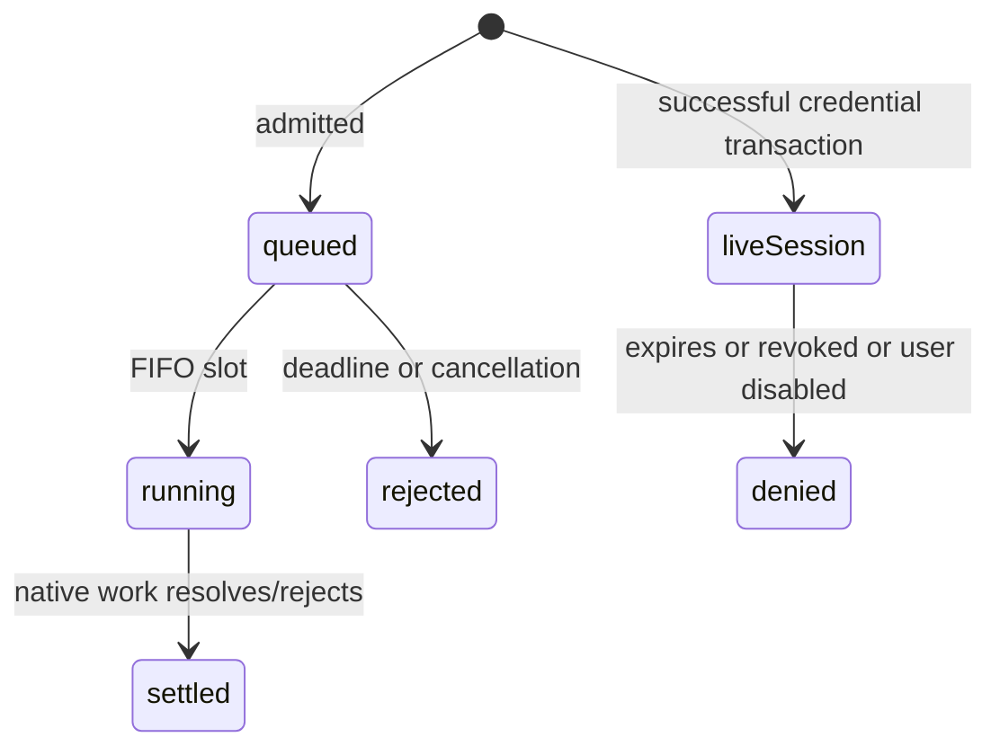

# Foundation — pseudocode

Logical subset of project `docs/Pseudocode.md`; chosen Argon2id adaptation supersedes its stale donor-scrypt wording **for this slice only**. No enrollment or Membership behavior is implemented here.

## Data Structures

Persistent domain entities preserve project fields:
- User: id UUID, created_at Timestamp, identity_hash Hash32, password_hash string, enabled boolean.
- Session: id UUID, created_at Timestamp, user_id UUID, token_hash Hash32, expires_at Timestamp, revoked_at Timestamp|null.
- MigrationJournal (infrastructure record, not domain entity): filename string primary key, checksum SHA256 hex, applied_at Timestamp. It deliberately has no synthetic domain UUID.
Transient values: CredentialInput(identity_hash Hash32, password string); IdentityContext(user_id,session_id,expires_at); KdfQueue(active integer, FIFO waiters each with deadline and settlement state). Timestamps are UTC; expiry comparison is strict `expires_at > now`.

## Core Algorithms

### Algorithm: BuildAndRunWorkspace
REQUIREMENT: `FR-foundation-1`
REQUIREMENT: `AC-foundation-1`
REALISES: SC-US-001-1
INPUT: source tree, exact lockfile, selected isolated configuration.
OUTPUT: built web process or nonzero failure.
STEPS:
1. Install exactly from N3a lock; typecheck; execute full foundation suite; build web. IF any check fails THEN stop.
2. Validate compose isolation and required selected runtime values before start. Runtime configuration contains no donor filesystem reference. Start only in checked namespace after repository port-conflict check.
3. GET health returns liveness constant; it does not query or characterize DB. IF invalid runtime config prevents start THEN no healthy running process is reported. RETURN liveness only.
COMPLEXITY: build depends on source size; health O(1).

### Algorithm: ApplyMigrations
REQUIREMENT: `FR-foundation-2`
REQUIREMENT: `AC-foundation-2`
REALISES: SC-US-001-2
INPUT: dedicated migration credential, ordered regular SQL files.
OUTPUT: applied/skipped filenames or explicit failure.
STEPS:
1. Read regular SQL files and compute byte SHA-256; reject duplicate names/empty inventory. Connect using migration role, acquire fixed N3a DB-local session advisory lock with finite 5-second acquisition budget; on timeout fail and close client.
2. Create or validate journal shape under lock. Read all records; IF an applied filename is absent locally or checksum mismatches THEN fail before new SQL. Reject unsupported legacy journal (no baseline path).
3. For each unrecorded file in lexical order: BEGIN; execute SQL; insert filename/checksum/applied_at; COMMIT. IF SQL/journal insert fails THEN ROLLBACK and throw. SQL files must be transaction-compatible; CREATE INDEX CONCURRENTLY is outside this runner's supported format.
4. In finally unlock and close client, including errors. Process crash releases connection lock. RETURN applied/skipped; no automatic retries of failed SQL.
COMPLEXITY: O(total file bytes + migration work).

### Algorithm: PasswordAndCredentialVerification
REQUIREMENT: `FR-foundation-3`
REQUIREMENT: `AC-foundation-3`
REQUIREMENT: `AC-foundation-5`
REALISES: SC-US-001-3, SC-US-001-5
INPUT: validated identity_hash, untrusted password, initialized KDF adapter and repository.
OUTPUT: generic invalid_credentials, admission failure, or new IdentityContext plus token.
STEPS:
1. Reject nonstring/password outside 8–200 code points or 800 UTF-8 bytes before native work; do not normalize password. Hash creation uses fresh salt and explicit Argon2id settings from architecture. Hash creation and verification both enter the same admission queue.
2. Acquire admission; only when scheduled read user snapshot by identity_hash and immediately release DB client. Select stored supported hash for enabled user, otherwise startup dummy hash. Unsupported/corrupt stored format also selects dummy and remembers deny. Perform exactly one verification; adapter errors yield safe credential denial and a sanitized diagnostic.
3. Unknown/disabled/corrupt/wrong result returns identical invalid_credentials. This is generic output/dummy work, not an assertion of exact equal wall-clock timing.
4. After success, call the narrowly granted database issue_session_if_current function in a short transaction; its fixed-search-path SECURITY DEFINER body locks User by ID and rechecks enabled and byte-identical password_hash against snapshot. IF changed THEN rollback and deny. Otherwise invoke session creation in this transaction; commit before returning token. No account, grant, role or Membership is created.
5. Finally release admission. A future password mutation must take this same User lock. Session resolution always rechecks current enabled state.
COMPLEXITY: O(1) indexed reads plus bounded Argon2 work.

### Algorithm: AdmitKdf
REQUIREMENT: `NFR-foundation-1`
REQUIREMENT: `AC-foundation-4`
REALISES: SC-US-001-4
INPUT: bounded task closure, monotonic clock, optional abort signal.
OUTPUT: task result or typed overloaded/queue_timeout/canceled failure.
STEPS:
1. Atomically in the JS event loop: IF active<2 and FIFO empty THEN increment active and schedule; ELSE IF queued<8 THEN append with deadline now+5s; ELSE reject overloaded before task invocation.
2. Expiry/abort removes an unscheduled waiter exactly once and settles it. Waiting holds no DB resource. On slot release drain earliest live waiter, rejecting expired ones without executing them.
3. Await each started closure. In finally decrement active exactly once and drain FIFO. A running native KDF cannot be canceled by pretending its slot is free; keep it active until underlying Promise settles. Late client cancellation drops output, not accounting.
4. RETURN result/error; no automatic retry, unbounded queue or extra per-request limiter instance. Native adapter has fixed reviewed work factors; initialize one queue per web process.
COMPLEXITY: O(8) bounded queue maintenance, O(1) active state.

### Algorithm: OpaqueSessionLifecycle
REQUIREMENT: `FR-foundation-4`
REQUIREMENT: `AC-foundation-6`
REALISES: SC-US-001-6
INPUT: verified locked user (issue), raw token (resolve/revoke), required secret and clock.
OUTPUT: raw token once plus identity context, denied, or revocation success.
STEPS:
1. Issue only through the successful credential transaction and narrow issue_session_if_current function: token=randomBytes(32).base64url; hash=HMAC-SHA256(secret,"n3a:session:v1:"+token); insert Session with 24-hour absolute expiry and null revoked_at. DB unique constraint covers token_hash; collision fails transaction safely, never overwrites. Commit precedes return.
2. Resolve rejects malformed token before DB; hash token and select session joined to enabled User where hash matches, revoked_at IS NULL and expires_at>database now. Return only IdentityContext; absence is generic denial. DB unavailable throws unavailable, never guest-authorized context.
3. Revoke hashes valid token and sets revoked_at only if null. Unknown/revoked returns same success. Clear cookie with identical scope, Max-Age=0. Each future resolve queries current state; no positive session cache.
4. RETURN identity only. No membership or program access can be derived from these values.
COMPLEXITY: O(1) indexed queries.

### Algorithm: ValidateRuntimeAndSerializeCookie
REQUIREMENT: `NFR-foundation-2`
REQUIREMENT: `AC-foundation-7`
REALISES: SC-US-001-7
INPUT: phase, environment, opaque token; application DB connection.
OUTPUT: validated runtime configuration/cookie or refusal.
STEPS:
1. Only explicit offline-build phase may omit runtime secrets; it never connects/authenticates/issues cookies. At serve/auth startup parse nonempty PostgreSQL URL and require a canonical encoded secret with at least 32 decoded random bytes; absent/empty/malformed is error. Require distinct migration/application credentials in infra configuration; never echo either.
2. Bootstrap isolated database roles through separate admin setup; runtime receives only application credentials. Actual app role is NOSUPERUSER/NOCREATEDB/NOCREATEROLE/NOBYPASSRLS, nonowner; grant SELECT users, SELECT sessions, UPDATE(revoked_at) sessions, EXECUTE on the narrow session-issuance function and schema USAGE only. Revoke function EXECUTE from PUBLIC; no direct app session INSERT. The function alone performs User locking/session insert under its schema-owner authority. Migration role owns schema. App cannot write users or migration journal.
3. Serialize `__Host-n3a_session` with Secure, HttpOnly, SameSite=Lax, Path=/, Max-Age=86400; no Domain. Never remove Secure for HTTP development. No cookie endpoint is mounted in foundation.
4. Sanitize errors to stable codes and safe correlation identifiers before logging; omit raw credentials, token, identity_hash and SQL parameters. RETURN validated value; no fallback credentials.
COMPLEXITY: O(1) configuration/cookie work; role setup finite DDL.

## API Contracts

Only GET `/api/health`: unauthenticated, no body, 200 `{"status":"alive"}`, Cache-Control:no-store. No Bearer API or cookie-auth mutation endpoints are added. Internal auth outcomes: invalid_credentials, invalid_input, overloaded, queue_timeout, unavailable; HTTP mapping is explicitly deferred with route admission/CSRF/enrollment.

## State Transitions

## Error Handling Strategy

Validation rejects before native work. Queue exhaustion is retryable only by caller policy. DB failure throws unavailable; transaction failure rolls back. Missing configuration prevents runtime auth initialization. Corrupt hash produces safe denial. Native work is never replaced with plaintext/hash fallback.

## Scenario Coverage

Scenarios in `01_specification.md`: 7 · claimed by an algorithm: 7.

Not claimed by any algorithm:
none

Claimed by an algorithm but absent from Specification.md:
none

This is document linkage only; runtime evidence remains pending.
