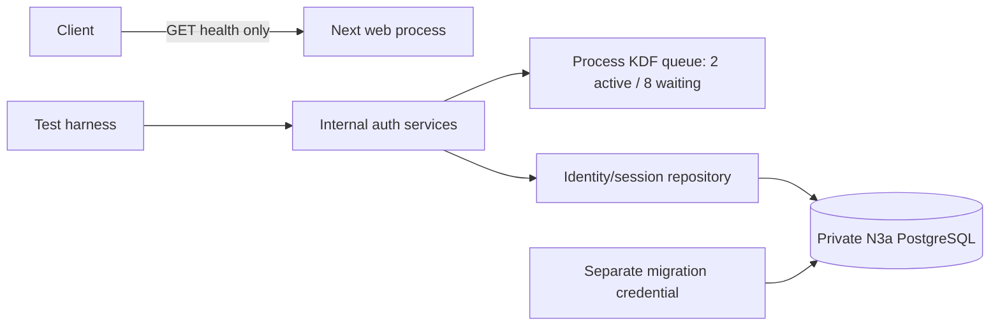

# Foundation — architecture

## Architecture Overview

A minimal runnable subset of the approved distributed monolith: one Next.js web process plus private PostgreSQL. There is no worker or financial receiver in this slice.

## Component Breakdown and file ownership

All paths below are relative to PROJECT_ROOT. These are the **planned implementation ownership lists**, not files created by PLAN. One coordinator owns all manifests/lockfile and integrations. If separated, each writing owner gets an isolated worktree; no two writers share a tree. Auth depends on repository interfaces agreed before dispatch.

| Owner | Files |
|---|---|
| Integration/workspace | `package.json`, `package-lock.json`, `tsconfig.json`, `vitest.config.ts`, `.gitignore`, `.dockerignore`, `.env.example`, `compose.yaml`, `Dockerfile`, `apps/web/package.json`, `apps/web/tsconfig.json`, `apps/web/next-env.d.ts`, `apps/web/next.config.ts`, `apps/web/src/app/layout.tsx`, `apps/web/src/app/page.tsx`, `apps/web/src/app/api/health/route.ts`, `scripts/check-foundation-infra.mjs`, `scripts/run-foundation-integration.mjs`, `tests/workspace.test.ts`, `tests/infra.test.ts`, `docs/discovery/foundation-reuse-provenance.md` |
| Database implementation | `packages/db/package.json`, `packages/db/tsconfig.json`, `packages/db/src/index.ts`, `packages/db/src/pool.ts`, `packages/db/src/migrate.ts`, `packages/db/src/auth-repository.ts`, `packages/db/migrations/001_identity_sessions.sql`, `packages/db/migrations/002_runtime_grants.sql`, `scripts/init-foundation-db.sh`, `packages/db/tests/migrate.integration.test.ts`, `packages/db/tests/auth-repository.integration.test.ts`, `packages/db/tests/roles.integration.test.ts`, `packages/db/tests/helpers.ts` |
| Authentication implementation | `apps/web/src/lib/auth/config.ts`, `apps/web/src/lib/auth/password.ts`, `apps/web/src/lib/auth/kdf-admission.ts`, `apps/web/src/lib/auth/session.ts`, `apps/web/src/lib/auth/credentials.ts`, `apps/web/src/lib/auth/cookie.ts`, `apps/web/tests/password.test.ts`, `apps/web/tests/kdf-admission.test.ts`, `apps/web/tests/session.test.ts`, `apps/web/tests/credentials.integration.test.ts`, `apps/web/tests/auth-config.test.ts` |
| Coordinator lifecycle records | `docs/features/foundation/validation-report.md`, `docs/features/foundation/05_completion.md`, `docs/features/foundation/review-report.md`, this run's project-local telemetry |

No top-level toolkit or donor modification is needed. The homepage is a minimal CJM-A brand shell without operational jargon or invented financial data; no live dashboard is implied. No auth routes or bootstrap user CLI may be added through these ownership lists. Integration tests create fixture users directly through migration/test credentials in the disposable database. A real user bootstrap is part of the subsequent trusted enrollment slice.

## Technology Stack

Exact package versions read from N1 `package-lock.json`, SHA-256 `8838d575ae915eaa37fc8b9eebe07e01d10272e6ede0f556f0eb54a364c5e461`, audit baseline `6a5920dea8f5fcc256257bf50d520b1f0a7af72b`. These are donor compatibility pins, not a claim that a current vulnerability scan passed. Implementation must create N3a's own lock and run dependency checks.

| Layer | Technology | Rationale |
|---|---|---|
| Frontend / backend | `next` 15.5.24; `react`, `react-dom` 19.2.8; Node 22 | Approved architecture; minimal liveness route and shell |
| Database client | `pg` 8.23.0; `@types/pg` 8.23.1 | Donor runner/repository compatibility |
| KDF | `@node-rs/argon2` 2.1.0 | Current N1 password donor |
| Type/test tools | `typescript` 5.9.3; `tsx` 4.23.12; `vitest` 2.1.9; `@types/node` 22.20.1 | Exact donor lock versions |
| Database / infrastructure | PostgreSQL 16, Docker Compose | Private isolated database; exact image digest recorded after implementation image validation |
| Cache / queue | No cache service; bounded process-local KDF FIFO | Single web process; no Redis or worker dependency |

Pin `@types/react` 19.2.18 and `@types/react-dom` 19.2.5 from the same donor lock; record optional native target packages in N3a provenance. Do not copy the donor lock wholesale or introduce `latest`. Container digest resolution is an implementation action, not an invented PLAN value.

## Chosen adaptation decisions and smallest donor closure

Use corrected `docs/discovery/foundation-donor-audit.md` (correction timestamp 2026-09-09T19:40:13Z). Re-read/hash selected sources before copy if their revision changes.

| Donor file relative to donor | Reuse | Required adaptation |
|---|---|---|
| N1 `apps/web/src/lib/password.ts` | Native Argon2id hash/verify wrappers; bounded inputs | Explicit work factors, salt/encoded-format guards, shared admission for hashing and verification |
| N1 `apps/web/src/lib/login.ts` | Dummy hash warm-up and generic denial pattern only | N3a identity repository, no donor account/session creation or route limiter |
| N1 `apps/web/src/lib/session.ts` | 32-byte token and HMAC primitives | Domain-separated hash, required fresh secret, identity-only context, 24h expiry, revocation |
| N1 `apps/web/src/lib/current-session.ts` | Lookup pattern only | N3a user/session join; enabled/expiry/revocation checks |
| N2 `packages/db/src/migrate.ts` | Ordered per-file transactions, checksum comparison/journal | Full 64-hex SHA-256 instead of truncated16; advisory serialization; preflight missing/changed history; reject baseline mode in fresh N3a |
| N1 `apps/web/tests/auth-primitives.test.ts` | Relevant primitive assertions | N3a module paths/config; add missing resource/lifecycle assertions |

This closure requires only native crypto, filesystem/path, pg and Argon2 dependencies, plus the declared test/build stack. No donor schemas, account/partner-auth model, rate-limit table, payment bridge or messenger grants are copied. New N3a code is justified by absent admission queue, user/session schema/repository and isolation harness.

**KDF decision:** choose Argon2id, not the project pseudocode's stale “audited donor scrypt.” Set reviewed initial options to algorithm=Argon2id (donor uses numeric 2), version=19, memoryCost=65536 KiB, timeCost=3, parallelism=1, outputLen=32; fresh salt at least16 bytes. Confirm package option names/types locally during implementation. Stored hashes must match the supported version and work-factor bounds before native verification so a malformed/extreme encoded hash cannot request unbounded resources. A single startup dummy hash is initialized through the same bounded primitive. Two active hashes budget about128 MiB of algorithm memory plus native/runtime overhead; measure on target container and preserve the invariant if tuning is required. No scrypt fallback or per-request dummy generation.

**Session decision:** reduce donor30-day absolute lifetime to24h and always use Secure cookie serialization. This selects the project's unspecified short-expiry setting; there is no sliding extension. This is an internal primitive plan, not permission to expose cookie endpoints without CSRF/Origin protections.

**Migration correction:** N1's runner has only filename/applied_at tracking, no checksum or `--baseline`. N2 contains those controls. Reuse N2; removing its baseline option is deliberate because this fresh database has no manually applied legacy schema to adopt.

## External Dependencies

No external dependencies — this product calls no third-party service.

This sentence is scoped to the foundation runtime. Dependency installation and local database infrastructure are not business service integrations. The full N3a product still depends on future N1 integration.

## Data Architecture

Map exactly the User/Session fields in `02_pseudocode.md`: UUID→uuid, Timestamp→timestamptz, Hash32→bytea with octet_length=32, password_hash→text, enabled→boolean. Unique users(identity_hash), unique sessions(token_hash); session.user_id references users.id with restrictive deletion. Index sessions(user_id); CHECK expires_at>created_at and nullable revoked_at>=created_at. Identity_hash arrives as an internal verified identifier; canonical email/proof generation is deferred to enrollment, never inferred here.

MigrationJournal maps directly to schema_migrations with full64-hex checksum CHECK. Application role is nonowner and has only schema usage, users SELECT, sessions SELECT/UPDATE(revoked_at) and EXECUTE on issue_session_if_current. PostgreSQL row locking requires privileges beyond SELECT, so a narrow SECURITY DEFINER function in migration001 performs the User lock, enabled/password-snapshot recheck and session insert. Its search_path is fixed, table references schema-qualified, PUBLIC EXECUTE revoked and execute granted only to the app role. No direct app session INSERT is granted. Migration role owns schema; bootstrap admin creates credentials from explicit secret inputs without placing values in SQL committed to git. Do not grant web broad table UPDATE, user creation or role administration. No RLS tenant claim is made because no tenant data exists yet.

## Security Architecture

Credential KDF runs after snapshot lookup releases client and before a short issuance transaction. Recheck enabled/password snapshot under User row lock. Live session lookup rechecks enabled on every call. Runtime pool max10, acquire timeout1s, lock timeout1s, statement timeout5s; migration connection is separate and bounded. No transaction across native KDF, input streaming or remote calls. Service functions accept identities, never roles/scopes.

Runtime URL and HMAC secret have no defaults; build-only bypass cannot issue auth results. Cookie uses `__Host-` rules. Logging records operation/error/correlation only. No seed users, test credentials or dotenv files committed. Compose uses unique names, private network/volume, DB `expose` only; any optional local web port is explicit loopback and environment-bound. Run repository port-conflict check before starting containers. No donor resources are mounted or inherited.

## Scalability Considerations

Foundation supports one web process. Queue bounds are per process, not a cluster-wide anti-abuse limiter. Scaling or exposing authentication requires the complete request rate/admission design and summed pool/KDF budgets in a later slice. Unit barriers measure resource accounting deterministically; real native KDF smoke establishes supported encodings and records timing/RSS without presenting a throughput SLO.

## Reconciliation with Pseudocode

Расхождений с `02_pseudocode.md` не найдено. Сверены сущности: User, Session, MigrationJournal; transient CredentialInput, IdentityContext, KdfQueue. Сверены алгоритмы: BuildAndRunWorkspace, ApplyMigrations, PasswordAndCredentialVerification, AdmitKdf, OpaqueSessionLifecycle, ValidateRuntimeAndSerializeCookie. Physical schema introduces no extra role, grant or domain state. The only planned project-contract adaptations are explicit Argon2id selection and24h session expiry; this does not claim implementation verification.
