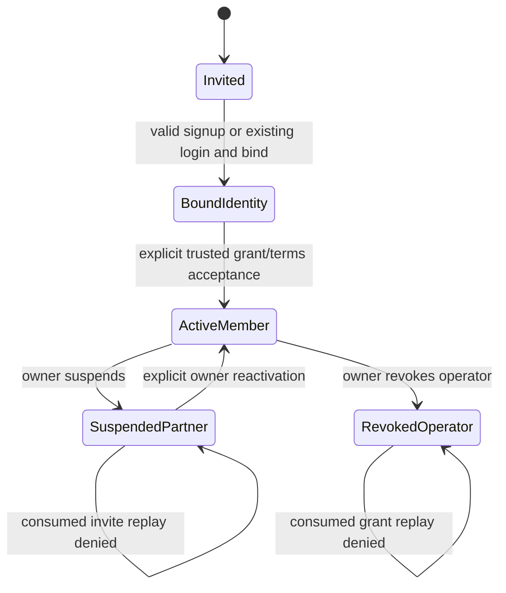

# Identity, program and partner — pseudocode

PLAN algorithm contract; outcomes in [01_specification.md](01_specification.md). Logical refinements below specialize project Pseudocode for this slice, not financial/D7 scope.

## Data Structures

Persisted entities have `id: UUID`, `created_at: Timestamp`; tenant objects also have `tenant_id: UUID`. Timestamps are server UTC. Hash32 is 32 bytes. EvidenceRef is `{reference:string[1..256],sha256:64hex}` with no document content. Raw identity/grant/session values are transient boundary inputs only.

| Entity | Fields and constraints beyond common fields |
|---|---|
| User, Session | Existing foundation schema unchanged; User.identity_hash is the domain-separated normalized identity hash defined below |
| Program | owner_id:UUID?, name:1..120 chars, public_slug:lowercase ASCII 3..64, purpose:n1_commissions only, status:draft/active/paused, current_policy_id:UUID?, timezone:IANA-name?, calendar_locked_at:Timestamp?, currency:RUB; nullable owner/timezone only for incomplete draft |
| BootstrapReceipt | request_id:UUID unique, program_id, input_hash, owner_grant_id, external_actor_ref, identity_evidence, authority_evidence; same request returns IDs only, never raw token |
| EnrollmentGrant | program_id, invited_identity_hash:Hash32, role:owner/operator/partner, scopes:set(read,configure,invite,payout,tax,reconcile), partner_id:UUID?, token_hash:Hash32 unique, expires_at, revoked_at?, consumed_at?, enrolled_user_id?, issuer_kind:bootstrap/owner, issued_by:UUID?, external_actor_ref?, identity_evidence:EvidenceRef, authority_evidence:EvidenceRef; owner requires bootstrap receipt, others require owner issuer |
| Membership | program_id,user_id,role,partner_id?,scopes,status:active/revoked,source_grant_id; unique(program,user,role); partner read only; owner tuple must match Program.owner_id |
| PolicyVersion | program_id,version:positive int,terms_text:plain UTF-8 1..16384 bytes,terms_hash:Hash32,effective_at,rate_bp:1..10000,attribution_days:30/60/90,conflict_rule:explicit_promo_else_last_valid_cookie,recurring_mode:every_eligible_payment,commission_duration:lifetime,currency:RUB,timezone:IANA-name; immutable; unique(program,version) and (program,effective_at) |
| Partner | program_id,user_id?,status:invited/active/suspended,accepted_policy_id?,accepted_at?; unique(program,user) where user present |
| Invitation | program_id,partner_id,enrollment_grant_id unique,token_hash:Hash32,expires_at,consumed_at?; same raw partner token identifies grant/invitation; no second independent secret |
| PartnerAsset | program_id,partner_id,kind:link/promo,public_code:opaque URL-safe string,status:active/revoked,expires_at?,cohort:opaque ID; unique(program,partner,kind), globally unique public_code |
| EligibilityFact | program_id,subject_kind:partner/asset,subject_id,version,valid_from,status:invited/active/suspended/revoked,expires_at?,consent_policy_id?,actor_id?,evidence:EvidenceRef; append-only unique(subject_kind,subject_id,version) |
| AuditEvent | actor_id?,program_id?,action,target_id?,result,reason?,correlation_id; fixed codes only, no raw inputs |
| AdmissionBucket | kind:global/source/identity,slot:int,window_start:Timestamp,count:int; fixed rows initialized by migration, not arbitrary user-key INSERT; unique(kind,slot) |

Normalization v1: accept a string ≤254 ASCII bytes after trimming only ASCII space/tab/CR/LF at its ends; require one `@`, nonempty local/domain, local ≤64 chars from ASCII letters/digits and the ASCII dot/atext punctuation set (including backtick; without spaces), no leading/trailing/consecutive dot, domain labels of letters/digits/hyphen with no edge hyphen, at least two labels, each ≤63. Lowercase ASCII local and domain deliberately as the pilot account-identifier rule. Reject Unicode/quoted local/domain literals; do not apply provider-specific dot/plus rewriting. `identity_hash=HMAC-SHA256(IDENTITY_SECRET, UTF8("n3a:identity:email:v1:" + normalized))`. This is stable account matching, not evidence of mailbox ownership or cross-system legal identity. Offline issuer review plus controlled token handoff establish enrollment trust. IDENTITY_SECRET is a separate stable ≥32-byte key; session-secret rotation leaves identity matching unchanged. Key rotation and normalization changes require an explicit versioned identity migration, never silent replacement. Random high-entropy enrollment tokens use their separate SHA256 domain below, so session rotation does not invalidate unconsumed grants.

Grant token: 32 random bytes canonical unpadded base64url, hash SHA256(`n3a:enrollment:v1:` + token). No password/KDF inside SQL. Public asset code: 16 random bytes base64url; stored public, never authentication authority. Terms hash uses exact submitted UTF-8 bytes after rejecting NUL/control characters except LF/tab; do not silently normalize content.

## Core Algorithms

### Algorithm: BootstrapPilotOwner
REQUIREMENT: `FR-identity-program-partner-1`
REQUIREMENT: `AC-identity-program-partner-1`
REALISES: SC-US-001-1
INPUT: offline provisioning connection, request UUID, name/slug/RUB, normalized identity, reviewed identity/authority references, external actor, explicit expiry ≤72h, private output file.
OUTPUT: draft/grant IDs and one initial private token handoff, no user.
STEPS:
1. Validate explicit evidence and bounded inputs; require provisioning authority and refuse app role. BEGIN; serialize bootstrap by a fixed pilot advisory key. Check request/input receipt first: equal→COMMIT RETURN IDs only, without opening or replacing any handoff file; unequal→ROLLBACK conflict. Input hash excludes generated token/output destination.
2. For a genuinely new request, refuse a second pilot bootstrap program; generate token in process and open a new mode0600 handoff file with exclusive creation/no-follow. Existing/symlink destination fails before any insert. The short offline transaction may include this local exclusive file open, never external calls or human input; token remains absent from stdout/logs.
3. Allocate tenant/program IDs, insert draft owner_id/timezone/current_policy_id null; insert owner grant with fixed full owner scopes, bootstrap receipt and safe audit. No User or Session insertion.
4. COMMIT; write token to the preopened restricted handoff file. If delivery/write fails after commit, record safe failure and require explicit offline revoke/reissue; never regenerate under retry or report rollback. A crash can lose the token but cannot create a second owner/program.
5. Explicit offline reissue uses mode=reissue, a new request ID, previous unused owner grant ID, the same program and fresh reviewed evidence. After same-request receipt replay handling, acquire pilot advisory→same program→predecessor grant locks (compatible with HTTP acceptance). Recheck that predecessor is nonrevoked, unconsumed and the current receipt-chain tip, and program has no owner; then revoke old grant and create replacement grant/linked BootstrapReceipt atomically; never create a second program or transfer ownership. Same reissue request returns IDs only. Missing linkage/conflicting evidence/consumed predecessor deny. Private output protocol is identical.
6. RETURN IDs. Implementation only exercises this in disposable tests; real evidence/actor/token handoff is an operational prerequisite.
COMPLEXITY: O(1), no remote calls.

### Algorithm: AdmitAndProtectRequest
REQUIREMENT: `NFR-identity-program-partner-1`
REQUIREMENT: `AC-identity-program-partner-9`
REALISES: SC-US-001-9
INPUT: route class, trusted deployment source identity, headers/stream, optional cookie/session.
OUTPUT: bounded parsed request or safe rejection.
STEPS:
1. Acquire a process-wide HTTP slot before runtime initialization, any DB acquisition or body read: at most16 handlers in flight, no waiting queue. Overflow returns503 immediately; release only when handler work settles (never release early while detached native/SQL work runs). This bounds pool waiters/body readers as well as KDF callers. Then, before consuming/parsing a body, atomically charge persistent global and source fixed buckets. Source is transport peer from an explicitly trusted adapter; unavailable peer uses one conservative unknown bucket. Never trust arbitrary X-Forwarded-For. DB failure→503; exhausted window→429 Retry-After.
2. Read ≤32KiB total within5s; overflow→413, timeout→408. Validate exact Origin and bounded CSRF envelope on every mutation before domain work; preauth login/signup bind to anonymous nonce cookie, authenticated mutations bind to current session hash. Token signature/context/expiry must all match.
3. Parse strict JSON object/allowlisted fields; reject unknown role/scope/readiness fields and malformed values. Login/signup then charge one fixed identity bucket using normalized identity hash, or the invalid-input slot if normalization failed; invalid identity is never sent to KDF/SQL as a raw key.
4. Acquire shared process KDF admission only for valid credential work. KDF process singleton remains2 active/8 queued/5s; queue cancellation cannot release a native task before it finishes. Admission transactions end before body/KDF; DB budgets remain foundation limits.
5. RETURN validated input; reject audit is sanitized/bounded. Admission counters are intentionally committed even for later validation/CSRF failures; they are not enrollment/business writes.
COMPLEXITY: O(body bytes), constant bounded DB rows and queues.

### Algorithm: RegisterOrBindIdentity
REQUIREMENT: `FR-identity-program-partner-2`
REQUIREMENT: `AC-identity-program-partner-2`
REALISES: SC-US-001-2
INPUT: admitted signup identity/password/grant or current session plus grant for bind.
OUTPUT: identity-only session/bound grant or generic enrollment denial.
STEPS:
1. Normalize/hash identity consistently; snapshot grant and issuer authority without holding a connection. Invalid/expired/revoked/foreign grant→404 enrollment_unavailable. Existing User never enters password replacement: return generic instruction to log in; logged-in matching identity uses bind operation.
2. New signup computes supported Argon2id hash outside any transaction/DB lease through existing PasswordService; generate new opaque session token/hash. No role field is accepted from caller.
3. Invoke narrow register function: BEGIN atomic statement; lock program→grant, then existing/new user. Recheck token/identity/expiry/revocation/unconsumed state, owner issuer's current authority (or bootstrap receipt), allowed scope ceiling and user enabled. Existing user conflict→no update/session; caller must log in. Concurrent identity unique conflict becomes safe existing-account outcome.
4. Insert one User, bind enrolled_user_id, insert identity-only Session with24h expiry and safe audit in the same commit. No Membership/Partner consent/grant consumption. Aborted/error request cannot return a session cookie before commit.
5. Bind-existing function rechecks current session/user plus grant under the same locks and assigns enrolled_user_id only to the matching user; never changes credentials/memberships. RETURN safe grant preview reference.
COMPLEXITY: O(1) plus bounded KDF.

### Algorithm: AuthenticateAndEndSession
REQUIREMENT: `FR-identity-program-partner-3`
REQUIREMENT: `AC-identity-program-partner-3`
REALISES: SC-US-001-3
INPUT: admitted login/logout/me request.
OUTPUT: identity context or safe error.
STEPS:
1. Login normalizes identity then invokes foundation CredentialService: admitted absent/disabled/wrong identities use one real-or-dummy verification, KDF outside DB. Current user/password snapshot is checked under lock before Session issuance.
2. Successful signup/login rotates browser session and CSRF binding; revoke previously presented valid session before reporting replacement success. Set foundation Secure/HttpOnly/SameSite=Lax __Host cookie; never return raw session in JSON.
3. Session-only GET me returns own identity ID and current accessible membership summaries; no email/hash. Unauthenticated→401. Enrollment preview/accept requires this valid identity, not a preexisting program role.
4. Logout validates CSRF/Origin, revokes token hash idempotently, clears cookie only after successful persistence. DB failure→503 without success claim; already invalid session can clear its cookie with valid anonymous-context logout proof and no program effect.
COMPLEXITY: O(1) plus bounded KDF for login only.

### Algorithm: AuthorizeIssueAcceptAndRevokeGrants
REQUIREMENT: `FR-identity-program-partner-4`
REQUIREMENT: `AC-identity-program-partner-4`
REALISES: SC-US-001-4
INPUT: current session, target program, issue/revoke/accept operation, explicit limited scope/evidence inputs.
OUTPUT: owned membership/grant metadata, initial token only, or uniform denial.
STEPS:
1. Resolve session and active membership for every read; constrain tenant/program/partner before query. Mutation functions recheck session/user/membership under lock, not just an HTTP precheck. Deny foreign/not-permitted object with404.
2. Issue requires role=owner and invite scope for its program. Partner scope fixed read; operator scopes must be explicit nonempty subset of read/payout/tax/reconcile and issuer scope. HTTP owner grant is forbidden. Create identity-bound grant with≤72h expiry, evidence and issuer; partner issue also creates invited Partner, Invitation and initial invited eligibility fact atomically. Return token once; no mail send.
3. Owner/operator acceptance requires current session bound to that grant. Lock program→grant, then session→users→memberships as specified below; recheck current issuer authority, expiry/revocation/identity. Bootstrap owner is valid only while program owner is null or same established owner. Set owner_id and insert fixed owner membership together; operator inserts limited membership. Consume grant/audit together.
4. Consumed replay first verifies same enrolled user, nonrevoked grant and still-active matching membership, including owner correspondence and issuer authority. Return same minimal IDs; do not reinsert or expand scopes. Revoked membership/grant→404 even on replay. Expiry blocks unconsumed acceptance; consumed replay is permitted past expiry only after all current checks.
5. Owner can revoke an unused grant or operator membership atomically with audit. Owner membership/ownership transfer is not an HTTP action in this slice. Revoked issuer invalidates unconsumed downstream grants; already accepted memberships keep their own current status until explicitly revoked.
COMPLEXITY: O(1) indexed operations, bounded scope set.

### Algorithm: SavePolicyAndRefuseUnreadyActivation
REQUIREMENT: `FR-identity-program-partner-5`
REQUIREMENT: `AC-identity-program-partner-5`
REALISES: SC-US-001-5
INPUT: owner session/program, complete policy, expected latest version, explicit timezone; activation operation.
OUTPUT: immutable policy or validation/conflict/not-ready.
STEPS:
1. Validate all explicit fields, exact text hash, timezone validity and supported purpose; no coercion/default terms/rate. BEGIN; lock program, verify current configure-owner authority.
2. If calendar_locked_at nonnull, reject different timezone, including paused program. Expected latest version must equal persisted max (0 when absent). Explicit future effective_at must be strictly greater than server now and all existing effective_at; effective_mode=now uses post-lock decision_at and must follow latest version time. This prevents retroactive insertion and ambiguous ordering; cancel/edit of scheduled versions is out of scope.
3. Insert next immutable policy including its explicit timezone snapshot. Future versions never alter the currently effective calendar: derive current terms and timezone from the same effective PolicyVersion. Update draft timezone and pointer from max(effective_at≤server now), if any, only as caches; read/consent always derives current effective version by time. Earlier policy bytes unchanged. Audit/COMMIT.
4. Activation always authorizes then returns409 integration_not_ready without changing status/calendar or creating Connection. No environment/client override. Future integration work must add the real server readiness check and atomic calendar lock; locked fixtures verify the guard now.
COMPLEXITY: O(log versions) indexed selection.

### Algorithm: PreviewAndAcceptPartner
REQUIREMENT: `FR-identity-program-partner-6`
REQUIREMENT: `AC-identity-program-partner-6`
REQUIREMENT: `AC-identity-program-partner-7`
REALISES: SC-US-001-6, SC-US-001-7
INPUT: current identity session, bound invitation token, accepted policy ID/hash and accepted=true.
OUTPUT: owned terms preview or one partner membership/assets result.
STEPS:
1. Preview verifies own grant binding/current issuer/revocation/expiry and returns exact effective plain terms/id/hash plus explicit draft/not-ready state. No policy yet→409 policy_unavailable; no foreign program lookup result leaks. Before binding, use authenticated bind with token; a token alone cannot read private terms.
2. Acceptance BEGIN locks program→grant→invitation→partner, then session→users→memberships; rechecks current session/issuer/identity and token chain/composite ownership. For consumed invitation return existing result only if grant nonrevoked, Partner active and matching Membership active with read scope; do not change records. Suspension/revocation denies replay; expiry applies to unconsumed grants.
3. Require exact current effective policy ID and hash and explicit acceptance; future/stale version→409 terms_changed and no writes. Draft allowed, integration remains not_ready.
4. Set partner user/accepted policy/time and active state; append consent via immutable accepted fields plus audit, create fixed read Membership, one link and promo and corresponding active facts. Generate public codes with at most3 collision retries inside a savepoint; failure rolls back entire acceptance. No replace-on-conflict asset/membership update.
5. Consume grant and invitation in same commit. Unique(program,user) partner, Membership(program,user,role), assets(program,partner,kind) and locked token prevent concurrent duplicates. Any injected error rolls all coupled effects back. RETURN own IDs/assets and status after commit.
COMPLEXITY: O(1), bounded3 code retries.

### Algorithm: TransitionPartnerAndResolveHistory
REQUIREMENT: `FR-identity-program-partner-7`
REQUIREMENT: `AC-identity-program-partner-8`
REALISES: SC-US-001-8
INPUT: owner session/program, partner suspension/reactivation or asset revoke; historical instant for internal read.
OUTPUT: current authorized projection and append-only temporal facts.
STEPS:
1. Mutation locks program→partner→session→users→memberships (asset afterward), rechecks owner authority and expected current status. Same-state repeat returns existing result without new fact; conflicting transition returns409. Only accepted partners can suspend/reactivate; invited partner is managed by grant revocation instead.
2. At post-lock decision_at append next subject/version fact and change projection atomically. Suspension sets Membership.status=revoked; reactivation is allowed only when prior Partner.status=suspended and restores exact partner read scope (not operator/owner scopes). Individual asset revoke appends revoked fact and never has a reactivation operation.
3. Partner status determines access; effective asset eligibility is conjunction of historical partner eligibility and historical asset fact/expiry. Reactivating partner does not reactivate a revoked/expired asset. Do not rewrite accepted_policy_id/time, earlier fact times or asset IDs.
4. Historical lookup selects greatest(valid_from,version)≤instant; before invited/asset creation is ineligible. Return fact IDs, status and consent policy to future attribution code. Missing expected history is unknown/review, never inferred from current projection. No N1 attribution endpoint is added.
5. COMMIT safe audit and projection/facts together; program lock serializes acceptance, suspension and policy changes. Replay acceptance cannot reverse transition.
COMPLEXITY: O(log facts) historical lookup, O(1) writes.

### Algorithm: EnforceDatabaseBoundaryAndRenderOnboarding
REQUIREMENT: `FR-identity-program-partner-8`
REQUIREMENT: `NFR-identity-program-partner-2`
REQUIREMENT: `NFR-identity-program-partner-3`
REQUIREMENT: `AC-identity-program-partner-10`
REQUIREMENT: `AC-identity-program-partner-11`
REALISES: SC-US-001-10, SC-US-001-11
INPUT: migration/function definitions, typed safe DTOs and explicit browser form actions.
OUTPUT: constrained persisted operations and functional escaped private UI.
STEPS:
1. Publish each function plus ACL revocation/grant in one migration transaction, fixed search_path pg_catalog,pg_temp and all n3a objects qualified. App cannot mutate protected tables directly or execute offline bootstrap. Functions take session token hash, resolve User/Session themselves and validate ownership inside the transaction; actor ID from HTTP is never sufficient.
2. Retain foundation login issuer/repository interfaces. For new operations expose narrow read/functions; SQL parameters bound, dynamic SQL prohibited, arbitrary tenant session settings not treated as authority. Composite FK/check constraints bind policy/grant/invitation/member/asset to one program/tenant. Immutable policy/eligibility/audit tables reject UPDATE/DELETE through app paths.
3. Render only safe server DTO fields, terms/name as escaped text, no dangerous HTML. Private routes no-store and no-referrer; paste enrollment secret into POST body, never generate secret URL. All mutation UI uses same CSRF/API boundary, displays returned status/errors and reloads durable state.
4. Owner sees program/policy/invite/member controls only with server authority; partner sees own assets only. Link display says issued, tracking unavailable until activation; no financial metrics. Keyboard/labels/focus/responsive behavior use real browser checks.
5. Capture only fixed audit/error codes/correlation IDs and source-bound tests; do not claim fixture evidence as live identity verification, N1 readiness or payout.
COMPLEXITY: O(rendered bounded text + page rows), membership list≤100 with stable cursor.

## API Contracts

Cookie-only private browser API for this slice. No public Bearer developer API. Every mutation requires exact configured `APP_ORIGIN`, `X-CSRF-Token`, `Content-Type: application/json`; no CORS credentials for foreign origins. All responses use `{data,meta:{request_id}}` or `{error:{code,message},meta:{request_id}}`; no raw session/identity hash.

| Method/path | Input and authority | Success |
|---|---|---|
| GET /api/auth/csrf | bounded admission; current session or create anonymous Secure/HttpOnly nonce cookie |200 csrf token and expiry, no-store |
| POST /api/auth/signup | anonymous CSRF; identity,password,grant_token |201 user_id plus session cookie; identity-only |
| POST /api/auth/login | anonymous CSRF; identity,password |200 user_id plus session cookie |
| POST /api/auth/logout | current/anonymous CSRF as appropriate |200 logged_out after durable revoke |
| GET /api/auth/me | current session |200 own identity/current membership summaries |
| POST /api/enrollments/bind | session; grant_token |200 owned enrollment preview metadata |
| POST /api/enrollments/preview | session; grant_token |200 role/program/exact current terms if partner |
| POST /api/enrollments/accept | session; grant_token (owner/operator only) |200 own membership_id/program_id |
| POST /api/partners/accept | session; grant_token,policy_id,terms_hash,accepted:true |200 own partner/membership/assets and program status |
| GET /api/programs/{id} | current scoped read; partner projection constrained |200 safe program + current policy + own role |
| POST /api/programs/{id}/policy | owner configure; full policy,timezone,expected_version,effective_mode/effective_at |201 version/policy_id/status |
| POST /api/programs/{id}/activate | owner configure; empty body |409 integration_not_ready always in this feature |
| POST /api/programs/{id}/enrollments | owner invite; identity,role:partner/operator,explicit scopes if operator,evidence,expires_at |201 grant_id plus one-time grant_token, partner_id if partner |
| POST /api/programs/{id}/enrollments/{grant}/revoke | owner invite; empty body |200 revoked |
| GET /api/programs/{id}/members | owner read, limit≤100/cursor |200 scoped members/invites safe status; no tokens/identity hashes |
| POST /api/programs/{id}/members/{membership}/revoke | owner invite; operator target only |200 revoked |
| POST /api/programs/{id}/partners/{partner}/status | owner invite; status:suspended/active,expected_status |200 current status |
| POST /api/programs/{id}/assets/{asset}/revoke | owner invite; empty body |200 revoked |
| GET /api/programs/{id}/partner-assets | active partner own binding or owner-scoped explicit partner filter |200 own/scoped issued assets; no tracking claim |

Errors:401 missing/invalid session or generic credentials;403 Origin/CSRF;404 enrollment/object not available;409 terms/version/state/existing identity/integration conflict;413 body limit;408 read timeout;422 shape/fields;429 admission;503 DB/KDF unavailable. Login valid-shape absent/disabled/wrong identity always401 same code/message. Signup409 may explain “use login”; only a valid own grant reaches that branch. Protected domain denial precedes object-detail validation where an ID could disclose existence.

## State Transitions

Program stays draft in this implementation; active/paused are future persisted states used only by guard tests. Policy/consent/facts never mutate retroactively. Revoking an unused grant does not create/delete a user. No owner-transfer or password-recovery product flow is added.

## Error Handling Strategy

All business mutations are single local transactions; no network/body/KDF while locked. Lock order for mutations: program→grant→invitation→partner as applicable→authorization session FOR SHARE→all involved users sorted UUID FOR SHARE/UPDATE→actor/issuer/target memberships sorted UUID→assets. Preflight IDs never authorize. Re-read the locked session/user and evaluate revoked/enabled/expiry with fresh clock_timestamp at the authorization point after lock acquisition; FOR KEY SHARE is insufficient because it does not conflict with revoked_at updates. Program lock serializes same-program grant/membership changes. Foundation login locks only user then inserts a new session; logout locks only an existing session. Session replacement must finish credential issuance transaction before separately revoking an existing session; never acquire existing session after user in one transaction. Grant-bound new signup has no existing authorization session and uses program/grant→user before inserting a new session. Admission commits independently first. Do not introduce reversed nested locks. After acquiring ALL prerequisite locks, capture one decision_at=clock_timestamp() and recheck session/user and grant expiry/authority, current effective policy, expected state/version against this same instant. Consent timestamps, new now-policy effective_at, audit time and fact valid_from use decision_at; explicit future time must exceed it. A lock wait crossing a scheduled-policy boundary must reject previously displayed stale terms. For any new fact, if decision_at is earlier than the latest stored valid_from, fail unavailable without writes (clock rollback is not permission to backdate); equal instants use version order.

Retry only PostgreSQL serialization/deadlock errors at most3 total attempts with finite jitter; stable tokens/request identities/generated input survive retries. Unknown commit outcome requires read/replay of stable business key, never unbounded retry or fresh credentials.

## Scenario Coverage

Scenarios in 01_specification.md: 11 · claimed by an algorithm: 11.

Not claimed by any algorithm:

none

Claimed by an algorithm but absent from 01_specification.md:

none

Claims prove naming only; independent validation must check transaction/authority semantics and executable acceptance evidence.
