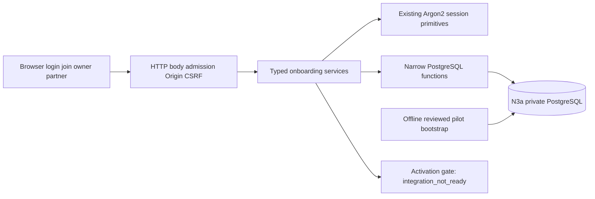

# Identity, program and partner — architecture

PLAN physical/ownership contract. Logical fields/states belong to [02_pseudocode.md](02_pseudocode.md); outcomes belong to [01_specification.md](01_specification.md). Existing foundation at `6d643a1fe2854a3664f8ce1877039ddcac8f803b` is an implemented dependency, not permission to relax its grants.

## Architecture Overview

Style: **Monolith**, existing Next web application with its own PostgreSQL. New onboarding services use foundation auth primitives; provisioning is a separate offline command with credentials unavailable to the web process.

No N1 network request, bank/provider client, email sender, Redis, dashboard or separate worker is introduced. Database namespaces/roles/networks remain the foundation ones. Current historical no-auth-route assertion is superseded for the explicitly listed new paths, not by modifying the accepted foundation specification.

## Component Breakdown

| Component | Responsibility |
|---|---|
| Identity normalization | One server-only deterministic email normalization/hash for every producer/consumer; strict bounded pilot address subset |
| Auth primitives | Reuse foundation PasswordService/CredentialService/SessionService/cookie; retain post-KDF current-user check |
| Enrollment service | Grant-bound registration/bind, trusted owner/operator acceptance, partner consent, safe DTOs |
| Program service | Current authorization, immutable complete policy, current effective terms, closed activation |
| Partner service | Atomic consent/assets, suspension/reactivation, irrevocable individual asset revoke and temporal fact query |
| Admission service | Durable fixed buckets; independent completed transactions before body/KDF; bounded storage |
| HTTP adapter | Body/deadline, exact Origin, signed context-bound CSRF, strict input parsing, safe status mapping/cookies |
| UI | Real forms over named API, escaped readable terms, current access and draft status, issued assets only |
| Offline bootstrap | Evidence-required program/owner grant producer; no real user creation and no web credential inheritance |

## Technology Stack

| Layer | Technology | Rationale |
|---|---|---|
| Frontend | Existing Next15.5.24/React19.2.8/TypeScript; existing Rubik assets | Continue accepted foundation and CJM A tokens |
| Backend | Existing Node22.22/TypeScript; Argon2 native2.1.0; pg8.23.0 | No replacement auth stack or donor runtime imports |
| Database | Foundation PostgreSQL16 image/immutable SQL runner | Atomic grants, FK, unique constraints and row locks |
| Cache | None | Current membership/terms always resolved on server; private no-store |
| Queue | Existing process KDF FIFO only | CPU admission, never durable identity or enrollment authority |
| Infrastructure | Existing isolated compose; secure browser origin for tests | DB remains expose-only; no production ingress claim |

Pins are existing lockfile observations; coordinator owns all dependency changes. Next15 route handlers resolve asynchronous `context.params` before using IDs. New code should not trigger runtime secret parsing during offline build.

## External Dependencies

No external dependencies — this product calls no third-party service.

This sentence applies to this feature contour. Real N1 readiness is an explicitly unimplemented subsequent internal integration dependency, not a confirmed external capability; activation fails closed. Manual reviewed identity/authority evidence and controlled grant delivery are operator inputs, not an email-verification API. There is no D7 dependency for this work.

## Data Architecture

Use `n3a` schema, UUID/timestamptz/bytea/text/check types as foundation; each logical row in pseudocode maps to the same snake_case name. `programs.owner_id` nullable only while draft closes the bootstrap chicken-and-egg without a placeholder user. Owner grant issuer uses external_actor_ref/BootstrapReceipt until an actual user accepts; ordinary grants require issued_by current owner. `timezone` may be null only in incomplete draft. There is no tenant table requirement: tenant_id is a stable opaque bootstrap allocation bound through programs/composite keys.

New forward migrations start after immutable `001_identity_sessions.sql`/`002_runtime_grants.sql`. Suggested split `003_program_enrollment_schema.sql`, `004_enrollment_functions.sql`, `005_program_partner_functions.sql`, `006_admission.sql`; each file <500 lines, subdivide further if needed. Never edit applied foundation bytes. App has no new direct INSERT/UPDATE/DELETE on protected entities. New table reads also use scoped narrow functions; preserve foundation existing users/session read behavior without describing it as tenant isolation.

Function security: `SECURITY DEFINER SET search_path = pg_catalog, pg_temp`, fully qualified n3a relations/functions, no dynamic SQL, owner=migrator; REVOKE PUBLIC execute and grant exact app execute in the same migration transaction. Bootstrap functions remain inaccessible to app/PUBLIC. Grant IDs, user IDs or tenant settings alone never authorize a mutation; functions resolve and recheck supplied current session token hash. Mutations lock the authorization session FOR SHARE before involved users/memberships (full order in pseudocode); re-read revoked/enabled and expiry with fresh database time after acquiring locks, so foundation session revocation and feature mutation have a valid serial outcome. Coupled insert functions implement all validation/unique claims under locks, not service-side check then unrestricted INSERT. SQL checks enforce scope enums/role combinations, tenant/program composite FK and token lengths.

`PolicyVersion` stores its immutable timezone snapshot alongside all terms; reads select the effective version and its timezone together, so a scheduled future timezone does not change current terms. Program.timezone/current_policy_id are caches, not consent/calendar authority. Once calendar_locked_at is nonnull, new policies must use the locked program timezone.

`PolicyVersion`, `EligibilityFact`, `BootstrapReceipt` and `AuditEvent` are append-only for runtime. Consent is immutable partner accepted policy/time; reactivation never rewrites it. Membership status and grant consumption/revocation are mutable projections updated only by the owning functions. Duplicate memberships/assets cannot be overwritten via upsert. Read history uses `(tenant_id,program_id,subject_kind,subject_id,valid_from DESC,version DESC)`; same timestamp transitions use version tie-break. Future registration must read facts, not current status.

A process singleton HTTP admission guard permits at most **16 in-flight handlers and zero queued handlers** across all new API routes, including CSRF GET. Acquire it before lazy runtime initialization, DB acquisition or body read; overflow returns503 without touching DB/body. Hold until all handler work settles; cancellation must not release capacity while underlying work continues. Pool acquisition/statement deadlines and the existing KDF admission remain separate bounds.

Admission is explicitly bounded to **8193 rows**: global slot0, source slots0..4095 and identity slots0..4095, precreated by migration. Slot=`first unsigned32bits(HMAC-SHA256(ADMISSION_SECRET,domain || canonical_key)) mod4096`; unknown transport source and invalid identity each use a stable reserved/key-derived slot. Hash collisions conservatively share limits, never grant extra budget. Rows reset in place at window boundary based on DB time; no arbitrary INSERT per attacker key and no cleanup/TTL job dependency. Parameters fixed in server/SQL, not supplied by request:

| Bucket | Window/limit | Route use |
|---|---|---|
| Global |60s/300 requests |all new auth/enrollment/program API requests, including CSRF GET |
| Source |60s/60 requests |same routes, before body parsing |
| Identity |900s/10 attempts |login/signup after bounded shape/normalization, before KDF |

Global→source bucket lock ordering is fixed in one short transaction; identity charge is separate after parsing. Window boundary allows the usual adjacent-window burst; KDF FIFO remains the final CPU bound. Global/source admission applies to malformed CSRF requests too. ADMISSION_SECRET is separate persistent ≥32 random bytes and not rotated per restart; explicit rotation changes bucket attribution and requires an operational note. Secure source adapter trusts transport metadata only. If Next ingress lacks an authenticated peer handoff, all requests use conservative `unknown`; do not parse attacker-controlled forwarding headers. Trusted test injection is constructor-only, never an HTTP test header. Broad source limits are a pilot availability tradeoff; blocked responses expose Retry-After, not identity existence.

## Frozen service and HTTP boundary

All suggested paths below are relative to PROJECT_ROOT. Before parallel code, coordinator and core owner agree the exact exported contract in `packages/db/src/onboarding-contract.ts`; revisions require redispatch, not guessing. Types use opaque string UUIDs/ISO timestamps, explicit discriminated unions and safe DTOs; no pg Pool or HTTP Request leaks into domain values.

Core-owned factory: `createOnboardingService({repository,passwords,sessionSecret,identitySecret,clock?})`; clock injection only for tests, production DB time owns transitions. Runtime service composes foundation auth/KDF and repository. It may live in `apps/web/src/lib/onboarding/service.ts` while DTOs/repository stay in db package. HTTP passes `sessionTokenHash: Buffer` computed by existing SessionService/hash helper after cookie parsing; SQL resolves it again. The runtime app factory is coordinator-owned.

| Service method (Promise result) | Input/result commitment |
|---|---|
| register | identity,password,grantToken,AbortSignal? → `{userId,token,expiresAt}` on new identity only; token stays server/Set-Cookie |
| bindEnrollment / previewEnrollment | sessionTokenHash,grantToken → `{grantId,role,programId,programName,programStatus,policy?:{id,version,termsText,termsHash,effectiveAt}}` |
| acceptEnrollment | sessionTokenHash,grantToken → `{membershipId,programId,role}` for owner/operator |
| acceptPartner | sessionTokenHash,grantToken,policyId,termsHash,accepted:true → `{membershipId,partnerId,programId,programStatus,assets}` |
| getMe / getProgram / listMembers | sessionTokenHash plus target/cursor → only current scoped safe DTO; `getMe` userId and memberships |
| savePolicy | sessionTokenHash,programId,complete validated policy/timezone/expectedVersion → `{policyId,version,programStatus}` |
| activateProgram | sessionTokenHash,programId → authorized `integration_not_ready` error only |
| issueEnrollment | sessionTokenHash,programId,identity,role,scopes?,expiry,evidence → `{grantId,grantToken,partnerId?}` one-time token |
| revokeEnrollment / revokeOperator / setPartnerStatus / revokeAsset | sessionTokenHash,programId,target,explicit transition → current safe status |
| getPartnerAssets | sessionTokenHash,programId,partnerId? → current authorized asset projection, draft label |
| chargeAdmission | bucket kind/key metadata owned by HTTP adapter → allowed/retryAfter; fixed bounds inside repository |

Errors closed union: `invalid_input,invalid_credentials,enrollment_unavailable,unauthorized,forbidden,conflict,terms_changed,policy_unavailable,integration_not_ready,overloaded,queue_timeout,canceled,unavailable`; HTTP maps them using pseudocode. Include safe field names only for422. Foundation login/logout remain delegated to existing services, not reimplemented by core.

Coordinator must wire CSRF independently from domain authority. `GET /api/auth/csrf` returns a random nonce + issued/expiry + HMAC token valid30min, signed under domain-separated SESSION_SECRET and bound either to the current session hash or random32-byte anonymous __Host cookie. Cookie is Secure/HttpOnly/SameSite=Lax/Path=/; token body is returned for `X-CSRF-Token`, stored only in component memory. Exact token equality/signature/binding/expiry and exact APP_ORIGIN must pass. Successful authentication replaces anonymous context; never reuse a preauth CSRF token for an authenticated mutation. No GET performs enrollment/business mutations.

New runtime variables: `IDENTITY_SECRET` (canonical base64url ≥32 random bytes, stable account HMAC key independent from SESSION_SECRET/ADMISSION_SECRET), `APP_ORIGIN` (one exact HTTPS origin, or explicitly named local trustworthy browser test origin whose Secure-cookie behavior is demonstrated) and `ADMISSION_SECRET` (canonical base64url ≥32 random bytes). Offline bootstrap uses `DATABASE_URL_MIGRATE` only in its isolated command, never app env. Do not invent an HTTP downgrade or disable Secure to make tests pass.

## Exact ownership and execution split

| Writer | Owned paths | Verification |
|---|---|---|
| Core/database implementer | `packages/db/migrations/003_*.sql` onward; `packages/db/src/onboarding-contract.ts`, `onboarding-repository.ts`, split SQL repositories if needed, `admission-repository.ts`; `apps/web/src/lib/onboarding/{identity,service,policy,partner}.ts`; `scripts/bootstrap-pilot-owner.ts`; feature tests in `packages/db/tests/onboarding-*.integration.test.ts`, `apps/web/tests/onboarding-*.test.ts` |atomicity/roles/history/admission/KDF races; separate feature fixture cleanup |
| Coordinator HTTP/UI | `apps/web/src/lib/http/{body,csrf,admission,errors}.ts`, `apps/web/src/lib/onboarding/runtime.ts`; all new route handlers/pages below; `apps/web/src/app/{page,globals.css}`; `apps/web/tests/onboarding-http*.test.ts`; `tests/onboarding-browser.py` |HTTP contract/security and actual browser journey |
| Coordinator shared integration | package manifests/lockfiles/exports/index/tsconfig/vitest configuration; `scripts/start-web.ts`; runtime config extension; startup/config tests; `tests/workspace.test.ts`; isolated harness/compose; canonical lifecycle manifests/reports/provenance/telemetry |full verify/integration/browser/mutation, exact final snapshot |

Each writer gets a separate worktree and owned files/terminal receipt. Core must request root integration for `packages/db/src/index.ts` exports rather than edit it concurrently. Root adapts workspace smoke to expect new `/api/auth/login` and `/api/auth/logout` behavior while legacy `/api/auth/register` and `/api/auth/enrollment` remain404. Do not edit old foundation specs to erase historical scope. New feature fixtures own their FK cleanup; foundation `removeUsers` tests remain independently valid.

Public page inventory: `/login` (login form), `/join` (paste token, signup or login, bind/preview/explicit accept), `/` (existing honest project introduction with navigation). Protected pages: `/onboarding` (own membership list/identity-only next step), `/programs/[id]/setup` (owner config/invites/member actions), `/programs/[id]/partner` (own consented assets). These are onboarding pages, not public program marketing or financial dashboards. All new API paths are exactly those in pseudocode. No `/r/{code}` redirect is implemented; generated absolute future link is displayed as issued/inactive and copyable, with unavailable tracking explained. API route files follow Next app directory names directly.

Core implementation precedes HTTP integration only until exported DTO/error contracts compile; independent UI/HTTP adapter work can then run against those fixed interfaces. Stubbed UI responses are development aids only, never final acceptance evidence.

## Reuse provenance and compatibility

Reuse foundation auth without recopy. Independent current donor audit: N1/N2 HEAD `25415301a870fff29d1362d49bd091990d61d0a4`, report `docs/discovery/identity-donor-audit.md` after coordinator integration. Directly copy/adapt N1 `apps/web/src/lib/request-body.ts` (SHA `d13ef84a23b8832c693bec2e31d2517cf444dbb05e462335cb35af281fcf1e83`), retaining the reader core and adding the required5s deadline/nonblocking cancellation and explicit32KiB N3a route budget. Copy/adapt the canonicalization block from N1 `validation.ts` (SHA `52bfa7c785ad7cff2258ca223aa76d839c4bb8a68bb0bb10edaed4e8996c3c0f`) under the strict ASCII rules. Copy/adapt N2 exact Origin comparison. Record source/destination SHA and changed behavior. N1 rate store is not selected: unbounded timestamp-key records conflict with the fixed-cardinality design. N1 login ordering and N2 atomic onboarding remain references; their self-signup, scrypt, first-member session or partner bearer dashboard cannot supply trusted N3a grants. No runtime donor imports, databases or secrets.

## Reconciliation with logical contract

Deliberate specializations: nullable draft owner/timezone; BootstrapReceipt and external issuer rather than fictional User; immutable readable terms_text beside terms_hash; explicit revoked_at and fixed admission buckets; purpose restricted to n1_commissions. They preserve project outcomes and close previously unspecified implementation seams. No new financial state or D7 enum branch is activated. Current accepted memberships survive later issuer revocation except their own explicit revocation; unused grants and acceptance replay require current issuer authority. Active/paused fixtures prove calendar behavior without fabricating N1 readiness.
