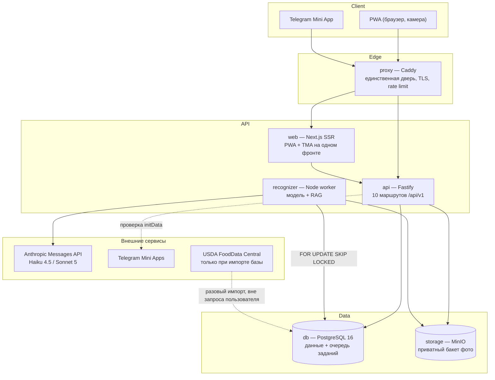

# Architecture — N4 «Тарелка», CJM E

Дата: 2026-09-12. Источник имён — [`canon.md`](canon.md) (заморожен 2026-09-12): 12 сущностей, 10 маршрутов,
6 сервисов, числа потолков. Документ отвечает на выходы discovery **PD-DATA-001…003**, **PD-COST-001**,
**PD-ARCH-001** ([`product-discovery-brief.md`](product-discovery-brief.md) §M4).

Статус: технический план. Ни один сервис не развёрнут, ни одно измерение не снято на живом стенде —
там, где ниже стоит число, это проектное требование, а не наблюдение.

## Architecture Overview

**Стиль: Distributed Monolith (Monorepo).** Один репозиторий, общие типы и схема миграций, но три
самостоятельных процесса (`web`, `api`, `recognizer`), которые масштабируются и падают по отдельности.
Выбор объясняется двумя свойствами задачи: (1) распознавание — это внешний платный вызов длиной в
секунды, и он не должен занимать веб-воркер, отдающий страницы; (2) продукт на неделю, и стоимость
эксплуатации микросервисной сети здесь больше выигрыша от неё.

Кэша нет, брокера очередей нет — оба решения приняты осознанно и обоснованы в Technology Stack.

## Component Breakdown

| Сервис | Ответственность | Чего НЕ делает |
|---|---|---|
| **`web`** (Next.js, SSR + PWA-манифест + Telegram Mini App SDK) | экраны камеры, результата, расхождения, дневника, карточки, кабинета партнёра; публичная страница карточки `/c/{card_id}`; один фронт на оба клиента — TMA отличается только источником сессии | не ходит в БД и в MinIO напрямую; не знает секретов моделей |
| **`api`** (Node/TypeScript, Fastify) | 10 маршрутов канона; приём фото в MinIO; создание задания `recognition`; атомарная проверка потолков; проверка Telegram `initData`; применение кода партнёра; выдача presigned-URL | не вызывает модель сам — иначе долгий вызов занял бы HTTP-воркер |
| **`recognizer`** (Node worker) | забирает задание `SELECT … FOR UPDATE SKIP LOCKED`; вызывает Haiku 4.5 со структурированной JSON-схемой; ищет ингредиент в `food_item`/`food_synonym` (pg_trgm); считает числа по порции; при уверенности < 0,6 эскалирует к Sonnet 5; пишет результат и источник | не принимает HTTP-запросов извне вовсе |
| **`db`** (PostgreSQL 16 + `pg_trgm`) | данные, поиск по названию, очередь заданий, счётчики квот | не публикует порт на хост (`.claude/rules/docker-ports.md`, Правило №0) |
| **`storage`** (MinIO) | приватный бакет фото, TTL 30 дней политикой жизненного цикла | не отдаёт объекты публично — только presigned-URL с коротким сроком |
| **`proxy`** (Caddy) | TLS, единственная публичная дверь, ограничение частоты до валидации, заголовки CSP | не ставит CORS-заголовки: приложение и API живут на одном origin, и дублирование заголовка ломает CORS молча |

Код партнёра принимается **двумя путями**: по прямой ссылке Mini App (`?startapp=`) и вводом руками
после первого результата. Второй путь обязателен, а не запасной: у части пользователей ссылки `t.me`
не открываются, и путь, зависящий только от deeplink, теряет их молча.

Импортёр базы USDA — не сервис compose, а разовая задача (`npm run import:fdc`), потому что она
выполняется до запуска и не участвует в пользовательском пути.

## Technology Stack

| Layer | Technology | Rationale |
|---|---|---|
| Frontend | Next.js 15 (App Router, SSR), PWA-манифест, Telegram Mini Apps SDK | один фронт закрывает оба клиента канона; SSR нужен публичной карточке `/c/{card_id}` для превью в мессенджерах |
| Backend | Node 22 / TypeScript, Fastify | общий язык и типы с фронтом; Fastify даёт доступ к сырому телу запроса, что понадобится, если появятся вебхуки |
| Database | PostgreSQL 16 + расширение `pg_trgm` | одна база держит и данные, и очередь, и полнотекстовый поиск по названию продукта; `pg_trgm` даёт нечёткое совпадение «гречка отварная» ↔ `Buckwheat, cooked` через таблицу синонимов |
| Cache | **нет** | 3000 сканов/сутки ≈ 0,03 rps. Кэш на таком объёме не ускоряет ничего, но добавляет шестой сервис, второе место хранения истины и класс дефектов «устаревшее значение». Решение пересматривается, если нагрузка вырастет на два порядка |
| Queue | таблица `recognition` в PostgreSQL, выборка `FOR UPDATE SKIP LOCKED` | отдельный брокер (Redis/RabbitMQ) — это ещё одно хранилище, ещё один сервис и разъезд состояния между БД и очередью. `SKIP LOCKED` даёт ровно нужное: несколько воркеров, ни одного двойного захвата, аренда и повтор в той же транзакции, что и запись результата. Цена — опрос раз в секунду, что при 0,03 rps незаметно |
| Infrastructure | Docker Compose на VPS, Caddy как единственная дверь, MinIO для фото | требование Architecture Constraints конвейера; managed BaaS (Supabase/Firebase/Neon) запрещены |

## External Dependencies

Каждая способность, которая нужна продукту от чужого сервиса. Одна строка — одна СПОСОБНОСТЬ, а не
один поставщик: «принимает изображение» и «возвращает JSON по схеме» — два разных вопроса, и
поставщик может уметь одно без другого.

| Capability needed | Provider / API | Evidence | Verdict | Requirements relying on it |
|---|---|---|---|---|
| принимает изображение в теле запроса и анализирует его | Anthropic Messages API (vision) | [platform.claude.com/docs/en/build-with-claude/vision](https://platform.claude.com/docs/en/build-with-claude/vision) · проверено 2026-09-12 · «On the API, provide images to Claude as `image` content blocks using one of three source types» | CONFIRMED | FR-CAPTURE-002, FR-RECOGNIZE-001 |
| возвращает ответ, обязанный соответствовать заданной JSON-схеме | Anthropic Messages API (structured outputs) | [platform.claude.com/docs/en/build-with-claude/structured-outputs](https://platform.claude.com/docs/en/build-with-claude/structured-outputs) · проверено 2026-09-12 · «Structured outputs guarantee schema-compliant responses through constrained decoding» | CONFIRMED | FR-RECOGNIZE-001, FR-RECOGNIZE-002 |
| отдаёт расход и токены по организации за период | Anthropic Usage & Cost Admin API | [platform.claude.com/docs/en/manage-claude/usage-cost-api](https://platform.claude.com/docs/en/manage-claude/usage-cost-api) · проверено 2026-09-12 · «The Usage & Cost Admin API provides programmatic and granular access to historical API usage and cost data for your organization» | CONFIRMED | NFR-OPS-001, FR-LIMIT-002 |
| ищет продукт по ключевым словам | USDA FoodData Central API, `GET /v1/foods/search` | [fdc.nal.usda.gov/api-guide/](http://fdc.nal.usda.gov/api-guide/) · проверено 2026-09-12 · «Returns a list of foods that matched search (query) keywords» | CONFIRMED | FR-SOURCE-001, FR-SOURCE-003 |
| отдаёт нутриенты одной записи по её идентификатору | USDA FoodData Central API, `GET /v1/food/{fdcId}` | [fdc.nal.usda.gov/api-guide/](http://fdc.nal.usda.gov/api-guide/) · проверено 2026-09-12 · «Fetches details for one food item by FDC ID» | CONFIRMED | FR-SOURCE-001, FR-SOURCE-002 |
| право использовать данные FDC в закрытом коммерческом продукте (CC0) | USDA FoodData Central, раздел Licensing | [fdc.nal.usda.gov/api-guide/](http://fdc.nal.usda.gov/api-guide/) · проверено 2026-09-12 · «USDA FoodData Central data are in the public domain and they are not copyrighted» и далее «No permission is needed for their use, but we request that users list FoodData Central as the source of the data» | CONFIRMED | FR-SOURCE-001, FR-SOURCE-002, FR-SOURCE-003 |
| проверка подлинности данных, полученных от Mini App | Telegram Mini Apps (`initData`) | [core.telegram.org/bots/webapps](https://core.telegram.org/bots/webapps) · проверено 2026-09-12 · «You can verify the integrity of the data received by comparing the received hash parameter with the hexadecimal representation of the HMAC-SHA-256 signature» | CONFIRMED | FR-AUTH-002 |
| открытие Mini App по прямой ссылке с параметром | Telegram Mini Apps (direct link) | [core.telegram.org/bots/webapps](https://core.telegram.org/bots/webapps) · проверено 2026-09-12 · «You can use direct links to open a Mini App directly in the current chat» | CONFIRMED | FR-AUTH-002, FR-PARTNER-001 |

**Лицензия подтверждена, и у неё есть последствие в требованиях.** Раздел Licensing страницы
`api-guide` прямо помещает данные FDC в общественное достояние под CC0 1.0, поэтому использование в
закрытом коммерческом продукте разрешено без отдельного согласия. Взамен USDA просит называть
источник, и предложенная им цитата — «U.S. Department of Agriculture, Agricultural Research Service.
FoodData Central, 2019. fdc.nal.usda.gov.» — записана как требование атрибуции в **FR-SOURCE-002**
(видимый источник числа). То есть строка «источник» на экране результата закрывает не только
продуктовое обещание, но и просьбу правообладателя данных.

Проверено дважды: тот же факт независимо подтверждён записью data.gov
([catalog.data.gov/dataset/fooddata-central](https://catalog.data.gov/dataset/fooddata-central),
поле License = `https://www.usa.gov/publicdomain/label/1.0/`, метаданные сверены 2026-09-10).

**Ограничение, которое надо знать до планирования наблюдаемости.** Usage & Cost Admin API объявлен
недоступным для индивидуальных аккаунтов («The Admin API is unavailable for individual accounts»,
та же страница, 2026-09-12). Если организация не заведена, NFR-OPS-001 закрывается собственным
журналом расхода, а не консолью поставщика.

**Чего в этом списке нет и почему.** В пользовательском пути к USDA обращений НЕТ: база
импортируется в `food_item` заранее. Это снимает и лимит FDC («a default rate of 1,000 requests per
hour per IP address», та же страница), и зависимость распознавания от доступности чужого сервиса.

## Data Architecture

12 логических сущностей канона отображаются на 12 таблиц один к одному. У каждой `id UUID PRIMARY KEY`
и `created_at TIMESTAMPTZ NOT NULL DEFAULT now()`; второго списка полей здесь нет — логическая модель
принадлежит `Pseudocode.md`, здесь только физика.

| Сущность | Таблица | Физические решения |
|---|---|---|
| `account` | `account` | появляется только после входа через Telegram; до него пользователь живёт в `device_session` |
| `device_session` | `device_session` | анонимная сессия устройства; связывается с `account` при входе, не заменяется |
| `photo` | `photo` | в БД только ключ объекта MinIO и метаданные; байты — в бакете, TTL 30 дней |
| `recognition` | `recognition` | **и запись результата, и строка очереди**; `status` — enum из 4 значений `queued / done / failed / refused`; частичный индекс `(status, created_at) WHERE status = 'queued'` — очередь короткая, индекс не растёт вместе с историей |
| `food_item` | `food_item` | импорт FDC; `GIN (name gin_trgm_ops)` для нечёткого поиска; `UNIQUE (source, source_id)` — повторный импорт не двоит записи |
| `food_synonym` | `food_synonym` | ручная RU-курация 100–300 блюд: русское название → `food_item_id` и коэффициент порции; `GIN (name_ru gin_trgm_ops)` |
| `diary_entry` | `diary_entry` | индекс `(owner_key, eaten_on)` — дневник всегда читается за один день; дата хранится как `date` в Europe/Moscow, не как момент времени |
| `share_card` | `share_card` | `id` — публичный неугадываемый идентификатор (UUIDv4), он же адрес `/c/{card_id}` |
| `partner` | `partner` | партнёров десятки, индексов сверх ключа не нужно |
| `partner_code` | `partner_code` | `UNIQUE (code)` в верхнем регистре — иначе два партнёра получают один код |
| `attribution` | `attribution` | `UNIQUE (device_session_id)` — одна атрибуция на устройство: именно этот индекс, а не код приложения, делает «код сильнее cookie» неотменяемым; `status` — enum из 3 значений `pending / activated / rejected` |
| `scan_quota_counter` | `scan_quota_counter` | `UNIQUE (scope, scope_key, day)`, где `scope` ∈ `user / global`; увеличение только через `INSERT … ON CONFLICT DO UPDATE SET used = counter.used + 1 WHERE counter.used < :limit RETURNING used` |

**Счётчик квот — единственное место, где нельзя писать «прочитать и записать».** Проверка и
инкремент выполняются одним оператором с `RETURNING`: пустой результат означает «предел достигнут»,
и вызов модели не делается. Последовательный тест такой защиты зеленеет при обеих реализациях;
различает их только конкурентный прогон, поэтому он обязателен
(`.claude/rules/shared-resource-verification.md`).

**Фото.** Приватный бакет, объекты недоступны без подписи; жизненный цикл бакета удаляет объект
через 30 дней, строка `photo` при этом переводится в состояние «файла больше нет» — иначе дневник
начнёт ссылаться на пустоту.

**Источник числа.** У `recognition` и `diary_entry` хранится ссылка на `food_item` и снимок
использованных чисел. Снимок нужен потому, что переимпорт базы меняет значения, а дневник за
прошлый вторник обязан остаться тем, что пользователь видел.

## Security Architecture

- **Анонимная сессия.** `device_session_id` живёт в cookie `HttpOnly; Secure; SameSite=Lax`. Значение
  не угадываемо; в JavaScript не читается — фронту оно и не нужно.
- **Вход через Telegram.** `initData` проверяется на сервере HMAC-SHA-256 по секрету, производному от
  токена бота, сравнением постоянного времени и с проверкой `auth_date` на свежесть. Проверка — в
  `api`, не во фронте: значение, проверенное на клиенте, не проверено.
- **Порядок операций — это и есть защита.** Ограничение частоты работает **до** валидации тела
  (иначе перебор мусорными запросами бесплатен), проверка квоты — **до** вызова модели и атомарно,
  согласие — **до** первой записи в дневник.
- **Секреты.** Ключ Anthropic и токен бота — только в окружении `api` и `recognizer`. У `web` их нет,
  и это проверяемо: сервис, который не должен звать модель, не имеет чем.
- **Фото приватны.** Отдаются исключительно presigned-URL с коротким сроком, выдаваемым владельцу
  сессии. Прямого публичного пути к бакету нет.
- **Данные о питании — специальная категория персональных данных.** Согласие берётся до первой записи
  дневника, а не при установке; удаление по запросу удаляет дневник, фото и распознавания. Публичной
  страницы дня в MVP нет — публикуется только карточка, которую пользователь создал сам.
- **CORS не нужен и не настраивается.** `web` и `api` живут за одним Caddy на одном origin. Заголовок
  `Access-Control-Allow-Origin` не ставит ни приложение, ни прокси: два одинаковых заголовка ломают
  CORS молча, и `curl` этого не показывает (`.claude/rules/deployment-seams.md`).
- **CSP.** Mini App исполняется внутри WebView Telegram; политика запрещает инлайновые скрипты и
  ограничивает `connect-src` собственным origin и `frame-ancestors` доменами Telegram.
- **Никакой публикации портов хранилищ.** `db` и `storage` доступны только по именам в сети compose.

## Scalability Considerations

Целевая нагрузка канона — **3000 сканов/сутки**, то есть ≈ 0,03 запроса в секунду в среднем и
порядка 0,5 rps в пиковый обеденный час. Это не нагрузка для инфраструктуры; узкое место одно и оно
внешнее.

| Узел | Запас | Что делать при росте |
|---|---|---|
| **Внешний вызов модели** | единственное настоящее ограничение: латентность 2–5 с и лимиты поставщика | горизонтально добавлять `recognizer`; `SKIP LOCKED` этого не замечает |
| `recognizer` | масштабируется копиями без изменения кода | увеличить число реплик; аренда задания уже в транзакции |
| `api` | сотни rps на одном процессе при такой логике | реплики за Caddy |
| `db` | один экземпляр, вертикально | 3000 строк/сутки — это годы до необходимости партиционирования |
| `storage` | 3000 фото/сутки × 30 дней ≈ 90 000 объектов | политика TTL держит объём постоянным |

Горизонтально масштабируются `web`, `api` и `recognizer`. PostgreSQL остаётся один: реплика для
чтения при 0,03 rps добавила бы задержку репликации и класс дефектов «прочитали устаревшее»,
не решая ни одной существующей проблемы.

## Reconciliation with Pseudocode

Сверка с `Pseudocode.md` отложена: документ пишется параллельно с этим. Логическая модель взята из
[`canon.md`](canon.md) §4 (12 сущностей), статусы: `recognition.status` — 4 значения
(`queued / done / failed / refused`), `attribution.status` — 3 значения
(`pending / activated / rejected`). Повторить сверку после появления `Pseudocode.md` — искать три
вида расхождений: смена типа, отсутствующая колонка, несовпадение набора значений. Закрывает
координатор.

| Сущность.поле | Вид расхождения | Что сделано |
|---|---|---|
| — | сверка не выполнялась | `Pseudocode.md` отсутствует на момент записи этого документа |
