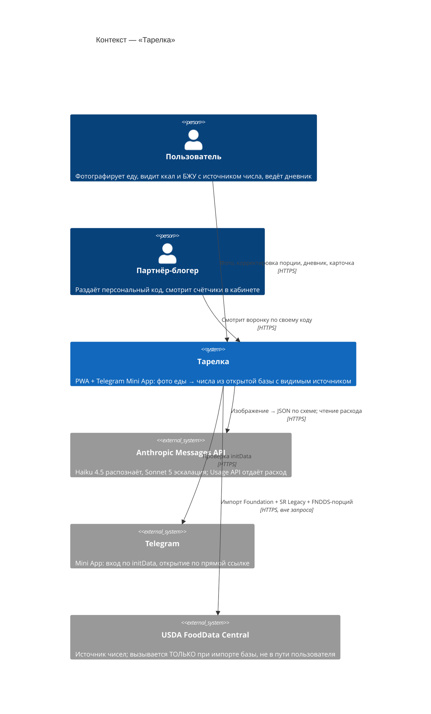
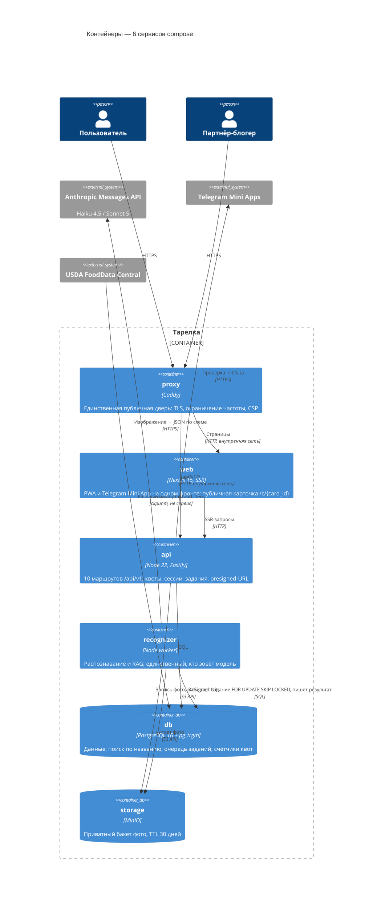
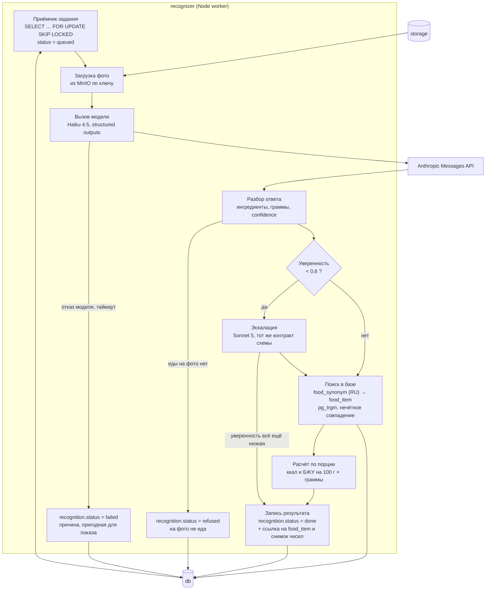

# C4 Diagrams — N4 «Тарелка», CJM E

Дата: 2026-09-12. Три уровня C4: Context (кто с кем), Container (из чего собрано), Component
(как устроен `recognizer` — единственный узел, где живёт вся суть продукта). Имена сервисов и
сущностей — из [`canon.md`](canon.md), не переименовывать.

Четвёртый уровень (Code) не рисуется намеренно: он устаревает быстрее, чем пишется, и его роль
здесь выполняет `Pseudocode.md`.

## Level 1 — System Context

Два человека, а не один: у партнёра свой экран, свои данные и своя причина возвращаться. Третьего
действующего лица (тренер, врач) в контуре нет — это решение CJM E, а не упущение.

## Level 2 — Containers

Что читается с диаграммы и стоит проговорить: **у `db` и `storage` нет ни одной стрелки снаружи
контура** — это и есть Правило №0 о непубликации хранилищ, нарисованное. И **`recognizer` не
принимает входящих стрелок вовсе**: работа приходит к нему только выборкой из очереди, поэтому его
нельзя дёрнуть снаружи ни при какой ошибке в конфигурации прокси.

## Level 3 — Components: `recognizer`

Три вещи на этой диаграмме несут вес и потому нарисованы явно:

1. **Числа приходят из `LOOKUP` и `CALC`, а не из `CALL`.** Модель называет ингредиент и граммы;
   калорийность берётся из `food_item`. Стрелки от `ANT` к `WRITE` нет, и это не упрощение схемы —
   это ADR-001.
2. **`refused` — отдельный выход, а не разновидность `failed`.** «На фото не еда» и «модель не
   ответила» требуют разных экранов: первое исправляет пользователь, второе — повтор.
3. **Эскалация не гарантирует уверенности.** После Sonnet 5 результат записывается в любом случае;
   расхождение показывается на экране (FR-CORRECT-003), а не прячется за вторым вызовом.

Счётчик квот на этой диаграмме отсутствует намеренно: он проверяется и увеличивается в `api` **до**
создания задания. Если бы он жил здесь, деньги уже были бы потрачены к моменту проверки.
