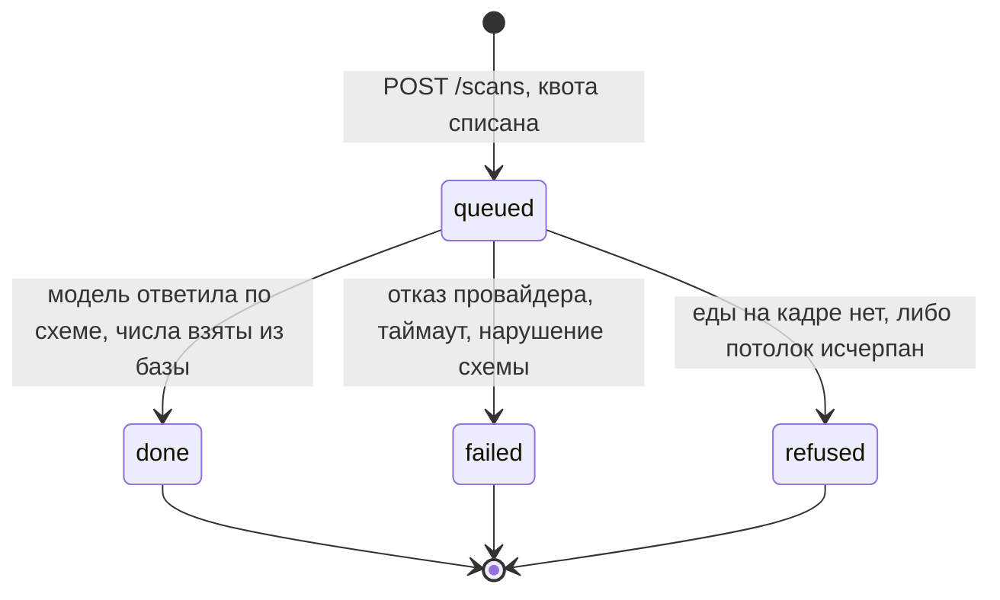
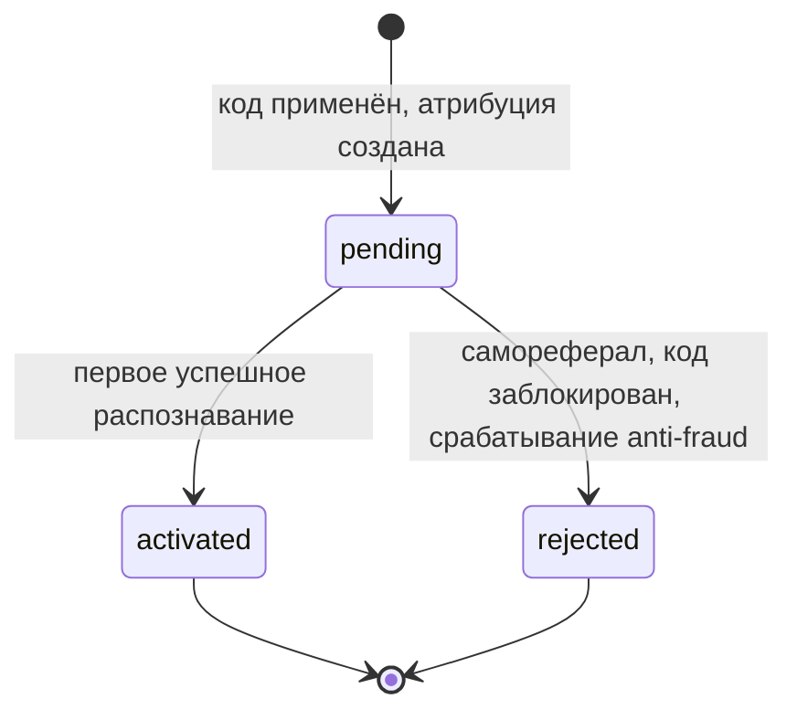

# Pseudocode — N4 «Тарелка», CJM E

Дата: 2026-09-12. Алгоритмический контракт до реализации. Источник наблюдаемого поведения —
[`Specification.md`](Specification.md); источник имён, статусов, маршрутов и чисел —
[`canon.md`](canon.md) (заморожен 2026-09-12); причины выбора — [`ADR.md`](ADR.md); физическое
отображение на таблицы, индексы и сервисы — [`Architecture.md`](Architecture.md).

Этот документ — **единственный владелец логических полей и наборов состояний**. Ни одна сущность,
ни один статус и ни один маршрут здесь не изобретаются: набор закрыт каноном. Ни один шаг не
измерен на живом стенде — это проектный план, а не наблюдение.

Три инварианта, которые ниже соблюдаются в каждом алгоритме и ради которых написан продукт:
**число берётся из базы, а не из модели**; **квота списывается ДО вызова модели**; **расхождение
оценки и базы — выбор пользователя, а не среднее арифметическое**.

## Data Structures

Общие типы: `UUID`; `Timestamp` (момент времени в UTC); `Date` (календарная дата в `Europe/Moscow`);
`Grams` (целое, масса); `Kcal` (целое); `Macro` (граммы, один знак после запятой);
`Confidence` (вещественное 0..1); `IPPrefix` (усечённый префикс адреса, не полный адрес);
`ObjectKey` (ключ объекта в приватном бакете, не URL); `Snapshot` (неизменяемая копия чисел на
момент записи). `?` означает nullable и никогда не подразумевает значение по умолчанию.

Каждая сущность содержит `id: UUID` и `created_at: Timestamp`. Сущностей ровно 12 — столько же,
сколько в каноне §4, один к одному.

| Сущность | Логические поля кроме `id` и `created_at` |
|---|---|
| `account` | `telegram_user_id: string`, `tier: 'free'` (иных значений в неделе не существует; всё, что не ровно `paid`, читается как `free`), `consent_version: string?`, `consent_text_hash: string?`, `consent_at: Timestamp?`, `deletion_requested_at: Timestamp?`, `status: active / erasing / erased` |
| `device_session` | `account_id: UUID?`, `cookie_token_hash: string`, `ip_prefix: IPPrefix`, `last_seen_at: Timestamp`, `anonymous_diary_expires_at: Timestamp` |
| `photo` | `device_session_id: UUID`, `object_key: ObjectKey`, `mime: 'image/jpeg' / 'image/png' / 'image/heic'`, `bytes: int`, `width: int`, `height: int`, `expires_on: Date`, `file_state: present / purged` |
| `recognition` | `device_session_id: UUID`, `account_id: UUID?`, `photo_id: UUID`, `status: queued / done / failed / refused`, `attempt_no: int`, `model_used: 'haiku-4.5' / 'sonnet-5'?`, `escalated: boolean`, `confidence: Confidence?`, `items: list(RecognizedItem)`, `model_kcal_estimate: Kcal?`, `db_kcal_total: Kcal?`, `discrepancy_ratio: Confidence?`, `conflict_flag: boolean`, `failure_reason: provider_unavailable / provider_timeout / schema_violation / no_food_detected / quota_exhausted_user / quota_exhausted_global?`, `leased_until: Timestamp?`, `finished_at: Timestamp?` |
| `food_item` | `source: 'USDA-FDC'`, `source_id: string`, `name_en: string`, `kcal_per_100g: Kcal`, `protein_per_100g: Macro`, `fat_per_100g: Macro`, `carb_per_100g: Macro`, `default_portion_g: Grams?`, `import_snapshot_date: Date` |
| `food_synonym` | `name_ru: string`, `name_ru_normalized: string`, `food_item_id: UUID?`, `recipe_parts: list(RecipePart)?`, `curated_by: string`, `curated_at: Timestamp` — ровно одно из `food_item_id` и `recipe_parts` заполнено |
| `diary_entry` | `owner_key: string` (аккаунт, если он есть, иначе сессия устройства), `recognition_id: UUID`, `eaten_on: Date`, `meal_slot: breakfast / lunch / dinner / snack`, `items: list(DiaryItem)`, `kcal_total: Kcal`, `protein_total: Macro`, `fat_total: Macro`, `carb_total: Macro`, `source_snapshot: Snapshot`, `user_corrected: boolean`, `deleted_at: Timestamp?` |
| `share_card` | `owner_key: string`, `recognition_id: UUID`, `object_key: ObjectKey`, `width: 1080`, `height: 1920`, `badge_rendered: boolean`, `revoked_at: Timestamp?` |
| `partner` | `display_name: string`, `contact: string`, `account_id: UUID?`, `status: active / suspended` |
| `partner_code` | `partner_id: UUID`, `code: string` (4–12 символов A-Z0-9, хранится в верхнем регистре, уникален), `status: active / blocked`, `blocked_reason: antifraud_ip_burst / manual?`, `blocked_at: Timestamp?` |
| `attribution` | `device_session_id: UUID`, `partner_code_id: UUID`, `status: pending / activated / rejected`, `reject_reason: self_referral / code_blocked / antifraud_ip_burst?`, `source: explicit / deeplink / cookie`, `activated_at: Timestamp?` |
| `scan_quota_counter` | `scope: user / global`, `scope_key: string` (для `user` — сессия устройства или усечённый IP-префикс; для `global` — константа), `day: Date`, `used: int`, `limit: int` |

Вложенные значения — не отдельные сущности, а неизменяемые записи внутри полей:
`RecognizedItem = {label_ru: string, mass_g: Grams, candidates: list(UUID) (до трёх food_item),
chosen_food_item_id: UUID?, unmatched: boolean}`;
`RecipePart = {food_item_id: UUID, share: Confidence}`, сумма долей равна 1;
`DiaryItem = {food_item_id: UUID?, label_ru: string, mass_g: Grams, kcal: Kcal, protein: Macro,
fat: Macro, carb: Macro, unmatched: boolean, source_line: string}`;
`Snapshot = {source_name: 'USDA FoodData Central', source_id: string, source_item_name: string,
portion_g: Grams, import_snapshot_date: Date, values_per_100g: {kcal, protein, fat, carb}}`.

Снимок обязателен: переимпорт базы меняет значения `food_item`, а дневник за прошлый вторник обязан
остаться тем, что пользователь видел. Без снимка «источник виден» становится ложью задним числом.

## Core Algorithms

### Algorithm: CreateDeviceSession

REQUIREMENT: `FR-AUTH-001`
REQUIREMENT: `FR-CAPTURE-001`
REALISES: SC-US-001-1
INPUT: HTTP-запрос без cookie сессии либо с cookie, адрес клиента.
OUTPUT: `device_session` и cookie `HttpOnly; Secure; SameSite=Lax`, либо существующая сессия.
STEPS:
1. IF cookie сессии присутствует AND её хэш найден в `device_session` THEN обновить `last_seen_at` и RETURN найденную сессию. Значение cookie не читается JavaScript'ом и фронту не нужно.
2. Сгенерировать непредсказуемый токен (≥ 128 бит энтропии), сохранить только его хэш. Сырое значение уходит в cookie и нигде больше не хранится.
3. Усечь адрес клиента до префикса (`IPPrefix`) и записать в `ip_prefix`. Полный адрес не сохраняется: он нужен только квоте и anti-fraud, и для них достаточно префикса.
4. Установить `anonymous_diary_expires_at = created_at + 7 суток`; `account_id = NULL`.
5. RETURN сессию. Никакой анкеты, экрана согласия и регистрации здесь нет: съёмка обязана быть доступна сразу, а согласие спрашивается позже — перед ПЕРВОЙ записью дневника (`ConsentAndErasure`).
COMPLEXITY: O(1).

### Algorithm: CheckAndConsumeQuota

REQUIREMENT: `FR-LIMIT-001`
REQUIREMENT: `FR-LIMIT-002`
REQUIREMENT: `NFR-OPS-001`
REALISES: SC-US-009-1
INPUT: сессия устройства, её `ip_prefix`, текущая дата в `Europe/Moscow`, причина попытки (`first_call` либо `escalation`).
OUTPUT: `granted` либо `refused(quota_exhausted_user | quota_exhausted_global)`. Вызов модели после `refused` не выполняется НИКОГДА.
STEPS:
1. На старте сервиса: IF потолок пользователя или суточный потолок не задан в конфигурации THEN уронить запуск с сообщением, называющим ненастроенный вызов. Пустая переменная не означает «ограничений нет».
2. Собрать три ключа на сегодняшний день: `(user, session_id, day)`, `(user, ip_prefix, day)`, `(global, 'all', day)`. Ключей у анонима ДВА, а не один: смена любого одного обнулила бы защиту.
3. Для каждого ключа по очереди выполнить ОДИН оператор: `INSERT … ON CONFLICT (scope, scope_key, day) DO UPDATE SET used = used + 1 WHERE scan_quota_counter.used < limit RETURNING used`. «Прочитать, потом записать» запрещено: последовательный тест зеленеет при обеих реализациях, различает их только конкурентный прогон.
4. IF оператор вернул пустой результат THEN откатить уже увеличенные счётчики этой попытки, вернуть `refused` с причиной по тому ключу, который отказал, и RETURN. Отказ — это ОТКАЗ: ни перехода на модель подешевле, ни очереди.
5. Счёт ведётся по ПОПЫТКАМ. `escalation` вызывает этот же алгоритм второй раз, и вторая попытка списывается наравне с первой: провайдер берёт деньги за попытку, а не за успех. Таймаут и отказ провайдера уже списаны на шаге 3 и не возвращаются.
6. Записать событие расхода (`day`, модель, причина попытки) для служебной страницы расхода: число попыток, доля эскалаций, отказы провайдера, оценка затрат за сутки.
7. RETURN `granted`.
COMPLEXITY: O(1) на ключ, три индексированные записи на попытку.

### Algorithm: EnqueueScan

REQUIREMENT: `FR-CAPTURE-002`
REQUIREMENT: `NFR-PERF-001`
REALISES: SC-US-001-1
INPUT: сессия устройства, байты изображения, заявленный MIME.
OUTPUT: `scan_id` и статус `queued`, ЛИБО отказ валидации, ЛИБО отказ по потолку.
STEPS:
1. Ограничение частоты применяется ДО разбора тела: иначе перебор мусорными запросами бесплатен.
2. Проверить формат и размер: JPEG, PNG или HEIC; не больше 12 МБ; не меньше 320×320 px. IF проверка не пройдена THEN RETURN `422` с названной причиной и БЕЗ обращения к квоте — вызова модели не было, списывать нечего.
3. Вызвать `CheckAndConsumeQuota(session, 'first_call')`. IF `refused` THEN создать `recognition` со статусом `refused` и `failure_reason = quota_exhausted_*`, RETURN `429` с телом `{limit, reset_at}`. Порядок неслучаен: квота ПОСЛЕ валидации (мусор не жжёт чужую квоту) и ДО вызова модели (вызов не делается бесплатно).
4. Положить оригинал в приватный бакет, создать `photo` с `expires_on = today + 30 дней` и `file_state = present`. Публичной ссылки на фото не существует ни на одном шаге.
5. Создать `recognition` со статусом `queued`, `attempt_no = 1`, `escalated = false`. Строка `recognition` — И запись результата, И строка очереди; второго места истины нет.
6. RETURN `scan_id` немедленно, не дожидаясь распознавания: долгий вызов не должен занимать HTTP-воркер, а клиент получает ручку, по которой второй раз находит СВОЮ задачу.
COMPLEXITY: O(1) плюс одна загрузка объекта.

### Algorithm: RecognizeScan

REQUIREMENT: `FR-RECOGNIZE-001`
REQUIREMENT: `FR-RECOGNIZE-002`
REQUIREMENT: `FR-SOURCE-001`
REQUIREMENT: `FR-SOURCE-002`
REQUIREMENT: `FR-SOURCE-003`
REQUIREMENT: `NFR-SCALE-001`
REALISES: SC-US-001-2, SC-US-002-1, SC-US-002-2
INPUT: задание из очереди `recognition` со статусом `queued`.
OUTPUT: `recognition` в терминальном статусе `done`, `failed` или `refused`.
STEPS:
1. Взять аренду: `SELECT … FROM recognition WHERE status = 'queued' ORDER BY created_at FOR UPDATE SKIP LOCKED LIMIT 1`, проставить `leased_until`. `SKIP LOCKED` даёт нескольких воркеров без единого двойного захвата.
2. Получить подписанную ссылку на объект фото со сроком жизни не дольше 15 минут и загрузить изображение. Соединение с базой на время внешнего вызова НЕ удерживается: транзакция аренды закрывается до шага 3, иначе пул кончается при десяти одновременных сканах.
3. Вызвать Haiku 4.5 со строгой JSON-схемой. Модель возвращает ТРИ вещи: список ингредиентов, оценку массы каждого в граммах и до трёх кандидатов записей базы на ингредиент, плюс `confidence` и справочную `model_kcal_estimate`. IF ответ не соответствует схеме THEN `failed(schema_violation)`. IF провайдер недоступен или истёк таймаут THEN `failed(provider_unavailable | provider_timeout)` — попытка уже списана и не возвращается.
4. IF модель не нашла на кадре еды THEN записать `refused` с подсказкой «еда не распознана, снимите тарелку целиком», записи дневника не создавать и RETURN.
5. IF `confidence < 0,6` AND `escalated = false` THEN вызвать `CheckAndConsumeQuota(session, 'escalation')`; IF `granted` THEN повторить шаг 3 моделью Sonnet 5 ровно ОДИН раз, установить `escalated = true`, `attempt_no = 2`; ELSE записать `refused(quota_exhausted_*)` и RETURN.
6. IF после эскалации `confidence` всё ещё ниже 0,6 THEN завершить `done`, но пометить результат как требующий уточнения: пользователю показывается ручной поиск по базе. Тихого усреднения и молчаливого выбора первого кандидата не происходит.
7. Для каждого ингредиента найти запись базы: сперва точное совпадение нормализованной русской формы в `food_synonym`, затем нечёткое совпадение по триграммам (`pg_trgm`) по `name_ru_normalized`, затем по `food_item.name_en` среди кандидатов модели. IF найден `food_synonym` с `recipe_parts` THEN раскрыть его в компоненты с долями и считать каждый компонент отдельно — «борщ» не становится безымянным числом.
8. IF подходящей записи нет THEN пометить позицию `unmatched = true`, ИСКЛЮЧИТЬ её из итога и сохранить видимую пометку «нет в базе». Ноль вместо неизвестного числа не подставляется никогда.
9. Для каждой сопоставленной позиции вычислить `kcal = round(mass_g / 100 × kcal_per_100g)` и так же три макронутриента; сложить в `db_kcal_total`. Оценка модели в дневник НЕ попадает ни при каких условиях.
10. Собрать `Snapshot` на каждую позицию: имя базы, идентификатор записи, её название, использованную порцию в граммах и дату импорта снимка базы. Без снимка требование «источник виден» не переживает переимпорта.
11. Вычислить `discrepancy_ratio = |model_kcal_estimate − db_kcal_total| / db_kcal_total`. IF `db_kcal_total > 0` AND `discrepancy_ratio > 0,15` THEN `conflict_flag = true`. IF `db_kcal_total = 0` (все позиции `unmatched`) THEN `discrepancy_ratio = NULL` и `conflict_flag = false` — отношение с нулевым знаменателем это «не измерено», а не «ноль процентов».
12. Записать `done`, `finished_at`, снять аренду. Асинхронно запустить `BuildShareCard`, чтобы карточка была готова к моменту, когда пользователь увидит результат.
COMPLEXITY: O(k · log n) на скан, где k — число ингредиентов (единицы), n — размер `food_item`; поиск идёт по GIN-индексу триграмм.

### Algorithm: AdjustPortion

REQUIREMENT: `FR-CORRECT-001`
REALISES: SC-US-003-1, SC-US-003-2
INPUT: `recognition_id`, индекс позиции, новая масса в граммах.
OUTPUT: пересчитанные четыре числа позиции и блюда, либо отказ валидации.
STEPS:
1. Проверить владение: позиция принадлежит сессии или аккаунту вызывающего, иначе `404` без раскрытия существования.
2. Степпер даёт шаг 10 г, длинное нажатие — 50 г; ручной ввод принимает 5–2000 г. IF значение вне диапазона THEN RETURN `422` с названным допустимым диапазоном и СОХРАНИТЬ прежнюю порцию — ввод не принят, а не принят частично.
3. Пересчитать `kcal`, `protein`, `fat`, `carb` позиции по формуле `(mass_g / 100) × значение_на_100г` из СНИМКА, а не из текущей строки `food_item`: иначе переимпорт базы задним числом изменил бы уже показанное число.
4. Пересуммировать блюдо, исключая `unmatched`-позиции. Пометить `user_corrected = true` и сохранить исходную оценку рядом.
5. Нового вызова модели НЕ выполняется и квота НЕ списывается: пересчёт — арифметика над уже полученными данными.
COMPLEXITY: O(k) по числу позиций блюда.

### Algorithm: ReplaceIngredient

REQUIREMENT: `FR-CORRECT-002`
REALISES: SC-US-008-1, SC-US-008-2
INPUT: `recognition_id`, индекс позиции, действие (`replace` с `food_item_id` либо `delete`), поисковая строка.
OUTPUT: обновлённый состав блюда и пересчитанные числа.
STEPS:
1. Проверить владение, как в `AdjustPortion` шаг 1.
2. Поиск по базе: нормализовать запрос, искать в `food_synonym` по триграммам, затем в `food_item`; вернуть до 20 кандидатов с именем, порцией по умолчанию и значениями на 100 г, чтобы выбор делался ВИДЯ числа.
3. IF действие `replace` THEN подставить выбранную запись, взять её значения, собрать НОВЫЙ `Snapshot` и пересчитать позицию по массе, уже указанной пользователем.
4. IF действие `delete` THEN удалить позицию из состава.
5. Пересуммировать блюдо немедленно. Записать поправку в историю: пара «что предложила модель → что выбрал человек» — это материал курации синонимов (`FR-SOURCE-003`), а не журнал ради журнала.
6. Вызова модели нет, квота не списывается.
COMPLEXITY: O(log n) на поиск, O(k) на пересчёт.

### Algorithm: ResolveDiscrepancy

REQUIREMENT: `FR-CORRECT-003`
REALISES: SC-US-004-1, SC-US-004-2
INPUT: `recognition_id`, выбор пользователя (`take_db` либо `refine_composition`).
OUTPUT: зафиксированный выбор и число, которое пойдёт в дневник.
STEPS:
1. IF `conflict_flag = false` THEN экран расхождения не показывается, в дневник идёт число базы, и алгоритм на этом завершается. Порог ровно один — 15%; 9% экрана не вызывают.
2. IF `conflict_flag = true` THEN показать два числа рядом, у каждого подписан источник: оценка модели и сумма по базе. Кнопка «взять из базы» выбрана ПО УМОЛЧАНИЮ.
3. Тихое усреднение ЗАПРЕЩЕНО. Среднее двух чисел не имеет источника, который можно показать, и потому нарушает `FR-SOURCE-001` на уровне арифметики, а не оформления.
4. IF выбор `take_db` THEN число дневника равно `db_kcal_total`.
5. IF выбор `refine_composition` THEN вернуть пользователя в `ReplaceIngredient` и `AdjustPortion`; после правок пересчитать `discrepancy_ratio` и повторить шаг 1.
6. Сохранить ОБА числа вместе с выбором и временем: расхождения обязаны пересчитываться позже, а для этого нужны обе величины, а не победившая.
COMPLEXITY: O(1).

### Algorithm: CommitDiaryEntryAndDayTotals

REQUIREMENT: `FR-DIARY-001`
REQUIREMENT: `FR-GROWTH-006`
REALISES: SC-US-005-1, SC-US-005-2, SC-US-012-1
INPUT: `recognition_id` в статусе `done`, подтверждение пользователя, текущее время.
OUTPUT: `diary_entry` и пересчитанные итоги дня, либо экран согласия.
STEPS:
1. IF согласие на обработку данных о питании не дано THEN НЕ создавать запись, показать экран согласия и RETURN. Съёмка и результат при этом остаются доступны: отказ ограничивает дневник, а не продукт.
2. Определить `eaten_on` по `Europe/Moscow` — календарную дату, а не момент времени: иначе ужин в 23:50 по Москве попадёт во вчера у сервера в UTC.
3. Определить `meal_slot` по времени суток (завтрак / обед / ужин / перекус) и разрешить исправить его одним тапом.
4. Скопировать состав, числа и `source_snapshot` из `recognition`. Запись дневника не ссылается на живые значения базы — она их ХРАНИТ.
5. `owner_key` — аккаунт, если вход выполнен, иначе сессия устройства. Анонимный дневник живёт 7 суток и целиком переносится при входе (`TelegramLogin`).
6. Итог дня: сумма по всем неудалённым записям этой даты по ккал и трём макронутриентам плюс разбивка по приёмам. Редактирование и удаление пересчитывают итог немедленно; удаление — мягкое (`deleted_at`), чтобы стрик и аудит остались воспроизводимыми.
7. Публичной ссылки на день не существует: наружу выходит только карточка, которую пользователь создал сам.
COMPLEXITY: O(m) по числу записей дня, m — единицы.

### Algorithm: ComputeSoftStreak

REQUIREMENT: `FR-DIARY-002`
REALISES: SC-US-006-1, SC-US-006-2
INPUT: `owner_key`, текущая дата в `Europe/Moscow`.
OUTPUT: длина стрика и пометка «заморожен» на пропущенных днях.
STEPS:
1. Собрать множество дат, в которых есть хотя бы одна неудалённая запись, за последние 60 суток.
2. Идти назад от сегодняшнего дня, считая последовательные сутки.
3. IF день пропущен AND предыдущий (более ранний) день имеет запись THEN не обрывать счёт, пометить пропущенный день как «заморожен» и продолжить. Один пропуск стрик НЕ обнуляет.
4. IF пропущены ДВА дня подряд THEN оборвать счёт на этом месте.
5. RETURN длину. Формулировка нейтральная: ни обратного отсчёта, ни предупреждения о потере — механика избегания потери в продукте про еду легко превращается в давление.
COMPLEXITY: O(d), d ≤ 60.

### Algorithm: BuildShareCard

REQUIREMENT: `FR-SHARE-001`
REQUIREMENT: `FR-GROWTH-001`
REQUIREMENT: `FR-GROWTH-003`
REALISES: SC-US-007-1, SC-US-007-2
INPUT: `recognition` в статусе `done`.
OUTPUT: `share_card` 1080×1920 в приватном бакете, готовая ДО того, как пользователь нажал «поделиться».
STEPS:
1. Сборка выполняется на СЕРВЕРЕ и запускается автоматически после `done`: пользователь нажимает «поделиться» и получает файл, а не запускает генерацию.
2. IF статус не `done` (в том числе `refused`) THEN карточка не создаётся и призыв «поделиться» не показывается — делиться нечем.
3. Нанести: фото, название блюда, четыре числа, строку источника (имя базы, идентификатор записи, порция). Вес, цель, итог дня и любые другие данные о здоровье на карточку НЕ попадают.
4. Тариф читается ТОЛЬКО из `account.tier` в базе; поле тарифа, присланное клиентом, игнорируется. `badge_rendered = (tier ≠ 'paid')`. Отсутствующее, пустое или неузнанное значение даёт бейдж — это правило fail-closed, а не настройка.
5. Бейдж «распознано в Тарелке» занимает не более 8% высоты и не перекрывает числа. Кнопки снятия бейджа в интерфейсе нет.
6. `id` карточки — неугадываемый UUID, он же публичный адрес `/c/{card_id}`. IF `revoked_at` установлен (владелец удалил карточку либо отозвал согласие) THEN адрес отдаёт `404` без содержимого и без данных дневника.
COMPLEXITY: O(1) на карточку, одна операция отрисовки.

### Algorithm: ApplyPartnerCode

REQUIREMENT: `FR-PARTNER-001`
REQUIREMENT: `FR-GROWTH-002`
REALISES: SC-US-010-1, SC-US-010-2
INPUT: сессия устройства, источник кода (`explicit` — введён руками, `deeplink` — параметр ссылки Mini App, `cookie` — сохранённый ранее), строка кода.
OUTPUT: `attribution` со статусом `pending`, либо ошибка ввода, либо `rejected`.
STEPS:
1. Нормализовать: обрезать пробелы, привести к верхнему регистру. Проверить форму: 4–12 символов из A-Z и 0-9.
2. Найти `partner_code` по нормализованному значению.
3. IF источник `explicit` AND код НЕ найден или не проходит по форме THEN RETURN ошибку ввода и ОСТАНОВИТЬСЯ. Откат к cookie ЗАПРЕЩЁН: человек назвал конкретный код, и подстановка другого была бы засчитана не тому. Ни один код при этом не засчитывается.
4. IF источник `explicit` AND код найден THEN он сильнее cookie и deeplink — существующая атрибуция по слабому источнику заменяется.
5. IF код найден AND `status = blocked` THEN создать `attribution` со статусом `rejected` и причиной `code_blocked`.
6. IF аккаунт вызывающего совпадает с `partner.account_id` этого кода THEN `rejected(self_referral)` и запись в аудит. Партнёр не может применить собственный код.
7. Вызвать `AntiFraudOnCode(code, ip_prefix)`. IF он вернул блокировку THEN `rejected(antifraud_ip_burst)`.
8. Создать ровно одну `attribution` на `device_session_id` (уникальность по устройству — свойство хранилища, а не кода приложения: именно она делает «код сильнее cookie» неотменяемым). Статус `pending`.
9. Активация наступает позже: первое УСПЕШНОЕ распознавание переводит `pending → activated` и проставляет `activated_at`. Платной конверсии в неделе нет, поэтому дальше `activated` статус не идёт.
COMPLEXITY: O(1) индексированный поиск.

### Algorithm: AntiFraudOnCode

REQUIREMENT: `FR-PARTNER-003`
REALISES: — (сценария `SC-US-nnn-k` нет; требование покрыто Gherkin-сценарием `@FR-GROWTH-002 @security` в `Specification.md`)
INPUT: код, усечённый IP-префикс, текущее время.
OUTPUT: решение `allow` либо `block`, запись аудита при блокировке.
STEPS:
1. Посчитать применения этого кода с этого IP-префикса за скользящее окно 10 минут.
2. IF счётчик > 50 THEN перевести `partner_code.status → blocked` с причиной `antifraud_ip_burst` и RETURN `block`. Дальнейшие применения получают `rejected`.
3. Записать в аудит: код, усечённый префикс адреса и время. Полный адрес не пишется: для расследования достаточно префикса, а хранение полного адреса создаёт обязательство без нужды.
4. Разблокировка выполняется ТОЛЬКО оператором вручную и тоже пишется в аудит. Автоматического снятия нет: автоснятие превращает порог в задержку.
5. Пороги 50 и 10 минут перенесены из проекта N1 как отправная точка и пересчитываются после первой недели реального трафика — это признанная гипотеза, а не измерение.
COMPLEXITY: O(1) при индексе по `(partner_code_id, ip_prefix, created_at)`.

### Algorithm: PartnerDashboard

REQUIREMENT: `FR-PARTNER-002`
REQUIREMENT: `FR-GROWTH-004`
REQUIREMENT: `FR-GROWTH-007`
REALISES: SC-US-011-1, SC-US-011-2
INPUT: аутентифицированный партнёр, окно (`day` / `week` / `all`).
OUTPUT: четыре счётчика по СВОЕМУ коду и время последнего обновления.
STEPS:
1. Разрешить код на стороне СЕРВЕРА из `partner.account_id` вызывающего. Код, присланный в запросе, игнорируется; запрос чужого кода даёт `403`, и чужие счётчики не раскрываются даже частично.
2. Посчитать за окно: переходы (события по ссылке), установки (созданные `device_session` с этой атрибуцией), активации (`attribution.status = activated`, то есть хотя бы одно успешное распознавание), шеринги карточек.
3. IF по коду нет ни одного перехода THEN вернуть НУЛИ с пометкой «данных нет» — не пустой экран и не прочерки. Ноль, показанный как измеренное значение, и «не измерено» — разные состояния.
4. Показатель i (карточек на активированного) и conv% (установок на карточку) считаются и отдаются РАЗДЕЛЬНО. Их произведение не вычисляется: отраслевого ориентира нет, и перемножение двух гипотез дало бы третью, выглядящую как измерение.
5. IF число наблюдений ниже порога 30 THEN вместо доли показать «недостаточно данных (n из 30)». Знаменатель, равный нулю, даёт «не измерено», а не `0%`.
6. Денег, ставок и реестра выплат в ответе НЕТ: их в неделе не существует, и пустая колонка «к выплате» читалась бы как обещание.
COMPLEXITY: O(log n) по индексу `(partner_code_id, created_at)`.

### Algorithm: TelegramLogin

REQUIREMENT: `FR-AUTH-002`
REALISES: SC-US-013-1, SC-US-013-2
INPUT: сырые байты `initData` от Telegram Mini App, текущая сессия устройства.
OUTPUT: аккаунт, связанный с сессией, и перенесённый дневник; либо `401`.
STEPS:
1. Проверить подпись ПЕРВОЙ — до разбора полезной нагрузки. Разбор непроверенных данных означает, что чужие значения уже прошли через логику.
2. Считать HMAC-SHA-256 по СЫРЫМ байтам строки проверки, по секрету, производному от токена бота. Разбор и повторная сборка меняют байты, подпись не совпадёт никогда, и обычным «лечением» этого становится отключение проверки.
3. Сравнивать постоянным временем. Обычное сравнение выдаёт временем длину угаданного префикса.
4. Проверить свежесть `auth_date`: не старше 24 часов. Порядок именно такой — свежесть ПОСЛЕ подписи, иначе разное время ответа на «протухло» и «подпись не сошлась» различимо снаружи.
5. IF любая проверка не пройдена THEN RETURN `401`: аккаунт НЕ создаётся, сессия НЕ выдаётся, ничего не записывается.
6. Найти или создать `account` по `telegram_user_id`. Связать `device_session.account_id`; сессия не заменяется, а связывается.
7. Перенести анонимный дневник ЦЕЛИКОМ: все `diary_entry` с `owner_key` этой сессии получают `owner_key` аккаунта в одной транзакции. Частичный перенос хуже отсутствия переноса: пользователь увидит половину своих дней и не поймёт, какая половина.
8. Проверка выполняется в `api`, не во фронте: значение, проверенное на клиенте, не проверено.
COMPLEXITY: O(1) плюс O(m) на перенос записей.

### Algorithm: ConsentAndErasure

REQUIREMENT: `FR-AUTH-003`
REQUIREMENT: `NFR-SEC-002`
REALISES: SC-US-012-1, SC-US-012-2
INPUT: действие (`grant` / `withdraw` / `erase`), версия текста согласия, владелец.
OUTPUT: версионированная запись согласия либо запущенное удаление.
STEPS:
1. `grant`: сохранить текст, его хэш, версию и время. Согласие спрашивается ДО первой записи дневника, а не при установке: до дневника обрабатывать нечего.
2. IF отказ THEN зафиксировать отказ с версией текста. Продукт остаётся работоспособным: съёмка и результат доступны, дневник не ведётся. Это не деградация, а объявленная граница.
3. `withdraw`: немедленно проставить `revoked_at` ВСЕМ карточкам владельца. Публичные адреса перестают отдавать содержимое не позже 60 с. Отзыв действует на будущее и на уже опубликованное.
4. `erase`: перевести `account.status → erasing`, поставить `deletion_requested_at`. Удалить аккаунт, дневник, распознавания, карточки и объекты фото не позже 72 часов; публичные карточки закрываются НЕМЕДЛЕННО, не по расписанию.
5. По умолчанию всё закрыто. IF внутренний вызов пытается передать записи дневника во внешний канал без действующего согласия THEN отказать и записать в аудит причину «нет согласия». Недоступность источника истины о согласии — тоже отказ, а не пропуск.
COMPLEXITY: O(m) по объёму данных владельца.

### Algorithm: RecordProInterest

REQUIREMENT: `FR-LIMIT-003`
REALISES: SC-US-009-2
INPUT: владелец, контакт (почта или Telegram), источник показа (`user_limit` либо `global_limit`).
OUTPUT: сохранённая запись интереса.
STEPS:
1. Экран показывается не чаще одного раза в сутки на пользователя; счётчик показов — по `owner_key` и дате в `Europe/Moscow`.
2. Экран явно сообщает, что оплаты сейчас нет. Цены, тарифа и любой платёжной формы на нём НЕТ: практики продукта-источника, наказанные магазином приложений снятием из выдачи, не воспроизводятся.
3. Сохранить контакт, дату, источник показа и код партнёра, если атрибуция существует.
4. Запись интереса — это измерение спроса, а не предзаказ: никакого обязательства перед пользователем она не создаёт и так и формулируется в тексте экрана.
COMPLEXITY: O(1).

### Algorithm: PurgeExpiredPhotos

REQUIREMENT: `NFR-SEC-001`
REALISES: — (сценария `SC-US-nnn-k` нет; требование проверяется по сроку хранения, а не по пользовательскому пути)
INPUT: текущая дата, размер батча.
OUTPUT: удалённые объекты и обновлённые строки `photo`.
STEPS:
1. Раз в сутки выбрать батч `photo` с `expires_on < today` AND `file_state = 'present'`, ограничив размер батча — расход управляется НАШИМ кодом, и потолок ставит он же.
2. Удалить объект из бакета. IF объект уже отсутствует THEN считать шаг успешным: цель — отсутствие файла, а не факт удаления.
3. Перевести `file_state → purged`, строку `photo` СОХРАНИТЬ. Удаление строки оставило бы дневник со ссылкой на пустоту.
4. Политика жизненного цикла бакета работает параллельно и является вторым рубежом, а не заменой: если батч не отработал, срок всё равно наступит.
5. Повторять, пока батч не пуст. Задача идемпотентна: повторный прогон в тот же день не делает ничего.
COMPLEXITY: O(b) на прогон, b — размер батча.

## API Contracts

Префикс `/api/v1` у девяти маршрутов; десятый — публичная страница карточки `/c/{card_id}` без
префикса, потому что её открывает посторонний человек по ссылке из мессенджера. Маршрутов ровно
десять, как в каноне §5; одиннадцатого не существует.

Аутентификация: cookie `session` (`HttpOnly; Secure; SameSite=Lax`) для анонима; после входа через
Telegram — тот же cookie, связанный с аккаунтом, плюс `Authorization: Bearer <token>` для клиента
Mini App. Формат ответа единый: `{ data, meta }` при успехе, `{ error: { code, message } }` при
отказе. `meta` несёт `request_id` и время ответа.

| # | Метод и путь | Заголовки | Тело запроса | `200` — `data` / `meta` | Отказы |
|---|---|---|---|---|---|
| 1 | `POST /api/v1/scans` | `Cookie: session` · `Content-Type: multipart/form-data` | файл изображения (JPEG/PNG/HEIC ≤ 12 МБ, ≥ 320×320) | `{ scan_id, status: 'queued' }` / `{ request_id }` | `401` нет сессии · `413`/`422` `invalid_image` с названной причиной · `429` `quota_exhausted` с телом `{ limit, reset_at }` · `503` `provider_unavailable` |
| 2 | `GET /api/v1/scans/{id}` | `Cookie: session` | — | `{ status, items[], kcal_total, macros, sources[], confidence, conflict_flag, model_kcal_estimate, share_card_id? }` / `{ request_id, updated_at }` | `401` · `403` чужой скан · `404` неизвестный `id` |
| 3 | `POST /api/v1/scans/{id}/correct` | `Cookie: session` · `Content-Type: application/json` | `{ op: 'set_portion' \| 'replace_item' \| 'delete_item' \| 'resolve_conflict', index?, mass_g?, food_item_id?, choice? }` | пересчитанный скан той же формы, что в п.2 | `401` · `403` · `404` · `422` `portion_out_of_range` с диапазоном 5–2000 г · `409` скан не в статусе `done` |
| 4 | `GET /api/v1/diary?date=YYYY-MM-DD` | `Cookie: session` | — | `{ date, entries[], totals: { kcal, protein, fat, carb }, by_meal, streak: { days, frozen_days[] } }` / `{ request_id, timezone: 'Europe/Moscow' }` | `401` · `422` неразбираемая дата · `403` чужой дневник |
| 5 | `POST /api/v1/share-cards` | `Cookie: session` · `Content-Type: application/json` | `{ recognition_id }` | `{ card_id, url: '/c/{card_id}', badge: true }` / `{ request_id }` | `401` · `404` · `409` скан не `done` (в том числе `refused` — делиться нечем) · `403` нет согласия |
| 6 | `GET /c/{card_id}` | — (публичный, без cookie) | — | HTML страницы с превью и изображение 1080×1920 | `404` карточка удалена, отозвано согласие или `id` неизвестен — во всех трёх случаях ОДИН и тот же ответ без содержимого |
| 7 | `POST /api/v1/codes/apply` | `Cookie: session` · `Content-Type: application/json` | `{ code, source: 'explicit' \| 'deeplink' }` | `{ status: 'pending', code }` / `{ request_id }` | `401` · `422` `invalid_code` (явный недействительный код — ошибка, откат к cookie НЕ выполняется) · `409` `already_attributed` · `403` `self_referral` \| `code_blocked` |
| 8 | `GET /api/v1/partner/dashboard?window=day\|week\|all` | `Cookie: session` · `Authorization: Bearer <token>` | — | `{ code, window, clicks, installs, activations, shares, i, conv_pct, n_observations, updated_at }` / `{ request_id }` | `401` · `403` запрос чужого кода · `422` неизвестное окно |
| 9 | `POST /api/v1/auth/telegram` | `Content-Type: application/json` | `{ init_data }` (сырая строка, НЕ разобранный объект) | `{ account_id, migrated_entries }` + установка cookie / `{ request_id }` | `401` подпись не сошлась или `auth_date` старше 24 ч — аккаунт не создан, сессия не выдана · `429` частота |
| 10 | `POST /api/v1/interest` | `Cookie: session` · `Content-Type: application/json` | `{ contact, source: 'user_limit' \| 'global_limit' }` | `{ recorded: true }` / `{ request_id }` | `401` · `422` пустой контакт · `429` чаще одного раза в сутки |

## State Transitions

Оба набора ЗАКРЫТЫ каноном: у `recognition.status` ровно четыре значения, у `attribution.status` —
ровно три. Иное значение при чтении трактуется как самое строгое: `failed` и `rejected`
соответственно. Из терминального состояния возврата нет: повторная съёмка создаёт НОВЫЙ
`recognition` и списывает НОВУЮ попытку.

## Error Handling Strategy

| Категория | Наблюдаемый признак | Ответ системы | Списывается ли попытка |
|---|---|---|---|
| Валидация входа | формат, размер, порция вне 5–2000 г, неразбираемая дата | `422` с названной причиной и допустимым диапазоном; прежнее значение сохраняется | нет — вызова модели не было |
| Потолок пользователя | 10 попыток за сутки по `Europe/Moscow` исчерпаны хотя бы по одному из двух ключей | `429` `{ limit, reset_at }`, экран лимита с временем обнуления, `recognition.status = refused` | попытка не создаётся, счётчик уже на пределе |
| Суточный потолок | 3000 попыток системы | `429`, экран «на сегодня лимит исчерпан»; УЖЕ начатые распознавания доводятся до конца | то же |
| Отказ провайдера модели | недоступность, 5xx, таймаут | `recognition.status = failed` с причиной `provider_unavailable` \| `provider_timeout`; пользователю — «не получилось, попробуйте ещё раз» | **ДА** — провайдер берёт деньги за попытку, счёт идёт по попыткам, а не по успехам |
| Нарушение схемы ответа | ответ модели не соответствует JSON-схеме | `failed(schema_violation)`; ответ НЕ разбирается частично и в дневник не попадает | да |
| Еды на кадре нет | модель вернула пустой состав | `refused(no_food_detected)` с подсказкой «снимите тарелку целиком»; записи дневника нет, карточки нет | да |
| Нет записи базы | ингредиент не сопоставлен | позиция помечена «нет в базе» и ИСКЛЮЧЕНА из итога; ноль не подставляется | попытка уже списана |
| Нет согласия | дневник или передача наружу без действующего согласия | отказ и запись в аудит с причиной «нет согласия»; съёмка и результат остаются доступны | нет |
| Подделка подписи | `initData` не проходит HMAC или `auth_date` старше 24 ч | `401`, аккаунт не создан, сессия не выдана, ничего не записано | нет |
| Чужой ресурс | скан, дневник или код другого владельца | `403`; для несуществующего — `404`. Ответы различимы только там, где существование не является тайной | нет |
| Ненастроенный потолок | переменная потолка пуста или отсутствует | **запуск сервиса не выполняется**, сообщение называет ненастроенный вызов | запуска нет |
| Знаменатель равен нулю | `db_kcal_total = 0`, наблюдений меньше порога 30 | «не измерено» / «недостаточно данных (n из 30)»; НЕ `0%` и не пустая полоса | — |

Общее правило: **неопознанное значение трактуется как самое строгое.** Пустая переменная потолка —
не «без ограничений»; неизвестный тариф — не «платный»; недоступный источник истины о согласии —
не «разрешено». Отказ, показанный пользователю, всегда называет причину и следующее действие.

## Scenario Coverage

Scenarios in Specification.md: 26  ·  claimed by an algorithm: 26

Not claimed by any algorithm:
none

Claimed by an algorithm but absent from Specification.md:
none

Два алгоритма — `AntiFraudOnCode` и `PurgeExpiredPhotos` — не заявляют ни одного `SC-US-nnn-k`, и
это не пробел: у требований `FR-PARTNER-003` и `NFR-SEC-001` нет пользовательских сценариев
приёмки, они проверяются Gherkin-сценарием безопасности и сроком хранения соответственно. Обратная
таблица пуста, то есть ни один `REALISES` не указывает на идентификатор, которого нет в
спецификации.

Покрытие доказывает ВЗАИМНОЕ НАЗЫВАНИЕ, а не корректность: оно ловит «про этот сценарий никто
ничего не написал», но не ловит алгоритм, который сценарий упомянул и реализует неверно. Тот ли
порог 15%, достижимы ли 6 с p95 на выбранной модели, хватит ли 100 курированных русских блюд —
вопросы слоя 3–4, и они остаются за ревью и за живым прогоном.
