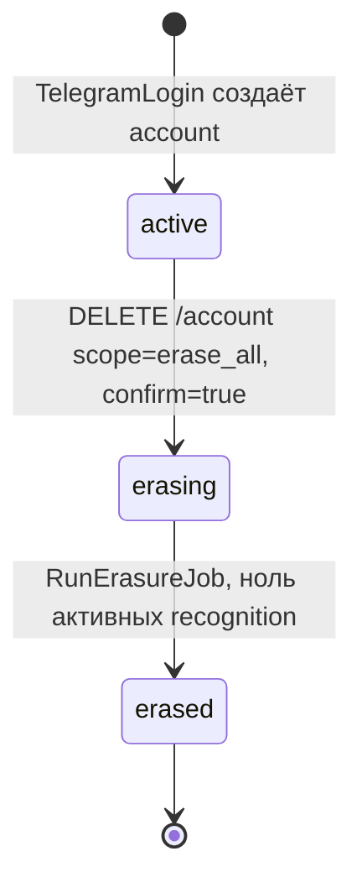

# Фича `consent-and-telegram-auth` — псевдокод

Логическая модель полей — из [`docs/Pseudocode.md`](../../Pseudocode.md) (Data Structures); здесь
она не переписывается. Алгоритмы ниже КОНКРЕТИЗИРУЮТ `TelegramLogin` и `ConsentAndErasure` того же
документа до уровня, достаточного для реализации, и не вводят ни одного нового логического поля.

## Data Structures

Фича не вводит НИ ОДНОЙ новой сущности. Она использует существующие поля `account` (канон §4 /
`Pseudocode.md` Data Structures): `telegram_user_id: string`, `tier: 'free'`,
`consent_version: string?`, `consent_text_hash: string?`, `consent_at: Timestamp?`,
`deletion_requested_at: Timestamp?`, `status: active / erasing / erased` — и, решением координатора
DEC-A-016 (2026-09-12), РАСШИРЯЕТ ДВЕ существующие сущности двумя логическими полями каждую (не
новая, 15-я сущность — изменение уже закрытых каноном `account` и `device_session`):

| Сущность | Новые поля (DEC-A-016) | Назначение |
|---|---|---|
| `account` | `last_telegram_auth_hash: string?`, `last_telegram_auth_at: Timestamp?` | защита от повтора `initData` ПОСЛЕ того, как аккаунт найден/создан (FR-consent-and-telegram-auth-3) |
| `device_session` | `last_telegram_auth_hash: string?`, `last_telegram_auth_at: Timestamp?` | та же защита ДО того, как аккаунт существует — первый вход этой сессии |

Отдельного поля «отозвано» (`consent_revoked_at`) НЕ заводится: решением DEC-A-016 отзыв
(`scope: 'withdraw_consent'`) обнуляет само `consent_at`, и он же остаётся единственным источником
истины «действует ли согласие сейчас» — второе поле удвоило бы этот факт (см.
`Algorithm: RevokeConsentOrErase` ниже, `01_specification.md` FR-consent-and-telegram-auth-7/8).

Решением координатора DEC-A-019 (2026-09-12, отменяет анонимное исключение попытки 2)
`device_session` РАСШИРЯЕТСЯ ЕЩЁ ТРЕМЯ полями — теми же тремя, что уже есть у `account`:
`consent_version: string?`, `consent_text_hash: string?`, `consent_at: Timestamp?`. Причина:
согласие на обработку данных о питании требуется ПЕРЕД ПЕРВОЙ записью дневника ДЛЯ ЛЮБОЙ сессии,
включая анонимную (ADR-009, SC-US-012-1 не делают исключения по типу сессии) — анонимный дневник до
входа существует, и NFR-SEC-002 «по умолчанию всё закрыто» относится к самому дневнику, а не к его
владельцу. При входе через Telegram эти три поля ПЕРЕНОСЯТСЯ с `device_session` на `account`
(`TelegramLogin`, новый шаг), а не запрашиваются заново.

Список известных версий текста согласия (для `422` в `POST /consent`) — КОД-ВЛАДЕЕМЫЙ закрытый
список версий (`honest-configuration.md` CFG-I8: множество версий не приходит из окружения), физически
— массив констант в `packages/shared/src/consent/known-versions.ts`; первая версия при запуске
фичи — `'2026-09-v1'`. Хэш текста (`consent_text_hash`) — SHA-256 от байтов канонического текста
версии, вычисленный на СЕРВЕРЕ по присланной `consent_version` (не принимается от клиента как
самостоятельное недоверенное значение) — `consent_text_hash` в запросе `POST /consent` СВЕРЯЕТСЯ с
вычисленным сервером хэшем этой версии; расхождение — тот же `422`, что и неизвестная версия
(«согласие на неизвестный текст не является согласием» распространяется и на подмену текста).

## Core Algorithms

### Algorithm: VerifyTelegramInitData

REQUIREMENT: `FR-consent-and-telegram-auth-1`
REQUIREMENT: `NFR-consent-and-telegram-auth-1`
REQUIREMENT: `AC-consent-and-telegram-auth-2`
REQUIREMENT: `AC-consent-and-telegram-auth-3`
REQUIREMENT: `AC-consent-and-telegram-auth-4`
REQUIREMENT: `AC-consent-and-telegram-auth-7`
REALISES: SC-US-013-2, AC-consent-and-telegram-auth-2, AC-consent-and-telegram-auth-3, AC-consent-and-telegram-auth-4, AC-consent-and-telegram-auth-7

Note on `FR-consent-and-telegram-auth-3` / `AC-consent-and-telegram-auth-5` (DEC-A-016): этот
алгоритм проверяет ТОЛЬКО подлинность и свежесть и ВОЗВРАЩАЕТ `hash` вызывающему; сама сверка на
повтор (сравнение с `last_telegram_auth_hash`/`last_telegram_auth_at` на `account` или
`device_session`, отказ `401 initdata_replayed`) выполняется В `TelegramLogin` шаг 2, ПОСЛЕ этого
алгоритма — порядок обязателен: без подтверждённой подписи сверять повтор нечего.
INPUT: сырая строка `init_data` (тело запроса, поле `init_data`, ДО любого `JSON.parse` этой
строки), значение `TELEGRAM_BOT_TOKEN`.
OUTPUT: `{ ok: true, telegram_user_id, auth_date, hash }` (`hash` — присланное значение поля, ВОЗВРАЩАЕТСЯ вызывающему для сверки на повтор, DEC-A-016) либо `{ ok: false, reason: 'missing' | 'signature' | 'stale' }`.
STEPS:
1. IF `init_data` отсутствует или после `trim()` пустая строка THEN RETURN `{ ok: false, reason: 'missing' }` НЕМЕДЛЕННО — это ошибка ввода (`422` у вызывающего маршрута), а не отказ проверки подлинности (`401`); различие обязано остаться видимым в коде причины (AC-consent-and-telegram-auth-7).
2. Разобрать `init_data` как query-string (`URLSearchParams`) БЕЗ разбора значения поля `user` в объект — оно остаётся СТРОКОЙ на этом шаге. Извлечь поле `hash`, удалить его из набора пар.
3. Собрать «строку проверки» (`data-check-string`): оставшиеся пары `key=value`, отсортированные по ключу лексикографически, соединённые `\n` — байт в байт, без повторной сериализации значений. Строка проверки — это то, что реально пришло, а не то, во что его потом разберут.
4. Вычислить `secret_key = HMAC-SHA256(key="WebAppData", data=TELEGRAM_BOT_TOKEN)`.
5. Вычислить `computed_hash = HMAC-SHA256(key=secret_key, data=data_check_string)` в шестнадцатеричном виде.
6. Сравнить `computed_hash` и присланный `hash` функцией СРАВНЕНИЯ ПОСТОЯННОГО ВРЕМЕНИ (`crypto.timingSafeEqual` на буферах равной длины; разная длина — тоже `false`, без раннего `return`, сравнение всё равно выполняется на буфере паддинга, чтобы не создавать боковой канал по длине).
7. IF `computed_hash` не совпал THEN перейти к шагу 9 с `reason = 'signature'` — НЕ возвращать `401` здесь: единственная точка возврата обязана быть ниже (NFR-consent-and-telegram-auth-1, AC-consent-and-telegram-auth-4).
8. IF подпись совпала THEN распарсить поле `auth_date` (unix-время) из уже проверенной строки проверки; вычислить `age = now() - auth_date`. IF `age > 24 часа` THEN перейти к шагу 9 с `reason = 'stale'`. ELSE перейти к шагу 10.
9. RETURN `{ ok: false, reason }` — ОДНА точка возврата для обеих причин отказа; вызывающий код (`TelegramLogin`) обязан превращать ОБЕ причины в ОДИН и тот же `401` без различимой по времени или по телу ответа ветки.
10. Только теперь разобрать поле `user` (JSON-строка внутри значения) и вернуть `{ ok: true, telegram_user_id: user.id, auth_date, hash }`.
COMPLEXITY: O(n) по числу пар `init_data`, одна сортировка.

### Algorithm: TelegramLogin (реализация проектного алгоритма)

REQUIREMENT: `FR-consent-and-telegram-auth-2`
REQUIREMENT: `FR-consent-and-telegram-auth-3`
REQUIREMENT: `AC-consent-and-telegram-auth-1`
REQUIREMENT: `AC-consent-and-telegram-auth-5`
REQUIREMENT: `AC-consent-and-telegram-auth-6`
REQUIREMENT: `AC-consent-and-telegram-auth-20`
REALISES: SC-US-013-1, AC-consent-and-telegram-auth-1, AC-consent-and-telegram-auth-5, AC-consent-and-telegram-auth-6, AC-consent-and-telegram-auth-20
INPUT: сырые байты `init_data`, текущая `device_session`.
OUTPUT: `{ account_id, migrated_entries }` с установкой cookie, либо `401`/`422` (см.
`VerifyTelegramInitData`), либо `401 initdata_replayed` (DEC-A-016).
STEPS:
1. Вызвать `VerifyTelegramInitData`. IF `{ ok: false, reason: 'missing' }` THEN RETURN `422`. IF `{ ok: false, reason: 'signature' | 'stale' }` THEN RETURN `401` — единая ветка (`Pseudocode.md` `TelegramLogin` шаги 1-5, `NFR-consent-and-telegram-auth-1`).
2. **Защита от повтора (DEC-A-016).** Вычислить `replay_hash = sha256(hash)` от подтверждённого `hash` шага 1. Открыть ОДНУ транзакцию. `SELECT id, status, last_telegram_auth_hash, last_telegram_auth_at FROM account WHERE telegram_user_id = :id FOR UPDATE`. IF строка найдена (аккаунт уже существует) THEN сверить `last_telegram_auth_hash = replay_hash AND now() - last_telegram_auth_at < 24 часа`. IF не найдена (первый вход этого `telegram_user_id`) THEN сверить ТЕ ЖЕ два поля на ТЕКУЩЕЙ `device_session`. IF совпадение найдено THEN откатить транзакцию и RETURN `401 initdata_replayed` — ни аккаунт, ни сессия, ни дневник не меняются.
3. IF аккаунт найден (шаг 2) И `status != 'erased'` THEN использовать его. IF не найден ИЛИ `status = 'erased'` THEN `INSERT INTO account (telegram_user_id, tier, status) VALUES (:id, 'free', 'active') ON CONFLICT (telegram_user_id) WHERE status != 'erased' DO NOTHING RETURNING id` — удалённый аккаунт НЕ переиспользуется, создаётся НОВАЯ строка с НОВЫМ `id` (AC-consent-and-telegram-auth-20). **Гонка двух параллельных первых входов (VC-03):** `ON CONFLICT` — обязательная форма, не `INSERT` без него: два потока с одним `telegram_user_id`, оба не нашедшие строку на шаге 2 (частичный уникальный индекс `03_architecture.md`), обязаны сойтись на ОДНОЙ строке. IF `INSERT` вернул пустой результат (конфликт — строку уже вставил параллельный поток) THEN повторить `SELECT … FOR UPDATE` шага 2 (теперь строка существует и лок сериализует относительно выигравшего потока) и СРАВНИТЬ найденную `last_telegram_auth_hash` с ТЕКУЩИМ `replay_hash`: IF равны (это тот же самый `initData`, которым конкурент только что выиграл гонку) THEN RETURN `401 initdata_replayed` — а не использовать чужую победу как свой успешный вход; IF `last_telegram_auth_hash` пуст ИЛИ отличается THEN использовать найденную строку как обычно (это другой, легитимный `initData` того же `telegram_user_id`, а не повтор).
4. `UPDATE device_session SET account_id = :account_id WHERE id = :session_id` — сессия СВЯЗЫВАЕТСЯ, не заменяется; cookie остаётся тем же значением.
5. `UPDATE diary_entry SET owner_key = :account_id WHERE owner_key = :session_id` в ТОЙ ЖЕ транзакции; количество затронутых строк — это `migrated_entries`. Перенос ДОБАВЛЯЕТ к записям, уже перенесённым с других сессий того же аккаунта на прошлых входах (AC-consent-and-telegram-auth-6) — оператор `UPDATE` по предикату `owner_key = :session_id` не трогает строки, уже принадлежащие аккаунту, поэтому повторный вход того же устройства даёт `migrated_entries = 0` без явной проверки «уже перенесено».
6. **Перенос согласия (DEC-A-019).** IF `account.consent_at IS NULL` (у аккаунта своего согласия ещё нет) AND `device_session.consent_at IS NOT NULL` (анонимная сессия уже согласилась ДО входа) THEN `UPDATE account SET consent_version = device_session.consent_version, consent_text_hash = device_session.consent_text_hash, consent_at = device_session.consent_at WHERE id = :account_id` — согласие переносится, а не запрашивается заново; поля `device_session` НЕ обнуляются (исторический факт остаётся читаемым на сессии). IF у аккаунта УЖЕ есть своё `consent_at` (согласие давалось раньше, с другого устройства) THEN оставить его без изменений — согласие аккаунта не понижается анонимным состоянием текущей сессии.
7. `UPDATE account SET last_telegram_auth_hash = :replay_hash, last_telegram_auth_at = now() WHERE id = :account_id` — записывается на АККАУНТ во ВСЕХ случаях, достигших этого шага (аккаунт к этому моменту всегда существует, найден на шаге 3 или создан там же); поля `device_session`, использованные для сверки на шаге 2 ДО существования аккаунта, для записи повторно не используются — после первого успешного входа сверка идёт только по `account`.
8. Зафиксировать транзакцию. RETURN `200 { account_id, migrated_entries }` с `Set-Cookie` (то же значение cookie сессии — новый токен не выпускается, входа без существующей device_session в этом продукте нет: `CreateDeviceSession` вызывается раньше `TelegramLogin` на любом первом запросе).
9. Сбой на любом шаге 2-7 откатывает транзакцию ЦЕЛИКОМ: ни аккаунт, ни связывание, ни перенос дневника, ни перенос согласия, ни отметка последнего использования не сохраняются частично (FR-consent-and-telegram-auth-2 «частичный перенос запрещён»).
COMPLEXITY: O(1) на аккаунт/сессию плюс O(m) на перенос m записей дневника — то же, что и в проектном алгоритме.

### Algorithm: GrantOrDeclineConsent

REQUIREMENT: `FR-consent-and-telegram-auth-5`
REQUIREMENT: `FR-consent-and-telegram-auth-6`
REQUIREMENT: `AC-consent-and-telegram-auth-8`
REQUIREMENT: `AC-consent-and-telegram-auth-9`
REQUIREMENT: `AC-consent-and-telegram-auth-10`
REALISES: SC-US-012-1, AC-consent-and-telegram-auth-8, AC-consent-and-telegram-auth-9, AC-consent-and-telegram-auth-10
INPUT: `{ decision: 'grant' | 'decline', consent_version, consent_text_hash }`, владелец — `account`,
ЕСЛИ сессия связана, ИНАЧЕ `device_session` (DEC-A-019: анонимного исключения нет, маршрут работает
на cookie сессии независимо от того, есть ли у неё аккаунт).
OUTPUT: `{ decision, consent_version, recorded_at }` либо `422`.
STEPS:
1. Разрешить владельца: `account`, если `device_session.account_id IS NOT NULL`, иначе сама
   `device_session`. Целевая таблица для записи (шаги 2-3) — ТА, что разрешена здесь.
2. IF `decision = 'grant'` THEN: IF `consent_version` НЕ входит в код-владеемый список известных версий THEN RETURN `422`. IF вычисленный сервером `sha256(текст версии)` НЕ равен присланному `consent_text_hash` THEN RETURN `422` — тот же код, что и неизвестная версия: согласие на чужой текст не является согласием.
3. `UPDATE {account | device_session} SET consent_version = :v, consent_text_hash = :h, consent_at = now() WHERE id = :owner_id`. RETURN `200 { decision: 'grant', consent_version, recorded_at: consent_at }`.
4. IF `decision = 'decline'` THEN записать событие отказа в аудит (владелец, версия текста, время) БЕЗ изменения `consent_at` — отказ не требует своего поля: отсутствие `consent_at` уже И ЕСТЬ состояние «согласия нет», а запись в аудит нужна только для доказательства, что экран был показан и отказ осознан (`ConsentAndErasure` шаг 2). RETURN `200 { decision: 'decline', consent_version, recorded_at: now() }`.
5. Ни в одной ветке шаг 2-4 не создаёт и не удаляет `diary_entry`: съёмка и результат остаются доступны независимо от решения (FR-consent-and-telegram-auth-6).
COMPLEXITY: O(1).

### Algorithm: EnforceConsentBeforeDiaryWrite

REQUIREMENT: `FR-consent-and-telegram-auth-7`
REQUIREMENT: `AC-consent-and-telegram-auth-11`
REALISES: AC-consent-and-telegram-auth-11
INPUT: владелец (`owner_key`), попытка создать/подтвердить `diary_entry` ИЛИ создать `share_card`
(вызывается ОБОИМИ путями `scan-pipeline` — маршрут дневника и маршрут 5 `POST /api/v1/share-cards`,
где канон уже резервирует `403 consent_required`).
OUTPUT: `granted` либо `refused('consent_required')` (HTTP `403`).
STEPS:
1. **Исключения для анонимной сессии НЕТ (DEC-A-019, отменяет анонимное исключение попытки 2).**
   Разрешить владельца: `account`, если `owner_key`/`device_session.account_id` указывает на
   связанный аккаунт, ИНАЧЕ сама `device_session` — та же таблица, что читает и пишет
   `GrantOrDeclineConsent`. Согласие проверяется ДЛЯ ЛЮБОГО владельца, анонимного или нет: ADR-009 и
   SC-US-012-1 требуют согласия перед первой записью дневника без исключения по типу сессии, а
   7-суточный срок анонимного дневника (`FR-AUTH-001`) — это срок ХРАНЕНИЯ уже согласованных данных,
   не замена самого согласия.
2. IF `consent_at IS NULL` У РАЗРЕШЁННОГО владельца THEN RETURN `refused('consent_required')` —
   недоступность строки (сбой чтения `account` ИЛИ `device_session`) трактуется ТАК ЖЕ, как
   отсутствие согласия: недоступность источника истины — отказ, а не пропуск
   (`fail-closed-defaults.md`).
3. Решением DEC-A-016 шаг 2 ОДИНАКОВО покрывает ОБА случая для аккаунта: согласие никогда не
   давалось И согласие было отозвано (`RevokeConsentOrErase` со `scope: 'withdraw_consent'` обнуляет
   `account.consent_at`). Для анонимной `device_session` отзыва не существует (маршрут 13 требует
   `Authorization: Bearer <token>`, то есть только вошедших) — там `consent_at IS NULL` означает
   ровно «согласие ещё не давалось».
4. ELSE RETURN `granted`.
COMPLEXITY: O(1), один индексный поиск по `account.id` либо `device_session.id`.

### Algorithm: RevokeConsentOrErase

REQUIREMENT: `FR-consent-and-telegram-auth-8`
REQUIREMENT: `FR-consent-and-telegram-auth-9`
REQUIREMENT: `AC-consent-and-telegram-auth-12`
REQUIREMENT: `AC-consent-and-telegram-auth-13`
REQUIREMENT: `AC-consent-and-telegram-auth-14`
REQUIREMENT: `AC-consent-and-telegram-auth-17`
REALISES: SC-US-012-2, AC-consent-and-telegram-auth-12, AC-consent-and-telegram-auth-13, AC-consent-and-telegram-auth-14, AC-consent-and-telegram-auth-17
INPUT: `{ confirm: true, scope: 'withdraw_consent' | 'erase_all' }`, владелец (аккаунт — маршрут
требует `Authorization: Bearer <token>`, канон, следовательно только вошедшие пользователи).
OUTPUT: `{ accepted: true, cards_revoked_at, erase_deadline }` либо `422`/`409`.
STEPS:
1. IF `confirm != true` THEN RETURN `422` — ни одна ветка ниже не выполняется (AC-consent-and-telegram-auth-17).
2. `UPDATE share_card SET revoked_at = now() WHERE owner_key = :account_id AND revoked_at IS NULL RETURNING id` — выполняется ОБОИМИ значениями `scope`: и `withdraw_consent`, и `erase_all` немедленно закрывают публикацию (шаг общий для обеих веток канона: FR-GROWTH-006 требует закрытия карточек при отзыве согласия, а `erase_all` логически включает отзыв). `cards_revoked_at = now()`.
3. IF `scope = 'withdraw_consent'` THEN, В ТОЙ ЖЕ транзакции, `UPDATE account SET consent_at = NULL WHERE id = :account_id` (DEC-A-016) — `consent_version`/`consent_text_hash` НЕ стираются (исторический факт, каким текстом когда-то согласились, сохраняется), обнуляется только `consent_at`, единственное поле, которое читает `EnforceConsentBeforeDiaryWrite`. RETURN `200 { accepted: true, cards_revoked_at, erase_deadline: null }`. Строки `diary_entry` и `share_card`, созданные ДО отзыва, НЕ удаляются; ЛЮБАЯ попытка создать НОВУЮ `diary_entry` или `share_card` ПОСЛЕ этого момента получает `403 consent_required` через ту же границу, что и «согласие никогда не давалось» (см. `EnforceConsentBeforeDiaryWrite` — она не различает эти два случая, и не обязана: оба читаются как «`consent_at IS NULL` сейчас»).
4. IF `scope = 'erase_all'` THEN: `SELECT status FROM account WHERE id = :account_id FOR UPDATE`. IF `status = 'erasing'` THEN откатить шаг 2 (карточки, закрытые ЭТИМ вызовом, остаются закрытыми — закрытие необратимо и это не ошибка; но новую строку в очередь удаления не ставить) и RETURN `409` БЕЗ изменения `deletion_requested_at`.
5. IF `status = 'active'` THEN `UPDATE account SET status = 'erasing', deletion_requested_at = now() WHERE id = :account_id`. Зафиксировать транзакцию (шаги 2, 4-5 — одна транзакция). `erase_deadline = deletion_requested_at + 72 часа`. RETURN `200 { accepted: true, cards_revoked_at, erase_deadline }`.
6. Ответ синхронный: опроса состояния отдельным маршрутом канон не предусматривает (§5, ровно 14 маршрутов); дальнейшая судьба удаления не наблюдаема владельцем — после `erase_all` его сессия перестаёт что-либо получать в ответ на будущие запросы, кроме тех, что не требуют аккаунта.
COMPLEXITY: O(k) по числу карточек владельца плюс O(1) на переход статуса.

### Algorithm: ValidateTelegramBotTokenFormat

REQUIREMENT: `FR-consent-and-telegram-auth-4`
REQUIREMENT: `AC-consent-and-telegram-auth-19`
REALISES: AC-consent-and-telegram-auth-19
INPUT: `TELEGRAM_BOT_TOKEN` из `RuntimeConfig` (уже прошедшее compose-уровневую проверку на
отсутствие/пустоту — `${TELEGRAM_BOT_TOKEN:?…}`, `foundation`).
OUTPUT: `ok` либо отказ старта процесса `api`.
STEPS:
1. Сверить значение с регулярным выражением формата Bot API токена: `^[0-9]+:[A-Za-z0-9_-]{35}$`.
2. IF не совпало THEN вызвать тот же путь отказа старта, что и `ValidateRuntimeConfig`
   (`foundation`): процесс завершается ненулевым кодом ДО открытия сокета, в `stderr` — имя
   переменной `TELEGRAM_BOT_TOKEN` и причина «токен бота имеет неверный формат». Не бросать
   необработанное исключение из первого вычисления HMAC внутри `VerifyTelegramInitData` — к этому
   моменту процесс уже не должен был запуститься.
3. Вызывается ОДИН раз, в `bootstrap.ts`, ДО регистрации маршрутов.
COMPLEXITY: O(1).

### Algorithm: GuardExternalTransferWithoutConsent

REQUIREMENT: `FR-consent-and-telegram-auth-12`
REQUIREMENT: `AC-consent-and-telegram-auth-18`
REALISES: AC-consent-and-telegram-auth-18
INPUT: владелец, попытка передать записи его дневника во внешний канал (публикация, экспорт, будущий
дайджест — вызывающий код называет намерение явно, эта функция не угадывает его по контексту).
OUTPUT: `granted` либо `refused('no_consent')` с записью в аудит.
STEPS:
1. Найти `account` владельца. IF не найден ИЛИ `account.consent_at IS NULL` THEN записать в аудит
   `{ owner, attempted_channel, reason: 'no_consent', at: now() }` — БЕЗ содержимого записей
   дневника, только факт попытки — и RETURN `refused('no_consent')`.
2. Недоступность строки `account` при проверке (ошибка чтения БД) трактуется ТАК ЖЕ, как отсутствие
   согласия — шаг 1 срабатывает на любую невозможность подтвердить `consent_at IS NOT NULL`, а не
   только на явный `NULL` (`fail-closed-defaults.md`: недоступность источника истины — отказ).
3. ELSE RETURN `granted`. Вызывающий код передаёт данные только после `granted`; частичная передача
   ДО получения `granted` не производится ни в одной ветке.
COMPLEXITY: O(1).

### Algorithm: RenderConsentAndAuthScreens (клиент, `apps/web`)

REQUIREMENT: `FR-consent-and-telegram-auth-13`
REALISES: — (UI-only; серверная логика, которую эти экраны вызывают, описана алгоритмами выше)
INPUT: состояние сессии (анонимная / связана с аккаунтом), результат распознавания (для момента
показа экрана согласия), запрос пользователя на удаление.
OUTPUT: отрисованные экраны, вызовы соответствующих маршрутов.
STEPS:
1. Кнопка «Войти через Telegram»: в PWA — видимая кнопка на экране результата/настроек, по нажатию
   открывает `t.me`-ссылку бота; в TMA — вызывается автоматически при монтировании корневого
   компонента, ЕСЛИ `WebApp.initData` непусто И текущая сессия ещё анонимна (`device_session.account_id IS NULL`), без действия пользователя. Результат — вызов `POST /api/v1/auth/telegram` (`TelegramLogin`).
2. Экран согласия показывается ПОСЛЕ подтверждения ПЕРВОГО результата распознавания и ПЕРЕД первой
   попыткой сохранить запись дневника — НЕ до первого скана: камера остаётся первым экраном продукта
   (FR-CAPTURE-001 этой фичей не переопределяется). Решение пользователя вызывает
   `GrantOrDeclineConsent`.
3. Экран «удалить мои данные» в настройках — ДВЕ раздельные кнопки с разным текстом объяснения:
   «отозвать согласие» (вызывает `RevokeConsentOrErase` со `scope: 'withdraw_consent'`, текст
   объясняет «закроет ваши карточки сейчас, дневник останется») и «удалить всё» (`scope: 'erase_all'`,
   текст объясняет «удалит аккаунт и все данные в течение 72 часов, действие необратимо») —
   разные тексты не дают спутать необратимое действие с обратимым.
4. Ни один экран не содержит цены, тарифа или платёжной формы — в неделе их не существует
   (PD-PRICE-001, унаследовано из проектной канвы, не переопределяется этой фичей).
COMPLEXITY: O(1), чистое представление состояния без собственной бизнес-логики.

### Algorithm: RunErasureJob

REQUIREMENT: `FR-consent-and-telegram-auth-10`
REQUIREMENT: `FR-consent-and-telegram-auth-11`
REQUIREMENT: `NFR-consent-and-telegram-auth-2`
REQUIREMENT: `AC-consent-and-telegram-auth-15`
REQUIREMENT: `AC-consent-and-telegram-auth-16`
REALISES: SC-US-012-2, AC-consent-and-telegram-auth-15, AC-consent-and-telegram-auth-16
INPUT: батч `account` с `status = 'erasing'` (планировщик — раз в час, как `PurgeExpiredPhotos` раз в
сутки, но чаще: дедлайн 72 ч допускает часовое разрешение без риска просрочки).
OUTPUT: `account.status = 'erased'` для завершённых; необработанные остаются `erasing` до следующего
прогона.
STEPS:
1. Выбрать батч `account WHERE status = 'erasing'`, ограниченным размером (расход управляется нашим кодом, как в `PurgeExpiredPhotos`).
2. FOR EACH аккаунт: `SELECT id, status FROM recognition WHERE account_id = :id AND status = 'queued'`. IF есть хотя бы одна строка THEN ПРОПУСТИТЬ этот аккаунт в этом прогоне (не ошибка, не откат остальных аккаунтов батча) — попытка уже оплачена (FR-consent-and-telegram-auth-11) и обязана дойти до терминального статуса ДО удаления её строки; следующий прогон (в пределах часа) повторит проверку.
3. ELSE (нет активных сканов) выполнить в ОДНОЙ транзакции: `DELETE FROM diary_entry WHERE owner_key = :account_id`; `DELETE FROM recognition WHERE account_id = :account_id`; `DELETE FROM share_card WHERE owner_key = :account_id` (уже `revoked_at IS NOT NULL` с момента запроса — физическое удаление строки здесь довершает то, что API уже закрыло логически); для каждого затронутого `recognition`/`share_card` — пометить связанные `photo.file_state = 'purged'` и удалить объекты из бакета (отсутствие объекта — тоже успех, как в `PurgeExpiredPhotos`); `UPDATE device_session SET account_id = NULL WHERE account_id = :account_id` (сессия не удаляется — она не хранит данных о питании); `UPDATE account SET status = 'erased' WHERE id = :account_id`.
4. Записать в аудит БЕЗ персональных данных: `{ account_id, deleted_diary_entries, deleted_recognitions, deleted_cards, completed_at }` — числа, не содержимое.
5. Задача идемпотентна: повторный запуск на аккаунте со `status = 'erased'` не находит строк ни в одной из таблиц шага 3 (пусто — не ошибка) и не изменяет `status` (уже терминальный).
6. `attribution` и `growth_event` НЕ упоминаются НИ В ОДНОМ шаге: они привязаны к `device_session_id`, не к `account_id`, не содержат данных о питании, и удаление аккаунта их не касается (см. `01_specification.md` FR-consent-and-telegram-auth-10).
COMPLEXITY: O(m) по объёму данных владельца, как и в проектном алгоритме; O(1) проверка активного скана на аккаунт.

## API Contracts

Три маршрута канона (§5, `Pseudocode.md` таблица маршрутов, строки 9, 12, 13) — заголовки,
аутентификация и формы ответа НЕ переопределяются здесь, они уже зафиксированы проектным
`Pseudocode.md`. Ниже — только уточнение полей ошибок, которых проектная таблица не разворачивала:

| # | Маршрут | Уточнение отказов этой фичи |
|---|---|---|
| 9 | `POST /api/v1/auth/telegram` | `422 { error: { code: 'missing_init_data' } }` — ДО HMAC (AC-consent-and-telegram-auth-7); `401` без `code` в теле — не раскрывать, какая из двух проверок провалилась (NFR-consent-and-telegram-auth-1) |
| 12 | `POST /api/v1/consent` | `422 { error: { code: 'unknown_consent_version' } }` — и для неизвестной версии, и для несовпавшего хэша, ОДИН код: обе причины означают «согласие на этот текст не подтверждено» |
| 13 | `DELETE /api/v1/account` | `409 { error: { code: 'erasure_already_running' } }`; `erase_deadline` в успешном ответе — ISO-8601, `deletion_requested_at + 72h` |

## State Transitions

Набор ЗАКРЫТ каноном (`Pseudocode.md` Data Structures, поле `account.status`): ровно три значения.
Из `erased` возврата нет — повторный вход тем же `telegram_user_id` создаёт НОВУЮ строку `account`
(`TelegramLogin` шаг 2), а не воскрешает старую. Переход `erasing → active` НЕ существует: запрос на
удаление необратим с момента подтверждения (`confirm: true`), это осознанная граница, не забытая
дуга — отмена удаления в неделю не входит.

## Error Handling Strategy

| Категория | Наблюдаемый признак | Ответ системы | Списывается ли попытка / что происходит с данными |
|---|---|---|---|
| Пустой `init_data` | поле отсутствует или пусто после `trim` | `422 missing_init_data`, HMAC не вычисляется | ничего не создано |
| Подделка подписи | HMAC не совпал при сравнении постоянного времени | `401`, аккаунт не создан, сессия не выдана | ничего не создано, ничего не залогировано из полезной нагрузки |
| Просроченный `auth_date` | подпись верна, `age > 24 ч` | `401`, та же ветка, что и подделка | ничего не создано |
| Повтор той же `initData` в пределах 24 ч (DEC-A-016) | `hash` совпадает с `last_telegram_auth_hash` на `account`/`device_session`, `now() - last_telegram_auth_at < 24 ч` | `401 initdata_replayed` | ничего не изменено; НОВЫЙ `hash` того же `telegram_user_id` обрабатывается как обычный вход |
| Неизвестная версия/хэш согласия | `consent_version` вне списка ИЛИ хэш не совпал | `422 unknown_consent_version` | `account.consent_at` не изменяется |
| Запись дневника или карточки без согласия (никогда не давалось ИЛИ отозвано, DEC-A-016) | `account.consent_at IS NULL` | `403 consent_required` на границе фичи | `diary_entry`/`share_card` не создаётся; съёмка и результат доступны |
| Повторный `erase_all` во время `erasing` | `account.status = 'erasing'` | `409 erasure_already_running` | `deletion_requested_at`/`erase_deadline` не меняются |
| `erase_all` без `confirm` | тело без `confirm: true` | `422` | `account.status` не меняется |
| Активный скан на момент удаления | `recognition.status = 'queued'` для аккаунта | аккаунт пропускается в текущем прогоне `RunErasureJob` | удаление откладывается до следующего часового прогона, попытка не теряется |
| Недоступность строки `account` при проверке согласия | ошибка чтения БД | трактуется как ОТСУТСТВИЕ согласия — `refused('consent_required')` | запись дневника не создаётся; недоступность источника истины — отказ, не пропуск |
| Повторный вход после `erased` | `account.status = 'erased'` найден по `telegram_user_id` | создаётся НОВЫЙ `account`, прежний не восстанавливается | старые данные не читаются: они физически удалены |

## Scenario Coverage

Scenarios in 01_specification.md: 4 · claimed by an algorithm: 4

Это приёмочные сценарии ПРОЕКТА (`SC-US-nnn-k`), унаследованные фичей и перечисленные в
`01_specification.md`, раздел «Наследуемые сценарии приёмки проекта». Критерии приёмки самой фичи
(`AC-consent-and-telegram-auth-n`) проходят по машинным ключам `REQUIREMENT:` и в этот счёт не
входят.

Not claimed by any algorithm:
| Scenario | Reason |
|---|---|
| none | none |

Claimed by an algorithm but absent from 01_specification.md:
| Algorithm | Claimed ID |
|---|---|
| none | none |

AC-consent-and-telegram-auth-5 (повтор `initData`) РЕАЛИЗУЕТСЯ решением DEC-A-016: `TelegramLogin`
шаг 2 отклоняет повтор ТОГО ЖЕ `hash` в пределах 24 ч `401 initdata_replayed`, сверяясь с
`last_telegram_auth_hash`/`last_telegram_auth_at` на `account` (аккаунт уже существует) или на
`device_session` (первый вход). `tests/integration/initdata-replay.test.ts` и
`tests/concurrency/initdata-replay-parallel.test.ts` — ОБЯЗАТЕЛЬНЫЕ тесты Phase 3, не опциональные:
без них критерий не закрыт.
FR-consent-and-telegram-auth-13 (экраны: кнопка входа, экран согласия, экран удаления) реализуются
`apps/web` без отдельного серверного алгоритма — `reason: ui-only` в терминах
`sparc-prd-mini` (см. `03_architecture.md`); это FR, а не AC — у фичи нет AC с этим номером,
относящегося к экранам (`AC-consent-and-telegram-auth-13` — отдельный критерий про `erase_all`, см.
`01_specification.md`).
