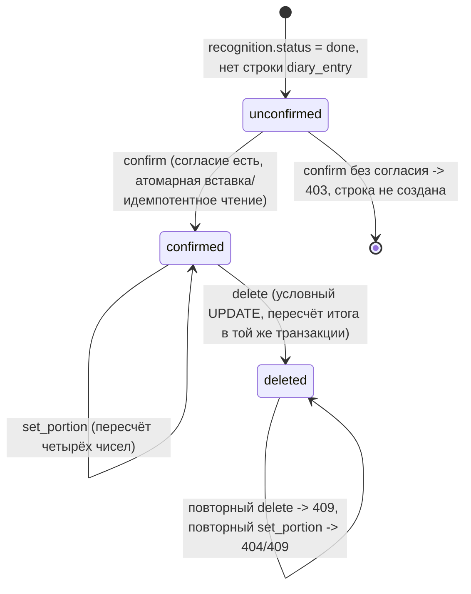

# Фича `diary-and-streak` — псевдокод

Имена сущностей и полей — из [`docs/canon.md`](../../canon.md) и корневого
[`docs/Pseudocode.md`](../../Pseudocode.md) (Data Structures, `diary_entry`), здесь не переписываются.
Фича не вводит новых таблиц; единственное схемное изменение — уникальность, без которой конкурентное
подтверждение (`FR-diary-and-streak-1`) не может быть атомарным.

## Data Structures — единственное схемное изменение

`diary_entry.recognition_id` уже `NOT NULL REFERENCES recognition(id)` (`001_init.sql`), но БЕЗ
уникальности: два конкурентных `INSERT` для одного `recognition_id` сегодня создали бы ДВЕ строки.
Миграция добавляет:

```sql
ALTER TABLE diary_entry ADD CONSTRAINT diary_entry_recognition_id_key UNIQUE (recognition_id);
```

Номер файла миграции определяется интеграционным владельцем ПРИ СЛИЯНИИ, а не этим планом: к моменту
реализации `diary-and-streak` перед ней в очереди стоит миграция `consent-and-telegram-auth`
(её `05_completion.md` называет её `002_erasure_index.sql`, но фактический номер будет пересчитан —
прецедент DEC-A-026, где такая же коллизия уже была разрешена переименованием). Здесь миграция
называется по смыслу `NNN_diary_entry_recognition_unique.sql`, а точный `NNN` подставляет Phase 3.

## Core Algorithms

### Algorithm: ConfirmDiaryEntry

REQUIREMENT: `FR-diary-and-streak-1`
REQUIREMENT: `FR-diary-and-streak-2`
REQUIREMENT: `AC-diary-and-streak-1`
REQUIREMENT: `AC-diary-and-streak-2`
REQUIREMENT: `AC-diary-and-streak-3`
REQUIREMENT: `AC-diary-and-streak-4`
REQUIREMENT: `AC-diary-and-streak-5`
REALISES: AC-diary-and-streak-1, AC-diary-and-streak-2, AC-diary-and-streak-3, AC-diary-and-streak-4, AC-diary-and-streak-5
INPUT: `recognition_id` (путь `{entry_id}` маршрута 11 при `op = 'confirm'`), сессия вызывающего.
OUTPUT: `{ entry, totals }` либо отказ `403` / `404` / `409`.
STEPS:
1. Вычислить `owner_key` вызывающего (аккаунт, если вход выполнен, иначе `device_session`).
2. Вызвать `EnforceConsentBeforeDiaryWrite(owner_key)` (импорт из `consent-and-telegram-auth`,
   `apps/api/src/consent/enforce-before-diary-write.ts`). IF отказ THEN RETURN `403
   consent_required` и НЕ читать `recognition` вовсе — граница ПЕРВАЯ, до любого чтения предметных
   данных (`security-operation-order`: согласие до записи).
3. Прочитать `recognition` по `id = recognition_id` И владению (`device_session_id`/`account_id`
   вызывающего). IF не найдена или чужая THEN RETURN `404` — оба случая ОДИН ответ, `403` здесь
   невозможен по построению (маршрут 11 никогда не подтверждает существование чужого ресурса).
4. IF `recognition.status ≠ 'done'` THEN RETURN `409` с причиной, отличной от согласия: неготовый
   результат нечего подтверждать.
5. Собрать поля новой строки из СНИМКА `recognition`: `items`, `kcal_total`, `protein_total`,
   `fat_total`, `carb_total`, `source_snapshot`. Определить `eaten_on` по `Europe/Moscow` (календарная
   дата, не момент времени) и `meal_slot` по времени суток.
6. Выполнить ОДИН оператор:
   `INSERT INTO diary_entry (owner_key, recognition_id, eaten_on, meal_slot, items, kcal_total,
   protein_total, fat_total, carb_total, source_snapshot, user_corrected)
   VALUES (…, false)
   ON CONFLICT (recognition_id) DO NOTHING RETURNING *`.
   «Прочитать, потом вставить» ЗАПРЕЩЕНО: между чтением и записью помещается конкурентный вызов, и
   обе реализации проходят последовательный тест — различает их только конкурентный прогон
   (`shared-resource-verification`).
7. IF оператор вернул строку THEN RETURN её как `entry` вместе с пересчитанным `totals` дня
   (`RecomputeDayTotals`, ниже).
8. IF оператор не вернул строку (конфликт — строка уже существует) THEN прочитать существующую по
   `recognition_id` и RETURN ЕЁ как `entry` с ТЕМИ же `totals` — повторный вызов идемпотентен, второй
   параллельный `confirm` не является ошибкой и не создаёт вторую строку.
COMPLEXITY: O(1) на вставку плюс O(m) на пересчёт итога дня (см. `RecomputeDayTotals`).

### Algorithm: SetDiaryEntryPortion

REQUIREMENT: `FR-diary-and-streak-3`
REQUIREMENT: `NFR-diary-and-streak-1`
REQUIREMENT: `AC-diary-and-streak-6`
REQUIREMENT: `AC-diary-and-streak-7`
REQUIREMENT: `AC-diary-and-streak-8`
REQUIREMENT: `AC-diary-and-streak-11`
REALISES: AC-diary-and-streak-6, AC-diary-and-streak-7, AC-diary-and-streak-8, AC-diary-and-streak-11
INPUT: `entry_id` (`diary_entry.id`), `index`, `mass_g`, сессия вызывающего.
OUTPUT: `{ entry, totals }` либо `404` / `422`.
STEPS:
1. Прочитать `diary_entry` по `id = entry_id` И `owner_key = owner_key(вызывающего)` И
   `deleted_at IS NULL`. IF не найдена (чужая, несуществующая ИЛИ уже удалённая — уже удалённая здесь
   трактуется как «не найдена для правки», а не отдельным кодом: правка мёртвой записи не отличима от
   правки чужой на этом шаге) THEN RETURN `404`. `403` этот маршрут не возвращает никогда.
2. Валидировать `index`: IF вне диапазона `items` THEN RETURN `422` без изменений.
3. Валидировать `mass_g`: целое ИЛИ приводимое к целому, `5 ≤ mass_g ≤ 2000`. IF не проходит (дробное,
   отрицательное, `0`, строка, `null`, вне диапазона) THEN RETURN `422 portion_out_of_range` с
   ПРЕЖНЕЙ порцией — ввод не принят частично.
4. Пересчитать позицию `index` по хранимому `source_snapshot` (`(mass_g/100) × значение_на_100г`) и
   пересчитать все четыре суммы записи. Живая таблица `food_item` НЕ читается (`FR-diary-and-streak-2`).
5. Выполнить условный `UPDATE diary_entry SET items = …, kcal_total = …, protein_total = …,
   fat_total = …, carb_total = …, user_corrected = true WHERE id = :id AND owner_key = :owner_key AND
   deleted_at IS NULL RETURNING *`. IF затронуто 0 строк THEN запись УДАЛЕНА КОНКУРЕНТНО между шагом 1
   и этим шагом — прочитать `deleted_at`: если он теперь установлен, RETURN `409` (уже удалена, а не
   «не найдена» — на шаге 1 она существовала); гонка разрешается в пользу удаления, а не воскрешения.
6. RETURN обновлённую запись и пересчитанный `totals` дня (`RecomputeDayTotals`), не позже 100 мс
   (p95).
COMPLEXITY: O(1) на позицию плюс O(m) на пересчёт итога дня.

### Algorithm: DeleteDiaryEntry

REQUIREMENT: `FR-diary-and-streak-4`
REQUIREMENT: `AC-diary-and-streak-9`
REQUIREMENT: `AC-diary-and-streak-10`
REQUIREMENT: `AC-diary-and-streak-17`
REALISES: AC-diary-and-streak-9, AC-diary-and-streak-10, AC-diary-and-streak-17
INPUT: `entry_id`, сессия вызывающего.
OUTPUT: `{ totals }` либо `404` / `409`.
STEPS:
1. В ОДНОЙ транзакции: условный `UPDATE diary_entry SET deleted_at = now() WHERE id = :id AND
   owner_key = :owner_key AND deleted_at IS NULL RETURNING id, eaten_on`.
2. IF затронута 1 строка THEN, В ТОЙ ЖЕ транзакции, пересчитать `totals` дня `RecomputeDayTotals` по
   `eaten_on` возвращённой строки и зафиксировать транзакцию — удаление и пересчёт видны АТОМАРНО:
   удалённая запись обязана исчезнуть из итога одновременно с исчезновением из списка
   (`deployment-seams`, стык модулей). RETURN пересчитанный `totals` не позже 100 мс (p95).
3. IF затронуто 0 строк THEN откатить транзакцию (пересчитывать нечего) и различить причину ВТОРЫМ
   чтением по `id` БЕЗ условия `owner_key` (только факт существования строки, без раскрытия
   содержимого): строка не существует ИЛИ принадлежит другому владельцу → `404`; строка существует,
   принадлежит вызывающему, но `deleted_at` уже установлен → `409`.
COMPLEXITY: O(1) на условную запись плюс O(m) на пересчёт при успехе.

### Algorithm: RecomputeDayTotals

REQUIREMENT: `FR-diary-and-streak-6`
REQUIREMENT: `AC-diary-and-streak-18`
REALISES: AC-diary-and-streak-18
INPUT: `owner_key`, `eaten_on`.
OUTPUT: `{ kcal, protein, fat, carb }`, `by_meal`.
STEPS:
1. `SELECT meal_slot, kcal_total, protein_total, fat_total, carb_total FROM diary_entry WHERE
   owner_key = :owner_key AND eaten_on = :eaten_on AND deleted_at IS NULL`.
2. Суммировать четыре колонки по всем строкам; сгруппировать те же строки по `meal_slot` для
   `by_meal`. ИСТОЧНИК СУММЫ — ТОЛЬКО персистированные колонки `diary_entry`; таблица `food_item` в
   этом алгоритме НЕ УЧАСТВУЕТ ни при каком условии (страж по исходнику, `04_refinement.md`:
   переимпорт базы не имеет права задним числом изменить уже показанное число).
3. RETURN суммы и разбивку. Пустой результат (день без записей) даёт нули по построению — это
   отличается от `.claude/rules/fail-closed-defaults.md` случая «неизмеримо»: здесь ноль записей
   действительно означает ноль калорий, а не «не измерено».
COMPLEXITY: O(m), m — число записей дня (ограничено практикой: не более нескольких десятков в сутки).

### Algorithm: GetDiaryDay

REQUIREMENT: `FR-diary-and-streak-5`
REQUIREMENT: `AC-diary-and-streak-12`
REQUIREMENT: `AC-diary-and-streak-13`
REQUIREMENT: `AC-diary-and-streak-14`
REALISES: AC-diary-and-streak-12, AC-diary-and-streak-13, AC-diary-and-streak-14
INPUT: `date` (строка запроса), сессия вызывающего.
OUTPUT: `{ date, entries[], totals, by_meal, streak }` либо `422`.
STEPS:
1. Разобрать `date` как календарную дату ISO. IF неразбираема, IF позже сегодняшнего дня по
   `Europe/Moscow`, IF вне разумного диапазона (раньше `2020-01-01`) THEN RETURN `422`. Пустая или
   непонятная строка НЕ заменяется «сегодня» (`fail-closed-defaults`).
2. `owner_key` — ТОЛЬКО из сессии вызывающего; в маршруте нет параметра «чей дневник», и попросить
   чужой дневник нечем (`security.md`, «Ответ на чужой ресурс» — здесь дефект был бы структурным, а
   не единичным отказом).
3. `SELECT * FROM diary_entry WHERE owner_key = :owner_key AND eaten_on = :date AND deleted_at IS
   NULL ORDER BY created_at` → `entries[]`. Вычислить `totals`/`by_meal` (`RecomputeDayTotals`).
4. Вызвать `ComputeSoftStreak(owner_key, сегодня по Europe/Moscow)`.
5. RETURN конверт `{ data: { date, entries, totals, by_meal, streak }, meta: { request_id,
   timezone: 'Europe/Moscow' } }`.
COMPLEXITY: O(m + d), m — записи дня, d ≤ 60 (стрик).

### Algorithm: ComputeSoftStreak

REQUIREMENT: `FR-diary-and-streak-7`
REQUIREMENT: `AC-diary-and-streak-15`
REQUIREMENT: `AC-diary-and-streak-16`
REALISES: AC-diary-and-streak-15, AC-diary-and-streak-16
INPUT: `owner_key`, сегодняшняя дата по `Europe/Moscow`.
OUTPUT: `{ days: int, frozen_days: Date[] }`.
STEPS:
1. `SELECT DISTINCT eaten_on FROM diary_entry WHERE owner_key = :owner_key AND deleted_at IS NULL AND
   eaten_on >= сегодня - 60 суток` → множество дат с хотя бы одной записью.
2. Идти НАЗАД от сегодняшнего дня, считая последовательные сутки; `days = 0`, `frozen_days = []`.
3. FOR EACH день, начиная с сегодня: IF есть запись THEN `days += 1`, продолжить. IF нет записи И
   предыдущий (более ранний) день ИМЕЕТ запись И это ПЕРВЫЙ пропуск подряд THEN не обрывать счёт,
   добавить день в `frozen_days`, продолжить (root `Pseudocode.md`, `ComputeSoftStreak` шаг 3: один
   пропуск стрик НЕ обнуляет). IF пропущены ДВА дня подряд THEN оборвать счёт на этом месте — если
   сегодня есть запись, итоговый `days` пересчитывается как НОВЫЙ счёт от сегодня (то есть `1`, если
   вчера и позавчера пропуски, а сегодня запись есть).
4. RETURN `{ days, frozen_days }`. Формулировка на экране, которую собирает вызывающий код, —
   нейтральная: без обратного отсчёта и без предупреждения о потере (FR-DIARY-002; механика избегания
   потери в продукте про еду легко превращается в давление).
COMPLEXITY: O(d), d ≤ 60.

## API Contracts

Оба маршрута объявлены каноном §5 и переиспользованы БЕЗ добавления новых.

```
PATCH /api/v1/diary/{entry_id}
  Cookie: session
  Content-Type: application/json
  Body: { op: 'confirm' } — entry_id ЗДЕСЬ есть recognition_id
      | { op: 'set_portion', index: int, mass_g: int } — entry_id есть diary_entry.id
      | { op: 'delete' } — entry_id есть diary_entry.id
  Response 200: { data: { entry, totals: { kcal, protein, fat, carb } }, meta: { request_id } }
  Response 403: { error: { code: 'consent_required', message } }   — ТОЛЬКО у confirm
  Response 404: { error: { code: 'not_found', message } }          — чужая/несуществующая, ОБА пространства id
  Response 409: { error: { code: 'not_done' | 'already_deleted', message } }
  Response 422: { error: { code: 'portion_out_of_range' | 'index_out_of_range', message, range?: [5, 2000] } }

GET /api/v1/diary?date=YYYY-MM-DD
  Cookie: session
  Response 200: { data: { date, entries: DiaryEntry[], totals, by_meal, streak: { days, frozen_days } },
                  meta: { request_id, timezone: 'Europe/Moscow' } }
  Response 422: { error: { code: 'invalid_date', message } }
```

## State Transitions



## Error Handling Strategy

| Категория | Пример | Ответ и действие |
|---|---|---|
| согласие не дано | `confirm` без `consent_at` | `403 consent_required`; `recognition` не читается вовсе |
| скан не готов | `confirm` на `queued`/`failed`/`refused` | `409`; строка не создаётся |
| чужой/несуществующий ресурс | любое из трёх операций | `404` в ОБОИХ пространствах id; `403` на этом маршруте не возникает |
| граница входа | порция/индекс вне диапазона | `422` с сохранением прежнего значения; частичное принятие запрещено |
| гонка confirm×confirm | `ON CONFLICT (recognition_id)` | вторая попытка читает и возвращает уже созданную строку, не ошибку |
| гонка set_portion×delete | конкурентная запись на одну строку | правка теряет гонку удалению (`404`/`409`), НИКОГДА не воскрешает удалённую запись |
| дата вне диапазона | `GET /diary?date=2026-13-40` | `422`; подстановка «сегодня» запрещена |

## Scenario Coverage

Scenarios in 01_specification.md: 5 · claimed by an algorithm: 5

Not claimed by any algorithm:
| Scenario | Reason |
|---|---|
| none | none |

Claimed by an algorithm but absent from 01_specification.md:
| Algorithm | Claimed ID |
|---|---|
| none | none |
