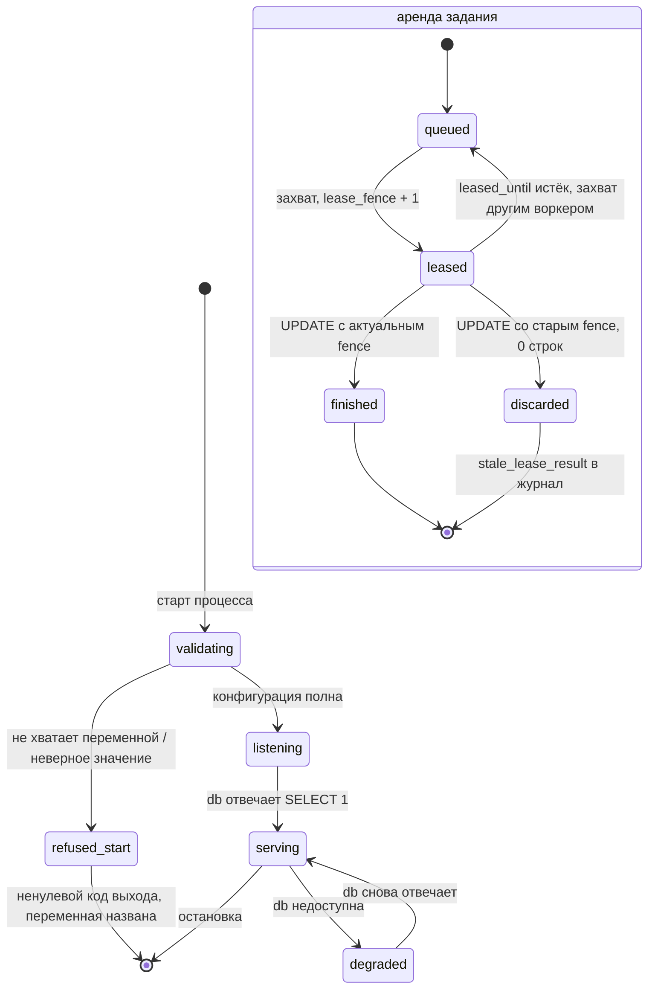

# Фича `foundation` — псевдокод

Алгоритмы каркаса. Имена сущностей, статусов и чисел — из [`docs/canon.md`](../../canon.md);
логическая модель полей — из [`docs/Pseudocode.md`](../../Pseudocode.md) (Data Structures), здесь она
не переписывается.

## Data Structures

Фича не вводит НИ ОДНОЙ новой сущности: она создаёт физическое воплощение четырнадцати, уже
объявленных каноном §4 и `Pseudocode.md`. Таблица ниже — перечень того, что создают миграции, и
физических решений, которые обязаны в них попасть (`Architecture.md`, Data Architecture).

| Таблица | Что обязана нести миграция сверх `id UUID PK` и `created_at TIMESTAMPTZ NOT NULL DEFAULT now()` |
|---|---|
| `account` | `telegram_user_id text`, `tier text`, `consent_version text?`, `consent_text_hash text?`, `consent_at timestamptz?`, `deletion_requested_at timestamptz?`, `status` — перечисление из 3 значений `active / erasing / erased` |
| `device_session` | `account_id uuid?`, `cookie_token_hash text NOT NULL`, `ip_prefix text NOT NULL`, `last_seen_at timestamptz NOT NULL`, `anonymous_diary_expires_at timestamptz NOT NULL`, индекс по `anonymous_diary_expires_at`, `UNIQUE (cookie_token_hash)` |
| `photo` | `device_session_id uuid`, `object_key text`, `mime text`, `bytes int`, `width int`, `height int`, `normalized_object_key text?`, `normalized_bytes int?`, `expires_on date`, `file_state` — 2 значения `present / purged`, частичный индекс `(expires_on) WHERE file_state = 'present'` |
| `recognition` | `device_session_id uuid`, `account_id uuid?`, `photo_id uuid`, `status` — 4 значения `queued / done / failed / refused`, `attempt_no int`, `model_used text?`, `escalated boolean`, `confidence numeric?`, `items jsonb`, `model_estimate_kcal int?`, `db_kcal_total int?`, `discrepancy_ratio numeric?`, `conflict_flag boolean`, `failure_reason` — 8 значений, nullable, `idempotency_key text?`, `leased_until timestamptz?`, `lease_owner uuid?`, `lease_fence integer NOT NULL DEFAULT 0`, `finished_at timestamptz?`; `UNIQUE (device_session_id, idempotency_key)`; частичный индекс `(status, leased_until) WHERE status = 'queued'` |
| `food_item` | `source text`, `source_id text`, `name_en text`, `kcal_per_100g int`, `protein_per_100g numeric(5,1)`, `fat_per_100g numeric(5,1)`, `carb_per_100g numeric(5,1)`, `default_portion_g int?`, `import_snapshot_date date`; `UNIQUE (source, source_id)`; `GIN (name_en gin_trgm_ops)` |
| `food_synonym` | `name_ru text`, `name_ru_normalized text`, `food_item_id uuid?`, `recipe_parts jsonb?`, `curated_by text`, `curated_at timestamptz`; `CHECK` строгого ИЛИ между `food_item_id` и `recipe_parts`; `GIN (name_ru_normalized gin_trgm_ops)` |
| `diary_entry` | `owner_key text`, `recognition_id uuid`, `eaten_on date`, `meal_slot` — 4 значения, `items jsonb`, `kcal_total int`, `protein_total numeric(5,1)`, `fat_total numeric(5,1)`, `carb_total numeric(5,1)`, `source_snapshot jsonb`, `user_corrected boolean`, `deleted_at timestamptz?`; частичный индекс `(owner_key, eaten_on) WHERE deleted_at IS NULL` |
| `share_card` | `owner_key text`, `recognition_id uuid`, `object_key text`, `width int`, `height int`, `badge_rendered boolean`, `revoked_at timestamptz?` |
| `partner` | `display_name text`, `contact text`, `account_id uuid?`, `status` — 2 значения `active / suspended` |
| `partner_code` | `partner_id uuid`, `code text`, `status` — 2 значения `active / blocked`, `blocked_reason` — 2 значения, nullable, `blocked_at timestamptz?`; `UNIQUE (code)`, `CHECK (code = upper(code))` |
| `attribution` | `device_session_id uuid`, `partner_code_id uuid`, `status` — 3 значения `pending / activated / rejected`, `reject_reason` — 3 значения, nullable, `source` — 3 значения `explicit / deeplink / cookie`, `replaced_source` — те же 3 значения, nullable, `activated_at timestamptz?`; `UNIQUE (device_session_id)` |
| `pro_interest` | `owner_key text`, `contact text`, `contact_kind` — 2 значения `email / telegram`, `source_screen` — 2 значения `user_limit / global_limit`, `partner_code_id uuid?`; индекс `(created_at)` |
| `growth_event` | `type` — 5 значений `install / activation / share_click / card_view / code_applied`, `device_session_id uuid`, `partner_code_id uuid?`, `share_card_id uuid?`; индекс `(partner_code_id, type, created_at)` |
| `scan_quota_counter` | `scope` — 3 значения `user / global / escalation`, `scope_key text`, `day date`, `used int NOT NULL DEFAULT 0`, `limit_value int NOT NULL`; `UNIQUE (scope, scope_key, day)` |

Служебная таблица раннера, не сущность канона: `schema_migration(version text PRIMARY KEY,
applied_at timestamptz NOT NULL, checksum text NOT NULL)`.

Конфигурация процесса как значение (`packages/shared`):
`RuntimeConfig = { databaseUrl, appOrigin?, s3: {endpoint, bucket, accessKey, secretKey},
limits: {user: int, day: int, escalationDay: int}, modelProvider: 'fake' | 'live',
anthropicApiKey? }` — собирается ТОЛЬКО валидатором и только целиком; частично заполненного
значения этого типа не существует.

## Core Algorithms

### Algorithm: BuildAndVerifyWorkspace

REQUIREMENT: `FR-foundation-1`
REQUIREMENT: `AC-foundation-1`
REALISES: AC-foundation-1
INPUT: чистый клон репозитория проекта.
OUTPUT: собранные пакеты либо ненулевой код возврата.
STEPS:
1. Прочитать корневой `package.json` с полем `workspaces` из ровно пяти путей. Контекст сборки образов — корень проекта: `package-lock.json` лежит только здесь, и `npm ci` из подкаталога невозможен.
2. `npm ci` — установка по локфайлу; манифесты ВСЕХ пяти workspace обязаны присутствовать, иначе npm сверяет неполное дерево и падает.
3. `npm run build` по каждому workspace в порядке зависимостей: `packages/shared` → `packages/db` → `apps/*`.
4. `npm test` — vitest по всем пакетам; `npm run lint` — ESLint.
5. IF любая команда вернула ненулевой код THEN RETURN этот код: «почти собралось» результатом не является.
6. RETURN 0.
COMPLEXITY: O(числа пакетов), одна сборка на пакет.

### Algorithm: ValidateRuntimeConfig

REQUIREMENT: `FR-foundation-2`
REQUIREMENT: `AC-foundation-2`
REQUIREMENT: `AC-foundation-3`
REALISES: AC-foundation-2, AC-foundation-3
INPUT: `process.env`, роль процесса (`api` либо `recognizer`).
OUTPUT: `RuntimeConfig` целиком, либо завершение процесса ненулевым кодом ДО открытия сокета.
STEPS:
1. Определить обязательный набор имён: общий — `DATABASE_URL`, `S3_ENDPOINT`, `S3_BUCKET`, `S3_ACCESS_KEY`, `S3_SECRET_KEY`, `N4_SCAN_LIMIT_USER`, `N4_SCAN_LIMIT_DAY`, `N4_ESCALATION_LIMIT_DAY`; для `api` дополнительно `APP_ORIGIN`. Набор объявлен В КОДЕ, а не собирается из окружения: список разрешённого, приехавший снаружи, однажды приедет пустым.
2. FOR EACH имя: IF значение `undefined` THEN собрать ошибку «переменная не объявлена»; ELSE IF значение после `trim` равно `''` THEN собрать ошибку «переменная объявлена пустой» — это ОТДЕЛЬНЫЙ случай: пустая строка почти всегда опечатка, и трактовать её как отсутствие значит потерять диагностику.
3. Разобрать три потолка как целые: IF не целое OR ≤ 0 THEN собрать ошибку с именем переменной. Ноль здесь не «запретить всё», а несконфигурированное значение.
4. Проверить `APP_ORIGIN` конструктором URL и списком схем `{https, http}`: непригодное значение трактуется как отсутствующее и НЕ подчищается. Дефолта у него нет по построению — он определяет каждую выдаваемую наружу ссылку.
5. Прочитать `N4_MODEL_PROVIDER`: значение вне закрытого множества `{fake, live}` — ошибка, а не откат к `fake`. IF `live` AND `ANTHROPIC_API_KEY` пуст THEN ошибка с названной переменной (DEC-A-009).
6. IF список ошибок не пуст THEN напечатать в `stderr` ВСЕ собранные ошибки, каждую с именем переменной и её внешним последствием («без потолка вызов модели не ограничен ничем; счёт выставляют чужие действия»), и завершить процесс кодом 78. Печатать только первую ошибку нельзя: три отсутствующие переменные дадут три перезапуска.
7. RETURN `RuntimeConfig`. Значения секретов в журнал не попадают — печатаются только ИМЕНА проверенных переменных.
COMPLEXITY: O(числа переменных).

### Algorithm: ApplyMigrations

REQUIREMENT: `FR-foundation-3`
REQUIREMENT: `AC-foundation-4`
REALISES: AC-foundation-4
INPUT: `DATABASE_URL` владельца схемы, каталог `packages/db/migrations`.
OUTPUT: применённые файлы и строки в `schema_migration`, либо ошибка с номером упавшего файла.
STEPS:
1. Открыть соединение, выполнить `SET ROLE n4_migrate` — DDL выполняется владельцем схемы, а не ролью приложения.
2. `CREATE TABLE IF NOT EXISTS schema_migration (version text PRIMARY KEY, applied_at timestamptz NOT NULL, checksum text NOT NULL)`.
3. Прочитать список файлов `NNN_*.sql`, отсортировать по числовому префиксу. IF два файла с одинаковым префиксом THEN ошибка: порядок применения обязан быть однозначным.
4. FOR EACH файл в порядке возрастания: посчитать контрольную сумму содержимого; IF версия уже в `schema_migration` THEN сравнить сумму — расхождение есть ОШИБКА (файл изменён после применения), совпадение означает пропуск; ELSE выполнить файл В ОДНОЙ транзакции с вставкой строки в `schema_migration`. Разрыв между DDL и записью журнала оставил бы схему применённой, а журнал — нет.
5. Первый файл `001_init.sql` создаёт `CREATE EXTENSION IF NOT EXISTS pg_trgm`, роли (алгоритм `ProvisionDatabaseRoles`), все 14 таблиц канона, перечисления как `CHECK`-ограничения либо типы-перечисления, уникальности и частичные индексы из таблицы `## Data Structures`.
6. RETURN число применённых файлов. Повторный прогон возвращает 0 и код выхода 0.
COMPLEXITY: O(числа файлов), одна транзакция на файл.

### Algorithm: ProvisionDatabaseRoles

REQUIREMENT: `AC-foundation-5`
REALISES: AC-foundation-5
INPUT: соединение под `n4_admin` (единственная учётная запись, существующая в `docker-compose.yml`).
OUTPUT: три роли с разными правами.
STEPS:
1. `CREATE ROLE n4_migrate` — `NOLOGIN`, владелец схемы `public` объекта базы `n4`. Входа у роли нет: в неё переключаются `SET ROLE` из-под администратора, и отдельный секрет для неё не заводится.
2. `CREATE ROLE n4_app LOGIN PASSWORD :app_password` — пароль берётся параметром из окружения раннера, в файл миграции не попадает.
3. Выдать `n4_app`: `USAGE` на схему, `SELECT, INSERT, UPDATE, DELETE` на все таблицы и `USAGE` на последовательности. НЕ выдавать: `CREATE` на схему, владение таблицами, `TRUNCATE`, `REFERENCES`.
4. `ALTER DEFAULT PRIVILEGES FOR ROLE n4_migrate IN SCHEMA public GRANT SELECT, INSERT, UPDATE, DELETE ON TABLES TO n4_app` — иначе каждая следующая миграция создаёт таблицу, невидимую приложению, и дефект проявится только на её первом чтении.
5. IF роль уже существует THEN не падать, но и не расширять права молча: расхождение фактических прав с ожидаемыми — ошибка с перечнем лишних.
COMPLEXITY: O(числа таблиц) на выдачу прав.

### Algorithm: CreateDeviceSession

REQUIREMENT: `FR-foundation-4`
REQUIREMENT: `AC-foundation-6`
REQUIREMENT: `AC-foundation-7`
REALISES: SC-US-001-1, AC-foundation-6, AC-foundation-7
INPUT: HTTP-запрос (cookie сессии либо её отсутствие), адрес клиента.
OUTPUT: `device_session` и заголовок `Set-Cookie` при создании; существующая сессия без нового токена при повторе.
STEPS:
1. IF cookie сессии присутствует THEN вычислить её хэш и найти строку по `cookie_token_hash`. IF найдена THEN обновить `last_seen_at`, RETURN найденную сессию БЕЗ нового `Set-Cookie`. IF не найдена THEN продолжить с шага 2: неизвестный токен есть отсутствие сессии, а не ошибка; прежняя строка при этом не изменяется и не воскрешается.
2. Сгенерировать токен ≥ 128 бит энтропии криптографическим генератором. В базу записать ТОЛЬКО его хэш; сырое значение уходит в cookie `HttpOnly; Secure; SameSite=Lax` и не хранится нигде.
3. Усечь адрес клиента: IPv4 — до /24, IPv6 — до /48. Записать в `ip_prefix`. Полный адрес не сохраняется ни здесь, ни в журнале: он нужен только квоте и anti-fraud, и им достаточно префикса.
4. Записать `anonymous_diary_expires_at = created_at + 7 суток`, `account_id = NULL`.
5. RETURN сессию с кодом 201. Ни анкеты, ни регистрации, ни экрана согласия здесь нет: съёмка обязана быть доступна сразу, а согласие спрашивается перед ПЕРВОЙ записью дневника (ADR-009, фича `consent-and-telegram-auth`).
COMPLEXITY: O(1), одно чтение по уникальному индексу и одна вставка.

### Algorithm: CheckAndConsumeQuota

REQUIREMENT: `FR-foundation-5`
REQUIREMENT: `AC-foundation-8`
REALISES: SC-US-009-1, AC-foundation-8
INPUT: сессия устройства, её `ip_prefix`, текущая дата в `Europe/Moscow`, причина попытки `reason` ∈ {`primary`, `escalation`}, проверенные потолки из `RuntimeConfig`.
OUTPUT: `granted` либо `refused(scope)`, где `scope` ∈ {`user`, `global`, `escalation`}.
STEPS:
1. Собрать ключи ПО ПРИЧИНЕ. `primary` — три: `(user, session_id, day)` с пределом `limits.user`, `(user, ip_prefix, day)` с тем же пределом, `(global, 'all', day)` с пределом `limits.day`. `escalation` — четыре: те же три плюс `(escalation, 'all', day)` с пределом `limits.escalationDay`. Ключей у анонима два, а не один: смена любого одного обнулила бы защиту.
2. Открыть ОДНУ транзакцию на всю попытку и взять соединение из пула, созданного при старте процесса (с `connectionTimeoutMillis`: бесконечное ожидание соединения — отказ без сигнала).
3. FOR EACH ключ выполнить ОДИН оператор: `INSERT INTO scan_quota_counter (scope, scope_key, day, used, limit_value) VALUES (:scope, :key, :day, 1, :limit) ON CONFLICT (scope, scope_key, day) DO UPDATE SET used = scan_quota_counter.used + 1 WHERE scan_quota_counter.used < :limit RETURNING used`. «Прочитать, потом записать» запрещено: обе реализации проходят последовательный тест, различает их только конкурентный прогон.
4. IF любой оператор вернул пустой результат THEN откатить транзакцию ЦЕЛИКОМ и RETURN `refused` с названным `scope`. Откат именно транзакцией, а не встречными декрементами: параллельная попытка, попавшая между инкрементом и декрементом, увидела бы завышенное значение и получила бы отказ незаслуженно.
5. Зафиксировать транзакцию, записать событие расхода в журнал (день, причина, при отказе — `scope`) и RETURN `granted`. Счёт ведётся по ПОПЫТКАМ: провайдер берёт деньги за попытку, а не за успех.
6. Вызова модели этот алгоритм не делает ни при каком исходе: в фиче `foundation` его нет вовсе, а в следующих он выполняется ТОЛЬКО после `granted`.
COMPLEXITY: O(1) на ключ; три записи на первичную попытку, четыре на эскалацию.

### Algorithm: VerifySharedResourceUnderConcurrency

REQUIREMENT: `NFR-foundation-1`
REQUIREMENT: `AC-foundation-9`
REALISES: AC-foundation-9
INPUT: настоящий PostgreSQL профиля `test`, предел `limits.user = 10`, две разные сессии.
OUTPUT: вердикт теста: ровно 10 успехов, соседняя сессия не пострадала, пул не переполнен.
STEPS:
1. Подготовить базу: применить миграции, обнулить `scan_quota_counter` за сегодняшний день. Мок вместо PostgreSQL здесь запрещён: он не воспроизводит ни уникального индекса, ни блокировок, ради которых тест написан.
2. Запустить 20 вызовов `CheckAndConsumeQuota(reason = primary)` для ОДНОЙ сессии одновременно (общий барьер старта, а не цикл с ожиданием каждого).
3. Утверждать: ровно 10 `granted`, ровно 10 `refused(user)`; `used` ключа `(user, session_id, day)` равен ровно 10 — ни одна попытка не потеряна и не посчитана дважды.
4. Параллельно с шагом 2 выполнить 5 вызовов для СОСЕДНЕЙ сессии и утверждать, что все пять `granted`: механизм, корректно ограничивающий одного, не имеет права наказывать добросовестного.
5. Наблюдать число одновременно занятых соединений пула во время прогона и утверждать, что оно не превышает размер пула и не растёт с числом ожидающих. Рост означает, что ожидающие копятся и ресурс кончится на большем N.
6. Повторить шаги 2–3 для аренды задания (`LeaseRecognitionJob`): N воркеров на M заданий, ни одного двойного захвата, ни одного потерянного.
7. Порог в утверждениях — ЛИТЕРАЛ (10, 20, 5), а не значение, прочитанное из той же конфигурации, что и проверяемый код: иначе тест подтвердит сам себя.
COMPLEXITY: O(N) вызовов, один прогон.

### Algorithm: LeaseRecognitionJob

REQUIREMENT: `FR-foundation-6`
REQUIREMENT: `AC-foundation-10`
REQUIREMENT: `AC-foundation-17`
REQUIREMENT: `AC-foundation-18`
REALISES: AC-foundation-10, AC-foundation-17, AC-foundation-18
INPUT: идентификатор воркера (UUID, создаётся один раз при старте процесса), интервал опроса 1 с, срок аренды 60 с.
OUTPUT: захваченное задание вместе с номером захвата `fence`, либо пусто.
STEPS:
1. Открыть транзакцию. `SELECT id, lease_fence FROM recognition WHERE status = 'queued' AND photo_id IS NOT NULL AND (leased_until IS NULL OR leased_until < now()) AND lease_fence < 3 ORDER BY created_at FOR UPDATE SKIP LOCKED LIMIT 1`. Предикат `leased_until` обязан быть И в запросе, И в частичном индексе: `SKIP LOCKED` защищает только пока держится транзакция, а она закрывается до внешнего вызова. Два остальных условия введены DEC-A-015 и закрывают РАЗНЫЕ отказы: `photo_id IS NOT NULL` делает НЕЗАВЕРШЁННУЮ ПУБЛИКАЦИЮ невидимой (строка заявляется ключом повторности раньше, чем кадр лёг в бакет, и воркер, схвативший её в этом окне, позвал бы модель на кадр, которого ещё нет — платная работа впустую); `lease_fence < 3` делает НЕВОЗМОЖНЫМ ЧЕТВЁРТЫЙ ЗАХВАТ (задание, роняющее воркеров, иначе перезахватывается вечно, и КАЖДЫЙ захват оплачен — счёт идёт по попыткам). У предела есть названная цена: задание с исчерпанными захватами больше не предложится НИ ОДНОМУ воркеру, поэтому вместе с ним вводится `SweepStuckJobs`, а не «как-нибудь заметим».
2. IF строка не найдена THEN зафиксировать транзакцию и RETURN пусто; спать интервал опроса.
3. В той же транзакции: `UPDATE recognition SET leased_until = now() + 60s, lease_owner = :worker, lease_fence = lease_fence + 1 WHERE id = :id RETURNING lease_fence`. Зафиксировать транзакцию — соединение пула освобождается ДО любой длительной работы.
4. Выполнить работу (в этой фиче — детерминированный фейк адаптера, вызова модели нет).
5. Записать результат условным `UPDATE recognition SET status = :status, finished_at = now(), … WHERE id = :id AND lease_fence = :fence AND status = 'queued'`. Условие по статусу ДОБАВЛЕНО вместе с уборщиком: без него воркер затёр бы терминальный статус `failed(timeout)`, уже поставленный `SweepStuckJobs`, и вернул задание к жизни задним числом.
6. IF затронуто 0 строк THEN это НЕ ошибка базы. Случаев ДВА, и различает их НОМЕР ЗАХВАТА, а не статус: строка перечитывается, и если `lease_fence` больше своего — задание перезахватили (устаревшая аренда, журнал `stale_lease_result`), а если `lease_fence` равен своему при уже терминальном статусе — строку закрыл уборщик (журнал `swept_as_timeout`), потому что уборщик единственный, кто закрывает задание, не увеличивая номер. Результат отбрасывается в обоих случаях. Fencing защищает ДАННЫЕ и не возвращает ДЕНЬГИ: в окне гонки работа выполнена дважды, и обе попытки уже списаны в потолки (DEC-A-008). Это названная цена.
7. RETURN результат записи.
COMPLEXITY: O(1) на захват благодаря частичному индексу `(status, leased_until) WHERE status = 'queued'`.

### Algorithm: SweepStuckJobs

REQUIREMENT: `FR-foundation-6`
REQUIREMENT: `AC-foundation-19`
REALISES: AC-foundation-19
INPUT: тот же цикл опроса `recognizer` (интервал 1 с), что и захват задания — ОТДЕЛЬНОГО сервиса не заводится.
OUTPUT: терминальный статус `failed(timeout)` на застрявших заданиях.
STEPS:
1. **Правило А — никогда не захвачено.** `UPDATE recognition SET status = 'failed', failure_reason = 'timeout', finished_at = now() WHERE status = 'queued' AND leased_until IS NULL AND created_at < now() - interval '5 minutes'`. Задание простояло в очереди пять минут, и ни один воркер его не взял: пул исчерпан либо остановлен. Условие `status = 'queued'` внутри `WHERE` И ЕСТЬ защита от гонки — если воркер В ЭТОТ МОМЕНТ захватывает задание, `UPDATE` затрагивает ноль строк, и это НЕ ошибка.
2. **Правило Б — предел захватов исчерпан.** `UPDATE recognition SET status = 'failed', failure_reason = 'timeout', finished_at = now() WHERE status = 'queued' AND lease_fence >= 3 AND leased_until < now()`. Такое задание предикат выборки (`lease_fence < 3`) больше не предлагает НИКОМУ: без этого правила предел превращает задание в вечное `queued`, то есть в тихую потерю.
3. Уборщик НИКОГДА не трогает задание с ДЕЙСТВУЮЩЕЙ арендой: живой воркер внутри своей аренды следит за своим бюджетом сам, а «завершить задание, не прекратив платную работу» — исход хуже задержки.
4. Каждое правило — отдельный ИДЕМПОТЕНТНЫЙ оператор со своим `WHERE`: повторный прогон уже переведённых строк не находит.
5. Значение `failure_reason = 'timeout'` введено DEC-A-018; в схеме его добавляет миграция `002`, потому что `001` уже применён, а изменённый после применения файл раннер обязан отвергать.
COMPLEXITY: O(n) по числу застрявших строк на прогон; оба правила опираются на индекс `(status, leased_until) WHERE status = 'queued'`.

### Algorithm: SelectModelProvider

REQUIREMENT: `AC-foundation-11`
REQUIREMENT: `AC-foundation-20`
REQUIREMENT: `AC-foundation-21`
REALISES: AC-foundation-11, AC-foundation-20, AC-foundation-21
INPUT: `RuntimeConfig.modelProvider`, `RuntimeConfig.anthropicApiKey`.
OUTPUT: реализация интерфейса `ModelProvider` либо отказ старта.
STEPS:
1. Интерфейс объявляет ровно одну операцию: `recognize(image, schema, opts: { model, deadlineMs }) -> StructuredAnswer`. Доменный код не знает ни формы ответа поставщика, ни его клиента: перевод чужого в своё выполняет адаптер на границе. МОДЕЛЬ И ДЕДЛАЙН ЗАДАЁТ ВЫЗЫВАЮЩИЙ (DEC-A-015): порт, решающий это сам, прячет эскалацию внутри адаптера — снаружи не видно, какой вызов оплачен дороже, и потолок эскалаций не с чем сопоставить. Ответ ВОЗВРАЩАЕТ `model`: «о какой модели этот ответ» обязано читаться из самого ответа, а не восстанавливаться по памяти вызывающего. Бюджет принадлежит ОПЕРАЦИИ целиком (нормализация плюс вызов), поэтому он приходит снаружи одним числом, а не складывается из двух независимых таймаутов.
2. IF `modelProvider = fake` THEN вернуть детерминированный фейк: одинаковый вход даёт побайтово одинаковый выход, наружу не открывается ни одного соединения. Фейк УВАЖАЕТ `deadlineMs`: истёкший или неположительный бюджет — ОТКАЗ ДО работы, а работа дольше бюджета — отказ вместо позднего ответа (поздний ответ всё равно оплачен и всё равно выбрасывается). Задержка фейка задаётся ЯВНО параметром, а не выводится из входа: тест, случайно пересекающий дедлайн, мигает и потому ничего не значит. Фейк умеет отдавать и отказные исходы (нарушение схемы, таймаут, пустой список ингредиентов) — они понадобятся фиче `scan-pipeline`, и интерфейс обязан их выражать уже сейчас.
3. IF `modelProvider = live` THEN живой клиент СОЗДАЁТСЯ, но в этой фиче не вызывается; отсутствие ключа уже отвергнуто валидатором конфигурации (`ValidateRuntimeConfig` шаг 5).
4. IF значение вне множества `{fake, live}` THEN отказ: нераспознанное значение трактуется как самое строгое, а не как «возьмём безопасное по умолчанию» — иначе опечатка в переменной навсегда останется незамеченной.
5. RETURN выбранную реализацию.
COMPLEXITY: O(1), выбор один раз при старте процесса.

### Algorithm: RenderCameraShell

REQUIREMENT: `FR-foundation-7`
REQUIREMENT: `AC-foundation-12`
REALISES: AC-foundation-12
INPUT: HTTP-запрос корневого маршрута `web`.
OUTPUT: HTML экрана видоискателя и `manifest.json`.
STEPS:
1. Отдать серверно отрисованную страницу: область видоискателя и ровно одна строка режимов с двумя подписями — «съёмка» и «галерея». Ни анкеты, ни формы регистрации, ни экрана согласия до съёмки нет (FR-CAPTURE-001, FR-LOOK-006).
2. Кнопка съёмки открывает выбор файла с атрибутом `capture`; выбранный кадр НИКУДА не отправляется — приём фото принадлежит фиче `scan-pipeline`. Показывается явная надпись о том, что распознавание ещё не подключено: пустая кнопка, молча ничего не делающая, читается как дефект.
3. Отдать `manifest.json` с `application/manifest+json`, полями `name`, `short_name`, `icons` (непустой список), `display: standalone`, `start_url`, `theme_color`.
4. Никаких секретов в клиентском бандле: `web` их не получает вовсе (`docker-compose.yml`, блок `environment:` сервиса `web`), и это проверяется поиском по собранному бандлу, а не доверием.
5. RETURN ответ.
COMPLEXITY: O(1).

### Algorithm: RateLimitBeforeBodyParse

REQUIREMENT: `FR-foundation-8`
REQUIREMENT: `AC-foundation-13`
REALISES: AC-foundation-13
INPUT: входящий HTTP-запрос, ограничитель частоты, созданный один раз при старте процесса.
OUTPUT: продолжение обработки либо `429` без разбора тела.
STEPS:
1. Хук регистрируется на фазе, предшествующей разбору тела (`onRequest` в Fastify). Порядок — часть защиты: при обратном порядке перебор мусорными телами бесплатен, потому что до счётчика запрос не доходит.
2. Вычислить ключ — `ip_prefix` вызывающего (усечённый, как и всюду). Ключ по полному адресу не нужен, а по сессии — не годится: сессию заводит сам атакующий.
3. Увеличить счётчик окна. IF значение превысило порог THEN RETURN `429` с телом `{ error: { code: 'rate_limited', message } }` и НЕ передавать запрос дальше: тело так и остаётся неразобранным.
4. ELSE передать запрос дальше по цепочке: разбор тела, затем валидация, затем — в следующих фичах — квота и только потом вызов модели.
5. Экземпляр ограничителя единственный на процесс. Создание экземпляра на запрос обнуляет защиту, оставляя её видимость.
COMPLEXITY: O(1) на запрос.

### Algorithm: ReportServiceHealth

REQUIREMENT: `FR-foundation-9`
REQUIREMENT: `AC-foundation-14`
REALISES: AC-foundation-14
INPUT: запрос `GET /health`, пул соединений.
OUTPUT: `200` с `{ data: { status: 'ok' } }` либо `503` с названной причиной.
STEPS:
1. Выполнить `SELECT 1` с коротким таймаутом (≤ 1 с), взяв соединение из общего пула.
2. IF запрос успешен THEN RETURN `200` с `{ data: { status: 'ok' }, meta: { request_id } }`.
3. IF база недоступна или таймаут THEN RETURN `503` с `{ error: { code: 'dependency_unavailable', message: 'база данных недоступна' } }`. Недоступность источника истины — ОТКАЗ, а не «наверное, всё хорошо»: проверка, отвечающая «здоров» на неизвестном состоянии, хуже отсутствия проверки.
4. Ни версии сборки, ни имён переменных, ни строк подключения, ни данных пользователя в ответе нет: служебная ручка не обязана быть источником разведданных.
5. Маршрут лежит ВНЕ префикса `/api/v1` и не входит в 13 маршрутов канона §5; решение записано в `01_specification.md`, раздел о расширениях канона.
COMPLEXITY: O(1).

### Algorithm: CheckEnvWiring

REQUIREMENT: `FR-foundation-10`
REQUIREMENT: `AC-foundation-15`
REALISES: AC-foundation-15
INPUT: каталог проекта, вывод `docker compose config`.
OUTPUT: код возврата 0, 1 или 2 и перечень потерь.
STEPS:
1. Получить нормализованную конфигурацию: `docker compose config`. IF команда недоступна, вернула ненулевой код ИЛИ вывод пуст THEN напечатать в `stderr` «конфигурация нечитаема — проверка НЕ ВЫПОЛНЕНА» и RETURN 2. Пустой вход НИКОГДА не читается как «нарушений не найдено»: именно так зеленел страж портов проекта 01.
2. FOR EACH сервис со сборкой из исходников: собрать имена, читаемые кодом, регулярным выражением `process\.env\.([A-Z][A-Z0-9_]*)`. Цифры в классе обязательны: `[A-Z_]+` режет `S3_ENDPOINT` до `S`, совпадение находится всегда, и страж зеленеет на любом входе.
3. Собрать имена, объявленные в блоке `environment:` этого сервиса в нормализованной конфигурации. Опора на `.env.example` запрещена: он сам может быть неполон, и проверка унаследовала бы его пробел.
4. Вычесть из первого множества второе и ЯВНЫЙ список исключений, записанный в самом скрипте (`NODE_ENV`, `TZ`, `NEXT_TELEMETRY_DISABLED`). Молчаливое исключение прячет настоящую потерю, поэтому список именно явный и комментированный.
5. IF разность не пуста THEN напечатать каждую потерю строкой «сервис: переменная» и RETURN 1.
6. RETURN 0.
COMPLEXITY: O(числа файлов исходников + числа сервисов).

### Algorithm: EmitStructuredLog

REQUIREMENT: `NFR-foundation-2`
REQUIREMENT: `AC-foundation-16`
REALISES: AC-foundation-16
INPUT: событие (уровень, имя, поля), контекст запроса.
OUTPUT: одна строка JSON в стандартный вывод.
STEPS:
1. Сформировать объект `{ ts, level, event, request_id, …поля }`. Одна строка — одно событие: многострочный вывод не разбирается ни одним сборщиком без склейки.
2. Пропустить поля через редактор запрещённых значений: ключ модели, токен бота, сырой токен cookie, полный IP-адрес, байты изображения, содержимое `initData`. Запрещённое значение заменяется меткой `[redacted]`, а поле не выбрасывается: исчезнувшее поле выглядит как «его и не было».
3. Адрес попадает в журнал ТОЛЬКО как `ip_prefix`. Усечение выполняется на входе в систему (`CreateDeviceSession` шаг 3), а не при печати: значение, которого нет, не утечёт и по ошибке.
4. При старте процесса напечатать событие `service_start` с ролью, тремя потолками и перечнем ПРОВЕРЕННЫХ ИМЁН переменных без значений.
5. Страж по исходнику утверждает, что в вызовы журналирования не передаются перечисленные в шаге 2 значения, и принимается только вместе с прогоном на внедрённом дефекте.
COMPLEXITY: O(числа полей события).

## API Contracts

Два маршрута, оба введены осознанно и записаны в `01_specification.md`.

```
POST /api/v1/auth/device
  Authorization: не требуется (это и есть точка входа анонима)
  Cookie: n4_session=<токен> — необязательна
  Body: пусто
  Response 201: { "data": { "session_id": "<uuid>", "anonymous_diary_expires_at": "<ts>" },
                  "meta": { "request_id": "<uuid>" } }
             Set-Cookie: n4_session=<токен>; HttpOnly; Secure; SameSite=Lax; Path=/; Max-Age=…
  Response 200: то же тело БЕЗ Set-Cookie — действующая cookie уже была предъявлена
  Response 429: { "error": { "code": "rate_limited", "message": "слишком часто" } }
  Response 503: { "error": { "code": "dependency_unavailable", "message": "база данных недоступна" } }

GET /health        (вне префикса /api/v1, служебный)
  Response 200: { "data": { "status": "ok" }, "meta": { "request_id": "<uuid>" } }
  Response 503: { "error": { "code": "dependency_unavailable", "message": "база данных недоступна" } }
```

## State Transitions



## Error Handling Strategy

| Категория | Пример | Ответ и действие |
|---|---|---|
| конфигурация неполна | нет `N4_ESCALATION_LIMIT_DAY` | процесс НЕ стартует, код 78, `stderr` называет переменную и последствие; сокет не открывается |
| зависимость недоступна | `db` не отвечает | `GET /health` → `503`; рабочие маршруты → `503` с `dependency_unavailable`; исключение не проглатывается и не превращается в возвращаемое значение внутри транзакции |
| предел достигнут | одиннадцатая попытка за сутки | `refused(scope)` из `CheckAndConsumeQuota`; транзакция откачена целиком; вызова модели нет |
| слишком часто | перебор с одного `ip_prefix` | `429` ДО разбора тела |
| устаревший захват | `UPDATE` затронул 0 строк | результат отброшен, `stale_lease_result` в журнал, ошибка НЕ поднимается наверх |
| миграция расходится | контрольная сумма применённого файла изменилась | раннер падает ненулевым кодом и называет версию; молчаливое переприменение запрещено |
| неопознанное значение | `N4_MODEL_PROVIDER=дичь` | отказ старта; трактовка «самое строгое», не «значение по умолчанию» |

## Scenario Coverage

Scenarios in 01_specification.md: 2 · claimed by an algorithm: 2

Это приёмочные сценарии ПРОЕКТА (`SC-US-nnn-k`), унаследованные фичей и перечисленные в
`01_specification.md`, раздел «Наследуемые сценарии приёмки проекта». Критерии приёмки самой фичи
(`AC-foundation-n`) проходят по машинным ключам `REQUIREMENT:` и в этот счёт не входят.

Not claimed by any algorithm:
| Scenario | Reason |
|---|---|
| none | none |

Claimed by an algorithm but absent from 01_specification.md:
| Algorithm | Claimed ID |
|---|---|
| none | none |
