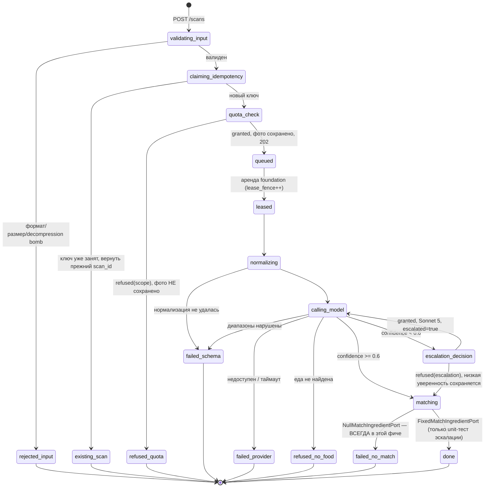

# Фича `scan-pipeline` — псевдокод

Алгоритмический контракт. Имена сущностей, статусов, полей и чисел — из
[`docs/canon.md`](../../canon.md) и [`docs/Pseudocode.md`](../../Pseudocode.md) (Data Structures);
здесь они не переизобретаются. Требования и решения фичи — [`01_specification.md`](01_specification.md).

## Data Structures

Фича НЕ добавляет и не меняет ни одной колонки: `recognition`, `photo`, `scan_quota_counter` уже
несут все нужные поля (`idempotency_key`, `lease_owner`, `lease_fence`, `failure_reason`,
`normalized_object_key`, `escalated`, `confidence`) — их создала миграция `foundation`
(`packages/db/migrations/001_init.sql`). Единственное новое — интерфейс уровня кода, не таблица:

```
MatchIngredientPort = {
  match(item: RecognizedItem): Promise<{ food_item_id: UUID, snapshot: Snapshot } | null>
}
```

Реализация ЭТОЙ фичи — `NullMatchIngredientPort`, которая для любого `item` возвращает `null` без
обращения к базе (в `food_item` нет строк до `source-and-correct`). Тестовый двойник
`FixedMatchIngredientPort` (используется ТОЛЬКО в unit-тестах эскалации, `01_specification.md`
раздел «Стык») возвращает фиксированное совпадение. Контракт интерфейса не меняется, когда
`source-and-correct` подставит реальную реализацию с триграммным поиском.

`ModelProvider` (интерфейс и фейк) и `LeaseRecognitionJob` (аренда с fencing) — из `foundation`,
здесь ВЫЗЫВАЮТСЯ, не переопределяются.

## Core Algorithms

### Algorithm: EnqueueScanForFeature

REQUIREMENT: `FR-scan-pipeline-1`
REQUIREMENT: `FR-scan-pipeline-2`
REQUIREMENT: `FR-scan-pipeline-3`
REQUIREMENT: `FR-scan-pipeline-4`
REQUIREMENT: `AC-scan-pipeline-1`
REQUIREMENT: `AC-scan-pipeline-2`
REQUIREMENT: `AC-scan-pipeline-3`
REQUIREMENT: `AC-scan-pipeline-4`
REQUIREMENT: `AC-scan-pipeline-5`
REQUIREMENT: `AC-scan-pipeline-6`
REQUIREMENT: `AC-scan-pipeline-7`
REQUIREMENT: `AC-scan-pipeline-8`
REALISES: SC-US-001-1, SC-US-009-1
INPUT: сессия устройства (`device_session`, уже созданная `foundation` `CreateDeviceSession`), байты
изображения, заявленный MIME, заголовок `Idempotency-Key`.
OUTPUT: `202` с `scan_id` и статусом `queued`, ЛИБО отказ валидации, ЛИБО отказ по потолку.
STEPS:
1. Хук частоты `foundation` (FR-foundation-8) применяется ДО этого алгоритма и ДО разбора тела; порог
для `POST /scans` — 30/мин на `ip_prefix` (FR-scan-pipeline-10, канон §7). Превышение даёт `429` без
тела в журнале (DEC-A-013) и НЕ доходит до шага 2.
2. Определить тип файла по БАЙТАМ (сигнатура, не заголовок `Content-Type` и не расширение). `IF`
сигнатура не одна из `{JPEG, PNG, WebP, HEIC}` `THEN RETURN 422` с причиной `invalid_image`, БЕЗ
обращения к квоте и БЕЗ создания строки. Полиглот (пригоден и как изображение, и как HTML/архив)
отвергается тем же путём.
3. Проверить объявленные размеры изображения ДО декодирования: `IF` ширина × высота дают распаковку
свыше 100 Мпикс `THEN RETURN 422 (decompression_bomb)` — декодирование не запускается.
4. Проверить фактический размер файла (≤ 12 МБ) и разрешение после декодирования метаданных (≥
320×320 px). `IF` нарушено `THEN RETURN 413 | 422` с названной причиной, квота не тронута.
5. **Заявить ключ повторности.** `IF` заголовок `Idempotency-Key` отсутствует или не UUID `THEN
RETURN 422`. Иначе один атомарный оператор: `INSERT INTO recognition (device_session_id,
idempotency_key, status) VALUES (…, 'queued') ON CONFLICT (device_session_id, idempotency_key) DO
NOTHING RETURNING id`. `IF` результат пуст `THEN` прочитать существующую строку и `RETURN` её
`scan_id`, код `202`, её ТЕКУЩИЙ статус — без повторного шага 6 и без второго вызова модели.
«Прочитать, потом вставить» запрещено: две одновременные попытки не находят строки и обе вставляют.
6. Вызвать `CheckAndConsumeQuota(session, ip_prefix, day, reason = 'primary')` — реализация
`foundation`, `apps/api/src/quota/check-and-consume.ts`, НЕ переопределяется здесь. `IF refused(scope)
THEN` перевести заявленную на шаге 5 строку в `refused` с `failure_reason =
quota_exhausted_${scope}`, `RETURN 429` с телом `{ limit, reset_at, scope }` — поле `scope` называет
отказавший потолок. Фото на этом шаге ещё НЕ сохранено.
7. Положить оригинал в приватный бакет (`storage`), создать `photo` с `expires_on = today + 30 дней`,
`file_state = 'present'`. Публичной ссылки не существует.
8. Дописать в заявленную строку `recognition`: `photo_id`, `attempt_no = 1`, `escalated = false`,
`lease_fence = 0`; статус остаётся `queued`.
9. `IF` это ПЕРВЫЙ скан данной сессии `THEN` записать `growth_event(type = 'install', …)`.
10. `RETURN 202` с `{ scan_id, status: 'queued' }` немедленно, не дожидаясь распознавания —
идентификатор выдан ДО начала долгой работы (`long-job-contract.md`).
COMPLEXITY: O(1) плюс одна загрузка объекта.

### Algorithm: GetScanStatus

REQUIREMENT: `FR-scan-pipeline-9`
REQUIREMENT: `AC-scan-pipeline-18`
REALISES: SC-US-001-2
INPUT: `scan_id`, вызывающий (сессия либо аккаунт).
OUTPUT: тело статуса скана либо `404`.
STEPS:
1. Хук частоты (порог 120/мин для чтения, FR-scan-pipeline-10) применяется ДО разбора запроса.
2. Найти `recognition` по `id`. `IF` не найдена `OR` `owner_key` записи не совпадает с вызывающим
`THEN RETURN 404` — ТОТ ЖЕ ответ, что и для несуществующего `id`; владение проверяется по серверному
`owner_key`, идентификатор в пути не решает ничего.
3. Собрать тело: `{ status, items[] (label_ru, mass_g, unmatched, food_item_id), confidence,
low_confidence (вычисляемое: status = 'done' AND confidence < 0,6), escalated, model_estimate_kcal,
failure_reason? }`.
4. `food_item_id` КАЖДОЙ позиции — `null` в этой фиче (`NullMatchIngredientPort`, см.
`01_specification.md` «Стык с `source-and-correct`»); поля `kcal_total`, `macros`, `sources[]`,
`conflict_flag`, `share_card_id` полного контракта проекта здесь отсутствуют либо `null`/`[]` — это
явное, а не подразумеваемое ограничение.
5. `RETURN 200` с телом и `meta.updated_at = recognition.finished_at ?? recognition.created_at`.
COMPLEXITY: O(1) чтение по первичному ключу.

### Algorithm: NormalizePhotoForModel

REQUIREMENT: `FR-scan-pipeline-5`
REQUIREMENT: `AC-scan-pipeline-9`
REQUIREMENT: `AC-scan-pipeline-10`
REALISES: —
INPUT: `photo.object_key` (оригинал), заявленный MIME.
OUTPUT: `photo.normalized_object_key`, `photo.normalized_bytes`, ЛИБО `failed(schema_violation)`.
STEPS:
1. Загрузить оригинал по подписанной ссылке (≤ 15 минут). Соединение с базой на этом шаге не
удерживается — транзакция аренды (`foundation` `LeaseRecognitionJob`) уже закрыта.
2. `IF` MIME `HEIC`/`HEIF` `THEN` декодировать через `libheif` и перекодировать в JPEG; иначе декодер
исходного формата.
3. Снять EXIF целиком, включая GPS — сохранённая копия его не несёт.
4. Привести длинную сторону к ≤ 1568 px (не увеличивать, если уже меньше).
5. Сжимать итеративно, пока размер файла не станет ≤ 5 МБ (запас на рост base64 ≈ треть).
6. `IF` любой шаг 2–5 бросил ошибку (нечитаемый файл, неподдерживаемый кодек, декодер исчерпал
память) `THEN RETURN failed(schema_violation)` с названным шагом — вызова модели НЕ делать.
7. Сохранить результат как `photo.normalized_object_key`, `photo.normalized_bytes`. Оригинал не
изменяется.
8. `RETURN` успех.
COMPLEXITY: O(1) операций преобразования на фото; стоимость доминирует декодирование/кодирование.

### Algorithm: RecognizeScanWithinScanPipeline

REQUIREMENT: `FR-scan-pipeline-6`
REQUIREMENT: `FR-scan-pipeline-7`
REQUIREMENT: `FR-scan-pipeline-8`
REQUIREMENT: `FR-scan-pipeline-12`
REQUIREMENT: `FR-scan-pipeline-13`
REQUIREMENT: `NFR-scan-pipeline-1`
REQUIREMENT: `NFR-scan-pipeline-3`
REQUIREMENT: `AC-scan-pipeline-11`
REQUIREMENT: `AC-scan-pipeline-12`
REQUIREMENT: `AC-scan-pipeline-13`
REQUIREMENT: `AC-scan-pipeline-14`
REQUIREMENT: `AC-scan-pipeline-15`
REQUIREMENT: `AC-scan-pipeline-16`
REQUIREMENT: `AC-scan-pipeline-17`
REALISES: SC-US-001-2, SC-US-002-2
INPUT: задание, арендованное `foundation` `LeaseRecognitionJob` (уже несёт `lease_fence`, `photo_id`).
OUTPUT: `recognition` в терминальном статусе `failed` или `refused` (`done` НЕ достигается в этой
фиче реальным `NullMatchIngredientPort` — см. `01_specification.md` «Стык»; путь к `done` проверяется
отдельно, unit-тестом с подменённым портом).
STEPS:
1. Аренда уже взята и транзакция закрыта (`foundation`, не повторяется здесь).
2. Вызвать `NormalizePhotoForModel`. `IF failed THEN` записать `failed(schema_violation)` УСЛОВНО по
своему `lease_fence` (шаг 8 ниже несёт общий механизм записи) и `RETURN` — вызова модели не было.
3. Вызвать `ModelProvider.recognize(normalizedImage, schema)` (`Haiku 4.5`, живой провайдер —
`apps/recognizer/src/provider/anthropic.ts`, эта фича; фейк — `foundation`, применяется в тестах и
на стенде без ключа, DEC-A-009). Записать `model_call { reason: 'primary', model: 'haiku-4.5', ok,
ms }` НЕЗАВИСИМО от исхода (FR-scan-pipeline-12: счёт по попыткам). `IF` ответ не соответствует
схеме `THEN failed(schema_violation)`. `IF` провайдер недоступен/таймаут `THEN
failed(provider_unavailable | provider_timeout)` — попытка уже списана на приёме и не возвращается.
4. Проверить ДИАПАЗОНЫ в коде, после разбора: `confidence` в 0…1; `mass_g` каждой позиции в 1…5000;
позиций ≤ 12; кандидатов на позицию ≤ 3; `model_estimate_kcal ≥ 0`. `IF` любое условие нарушено
`THEN failed(schema_violation)` с названным полем — fail-closed, значение НЕ подрезается до границы.
5. `IF` модель не нашла еды на кадре `THEN refused(no_food_detected)` с подсказкой «еда не
распознана, снимите тарелку целиком», запись дневника не создаётся, `RETURN` (SC-US-001-2).
6. `IF confidence < 0,6 AND escalated = false THEN` вызвать `CheckAndConsumeQuota(session, ip_prefix,
day, reason = 'escalation')` — ДО обращения к Sonnet 5 (переиспользование `foundation`, четвёртый
ключ `(escalation, 'all', day)`). `IF granted THEN` повторить шаг 3 моделью `Sonnet 5`
(`model_call { reason: 'escalation', … }`), `escalated = true`, `attempt_no = 2`, вернуться к шагу 4
для НОВОГО ответа. `ELSE` эскалации НЕ происходит: запомнить `failure_reason_candidate =
quota_exhausted_escalation` для использования на шаге 8, если статус окажется `done` (сегодня — не
происходит, см. шаг 7).
7. Для каждой позиции вызвать `MatchIngredientPort.match(item)`. Реализация этой фичи
(`NullMatchIngredientPort`) возвращает `null` для ЛЮБОГО `item` → каждая позиция помечается
`unmatched = true`, `food_item_id = null` (SC-US-002-2, частично: маркировка есть, число из базы —
нет). `IF` ни одна позиция не сопоставлена (в этой фиче — ВСЕГДА, когда шаг 5 не сработал) `THEN`
статус `failed(no_food_matched)` с подсказкой «блюда нет в базе, уточните ингредиент вручную».
`failure_reason_candidate` с шага 6, если был, в ЭТОМ прогоне НЕ записывается — поле `failure_reason`
несёт `no_food_matched`, единственную причину, применимую к фактическому терминальному статусу; шаг
6 доказывается отдельным unit-тестом с `FixedMatchIngredientPort` (AC-scan-pipeline-14), где статус
действительно становится `done` и `failure_reason = quota_exhausted_escalation` записывается.
8. Записать результат УСЛОВНО по своему `lease_fence`: `UPDATE recognition SET status = …,
finished_at = now(), leased_until = NULL, lease_owner = NULL, … WHERE id = :scan_id AND lease_fence =
:мой_fence`. `IF` затронуто НОЛЬ строк `THEN` результат ОТБРОСИТЬ, записать `stale_lease_result` в
аудит, ничего не перезаписывать, `RETURN` (`foundation` `LeaseRecognitionJob`, механизм
переиспользуется, не переопределяется).
COMPLEXITY: O(k) на позицию (k ≤ 12), без обращения к индексу `food_item` в этой фиче.

### Algorithm: RateLimitScanRoutes

REQUIREMENT: `FR-scan-pipeline-10`
REALISES: —
INPUT: входящий запрос к `/api/v1/scans` (POST) либо `/api/v1/scans/{id}` (GET), общий ограничитель
частоты `foundation` (FR-foundation-8).
OUTPUT: продолжение обработки либо `429` без разбора тела.
STEPS:
1. Хук `onRequest` (та же фаза, что у `foundation`, ДО разбора тела) выбирает порог по МЕТОДУ
запроса: `POST` → 30/мин на `ip_prefix`; `GET` → 120/мин на `ip_prefix` (канон §7). Это РАСШИРЕНИЕ
общего ограничителя `foundation`, а не второй независимый счётчик: ключ и место хранения те же,
порог параметризован по маршруту.
2. `IF` порог превышен `THEN RETURN 429` с телом `{ error: { code: 'rate_limited', message } }`, БЕЗ
записи тела запроса в журнал (DEC-A-013), тело запроса НЕ разбирается.
3. `ELSE` передать дальше: валидация → идемпотентность → квота → вызов модели (порядок
`security-operation-order.md`).
COMPLEXITY: O(1) на запрос.

### Algorithm: PurgeExpiredPhotos

REQUIREMENT: `FR-scan-pipeline-11`
REQUIREMENT: `NFR-scan-pipeline-2`
REALISES: — (сценария `SC-US-nnn-k` нет; требование проверяется по сроку хранения)
INPUT: текущая дата, размер батча.
OUTPUT: удалённые объекты и обновлённые строки `photo`.
STEPS:
1. Раз в сутки выбрать батч `photo` с `expires_on < today AND file_state = 'present'`, ограничив
размер батча — расход управляется нашим кодом.
2. Удалить объект из бакета (и оригинал, и `normalized_object_key`, если присутствует). `IF` объект
уже отсутствует `THEN` считать шаг успешным.
3. Перевести `file_state → purged`, строку `photo` СОХРАНИТЬ — дневник продолжает отдавать числа
после удаления фото (когда числа появятся, `source-and-correct`).
4. Политика жизненного цикла бакета — второй, параллельный рубеж, не замена: если батч не отработал,
срок всё равно наступит.
5. Повторять, пока батч не пуст. Повторный прогон в тот же день не делает ничего.
COMPLEXITY: O(b) на прогон, b — размер батча.

## API Contracts

```
POST /api/v1/scans
  Cookie: n4_session=<токен> — обязательна (устройство должно иметь сессию, см. foundation)
  Content-Type: multipart/form-data
  Idempotency-Key: <UUID> — ОБЯЗАТЕЛЕН
  Body: файл изображения (JPEG/PNG/WebP/HEIC ≤ 12 МБ, ≥ 320×320 px)
  Response 202: { "data": { "scan_id": "<uuid>", "status": "queued" }, "meta": { "request_id": "<uuid>" } }
             Повтор с ТЕМ ЖЕ Idempotency-Key и той же сессией даёт ТОТ ЖЕ scan_id и тот же 202.
  Response 401: нет сессии
  Response 413 | 422: { "error": { "code": "invalid_image" | "decompression_bomb", "message": "<причина>" } }
  Response 422: { "error": { "code": "idempotency_key_required" } } — заголовок отсутствует/не UUID
  Response 429: { "error": { "code": "rate_limited" } }  — до разбора тела
             ИЛИ { "error": { "code": "quota_exhausted" }, "data": { "limit": n, "reset_at": "<ts>", "scope": "user" | "global" } }
  Response 503: { "error": { "code": "dependency_unavailable" } }

GET /api/v1/scans/{id}
  Cookie: n4_session=<токен>
  Response 200: { "data": { "status": "queued" | "failed" | "refused" | "done",
                             "items": [ { "label_ru": string, "mass_g": number, "unmatched": boolean,
                                          "food_item_id": null } ],
                             "confidence": number | null, "low_confidence": boolean, "escalated": boolean,
                             "model_estimate_kcal": number | null, "failure_reason": string | null },
                  "meta": { "request_id": "<uuid>", "updated_at": "<ts>" } }
  Response 401: нет сессии
  Response 404: чужой ИЛИ несуществующий id — ОДИН и тот же ответ
```

## State Transitions



## Error Handling Strategy

| Категория | Пример | Ответ и действие |
|---|---|---|
| вход не по содержимому | `.jpg` с байтами не-JPEG | `422 invalid_image` до квоты и до записи |
| decompression bomb | заявленные размеры > 100 Мпикс | `422 decompression_bomb` до декодирования |
| нет ключа повторности | `Idempotency-Key` отсутствует/не UUID | `422 idempotency_key_required` до квоты |
| повтор ключа | тот же ключ, та же сессия | `202` с прежним `scan_id`, без повторного списания |
| квота исчерпана | `used = limit` на любом из ключей `primary` | `429` с `scope`, `refused(quota_exhausted_*)`, фото не сохранено |
| нормализация не удалась | нечитаемый HEIC | `failed(schema_violation)`, вызова модели нет |
| провайдер недоступен/таймаут | сеть, 5xx, дедлайн | `failed(provider_unavailable\|provider_timeout)`, попытка списана |
| диапазон нарушен | `confidence = 7` | `failed(schema_violation)` с названным полем, без подрезания |
| еда не найдена | пустой список ингредиентов | `refused(no_food_detected)`, дневник не создаётся |
| эскалация отказана | `scope = escalation` исчерпан | второй вызов не делается; в этой фиче ведёт к `failed(no_food_matched)` (см. «Стык») |
| нет совпадения в базе | `NullMatchIngredientPort` — всегда | `failed(no_food_matched)` |
| устаревший захват | `UPDATE` результата затронул 0 строк | результат отброшен, `stale_lease_result` в аудит |
| чужой/несуществующий ресурс | `GET /scans/{id}` | ОДИН `404` для обоих случаев |
| частота превышена | сверх 30/мин (POST) или 120/мин (GET) | `429` до разбора тела |

## Scenario Coverage

Scenarios in 01_specification.md: 5  ·  claimed by an algorithm: 4

Not claimed by any algorithm:
| Scenario | Reason |
|---|---|
| SC-US-002-1 | out-of-mvp-scope |

Claimed by an algorithm but absent from 01_specification.md:
| Algorithm | Claimed ID |
|---|---|
| none | none |
