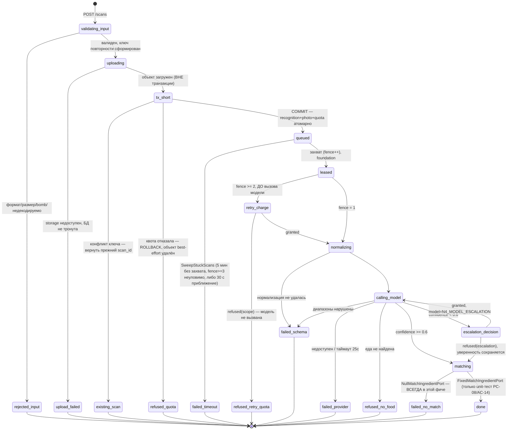

# Фича `scan-pipeline` — псевдокод

Алгоритмический контракт. Имена сущностей, статусов, полей и чисел — из
[`docs/canon.md`](../../canon.md) и [`docs/Pseudocode.md`](../../Pseudocode.md) (Data Structures);
здесь они не переизобретаются. Требования и решения фичи — [`01_specification.md`](01_specification.md).
Ревизия 3 (Попытка 4): закрывает PC-06 (open) и PC2-01/PC2-02 (новые находки) из
[`plan-challenge-2.md`](plan-challenge-2.md) по DEC-A-017; продолжает Ревизию 2 (Попытка 3,
[`plan-challenge.md`](plan-challenge.md), DEC-A-014/DEC-A-015).

## Data Structures

Фича НЕ добавляет и не меняет ни одной колонки канона: `recognition`, `photo`, `scan_quota_counter`
уже несут все нужные поля — их создала миграция `foundation`. **Две зависимости от foundation,
названные явно и требующие координации, а не тихого предположения** (PC-02, PC-09):

1. Предикат выборки воркера (`foundation` `LeaseRecognitionJob`) обязан требовать `photo_id IS NOT
   NULL` в дополнение к `status = 'queued' AND (leased_until IS NULL OR leased_until < now())`, а
   также верхнюю границу `lease_fence < 3` (PC-03). Обе правки принадлежат ЧУЖОМУ файлу
   (`docs/features/foundation/02_pseudocode.md`) и НЕ вносятся этой квитанцией — координатор
   маршрутизирует их в план `foundation` отдельно; эта фича проектируется В ПРЕДПОЛОЖЕНИИ, что они
   там появятся, и явно называет последствие их отсутствия (см. `03_architecture.md`, раздел
   «Зависимости от `foundation`, требующие правки»).
2. `ModelProvider.recognize(image, schema)` (`foundation`, `apps/recognizer/src/provider/types.ts`)
   расширяется до `ModelProvider.recognize(image, schema, { model, deadlineMs })` — вызывающий код
   (эта фича) передаёт МОДЕЛЬ явно, интерфейс сам её не выбирает (PC-09). Та же оговорка: правка
   интерфейса — файл `foundation`, не вносится здесь.

Интерфейсы уровня кода этой фичи (не таблицы):

```
MatchIngredientPort = {
  match(items: RecognizedItem[]): Promise<Array<{
    food_item_id: UUID | null,
    portion_g: Grams,
    source_snapshot: Snapshot | null,
    parts?: Array<{ food_item_id: UUID, share: Confidence, source_snapshot: Snapshot }>   // составное блюдо; У КАЖДОЙ части — СВОЙ Snapshot (PC-08, Попытка 4: контракт симметричен верхнему уровню)
  }>>
}
```

Изменение относительно Попытки 1 (PC-08): порт принимает ВЕСЬ список позиций ОДНИМ вызовом и
возвращает МАССИВ той же длины и порядка — не один `food_item_id`/`Snapshot` на позицию, а запись,
допускающая композицию (`parts[]`) для блюд, раскрываемых `food_synonym.recipe_parts`. Контракт
рассчитан на реальную реализацию `source-and-correct` без переделки вызывающего кода.

Реализация ЭТОЙ фичи — `NullMatchIngredientPort`: для входа длины N возвращает МАССИВ длины N, где
КАЖДЫЙ элемент — `{ food_item_id: null, portion_g: item.mass_g, source_snapshot: null, parts:
undefined }` (в `food_item` нет строк до `source-and-correct`; `parts` ВСЕГДА отсутствует в этой
реализации — раскрытие композиции появляется только вместе с реальным поиском). Тестовых двойников ДВА, и они проверяют РАЗНОЕ
(PC-08 требует разделения):

- **Контрактный тест порта** — прогоняется ПРОТИВ ЛЮБОЙ реализации (в Phase 1 — только против
  `NullMatchIngredientPort`, готов принять реализацию `source-and-correct` без изменений): длина
  ответа равна длине входа, порядок сохранён, `portion_g` всегда положителен, `parts[].share`
  суммируется в 1, если `parts` присутствует.
- **Поведенческий тест `NullMatchIngredientPort`** — конкретно для ЭТОЙ фичи: КАЖДЫЙ элемент несёт
  `food_item_id: null`, ни сети, ни обращения к `food_item` не происходит.

`FixedMatchIngredientPort` (тестовый двойник, используется ТОЛЬКО в unit-тесте инварианта ADR-001,
см. страж в `04_refinement.md`) возвращает МАССИВ с ХОТЯ БЫ одним `food_item_id`, отличным от `null`.

`ModelProvider` (интерфейс и фейк) и `LeaseRecognitionJob` (аренда с fencing) — из `foundation`,
здесь ВЫЗЫВАЮТСЯ, не переопределяются, за вычетом двух названных выше расширений.

## Core Algorithms

### Algorithm: EnqueueScanForFeature

REQUIREMENT: `FR-scan-pipeline-1`
REQUIREMENT: `FR-scan-pipeline-2`
REQUIREMENT: `FR-scan-pipeline-3`
REQUIREMENT: `FR-scan-pipeline-4`
REQUIREMENT: `FR-scan-pipeline-14`
REQUIREMENT: `FR-scan-pipeline-17`
REQUIREMENT: `FR-scan-pipeline-19`
REQUIREMENT: `AC-scan-pipeline-1`
REQUIREMENT: `AC-scan-pipeline-2`
REQUIREMENT: `AC-scan-pipeline-3`
REQUIREMENT: `AC-scan-pipeline-4`
REQUIREMENT: `AC-scan-pipeline-5`
REQUIREMENT: `AC-scan-pipeline-6`
REQUIREMENT: `AC-scan-pipeline-7`
REQUIREMENT: `AC-scan-pipeline-8`
REQUIREMENT: `AC-scan-pipeline-19`
REQUIREMENT: `AC-scan-pipeline-20`
REQUIREMENT: `AC-scan-pipeline-24`
REQUIREMENT: `AC-scan-pipeline-30`
REQUIREMENT: `AC-scan-pipeline-31`
REALISES: SC-US-001-1, SC-US-009-1
INPUT: сессия устройства (`foundation` `CreateDeviceSession`), байты изображения, заявленный
`Content-Type` (НЕ доверенный), заголовок `Idempotency-Key`.
OUTPUT: `202` с `scan_id` и статусом `queued`, ЛИБО отказ валидации, ЛИБО отказ по потолку — и в ОБОИХ
отказных случаях НИ ОДНОЙ видимой воркеру строки `recognition` не остаётся (PC-02).
STEPS:
1. Хук частоты (30/мин `POST`, FR-scan-pipeline-10) — ДО разбора тела.
2. Определить тип по БАЙТАМ (сигнатура, не `Content-Type`, не расширение). `IF` сигнатура не одна из
`{JPEG, PNG, WebP, HEIC}` `THEN RETURN 422 (invalid_image)`. Полиглот — файл, чьи байты ПОСЛЕ конца
структуры основного формата (не только JPEG EOI — тот же принцип для PNG IEND, RIFF-длины WebP,
box-структуры HEIC/ISOBMFF) содержат постороннюю структуру (ZIP local-file-header, `<html`,
второй валидный заголовок изображения) — отвергается тем же путём (PC-05).
3. `IF` заявленные ширина×высота дают распаковку свыше 100 Мпикс `THEN RETURN 422
(decompression_bomb)` — БЕЗ декодирования.
4. `IF` фактический размер файла вне `(0, 12 МБ]` ИЛИ разрешение `< 320×320 px` `THEN RETURN 413|422`
с названной причиной.
5. **Ограниченная проверка декодируемости (PC-04, новый шаг).** Выполнить `sharp(buffer, {
limitInputPixels: 50_000_000 }).metadata()` И декодировать РОВНО одну страницу/кадр (`{ pages: 1 }`)
в память ЦЕЛИКОМ (не только заголовок) — дешёвая, но настоящая проверка, что файл декодируется этим
же кодеком, которым будет пользоваться нормализация. `IF` бросает исключение (испорченный кодек,
усечённый файл, неподдерживаемый вариант контейнера) `THEN RETURN 422 (invalid_image)` — БЕЗ
сохранения оригинала, БЕЗ заявки идемпотентности, БЕЗ обращения к квоте: правдоподобный заголовок с
неразбираемым телом не должен занимать ни один из трёх ресурсов. Это ОТДЕЛЬНАЯ проверка от полной
нормализации (`NormalizePhotoForModel`): она не конвертирует HEIC, не режет до 1568 px и не сжимает
— только доказывает декодируемость дешёвым способом до необратимых шагов.
6. `IF` заголовок `Idempotency-Key` отсутствует ИЛИ не UUID `THEN RETURN 422
(idempotency_key_required)` — формат проверяется ДО любого обращения к хранилищу или базе.
7. **Сгенерировать `recognition_id` (UUID) ДО загрузки и вычислить ключ объекта по НЕМУ, не по
содержимому (PC2-01, отменяет решение Попытки 3):** `object_key = device_session_id + '/' +
recognition_id + '.' + ext`. Хеш содержимого как ключ ОТВЕРГНУТ: два РАЗНЫХ запроса одной сессии с
ОДИНАКОВЫМ фото, но РАЗНЫМИ `Idempotency-Key`, делили бы один объект, и удаление одного скана
(например, при отказе квоты второго) стирало бы фото ПЕРВОГО, уже принятого скана — PC2-01.
Дедупликация одинаковых фото НЕ выполняется: у КАЖДОЙ загрузки — СВОЙ объект, независимо от
содержимого. `recognition_id`, сгенерированный здесь, — тот же, что станет `id` строки `recognition`
на шаге 9.1.
8. **Загрузить оригинал в приватный бакет ДО любой транзакции БД** (`storage`, `PUT` по
`object_key` с шага 7). `IF` `storage` недоступен `THEN RETURN 503 (dependency_unavailable)` — НИ
ОДНОЙ строки БД ещё не существует, откатывать нечего. Соединение с базой на этом шаге не открыто
вовсе — сохранение объекта строго ВНЕ транзакции (`shared-resource-verification.md`).
9. **Одна короткая транзакция БД** (PC-02, заменяет прежние раздельные шаги «заявить ключ» → «списать
квоту» → «сохранить фото»):
   1. `INSERT INTO recognition (id, device_session_id, idempotency_key, status, photo_id, attempt_no,
      escalated, lease_fence) VALUES (:recognition_id_с_шага_7, …, 'queued', :photo_id, 1, false, 0)
      ON CONFLICT (device_session_id, idempotency_key) DO NOTHING RETURNING id` — `id` ЗАДАН заранее
      (шаг 7), а не сгенерирован базой, потому что `object_key` уже ссылается на него. Вставка
      `photo` (см. далее) предшествует вставке `recognition` внутри ЭТОЙ ЖЕ транзакции. `IF` результат
      `INSERT` пуст (конфликт по `(device_session_id, idempotency_key)`, а не по `id` — `id` каждой
      попытки СВОЙ, коллизия по нему исключена генератором UUID) `THEN` это ПОВТОР существующего
      скана: прочитать существующую строку, ROLLBACK эту транзакцию целиком (ни `photo`, ни
      `recognition` этой попытки не сохраняются). Удалить СВОЙ, ТОЛЬКО ЧТО загруженный объект по
      `object_key` шага 7 (PC2-01: он адресован `recognition_id` ЭТОЙ конкретной, отклонённой попытки
      и НИКЕМ, включая существующую строку, не используется — удаление СВОЕГО объекта никогда не
      затрагивает чужой). `RETURN` существующий `scan_id`, `202`, её ТЕКУЩИЙ статус.
   2. `INSERT INTO photo (device_session_id, object_key, mime, bytes, width, height, expires_on,
      file_state) VALUES (…, today + 30 дней, 'present') RETURNING id` — MIME из шага 2 (сигнатура),
      не заявленный клиентом.
   3. Вызвать `CheckAndConsumeQuota(session, ip_prefix, day = today_in_Europe_Moscow_at_this_moment,
      reason = 'primary')` (`foundation`, три ключа) ВНУТРИ этой же транзакции. `day` вычисляется
      РОВНО в момент этого шага, а не переносится из более раннего вызова (FR-scan-pipeline-18,
      PC-06). `IF refused(scope) THEN` **откатить ВСЮ транзакцию** (и `recognition`, и `photo` не
      сохраняются вовсе — не переводятся в `refused`, потому что строки не существует) и после отката
      удалить best-effort СВОЙ (адресованный СВОИМ `recognition_id`, PC2-01) только что загруженный
      объект — удаление ЧУЖОГО объекта здесь структурно невозможно, ключ каждой загрузки уникален по
      построению шага 7; при неудаче best-effort-удаления объект физически бесхозен, но ОГРАНИЧЕН по
      времени: см. шаг 12 (уборка орфанов по возрасту, PC-02) и политику жизненного цикла бакета
      (ADR-010, ЕЩЁ один, независимый рубеж). `RETURN 429` с `{ limit, reset_at (следующая полночь
      Europe/Moscow ОТ ЭТОГО момента), scope }`.
   4. `IF granted THEN` `COMMIT`. Строка `recognition` появляется воркеру ЦЕЛИКОМ и АТОМАРНО: `status
      = 'queued'`, `photo_id` уже установлен, `attempt_no = 1`, `escalated = false`, `lease_fence =
      0` — промежуточного состояния «строка есть, `photo_id` ещё пуст» НЕ существует ни для одного
      внешнего наблюдателя, включая воркер (устраняет гонку PC-02: «между шагами 5–8 воркер может
      захватить незавершённое задание»). Предикат выборки воркера дополнительно требует `photo_id IS
      NOT NULL` (см. «Зависимости от `foundation`» выше) как ВТОРОЙ, defense-in-depth рубеж —
      основной рубеж здесь — атомарность самой транзакции.
10. `IF` это ПЕРВЫЙ скан сессии `THEN` записать `growth_event(type = 'install', …)` (вне транзакции
шага 9, не влияет на её атомарность — потеря этого события не теряет деньги и не создаёт гонку).
11. `RETURN 202` с `{ scan_id, status: 'queued' }` немедленно.
12. **Уборка неудалённых best-effort орфанов (PC-02, дополнение к шагам 9.1/9.3).** Раз в сутки, тем
же прогоном, что и `PurgeExpiredPhotos` (не отдельный сервис): перечислить объекты в бакете по
префиксу `<device_session_id>/` без соответствующей строки `photo.object_key` — по ключу объекта
однозначно виден `recognition_id`, из которого выводится ожидаемый `object_key`; объект, чей
`recognition_id` НЕ найден ни в одной строке `recognition`, старше 1 часа, удаляется. Порог 1 час
(не 30 дней) — best-effort-удаление шагов 9.1/9.3 покрывает подавляющее большинство случаев
синхронно, и этот шаг — сеть безопасности ИМЕННО для редкого краха процесса МЕЖДУ `PUT` и `COMMIT`
(тест: `AC-scan-pipeline-19`), а не основной путь уборки.
COMPLEXITY: O(1) плюс одна загрузка объекта ДО транзакции и одна короткая транзакция; шаг 12 — O(n)
по числу объектов префикса за прогон.

### Algorithm: GetScanStatus

REQUIREMENT: `FR-scan-pipeline-9`
REQUIREMENT: `AC-scan-pipeline-18`
REALISES: SC-US-001-2
INPUT: `scan_id`, вызывающий (сессия либо аккаунт).
OUTPUT: тело статуса скана либо `404`.
STEPS:
1. Хук частоты (120/мин `GET`, FR-scan-pipeline-10) — ДО разбора запроса.
2. Найти `recognition` по `id`. `IF` не найдена `OR` `owner_key` не совпадает `THEN RETURN 404`.
3. Собрать тело: `{ status, items[] (label_ru, mass_g, unmatched, food_item_id), confidence,
low_confidence, escalated, model_estimate_kcal, failure_reason? }`.
4. `food_item_id` каждой позиции — `null` в этой фиче (`NullMatchIngredientPort`); поля полного
контракта проекта (`kcal_total`, `macros`, `sources[]`, `conflict_flag`, `share_card_id`) отсутствуют
либо `null`/`[]` — явное ограничение (см. `01_specification.md` «Стык»).
5. `RETURN 200` с телом и `meta.updated_at = recognition.finished_at ?? recognition.created_at`.
COMPLEXITY: O(1) чтение по первичному ключу.

### Algorithm: NormalizePhotoForModel

REQUIREMENT: `FR-scan-pipeline-5`
REQUIREMENT: `AC-scan-pipeline-9`
REQUIREMENT: `AC-scan-pipeline-10`
REQUIREMENT: `AC-scan-pipeline-25`
REALISES: —
INPUT: `photo.object_key` (оригинал), `photo.mime` (ПОДТВЕРЖДЁННЫЙ по байтам на приёме, шаг 2
`EnqueueScanForFeature` — НЕ «заявленный MIME»: вход уже один раз прошёл проверку сигнатуры, и
нормализатор обязан пользоваться ЕЁ результатом, а не спрашивать заново, PC-05).
OUTPUT: `photo.normalized_object_key`, `photo.normalized_bytes`, ЛИБО `failed(schema_violation)`.
STEPS:
1. Загрузить оригинал по подписанной ссылке (≤ 15 минут). Соединение с базой на этом шаге не
удерживается — транзакция аренды закрыта.
2. Декодировать с ОБЩИМ бюджетом распаковки ≤ 50 Мпикс И входным файлом ≤ 12 МБ (тот же бюджет, что
на приёме, шаг 5 `EnqueueScanForFeature` — не второй, отдельно придуманный лимит). `IF photo.mime =
'image/heic' THEN` декодировать через `libheif`/`sharp` с явным `{ pages: 1 }` — берётся ПЕРВЫЙ
кадр контейнера (HEIC-последовательности/Live Photo несут несколько кадров; политика — всегда
первый, а не «любой удобный»); иначе декодер формата, тоже с `{ pages: 1 }`, если формат допускает
многостраничность (анимированный WebP).
3. **Применить ориентацию EXIF (`rotate()`, автоориентация по тегу `Orientation`) ДО удаления
метаданных** — иначе метаданные стёрты раньше, чем прочитан угол поворота, и повёрнутое на телефоне
фото остаётся повёрнутым в сохранённой копии (PC-05). ЗАТЕМ снять ВСЕ метаданные (`withMetadata:
false`, дефолт `sharp` без явного `withMetadata()`), включая EXIF/GPS.
4. Привести длинную сторону к ≤ 1568 px (не увеличивать, если уже меньше).
5. Сжимать итеративно, пока размер файла не станет ≤ 5 МБ, с явным пределом числа итераций (например
6) — `IF` предел итераций исчерпан и файл всё ещё `> 5 МБ` `THEN` это тоже `failed(schema_violation)`
шага 6, а не бесконечный цикл.
6. `IF` любой шаг 2–5 бросил ошибку ИЛИ исчерпал предел итераций `THEN RETURN
failed(schema_violation)` с названным шагом — вызова модели НЕ делать. Это РЕДКИЙ путь: подавляющее
большинство недекодируемых файлов уже отсеяно шагом 5 `EnqueueScanForFeature`; сюда попадают только
файлы, декодируемые в общем виде, но падающие на конкретной трансформации (ротация неподдерживаемого
типа контейнера, исчерпание памяти на полном разрешении при пройденной облегчённой проверке).
7. Сохранить результат как `photo.normalized_object_key`, `photo.normalized_bytes`. Оригинал не
изменяется.
8. `RETURN` успех.
COMPLEXITY: O(1) операций преобразования на фото; стоимость доминирует декодирование/кодирование.

### Algorithm: RecognizeScanWithinScanPipeline

REQUIREMENT: `FR-scan-pipeline-6`
REQUIREMENT: `FR-scan-pipeline-7`
REQUIREMENT: `FR-scan-pipeline-8`
REQUIREMENT: `FR-scan-pipeline-12`
REQUIREMENT: `FR-scan-pipeline-13`
REQUIREMENT: `FR-scan-pipeline-15`
REQUIREMENT: `FR-scan-pipeline-18`
REQUIREMENT: `FR-scan-pipeline-20`
REQUIREMENT: `NFR-scan-pipeline-1`
REQUIREMENT: `NFR-scan-pipeline-3`
REQUIREMENT: `AC-scan-pipeline-11`
REQUIREMENT: `AC-scan-pipeline-12`
REQUIREMENT: `AC-scan-pipeline-13`
REQUIREMENT: `AC-scan-pipeline-14`
REQUIREMENT: `AC-scan-pipeline-15`
REQUIREMENT: `AC-scan-pipeline-16`
REQUIREMENT: `AC-scan-pipeline-17`
REQUIREMENT: `AC-scan-pipeline-21`
REQUIREMENT: `AC-scan-pipeline-26`
REQUIREMENT: `AC-scan-pipeline-27`
REQUIREMENT: `AC-scan-pipeline-28`
REQUIREMENT: `AC-scan-pipeline-29`
REQUIREMENT: `AC-scan-pipeline-32`
REQUIREMENT: `AC-scan-pipeline-33`
REQUIREMENT: `AC-scan-pipeline-35`
REQUIREMENT: `AC-scan-pipeline-37`
REALISES: SC-US-001-2, SC-US-002-2
INPUT: задание, арендованное `foundation` `LeaseRecognitionJob` (несёт `lease_fence`, `photo_id`,
ГАРАНТИРОВАННО непустой — см. «Зависимости от `foundation`»).
OUTPUT: `recognition` в терминальном статусе `failed` или `refused` (`done` НЕ достигается в этой
фиче реальным `NullMatchIngredientPort` — путь к `done` проверяется отдельно, unit-тестом с
`FixedMatchIngredientPort`).
STEPS:
1. Аренда уже взята, транзакция закрыта (`foundation`). Запомнить `fence = lease_fence`, `attempt_id
= recognition_id + ':' + fence + ':' + (escalated ? 'escalation' : 'primary')` (PC-07, ключ
корреляции `START`/`OUTCOME`).
1а. **Общий бюджет задачи = `created_at + 30 с` (PC-03 + PC2-02, замена приближения Попытки 3).**
`remaining = 30_000мс − (now() − created_at)`. `IF remaining ≤ 0 THEN` немедленно, БЕЗ вызова модели
и БЕЗ нового списания квоты, записать `failed(timeout)` условно по `fence` (механизм шага 9) и
`RETURN` — задание простояло в очереди (все воркеры были заняты дольше 30 с) или уже исчерпало бюджет
на предыдущих попытках; попытка НЕ производилась, платить не за что. Это закрывает ту часть PC2-02,
где «интервал опроса 1 с не ограничивает очередь при занятых воркерами»: воркер, взявший просроченное
задание, обязан отказаться от него САМ, не полагаясь только на `SweepStuckScans`.
2. **Повторная попытка после истечения аренды ИЛИ смены суток списывает СВОЮ квоту (PC-01 + PC-06,
закрывает найденную дыру).** Вычислить `day = day(now(), Europe/Moscow)`. `IF fence = 1 AND day =
day(created_at, Europe/Moscow) THEN` попытка №1 уже оплачена шагом 9.3 `EnqueueScanForFeature` в ТОТ
ЖЕ день — переходить к шагу 3 без нового списания. `IF fence ≥ 2 OR day ≠ day(created_at,
Europe/Moscow)` (повторный захват — предыдущий воркер не уложился в 60 с аренды; ЛИБО первый захват
произошёл уже в СЛЕДУЮЩИЕ сутки после полуночи Europe/Moscow относительно `created_at` — приём и
первый захват разделены `≤ 1 с` в норме, но при перегруженном пуле воркеров задержка первого захвата
способна пересечь полночь) `THEN` ДО загрузки фото и ДО вызова модели вызвать
`CheckAndConsumeQuota(session, ip_prefix, day, reason = 'primary')` — ЕЩЁ ОДНО списание трёх ключей
по ТЕКУЩЕМУ `day`. Это СОЗНАТЕЛЬНЫЙ перерасход в сторону строгости при пограничном первом захвате
(редкий случай: перегрузка воркеров ровно на границе суток), а не молчаливый пробел — координатор
(DEC-A-017) предпочитает лишнее списание пропущенному. `IF refused(scope) THEN` записать
`refused(quota_exhausted_${scope})` условно по `fence` (шаг 9) и `RETURN` — модель на этой попытке не
вызывается; это ОТКАЗ ДО вызова (DEC-A-014). `fence = 4` невозможен по построению — предикат захвата
`foundation` ограничивает `lease_fence < 3` (см. «Зависимости от `foundation`»); при обнаружении
`fence > 3` (защита от регресса) `THEN` немедленно `failed(timeout)` без вызова модели.
3. Вычислить `callDeadlineMs = min(25_000, remaining)` (шаг 1а, ПЕРЕСЧИТАННЫЙ после возможного
списания квоты шага 2 — время не останавливается). Вызвать `NormalizePhotoForModel` под ТЕМ ЖЕ
`AbortController`, что и модель на шаге 4 (единый бюджет операции, не два независимых таймаута). `IF
failed THEN` записать `failed(schema_violation)` условно по `fence` (шаг 9) и `RETURN`. `IF`
`AbortController` сработал по общему дедлайну ДО завершения нормализации `THEN failed(timeout)` —
нормализация не оплачивается отдельно, вызова модели не было.
4. Определить модель ЯВНО: `model = escalated ? N4_MODEL_ESCALATION : N4_MODEL_PRIMARY` (значения
окружения канона, ADR-004; `foundation` не выбирает модель сама — см. «Зависимости от `foundation`»,
подтверждено координатором 2026-09-12 20:33, см. `03_architecture.md`). Вызвать
`ModelProvider.recognize(normalizedImage, schema, { model, deadlineMs: callDeadlineMs })` на ТОМ ЖЕ
`AbortController`, что и `NormalizePhotoForModel` — по истечении ОБЩЕГО бюджета `AbortController`
обрывает HTTP-вызов НЕМЕДЛЕННО, платная работа не продолжается ни на секунду сверх бюджета (PC2-02:
«живой воркер сам прекращает работу по своему дедлайну»). **Скрытые повторы SDK провайдера отключены
явно** (`maxRetries: 0` при создании клиента). Записать `model_call` (FR-scan-pipeline-12): `START`
немедленно ПЕРЕД вызовом (`{ request_id, attempt_id, scan_id, fence, reason: escalated ? 'escalation'
: 'primary', model, mode: N4_MODEL_PROVIDER, day, ts }`), `OUTCOME` сразу после ответа/ошибки/обрыва
(`{ attempt_id (тот же, ключ корреляции), outcome: 'ok'|'failed'|'timeout'|'late', ms, input_tokens?,
output_tokens? }`). Если процесс упал МЕЖДУ `START` и `OUTCOME`, `START` уже записан в
структурированный вывод (не буферизуется) — агрегатор `scripts/telemetry/model-calls.sh`
(FR-scan-pipeline-21, ЭТА фича его РЕАЛИЗУЕТ, не только планирует) сопоставляет `attempt_id` и метит
непарные `START` старше грейс-периода как `outcome: 'unknown'`; счёт в потолках это НЕ меняет — квота
списана ДО вызова. `IF` ответ не соответствует схеме `THEN failed(schema_violation)`. `IF` провайдер
недоступен `THEN failed(provider_unavailable)`. `IF` `AbortController` оборвал вызов по бюджету `THEN
failed(timeout)`, `outcome: 'timeout'`.
5. Проверить ДИАПАЗОНЫ в коде: `confidence` в 0…1; `mass_g` каждой позиции в 1…5000; позиций ≤ 12;
кандидатов на позицию ≤ 3; `model_estimate_kcal ≥ 0`. `IF` нарушено `THEN failed(schema_violation)`
с названным полем — без подрезания.
6. `IF` модель не нашла еды `THEN refused(no_food_detected)`, дневник не создаётся, `RETURN`.
7. `IF confidence < 0,6 AND escalated = false THEN` ПЕРЕД любым решением об эскалации пересчитать
`remaining = 30_000мс − (now() − created_at)` (VS-05, ре-валидатор: эскалация — ВТОРОЙ полный вызов
и обязана делить ОДИН бюджет 30 с с первым, а не получать собственные 25 с сверху). `IF remaining <
8_000мс THEN` эскалация НЕ ВЫПОЛНЯЕТСЯ вовсе: `low_confidence = true` устанавливается НАПРЯМУЮ, БЕЗ
вызова `CheckAndConsumeQuota(reason='escalation')` и БЕЗ события `model_call` для этой несостоявшейся
попытки — оставшегося времени недостаточно даже для одной попытки получить ответ с разумным запасом до
общего дедлайна, и тратить деньги на вызов, обречённый быть отброшенным как `late` (шаг 9), не имеет
смысла: это НЕ то же самое, что отказ по квоте (`quota_exhausted_escalation`) — попытка не была
ОТКАЗАНА, она вообще не была ПРЕДПРИНЯТА. Порог `8 с` — запас: дедлайн одного вызова модели не может
быть короче нескольких секунд и иметь шанс на осмысленный ответ. `ELSE` (`remaining ≥ 8_000мс`)
вызвать `CheckAndConsumeQuota(session, ip_prefix, day = today_in_Europe_Moscow_ПРЯМО_СЕЙЧАС, reason =
'escalation')` — четвёртый ключ, `day` СВОЙ, вычисленный в момент этого решения (PC-06). `IF granted
THEN` пересчитать `callDeadlineMs = min(25_000, remaining)` (дедлайн ВТОРОГО вызова делит ОСТАТОК
общего бюджета, не получает полные 25 с заново) и вернуться к шагу 4 с `model = N4_MODEL_ESCALATION`,
`escalated = true`, `attempt_no = 2`. `ELSE` (квота отказала) эскалации нет: запомнить
`failure_reason_candidate = quota_exhausted_escalation` для шага 8, если статус окажется `done`
(сегодня — не происходит, шаг 8).
8. Вызвать `MatchIngredientPort.match(items)` — ОДИН вызов на ВЕСЬ список позиций (PC-08). Для
каждого элемента ответа: `IF food_item_id != null THEN` позиция сопоставлена, `Snapshot =
source_snapshot`; иначе `unmatched = true`, `food_item_id = null`. `IF` (составное блюдо) `parts`
присутствует `THEN` раскрыть в компоненты — логика вне объёма этой фичи (`NullMatchIngredientPort`
никогда не возвращает `parts`). `IF` ни одна позиция не сопоставлена (в этой фиче — ВСЕГДА при
`NullMatchIngredientPort`) `THEN` статус `failed(no_food_matched)` (DEC-A-014: попытка ОПЛАЧЕНА и
ОБРАБОТАНА моделью — это не отказ ДО вызова, а необработанный результат). `failure_reason_candidate`
шага 7 в ЭТОМ прогоне НЕ записывается — доказывается отдельным unit-тестом с `FixedMatchIngredientPort`
(AC-scan-pipeline-14), где `done`/`low_confidence`/`quota_exhausted_escalation` записываются
по-настоящему.

   **Согласование с ADR-001 Confirmation (2) — явно, не подразумеваемо (PC-08).** Root-уровневый
   `ADR.md` называет терминалом ИМЕННО `refused(no_food_matched)` для нулевого совпадения — это
   решение написано для МИРА, где матчинг РЕАЛЬНО ИСКАЛ и не нашёл (`source-and-correct`). В этой
   фиче матчинг не ищет вовсе (`NullMatchIngredientPort` — заглушка, а не поиск с нулевым
   результатом), и DEC-A-014 называет это ДРУГИМ по природе событием: `failed`, а не `refused`.
   Ожидание: когда `source-and-correct` подставит РЕАЛЬНЫЙ порт, генуинный «искали и не нашли»
   вернётся к `refused(no_food_matched)` из root ADR-001, и `failed(no_food_matched)` из этой фичи
   исчезнет вместе с `NullMatchIngredientPort`. До тех пор оба документа (root `ADR.md` и эта фича)
   намеренно расходятся, и расхождение НАЗВАНО, а не тихо перекрыто. Координатор подтверждает эту
   трактовку явно на чекпойнте — она не выводится автоматически ни из ADR-001, ни из DEC-A-014.
9. **ПЕРЕД записью — последняя проверка бюджета.** `IF now() > created_at + 30 с` (бюджет истёк, ПОКА
шёл вызов модели — ответ пришёл, но ПОЗДНО) `THEN` результат НЕ применяется: записать `model_call
OUTCOME { attempt_id, outcome: 'late', ms }` — попытка ОПЛАЧЕНА (модель ответила, счёт уже списан) и
УЧТЕНА (событие есть), но её содержимое отбрасывается; условная запись ниже в этом случае пишет
`failed(timeout)` вместо содержательного статуса — деньги потрачены, результата пользователь не
увидит, это НАЗВАННАЯ, а не скрытая цена. `ELSE` записать результат УСЛОВНО: `UPDATE recognition SET
status = …, finished_at = now(), leased_until = NULL, lease_owner = NULL, … WHERE id = :scan_id AND
lease_fence = :fence AND status = 'queued'` — условие `status = 'queued'` ДОБАВЛЕНО к условию по
`fence` (PC-03): взаимоисключает запись воркера с `SweepStuckScans` (у sweeper'а нет `fence` — только
право переводить `queued` в `failed(timeout)`, и ТОЛЬКО для строк с ИСТЁКШЕЙ арендой, см.
`SweepStuckScans` правило В — живой воркер в пределах СВОЕЙ аренды sweeper'ом не трогается, он сам
следит за своим бюджетом шагами 1а/3/4). `IF` затронуто НОЛЬ строк `THEN` результат ОТБРОСИТЬ: если
проиграл гонку ДРУГОМУ воркеру — записать `stale_lease_result`; если проиграл гонку `SweepStuckScans`
(статус уже не `queued`) — записать `swept_as_timeout`. Различить эти два случая ПОСЛЕ факта:
перечитать строку, сравнить `status`.
COMPLEXITY: O(k) на позицию (k ≤ 12) плюс O(1) на решение по каждому шагу.

### Algorithm: SweepStuckScans

REQUIREMENT: `FR-scan-pipeline-16`
REQUIREMENT: `AC-scan-pipeline-22`
REQUIREMENT: `AC-scan-pipeline-23`
REQUIREMENT: `AC-scan-pipeline-36`
REALISES: — (сценария `SC-US-nnn-k` нет; PC-03 — инженерный дедлайн, не пользовательский путь)
INPUT: текущее время, тот же цикл опроса `recognizer` (интервал 1 с, `foundation`), что и захват
задания — ОТДЕЛЬНОГО сервиса не заводится.
OUTPUT: терминальный статус `failed(timeout)` на застрявших заданиях.
STEPS:
1. **Правило А — никогда не захвачено.** `UPDATE recognition SET status = 'failed', failure_reason =
'timeout', finished_at = now() WHERE status = 'queued' AND leased_until IS NULL AND created_at <
now() - interval '5 minutes' AND status = 'queued'` — задание простояло в очереди 5 минут, ни один
воркер его не взял (пул воркеров исчерпан либо остановлен). Условие `status = 'queued'` в `WHERE`
сразу и есть защита от гонки: если воркер В ЭТОТ МОМЕНТ захватывает задание, `UPDATE` затрагивает 0
строк, и это НЕ ошибка (следующий тик sweeper'а его уже не увидит, `leased_until` станет не-`NULL`).
2. **Правило Б — предел захватов исчерпан.** Задание с `lease_fence = 3`, чья аренда истекла
(`leased_until < now()`), НЕИЗБЕЖНО становится незахватываемым: предикат выборки `foundation`
ограничивает `lease_fence < 3` (см. «Зависимости от `foundation`»), значит такое задание не
предложится НИ ОДНОМУ воркеру и провисит в `queued` вечно без sweeper'а. `UPDATE recognition SET
status = 'failed', failure_reason = 'timeout', finished_at = now() WHERE status = 'queued' AND
lease_fence >= 3 AND leased_until < now()`.
3. **Правило В — общий дедлайн задачи 30 с, ТОЛЬКО для заданий БЕЗ живого воркера (PC-03, переписано
по PC2-02).** Колонки `first_leased_at` в каноне нет, эта фича её не добавляет; прокси — `created_at`
(первый захват — в пределах ≤ 1 с интервала опроса при свободном пуле воркеров). Критическая правка
относительно Попытки 3: условие ОБЯЗАНО включать `leased_until < now()` — то есть sweeper НИКОГДА не
трогает задание, чья аренда ЕЩЁ ДЕЙСТВУЕТ, потому что живой воркер отслеживает СВОЙ бюджет сам (шаги
1а/3/4 `RecognizeScanWithinScanPipeline`, `AbortController`) и либо успевает записать терминальный
статус САМ, либо его аренда естественно истекает после 60 с, и ТОЛЬКО ТОГДА sweeper вправе действовать.
Без этого условия (как было в Попытке 3) sweeper мог перевести в `failed(timeout)` задание, которое в
этот момент ЕЩЁ обрабатывает живой воркер внутри своей аренды — PC2-02: «sweeper завершает задание, но
не прекращает платную работу». `UPDATE recognition SET status = 'failed', failure_reason = 'timeout',
finished_at = now() WHERE status = 'queued' AND lease_fence >= 1 AND created_at < now() - interval '30
seconds' AND (leased_until IS NULL OR leased_until < now())`. Задание, чей воркер уложился в СВОЙ
бюджет (шаг 1а обнаружил `remaining ≤ 0` и сам записал `failed(timeout)` ДО того, как аренда истекла),
sweeper этим правилом уже не находит — строка не в `queued`.
4. **Правило Г — исключить захват уже просроченных заданий (PC2-02, «интервал опроса не ограничивает
очередь при занятых воркерами»).** Предпочтительный рубеж — предикат ВЫБОРКИ `foundation`
(`WHERE … AND created_at > now() - interval '30 seconds'`, зависимость, см. `03_architecture.md`);
ОБЯЗАТЕЛЬНЫЙ рубеж этой фичи, действующий НЕЗАВИСИМО от того, обновлён ли предикат `foundation`, —
шаг 1а `RecognizeScanWithinScanPipeline`: воркер, УЖЕ захвативший просроченное задание (потому что
предикат `foundation` его не отфильтровал), обязан САМ отказаться от платной работы немедленно.
Отсюда два независимых рубежа для одного свойства — ЭТО НЕ ИЗБЫТОЧНОСТЬ ПРОСТО ТАК: предикат экономит
захват впустую (эффективность), шаг 1а гарантирует корректность ДАЖЕ если предикат не обновлён
(defense-in-depth, тот же принцип, что `photo_id IS NOT NULL`).
5. Каждое правило — отдельный, идемпотентный `UPDATE` со СВОИМ `WHERE`; повторный прогон не находит
уже переведённых строк.
COMPLEXITY: O(n) по числу застрявших строк на прогон; индексы `(status, leased_until)` и
`(status, created_at)` держат стоимость малой относительно общего объёма `queued`.

### Algorithm: RateLimitScanRoutes

REQUIREMENT: `FR-scan-pipeline-10`
REALISES: —
INPUT: входящий запрос к `/api/v1/scans` (POST) либо `/api/v1/scans/{id}` (GET).
OUTPUT: продолжение обработки либо `429` без разбора тела.
STEPS:
1. Хук `onRequest` (ДО разбора тела) выбирает порог по МЕТОДУ: `POST` → 30/мин на `ip_prefix`; `GET`
→ 120/мин на `ip_prefix`. Расширение общего ограничителя `foundation`, не второй счётчик.
2. `IF` порог превышен `THEN RETURN 429` без разбора тела, тело не пишется в журнал (DEC-A-013).
3. `ELSE` передать дальше: валидация → декодируемость → идемпотентность → квота → вызов модели.
COMPLEXITY: O(1) на запрос.

### Algorithm: PurgeExpiredPhotos

REQUIREMENT: `FR-scan-pipeline-11`
REQUIREMENT: `NFR-scan-pipeline-2`
REALISES: —
INPUT: текущая дата, размер батча.
OUTPUT: удалённые объекты и обновлённые строки `photo`.
STEPS:
1. Раз в сутки батч `photo` с `expires_on < today AND file_state = 'present'`.
2. Удалить объект из бакета (оригинал и `normalized_object_key`, если есть); отсутствие объекта —
тоже успех.
3. `file_state → purged`, строка `photo` СОХРАНЯЕТСЯ.
4. Политика жизненного цикла бакета — второй, независимый от строки `photo` рубеж (см. PC-02, шаг 9.3
`EnqueueScanForFeature`: она же ловит объекты без ЛЮБОЙ ссылающейся строки).
5. Повторный прогон в тот же день — ноль действий.
COMPLEXITY: O(b) на прогон, b — размер батча.

### Algorithm: AggregateModelCallLog

REQUIREMENT: `FR-scan-pipeline-21`
REQUIREMENT: `AC-scan-pipeline-34`
REALISES: — (инструмент наблюдаемости, не пользовательский сценарий)
INPUT: JSON-журнал `api`+`recognizer` за сутки (стандартный вывод процессов, собранный платформой),
дата.
OUTPUT: счётчики попыток по `reason`/`outcome`/`model` и суммарное `ms`, напечатанные в stdout.
STEPS:
1. Прочитать строки журнала за сутки (файл или поток, путь — аргумент скрипта); каждая строка —
JSON-объект `model_call` (`START` или `OUTCOME`, различаются наличием поля `outcome`).
2. Сгруппировать `OUTCOME`-строки по `attempt_id` = `<recognition_id>:<fence>:<reason>` — ключ
корреляции с соответствующим `START` (FR-scan-pipeline-12).
3. `IF` `START` без парного `OUTCOME` старше грейс-периода (2 минуты — с запасом над дедлайном 25 с
одного вызова) `THEN` учесть как `outcome: 'unknown'` в агрегате, не отбрасывать.
4. Посчитать: число попыток на `(reason, outcome, model)`; сумму и среднее `ms` на ту же группировку;
долю эскалаций от первичных попыток за сутки.
5. Напечатать таблицу в stdout (человекочитаемо и `--json` для скриптов). Служебная СТРАНИЦА
(веб-интерфейс с ролью-владельцем и обновлением ≤ 5 минут) — ПЛАН, явно ВНЕ недели MVP; этот скрипт —
только источник ЧИСЕЛ по требованию, не постоянно работающий сервис.
COMPLEXITY: O(L) по числу строк журнала за сутки.

## API Contracts

```
POST /api/v1/scans
  Cookie: n4_session=<токен> — обязательна
  Content-Type: multipart/form-data
  Idempotency-Key: <UUID> — ОБЯЗАТЕЛЕН
  Body: файл изображения (JPEG/PNG/WebP/HEIC ≤ 12 МБ, ≥ 320×320 px, декодируемый ≤ 50 Мпикс)
  Response 202: { "data": { "scan_id": "<uuid>", "status": "queued" }, "meta": { "request_id": "<uuid>" } }
  Response 401: нет сессии
  Response 413 | 422: { "error": { "code": "invalid_image" | "decompression_bomb", "message": "<причина>" } }
  Response 422: { "error": { "code": "idempotency_key_required" } }
  Response 429: { "error": { "code": "rate_limited" } } ИЛИ { "error": { "code": "quota_exhausted" }, "data": { "limit": n, "reset_at": "<ts>", "scope": "user" | "global" } }
  Response 503: { "error": { "code": "dependency_unavailable" } }

GET /api/v1/scans/{id}
  Cookie: n4_session=<токен>
  Response 200: { "data": { "status": "queued" | "failed" | "refused" | "done",
                             "items": [ { "label_ru": string, "mass_g": number, "unmatched": boolean, "food_item_id": null } ],
                             "confidence": number | null, "low_confidence": boolean, "escalated": boolean,
                             "model_estimate_kcal": number | null, "failure_reason": string | null },
                  "meta": { "request_id": "<uuid>", "updated_at": "<ts>" } }
  Response 401: нет сессии
  Response 404: чужой ИЛИ несуществующий id — ОДИН и тот же ответ
```

## State Transitions



## Error Handling Strategy

| Категория | Пример | Ответ и действие |
|---|---|---|
| вход не по содержимому / полиглот | `.jpg` с байтами не-JPEG, посторонняя структура после конца формата | `422 invalid_image` до квоты и до записи |
| decompression bomb | заявленные размеры > 100 Мпикс | `422 decompression_bomb` до декодирования |
| недекодируемо | правдоподобный заголовок, кодек не разбирает тело | `422 invalid_image` до загрузки объекта, до идемпотентности, до квоты |
| нет ключа повторности | `Idempotency-Key` отсутствует/не UUID | `422 idempotency_key_required` до загрузки и квоты |
| storage недоступен при загрузке | `PUT` оригинала падает | `503 dependency_unavailable`, БД не тронута |
| повтор ключа | тот же ключ, та же сессия | `202` с прежним `scan_id`, транзакция не открывалась заново |
| квота исчерпана (приём) | `used = limit` на любом из трёх ключей `primary` | `429` со `scope`; ROLLBACK всей транзакции — ни `recognition`, ни `photo` не сохраняются |
| квота исчерпана (повторный захват) | `fence ∈ {2,3}`, потолок исчерпан | `refused(quota_exhausted_${scope})`, модель не вызвана |
| нормализация не удалась | нечитаемый на конкретной трансформации файл | `failed(schema_violation)`, вызова модели нет |
| провайдер недоступен/таймаут | сеть, 5xx, 25 с дедлайн | `failed(provider_unavailable\|provider_timeout)`, попытка списана |
| диапазон нарушен | `confidence = 7` | `failed(schema_violation)` с названным полем, без подрезания |
| еда не найдена | пустой список ингредиентов | `refused(no_food_detected)`, дневник не создаётся |
| эскалация отказана | `scope = escalation` исчерпан | второй вызов не делается; в этой фиче ведёт к `failed(no_food_matched)` |
| нет совпадения в базе | `NullMatchIngredientPort` — всегда | `failed(no_food_matched)` (DEC-A-014) |
| устаревший захват | `UPDATE` результата затронул 0 строк, статус ещё `queued` | `stale_lease_result` в аудит |
| задание сметено sweeper'ом | `UPDATE` результата затронул 0 строк, статус уже `failed(timeout)` | `swept_as_timeout` в аудит |
| никогда не захвачено / предел захватов | `queued` дольше 5 мин, либо `fence=3` с истёкшей арендой | `SweepStuckScans` → `failed(timeout)` |
| чужой/несуществующий ресурс | `GET /scans/{id}` | ОДИН `404` для обоих случаев |
| частота превышена | сверх 30/мин (POST) или 120/мин (GET) | `429` до разбора тела |

## Scenario Coverage

Scenarios in 01_specification.md: 5  ·  claimed by an algorithm: 4

Not claimed by any algorithm:
| Scenario | Reason |
|---|---|
| SC-US-002-1 | out-of-mvp-scope |

Claimed by an algorithm but absent from 01_specification.md:
| Algorithm | Claimed ID |
|---|---|
| none | none |
