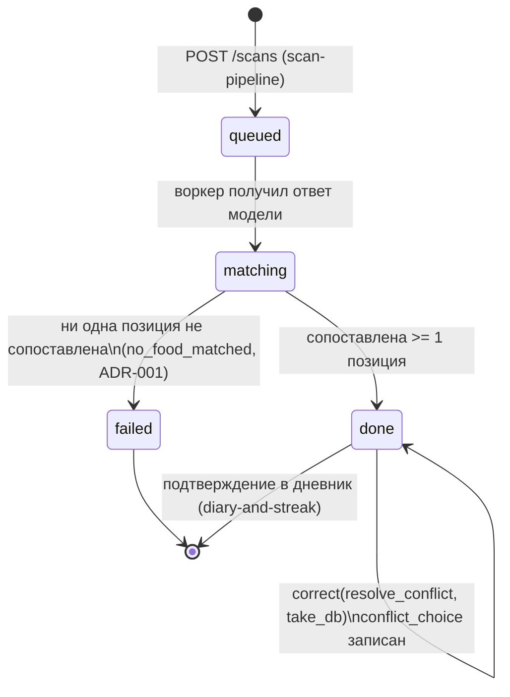

# Фича `source-and-correct` — псевдокод

**Ревизия 2** (DEC-A-023): терминальный статус при нуле сопоставлений — `failed(no_food_matched)`;
`resolve_conflict` принимает единственное значение `take_db`.

Алгоритмы и контракт маршрута. Логическая модель проекта принадлежит
[`docs/Pseudocode.md`](../../Pseudocode.md) и здесь не переписывается: ниже только ИЗМЕНЕНИЯ полей и
алгоритмы, которые создаёт эта фича. Порт `MatchIngredientPort` объявлен фичей `scan-pipeline`
([`02_pseudocode.md`](../scan-pipeline/02_pseudocode.md), Data Structures) и здесь РЕАЛИЗУЕТСЯ, а не
переопределяется.

## Data Structures

Новых сущностей НЕТ: канон §4 объявляет ровно 14, и пятнадцатая была бы изобретением. Изменения —
колонки существующих таблиц и типы уровня кода.

### Изменения полей существующих сущностей

| Сущность | Поле | Тип | Зачем |
|---|---|---|---|
| `recognition` | `corrections` | `jsonb`, `NOT NULL DEFAULT '[]'` | история поправок: список записей `{ at: Timestamp, op, index, from: {label_ru, food_item_id?, mass_g}, to: {food_item_id?, mass_g?} }`. Материал курации синонимов (FR-SOURCE-003), а не журнал ради журнала |
| `recognition` | `conflict_choice` | `text?`, `CHECK (conflict_choice IS NULL OR conflict_choice = 'take_db')` | выбор пользователя на экране расхождения; закрытое множество из ОДНОГО значения объявлено в СХЕМЕ, а не только в коде — иначе значение, отвергнутое решением DEC-A-023, доедет до экрана как чей-то выбор |
| `recognition` | `conflict_choice_at` | `Timestamp?` | когда выбор сделан; отсутствие отличается от «выбрал по умолчанию» |
| `recognition` | `user_corrected` | `boolean NOT NULL DEFAULT false` | блюдо правил человек: порция либо состав |
| `food_item` | — | — | без изменений; строки СОЗДАЁТ импорт этой фичи |
| `food_synonym` | — | — | без изменений; строки СОЗДАЁТ seed этой фичи |

`recognition.items` (jsonb, существует) получает наполненную форму элемента — форма уже объявлена
`scan-pipeline`, здесь впервые заполняются поля, которые заглушка оставляла пустыми:

```
RecognizedItem = {
  label_ru: string,                 // от модели
  mass_g: Grams,                    // от модели, правится пользователем
  original_mass_g: Grams,           // оценка модели ДО правок; хранится рядом, не затирается
  candidates: string[],             // до трёх идентификаторов записей базы, от модели
  unmatched: boolean,               // true — записи базы нет, позиция исключена из итога
  food_item_id: UUID | null,
  source_snapshot: Snapshot | null,
  parts?: Array<{ food_item_id: UUID, share: Confidence, mass_g: Grams, source_snapshot: Snapshot }>,
  kcal: Kcal | null,                // null И ЕСТЬ «не измерено»; ноль сюда не пишется
  protein: Macro | null, fat: Macro | null, carb: Macro | null
}
```

### Типы уровня кода (не таблицы)

```
Snapshot = {
  source: 'USDA-FDC',
  source_id: string,                // fdc_id записи
  name_en: string,
  kcal_per_100g: Kcal,
  protein_per_100g: Macro, fat_per_100g: Macro, carb_per_100g: Macro,
  portion_g: Grams,                 // использованная порция, НЕ default_portion_g записи
  import_snapshot_date: Date
}

UsdaMatchIngredientPort implements MatchIngredientPort   // сигнатура из scan-pipeline, не меняется
FoodSearchResult = Array<{ food_item_id: UUID, name_ru?: string, name_en: string,
                           default_portion_g: Grams | null, kcal_per_100g: Kcal,
                           protein_per_100g: Macro, fat_per_100g: Macro, carb_per_100g: Macro,
                           similarity: Confidence }>
SeedSynonymRow = { name_ru: string, food_item_source_id?: string,
                   recipe_parts?: Array<{ food_item_source_id: string, share: Confidence }>,
                   curated_by: string }
```

Seed ссылается на `food_item_source_id` (`fdc_id`), а НЕ на `food_item.id`: идентификаторы строк
выдаёт база при импорте, и файл, прибитый к ним гвоздями, стал бы непереносимым между окружениями.

## Core Algorithms

### Algorithm: ImportFdcDump

REQUIREMENT: `FR-source-and-correct-1`
REQUIREMENT: `AC-source-and-correct-1`
REQUIREMENT: `AC-source-and-correct-2`
REALISES: —
INPUT: каталог с распакованными CSV-дампами FDC (Foundation Foods, SR Legacy, FNDDS 2021-2023),
аргумент `--snapshot-date` (дата публикации набора).
OUTPUT: строки `food_item`; отчёт импорта (принято / отвергнуто с причинами).
STEPS:
1. IF каталог не назван, не существует, либо в нём нет ожидаемых файлов (`food.csv`,
   `food_nutrient.csv`, `nutrient.csv`, `food_portion.csv`) THEN завершить ненулевым кодом с
   названием недостающего файла. Скрипт НЕ скачивает дампы: скачивание — шаг оператора с URL и
   sha256, и делать сборку зависимой от доступности чужого сервиса незачем.
2. IF `--snapshot-date` отсутствует либо не разбирается как дата THEN отказ. Подстановка «сегодня»
   ЗАПРЕЩЕНА: снимок описывает ДАННЫЕ, а не момент заливки, и тихая подстановка сделала бы каждую
   строку источника недостоверной, оставив её правдоподобной.
3. Прочитать соответствие идентификаторов нутриентов: энергия (ккал), белок, жир, углеводы.
4. FOR EACH запись `food.csv` из трёх наборов:
   4.1. Собрать четыре значения на 100 г. IF отсутствует ХОТЯ БЫ одно THEN записать в отчёт
        `rejected(missing_nutrient, fdc_id, имя поля)` и CONTINUE. Ноль не подставляется: строка с
        нулём неотличима от настоящего нулевого продукта и однажды станет чьим-то итогом.
   4.2. `default_portion_g` — масса первой порции FNDDS этой записи, если она есть; иначе `NULL`.
        Ни 100, ни иное «разумное» значение: отсутствующая порция — отсутствующая.
   4.3. `INSERT INTO food_item (…) VALUES (…) ON CONFLICT (source, source_id) DO UPDATE SET
        name_en = EXCLUDED.name_en, kcal_per_100g = EXCLUDED.kcal_per_100g, … ,
        import_snapshot_date = EXCLUDED.import_snapshot_date`. `id` строки НЕ меняется: на него
        ссылаются `food_synonym` и снимки в уже сохранённых `recognition`.
5. Записать отчёт: принято, отвергнуто по причинам, дата снимка, число строк в таблице.
COMPLEXITY: O(n) по числу записей дампа, одна транзакция на пакет из 1000 строк.

### Algorithm: NormalizeRuName

REQUIREMENT: `AC-source-and-correct-3`
REALISES: —
INPUT: произвольная строка русского названия блюда.
OUTPUT: нормализованная форма для точного и триграммного поиска.
STEPS:
1. Привести к нижнему регистру.
2. Заменить `ё` на `е`. Иначе «варёная» и «вареная» — два разных ключа, и половина курации
   промахивается на диакритике, которую пользователи не набирают.
3. Оставить только `\p{L}` и `\p{N}` с флагом `/u`, прочее заменить пробелом. `\w` с кириллицей НЕ
   совпадает и вырезал бы русское название целиком (грабля стека, `.claude/rules/coding-style.md`).
4. Отбросить стоп-слова `с, из, по, на, и, в, для` как ОТДЕЛЬНЫЕ токены, а не подстроки: иначе «сыр»
   потерял бы первую букву.
5. Схлопнуть пробелы, обрезать края. RETURN результат.
COMPLEXITY: O(m) по длине строки.

### Algorithm: SeedFoodSynonyms

REQUIREMENT: `FR-source-and-correct-2`
REQUIREMENT: `AC-source-and-correct-4`
REALISES: —
INPUT: `packages/db/seed/food-synonym.ru.json` (100 строк `SeedSynonymRow`).
OUTPUT: строки `food_synonym`; отчёт загрузки.
STEPS:
1. FOR EACH строка seed:
   1.1. IF заполнены ОБА поля (`food_item_source_id` и `recipe_parts`) либо НИ ОДНО THEN отказ
        строки с названной причиной. Это дублирует `CHECK` базы намеренно: код называет строку
        файла, база называет ограничение, и лечить нужно файл.
   1.2. IF `recipe_parts` присутствует THEN проверить `|сумма share − 1| <= 0,001`. IF нарушено
        THEN отказ строки. Нормализация долей ЗАПРЕЩЕНА: сумма 0,9 даёт число на 10% меньше
        настоящего, и пользователь увидит его как измеренное.
   1.3. Разрешить каждый `food_item_source_id` в `food_item.id`. IF запись не найдена THEN отказ
        строки с названием `fdc_id`: синоним, указывающий в пустоту, хуже отсутствующего.
   1.4. `name_ru_normalized = NormalizeRuName(name_ru)` — тем же кодом, что и поиск. Ручная
        нормализация в файле запрещена: два места с одним правилом расходятся молча.
   1.5. Вставить строку с `curated_by` из файла и `curated_at = now()`.
2. IF отвергнута хотя бы одна строка THEN завершить ненулевым кодом, перечислив их. Частично
   загруженная курация — это молчаливо уменьшенное покрытие.
COMPLEXITY: O(s) по числу строк seed, s = 100.

### Algorithm: SearchFoodCandidates

REQUIREMENT: `FR-source-and-correct-3`
REQUIREMENT: `NFR-source-and-correct-1`
REQUIREMENT: `AC-source-and-correct-5`
REQUIREMENT: `AC-source-and-correct-6`
REQUIREMENT: `AC-source-and-correct-7`
REQUIREMENT: `AC-source-and-correct-25`
REALISES: —
INPUT: строка запроса; режим (`auto` — сопоставление, `manual` — ручной поиск замены); список
кандидатов модели (только для `auto`).
OUTPUT: `FoodSearchResult` длиной ≤ 5 в режиме `auto` и ≤ 20 в режиме `manual`; пустой список —
законный результат.
STEPS:
1. `q = NormalizeRuName(запрос)`. IF `q` пуст THEN RETURN пустой список: пустая строка не означает
   «любое совпадение».
2. Точное совпадение: `SELECT … FROM food_synonym WHERE name_ru_normalized = :q`. IF найдено THEN
   RETURN его (в режиме `auto` — единственным элементом). Вторая стратегия не выполняется вовсе, и
   это проверяется счётчиком обращений, а не текстом журнала.
3. Триграммы по курации: `SELECT …, similarity(name_ru_normalized, :q) AS s FROM food_synonym
   WHERE similarity(name_ru_normalized, :q) >= 0,45 ORDER BY s DESC LIMIT :n`. Порог 0,45 — литерал
   кода: его понижение тихо превращает «не нашли» в «нашли не то».
4. IF пусто AND режим `auto` THEN триграммы по `food_item.name_en` ТОЛЬКО среди `candidates[]`
   модели, с тем же порогом. Полная база по английскому названию не опрашивается: русский запрос
   похож на английское название лишь случайно, и такое совпадение было бы шумом.
5. IF пусто AND режим `manual` THEN триграммы по `food_item.name_en` по ВСЕЙ базе, `LIMIT 20`:
   выбор делает человек, видя числа, и длинный список ему помогает, а не вредит.
6. RETURN список. Пустой список означает `unmatched` (шаг 3 `MatchIngredients`), а не «возьмём
   первое попавшееся».
COMPLEXITY: O(log n) по GIN-индексу триграмм; ≤ 200 мс p95 при n = 300 000 (NFR-source-and-correct-1).

### Algorithm: MatchIngredients

REQUIREMENT: `FR-source-and-correct-4`
REQUIREMENT: `AC-source-and-correct-8`
REQUIREMENT: `AC-source-and-correct-9`
REALISES: SC-US-002-1
INPUT: `items: RecognizedItem[]` от модели (весь список одним вызовом).
OUTPUT: массив той же длины и порядка по контракту `MatchIngredientPort`.
STEPS:
1. FOR EACH позиция ПО ПОРЯДКУ (порядок — часть контракта: вызывающий код сопоставляет ответ по
   индексу, а не по имени):
   1.1. `found = SearchFoodCandidates(item.label_ru, режим = auto, item.candidates)`.
   1.2. IF `found` пуст THEN вернуть `{ food_item_id: null, portion_g: item.mass_g,
        source_snapshot: null }`. `portion_g` возвращается ДАЖЕ при промахе: контракт требует
        положительного значения, и масса — данные модели, а не следствие сопоставления.
   1.3. IF найден синоним с `recipe_parts` THEN `ExpandRecipeParts(синоним, item.mass_g)`.
   1.4. ELSE собрать `Snapshot` из строки `food_item` плюс `portion_g = item.mass_g` и вернуть
        `{ food_item_id, portion_g, source_snapshot }`.
2. RETURN массив. Длина и порядок равны входу ВСЕГДА, включая промахи, — иначе вызывающий код
   сопоставит числа не с теми позициями (контрактный тест `scan-pipeline`).
COMPLEXITY: O(k · log n), k — число позиций (≤ 12), n — размер `food_item`.

### Algorithm: ExpandRecipeParts

REQUIREMENT: `FR-source-and-correct-5`
REQUIREMENT: `AC-source-and-correct-10`
REALISES: —
INPUT: синоним с `recipe_parts`; масса блюда `mass_g` от модели.
OUTPUT: элемент ответа порта с заполненным `parts[]` либо промах.
STEPS:
1. FOR EACH часть: разрешить `food_item_id`, собрать СВОЙ `Snapshot`, масса части =
   `round(mass_g × share)`.
2. IF хотя бы одна часть не разрешилась в строку `food_item` THEN вернуть промах
   (`food_item_id: null`) для ВСЕЙ позиции. Считать по остатку долей ЗАПРЕЩЕНО: сумма 0,7 дала бы
   число на 30% меньше настоящего, и оно было бы показано как измеренное.
3. IF `|сумма share − 1| > 0,001` THEN промах с записью в аудит: seed проверяется при загрузке, но
   вторая проверка на чтении ловит запись, вставленную мимо seed.
4. RETURN `{ food_item_id: <id синонимной записи или null>, portion_g: mass_g,
   source_snapshot: null, parts: [...] }` — числа блюда складываются ИЗ ЧАСТЕЙ, а не берутся сверху:
   у составного блюда собственной записи базы нет.
COMPLEXITY: O(p) по числу частей.

### Algorithm: ComputeFromSnapshot

REQUIREMENT: `FR-source-and-correct-6`
REQUIREMENT: `FR-source-and-correct-7`
REQUIREMENT: `AC-source-and-correct-11`
REQUIREMENT: `AC-source-and-correct-12`
REQUIREMENT: `AC-source-and-correct-13`
REALISES: SC-US-002-1, SC-US-002-2
INPUT: `items[]` с ответом порта; идентификатор `recognition`.
OUTPUT: заполненные числа позиций, `db_kcal_total`, терминальный статус.
STEPS:
1. FOR EACH позиция:
   1.1. IF `food_item_id IS NULL` AND `parts` отсутствует THEN `unmatched = true`;
        `kcal = protein = fat = carb = NULL` (НЕ ноль) и CONTINUE. Ноль вместо неизвестного
        когда-нибудь сложится в чей-то итог и будет выглядеть измеренным.
   1.2. IF `parts` присутствует THEN числа позиции = сумма по частям, каждая считается из СВОЕГО
        снимка по СВОЕЙ массе.
   1.3. ELSE `kcal = round(mass_g / 100 × source_snapshot.kcal_per_100g)`, так же три
        макронутриента с одним знаком после запятой. Значения берутся ИЗ СНИМКА, а не из живой
        строки `food_item`: переимпорт базы не имеет права задним числом изменить показанное число.
2. `db_kcal_total` = сумма `kcal` позиций, где `unmatched = false`.
3. IF ни одна позиция не сопоставлена THEN статус `failed`, `failure_reason = no_food_matched`,
   подсказка «блюда нет в базе, уточните ингредиент вручную», RETURN. `done` при нуле ссылок на
   `food_item` НЕВОЗМОЖЕН (ADR-001 Confirmation (2)): `done` обещает число из базы, а
   `db_kcal_total = 0` прочиталось бы как «в тарелке ноль калорий». Статус `failed`, а НЕ `refused`:
   попытка оплачена и обработана моделью, это не отказ ДО вызова (DEC-A-023). `scan-pipeline` под
   заглушкой писал тот же статус, поэтому подмена порта его не меняет.
4. ELSE статус `done` — включая случай, когда сопоставлена одна позиция из трёх.
COMPLEXITY: O(k + p) по числу позиций и частей.

### Algorithm: EvaluateDiscrepancy

REQUIREMENT: `FR-source-and-correct-8`
REQUIREMENT: `AC-source-and-correct-14`
REQUIREMENT: `AC-source-and-correct-15`
REQUIREMENT: `AC-source-and-correct-16`
REALISES: SC-US-004-1, SC-US-004-2
INPUT: `model_estimate_kcal`, `db_kcal_total`.
OUTPUT: `discrepancy_ratio`, `conflict_flag`.
STEPS:
1. IF `db_kcal_total = 0` OR `db_kcal_total IS NULL` THEN `discrepancy_ratio = NULL`,
   `conflict_flag = false`, RETURN. Отношение с нулевым знаменателем — «не измерено», а не
   «ноль процентов» (`honest-configuration.md` CFG-I7).
2. IF `model_estimate_kcal IS NULL` THEN то же: сравнивать не с чем.
3. `discrepancy_ratio = |model_estimate_kcal − db_kcal_total| / db_kcal_total`. Это ЕДИНСТВЕННОЕ
   место во всей кодовой базе, где читается `model_estimate_kcal`; страж по исходнику
   (`GuardSingleModelEstimateRead`) утверждает именно это и испытан мутацией.
4. `conflict_flag = discrepancy_ratio > 0,15` — СТРОГО больше: ровно 15,0% экрана не вызывает.
5. Сохранить ОБА числа независимо от будущего выбора пользователя: пересчитать расхождения позже по
   одной победившей величине невозможно.
COMPLEXITY: O(1).

### Algorithm: CorrectScan

REQUIREMENT: `FR-source-and-correct-9`
REQUIREMENT: `FR-source-and-correct-10`
REQUIREMENT: `FR-source-and-correct-11`
REQUIREMENT: `NFR-source-and-correct-2`
REQUIREMENT: `AC-source-and-correct-17`
REQUIREMENT: `AC-source-and-correct-18`
REQUIREMENT: `AC-source-and-correct-19`
REQUIREMENT: `AC-source-and-correct-20`
REQUIREMENT: `AC-source-and-correct-21`
REQUIREMENT: `AC-source-and-correct-22`
REQUIREMENT: `AC-source-and-correct-23`
REALISES: SC-US-003-1, SC-US-003-2, SC-US-008-1, SC-US-008-2
INPUT: `scan_id`, сессия вызывающего, тело `{ op, index?, mass_g?, food_item_id?, query?, choice? }`.
OUTPUT: пересчитанный скан той же формы, что у `GET /scans/{id}`, либо отказ.
STEPS:
1. Ограничение частоты (30/мин на IP для мутирующих маршрутов) ДО разбора тела — порядок операций
   `foundation`, здесь не переопределяется.
2. Владение: `SELECT … FROM recognition WHERE id = :scan_id AND owner_key = :owner`. IF не найдено
   THEN `404` — ТОТ ЖЕ ответ, что и для несуществующего идентификатора. `403` подтвердил бы, что
   запись есть, а перебор UUID и есть способ это проверить.
3. IF `status <> 'done'` THEN `409`: править нечего, пока результат не собран.
4. Разобрать `op` по ЗАКРЫТОМУ множеству `{set_portion, replace_item, delete_item,
   resolve_conflict}`. Неизвестное значение — `422`, а не «наверное, `set_portion`».
5. IF `op` требует `index` (`set_portion`, `replace_item` с `food_item_id`, `delete_item`) THEN
   проверить, что `index` — целое в границах списка позиций. IF нет THEN `422` без изменения чего
   бы то ни было: индекс позиции — тоже вход.
6. CASE `op`:
   6.1. `set_portion`: IF `mass_g` не целое ИЛИ вне 5…2000 THEN `422 portion_out_of_range` с
        названным диапазоном и СОХРАНЕНИЕМ прежней порции (ввод не принят, а не принят частично).
        ELSE записать `mass_g`, сохранить `original_mass_g`, если он ещё не сохранён; пересчитать
        позицию `ComputeFromSnapshot` шаг 1.3 по ЕЁ снимку; `user_corrected = true`.
   6.2. `replace_item` с `query`: RETURN `SearchFoodCandidates(query, режим = manual)` — до 20
        кандидатов с числами; состав скана НЕ меняется. Отдельного маршрута `GET /foods/search`
        не заводится: канон объявляет ровно 14 маршрутов.
   6.3. `replace_item` с `food_item_id`: IF записи нет в `food_item` THEN `422`. ELSE собрать НОВЫЙ
        `Snapshot`, пересчитать позицию по массе, УЖЕ указанной пользователем, `unmatched = false`.
        Любые присланные клиентом название, калорийность и значения на 100 г ИГНОРИРУЮТСЯ: иначе
        ADR-001 обходится через маршрут правки.
   6.4. `delete_item`: удалить позицию из состава. Статус скана НЕ переписывается в `failed`, даже
        если удалена последняя сопоставленная позиция: терминальный статус описывает результат
        РАСПОЗНАВАНИЯ, а не последствие правки человека.
   6.5. `resolve_conflict`: IF `conflict_flag = false` THEN `409`. IF `choice` ≠ `'take_db'` THEN
        `422 unknown_choice` — множество закрытое и состоит из ОДНОГО значения (DEC-A-023); ни
        `model`, ни `base` не принимаются. ELSE число блюда остаётся `db_kcal_total`; записать
        `conflict_choice = 'take_db'` и `conflict_choice_at`. Пересчёта чисел этот шаг НЕ делает:
        выбор фиксирует, ЧТО пользователь согласился с базой, и не трогает ни массы, ни снимки.
        Вторая кнопка экрана («уточнить состав») на маршрут не отправляется — по root
        `ResolveDiscrepancy` шаг 5 это возврат в `set_portion`/`replace_item`, после которого
        расхождение вычисляется заново (шаг 7).
7. Пересуммировать блюдо, исключая `unmatched`; пересчитать `EvaluateDiscrepancy` заново (правка
   могла изменить обе стороны сравнения).
8. FOR `replace_item` и `delete_item`: добавить запись в `recognition.corrections` —
   «что предложила модель → что выбрал человек».
9. Шаги 5–8 выполняются В ОДНОЙ транзакции: частично применённая правка показала бы пользователю
   состав от одного состояния и итог от другого.
10. Нового вызова модели НЕ выполняется и квота НЕ списывается НИ В ОДНОЙ ветке: пересчёт —
    арифметика над уже полученными данными (проверяется счётчиком обращений к `ModelProvider` и
    значением `scan_quota_counter.used`, а не текстом журнала).
11. RETURN пересчитанный скан; ответ приходит не позже 100 мс p95 (NFR-source-and-correct-2).
COMPLEXITY: O(k) на правку, O(log n) на поиск кандидатов.

### Algorithm: RenderResultSurface

REQUIREMENT: `FR-source-and-correct-12`
REQUIREMENT: `NFR-source-and-correct-3`
REQUIREMENT: `AC-source-and-correct-26`
REALISES: SC-US-002-1
INPUT: ответ `GET /api/v1/scans/{id}` в статусе `done`.
OUTPUT: экран результата, карточка записи базы, экран расхождения.
STEPS:
1. Показать фото, название блюда, четыре плитки метрик и список позиций (FR-LOOK-007 — экран
   результата ровно один).
2. Под каждым числом — чип «USDA FDC · <source_id> · <portion_g> г». Тап раскрывает карточку записи:
   название, четыре значения на 100 г, дата снимка базы и цитата «U.S. Department of Agriculture,
   Agricultural Research Service. FoodData Central, 2019. fdc.nal.usda.gov.» (условие CC0, ADR-005).
3. Позиция `unmatched` показывается с пометкой «нет в базе» и БЕЗ числа. Ноль не рисуется.
4. Составное блюдо показывает состав и источник КАЖДОГО компонента отдельно: «борщ» не становится
   безымянным числом.
5. Степпер: шаг 10 г, длинное нажатие 50 г, поле ручного ввода. Локальный пересчёт по снимкам,
   уже пришедшим с результатом, показывается не позже 100 мс; серверный ответ подтверждает его и
   при расхождении побеждает — клиентская арифметика удобство, а не источник истины.
6. IF `conflict_flag` THEN экран расхождения: два числа с подписанными источниками, «взять из базы»
   выбрана по умолчанию, вторая кнопка — «уточнить состав» (ведёт к правке, на маршрут не
   отправляется). Тихое усреднение ЗАПРЕЩЕНО.
7. `label_ru` и строки источника выводятся как ТЕКСТ: содержимое пришло из чужого ответа и из чужой
   базы, и исполняться не должно.
COMPLEXITY: O(k) по числу позиций.

### Algorithm: GuardSingleModelEstimateRead

REQUIREMENT: `FR-source-and-correct-13`
REQUIREMENT: `AC-source-and-correct-24`
REALISES: —
INPUT: исходники `apps/recognizer/src/**`, `apps/api/src/**`.
OUTPUT: зелёный либо красный тест.
STEPS:
1. Прочитать исходники, исключив тесты и комментарии.
2. Сосчитать вхождения идентификатора `model_estimate_kcal` (и его camelCase-формы) в ПОЗИЦИИ
   ЧТЕНИЯ. Разрешено ровно одно — в `EvaluateDiscrepancy`.
3. IF число вхождений ≠ 1 THEN тест КРАСНЫЙ с перечислением файлов и строк.
4. Отдельно: ни одна ветка вычисления `kcal`/`protein`/`fat`/`carb` не читает поля разобранного
   ответа модели — проверяется тем, что источником этих значений в коде является `source_snapshot`.
5. ИСПЫТАНИЕ СТРАЖА (обязательное, не опция): добавить второе чтение → прогон КРАСНЫЙ; восстановить
   код → прогон ЗЕЛЁНЫЙ. Обе строки в квитанции Phase 3. Страж, ни разу не показавший красное,
   стражем не является.
COMPLEXITY: O(f) по объёму исходников.

## API Contracts

Новых маршрутов НЕТ. Канон §5 объявляет ровно 14, и пятнадцатый был бы изобретением; поиск
кандидатов встроен в существующий маршрут 3.

| № | Маршрут | Заголовки | Тело запроса | Ответ 200 | Ответы 4xx |
|---|---|---|---|---|---|
| 3 | `POST /api/v1/scans/{id}/correct` | `Cookie: session` · `Content-Type: application/json` | `{ op: 'set_portion' \| 'replace_item' \| 'delete_item' \| 'resolve_conflict', index?: int, mass_g?: int, food_item_id?: UUID, query?: string, choice?: 'take_db' }` | `{ data: { scan_id, status, items[] с полями kcal, source_snapshot, unmatched, parts?, kcal_total, macros, db_kcal_total, model_estimate_kcal, discrepancy_ratio, conflict_flag, conflict_choice?, user_corrected, candidates?[] }, meta: { request_id, response_time_ms } }` | `401` нет сессии · `404` чужой и несуществующий `id` неразличимы · `409` скан не в статусе `done`, либо `resolve_conflict` без `conflict_flag` · `422` `portion_out_of_range` (с диапазоном 5–2000), `index_out_of_range`, `unknown_op`, `unknown_food_item`, `unknown_choice` · `429` превышен лимит частоты |
| 2 | `GET /api/v1/scans/{id}` | `Cookie: session` | — | та же форма без `candidates[]`; поля `kcal_total`, `macros`, `source_snapshot`, `conflict_flag`, ранее пустые в `scan-pipeline`, здесь ЗАПОЛНЯЮТСЯ | `401` · `404` | 

Поля `query?` (запрос) и `candidates[]` (ответ) — РАСШИРЕНИЕ контракта маршрута 3 относительно root
`Pseudocode.md`; требует подтверждения координатора (стык S-4 и примечание к нему в
`01_specification.md`).

## State Transitions



`matching` — внутренняя фаза алгоритма, а не пятое значение `recognition.status`: канон §4 объявляет
ровно четыре (`queued | done | failed | refused`), и добавление пятого было бы изменением канона.
Причина `no_food_matched` ведёт в `failed` — и до, и после подмены порта (DEC-A-023): меняется
ПРИЧИНА, по которой совпадений нет (заглушка не спрашивала базу, реализация спрашивает), а не
статус. `refused` остаётся за отказом по квоте и за кадром без распознанной еды; прочие причины
`failed` (провайдер, схема, таймаут) принадлежат `scan-pipeline`.

## Error Handling Strategy

| Категория | Наблюдаемый признак | Ответ системы |
|---|---|---|
| Дамп FDC не назван либо неполон | нет каталога или файла | ненулевой код импорта с именем недостающего файла; частичного импорта не происходит |
| Запись дампа без нутриента | отсутствует одно из четырёх значений | строка отвергнута и названа в отчёте; ноль НЕ подставлен |
| Seed: обе формы либо ни одной | нарушение строгого ИЛИ | отказ строки в коде и `CHECK` в базе; загрузка завершается ненулевым кодом |
| Seed: сумма долей ≠ 1 | отклонение > 0,001 | отказ строки; нормализация долей запрещена |
| Синоним указывает в несуществующий `fdc_id` | запись не разрешилась | отказ строки seed; на чтении — промах всей позиции, а не счёт по остатку |
| Поиск не нашёл ничего | пустой список кандидатов | позиция `unmatched`, число `NULL`; «взять первое попавшееся» запрещено |
| Ни одна позиция не сопоставлена | нулевое покрытие | `failed(no_food_matched)`, не `done` с итогом 0 и не `refused`: попытка оплачена |
| `db_kcal_total = 0` | нулевой знаменатель | `discrepancy_ratio = NULL`, признак «не измерено», не `0%` |
| Порция вне диапазона / мусорный тип | `422` | прежняя порция сохранена целиком; частичного применения нет |
| Индекс позиции вне списка | `422` | записи мимо массива не происходит |
| Чужой или несуществующий скан | `404` | ни одно поле не изменено; `403` не используется |
| `resolve_conflict` без конфликта | `409` | состояние не меняется |
| `choice` вне закрытого множества | `model`, `base`, пустая строка, отсутствует | `422 unknown_choice`; единственное допустимое значение — `take_db` |
| Недоступность базы во время правки | исключение | транзакция откатывается целиком; отказ, а не частично применённая правка (недоступность источника истины — исключение, а не возвращаемое значение) |

## Scenario Coverage

Scenarios in 01_specification.md: 8  ·  claimed by an algorithm: 8

Not claimed by any algorithm:
| Scenario | Reason |
|---|---|
| none | none |

Claimed by an algorithm but absent from 01_specification.md:
| Algorithm | Claimed ID |
|---|---|
| none | none |
