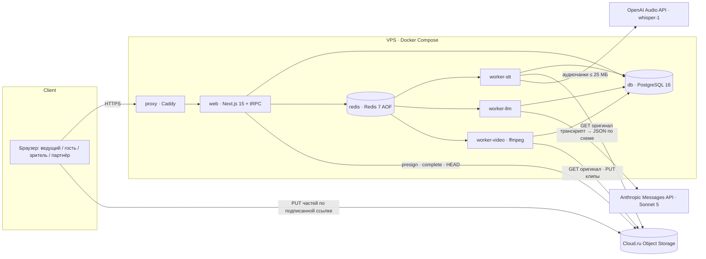

# N5 «КлипМейкер» — Architecture

**Версия:** 0.1 · **Дата:** 2026-09-21 · **CJM:** D · **Канон:** [`canon.md`](canon.md) (заморожен
2026-09-21) · **Решения:** [`ADR.md`](ADR.md) · **Диаграммы:** [`C4_Diagrams.md`](C4_Diagrams.md).
Документ владеет ФИЗИЧЕСКИМ устройством: контейнеры, стек, хранение, безопасность, внешние
зависимости. Логическая модель и алгоритмы — `Pseudocode.md`; наблюдаемое поведение —
`Specification.md`.

## Architecture Overview

**Стиль:** Distributed Monolith в монорепо (npm workspaces): один репозиторий, один образ `web` и
один образ воркера, запускаемый тремя контейнерами с разными очередями. Всё на одном VPS в Docker
Compose за Caddy. Managed-сервисов, подменяющих базу, нет; внешние сервисы — только объектное
хранилище и две модели.

Поток одной записи: `video.create` (строка `video`, списание `user_uploads`, подписанные ссылки) →
браузер грузит части в S3 → `POST /api/upload/complete` (сервер завершает multipart, `ffprobe`
длительности, списание минут по трём ключам, `queued`) → очередь `stt` → очередь `select` →
очередь `render` (по одному заданию на видео, клипы внутри последовательно) → `done`. Каждая стадия —
строка `job_attempt` с фенсом (ADR-001).

## Component Breakdown

| Компонент | Контейнер | Ответственность | Чего НЕ делает |
|---|---|---|---|
| Экраны и API | `web` | SSR-страницы (лендинг, `/c/{code}`, `/g/{guest_code}`, дашборд), 14 процедур tRPC и 9 публичных путей канона §5, сессии, квоты, подпись ссылок S3, постановка заданий | не вызывает модели, не запускает ffmpeg, не читает тела видео |
| Приём загрузки | `web` | `video.create` → presigned multipart; `upload/complete` → `CompleteMultipartUpload`, `HEAD` размера, `ffprobe` по Range-чтению заголовка, списание квот, `queued` | не проксирует байты файла через себя (клон обжёгся на лимите тела) |
| Транскрипция | `worker-stt` | извлекает аудио потоково (`ffmpeg -vn`, opus/mp3 ≤ 25 МБ на чанк по паузам), шлёт `whisper-1`, склеивает слова со смещением, пишет `transcript`, ставит `select` | не хранит аудио дольше отправки; не держит соединение с БД во время вызова |
| Выделение и оценка | `worker-llm` | один вызов Sonnet 5 со structured outputs: 3–8 кандидатов `{start,end,title,hook,completeness,length_fit,explanations}`; проверка диапазонов НАШИМ кодом (structured outputs числовые ограничения не задают); создаёт `clip` + `clip_link`, ставит `render` | не режет видео; не вызывает модель повторно без новой попытки |
| Рендер | `worker-video` | `concurrency 1`; резерв диска; скачивание оригинала один раз; ASS из слов; `scale→crop 9:16→ASS→drawtext(метка)`; `PUT` mp4 и jpg; `UPDATE clip … WHERE fence`; очистка | не решает, нужна ли метка (решение приходит от `web` в задании по `account.plan`, но проверяется fail-closed ещё раз) |
| Сторож | `web` (cron внутри процесса) | раз в минуту: `queued` без задания → поставить; `updated_at` > 30 мин при активном статусе → `failed(stalled)`; клипы free старше 3 дней → удалить объекты; гостевые страницы старше 14 дней → закрыть | не чинит данные вручную |
| Прокси | `proxy` | TLS, HSTS, лимит частоты ДО тела запроса (30/мин мутирующие, 120/мин чтение на IP), окно простоя 60 с, `X-Forwarded-For` | не публикует ничего, кроме себя |

## Technology Stack

| Layer | Technology | Rationale |
|---|---|---|
| Frontend | Next.js 15 (App Router, SSR), React 19, Tailwind, shadcn/ui | стек январского клона; SSR нужен для `/c/{code}` и `/g/{guest_code}` в WebView площадок без JS-зависимостей |
| Backend | Next.js route handlers + tRPC, Zod на границе | клон; типизированные процедуры канона §5 |
| Database | PostgreSQL 16, Prisma (схема — контракт, миграции SQL проверяются) | источник истины; `UNIQUE`-ограничения и атомарные счётчики в базе, не в коде |
| Cache | нет | кэш не нужен; страницы `/c/`, `/g/` отдаются с `Cache-Control: no-store` |
| Queue | BullMQ 5 на Redis 7 (AOF, `noeviction`, пароль) | ADR-001; задания минутной длительности, повторы, stalled-детект |
| Object storage | Cloud.ru Object Storage (S3, SigV4, `ru-central-1`); MinIO в тестовом профиле | ADR-002 |
| Media | ffmpeg 7 / ffprobe в образе воркера; libass для вшитых субтитров | клон; ASS даёт выделение текущего слова |
| STT | OpenAI `whisper-1`, `verbose_json`, `timestamp_granularities=[word,segment]` | ADR-003: единственная модель с таймкодами слов |
| LLM | Anthropic Claude Sonnet 5, structured outputs | ADR-003/канон: JSON по схеме, цена 2 $/10 $ за MTok |
| Infrastructure | один VPS, Docker Compose, Caddy | рамка курса; хостовые порты `${VAR:-default}`, секреты `${VAR:?}` |
| Observability | журнал `model-spend.jsonl` на попытку, `growth_event` в БД, `GET /health` | NFR-OPS-001; метрики недели считаются запросами к БД |

## External Dependencies

Каждая способность, которая нужна продукту от чужого сервиса. Одна строка — одна СПОСОБНОСТЬ, а не
один поставщик: «принимает аудио» и «отдаёт таймкоды слов» — разные вопросы. Доказательство —
документация ПОСТАВЩИКА с датой проверки и дословной цитатой; страницы тарифов приводятся только
для строк о цене.

| Capability needed | Provider / API | Evidence | Verdict | Requirements relying on it |
|---|---|---|---|---|
| транскрибирует аудио и отдаёт таймкоды на уровне слов | OpenAI Audio API, `whisper-1`, `timestamp_granularities[]` | [developers.openai.com/api/docs/guides/speech-to-text](https://developers.openai.com/api/docs/guides/speech-to-text) · проверено 2026-09-21 · «Use `whisper-1` when you need word or segment timestamps.» и «The `timestamp_granularities[]` parameter is only supported for `whisper-1`.» | CONFIRMED | FR-TRANSCRIBE-001, FR-RENDER-001 |
| принимает файл не больше 25 МБ в форматах mp3/mp4/mpeg/mpga/m4a/wav/webm | OpenAI Audio API | [developers.openai.com/api/docs/guides/speech-to-text](https://developers.openai.com/api/docs/guides/speech-to-text) · проверено 2026-09-21 · «Files can be up to 25 MB. Supported input formats are `mp3`, `mp4`, `mpeg`, `mpga`, `m4a`, `wav`, and `webm`.» и «For larger recordings, use a compressed audio format or split the file into chunks of 25 MB or less. Avoid splitting in the middle of a sentence» | CONFIRMED | FR-TRANSCRIBE-002 |
| тарифицирует транскрипцию за минуту аудио | OpenAI, страница тарифов | [developers.openai.com/api/docs/pricing](https://developers.openai.com/api/docs/pricing) · проверено 2026-09-21 · «Whisper … $0.006 / minute» | CONFIRMED | FR-LIMIT-001, FR-LIMIT-002, `model-cost-contract.md` |
| возвращает ответ, обязанный соответствовать заданной JSON-схеме | Anthropic Messages API (structured outputs) | [platform.claude.com/docs/en/build-with-claude/structured-outputs](https://platform.claude.com/docs/en/build-with-claude/structured-outputs) · проверено 2026-09-21 · «Structured outputs guarantee schema-compliant responses through constrained decoding» и «Supported models: … `claude-sonnet-5` …» | CONFIRMED | FR-SELECT-001, FR-SELECT-002 |
| НЕ гарантирует числовые диапазоны и длину строк в схеме | Anthropic Messages API (structured outputs) | [platform.claude.com/docs/en/build-with-claude/structured-outputs](https://platform.claude.com/docs/en/build-with-claude/structured-outputs) · проверено 2026-09-21 · «Not supported: … Numerical constraints (such as `minimum`, `maximum`, `multipleOf`); String constraints (`minLength`, `maxLength`)» | CONFIRMED | FR-SELECT-002 — диапазоны 0–33 и 20–75 с проверяет наш код |
| тарифицирует Sonnet 5 за токены | Anthropic, страница тарифов | [platform.claude.com/docs/en/about-claude/pricing](https://platform.claude.com/docs/en/about-claude/pricing) · проверено 2026-09-21 · «Claude Sonnet 5 · $2 / MTok · … · $10 / MTok» | CONFIRMED | FR-LIMIT-002, `model-cost-contract.md` |
| отдаёт расход и токены по организации за период | Anthropic Usage & Cost Admin API | [platform.claude.com/docs/en/manage-claude/usage-cost-api](https://platform.claude.com/docs/en/manage-claude/usage-cost-api) · проверено 2026-09-21 · «The Usage & Cost Admin API provides programmatic and granular access to historical API usage and cost data for your organization»; эндпоинты `/v1/organizations/usage_report/messages` и `/v1/organizations/cost_report`; «The Admin API is unavailable for individual accounts» | CONFIRMED | NFR-OPS-001, метрика «сверка расхода» |
| принимает подписанные запросы AWS Signature V4 с ключом `<tenant_id>:<key_id>` | Cloud.ru Object Storage (Evolution) | [cloud.ru/docs/s3e/ug/topics/api__aws-sig-v4](https://cloud.ru/docs/s3e/ug/topics/api__aws-sig-v4) · проверено 2026-09-21 · «Инструкция описывает подписание запросов к API Object Storage с помощью подписи AWS Signature V4», credential `<tenant_id>:<key_id>/<yyyymmdd>/ru-central-1/s3/aws4_request` | CONFIRMED | FR-INGEST-001, FR-RESULT-002, NFR-SEC-001 |
| ограничивает срок подписанной ссылки | Cloud.ru Object Storage | [cloud.ru/docs/s3e/ug/topics/api__aws-sig-v4](https://cloud.ru/docs/s3e/ug/topics/api__aws-sig-v4) · проверено 2026-09-21 · «Допустимые значения: целые числа от 1 до 604800 (7 дней)» | CONFIRMED | NFR-SEC-001 (мы берём ≤ 900 с) |
| разрешает CORS-запросы браузера к бакету по списку источников и методов | Cloud.ru Object Storage | [cloud.ru/docs/s3e/ug/topics/guides__cors](https://cloud.ru/docs/s3e/ug/topics/guides__cors) · проверено 2026-09-21 · «Источники — веб-сайты, с которых разрешены CORS-запросы к бакету», «HTTP-методы — HTTP-методы, которые разрешены источникам при запросах к хранилищу», «Максимальное число правил CORS для бакета — 100» | CONFIRMED | FR-INGEST-001 |
| удаляет объекты по сроку и прерывает незавершённые multipart-загрузки правилами lifecycle | Cloud.ru Object Storage, `PutBucketLifecycleConfiguration` | [cloud.ru/docs/s3e/ug/topics/api__putbucketlifecycleconfiguration](https://cloud.ru/docs/s3e/ug/topics/api__putbucketlifecycleconfiguration) · проверено 2026-09-21 · поддерживаемые элементы: «Expiration (Date, Days, ExpiredObjectDeleteMarker)», «AbortIncompleteMultipartUpload (DaysAfterInitiation)», «NoncurrentVersionExpiration»; [concepts__lifecycle](https://cloud.ru/docs/s3e/ug/topics/concepts__lifecycle): «Transition — автоматическое изменение класса хранения объекта (не поддерживается в текущей версии)» | CONFIRMED | FR-TARIFF-003, ADR-002 |
| не тарифицирует первые 10 ТБ исходящего трафика в месяц; тарифицирует хранение незавершённых частей | Cloud.ru Object Storage, тарификация | [cloud.ru/docs/s3e/ug/topics/pricing](https://cloud.ru/docs/s3e/ug/topics/pricing) · проверено 2026-09-21 · «Каждый месяц для любого типа хранилища не тарифицируются первые 10 ТБ исходящего трафика.», «Стандартным образом тарифицируется хранение: не полностью загруженных multipart-объектов» | CONFIRMED | FR-TARIFF-003, ADR-002 |
| возвращает зависшее задание в очередь и ограничивает число таких возвратов | BullMQ (библиотека, но поведение — внешний контракт) | [docs.bullmq.io/guide/jobs/stalled](https://docs.bullmq.io/guide/jobs/stalled) · проверено 2026-09-21 · «When a worker is not able to notify the queue that it is still working on a given job, that job is moved back to the waiting list, or to the failed set.», «If a job stalls more than a predefined limit (see the `maxStalledCount` option), the job will be failed permanently … The default is 1.» | CONFIRMED | FR-RENDER-003, ADR-001 |
| требует `noeviction` и рекомендует AOF для Redis под очередь | BullMQ | [docs.bullmq.io/guide/going-to-production](https://docs.bullmq.io/guide/going-to-production) · проверено 2026-09-21 · «it is very important to configure the `maxmemory-policy` setting to `noeviction`», «We recommend enabling AOF» | CONFIRMED | ADR-001 |
| аутентифицирует пользователя и возвращает ID-токен, подписанный Telegram | Telegram Login (OIDC) | [core.telegram.org/widgets/login](https://core.telegram.org/widgets/login) · проверено 2026-09-21 · «Verify Signature: Ensure the token was signed by Telegram» (проверка JWT по JWKS); прежний HMAC-виджет архивирован | CONFIRMED | FR-AUTH-002 |
| скачивает видео по ссылке VK Видео / Rutube | нет официального API для скачивания чужого контента; сторонние инструменты (yt-dlp) | документации поставщика, разрешающей это, не найдено; условия площадок не проверялись | UNCONFIRMED | FR-INGEST-003 (Should) — в Phase 3 НЕ входит, пока не подтверждено; загрузка файлом покрывает неделю |

Итого: 15 строк CONFIRMED, 1 UNCONFIRMED (`FR-INGEST-003`, Should — отложено, не блокирует).

## Data Architecture

Логическая модель (15 сущностей, перечисления) — `Pseudocode.md` § Data Structures. Здесь — отображение
на хранилища и ограничения, которые обеспечивает БАЗА.

| Сущность | Хранилище | Физические ограничения и индексы |
|---|---|---|
| `account`, `session` | PostgreSQL | `UNIQUE (email)`; `session.cookie_token_hash` — только хэш; `ip_prefix` /24 |
| `video` | PostgreSQL + S3 `videos/{account_id}/{video_id}/source.{ext}` | `UNIQUE (account_id, idempotency_key)`; частичный индекс `WHERE status IN ('queued','transcribing','selecting','rendering')` для сторожа; `deleted_at` |
| `transcript` | PostgreSQL (`jsonb` слова и сегменты) | одна строка на видео `UNIQUE (video_id)`; ~15 тыс. слов ≈ 1,5 МБ на час — в пределах строки, отдельной таблицы слов не нужно |
| `clip`, `clip_link` | PostgreSQL + S3 `clips/{video_id}/{clip_id}.mp4`, `thumbs/{video_id}/{clip_id}.jpg` | `UNIQUE (clip_link.code)`; `clip.expires_at` для free; индекс `(video_id, index)` |
| `guest_pack`, `guest_pack_clip` | PostgreSQL | `UNIQUE (guest_pack.code)`; составной PK `(guest_pack_id, clip_id)`; `expires_at` 14 дней |
| `growth_event` | PostgreSQL (append-only) | индекс `(type, created_at)`; `UNIQUE (type, clip_link_id, ip_prefix, day)` для `link_view` — уникальные переходы считает база |
| `partner`, `partner_code`, `attribution` | PostgreSQL | `UNIQUE (partner_code.code)`; `UNIQUE (attribution.account_id)`; `status` — `CHECK` по закрытому списку |
| `quota_counter` | PostgreSQL | `UNIQUE (scope, scope_key, day)`; списание — один оператор `INSERT … ON CONFLICT … DO UPDATE … WHERE … RETURNING` |
| `pro_interest` | PostgreSQL | `UNIQUE (account_id)` |
| `job_attempt` | PostgreSQL | `UNIQUE (video_id, stage, attempt_no)`; `fence` — монотонный на видео; результат стадии — `UPDATE … WHERE fence = :mine` |
| задания очереди | Redis (BullMQ) | транспорт, не источник истины; `jobId = {stage}:{video_id}:{fence}` — повторная постановка того же фенса идемпотентна |
| рабочие файлы рендера | том Docker `render-work` | временный каталог на задание, очистка в `finally`; резерв ≥ 3× оригинала |

Объекты S3 удаляются приложением (клипы free через 3 дня, оригинал — вместе с видео) и страхуются
lifecycle: `AbortIncompleteMultipartUpload` через 1 день, `Expiration` префикса `clips/` через 7 дней.
Версионирование бакета выключено (иначе удаление создаёт версии и хранение продолжает
тарифицироваться).

## Security Architecture

- **Порядок операций — это защита** (`security-operation-order.md`): лимит частоты в Caddy ДО тела;
  Zod-валидация ДО заявки `Idempotency-Key`; квоты (`user_uploads`) ДО выдачи подписанных ссылок;
  минуты ДО постановки в очередь; резерв диска ДО скачивания; согласие гостя ДО `guest_pack`.
- **Аутентификация:** почта + пароль (bcrypt, cost ≥ 10; хэширование и проверка выполняются ВНЕ
  транзакции БД — десятки миллисекунд на попытку не должны держать соединение пула, правило
  `shared-resource-verification.md`), cookie сессии `HttpOnly; Secure; SameSite=Lax`,
  значение ≥ 128 бит, в базе хэш. Telegram Login (Should) — проверка ID-токена по JWKS Telegram
  на сервере. Гостевая страница и `/c/{code}` — без входа, по коду ≥ 128 бит.
- **Авторизация:** владение проверяется по `account_id` сессии, не по идентификатору из тела; чужой
  и несуществующий `video_id`/`clip_id` дают одинаковый `404`; кабинет партнёра — `403` только на
  свой код, разрешаемый сервером.
- **Хранилище:** бакет приватный; `web` подписывает `PUT` частей (≤ 15 мин) и `GET` клипа; прямых
  публичных путей к бакету нет; ключи объектов серверные; в логи подписи не пишутся.
- **Граница файла:** тип по байтам (magic bytes) при `upload/complete` через Range-чтение первых
  байт; суммарный размер частей ≤ 2 000 000 000; `ffprobe` в отдельном процессе с таймаутом;
  полиглоты и контейнеры без звуковой дорожки — `422` и удаление объекта.
- **Секреты:** только окружение, `${VAR:?}`; распределение по контейнерам — канон §6; `web` не имеет
  ключей моделей и не может позвать модель. Пароль Redis обязателен; `db`, `redis`, `minio` портов не
  публикуют (`docker-ports.md`, Правило №0).
- **Персональные данные:** почта, `ip_prefix`, видео с изображениями людей. Гостевые клипы — только
  с зафиксированным согласием (ADR-008); удаление аккаунта ≤ 72 ч со статусом `erasing`; данные в РФ
  (VPS и Cloud.ru).
- **Anti-fraud:** порог 50 применений кода с `ip_prefix` за 10 мин → `blocked`; самореферал и
  самопереходы не считаются; уникальность `link_view` — в базе.
- **CSP:** без инлайновых скриптов; `connect-src` — свой origin и endpoint S3 для загрузки;
  `frame-ancestors 'none'`. CORS в приложении не настраивается: `web` и API на одном origin; CORS
  живёт только на бакете.

## Scalability Considerations

- **Узкое место недели — `worker-video`:** один CPU, `concurrency 1`, ≈ 1–2 мин на клип → 8 клипов ≈
  8–15 мин; 600 мин записи в сутки ≈ 10 записей ≈ 2,5 ч рендера в сутки — в пределах NFR-SCALE-001.
  Горизонтальный рост — второй `worker-video` на другой машине с тем же Redis и S3; вертикальный —
  больше CPU для ffmpeg.
- **STT и LLM** ограничены потолками, не ресурсами: 600 мин Whisper и 20 вызовов Sonnet 5 в сутки.
- **Диск:** не накапливается (S3), рабочая область ограничена резервом; при < 3× места задание
  откладывается, а не падает.
- **База:** транскрипты в `jsonb` — до ~1,5 МБ на запись; при 10 записях в сутки рост ≈ 0,5 ГБ в
  месяц; индексы частичные.
- **Канал VPS:** скачивание 2 ГБ ≈ 160 с при 100 Мбит/с — замеряется в первой фиче; при узком
  канале даунскейл оригинала до 1080p на входе.

## Reconciliation with Pseudocode

Сверены ДВЕ секции `Pseudocode.md` — `## Data Structures` (15 сущностей) и `## Core Algorithms`
(33 алгоритма) — против таблицы «Data Architecture» и канона §4. Дата сверки: 2026-09-21, после
квитанции `algo-writer` и раунда исправлений DEC-A-007/008. Сверены сущности: `account`, `session`,
`video`, `transcript`, `clip`, `clip_link`, `guest_pack`, `guest_pack_clip`, `growth_event`,
`partner`, `partner_code`, `attribution`, `quota_counter`, `pro_interest`, `job_attempt`; алгоритмы:
CreateVideo, CompleteUpload, LeaseAttempt, ExtractAndChunkAudio, Transcribe, SelectFragments,
ScoreClip, BuildSubtitles, RenderClip, WatermarkRequired, WatchdogTick, RetryVideo, RecordLinkView,
CreateGuestPack, OpenGuestPack, ApplyPartnerCode, AntiFraudCodeBurst, PartnerDashboard,
CheckAndConsumeQuota, CreateProInterest, DeleteAccount, AuthRegister/AuthLogin, TelegramLogin и
остальные из `Pseudocode.md`.

| Сущность.поле | Вид расхождения | Что сделано |
|---|---|---|
| `account.auth_secret_hash` | смена типа (одноразовая ссылка против пароля — разные механизмы, Р-1) | DEC-A-007: механизм — почта + пароль; поле `password_hash: string` обязательное; Specification и Pseudocode исправлены в раунде 2; физика здесь без изменений (bcrypt, cost ≥ 10) |
| `job_attempt.status` | несовпадение набора значений (в каноне набор не объявлен, Р-2) | принят ЗАКРЫТЫЙ набор `running \| succeeded \| failed \| deferred`, `CHECK` в схеме; `deferred` — отложено по `no_disk`, не отказ |
| `pro_interest.source_screen`, `growth_event.source_screen` | отсутствующая колонка (Р-3) | добавлены; закрытый набор `clip_card \| guest_page \| partner_dashboard`, `CHECK` |
| `clip.render_fence` | отсутствующая колонка (Р-4) | добавлена: `int NOT NULL DEFAULT 0`; `job_attempt.fence` монотонен на видео, а рендер идёт по клипам, поэтому результат принимается `UPDATE clip SET … WHERE id = :clip AND render_fence < :mine` с одновременной записью `render_fence = :mine` |
| `clip.watermarked` | отсутствующая колонка | добавлена: `boolean NOT NULL`; решение сервера по `account.plan` fail-closed, хранится вместе с результатом рендера |
| `video.upload_id`, `declared_bytes`, `actual_bytes`, `duration_seconds`, `minutes_charged`, `stage_progress`, `clips_total`, `clips_done`, `updated_at`, `finished_at` | отсутствующие колонки | добавлены; `declared_bytes` — заявлено клиентом и НЕ доверяется, `actual_bytes` — `HEAD` после завершения; `updated_at` двигается каждым шагом стадии (на нём стоит различение молчания, `long-job-contract.md`) |
| `video.failure_reason` | несовпадение набора значений (в каноне не объявлен) | принят закрытый набор из Pseudocode (`too_large … render_failed`), `CHECK`; отказ по потолку называет `scope` через `refused_user_minutes \| refused_global_minutes \| refused_global_llm` |
| `job_attempt.clip_id`, `unit`, `unit_count`, `provider`, `model` | отсутствующие колонки | добавлены: `clip_id` только у стадии `render`; `unit/unit_count` — источник журнала расхода `model-spend.jsonl` (NFR-OPS-001) |
| `guest_pack.host_partner_code_id`, `consent_version`, `consent_text_hash`, `consent_at`, `first_opened_at`, `revoked_at` | отсутствующие колонки | добавлены; `host_partner_code_id` — личный код ведущего, создаётся при первой отправке гостевой ссылки (ведущий как микро-партнёр) |
| `attribution.reject_reason` | отсутствующая колонка | добавлена: закрытый набор `self_referral \| code_blocked \| antifraud_ip_burst` |
| `partner.contact`, `partner_code.blocked_reason/blocked_at` | отсутствующие колонки | добавлены |
| `quota_counter.limit` | отсутствующая колонка | НЕ добавлена как хранимое значение: предел приходит из окружения при старте (ненастроенный валит процесс, ADR/FR-LIMIT); в строке счётчика хранится только `used`. Pseudocode читает `limit` как параметр алгоритма, не как колонку — семантика сохранена |
| `session.revoked_at`, `last_seen_at`; `account.deletion_requested_at`, `erase_deadline` | отсутствующие колонки | добавлены |
| `transcript.words/segments` | смена типа (списки записей) | `jsonb`, как в Data Architecture; `Word.chunk_index` и `Segment.speaker?` сохраняются в JSON |

Правило разрешения соблюдено: Pseudocode владеет ЛОГИЧЕСКИМ смыслом (наборы значений, поля), этот
документ — ФИЗИЧЕСКИМ хранением; единственное решение, изменившее смысл (Р-1), принято как DEC-A-007 и
исправлено в обоих документах, а не только здесь. Канон §4 перечисляет сущности и их закрытые
перечисления, но не полный список полей; добавленные поля не создают новых сущностей и новых
перечислений вне названных выше.
