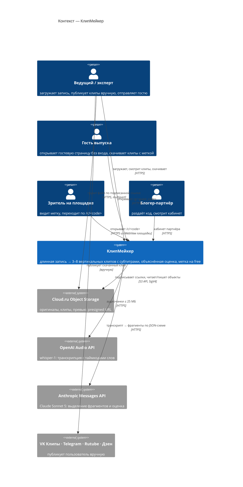
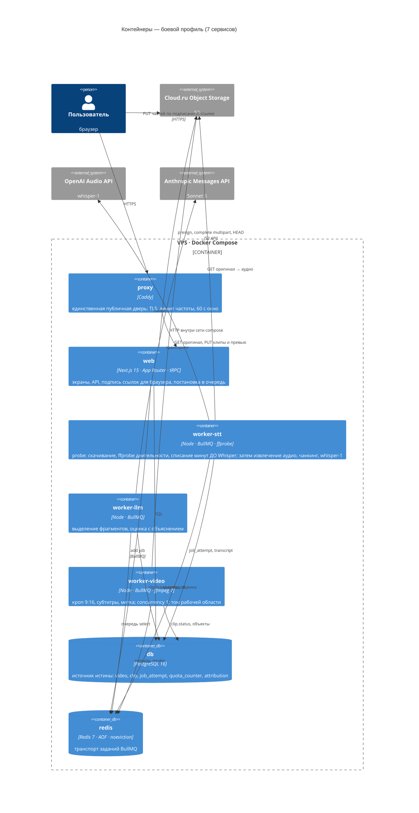
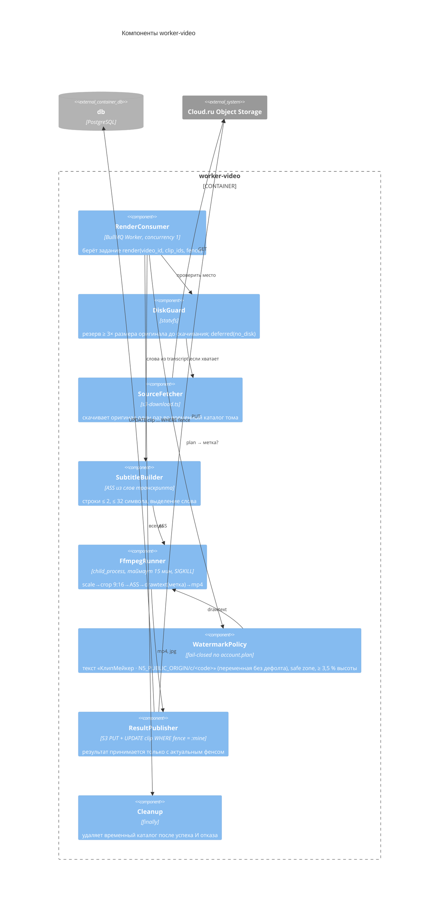

# C4-диаграммы — N5 «КлипМейкер»

**Дата:** 2026-09-21 · **Канон:** [`canon.md`](canon.md) §5–6 · Уровни: контекст, контейнеры,
компоненты воркера. Имена сервисов — ровно из канона §6.

## Уровень 1 · Контекст

## Уровень 2 · Контейнеры (сервисы compose, боевой профиль)

Тестовый профиль добавляет `minio` (тот же S3-код, `S3_ENDPOINT=http://minio:9000`, без `ports:`) и
`test` (раннер). Хранилища `db`, `redis`, `minio` портов не публикуют; единственный публикуемый порт —
`127.0.0.1:${N5_EDGE_PORT:-4181}` у `proxy` в профиле `edge`.

Ключи по контейнерам (канон §6): `OPENAI_API_KEY` → только `worker-stt`; `ANTHROPIC_API_KEY` → только
`worker-llm`; `S3_*` → `web`, `worker-stt`, `worker-video`; `REDIS_PASSWORD` → `web` и три воркера;
`DATABASE_URL` → `web` и три воркера; `N5_PUBLIC_ORIGIN` (без дефолта) → `web` и `worker-video`; у `proxy` и
`db` секретов приложения нет.

## Уровень 3 · Компоненты `worker-video` (самый тяжёлый контейнер)

## Что диаграммы НЕ показывают (намеренно)

- Спящий код клона (ЮKassa, автопостинг `worker-publish`, команды) — не входит в неделю и не
  поднимается в compose; его контейнер отсутствует в боевом профиле (ADR-005).
- Telegram-бот для «отправить себе в Telegram» (FR-RESULT-003, Should) — появится отдельным
  внешним элементом контекста только при реализации; входящих вебхуков от него нет.
