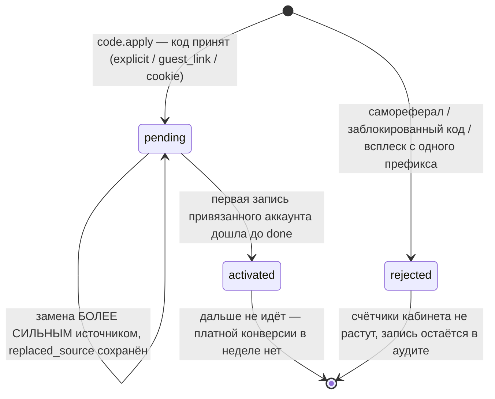

# Pseudocode — N5 «КлипМейкер», CJM D

**Версия:** 0.1 · **Дата:** 2026-09-21 · **CJM:** D — путь A плюс блок «клипы для гостя» (B-лайт),
решение владельца OWN-001 ([`CJM_Variants.md`](CJM_Variants.md)).
**Версия документа:** раунд 3 (исправления Phase 2), 2026-09-21.
**Канон имён:** [`canon.md`](canon.md), хеш
`d5bf72efc63f090267ecb239ea913616221d785e3579fb7a5ca56362675afc84` — канон разморожен и перепривязан
решениями DEC-A-010 (пятый scope `user_llm`, десятый публичный путь, пятнадцатая процедура,
`N5_PUBLIC_ORIGIN`, минуты на аккаунт 90) и DEC-A-015 (шестой scope `user_upload_refunds`).
**Источник наблюдаемого поведения:** [`Specification.md`](Specification.md), sha256
`870424e1b63ee49a03b5cfab1643129f24007bddf5fb908497a3b0b4969db118` (редакция после правок
spec-writer раундов 3–4; 35 сценариев приёмки).
**Физика** (таблицы, индексы, контейнеры, внешние сервисы) — [`Architecture.md`](Architecture.md);
**причины выбора** — [`ADR.md`](ADR.md); контракты долгой задачи и стоимости вызовов —
[`long-job-contract.md`](long-job-contract.md), [`model-cost-contract.md`](model-cost-contract.md).

Документ — **единственный владелец логических полей, наборов состояний и шагов**. Имена, статусы,
маршруты и числа не изобретаются: набор закрыт каноном. Ни один шаг не измерен на живом стенде —
это проектный план, а не наблюдение.

Пять инвариантов, которые ниже соблюдаются в каждом алгоритме и ради которых он написан:
**идентификатор выдаётся ДО начала работы**; **квота списывается ДО вызова поставщика и одним
атомарным оператором**; **молчание — не «выполняется»**; **результат принимается только от попытки
с актуальным фенсом**; **всё, что не равно ровно `paid`, получает метку**.

## Data Structures

Общие типы: `UUID`; `Timestamp` (момент времени в UTC); `Date` (календарная дата в
`Europe/Moscow`); `Seconds` (вещественное, один знак после запятой); `Minutes` (целое, округление
вверх); `Bytes` (целое); `IPPrefix` (усечённый до /24 префикс адреса, не полный адрес);
`ObjectKey` (ключ объекта в приватном бакете, НЕ URL); `Code` (короткая строка в верхнем регистре
из алфавита без похожих символов). `?` означает nullable и никогда не подразумевает значение по
умолчанию: отсутствие значения — отдельное состояние, а не «как обычно».

Каждая сущность содержит `id: UUID` и `created_at: Timestamp`. Сущностей ровно 15 — столько же,
сколько в каноне §4, один к одному.

| Сущность | Логические поля кроме `id` и `created_at` |
|---|---|
| `account` | `email: string` (уникален), `password_hash: string` (ОБЯЗАТЕЛЬНОЕ: хэш пароля, посчитанный bcrypt со стоимостью ≥ 10; сам пароль не хранится и не журналируется — DEC-A-007), `telegram_user_id: string?`, `plan: free / paid` — ЗАКРЫТЫЙ набор из двух значений, всё, что не равно ровно `paid`, читается как `free`; `status: active / erasing / deleted` — ЗАКРЫТЫЙ набор из трёх; `deletion_requested_at: Timestamp?`, `erase_deadline: Timestamp?` (запрос + 72 ч), `updated_at: Timestamp` |
| `session` | `account_id: UUID`, `cookie_token_hash: string` (хранится ТОЛЬКО хэш; сырое значение ≥ 128 бит уходит в cookie и больше нигде не живёт), `ip_prefix: IPPrefix`, `expires_at: Timestamp`, `revoked_at: Timestamp?`, `last_seen_at: Timestamp` |
| `video` | `account_id: UUID`, `idempotency_key: string` (значение заголовка `Idempotency-Key`, уникально в паре с `account_id`), `source: upload / url` — ЗАКРЫТЫЙ набор из двух, `source_url: string?` (только при `url`), `object_key: ObjectKey?`, `upload_id: string?` (идентификатор multipart-загрузки), `declared_bytes: Bytes` (заявлено клиентом — значение, которое НЕ проверено), `actual_bytes: Bytes?` (получено `HEAD` после завершения), `duration_seconds: Seconds?` (измерено `ffprobe` в `worker-stt`, шаг `ProbeSource`; до него `NULL`), `minutes_charged: Minutes?`, `status: uploading / queued / transcribing / selecting / rendering / done / failed` — ЗАКРЫТЫЙ набор из семи, `failure_reason: too_large / not_media / no_audio / too_short / too_long / probe_timeout / stt_failed / no_timestamps / no_fragments / schema_violation / refused_user_uploads / refused_user_minutes / refused_global_minutes / refused_user_llm / refused_global_llm / stalled / render_failed?` — ЗАКРЫТЫЙ набор из 16 (V2-R17: `refused_user_uploads` и `probe_timeout` использовались алгоритмами, но в наборе отсутствовали; `refused_user_llm` пришёл с пятым scope) — ЗАКРЫТЫЙ набор, `stage_progress: int?` (0–100 внутри текущей стадии), `clips_total: int?`, `clips_done: int?`, `updated_at: Timestamp` (двигается КАЖДЫМ шагом любой стадии — на нём стоит различение молчания), `finished_at: Timestamp?`, `deleted_at: Timestamp?` |
| `transcript` | `video_id: UUID` (ровно один транскрипт на видео), `language: string`, `duration_seconds: Seconds`, `chunk_count: int`, `words: list(Word)`, `segments: list(Segment)` |
| `clip` | `video_id: UUID`, `index: int` (порядок на экране, от 1), `start_seconds: Seconds`, `end_seconds: Seconds` (границы совпадают с границами слов транскрипта), `title: string`, `score: int?` (0–99, сумма трёх компонентов; `NULL`, если хотя бы одно объяснение пусто — тогда число не показывается ВОВСЕ), `score_hook: int?` (0–33), `score_completeness: int?` (0–33), `score_length: int?` (0–33), `explain_hook: string?`, `explain_completeness: string?`, `explain_length: string?` (по ОДНОЙ фразе на компонент), `status: queued / rendering / done / failed` — ЗАКРЫТЫЙ набор из четырёх, `watermarked: boolean` (решено сервером по `account.plan`, не по телу задания), `render_fence: int` (последний фенс, принятый этим клипом; стартует с 0; принято координатором, DEC-A-009), `object_key: ObjectKey?`, `thumbnail_key: ObjectKey?`, `bytes: Bytes?`, `expires_at: Timestamp?` (проставляется при удалении объектов на тарифе `free`), `failure_reason: no_disk / ffmpeg_failed / ffmpeg_timeout / stale_attempt_result / watermark_geometry?` |
| `clip_link` | `clip_id: UUID` (ровно одна ссылка на клип, создаётся ДО рендера — её код вшивается в метку), `code: Code` (уникален), `unique_view_count: int` (счётчик УНИКАЛЬНЫХ переходов; растёт только вместе со вставкой строки `growth_event`), `last_view_at: Timestamp?` |
| `guest_pack` | `video_id: UUID`, `account_id: UUID` (ведущий — владелец записи), `code: Code` (≥ 128 бит энтропии, уникален), `guest_name: string`, `consent_confirmed: boolean` (ровно `true`; иное значение страницу не создаёт), `consent_version: string`, `consent_text_hash: string`, `consent_at: Timestamp`, `host_partner_code_id: UUID` (личный код ведущего, который несёт ссылка), `expires_at: Timestamp?` (**заполняется в момент ОТПРАВКИ**: `sent_at + 14 суток`; до отправки `NULL`, и страница по правилу fail-closed НЕ открывается — неотправленная не бессрочна, а закрыта. Считать срок от создания значило бы отдать гостю 11 дней вместо обещанных 14, если ведущий создал пакет в понедельник, а отправил в четверг — V2-R18), `sent_at: Timestamp?`, `first_opened_at: Timestamp?`, `revoked_at: Timestamp?` |
| `guest_pack_clip` | `guest_pack_id: UUID`, `clip_id: UUID` — пара уникальна и образует составной ключ; строка означает «этот клип отмечен как клип гостя» |
| `growth_event` | `type: download / link_copy / link_view / guest_sent / guest_opened / guest_registered / code_applied / interest` — ЗАКРЫТЫЙ набор из восьми, `account_id: UUID?`, `video_id: UUID?`, `clip_id: UUID?`, `clip_link_id: UUID?`, `guest_pack_id: UUID?`, `partner_code_id: UUID?`, `ip_prefix: IPPrefix?`, `day: Date`, `source_screen: clip_card / guest_page / partner_dashboard?` (только для `interest`; принято координатором, DEC-A-009). Append-only: единственный источник истины для счётчиков кабинета и метрики недели |
| `partner` | `account_id: UUID` (уникален — партнёр это роль аккаунта, а не отдельный человек), `display_name: string`, `contact: string?`. Роль появляется двумя путями: блогер заводится оператором, ведущий получает её автоматически при первой отправке гостевой ссылки (микро-партнёр без выплат) |
| `partner_code` | `partner_id: UUID`, `code: Code` (уникален, 6–12 символов), `status: active / blocked` — ЗАКРЫТЫЙ набор из двух, `blocked_reason: antifraud_ip_burst / manual?`, `blocked_at: Timestamp?` |
| `attribution` | `account_id: UUID` (уникален — ровно одна атрибуция на аккаунт), `partner_code_id: UUID`, `source: explicit / guest_link / cookie` — ЗАКРЫТЫЙ набор из трёх с порядком силы `explicit > guest_link > cookie`, `status: pending / activated / rejected` — ЗАКРЫТЫЙ набор из трёх, неизвестное значение читается как `rejected`, `replaced_source: explicit / guest_link / cookie?` (чем была атрибуция до замены; `NULL`, если замены не было), `reject_reason: self_referral / code_blocked / antifraud_ip_burst?`, `activated_at: Timestamp?` |
| `quota_counter` | `scope: user_minutes / user_uploads / user_upload_refunds / user_llm / global_minutes / global_llm` — ЗАКРЫТЫЙ набор из ШЕСТИ (канон §4 после DEC-A-010 и DEC-A-015; `user_llm` добавлен, потому что суточного потолка недостаточно — один аккаунт, жмущий «повторить», съедал бы 20 вызовов у всех, V2-R21; `user_upload_refunds` — потолок ВОЗВРАТОВ слота загрузки, 2 в сутки, DEC-A-015), `scope_key: string` (для `user_*` — `account_id`; для `global_*` — константа `all`), `day: Date`, `used: int`. **Колонки предела НЕТ** (V2-R03/V2-L2): предел приходит параметром `:limit` из окружения и валит запуск, если не задан; хранимая копия того же числа в каждой строке суток была бы вторым источником истины, а `limit` вдобавок зарезервированное слово SQL. Тройка `(scope, scope_key, day)` уникальна; списание — ДВА оператора в одной транзакции (`CheckAndConsumeQuota` шаг 3) |
| `pro_interest` | `account_id: UUID` (уникален), `contact: string`, `source_screen: clip_card / guest_page / partner_dashboard` — ЗАКРЫТЫЙ набор из трёх (счёт по источнику ведётся раздельно, FR-TARIFF-002), `last_pressed_at: Timestamp` |
| `job_attempt` | `video_id: UUID`, `stage: stt / select / render` — ЗАКРЫТЫЙ набор из трёх, `clip_id: UUID?` (у стадии `render` — клип, у остальных `NULL`), `series_no: int` (СЕРИЯ попыток: 1 при создании видео, +1 при каждом `video.retry`; V2-R02), `attempt_no: int` (порядковый номер ВНУТРИ `(stage, clip_id, series_no)`, от 1; частью уникальности НЕ является — восемь клипов одной записи дают восемь первых попыток рендера, и общий `UNIQUE` по нему был бы неисполним), `fence: int` (МОНОТОННЫЙ счётчик на видео, общий для трёх стадий и всех серий; **единственная уникальность — `(video_id, fence)`**), `status: running / succeeded / failed / deferred` — ЗАКРЫТЫЙ набор из четырёх (принято координатором, DEC-A-009), `wait_reason: no_disk?` (причина ОЖИДАНИЯ, если `status = deferred`; у клипа такого поля нет — он не отказал, V2-L3), `unit: minutes / calls / none` (единица счёта расхода), `unit_count: int`, `provider: string?`, `model: string?`, `failure_reason: string?`, `started_at: Timestamp`, `finished_at: Timestamp?` |

Вложенные значения — не отдельные сущности, а неизменяемые записи внутри полей:
`Word = {text: string, start: Seconds, end: Seconds, chunk_index: int}` — сквозная шкала записи,
уже со смещением части; `Segment = {start: Seconds, end: Seconds, text: string, speaker: string?}`
(поле `speaker` необязательно и в неделе всегда `NULL`: диаризации нет, но контракт поставщика её
допускает — ADR-003); `FragmentCandidate = {start: Seconds, end: Seconds, title: string,
hook: int, completeness: int, length_fit: int, explain_hook: string,
explain_completeness: string, explain_length: string}` — то, что вернула модель ДО проверки
диапазонов нашим кодом.

## Core Algorithms

### Algorithm: AuthRegisterAndLogin

REQUIREMENT: `FR-AUTH-001`
REALISES: —
INPUT: адрес почты, пароль, адрес клиента, вид действия ∈ {`register`, `login`}.
OUTPUT: `session` с cookie `HttpOnly; Secure; SameSite=Lax`, либо отказ.
STEPS:
1. Лимит частоты применяется ДО разбора тела (30 мутирующих запросов/мин на `ip_prefix`, прокси). Порядок обязателен: иначе перебор адресов и паролей невалидными телами не стоит атакующему ничего.
2. Валидация: пригодный адрес, длина пароля не ниже объявленного минимума. IF нет THEN RETURN `invalid` без создания записей и без обращения к базе паролей.
2а. **bcrypt считается ВНЕ транзакции базы, и это условие, а не стиль.** Одна проверка пароля со стоимостью ≥ 10 занимает десятки миллисекунд — намеренно, в этом её смысл. Соединение пула, удерживаемое на это время, превращает неаутентифицированный маршрут в право исчерпать РАЗДЕЛЯЕМЫЙ ресурс: пул из N соединений останавливает продукт целиком после N одновременных попыток входа, и кладёт вместе с входом дашборд, гостевую страницу и приём загрузок. Поэтому порядок в шагах 3 и 4 один и тот же: сначала ЧТЕНИЕ либо ХЭШИРОВАНИЕ без открытой транзакции, потом КОРОТКАЯ транзакция записи. Проверяется это конкурентным прогоном (N одновременных входов по одному адресу), а не последовательным: последовательный зеленеет при обеих реализациях.
3. **Регистрация.** Посчитать `password_hash = bcrypt(пароль, cost ≥ 10)` — БЕЗ открытой транзакции и без занятого соединения; стоимость задана в КОДЕ, а не в окружении: пустая переменная означала бы дешёвый хэш, то есть отсутствие защиты под её вывеской. ЗАТЕМ взять соединение и вставить аккаунт ОДНИМ оператором `INSERT … ON CONFLICT (email) DO NOTHING RETURNING id`; `plan = free`, `status = active`. Соединение удерживается на время одной вставки, а не на время хэширования. Пустой результат означает «адрес занят», и наружу он отдаётся ТЕМ ЖЕ ответом, что и успех: различие раскрывало бы, кто у нас зарегистрирован. «Проверить, есть ли такой адрес, и потом вставить» запрещено — две одновременные регистрации обе проверку пройдут.
4. **Вход.** Прочитать аккаунт по адресу ОДНИМ коротким запросом и ОТПУСТИТЬ соединение. Дальше сравнение пароля идёт уже без него. IF аккаунта нет THEN всё равно выполнить сравнение с ФИКТИВНЫМ хэшем той же стоимости и RETURN `invalid`: иначе несуществующий адрес отвечает быстро, существующий медленно, и форма входа становится перечислителем наших пользователей ПО ВРЕМЕНИ, даже когда текст ответа один. IF `status` не `active` THEN тоже выполнить сравнение и RETURN `invalid` тем же текстом. Сверить пароль с `password_hash`; IF не сошёлся THEN RETURN `invalid`. Требование двойное и выполняется целиком: ОДИН текст и ОДНО время на «нет такого адреса», «аккаунт не активен» и «неверный пароль».
5. Создать `session` КОРОТКОЙ транзакцией, уже после того как пароль сошёлся: токен ≥ 128 бит, в базе — ТОЛЬКО его хэш, `ip_prefix` усечён до /24, `expires_at`. Полный адрес клиента не сохраняется: он нужен только квоте и анти-фроду, и им достаточно префикса.
5а. Восстановление пароля в неделю НЕ входит (`Should`, без алгоритма): оно требует почтового провайдера, а его нет в инвентаре внешних зависимостей `Architecture.md`. Забывший пароль обращается к оператору; пропуск фиксируется в `Completion.md` как сознательный, а не как дефект.
6. IF в cookie есть незаявленный код партнёра THEN вызвать `ApplyPartnerCode(source = cookie)` — САМЫЙ СЛАБЫЙ источник, он никогда не перебивает существующую атрибуцию.
7. `POST /api/auth/logout` гасит сессию на СЕРВЕРЕ (`revoked_at`), а не только стирает cookie: стёртый в браузере cookie остаётся действительным для того, кто его скопировал.
COMPLEXITY: O(1) запросов к базе; стоимость времени — одно вычисление bcrypt на попытку, выполняемое ВНЕ соединения пула.

### Algorithm: TelegramLogin

REQUIREMENT: `FR-AUTH-002`
REALISES: —
INPUT: ID-токен, выданный Telegram, ровно в том виде, в каком он приехал (сырая строка).
OUTPUT: `session`, привязанная к аккаунту, либо отказ.
STEPS:
1. Лимит частоты ДО разбора тела.
2. **Проверить подпись ПЕРВОЙ**, до того как из токена прочитано хоть одно поле: ключ берётся из JWKS Telegram, проверка идёт по СЫРЫМ байтам полученной строки. Разбор и повторная сборка меняют байты, и подпись не сойдётся никогда — а обычное «лечение» этого состоит в том, чтобы проверку выключить.
3. Только ПОСЛЕ успешной подписи прочитать поля: издатель, адресат, срок. IF срок истёк THEN RETURN `invalid`. Порядок «подпись → свежесть», а не наоборот: разное время ответа на «протухло» и «подпись не сошлась» различимо снаружи.
4. Там, где сравнивается секрет (унаследованный HMAC-виджет), сравнение — ПОСТОЯННОГО времени.
5. Найти аккаунт по `telegram_user_id`; IF нет и почта из токена совпала с существующим аккаунтом THEN привязать; ELSE создать аккаунт со `status = active`, `plan = free`.
6. Создать `session` шагом 5 алгоритма `AuthRegisterAndLogin`. Аккаунт, созданный этим путём, получает `password_hash` от сгенерированного случайного значения ≥ 128 бит: обязательное поле остаётся заполненным, а войти паролем, которого никто не знает, нельзя.
COMPLEXITY: O(1) плюс один запрос JWKS с кэшем ключей.

### Algorithm: DeleteAccount

REQUIREMENT: `FR-AUTH-003`
REALISES: SC-US-014-1, SC-US-014-2
INPUT: сессия владельца, подтверждение `confirm = true`.
OUTPUT: `accepted` со сроком завершения, либо отказ.
STEPS:
1. IF `confirm` не равно ровно `true` THEN RETURN `invalid`. Экран предупреждает об необратимости ДО подтверждения, а не после.
2. IF `account.status` уже `erasing` OR `deleted` THEN RETURN `conflict`; повтор не запускает второе удаление и НЕ сдвигает срок.
3. В ОДНОЙ транзакции: `status = erasing`, `deletion_requested_at = now`, `erase_deadline = now + 72 ч`; все `session` этого аккаунта — `revoked_at = now`; все его `guest_pack` — `revoked_at = now` (страницы гаснут НЕМЕДЛЕННО, а не по сроку); его `clip_link` помечаются как неатрибутирующие.
4. `erasing` виден в ответах и ОТЛИЧАЕТСЯ от `deleted`: между запросом и завершением есть состояние, и скрывать его значит показывать удалённым то, что ещё лежит.
5. Фоновое стирание (вызывается сторожем, шаг 5 `WatchdogTick`): удалить объекты S3 (оригиналы, клипы, превью), затем строки `video`, `transcript`, `clip`, `clip_link`, `guest_pack`, `guest_pack_clip`, `session`, `attribution`, `pro_interest`; строки `growth_event` обезличиваются (`account_id = NULL`), потому что счётчики партнёра — агрегат, а не персональные данные.
6. `status = deleted` ставится ТОЛЬКО после того, как удаление объектов подтверждено ответом хранилища. Недоступность хранилища — исключение, откатывающее шаг, а не значение, позволяющее объявить аккаунт удалённым.
COMPLEXITY: O(k) по числу объектов аккаунта.

### Algorithm: CheckAndConsumeQuota

REQUIREMENT: `FR-LIMIT-001`
REQUIREMENT: `FR-LIMIT-002`
REALISES: SC-US-011-1, SC-US-011-2, SC-US-011-3, SC-US-013-2
INPUT: аккаунт, причина списания `reason` ∈ {`upload` — одна загрузка, `upload_refund` — право вернуть слот загрузки, `minutes` — минуты записи, `llm` — вызов модели выделения}, величина `n`, дата в `Europe/Moscow`.
OUTPUT: `granted`, либо `refused(scope)`, где `scope` — ОДИН из ШЕСТИ ключей канона §4, назвавший отказ. Вызов поставщика после `refused` не выполняется НИКОГДА.
STEPS:
1. На старте процесса: IF хотя бы один из ШЕСТИ потолков не задан в окружении — 2 загрузки на аккаунт, 2 возврата слота на аккаунт, 90 минут на аккаунт, 2 вызова выделения на аккаунт, 600 минут на всех, 20 вызовов на всех — THEN уронить запуск с сообщением, называющим НЕНАСТРОЕННЫЙ вызов. Пустая переменная не означает «ограничений нет»: она означает отказ (`model-cost-contract.md`, Правило №0). Предел живёт ТОЛЬКО здесь, в параметре `:limit`, и в строке счётчика не хранится — иначе у одного числа два источника истины, расходящихся при смене потолка.
2. Собрать ключи ПО ПРИЧИНЕ. `upload` → один: `(user_uploads, account_id, day)` с пределом 2. `upload_refund` → один: `(user_upload_refunds, account_id, day)` с пределом 2 — это право ВЕРНУТЬ слот, и оно само тратится, поэтому счётчик обычный, растущий, а не убывающий (DEC-A-015). `minutes` → два: `(user_minutes, account_id, day)` с пределом **90** и `(global_minutes, 'all', day)` с пределом 600. Персональный предел равен МАКСИМАЛЬНОЙ допустимой длительности записи (канон §7 после DEC-A-010): при прежних 60 минутах часовой выпуск — заявленный основной сценарий — выбирал бы суточный потолок целиком, а 61-минутный не обрабатывался бы никогда (V2-R22). `llm` → **два**: `(user_llm, account_id, day)` с пределом 2 и `(global_llm, 'all', day)` с пределом 20. Второй ключ без первого не связывает: один аккаунт, нажимающий «повторить» на стадии выделения, исчерпал бы общие 20 вызовов в одиночку, и продукт отказал бы всем остальным по причине, в которой они не виноваты (V2-R21).
3. Все ключи одной причины списываются в ОДНОЙ транзакции, каждый — ДВУМЯ операторами подряд:

   ```sql
   INSERT INTO quota_counter (scope, scope_key, day, used) VALUES (:scope, :key, :day, 0)
     ON CONFLICT (scope, scope_key, day) DO NOTHING;
   UPDATE quota_counter SET used = used + :n
     WHERE scope = :scope AND scope_key = :key AND day = :day AND used + :n <= :limit
     RETURNING used;
   ```

   Первый оператор ТОЛЬКО заводит строку суток с нулём и никогда не списывает; второй — единственное место, где `used` растёт, и он всегда под условием предела. Одним оператором `INSERT … ON CONFLICT DO UPDATE` это невыразимо: условие `WHERE` принадлежит ветке `DO UPDATE` и на вставку НЕ действует, поэтому первый за сутки запрос с `n > limit` вставлял бы строку без единой проверки и возвращал непустой результат, то есть `granted` (V2-R01). Дефект виден и последовательным тестом, но только если первым запросом суток идёт превышение — обычный случай на пределе 90 и записи 90 минут.
3а. «Прочитать, потом записать» ЗАПРЕЩЕНО и здесь: две одновременные загрузки обе прочитают старое значение и обе пройдут. Последовательный тест зеленеет при обеих реализациях, различает их только конкурентный прогон.
4. IF ЛЮБОЙ `UPDATE` вернул пустой результат THEN откатить транзакцию ЦЕЛИКОМ — ни один счётчик этой причины не увеличен — и RETURN `refused` с названным `scope`, НЕ вызывая поставщика. Откат именно транзакцией, а не встречным уменьшением: параллельная попытка, попавшая между увеличением и уменьшением, получила бы отказ незаслуженно.
5. Отказ несёт `scope` и время возврата (ближайшая полночь `Europe/Moscow`). Ключей ШЕСТЬ, а пользовательских текстов ПЯТЬ: «загрузки на сегодня исчерпаны» (`user_uploads`), «минуты на сегодня исчерпаны» (`user_minutes`), «обработок на сегодня исчерпано» (`user_llm`), «общий суточный объём исчерпан» (`global_minutes`), «общий суточный лимит обработок исчерпан» (`global_llm`). У шестого ключа, `user_upload_refunds`, своего текста НЕТ и быть не должно: исчерпание права на возврат слота выглядит для пользователя как обычный `refused_user_uploads` (FR-LIMIT-003), потому что объяснять ему устройство нашей защиты вместо судьбы его файла было бы хуже молчания. Пользователь глобального потолка не виноват и должен это видеть.
6. Деградации «обработаем моделью подешевле» и очереди на завтра НЕТ: обе переносят трату, а не отменяют.
7. Счёт ведётся по ПОПЫТКАМ: повтор после таймаута списывает снова, потому что поставщик берёт деньги за попытку, а не за успех.
8. **`RefundUploadSlot(account, day)` — единственный способ вернуть слот загрузки** (DEC-A-014), вызывается ТОЛЬКО из `CompleteUpload` и `ProbeSource` при отказе по СВОЙСТВАМ ФАЙЛА и ТОЛЬКО в той же транзакции, что переводит запись в `failed`:
   1. `CheckAndConsumeQuota(account, reason = upload_refund, n = 1)`. IF `refused` THEN RETURN `not_refunded` — молча, БЕЗ добавочной ошибки пользователю: он уже получил названную причину отказа файла, и вторая строка про исчерпанное право возврата объясняла бы ему устройство нашей защиты, а не его файл (DEC-A-015).
   2. `UPDATE quota_counter SET used = used - 1 WHERE scope = 'user_uploads' AND scope_key = :account AND day = :day AND used > 0` — ОДИН оператор, условие `used > 0` не даёт счётчику уйти в минус даже при двойном вызове.
   3. RETURN `refunded`.
9. **Почему встречное уменьшение здесь законно, хотя шаг 4 его запрещает.** В шаге 4 отменяется списание ЭТОЙ ЖЕ транзакции, и правильный способ — откат: уменьшение оставило бы окно, в котором параллельная попытка видит завышенное значение и получает отказ незаслуженно. Здесь отменяется списание ДРУГОЙ, давно зафиксированной транзакции (`video.create` мог быть час назад), откатывать нечего, и возврат — новое решение, а не отмена старого. Цена решения названа прямо: потолок «2 загрузки в сутки» превращается в «2 успешные плюс не больше 2 возвращённых», то есть худший случай — четыре скачивания воркером за сутки на аккаунт. Без ограничения шага 8.1 отвергаемые по свойствам файлы занимали бы `worker-stt` скачиванием бесплатно и без предела.
COMPLEXITY: O(1) на ключ; не больше двух индексированных записей на причину, плюс две на возврат.

### Algorithm: CreateVideo

REQUIREMENT: `FR-INGEST-001`
REQUIREMENT: `FR-LIMIT-003`
REALISES: SC-US-001-1, SC-US-001-2
INPUT: сессия, заголовок `Idempotency-Key` (UUID, назначает КЛИЕНТ), заявленный размер файла, имя файла, `source = upload`.
OUTPUT: `202`-семантика: `video_id` и набор подписанных ссылок multipart со сроком ≤ 15 мин, либо отказ.
STEPS:
1. Лимит частоты ДО разбора тела. IF сессии нет THEN RETURN `invalid`: анониму 0 загрузок, постановка в очередь только после входа (FR-LIMIT-003); лендинг при этом предлагает действие до регистрации, и это разные вещи.
2. Валидация ДО заявки ключа: `Idempotency-Key` обязан быть UUID; `declared_bytes` обязан быть положительным и ≤ 2 000 000 000. IF нет THEN RETURN `invalid`, НЕ трогая квоту и НЕ создавая строки. Мусорный запрос не должен занимать ключ повторности, иначе настоящий повтор получит «дубль» навсегда.
3. **Заявить ключ ОДНИМ атомарным оператором:** `INSERT INTO video (account_id, idempotency_key, status, source, declared_bytes) VALUES (…, 'uploading', 'upload', :declared) ON CONFLICT (account_id, idempotency_key) DO NOTHING RETURNING id`. Пустой результат означает «такая запись уже есть»: прочитать её, перевыдать подписанные ссылки на НЕзавершённые части того же `upload_id` и RETURN ТОТ ЖЕ `video_id`. Второй записи и второго списания не создаётся. «Прочитать, потом вставить» запрещено по той же причине, что и в квоте.
4. `CheckAndConsumeQuota(account, reason = upload, n = 1)`. IF `refused` THEN записать в заявленную строку `status = failed`, `failure_reason = refused_user_uploads`, RETURN `refused(user_uploads)` БЕЗ ссылок. Повтор с ТЕМ ЖЕ ключом вернёт тот же отказ — это верно: слот загрузки действительно был отказан; новая попытка требует НОВОГО ключа, и кнопка экрана его генерирует.
5. Инициировать multipart в приватном бакете: ключ объекта серверный (`videos/{account_id}/{video_id}/source.{ext}`), размер части вычисляется от заявленного размера. Сохранить `upload_id` и `object_key`.
6. Подписать ссылку на КАЖДУЮ часть сроком ≤ 900 с. Подписи не попадают в журналы. Подпись сама размера не ограничивает — поэтому потолок проверяется ещё раз на завершении (шаг 4 `CompleteUpload`).
7. RETURN `video_id`, список ссылок и срок их жизни НЕМЕДЛЕННО, до первого отправленного байта видео. Ручка, приходящая вместе с результатом, умерла бы вместе с оборванным ответом.
COMPLEXITY: O(p) по числу частей.

### Algorithm: CompleteUpload

REQUIREMENT: `FR-INGEST-001`
REQUIREMENT: `FR-INGEST-002`
REALISES: SC-US-011-1
INPUT: сессия, `video_id`, список частей (номер + `ETag`).
OUTPUT: `202` со статусом `queued`, либо отказ с названной причиной.
STEPS:
1. Лимит частоты ДО тела. Владение проверяется по `account_id` СЕССИИ; чужой и несуществующий `video_id` дают ОДИН и тот же `not_found`: `403` подтвердил бы существование записи, а перебор идентификаторов и есть способ это проверить.
2. IF `video.status` не `uploading` THEN RETURN `conflict`.
3. **Завершение multipart делает СЕРВЕР** (`CompleteMultipartUpload`), а не браузер. IF хранилище отказало THEN `AbortMultipartUpload`, `status = failed`, RETURN отказ.
4. `HEAD` объекта → `actual_bytes`. IF `actual_bytes > 2 000 000 000` THEN удалить объект, `failed(too_large)` И `RefundUploadSlot` в ТОЙ ЖЕ транзакции (шаг 5а), RETURN `invalid`. Это ВТОРАЯ проверка размера; первая была по заявленному значению, а заявленное клиентом — значение, которое не проверено.
5. Прочитать первые байты объекта диапазонным запросом и определить тип по МАГИЧЕСКИМ БАЙТАМ (MP4, MOV, WebM, M4A, MP3). Ни расширение, ни `Content-Type` не считаются: оба присылает клиент. IF тип не распознан THEN удалить объект, `failed(not_media)` И `RefundUploadSlot` в той же транзакции, RETURN `invalid`.
5а. **Отказ по СВОЙСТВАМ ФАЙЛА возвращает слот `user_uploads`** (DEC-A-014): `RefundUploadSlot(account, day)` вызывается в ОДНОЙ транзакции с записью `failed`, иначе слот вернулся бы при незаписанном отказе или наоборот. Причина решения: два слишком больших файла подряд сжигали бы оба суточных слота, не дав ни одного клипа, — пользователь наказан за то, что его файл не подошёл, а не за использование продукта. Отказ по ПОТОЛКАМ (`refused_*`) слот НЕ возвращает: там всё сработало как задумано. Возврат сам ограничен (`CheckAndConsumeQuota` шаг 8.1); исчерпанное право возврата не показывается пользователю отдельной ошибкой.
6. **Длительность здесь НЕ измеряется, и это решение, а не пропуск** (DEC-A-011, V2-R11). Две причины, каждой хватило бы одной: у `web` нет `ffprobe` — канон §6 отдаёт медиа-инструменты воркерам, и образ `web` их не несёт; и атом `moov` файла MP4 лежит в КОНЦЕ, если запись не прогнана через `faststart` (телефон, OBS — обычный случай), поэтому чтение заголовка диапазонным запросом вернуло бы «длительность неизвестна» на законном файле, а по правилу fail-closed это стало бы отказом `not_media` добросовестному пользователю. Измерение переезжает в `ProbeSource` — первый шаг стадии `stt`, где оригинал уже скачан целиком.
7. **Минуты здесь тоже НЕ списываются:** списывать их нечем, пока длительность не измерена. Ключ `user_uploads` был списан на шаге 4 `CreateVideo` и повторно не трогается (контракт стоимости приведён к этому порядку, DEC-A-009).
8. В одной транзакции: `actual_bytes`, `status = queued`, `updated_at = now`.
9. ПОСЛЕ фиксации строки — поставить задание стадии `stt` (`LeaseAttempt`, `series_no = 1`). Порядок обязателен: задание, поставленное раньше фиксации, может быть взято воркером, который записи ещё не увидит.
10. RETURN `202` с `video_id` и статусом.
COMPLEXITY: O(p) по числу частей; медиа-инструменты не вызываются.

### Algorithm: IngestFromUrl

REQUIREMENT: `FR-INGEST-003`
REALISES: —
INPUT: сессия, ссылка на VK Видео или Rutube, `Idempotency-Key`.
OUTPUT: `202` с `video_id`, либо отказ с перечислением поддерживаемых площадок.
STEPS:
1. Требование помечено `Should`, и его внешняя зависимость имеет вердикт `UNCONFIRMED` ([`Architecture.md`](Architecture.md), `## External Dependencies`): документации поставщика, разрешающей скачивание, не найдено. Поэтому алгоритм ОПИСАН, но в Phase 3 не входит, пока вердикт не изменится. Пропуск фиксируется в `Completion.md` как сознательный, а не как дефект.
2. Разобрать адрес и сверить хост с ЗАКРЫТЫМ списком поддерживаемых площадок в КОДЕ, а не в окружении. IF хост не в списке THEN RETURN `invalid` с перечислением поддерживаемых.
3. Проверка против обращения к внутренней сети: разрешить имя, отвергнуть петлевые, частные и link-local адреса, повторить проверку ПОСЛЕ каждого перенаправления. Проверка до разрешения имени ничего не гарантирует.
4. Заявить ключ повторности шагом 3 `CreateVideo`, списать `user_uploads`, создать `video` с `source = url`, `source_url`.
5. Скачивание выполняет воркер с потолком байт и разрывом соединения при его превышении; дальше путь совпадает с загруженным файлом, начиная с шага 4 `CompleteUpload` (границы, тип по байтам, `ffprobe`, списание минут).
COMPLEXITY: O(размер файла) на скачивании.

### Algorithm: LeaseAttempt

REQUIREMENT: `FR-RENDER-003`
REQUIREMENT: `NFR-SCALE-001`
REALISES: —
INPUT: `video_id`, стадия ∈ {`stt`, `select`, `render`}, `clip_id?`, номер серии `series_no`, признак «попытка автоматическая либо по кнопке владельца».
OUTPUT: строка `job_attempt` с выданным `fence`, либо `exhausted`.
STEPS:
1. В ОДНОЙ транзакции прочитать `max(fence)` по всем попыткам ЭТОГО видео и `max(attempt_no)` по тройке `(stage, clip_id, series_no)`. Считать по тройке обязательно: рендер идёт ПО КЛИПАМ, и у восьми клипов одной записи восемь первых попыток рендера — общий счётчик на стадию сделал бы их неразличимыми, а общий `UNIQUE` по `(video_id, stage, attempt_no)` не дал бы вставить вторую (V2-R02).
2. IF попытка АВТОМАТИЧЕСКАЯ AND `attempt_no` в ЭТОЙ серии уже равен 2 THEN RETURN `exhausted`: не больше двух автоматических попыток на стадию внутри серии (ADR-001, п. 7). Попытка ПО КНОПКЕ владельца этим потолком не ограничена — её ограничивают квоты минут и вызовов, то есть деньги, а не счётчик: кнопка открывает НОВУЮ серию (`series_no + 1`, `RetryVideo` шаг 6а; принято координатором, DEC-A-009).
3. `fence = max(fence) + 1` — счётчик МОНОТОННЫЙ на ВИДЕО, общий для трёх стадий И ВСЕХ СЕРИЙ: рендер клипа не должен получать номер, меньший чем у уже выданной попытки транскрипции того же видео, иначе «актуальность» перестаёт быть сравнимой. **Уникальна ровно пара `(video_id, fence)`** — она одна и нужна, чтобы отличить актуальную попытку от устаревшей; `attempt_no` остаётся порядковым номером для отчёта и для потолка, но уникальности не несёт.
4. Вставить `job_attempt` со `status = running`, `series_no`, `started_at = now`, `unit`/`unit_count` по стадии (`minutes` для `stt`, `calls` для `select`, `none` для `render`).
5. Поставить задание в очередь с `jobId = {stage}:{video_id}:{fence}`: повторная постановка ТОГО ЖЕ фенса идемпотентна, и сторож может ставить, не опасаясь дубля.
6. **Правило принятия результата** (исполняется в конце каждой стадии): запись результата идёт оператором с условием `WHERE … fence < :mine`. Ноль затронутых строк означает, что попытка устарела: результат ОТБРАСЫВАЕТСЯ, в аудит пишется `stale_attempt_result`. Без этого условия «зависшее» задание, возвращённое очередью в работу, дописало бы результат поверх новой попытки.
COMPLEXITY: O(1).

### Algorithm: ProbeSource

REQUIREMENT: `FR-INGEST-002`
REQUIREMENT: `FR-LIMIT-001`
REALISES: SC-US-011-1
INPUT: задание стадии `stt` с `video_id`, `fence`, `series_no` — ПЕРВЫЙ её шаг, выполняется в `worker-stt`.
OUTPUT: измеренная длительность и списанные минуты, либо `failed` с названной причиной, либо `deferred(no_disk)`.
STEPS:
1. Стадия `stt` начинается с измерения, а не с расшифровки (DEC-A-011): `web` длительности не знает, а списывать минуты по неизмеренному значению нельзя — счёт поставщика идёт за минуты аудио.
2. **Резерв диска ДО скачивания**, как в `RenderClip`: свободное место ≥ 3× `video.actual_bytes`. IF меньше THEN `job_attempt.status = deferred`, `wait_reason = no_disk`, `video.updated_at = now`, задание возвращается в очередь с задержкой, объект НЕ скачивается.
3. Скачать оригинал во временный каталог ОДИН раз. Тот же файл использует `ExtractAndChunkAudio` — второго скачивания на стадии `stt` не происходит.
4. `ffprobe` в ОТДЕЛЬНОМ процессе с ТАЙМАУТОМ. IF процесс не ответил за отведённое время THEN убить его, `failed(probe_timeout)` вместе с `RefundUploadSlot` (шаг 5а), очистить каталог: зависший разбор — отказ, а не ожидание, и минуты за него не списываются.
5. IF звуковой дорожки нет THEN `failed(no_audio)`. IF длительность < 120 с THEN `failed(too_short)`. IF > 5400 с THEN `failed(too_long)`. Во всех случаях минуты НЕ списываются — вызова поставщика не было. Экран показывает «загрузить другой файл», а не «повторить»: тот же файл даст тот же отказ.
5а. **Все четыре отказа этого алгоритма — отказы по СВОЙСТВАМ ФАЙЛА, и каждый ВОЗВРАЩАЕТ слот `user_uploads`** через `RefundUploadSlot(account, day)` в ТОЙ ЖЕ транзакции, что пишет `failed` (DEC-A-014). Здесь цена ошибки выше, чем на завершении загрузки: до этого шага файл уже СКАЧАН воркером, то есть оплачен трафиком и временем, и если бы слот вдобавок сгорал, пользователь с двумя длинными выпусками остался бы на сутки без продукта. Возврат ограничен двумя в сутки (`CheckAndConsumeQuota` шаг 8.1) — иначе отвергаемые файлы занимали бы `worker-stt` скачиванием бесплатно и без предела.
6. `minutes = ceil(duration_seconds / 60)`. Вызвать `CheckAndConsumeQuota(account, reason = minutes, n = minutes)` — ПОСЛЕ измерения и ДО ПЕРВОГО вызова Whisper. IF `refused(scope)` THEN `failed(refused_user_minutes | refused_global_minutes)` по названному ключу, очистить каталог, RETURN. **Слот `user_uploads` при этом НЕ возвращается:** файл годен, отказала квота, и продукт сработал как задумано — возврат здесь означал бы, что суточный потолок загрузок обходится исчерпанием потолка минут. Порядок неслучаен: между «файл годен» и «за него заплачено» не должно быть ни одного обращения к поставщику.
7. Записать `duration_seconds`, `minutes_charged`, `updated_at = now`, `status = transcribing` оператором с условием актуальности фенса.
8. Передать путь к скачанному файлу и длительность в `ExtractAndChunkAudio`.
COMPLEXITY: O(размер файла) на скачивании, один `ffprobe`.

### Algorithm: ExtractAndChunkAudio

REQUIREMENT: `FR-TRANSCRIBE-002`
REALISES: —
INPUT: путь к УЖЕ СКАЧАННОМУ оригиналу (`ProbeSource` шаг 3), длительность записи.
OUTPUT: список частей `{путь, offset_seconds, duration_seconds}`, каждая ≤ 25 МБ.
STEPS:
1. Звук извлекается из локального файла в `ffmpeg -vn` и кодируется в сжатый формат. Второй раз из хранилища объект не скачивается: он уже лежит в рабочем каталоге после измерения длительности.
2. IF оценка размера сжатого звука ≤ 25 МБ THEN RETURN одну часть со смещением 0. Предел — контракт поставщика: «Files can be up to 25 MB».
3. ELSE найти паузы (детектор тишины) и выбрать границы частей ПО ПАУЗАМ, ближайшим к целевой длине, так чтобы каждая часть оставалась ≤ 25 МБ. Резать посреди фразы запрещено контрактом поставщика: это убирает контекст и портит распознавание.
4. Каждой части добавить перекрытие 2 с с предыдущей и записать `offset_seconds` — абсолютное смещение внутри записи. Смещение и есть то, чем сквозная шкала собирается обратно.
5. IF паузы не найдены на протяжении, превышающем допустимую часть, THEN резать по времени и пометить часть `hard_cut` — честный компромисс, записанный в журнал, а не молчаливый.
6. Каждая часть удаляется сразу после отправки поставщику; каталог целиком — вместе со скачанным оригиналом — очищается и после успеха, И после отказа.
COMPLEXITY: O(длительность записи).

### Algorithm: Transcribe

REQUIREMENT: `FR-TRANSCRIBE-001`
REALISES: —
INPUT: задание стадии `stt` с `video_id` и `fence`.
OUTPUT: `transcript` со словами и сквозными таймкодами, либо `failed` с названной причиной.
STEPS:
1. Выполняется ПОСЛЕ `ProbeSource`: длительность измерена, минуты записи списаны, оригинал лежит в рабочем каталоге. IF статус не `transcribing` THEN RETURN (задание устарело).
2. `ExtractAndChunkAudio`.
3. Для КАЖДОЙ части: записать строку расхода ДО вызова (`RecordModelSpend`, `unit = minutes`, количество — минуты ЭТОЙ части), затем вызвать `whisper-1` в режиме `verbose_json` с таймкодами на уровне СЛОВ и сегментов. Критерий выбора модели здесь — наличие таймкодов, не цена и не качество текста: без времени каждого слова нарезка невозможна в принципе.
4. IF часть ответила таймаутом или ошибкой поставщика THEN **перед КАЖДЫМ повтором вызвать `CheckAndConsumeQuota(account, reason = minutes, n = минуты ЭТОЙ части)`**; IF `refused(scope)` THEN `failed(refused_user_minutes | refused_global_minutes)` и никакого повтора. Только после успешного списания — повторить часть, не более двух раз, с новой строкой расхода. Журнал без списания не ограничивает НИЧЕГО: потолок считал бы заявленные минуты, а поставщик брал бы за фактические, и часовая запись из пяти частей с двумя повторами каждой стоила бы как три часа при счётчике «один» (V2-R14). Это и есть счёт по ПОПЫТКАМ, объявленный в `model-cost-contract.md`.
5. IF часть не получена после повторов THEN отказ ВСЕЙ транскрипции: `failed(stt_failed)`. Тихая склейка с дырой запрещена — транскрипт с пропущенной серединой даёт клипы с оборванной мыслью, и пользователь узнаёт об этом последним.
6. **Проверка контракта поставщика:** IF хотя бы у одного слова отсутствует `start` или `end` THEN `failed(no_timestamps)` ДО постановки стадии выделения (ADR-003). Результат без таймкодов принимать нельзя, даже если текст пришёл.
7. Сшить: время каждого слова части сдвинуть на её `offset_seconds`; в зоне перекрытия оставить слова ПЕРВОЙ части, отбросив совпадающие по тексту и близкие по времени дубли второй; проверить, что шкала не убывает.
8. Записать `transcript` оператором с условием `fence < :mine` (шаг 6 `LeaseAttempt`). IF затронуто 0 строк THEN отбросить результат, записать `stale_attempt_result`, RETURN.
9. `job_attempt.status = succeeded`, `updated_at = now`, `status = selecting`, поставить стадию `select`.
COMPLEXITY: O(число частей) вызовов, O(число слов) на сшивку.

### Algorithm: RecordModelSpend

REQUIREMENT: `NFR-OPS-001`
REALISES: SC-US-013-1
INPUT: `video_id`, стадия, единица счёта, количество, модель, исход.
OUTPUT: строка `job_attempt` и строка журнала расхода.
STEPS:
1. Строка пишется НА КАЖДУЮ ПОПЫТКУ и ДО вызова поставщика, а не после успеха: счёт по успехам оставил бы повторы вне предела, а провайдер берёт деньги за попытку. Таймаут и отказ модели оплачены так же, как успех.
2. Поля: `video_id`, стадия, единица (`minutes` для транскрипции, `calls` для выделения), количество, модель, поставщик, исход (`succeeded` / `failed` с причиной), метка времени.
3. Та же строка дописывается в файловый журнал расхода воркера — второй носитель на случай недоступности базы; расхождение двух носителей — сигнал, а не мелочь.
4. Отказы по потолкам записываются ОТДЕЛЬНО, с названным `scope`: доля отказов по каждому из ШЕСТИ ключей — метрика недели, и общий счётчик «лимит исчерпан» её не даёт. В журнале шесть строк, а на экране пять текстов: `user_upload_refunds` виден оператору и не виден пользователю.
5. Служебная страница расхода агрегирует за сутки: число попыток по стадиям, минуты, вызовы, отказы по `scope`, оценка затрат. Половина расхода (транскрипция) сверяется открытием консоли поставщика РУКАМИ — это законный источник, и он назван ручным, а не выдан за приборную панель.
COMPLEXITY: O(1).

### Algorithm: SelectFragments

REQUIREMENT: `FR-SELECT-001`
REALISES: SC-US-003-1, SC-US-003-2, SC-US-003-3
INPUT: задание стадии `select` с `video_id` и `fence`; транскрипт целиком.
OUTPUT: от 1 до 8 строк `clip` вместе с `clip_link`, либо `failed` с названной причиной.
STEPS:
1. `CheckAndConsumeQuota(account, reason = llm, n = 1)` ДО вызова — причина `llm` списывает ДВА ключа: персональный `user_llm` (2 в сутки) и общий `global_llm` (20). IF `refused(scope)` THEN `failed(refused_user_llm | refused_global_llm)` по названному ключу, RETURN.
2. `RecordModelSpend(unit = calls, count = 1)`, затем ОДИН вызов модели выделения на запись со структурированным выводом: схема требует массив `FragmentCandidate` с полями `start`, `end`, `title`, `hook`, `completeness`, `length_fit` и тремя строками объяснения.
3. **Структурированный вывод гарантирует ФОРМУ, но не ЧИСЛА:** поставщик прямо перечисляет `minimum`/`maximum`/`minLength` среди неподдерживаемых ограничений. Поэтому диапазоны проверяет НАШ код, а не схема.
4. Наша проверка каждого кандидата: `20.0 <= end - start <= 75.0`; `0 <= hook, completeness, length_fit <= 33` и каждое целое; все три объяснения непусты; `start`/`end` внутри длительности записи; фрагменты не перекрываются.
5. Границы ПРИТЯНУТЬ к границам слов транскрипта: начало — к началу ближайшего слова, конец — к концу ближайшего слова. Круглые секунды режут слово пополам, и субтитр начинается с обрубка.
6. Кандидат, не прошедший проверку, отбрасывается. IF после отбора осталось БОЛЬШЕ восьми THEN оставить восемь с наибольшей оценкой.
7. IF формат ответа нарушил схему (разбор невозможен) THEN `failed(schema_violation)`, RETURN — повтор допустим по кнопке владельца и будет НОВЫМ списанием.
8. IF пригодных кандидатов НОЛЬ THEN `failed(no_fragments)` с причиной «не нашли самодостаточных фрагментов». Пустой экран успеха запрещён.
9. IF кандидатов 1 или 2 THEN продолжить с честной строкой «в этой записи нашлось N самодостаточных фрагмента»: список, добитый до трёх, — это враньё о содержании записи.
10. В ОДНОЙ транзакции, оператором с условием `fence < :mine`: создать `clip` (статус `queued`, оценка через `ScoreClip`) И `clip_link` для КАЖДОГО клипа. Ссылка создаётся ДО рендера, потому что её код вшивается в метку (ADR-004); ссылка, созданная после, в пиксели уже не попадёт.
11. `status = rendering`, `clips_total = N`, `clips_done = 0`; поставить по заданию рендера на каждый клип.
COMPLEXITY: O(число слов) на подготовку входа, один вызов модели.

### Algorithm: ScoreClip

REQUIREMENT: `FR-SELECT-002`
REALISES: SC-US-004-1, SC-US-004-2
INPUT: `FragmentCandidate`, прошедший проверку диапазонов.
OUTPUT: `score`, три компонента и три фразы объяснения, либо `score = NULL`.
STEPS:
1. `score = hook + completeness + length_fit`. Сумма НЕ корректируется отдельно: корректировка после сложения делает три компонента декорацией.
2. Каждый компонент 0–33: хук — первые 1–3 с; завершённость мысли; длина.
3. IF хотя бы одна из трёх фраз объяснения пуста THEN `score = NULL` и компоненты `NULL`. Число без объяснения не показывается НИКОГДА — ни на карточке, ни в списке, ни на гостевой странице: непрозрачное число обесценивает способность, ради которой продукт и отличается от источника (FR-LOOK-015).
4. Оценка — инструмент предсказания для КОНТЕНТА пользователя. Она не создаёт виральности продукта и не входит ни в одну петлю роста; смешивать эти две вещи запрещено постановкой.
COMPLEXITY: O(1).

### Algorithm: BuildSubtitles

REQUIREMENT: `FR-RENDER-001`
REALISES: SC-US-005-1
INPUT: слова транскрипта, границы клипа.
OUTPUT: файл субтитров ASS с временами ОТНОСИТЕЛЬНО начала клипа.
STEPS:
1. Отобрать слова, целиком попадающие в `[start_seconds, end_seconds]`; вычесть `start_seconds` из времён — плеер клипа ничего не знает о шкале записи.
2. Складывать слова в строку, пока её длина ≤ 32 символов; больше — начать новую строку. В одном событии не больше ДВУХ строк: третья строка на вертикальном кадре уезжает под интерфейс площадки.
3. Событие начинается со `start` первого своего слова и кончается `end` последнего; события не перекрываются, нулевой и отрицательной длительности не существует.
4. Экранировать управляющие последовательности формата: текст расшифровки — данные, и фигурная скобка в нём не должна становиться командой стиля.
5. Стиль: кегль от высоты кадра, белый текст с чёрной обводкой, выравнивание по центру, нижний отступ БОЛЬШЕ, чем у метки, чтобы субтитр и метка не накладывались.
6. IF слов в границах клипа нет THEN файл не создаётся и фильтр субтитров в цепочку не попадает — пустой файл ASS ломает рендер, а не украшает его.
COMPLEXITY: O(число слов клипа).

### Algorithm: ComputeWatermarkGeometry

REQUIREMENT: `FR-RENDER-002`
REQUIREMENT: `FR-GROWTH-005`
REALISES: SC-US-005-2
INPUT: ширина и высота кадра (1080×1920), публичный origin продукта из переменной окружения `N5_PUBLIC_ORIGIN`, `clip_link.code`.
OUTPUT: параметры фильтра надписи: текст, кегль, координаты, подложка.
STEPS:
0. **`N5_PUBLIC_ORIGIN` не имеет значения по умолчанию, и отсутствие или непригодное значение ВАЛИТ ЗАПУСК `worker-video`** — тем же механизмом, что и ненастроенный потолок (канон §6 после DEC-A-010, V2-R06). Причина в цене ошибки, а не в аккуратности: домен вшивается в ПИКСЕЛИ, и неверное значение нельзя исправить правкой конфигурации — только повторным рендером всех клипов, которого в неделе нет. Одновременно обнуляется метрика недели: переходы считаются по `/c/{code}` на нашем домене. Разумный дефолт превратил бы «неправильно настроено» в «молча неверно» (`silent-fallbacks.md`).
1. Текст — «КлипМейкер · <origin>/c/<code>», где `<origin>` — значение `N5_PUBLIC_ORIGIN` без схемы, а `<code>` — код короткой ссылки ИМЕННО ЭТОГО клипа. Метка без адреса — показ без измерения: метрика недели считается по переходам.
2. Кегль подбирается так, чтобы высота строки была НЕ МЕНЬШЕ 3,5 % высоты кадра (при 1920 — не меньше 67 px).
3. Положение — нижний левый угол, целиком внутри безопасной зоны вертикальных сторис: отступ слева ≥ 5 % ширины, отступ снизу ≥ 12 % высоты. Нижняя полоса кадра принадлежит интерфейсу площадки, и метка, поставленная вплотную к краю, просто не видна.
4. Под текстом рисуется подложка; контраст пары «текст / подложка» проверяется ВЫЧИСЛЕНИЕМ и обязан быть ≥ 4,5:1. Контраст к видео вычислить нельзя — кадр меняется, поэтому подложка обязательна, а не желательна.
5. Метка вшивается в ПИКСЕЛИ, а не накладывается плеером: клип живёт в чужой ленте, где нашего плеера нет.
6. Читаемость на телефоне — отдельная проверка НА УСТРОЙСТВЕ (FR-GROWTH-005): два человека смотрят 5 клипов с руки. Её результат — строка в `Completion.md`, а не предположение; геометрия шагов 2–4 необходима, но не достаточна, и утверждать обратное значит считать петлю работающей, не проверив.
COMPLEXITY: O(1).

### Algorithm: WatermarkRequired

REQUIREMENT: `FR-TARIFF-001`
REQUIREMENT: `FR-GROWTH-003`
REALISES: SC-US-007-2
INPUT: значение `account.plan`, прочитанное ИЗ БАЗЫ.
OUTPUT: `true` — метка нужна, `false` — не нужна.
STEPS:
1. `RETURN plan !== 'paid'` — сравнение НА РАВЕНСТВО с одним-единственным значением.
2. Следствие, ради которого правило записано именно так: `null`, пустая строка, `PAID`, ` paid`, `premium`, число, булево — всё это НЕ равно `paid` и получает метку. Проверка вида `plan !== 'free'` дала бы обратное поведение на тех же входах и открыла бы снятие метки опечаткой.
3. Значение берётся ТОЛЬКО из базы по `account_id` задания. Параметр «без метки» в теле запроса не читается ВООБЩЕ: решение принимает сервер, иначе метка снимается подменой поля.
4. Гостевые клипы — те же файлы, что и у ведущего: гость не `paid`, метка на них та же (FR-GUEST-002).
5. Смена тарифа не перерисовывает готовые клипы: метка вшита в пиксели, снятие означает повторный рендер, которого в неделе нет.
COMPLEXITY: O(1).

### Algorithm: RenderClip

REQUIREMENT: `FR-RENDER-001`
REQUIREMENT: `FR-RENDER-003`
REQUIREMENT: `FR-LIMIT-003`
REQUIREMENT: `FR-GROWTH-002`
REALISES: SC-US-005-1, SC-US-005-2
INPUT: задание стадии `render` с `clip_id`, `video_id`, `fence`.
OUTPUT: `clip.status = done` с объектами в хранилище, либо `failed`, либо `deferred(no_disk)`.
STEPS:
1. Воркер рендера работает с параллельностью РОВНО 1: одновременно на машине выполняется одна тяжёлая задача, остальные ждут в очереди, и экран прогресса показывает ожидание как `выполняется`, а не как молчание.
2. **Резерв диска ДО скачивания:** свободное место рабочего тома обязано быть ≥ 3 × `video.actual_bytes`. IF меньше THEN `job_attempt.status = deferred`, `job_attempt.wait_reason = no_disk`, задание возвращается в очередь с ЗАДЕРЖКОЙ (5 мин), и объект НЕ скачивается — число обращений к хранилищу на этом пути равно нулю (ADR-006). Задание откладывается, а не падает на середине записи файла.
2а. **Откладывание ДВИГАЕТ `video.updated_at`** и выставляет подпись ожидания «ждём свободного места». Без этого отложенное задание молчит ровно так же, как мёртвый воркер, и сторож объявил бы отказ через 30 минут при ИСПРАВНОЙ системе, делающей ровно то, что ADR-006 предписывает (V2-R15). Причина ожидания живёт в `job_attempt`, а не в `clip`: клип не отказал, он ждёт, и строка «причина отказа» у неотказавшего клипа ввела бы читателя в заблуждение (V2-L3). `clip.status` остаётся `queued`.
3. **Заявить актуальность ДО работы:** `UPDATE clip SET status = 'rendering', render_fence = :mine WHERE id = :clip AND render_fence < :mine`. Ноль строк — попытка устарела: `stale_attempt_result` в аудит, RETURN без единого байта трафика.
4. Скачать оригинал во временный каталог ОДИН раз за задание.
5. `BuildSubtitles`; `watermark = WatermarkRequired(account.plan)`; IF `watermark` THEN `ComputeWatermarkGeometry`.
6. Цепочка фильтров строго в этом порядке: масштаб → кроп 9:16 по центру (распознавания лиц и авто-фрейминга в неделе нет) → вшивание субтитров → надпись метки. Метка ставится ПОСЛЕДНЕЙ, иначе субтитр может лечь поверх неё.
7. `ffmpeg` запускается ДОЧЕРНИМ процессом с таймаутом 15 мин и принудительным завершением по его истечении, а не ожиданием. Рендер не занимает цикл событий воркера: очередь объявляет задание зависшим через 30 с непрерывной занятости, и тогда та же работа начнётся во второй раз.
8. IF метка не помещается в кадр THEN `failed(watermark_geometry)` **терминально, БЕЗ повтора**: код клипа неизменен, поэтому вторая попытка даст тот же результат и лишь израсходует бюджет попыток (SL-008). IF процесс завершился ошибкой THEN `failed(ffmpeg_failed)`; IF таймаутом THEN `failed(ffmpeg_timeout)` — эти два повторяемы: для автоматической попытки номер 2 задание возвращается в очередь; после второй — `clip.status = failed`.
9. Положить клип и превью в ПРИВАТНЫЙ бакет по серверным ключам, причём префикс клипа зависит от тарифа: `clips/free/…` либо `clips/paid/…`. Разделение нужно правилу жизненного цикла бакета: страховочное удаление вешается ТОЛЬКО на префикс `free`, иначе оно снесло бы и клипы платного тарифа, которым срок не назначен вовсе (V2-R24). Публичной ссылки на объект не существует ни на одном шаге.
10. **Принять результат:** `UPDATE clip SET status = 'done', object_key = …, thumbnail_key = …, bytes = … WHERE id = :clip AND render_fence = :mine`. Ноль строк означает, что пока шёл рендер, стартовала более новая попытка: результат отбрасывается, только что положенные объекты удаляются, в аудит — `stale_attempt_result`.
11. Увеличить `clips_done`, сдвинуть `video.updated_at`. IF все клипы видео в терминальном статусе THEN `video.status = done`, если готов ХОТЯ БЫ ОДИН клип, иначе `failed(render_failed)`; `finished_at = now`.
11а. **Активация атрибуции (DEC-A-008).** В ТОЙ ЖЕ транзакции, что переводит видео в `done`: `UPDATE attribution SET status = 'activated', activated_at = now WHERE account_id = :acc AND status = 'pending'`. Ноль затронутых строк — законный исход: атрибуции нет, она уже активирована, либо она `rejected`. Активацией назначен ПЕРВЫЙ доведённый до конца выпуск, а не регистрация: регистрация доказывает только нажатие, а когорта партнёра считается по людям, которые продуктом воспользовались. Условие `status = 'pending'` делает шаг идемпотентным — второе и третье видео того же аккаунта ничего не меняют и `activated_at` не сдвигают.
12. В блоке ЗАВЕРШЕНИЯ — очистить временный каталог. И после успеха, И после отказа: каталог, который чистится только на счастливом пути, наполняет диск ровно тогда, когда на нём уже мало места.
COMPLEXITY: O(длительность клипа) на кодирование; один проход ffmpeg.

### Algorithm: IssueSignedObjectUrl

REQUIREMENT: `NFR-SEC-001`
REQUIREMENT: `FR-RESULT-002`
REALISES: SC-US-005-1, SC-US-005-3, SC-US-005-4, SC-US-007-1
INPUT: `clip_id`, сессия ЛИБО `guest_code`, вид объекта (файл или превью).
OUTPUT: перенаправление на подписанную ссылку со сроком ≤ 15 мин, либо `not_found`.
STEPS:
1. Найти клип. IF нет THEN `not_found`.
2. Разрешение доступа — ровно два пути: сессия, чей `account_id` владеет видео клипа; либо `guest_code`, называющий НЕ отозванный и НЕ истёкший `guest_pack`, в котором ЭТОТ клип отмечен строкой `guest_pack_clip`. Иного пути нет.
3. IF ни один путь не разрешил THEN `not_found` — тот же ответ, что и для несуществующего клипа. `403` сообщил бы, что клип существует.
4. IF `clip.status` не `done` THEN `not_found`: файла ещё нет. Это НЕ отказ всей записи — соседний клип той же записи, уже готовый, отдаётся как обычно: карточки независимы, и одна незавершённая не блокирует другую.
4а. IF `expires_at` в прошлом THEN `not_found`: срок хранения истёк, объект удалён `PurgeExpiredClips`. Сохранённая пользователем ссылка скачивания отвечает отказом, а НЕ пустым или повреждённым файлом, и экран клипов объясняет причину словами. Короткая ссылка `/c/{code}` при этом продолжает работать — она ведёт на лендинг, а не на файл.
5. Подписать `GET` на срок ≤ 900 с и вернуть перенаправление. Подпись не попадает в журналы; ключи хранилища есть только у веб-сервера и воркеров, которым они нужны.
COMPLEXITY: O(1).

### Algorithm: ReadVideoProgress

REQUIREMENT: `FR-RESULT-001`
REQUIREMENT: `NFR-PERF-002`
REALISES: SC-US-001-2, SC-US-002-1, SC-US-002-2
INPUT: сессия, `video_id`.
OUTPUT: одно из ТРЁХ пользовательских состояний с подписью шага, либо `not_found`.
STEPS:
1. Чтение идёт К БАЗЕ, а не к воркеру: тяжёлая задача не должна блокировать экран. Владение — по сессии; чужой и несуществующий идентификатор дают одинаковый `not_found`.
2. Отобразить семь технических статусов на ТРИ пользовательских: `uploading | queued | transcribing | selecting | rendering` → `выполняется`; `done` → `успех`; `failed` → `отказ`.
3. Подпись шага словами: «Загрузка 43 %» → «Расшифровка» → «Выбираем моменты» → «Собираем клипы 3 из 8» (из `stage_progress`, `clips_done`, `clips_total`).
4. **Молчание — НЕ «выполняется».** IF статус из первой группы AND `now - updated_at > 5 мин` THEN добавить признак «нет ответа от обработки, проверяем». Мёртвый воркер, живой воркер и оборванный посредник молчат ОДИНАКОВО; различает их только это чтение по `video_id`.
5. При `отказе` вернуть причину СЛОВАМИ из закрытого списка и подходящее действие. Раскладка покрывает ВСЕ 16 значений набора, иначе у причины не было бы предписанного действия: «повторить» — `stt_failed`, `no_timestamps`, `no_fragments`, `schema_violation`, `stalled`, `render_failed`, `refused_user_minutes`, `refused_global_minutes`, `refused_user_llm`, `refused_global_llm` (у отказов по потолку кнопка называет время возврата: завтра после полуночи `Europe/Moscow`); «загрузить другой файл» — `too_large`, `not_media`, `no_audio`, `too_short`, `too_long`, `probe_timeout`, потому что тот же файл даст тот же отказ; **`refused_user_uploads` — особый случай: ни то, ни другое.** Файла нет вовсе (отказ случился до загрузки), поэтому действие — «загрузить заново завтра», и `video.retry` на такой записи отвечает `conflict` (`RetryVideo` шаг 2а, V2-R16/V2-R17).
6. Ответ несёт рекомендуемый интервал опроса 5 с. Экран открывается ≤ 1 с: запрос читает одну строку по первичному ключу.
COMPLEXITY: O(1).

### Algorithm: ListClipsForScreen

REQUIREMENT: `FR-RESULT-002`
REQUIREMENT: `FR-GROWTH-001`
REALISES: SC-US-004-1, SC-US-005-4, SC-US-012-2
INPUT: сессия, `video_id`.
OUTPUT: от 1 до 8 карточек клипов, либо `not_found`.
STEPS:
1. Владение по сессии, иначе `not_found`.
2. Карточка: вертикальный плеер 9:16 с вшитыми субтитрами и меткой, оценка с объяснением ВСЕХ ТРЁХ компонентов, кнопки «скачать», «скопировать ссылку», «отправить гостю».
3. IF `clip.score` равно `NULL` THEN число не отдаётся вовсе — карточка показывает клип без оценки, а не оценку без объяснения.
3а. Карточка несёт СВОЙ статус, и кнопки зависят от него: у клипа не в `done` «скачать» неактивна и подписана состоянием («собираем», «не удалось»), у готового — работает. Запись целиком в состоянии `выполняется` не означает, что нечего отдавать: клипы рендерятся по одному, и первый готовый доступен, пока восьмой ещё считается (SC-US-005-4).
4. Призыв поделиться стоит на ПЕРВОЙ карточке и виден без прокрутки: это момент получения ценности, а не онбординг и не экран лимита. Клип отдаётся ГОТОВЫМ файлом, а не запускает генерацию по нажатию.
5. IF видео завершилось отказом THEN карточек нет и призыва нет: делиться нечем.
6. Нажатие «скачать» вызывает `clip.markDownloaded` → `growth_event(download)`; «скопировать ссылку» → `growth_event(link_copy)`. События РАЗДЕЛЬНЫ: скачанный клип ещё не опубликован, и складывать их значит выдавать намерение за результат.
7. Для тарифа `free` карточка показывает ОСТАВШИЙСЯ срок хранения, считая от `video.finished_at` плюс 3 суток, с ПЕРВОГО дня — а не сообщение после удаления.
8. Рядом с каждым клипом — кнопка «снять метку», ведущая на экран интереса (`CreateProInterest`), и ни одного обещания «оплатите — снимем».
COMPLEXITY: O(число клипов).

### Algorithm: SendClipToTelegram

REQUIREMENT: `FR-RESULT-003`
REALISES: —
INPUT: сессия, `clip_id`, привязанный `telegram_user_id`.
OUTPUT: файл в личном чате пользователя с ботом, либо отказ.
STEPS:
1. Требование помечено `Should`: при нехватке недели остаётся только «скачать», и пропуск фиксируется в `Completion.md`.
2. Действие выполняется ТОЛЬКО по явному нажатию. Ни одного сообщения от имени пользователя продукт не отправляет: отсутствие нажатия означает отсутствие сообщения, и это проверяется отдельным сценарием.
3. Владение клипом — по сессии; иначе `not_found`. IF `telegram_user_id` не привязан THEN `invalid` с предложением привязать.
4. Файл отправляется из хранилища по подписанной ссылке; публичной ссылки при этом не появляется.
COMPLEXITY: O(размер клипа) на передаче.

### Algorithm: CreateClipLink

REQUIREMENT: `FR-LINK-001`
REALISES: SC-US-009-1
INPUT: `clip_id`.
OUTPUT: `clip_link` с уникальным кодом.
STEPS:
1. Код — 10 символов алфавита без похожих знаков (≈ 50 бит). Ссылка ПУБЛИЧНА по назначению: энтропия здесь защищает не тайну, а счётчик — от перебора чужих кодов ради накрутки.
2. Вставка с уникальным ограничением на `code`; при конфликте сгенерировать новый и повторить не более трёх раз, затем отказ. Проверка «есть ли такой код» перед вставкой не годится: две одновременные вставки обе её пройдут.
3. Ссылка создаётся В ОДНОЙ транзакции с клипом и ДО рендера: её код вшивается в метку, и ссылка, появившаяся позже, в пиксели уже не попадёт.
4. `link.create` для пользователя — чтение существующей ссылки, а не создание второй: у клипа ровно одна короткая ссылка.
COMPLEXITY: O(1).

### Algorithm: RecordLinkView

REQUIREMENT: `FR-LINK-001`
REQUIREMENT: `FR-PARTNER-003`
REALISES: SC-US-008-2, SC-US-009-1, SC-US-009-2
INPUT: `GET /c/{code}`, адрес клиента, cookie, сессия (если есть).
OUTPUT: страница лендинга, и ноль либо одна строка `growth_event(link_view)`.
STEPS:
1. Найти `clip_link` по коду. IF нет THEN `not_found`.
2. **Отдать ЛЕНДИНГ продукта** — что это за инструмент и призыв сделать свои клипы, — а НЕ перенаправление на файл: зритель пришёл из чужой ленты и не знает о нас ничего. Заголовки `no-store`; страница работает и после того, как клипы удалены по сроку.
3. Усечь адрес до `ip_prefix`; взять `day` в `Europe/Moscow`.
4. IF запрос несёт сессию, аккаунт которой ВЛАДЕЕТ клипом, THEN не записывать НИЧЕГО и выйти. Самопереходы владельца не считаются вовсе — ни в счётчик, ни в метрику недели. Проверка стоит ДО записи, а не после: событие, записанное и потом вычтенное, уже поучаствовало в счётчике.
5. ELSE в ОДНОЙ транзакции: `INSERT INTO growth_event (type, clip_link_id, ip_prefix, day, partner_code_id) VALUES ('link_view', …) ON CONFLICT DO NOTHING RETURNING id` (частичный уникальный индекс `(clip_link_id, ip_prefix, day) WHERE type = 'link_view'`), и ТОЛЬКО если оператор вернул строку — `UPDATE clip_link SET unique_view_count = unique_view_count + 1 WHERE id = :link`. Уникальность считает БАЗА: один префикс за сутки даёт единицу, сколько бы раз ни открыл. **Общая транзакция обязательна, а не желательна:** два оператора порознь расходятся при отказе между ними, и денормализованный счётчик на карточке начинает врать относительно `growth_event`, по которому считается метрика недели, — два числа об одном (V2-R20).
6. IF в браузере ещё нет источника атрибуции THEN положить cookie с кодом владельца клипа, источник `cookie` — САМЫЙ СЛАБЫЙ: он не перебивает ни явный код, ни гостевую ссылку.
7. Клип считается «вышедшим наружу», когда по его ссылке был ХОТЯ БЫ ОДИН внешний переход; именно это определение стоит за метрикой недели.
COMPLEXITY: O(1).

### Algorithm: CreateGuestPack

REQUIREMENT: `FR-GUEST-001`
REQUIREMENT: `NFR-SEC-002`
REALISES: SC-US-006-1, SC-US-006-2
INPUT: сессия ведущего, `video_id`, список `clip_id`, имя гостя, `consent_confirmed`, версия и хэш текста согласия.
OUTPUT: ссылка `/g/{code}` со сроком, либо `consent_required`, либо иной отказ.
STEPS:
1. Владение видео по сессии; иначе `not_found`. Все названные клипы обязаны принадлежать ЭТОМУ видео и быть в статусе `done`; иначе `invalid`.
2. IF `consent_confirmed` не равно ровно `true` OR версия текста неизвестна THEN RETURN `consent_required`, и НИ ОДНОЙ строки не создаётся. Согласие на неизвестный текст согласием не является.
3. **Согласие фиксируется ДО создания страницы — ПОРЯДКОМ ОПЕРАЦИЙ, а не проверкой в интерфейсе.** Страница, созданная раньше галочки, уже существует, и снятие галочки её не отменяет. Поэтому `consent_confirmed`, `consent_version`, `consent_text_hash` и `consent_at` записываются ТОЙ ЖЕ вставкой, что создаёт `guest_pack`, а не отдельным последующим оператором.
4. IF у аккаунта ведущего ещё нет `partner` THEN создать `partner` и `partner_code` в той же транзакции: отправив гостевую ссылку, ведущий становится микро-партнёром — только счётчики, без выплат.
5. Вставить `guest_pack`: `code` ≥ 128 бит (адрес не перечисляется и не угадывается), `host_partner_code_id` — личный код ведущего, **`expires_at = NULL`**. Срок начинается ОТПРАВКОЙ, а не созданием (шаг 7): ведущий, создавший пакет в понедельник и отправивший ссылку в четверг, иначе отдал бы гостю 11 дней вместо обещанных 14, и расхождение было бы молчаливым — ни одного отказа, просто страница гаснет раньше (V2-R18). Затем строки `guest_pack_clip` по отмеченным клипам.
6. Разметку спикеров делает ЧЕЛОВЕК: диаризации в неделе нет, галочки ставит ведущий.
7. `guest.send` — отдельное действие: ОДНИМ оператором ставит `sent_at = now` И `expires_at = sent_at + 14 суток`, пишет `growth_event(guest_sent)`. Повторная отправка той же ссылки срок НЕ продлевает (`WHERE sent_at IS NULL`): иначе обещание «14 дней» растягивалось бы нажатием кнопки. Отправка без нажатия не происходит.
8. Экран клипов показывает ведущему срок жизни страницы и кнопку отзыва — не в справке, а рядом: страница с чужим лицом и чужими словами это обязательство, а не ссылка.
COMPLEXITY: O(число отмеченных клипов).

### Algorithm: OpenGuestPack

REQUIREMENT: `FR-GUEST-002`
REQUIREMENT: `FR-GROWTH-004`
REALISES: SC-US-007-1, SC-US-007-2, SC-US-008-1
INPUT: `GET /g/{guest_code}`, адрес клиента, сессия (если есть).
OUTPUT: страница с клипами гостя БЕЗ входа, либо `not_found`.
STEPS:
1. Найти `guest_pack` по коду. IF не найден OR `revoked_at` заполнен OR **`expires_at IS NULL`** (пакет создан, но НЕ отправлен) OR `expires_at` в прошлом THEN `not_found` — ОДИН и тот же ответ на все четыре случая: различие сообщало бы, что страница когда-то была. Неотправленный пакет закрыт, а не бессрочен: по правилу fail-closed отсутствие срока означает самое строгое, а не «ограничений нет».
2. Вход НЕ требуется. Заголовки: `noindex` и `no-store`. Страница не перечисляется нигде и в поиск не попадает.
3. Показать отмеченные клипы, обращение «<Имя>, ваши N моментов из выпуска с <Имя ведущего>», плеер, «скачать» на каждом клипе и «скачать все».
4. Скачивание идёт через `IssueSignedObjectUrl` с `guest_code`, и разрешает его строка `guest_pack_clip`, а не сессия. Клип, не отмеченный в этом пакете, не отдаётся, даже если его идентификатор угадан.
5. Клипы несут ТУ ЖЕ метку тарифа `free`, что и у ведущего: гость — такой же носитель, и файлы это те же самые файлы.
6. IF страницу открыл САМ ведущий авторизованным THEN не записывать ничего: самопереход не засчитывается ни в один счётчик.
7. ELSE в ОДНОЙ транзакции записать `growth_event(guest_opened)` оператором `INSERT … ON CONFLICT DO NOTHING RETURNING id` под частичным уникальным индексом `(guest_pack_id, ip_prefix, day) WHERE type = 'guest_opened'`, и `first_opened_at`, если пусто. Уникальность обязана стоять в БАЗЕ, как у `link_view`: десять перезагрузок страницы гостем дали бы десять событий, а на `guest_opened` считается ВТОРАЯ половина метрики недели («из отправленных ≥ 50 % открыто») — она была бы завышена ровно на число перезагрузок (V2-R12).
8. Положить источник атрибуции `guest_link` с кодом ведущего (сильнее `cookie`, слабее `explicit`). При регистрации гостя вызвать `ApplyPartnerCode(source = guest_link)` и записать `growth_event(guest_registered)`: счётчик приглашённых гостей у ведущего растёт ровно на единицу.
COMPLEXITY: O(число клипов пакета).

### Algorithm: RevokeOrExpireGuestPack

REQUIREMENT: `FR-GUEST-003`
REALISES: SC-US-006-3, SC-US-007-3
INPUT: либо действие ведущего «отозвать», либо срабатывание сторожа по сроку.
OUTPUT: пакет, отдающий `not_found` немедленно.
STEPS:
1. Отзыв: владение по сессии; `UPDATE guest_pack SET revoked_at = now WHERE id = :pack AND revoked_at IS NULL`. Повторный отзыв ничего не меняет и не является ошибкой.
2. Страница отдаёт `not_found` НЕМЕДЛЕННО после отзыва и НЕ восстанавливается: восстановление означало бы, что отзыв ничего не гарантирует.
3. Сторож: пакеты с непустым `expires_at` в прошлом закрываются тем же способом. Срок отсчитывается от `sent_at`, а неотправленные пакеты сторожу не интересны — они и так не открываются (`OpenGuestPack` шаг 1).
4. Гостевые копии объектов, если они были сделаны отдельно, удаляются; клипы самого ведущего живут по СВОЕМУ сроку (3 суток на `free`), и истечение этого срока гасит содержимое гостевой страницы раньше её собственного срока.
5. Жалоба через контакт на странице обрабатывается тем же отзывом, не позже 72 ч.
COMPLEXITY: O(1) плюс удаление объектов пакета.

### Algorithm: ApplyPartnerCode

REQUIREMENT: `FR-PARTNER-001`
REQUIREMENT: `FR-GROWTH-002`
REALISES: SC-US-008-1, SC-US-010-2
INPUT: аккаунт, код, источник ∈ {`explicit`, `guest_link`, `cookie`}, `ip_prefix`.
OUTPUT: строка `attribution` со статусом, либо `invalid`, либо `conflict`.
STEPS:
1. Лимит частоты ДО тела. Проверить форму кода; найти `partner_code`. IF не найден THEN RETURN `invalid`: явный НЕДЕЙСТВИТЕЛЬНЫЙ код — ошибка ввода, и он НЕ откатывается к cookie. Откат подменил бы выбор пользователя молча, и ни один код не засчитывается.
2. IF `partner_code.status = blocked` THEN RETURN `invalid` с причиной `code_blocked`: заблокированный код перестаёт применяться, а РАНЕЕ созданные атрибуции сохраняются и помечаются к разбору.
3. `AntiFraudCodeBurst(partner_code, ip_prefix)` вызывается ДО записи. IF он вернул `blocked` THEN применение отклонено, событие в аудит.
4. IF владелец кода — ЭТОТ аккаунт THEN записать самореферал ОДНИМ оператором, учитывающим, что строка могла уже существовать: `INSERT INTO attribution (account_id, partner_code_id, source, status, reject_reason) VALUES (…, 'rejected', 'self_referral') ON CONFLICT (account_id) DO UPDATE SET status = 'rejected', reject_reason = 'self_referral', partner_code_id = EXCLUDED.partner_code_id`. Простая вставка здесь нарушила бы `UNIQUE (account_id)` у аккаунта, уже имеющего атрибуцию, и обработчик упал бы вместо того, чтобы записать исход (V2-R19). Строка в аудит; счётчики кабинета не растут. Самореферал — записанный ИСХОД, а не ошибка ввода.
5. Порядок силы источников ЗАКРЫТ: `explicit > guest_link > cookie`. Решение — одним оператором, а не чтением с последующей записью:
   - вставка `INSERT … ON CONFLICT (account_id) DO NOTHING RETURNING id`; непустой результат — атрибуции не было, `status = pending`, `replaced_source = NULL`;
   - пустой результат — атрибуция есть: `UPDATE attribution SET partner_code_id = :new, source = :new_source, replaced_source = source, status = 'pending' WHERE account_id = :acc AND source IN (:строго более слабые) AND status <> 'rejected'`. Одна затронутая строка — замена состоялась; ноль строк — RETURN `conflict`, потому что существующий источник равен новому или сильнее.
5а. **`rejected` не воскресает.** Условие `status <> 'rejected'` обязательно: без него атрибуция, отклонённая за самореферал или за накрутку, возвращалась бы в `pending` применением другого кода — то есть отклонение отменялось бы тем самым действием, против которого оно вынесено (V2-R19). Выбор в пользу «переживает» сделан по `fail-closed-defaults.md`: из двух прочтений молчащего требования берётся строгое. Попытка заменить отклонённую атрибуцию отвечает `conflict`, а не молча проходит.
6. `explicit` побеждает всё; `guest_link` побеждает только `cookie`; `cookie` не побеждает ничего.
7. `growth_event(code_applied)` с `partner_code_id` и `ip_prefix`.
8. Атрибуция держится ДО ПЛАТНОЙ конверсии, а не до регистрации. Платной конверсии в неделе нет, поэтому дальше `activated` она не идёт; `activated` ставится, когда у привязанного аккаунта ПЕРВАЯ запись дошла до `done` — промежуточный статус когорты, а не конец воронки. Событие активации назначено решением DEC-A-008 и исполняется шагом 11а `RenderClip`.
COMPLEXITY: O(1).

### Algorithm: AntiFraudCodeBurst

REQUIREMENT: `FR-PARTNER-003`
REALISES: —
INPUT: `partner_code`, `ip_prefix`, текущее время.
OUTPUT: `ok` либо `blocked`.
STEPS:
1. Посчитать `growth_event(code_applied)` с этой парой `(partner_code_id, ip_prefix)` за последние 10 минут.
2. IF счёт ≥ 50 THEN `UPDATE partner_code SET status = 'blocked', blocked_reason = 'antifraud_ip_burst', blocked_at = now WHERE id = :code AND status = 'active'` — одним оператором, чтобы два одновременных пятидесятых применения не дали двух блокировок и двух записей аудита. RETURN `blocked`.
3. Уже созданные атрибуции СОХРАНЯЮТСЯ и помечаются к разбору: стирать их значило бы наказывать тех, кто пришёл честно, до того как разбор состоялся.
4. Блокировка КОДА — не блокировка аккаунта: человек продолжает пользоваться продуктом.
5. Порог, окно и пара ключей заданы в КОДЕ, а не в окружении: пустая переменная означала бы «анти-фрода нет», и отсутствие защиты выглядело бы как её наличие.
COMPLEXITY: O(log n) по индексу `(partner_code_id, ip_prefix, created_at)`.

### Algorithm: PartnerDashboard

REQUIREMENT: `FR-PARTNER-002`
REALISES: SC-US-010-1
INPUT: сессия партнёра, окно наблюдения.
OUTPUT: ровно пять счётчиков в порядке воронки.
STEPS:
1. Разрешить только СВОИ коды: запрос чужого кода — единственное место, где отвечаем `403`, потому что скрывать существование чужого кода незачем — партнёр знает, что чужие коды есть.
2. Счётчик 1 — ПЕРЕХОДЫ: число строк `growth_event(link_view)` и `(guest_opened)` по страницам, несущим его коды; уникальность уже обеспечена вставкой, самопереходы владельцев не записаны вовсе.
3. Счётчик 2 — РЕГИСТРАЦИИ: число `attribution` с его кодами и статусом, НЕ равным `rejected`.
4. Счётчик 3 — ЗАГРУЖЕННЫЕ ЗАПИСИ: число `video` этих аккаунтов, дошедших хотя бы до `queued`.
5. Счётчик 4 — КЛИПЫ, ВЫШЕДШИЕ НАРУЖУ: число клипов этих аккаунтов, у чьей ссылки есть хотя бы один внешний переход.
6. Счётчик 5 — ПРИГЛАШЁННЫЕ ГОСТИ: число аккаунтов с источником `guest_link` по его коду.
7. Пять чисел считаются ПЯТЬЮ отдельными запросами и НЕ перемножаются. Показатель `i` (клипов наружу на аккаунт) и `conv%` (внешние переходы → регистрации) ведутся раздельно: произведение двух оценок выдаёт догадку за измерение, и K-фактор после такого произведения не посчитать никогда.
8. Выплат, балансов и реквизитов нет — только счётчики. Ведущий, отправивший гостевую ссылку, видит те же пять счётчиков.
COMPLEXITY: O(log n) на счётчик по индексам `growth_event` и `attribution`.

### Algorithm: CreateProInterest

REQUIREMENT: `FR-TARIFF-002`
REALISES: SC-US-012-1
INPUT: сессия, контакт, экран-источник ∈ {`clip_card`, `guest_page`, `partner_dashboard`}.
OUTPUT: записанный интерес, либо `invalid`.
STEPS:
1. Кнопка «снять метку» на клипе тарифа `free` ведёт СЮДА, а не в кассу. Экран называет, что войдёт в платный тариф (клипы без метки, больше минут), не принимает платёжных данных и не обещает срока.
2. IF источник вне закрытого набора из трёх THEN `invalid`: поле, принимающее что угодно, не записывает ничего.
3. `INSERT INTO pro_interest … ON CONFLICT (account_id) DO UPDATE SET contact = :contact, last_pressed_at = now` — повторное нажатие обновляет строку, а не создаёт вторую.
4. Записать `growth_event(interest)` с `source_screen`: счёт нажатий по источнику ведётся РАЗДЕЛЬНО, иначе не видно, какой экран порождает спрос.
5. Экран существует, чтобы измерить спрос ЧИСЛОМ, а не чтобы имитировать кассу.
COMPLEXITY: O(1).

### Algorithm: PurgeExpiredClips

REQUIREMENT: `FR-TARIFF-003`
REALISES: SC-US-005-3, SC-US-012-2
INPUT: срабатывание сторожа.
OUTPUT: удалённые объекты и проставленные `expires_at`.
STEPS:
1. Выбрать клипы аккаунтов, у которых `plan` не равен ровно `paid`, чьё видео перешло в `done` более 3 суток назад и у которых `expires_at` пуст. Ограничить пачку.
2. Удалить объекты клипа и превью в хранилище. IF хранилище отказало THEN оставить `expires_at` пустым и повторить в следующем срабатывании: проставленный срок при неудалённом объекте — это запись «файла нет» о существующем файле.
3. ПОСЛЕ подтверждённого удаления проставить `clip.expires_at = now`, `object_key = NULL`, `thumbnail_key = NULL`.
4. После уборки сохранённая пользователем ссылка скачивания (`GET /api/clips/{id}/file`) отвечает `not_found`, а не отдаёт пустой объект: `IssueSignedObjectUrl` шаг 4а проверяет `expires_at` до подписи, поэтому подписанной ссылки на удалённый объект не существует вовсе.
5. Короткая ссылка `/c/{code}` НЕ трогается и продолжает открывать лендинг: зритель чужой ленты не должен упираться в отказ из-за нашей уборки.
6. Экран клипов показывает оставшийся срок с первого дня (шаг 7 `ListClipsForScreen`), а не сообщает о нём после удаления.
7. Страховкой служит правило жизненного цикла бакета с БОЛЬШИМ сроком, чем прикладной: оно подчищает то, что приложение пропустило, и никогда не опережает его.
COMPLEXITY: O(размер пачки).

### Algorithm: WatchdogTick

REQUIREMENT: `FR-RESULT-001`
REQUIREMENT: `NFR-PERF-001`
REALISES: SC-US-002-3
INPUT: срабатывание раз в минуту.
OUTPUT: переставленные задания, отказы по зависанию, уборка.
STEPS:
1. Видео в статусе `queued` без активного задания в очереди — поставить заново тем же `jobId = {stage}:{video_id}:{fence}`: повторная постановка того же фенса идемпотентна, дубля не возникает. Это сверка «записано, но не поставлено»: источник истины — база, очередь только транспорт.
2. Видео в активном статусе с `updated_at` старше 30 мин — `failed(stalled)`, его незавершённые клипы — `failed`, открытые `job_attempt` — `failed`. Тридцать минут это предельное время задачи целиком; часовая запись укладывается примерно в 20 (транскрипция 3–6, выделение около 1, рендер 8–15 на одном процессоре).
2а. **Ожидание свободного места отказом НЕ является.** Видео, последняя попытка которого в статусе `deferred`, шагом 2 не трогается, пока его `updated_at` свежий: `RenderClip` шаг 2а и `ProbeSource` шаг 2 двигают метку при каждом откладывании, поэтому очередь за диском выглядит как работа, а не как молчание. Если же `updated_at` перестал двигаться и при `deferred` — воркер действительно мёртв, и шаг 2 применяется к нему на общих основаниях (V2-R15).
3. Вызвать `PurgeExpiredClips`.
4. Закрыть гостевые пакеты старше 14 суток (`RevokeOrExpireGuestPack`, шаг 3).
5. Аккаунты в статусе `erasing` со сроком в прошлом — выполнить шаги 5–6 `DeleteAccount`.
6. Каждый проход ограничен размером пачки и идемпотентен: два срабатывания подряд дают тот же результат, что одно. Сторож не чинит данные руками и не принимает решений, которых нет в правилах выше.
COMPLEXITY: O(размер пачки) по частичным индексам активных статусов.

### Algorithm: RetryVideo

REQUIREMENT: `FR-RESULT-001`
REALISES: —
INPUT: сессия владельца, `video_id`.
OUTPUT: задача, продолженная С МЕСТА ПАДЕНИЯ, либо отказ.
STEPS:
1. Владение по сессии, иначе `not_found`. IF `video.status` не `failed` THEN `conflict`: повторять нечего.
2. IF причина отказа из числа зависящих от ФАЙЛА (`too_large`, `not_media`, `no_audio`, `too_short`, `too_long`, `probe_timeout`) THEN `conflict` с текстом «загрузите другой файл»: тот же файл даст тот же отказ, и повтор был бы оплаченной бессмыслицей.
2а. **IF `video.object_key` пуст ИЛИ `actual_bytes` не измерен THEN `conflict`** с текстом «загрузка не завершилась, начните заново». Такое состояние даёт отказ `refused_user_uploads`: он случается на `video.create`, ДО инициации multipart, и файла не существует вовсе. Повтор поставил бы воркеру задание на скачивание объекта, которого нет (V2-R16). Отличие от `refused_user_minutes` и `refused_global_minutes` именно здесь и проходит: те возникают в `ProbeSource`, когда объект уже загружен, — для них повтор законен.
3. Определить стадию продолжения по СОСТОЯНИЮ, а не по причине: нет `transcript` → `stt` (то есть с шага `ProbeSource`: длительность измеряется заново, но файл уже есть); `transcript` есть, клипов нет → `select`; клипы есть → `render`, и только для тех, что не в `done`.
4. **Повтор ПРОДОЛЖАЕТ, а не начинает заново.** Готовый транскрипт не пересчитывается, и минуты за него второй раз не списываются. Продолжение со стадии `stt` — это НОВЫЙ вызов поставщика, и минуты списываются снова в `ProbeSource` шаг 6: счёт идёт по попыткам, и отменить это может только отсутствие вызова.
5. Продолжение со стадии `select` вызывает `CheckAndConsumeQuota(reason = llm)` заново и списывает ОБА ключа — `user_llm` и `global_llm`. Персональный ключ здесь и есть то, что мешает одному аккаунту выбрать общие 20 вызовов кнопкой «повторить» (V2-R21).
6. `LeaseAttempt` для выбранной стадии с признаком «по кнопке владельца» и `series_no + 1`, новый фенс; предыдущие попытки этим самым становятся неактуальными, и их поздние результаты будут отброшены.
6а. **Нажатие открывает НОВУЮ СЕРИЮ попыток** (DEC-A-009): `series_no` увеличивается на единицу, `attempt_no` внутри новой серии начинается с 1, и потолок «не больше двух автоматических» действует заново ВНУТРИ неё. Строки прежних серий остаются на месте и ничему не мешают: уникальна пара `(video_id, fence)`, а фенс монотонен сквозь все серии (V2-R02). Ограничивает повтор не счётчик, а ДЕНЬГИ: каждая серия проходит через `CheckAndConsumeQuota`, и исчерпанные минуты либо вызовы останавливают её так же, как первую обработку. Счётчик, ограничивающий человека, который смотрит на свой отказ, наказывал бы за наш сбой; кончившаяся квота — честная граница, потому что за ней стоит счёт поставщика.
7. `video.status` возвращается в соответствующий активный статус, `failure_reason = NULL`, `updated_at = now`.
COMPLEXITY: O(число незавершённых клипов).

## API Contracts

Единый формат ответа: `{ data, meta }` при успехе и `{ error: { code, message } }` при отказе;
`meta` несёт `request_id`. Коды ошибок — ЗАКРЫТЫЙ список из пяти: `refused(scope)` (потолок, HTTP
`429`, тело называет `scope` из ШЕСТИ ключей канона §4 и время возврата), `conflict` (`409`),
`invalid` (`422`), `not_found` (`404`), `consent_required` (`422`). **Чужой ресурс отвечает `404`,
а не `403`**: `403` подтвердил бы существование записи, а перебор идентификаторов и есть способ это
проверить. Единственное исключение — чужой код в кабинете партнёра (`403`), где скрывать нечего.
Аутентификация — cookie `session` (`HttpOnly; Secure; SameSite=Lax`); гостевые маршруты её не
требуют и разрешают доступ кодом пакета.

**Публичные пути — ровно десять** (обработчики маршрутов, без tRPC; канон §5 после DEC-A-010: `POST /api/auth/register` добавлен десятым, потому что регистрация — Must-способность, от которой зависит всё остальное — анониму 0 загрузок, — а маршрута у неё не было ни в одном из двух закрытых списков; V2-R04):

| # | Метод и путь | Вход | Успех | Отказы |
|---|---|---|---|---|
| 1 | `GET /health` | — | `200` состояние процесса, версия, доступность базы и очереди | `503`, если база или очередь недоступны |
| 2 | `GET /c/{code}` | код короткой ссылки | `200` HTML лендинга, `no-store`; ноль либо одна строка `link_view` (`RecordLinkView`) | `404` неизвестный код |
| 3 | `GET /g/{guest_code}` | код гостевого пакета | `200` HTML гостевой страницы, `noindex`, `no-store`, без входа | `404` неизвестный, отозванный и истёкший — ОДИН ответ |
| 4 | `GET /api/clips/{clip_id}/file` | `Cookie: session` ЛИБО `?g={guest_code}` | `302` на подписанную ссылку ≤ 15 мин | `404` чужой, несуществующий, не `done`, истёкший — один ответ |
| 5 | `GET /api/clips/{clip_id}/thumbnail` | то же | `302` на подписанную ссылку превью | `404` тот же набор |
| 6 | `POST /api/upload/complete` | `Cookie: session`; `{ video_id, parts: [{ part_number, etag }] }` | `202` `{ video_id, status: 'queued' }` | `404` чужой · `409` статус не `uploading` · `invalid` слишком большой файл либо не медиа (границы длительности здесь НЕ проверяются — измерение в `ProbeSource`, DEC-A-011) |
| 7 | `POST /api/auth/register` | `{ email, password }` (пароль не короче 8 символов) | `200` + cookie сессии | `invalid` непригодный адрес либо короткий пароль · `429` частота. **Занятый адрес даёт ТОТ ЖЕ ответ, что и успех** (`AuthRegisterAndLogin` шаг 3): различие раскрывало бы, кто у нас зарегистрирован |
| 8 | `POST /api/auth/login` | `{ email, password }` | `200` + cookie сессии | `invalid` — ОДИН текст и ОДНО время на «нет такого адреса», «аккаунт не активен» и «неверный пароль» (`AuthRegisterAndLogin` шаг 4) · `429` частота. Ветки с одноразовым токеном НЕТ: механизм отменён DEC-A-007, и строка, описывавшая его, построила бы вход, который молча не работает — почтового провайдера в инвентаре нет (V2-R05) |
| 9 | `POST /api/auth/logout` | `Cookie: session` | `200`, сессия погашена НА СЕРВЕРЕ | `401` сессии нет |
| 10 | `POST /api/auth/telegram` | сырой ID-токен | `200` + cookie сессии | `invalid` подпись не сошлась или срок истёк · `429` частота |

**Процедуры tRPC — ровно пятнадцать** (канон §5 после DEC-A-010: `guest.revoke` добавлена пятнадцатой — отзыв гостевой страницы объявлен Must в FR-GUEST-003, у него есть алгоритм и сценарий приёмки SC-US-006-3, а кнопка отзыва обещана ведущему на экране клипов; процедуры не было, то есть кнопка вела в никуда — V2-R04):

| # | Процедура | Вход | Успех `{ data }` | Отказы |
|---|---|---|---|---|
| 1 | `video.create` | заголовок `Idempotency-Key: <UUID>` (ОБЯЗАТЕЛЕН); `{ declared_bytes, filename, source: 'upload' }` | `202` `{ video_id, upload_id, parts: [{ part_number, url, expires_at }] }`. Повтор с ТЕМ ЖЕ ключом даёт ТОТ ЖЕ `video_id` и ссылки, без второго списания | `invalid` нет ключа, размер вне границ · `refused(user_uploads)` — ссылки НЕ выдаются |
| 2 | `video.get` | `{ video_id }` | `{ status, user_state: 'выполняется' \| 'успех' \| 'отказ', stage_label, stage_progress, clips_done, clips_total, no_response, failure_reason?, next_action?, poll_after_seconds: 5 }` | `404` чужой и несуществующий |
| 3 | `video.list` | `{ cursor?, limit? }` | список записей аккаунта с состояниями | `401` |
| 4 | `video.retry` | `{ video_id }` | `{ resumed_stage, video_id }` | `404` · `409` статус не `failed` либо причина зависит от файла · `refused(scope)` |
| 5 | `clip.list` | `{ video_id }` | `{ clips: [{ clip_id, index, start, end, title, score?, components?, explanations?, link_code, watermarked, expires_at? }] }` — при `score = null` компоненты и число не отдаются вовсе | `404` |
| 6 | `clip.get` | `{ clip_id }` | одна карточка той же формы | `404` |
| 7 | `clip.markDownloaded` | `{ clip_id }` | `{ recorded: true }`, `growth_event(download)` | `404` |
| 8 | `link.create` | `{ clip_id }` | `{ code, url: '/c/{code}' }` — чтение существующей ссылки, не создание второй; `growth_event(link_copy)` | `404` |
| 9 | `guest.create` | `{ video_id, clip_ids[], guest_name, consent_confirmed, consent_version, consent_text_hash }` | `{ guest_pack_id, url: '/g/{code}', expires_at }` | `consent_required` без согласия либо с неизвестной версией текста · `404` · `invalid` клип не из этой записи или не `done` |
| 10 | `guest.send` | `{ guest_pack_id, channel: 'copy' \| 'telegram' }` | `{ sent_at, expires_at, url }` — срок 14 суток начинается ЗДЕСЬ; `growth_event(guest_sent)` | `404` · `409` пакет отозван, истёк либо уже отправлен (повтор срок не продлевает) |
| 11 | `guest.revoke` | `{ guest_pack_id }` | `{ revoked_at }` — страница отдаёт `404` немедленно и не восстанавливается | `404` чужой и несуществующий пакет — один ответ; повторный отзыв ошибкой не является |
| 12 | `code.apply` | `{ code, source: 'explicit' \| 'guest_link' \| 'cookie' }` | `{ attribution_id, status: 'pending' \| 'rejected', source, replaced_source }` | `invalid` код не найден либо заблокирован — НИЧЕГО не изменено, отката к cookie нет · `conflict` существующий источник равен новому либо сильнее |
| 13 | `partner.dashboard` | `{ window: 'day' \| 'week' \| 'all' }` | `{ code, clicks, registrations, videos, clips_outside, guests, i, conv_pct, n_observations }` — пять счётчиков раздельно | `403` чужой код · `invalid` неизвестное окно |
| 14 | `interest.create` | `{ contact, source_screen: 'clip_card' \| 'guest_page' \| 'partner_dashboard' }` | `{ recorded: true }` | `invalid` пустой контакт либо источник вне набора |
| 15 | `account.delete` | `{ confirm: true }` | `{ accepted: true, erase_deadline }` | `invalid` без подтверждения · `conflict` удаление уже запущено |

## State Transitions

```mermaid
stateDiagram-v2
    [*] --> uploading : video.create (идентификатор выдан ДО работы)
    uploading --> queued : upload/complete — размер и тип по байтам
    uploading --> failed : too_large / not_media / refused_user_uploads
    queued --> transcribing : задание stt взято воркером; ПЕРВЫЙ шаг — ProbeSource
    transcribing --> failed : too_short / too_long / no_audio / probe_timeout (ProbeSource)
    transcribing --> failed : refused_user_minutes / refused_global_minutes (списание ДО Whisper)
    transcribing --> selecting : транскрипт записан с актуальным фенсом
    transcribing --> failed : stt_failed / no_timestamps / stalled
    selecting --> rendering : клипы и короткие ссылки созданы
    selecting --> failed : no_fragments / schema_violation / refused_user_llm / refused_global_llm / stalled
    rendering --> done : хотя бы один клип готов
    rendering --> failed : все клипы отказали / stalled
    failed --> queued : video.retry без транскрипта — новая серия, заново с ProbeSource (файл уже есть)
    failed --> selecting : video.retry при готовом транскрипте без клипов (no_fragments, schema_violation)
    failed --> rendering : video.retry при готовых клипах
    done --> [*]

    note right of uploading
      Пользователь видит ТРИ состояния:
      выполняется = uploading…rendering
      успех = done
      отказ = failed (причина словами + действие)
      Молчание > 5 мин внутри «выполняется»
      показывается как «нет ответа, проверяем»,
      а не как прогресс.
    end note
```





## Error Handling Strategy

| Категория | Наблюдаемый признак | Реакция системы | Что видит пользователь |
|---|---|---|---|
| Валидация входа | тело, заголовок или параметр вне контракта | `invalid`, НИ ОДНОЙ записи не создано, квота не тронута, ключ повторности не занят | названная причина и, если дело в файле, «загрузить другой файл» |
| Потолок | атомарный оператор вернул пустой результат | вся транзакция откатана, вызова поставщика НЕ было, `refused(scope)` | ПЯТЬ разных текстов по ключу плюс время возврата (полночь `Europe/Moscow`); шестой ключ `user_upload_refunds` своего текста не имеет и выглядит как `refused_user_uploads` |
| Поставщик недоступен | таймаут, `5xx`, разорванное соединение | ИСКЛЮЧЕНИЕ, а не возвращаемое значение: транзакция откатывается целиком. Штатный возврат из колбэка транзакции её ЗАФИКСИРОВАЛ бы вместе со всем, что успело записаться до неудачной проверки. Попытка уже оплачена и записана | «не удалось расшифровать», кнопка «повторить» |
| Нарушение схемы ответа модели | разбор невозможен либо числа вне диапазонов после проверки НАШИМ кодом | `failed(schema_violation)`; структурированный вывод гарантирует форму, а диапазоны — наша обязанность | «не удалось разобрать ответ модели», «повторить» |
| Зависание | `updated_at` активной задачи старше 30 мин | сторож переводит в `failed(stalled)`, клипы и попытки закрываются | «нет ответа от обработки, проверяем» до 30 мин, затем отказ с кнопкой «повторить» |
| Нет места на диске | свободно меньше 3× размера оригинала | `job_attempt.status = deferred`, `wait_reason = no_disk`, задание возвращается в очередь с задержкой 5 мин, объект НЕ скачивается. **`video.updated_at` ДВИГАЕТСЯ**, иначе ожидание неотличимо от смерти воркера и сторож убьёт исправную систему через 30 мин (V2-R15) | «ждём свободного места» внутри состояния `выполняется`: ожидание очереди — это работа, а не поломка |
| Отказ по свойствам файла | размер, тип, отсутствие звука, длительность вне 2–90 мин, зависший разбор | запись переходит в `failed` с названной причиной И слот `user_uploads` ВОЗВРАЩАЕТСЯ в той же транзакции (DEC-A-014): два неподошедших файла не должны сжигать сутки. Возврат ограничен двумя в сутки через `user_upload_refunds`; исчерпанное право возврата пользователю не показывается — он уже знает, почему отказан его файл (DEC-A-015) | «загрузить другой файл» с названной причиной; счётчик оставшихся загрузок на экране не уменьшился |
| Отказ по потолку при годном файле | `refused_user_minutes`, `refused_global_minutes`, `refused_user_llm`, `refused_global_llm` | слот `user_uploads` НЕ возвращается: файл годен, сработала защита. Возврат здесь означал бы, что потолок загрузок обходится исчерпанием потолка минут | «минуты на сегодня исчерпаны» с временем возврата; счётчик загрузок уменьшился |
| Публичный origin не настроен | `N5_PUBLIC_ORIGIN` пуст или непригоден | **процесс `worker-video` НЕ СТАРТУЕТ** — тем же механизмом, что ненастроенный потолок. Дефолта у переменной нет: домен вшивается в пиксели, и неверное значение чинится только повторным рендером всех клипов, которого в неделе нет, а метрика недели обнуляется вместе с ним (V2-R06) | ничего: отказ происходит при запуске стенда, а не у пользователя |
| Устаревшая попытка | оператор записи затронул 0 строк | результат отброшен, объекты попытки удалены, в аудит `stale_attempt_result` | ничего: пользователь видит результат АКТУАЛЬНОЙ попытки |
| Чужой ресурс | идентификатор не принадлежит сессии | `not_found`, тот же ответ, что и для несуществующего | «не найдено» |
| Согласие отсутствует | `consent_confirmed` не равно ровно `true` | `consent_required`, `guest_pack` НЕ создан | «отметьте согласие гостя» рядом с чекбоксом |
| Забытый пароль | вход не удаётся, и починить его нечем | **способности восстановления в неделе НЕТ** (DEC-A-007): она требует почтового провайдера, которого нет в инвентаре внешних зависимостей. Это названный пропуск, а не забытая ветка: молчаливое отсутствие выглядело бы как поломка | тот же текст «адрес или пароль не подходят» плюс контакт оператора; экран не обещает письма, которого система не отправит |
| Неизвестное значение перечисления | значение вне закрытого набора канона | читается как САМОЕ СТРОГОЕ: статус обработки — `failed`, статус атрибуции — `rejected`, план — `free` со всеми последствиями метки | метка на месте, доступ не расширен |

## Scenario Coverage

Scenarios in Specification.md: 35  ·  claimed by an algorithm: 35

Not claimed by any algorithm:
none

Claimed by an algorithm but absent from Specification.md:
none

Пересчитано в раунде 3 по редакции `Specification.md` с sha256
`870424e1b63ee49a03b5cfab1643129f24007bddf5fb908497a3b0b4969db118` (квитанции `spec-writer-3`,
`spec-writer-4`). Три сценария добавлены spec-writer и заявлены здесь: `SC-US-003-3` — ноль
пригодных фрагментов даёт названный отказ, а не пустой экран успеха (`SelectFragments` шаг 8);
`SC-US-005-3` — сохранённая ссылка скачивания после истечения срока хранения отвечает отказом, а не
повреждённым файлом (`IssueSignedObjectUrl` шаг 4а, `PurgeExpiredClips`); `SC-US-005-4` —
незавершённый клип не блокирует готовый соседний (`ListClipsForScreen` шаг 3а,
`IssueSignedObjectUrl` шаг 4).

Девять алгоритмов из тридцати четырёх не заявляют ни одного `SC-US-nnn-k`, и это не пробел:
`AuthRegisterAndLogin`, `TelegramLogin`, `IngestFromUrl`, `LeaseAttempt`, `ExtractAndChunkAudio`,
`Transcribe`, `SendClipToTelegram`, `AntiFraudCodeBurst` и `RetryVideo` реализуют требования, у
которых нет пользовательского сценария приёмки — они проверяются Gherkin-сценариями раздела
«Growth-требования», границами файла и сроками, а не историями. Обратная таблица пуста: ни один
`REALISES` не указывает на идентификатор, которого нет в спецификации.

Покрытие доказывает ВЗАИМНОЕ НАЗЫВАНИЕ, а не корректность. Оно ловит «про этот сценарий никто
ничего не написал» и не ловит алгоритм, который сценарий упомянул и реализует неверно. Уложится ли
часовая запись в 20 минут на одном процессоре, читается ли метка на телефоне в ленте, находит ли
модель три самодостаточных фрагмента в реальном выпуске — вопросы слоя 3–4, и они остаются за ревью
и за живым прогоном.

## Открытые расхождения — РАЗРЕШЕНЫ координатором 2026-09-21

Ни одна строка не удалена: список остаётся видимым вместе с тем, чем он закрыт. Решения записаны в
[`decisions-autonomous.md`](decisions-autonomous.md) под названными идентификаторами; открытых
пунктов на момент правки не осталось.

| # | Расхождение | Решение | Что изменено в этом документе |
|---|---|---|---|
| Р-1 | FR-AUTH-001 описывал вход ОДНОРАЗОВОЙ ССЫЛКОЙ; `Architecture.md` («Security Architecture») называл почту и ПАРОЛЬ с bcrypt — два разных механизма, а не два слова об одном | **решено DEC-A-007:** почта и пароль. Причина названа: ссылка потребовала бы почтового провайдера, которого нет в инвентаре внешних зависимостей, и требование стало бы `UNCONFIRMED`. Восстановление пароля — вне недели | поле `account.auth_secret_hash?` заменено на обязательное `password_hash: string`; алгоритм переписан и переименован в `AuthRegisterAndLogin` (bcrypt со стоимостью ≥ 10, одинаковый ответ на «занято» и на «неверно», сравнение с фиктивным хэшем при неизвестном адресе, bcrypt ВНЕ транзакции базы); отсутствие восстановления названо в «Error Handling Strategy» отдельной строкой |
| Р-2 | `job_attempt.status` и `failure_reason` — наборы значений, которых в каноне §4 нет; `long-job-contract.md` уже ссылался на `job_attempt.status = failed` | **принято координатором, DEC-A-009:** набор `running / succeeded / failed / deferred` фиксируется в `Architecture.md` | ссылка на расхождение в таблице сущностей заменена на ссылку на решение |
| Р-3 | `pro_interest.source_screen` и `growth_event.source_screen` (три экрана) требуются FR-TARIFF-002, но перечисления в каноне нет | **принято координатором, DEC-A-009** | то же |
| Р-4 | `clip.render_fence` — поля нет ни в каноне, ни в `Architecture.md`; без него условие актуальности попытки для КЛИПА невыразимо, потому что `job_attempt.fence` живёт на видео | **принято координатором, DEC-A-009:** ложится колонкой в `Architecture.md` | то же |
| Р-5 | `model-cost-contract.md` требовал три ключа в одной транзакции; FR-INGEST-001 списывает `user_uploads` РАНЬШЕ, на `video.create` | **решено DEC-A-009:** контракт стоимости приведён к порядку этого документа (`user_uploads` на создании, минуты на завершении) | в алгоритмах ничего не менялось — менялся контракт; ссылка обновлена |
| Р-6 | FR-RENDER-003 ограничивает рендер двумя попытками; FR-RESULT-001 даёт кнопку «повторить» без потолка | **принято координатором, DEC-A-009:** потолок 2 — для АВТОМАТИЧЕСКИХ попыток; нажатие открывает новую серию, ограниченную квотами | `LeaseAttempt` шаг 2 говорит «в текущей серии»; `RetryVideo` получил шаг 6а, называющий новую серию и деньги как её границу |
| Р-7 | FR-GROWTH-002 объявлял переход `pending → activated`, но не называл СОБЫТИЕ активации | **решено DEC-A-008:** активация — первый `video.status = done` у привязанного аккаунта, `activated_at` той же транзакцией | `RenderClip` получил шаг 11а (идемпотентный `UPDATE … WHERE status = 'pending'`) и заявляет `FR-GROWTH-002` |

### Находки Phase 2 — исправлено в раунде 3

Находки валидации ([`validation-coherence.md`](validation-coherence.md)), владельцем которых назван
`algo-writer`. Строка остаётся видимой вместе с тем, чем она закрыта.

| # | Что было неверно | Исправлено в раунде 3 |
|---|---|---|
| V2-R01 | ветка `INSERT` атомарного оператора квоты не проверяла потолок: первый за сутки запрос с `n > limit` получал `granted`, и 90-минутный выпуск при пределе 60 оплачивался целиком | `CheckAndConsumeQuota` шаг 3 — ДВА оператора в одной транзакции: вставка строки суток с нулём, затем единственное списание под условием предела |
| V2-R02 | `UNIQUE (video_id, stage, attempt_no)` был неисполним при восьми клипах одной записи, а «новой серии» DEC-A-009 не существовало ни одним полем | добавлено `job_attempt.series_no`; уникальна ровно пара `(video_id, fence)`; `attempt_no` — порядковый внутри `(stage, clip_id, series_no)`; `LeaseAttempt` шаги 1–3 и `RetryVideo` шаг 6а переписаны |
| V2-R03 · V2-L2 | оператор списания читал колонку `quota_counter.limit`, которой решением нет; `limit` вдобавок зарезервированное слово SQL | колонка убрана из `## Data Structures`; предел — параметр `:limit` из окружения в обеих операциях |
| V2-R04 | регистрация и отзыв гостевой страницы — Must-способности БЕЗ маршрута в закрытых списках | `## API Contracts`: `POST /api/auth/register` десятым путём, `guest.revoke` пятнадцатой процедурой (канон разморожен DEC-A-010) |
| V2-R05 | строка контракта `POST /api/auth/login` описывала отменённую DEC-A-007 схему одноразовой ссылки — правка раунда 2 не дошла до таблицы, а читает реализация именно её | строка переписана под `{ email, password }`; ветка `{ token }` удалена; добавлена строка регистрации с неразличимым ответом на занятый адрес |
| V2-R06 | публичный домен был плейсхолдером `<домен>` во всех шести документах: ни переменной, ни запрета на дефолт | `ComputeWatermarkGeometry` шаг 0 — `N5_PUBLIC_ORIGIN` без значения по умолчанию валит запуск `worker-video`; строка в «Error Handling Strategy» |
| V2-R11 | `CompleteUpload` вызывал `ffprobe` в `web`, у которого нет медиа-инструментов, и читал заголовок диапазонным запросом — а `moov` MP4 лежит в конце файла | новый алгоритм `ProbeSource` (первый шаг стадии `stt` в `worker-stt`): резерв диска, скачивание, `ffprobe` с таймаутом, затем списание минут ДО первого Whisper (DEC-A-011) |
| V2-R12 | `guest_opened` не имел уникальности: десять перезагрузок гостем завышали вторую половину метрики недели | `OpenGuestPack` шаг 7 — вставка под частичным уникальным индексом `(guest_pack_id, ip_prefix, day)` в одной транзакции |
| V2-R14 | повтор аудиочанка писал строку расхода, но не списывал квоту: потолок считал заявленные минуты, поставщик брал за фактические | `Transcribe` шаг 4 — `CheckAndConsumeQuota` ПЕРЕД каждым повтором; отказ означает `failed(refused_*)`, а не тихое продолжение |
| V2-R15 | `deferred(no_disk)` не двигал `updated_at` и был неотличим от мёртвого воркера: сторож убивал исправную систему через 30 мин | `RenderClip` шаг 2а и `ProbeSource` шаг 2 двигают `updated_at`, задержка 5 мин; `WatchdogTick` шаг 2а исключает свежие `deferred` |
| V2-R16 | `RetryVideo` повторял запись, отказанную по `user_uploads` ДО загрузки: задание на несуществующий объект | `RetryVideo` шаг 2а — повтор запрещён при пустом `object_key`; разница с отказом по минутам названа явно |
| V2-R17 | закрытый набор `video.failure_reason` не содержал `refused_user_uploads` и `probe_timeout`, которые алгоритмы используют | набор расширен до 16 значений (добавлен и `refused_user_llm`); `ReadVideoProgress` шаг 5 раскладывает ВСЕ значения по действиям |
| V2-R18 | `guest_pack.expires_at` считался от создания, а требование — от отправки: гость получал 11 дней вместо 14 | `expires_at = NULL` при создании, заполняется в `guest.send` вместе с `sent_at`; неотправленная страница отвечает `not_found` |
| V2-R19 | `rejected`-атрибуция воскресала в `pending` при замене, а самореферал вставлялся против `UNIQUE (account_id)` | `ApplyPartnerCode` шаг 4 — `ON CONFLICT (account_id) DO UPDATE`; шаг 5 — условие `status <> 'rejected'`, шаг 5а объясняет выбор |
| V2-R20 | `clip_link.unique_view_count` не был связан транзакцией со вставкой события: два числа об одном | `RecordLinkView` шаг 5 — вставка и инкремент в ОДНОЙ транзакции, инкремент только при успешной вставке |
| V2-R21 | предел «2 на пользователя» для вызовов модели существовал в контракте, но не в модели: один аккаунт кнопкой «повторить» съедал общие 20 | пятый scope `user_llm` (канон DEC-A-010); `CheckAndConsumeQuota` шаг 2 и `RetryVideo` шаг 5 списывают ОБА ключа |
| V2-R22 | суточный потолок минут (60) был меньше максимальной длительности записи (90): часовой выпуск выбирал сутки целиком, 61-минутный не обрабатывался никогда | предел `user_minutes` = 90 (канон DEC-A-010), назван в `CheckAndConsumeQuota` шаге 2 вместе с причиной |
| V2-R24 | страховочное правило бакета удалило бы клипы платного тарифа, которым срок не назначен | `RenderClip` шаг 9 — префикс `clips/free/` либо `clips/paid/`, правило вешается только на первый |
| V2-R25 | диаграмма состояний не содержала перехода `failed --> selecting`, который производит `RetryVideo` | диаграмма переписана: добавлены `failed --> selecting`, отказы `ProbeSource` и разделённые отказы по потолкам |
| V2-L3 | `clip.failure_reason = no_disk` проставлялся клипу, который не отказал | причина ожидания переехала в `job_attempt.wait_reason`; `clip.status` остаётся `queued` |

### Дополнения координатора — раунд 3, после первой правки

| Решение | Что предписано | Где исполнено |
|---|---|---|
| **DEC-A-014** | слот `user_uploads` ВОЗВРАЩАЕТСЯ при отказе по свойствам файла (`too_large`, `not_media` на завершении загрузки; `no_audio`, `too_short`, `too_long`, `probe_timeout` при разборе) одним атомарным оператором с условием `used > 0`, в той же транзакции, что `failed`; при `refused_*` НЕ возвращается | `CheckAndConsumeQuota` шаг 8 (`RefundUploadSlot`) и шаг 9 (почему встречное уменьшение здесь законно, хотя шаг 4 его запрещает); `CompleteUpload` шаги 4, 5, 5а; `ProbeSource` шаги 4, 5а и оговорка в шаге 6; две строки в «Error Handling Strategy» |
| **DEC-A-015** | возврат ограничен шестым scope `user_upload_refunds` (2 в сутки на аккаунт); отказ этого счётчика означает «слот не возвращается» без добавочной ошибки пользователю | `## Data Structures` (шесть scope); `CheckAndConsumeQuota` шаги 1–2 (`reason = upload_refund`) и шаг 8.1; оба места возврата |
