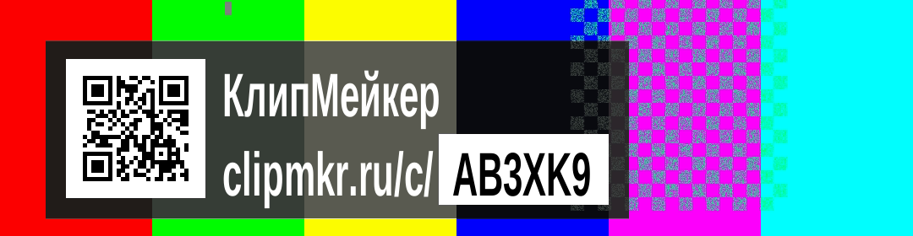
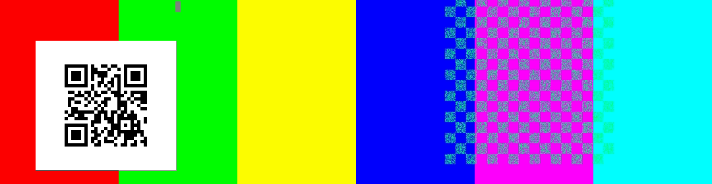

# Бейдж free-клипа — как он выглядит и почему так

Метка (водяной знак), вшиваемая ffmpeg в каждый бесплатный клип. Ограничения — `docs/ADR.md`
ADR-004 и `docs/canon.md` §7. Полный разбор с методикой, тремя прогонами QR и всеми отвергнутыми
вариантами: [`receipts/BD-01-design.md`](receipts/BD-01-design.md).

**Состояние на 23.09.2026: РЕАЛИЗОВАНО** — `packages/shared/src/watermark.ts` (геометрия) и
`apps/worker/src/render/watermark.ts` (сборка фильтров), коммит `cd5da9a`. Картинки ниже
отрисованы по той же геометрии, что в коде: кегль 73, отступы 24/16, чип 16, подложка `black@0,60`.

Числа посчитаны шрифтом образа `ClipMakerNarrow-Bold.ttf` тем же алгоритмом, что `measureText()`.
Кадр 1080×1920.

---

## Как выглядит

Типичный код, на пёстром видео:

Худший возможный код `WWWWWW` — самая широкая метка, которая вообще может получиться:

На почти белом кадре — худший случай для контраста:

| Параметр | Значение |
|---|---|
| Кегль | **73 px** = 3,80 % высоты кадра (канон требует ≥ 3,5 %) |
| Плита | **804 × 116 px** типичный код · **875 × 116 px** худший |
| Доля кадра | 74,4…81,0 % по ширине · **6,0 % по высоте** |
| **Площадь** | **4,50…4,89 % кадра** |
| Полоса по высоте | 81,9 %…88,0 % — внутри безопасной зоны, ниже субтитров |
| Подложка | `black@0,60` · контраст к белому тексту **5,93:1 измеренный худший** |
| Чип с кодом | непрозрачный белый, чёрный текст · контраст **21:1** |
| Запас по ширине (худший код) | 97 px до канонических 972 · 5 px до строгих отраслевых 880 |
| Отказ «не помещается» | **невозможен при коде из 6 символов** |
| QR | нет — обоснование ниже |

Правок канона и ADR-004 не потребовалось: формулировка «текст „КлипМейкер · <домен>/c/<code>“»
реализуется дословно.

---

## Открытый вопрос: кегль 73 и длина кода 10 несовместимы

Канон §7 разрешает **две** длины кода: 6 по умолчанию и 10 у ранее выданных ссылок. Ширина метки
при кегле 73 этого не выдерживает:

| Кегль | Код 6: худшая плита | запас до 972 | Код 10: худшая плита | запас до 972 | отказ при коде 10 |
|---|---|---|---|---|---|
| **68** | 815 px | +157 | 963 px | **+9** | **нет ни при каком коде** |
| 69 | 842 px | +130 | 994 px | −22 | появляется |
| **73 (реализовано)** | 875 px | +97 | **1035 px** | **−63** | **0,0051 % — 1 код из ~19 600** |

Отказ здесь — не обрезка, а брошенное `WatermarkGeometryError`, то есть **упавший рендер**.

Почему это не дефект сегодня и почему всё же стоит решить:

- **Сегодня безопасно.** `N5_SHORT_CODE_LENGTH=6`, десятисимвольных кодов в природе нет (продукт не
  запущен), а `assertWatermarkFits()` проверяет на старте **сконфигурированную** длину на самом
  широком символе алфавита — конфигурация, при которой метка не влезает, не даст процессам
  стартовать. Это правильный fail-closed.
- **Но проверки на уже выданные коды нет.** Клип со старым десятисимвольным кодом при повторном
  рендере пойдёт в `watermarkGeometry` с 10 символами, и у 1 кода из ~19 600 рендер упадёт.
- **И есть прямой довод вернуть длину 10.** Исправление к OWN-007 п.4 показало, что сокращение до 6
  удешевило перебор ссылок примерно в 10⁶ раз (≈ 15 часов с одной подсети при 10 000 живых ссылок
  против порядка двух тысяч лет при длине 10). Если длину вернут, кегль придётся опускать до 68 —
  это правка кода, а не переменной окружения.

**Развилка простая: кегль 73 читается на 7 % лучше, кегль 68 вмещает обе разрешённые каноном
длины.** Решение за владельцем; цена перехода к 68 — −0,53 % площади кадра и x-height 2,16 мм
вместо 2,32 мм.

---

## Отвергнутые варианты — для сравнения

Все три отрисованы той же геометрией (кегль 73), чтобы сравнение было честным.

### Та же строка без чипа

843 × 116 px = **4,72 % кадра** — на 0,17 % меньше. Дешевле, но код сливается с адресом: ровно ту
часть, которую надо перенести на клавиатуру, глазу приходится вычленять самому. Чип стоит 32 px
ширины и эту работу снимает.

### Гибрид с QR

761 × 210 px = **7,71 % кадра** — на 58 % больше реализованного.

### Только QR

213 × 197 px = **2,02 % кадра** — вдвое меньше текста. И всё же отвергнут.

---

## Почему без QR

QR проверен прогоном, а не отвергнут по впечатлению: 35 файлов, 175 попыток распознавания,
пять режимов пережатия включая понижение разрешения до 720p и 576p. **По сжатию QR проходит
уверенно** — достаточно 5 пикселей на модуль, то есть 165 px (15,3 % ширины кадра). Отвергнут он по
четырём другим причинам.

1. **Адрес стал набираемым.** `clipmkr.ru/c/AB3XK9` — 19 знаков против прежних 37. Именно
   невозможность набрать 37 знаков делала QR почти обязательным; при 19 это обычное действие,
   сопоставимое с любой короткой ссылкой. Главное преимущество QR подешевело качественно.
2. **QR стоит +58 % площади метки** и генерации **на каждый клип** — он содержит код, значит это
   новый код на пути рендера: библиотека в образе воркера либо собственный кодировщик. Ровно там
   живёт инвариант ADR-004 «метка рисуется последней», и каждый новый узел графа фильтров — новый
   способ его нарушить.
3. **Текст деградирует плавно, QR — скачком.** Обрезка кадра площадкой, понижение до 576p, зритель
   без сканера — и QR не даёт ничего, потому что читаемых символов адреса в кадре нет вообще.
   У текста запасной путь есть всегда. Плюс страж ADR-004 (б) «рендер содержит `drawtext` с
   `/c/<code>`» остаётся живым только с текстом.
4. **Решение принимается навсегда, и текстовое вперёд-совместимо.** `clipmkr.ru` вшивается в пиксели
   без возможности правки. **QR можно добавить позже — он затронет только новые клипы, а старые
   останутся полностью рабочими, потому что их адрес читаем.** Обратный порядок невозможен: клипы,
   выпущенные с одним QR, нечем чинить, если распознавание окажется хуже ожидаемого.

Если после запуска метрика недели покажет мало переходов по `/c/{code}`, QR — первый кандидат в
эксперимент. Все числа посчитаны: 5 px на модуль, 165 px, гибрид 761 × 210 px. Мерить придётся
признаком источника в ссылке (`/c/КОД?s=q`), иначе не отличить сканирование от набора.

**Побочная находка прогона, годная для любого будущего QR: рисовать целым числом пикселей на модуль
и никогда не масштабировать к произвольной ширине.** Нецелый масштаб делает модули разной ширины и
роняет распознавание там, где номинальное «пикселей на модуль» выглядит достаточным — мой первый ряд
измерений был немонотонным именно поэтому, и ловится это только прогоном.

---

## Три измерения, на которых держится решение

**Контраст.** Порог прозрачности подложки для 4,5:1 над худшим возможным кадром (белым) — **α ≥
0,537**. Взято 0,60: теоретически 5,74:1, **измерено прогоном 5,93:1** над sRGB 250. Значение 0,55
дало бы запас 5 % от порога — слишком тонко для величины, которую нельзя перемерить после
публикации.

**Читаемость на телефоне.** 1080 кадровых пикселей = ширина экрана. На 6,1″ это 64,9 мм, то есть при
кегле 73 x-height = **2,32 мм = 26,6 угловых минуты** с 30 см: 1,33× от порога комфортного чтения и
≈5× от порога различимости. Размер узким местом не является. Прочитают ли метку на ходу — отвечает
FR-GROWTH-005, два человека и пять клипов; эта таблица его не заменяет.

**Ширина.** Худший из 32⁶ возможных кодов даёт плиту 875 px при полезных 972. Отказ «не помещается»
при длине 6 не редок, а арифметически невозможен.

---

## Что это НЕ доказывает

1. **Вертикальную раскладку в ffmpeg 7.** Прогоны шли на ffmpeg 4.4.2; в образе воркера — 7.
   Горизонтальные ширины версионно-независимы (считаны из таблицы шрифта), **вертикальные
   координаты — нет**. Один прогон в образе обязателен.
2. **Читаемость на настоящем телефоне.** Расчёт геометрии и углового размера — не наблюдение.
3. **Безопасные зоны площадок.** Числа VK, Rutube, TikTok, Reels взяты из сторонних публикаций
   2026 года, не из документации площадок; между собой они расходятся (левый отступ 60 против
   100 px), и я брал строгое значение.
4. **Поведение над реальным видео.** Подложки прогонов — `testsrc2` и синтетический светлый
   градиент, а не настоящий подкаст.
5. **Правовую чистоту домена.** `clipmkr.ru` взят как заданный OWN-007; на момент написания он в
   состоянии UNVERIFIED (коммит `9ae2829`). Адрес уходит в пиксели навсегда.

---

## Открытые вопросы владельцу

| № | Вопрос | Цена |
|---|---|---|
| **Q10** | **Кегль 73 или 68.** 73 читается на 7 % лучше; 68 вмещает обе разрешённые каноном длины кода (6 и 10) | переход к 68: −0,53 % площади кадра, x-height 2,16 мм вместо 2,32. Правка одной константы в `packages/shared/src/watermark.ts` |
| **Q4** | Нижний отступ 12 % = 231 px выше свёрнутого интерфейса VK (200 px), но ниже развёрнутого (380 у VK, 350 у TikTok, 320 у Reels): при развёрнутом описании метка закрыта | поднять до 13,5 % (260 px) — метка сдвинется вверх на 29 px, ни с чем не столкнётся. Полный уход из-под развёрнутого описания — это 20 % высоты, то есть переезд метки в середину кадра, а это другое решение, не правка числа |
| **Q3** | Левый отступ канона 5 % = 54 px ниже, чем декларирует сама VK (60 px), и вдвое ниже отраслевой универсальной зоны (100 px) | при кегле 73 и коде 6 запас до строгой зоны — **5 px**, то есть ужесточение отступа метку сломает. При кегле 68 запас 65 px |

Закрыты решением OWN-007 и сокращением кода: прежние вопросы о длине кода, длине домена и снятии
слова «КлипМейкер» из канона.
