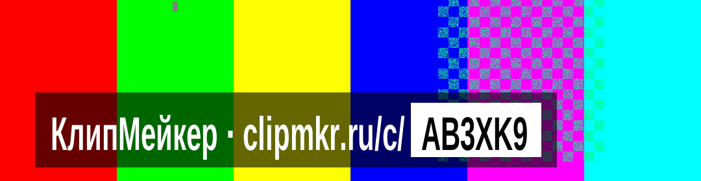
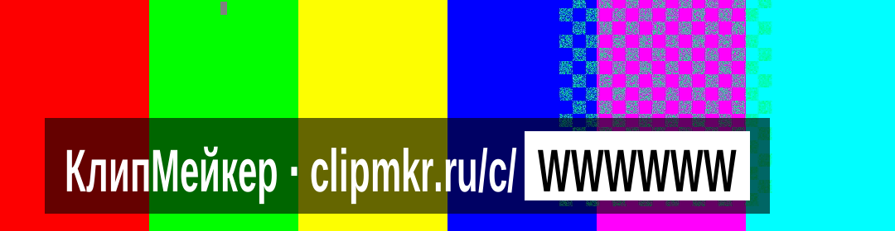
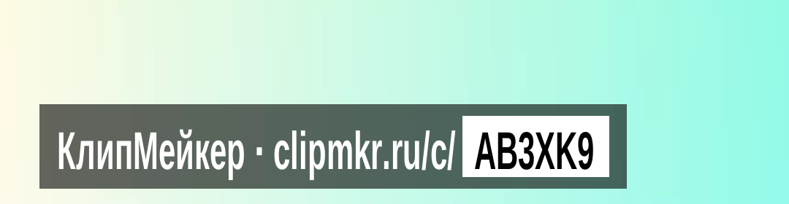
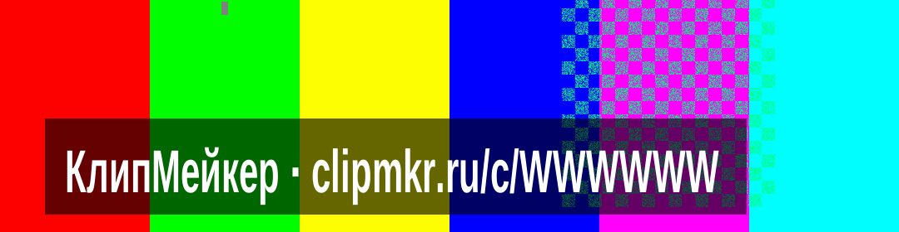
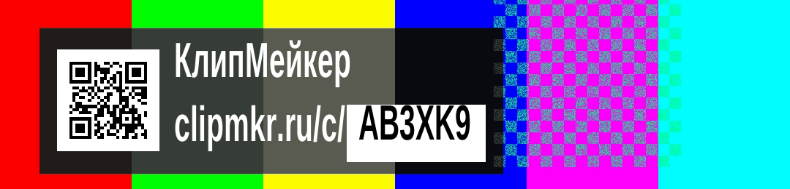
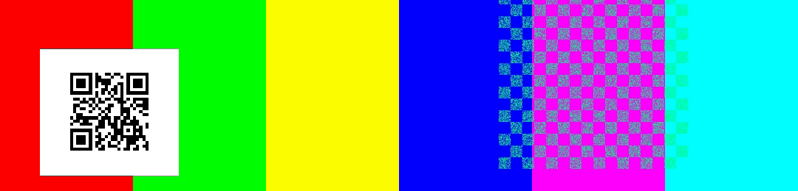

# Бейдж free-клипа — предложение

Метка (водяной знак), вшиваемая ffmpeg в каждый бесплатный клип. Ограничения — `docs/ADR.md`
ADR-004 и `docs/canon.md` §7. Полный разбор с методикой измерений, тремя прогонами и всеми
отвергнутыми вариантами: [`receipts/BD-01-design.md`](receipts/BD-01-design.md).

Все числа посчитаны шрифтом образа `apps/worker/assets/fonts/ClipMakerNarrow-Bold.ttf` тем же
алгоритмом, что `measureText()` в `apps/worker/src/render/watermark.ts`. Кадр 1080×1920.

**Состояние: предложение. Код не менялся.**

---

## Рекомендация — вариант Д «Строка»

Одна строка: `КлипМейкер · clipmkr.ru/c/` плюс код в инверсном белом чипе.

Типичный код, на пёстром видео:



Худший возможный код `WWWWWW` — самая широкая метка, которая вообще может получиться:



На почти белом кадре — худший случай для контраста:



| Параметр | Значение |
|---|---|
| Кегль | **68 px** = 3,54 % высоты кадра (минимум канона — 3,5 %) |
| Плита | **751 × 111 px** типичный код · **815 × 111 px** худший |
| Доля кадра | 69,5…75,5 % по ширине · **5,8 % по высоте** |
| **Площадь** | **4,02…4,36 % кадра** |
| Полоса по высоте | 82,2 %…88,0 % — внутри безопасной зоны, ниже субтитров |
| Подложка | `black@0,60` · контраст к белому тексту **5,93:1 измеренный худший** |
| Чип с кодом | непрозрачный белый, чёрный текст · контраст **21:1** |
| Запас по ширине | 157 px до канонических 972 · **65 px до строгих отраслевых 880** |
| Отказ «не помещается» | **невозможен** ни при каком коде |
| QR | **нет** — обоснование ниже |

Геометрия для 1080×1920 (ширина префикса `КлипМейкер · clipmkr.ru/c/` при кегле 68 — ровно 513 px):

```
drawbox  x=54  y=1578 w=<48+513+чип> h=111  color=black@0.60
drawtext 'КлипМейкер · clipmkr.ru/c/'  x=78  y=1594  fontcolor=white
drawbox  x=591 y=1594 w=<32+ширина(КОД)> h=79  color=white
drawtext '<КОД>'                       x=607 y=1594  fontcolor=black
```

Единственная величина, считаемая по коду, — ширина чипа. Всё остальное — константы кадра.

**Правок канона и ADR-004 не требуется.** Формулировка «текст „КлипМейкер · <домен>/c/<code>“»
реализуется дословно.

---

## Отвергнутые варианты — для сравнения

### Та же строка без чипа



783 × 111 px, **4,19 % кадра** — на 0,17 % меньше. Дешевле, но код сливается с адресом: ровно ту
часть, которую надо перенести на клавиатуру, глазу приходится вычленять самому. Чип стоит 32 px
ширины и эту работу снимает.

### Гибрид с QR



723 × 200 px = **6,97 % кадра** — на 60 % больше рекомендованного.

### Только QR



213 × 197 px = **2,02 % кадра** — вдвое меньше текста. И всё же отвергнут.

---

## Почему без QR

QR проверен прогоном, а не отвергнут по впечатлению: 35 файлов, 175 попыток распознавания,
пять режимов пережатия включая понижение разрешения до 720p и 576p. **По сжатию QR проходит
уверенно** — достаточно 5 пикселей на модуль, то есть 165 px (15,3 % ширины кадра). Отвергнут он по
четырём другим причинам.

1. **Адрес стал набираемым.** `clipmkr.ru/c/AB3XK9` — 19 знаков против прежних 37. Именно
   невозможность набрать 37 знаков делала QR почти обязательным; при 19 это обычное действие,
   сопоставимое с любой короткой ссылкой. Главное преимущество QR подешевело качественно.
2. **QR стоит +60 % площади метки** и генерации **на каждый клип** — он содержит код, значит это
   новый код на пути рендера: библиотека в образе воркера либо собственный кодировщик. Ровно там
   живёт инвариант ADR-004 «метка рисуется последней», и каждый новый узел графа фильтров — новый
   способ его нарушить.
3. **Текст деградирует плавно, QR — скачком.** Обрезка кадра площадкой, понижение до 576p, зритель
   без сканера — и QR не даёт ничего, потому что читаемых символов адреса в кадре нет вообще.
   У текста запасной путь есть всегда. Плюс страж ADR-004 (б) «рендер содержит `drawtext` с
   `/c/<code>`» остаётся живым только с текстом.
4. **Решение принимается навсегда, и текстовое вперёд-совместимо.** `clipmkr.ru` вшивается в пиксели
   без возможности правки. **QR можно добавить позже — он затронет только новые клипы, а старые
   останутся полностью рабочими, потому что их адрес читаем.** Обратный порядок невозможен: клипы,
   выпущенные с одним QR, нечем чинить, если распознавание окажется хуже ожидаемого.

Если после запуска метрика недели покажет мало переходов по `/c/{code}`, QR — первый кандидат в
эксперимент. Все числа для него посчитаны: 5 px на модуль, 165 px, гибрид 723 × 200 px. Мерить
придётся признаком источника в ссылке (`/c/КОД?s=q`), иначе не отличить сканирование от набора.

---

## Три измерения, на которых держится рекомендация

**Контраст.** Порог прозрачности подложки для 4,5:1 над худшим возможным кадром (белым) — **α ≥
0,537**. Взято 0,60: теоретически 5,74:1, **измерено прогоном 5,93:1** над sRGB 250. Значение 0,55
дало бы запас 5 % от порога — слишком тонко для величины, которую нельзя перемерить после
публикации.

**Читаемость на телефоне.** 1080 кадровых пикселей = ширина экрана. На 6,1″ это 64,9 мм, то есть
x-height = **2,16 мм = 24,7 угловых минуты** с 30 см: 1,24× от порога комфортного чтения и ≈5× от
порога различимости. Размер узким местом не является. Прочитают ли метку на ходу — отвечает
FR-GROWTH-005, два человека и пять клипов; эта таблица его не заменяет.

**Ширина.** Худший из 32⁶ возможных кодов даёт плиту 815 px при полезных 972 и строгих отраслевых
880. Отказ «не помещается» не редок, а арифметически невозможен.

**Бесплатный запас.** Канон требует ≥ 3,5 %, то есть 68 px — минимум, а не предписание. Кегль **73 px
(3,80 %) берётся без единой правки канона** и всё ещё переживает строгую зону 880 с худшим кодом;
x-height растёт с 2,16 до 2,32 мм. Рекомендую оставить 68: метка не должна быть крупнее, чем нужно
для чтения.

---

## Что это предложение НЕ доказывает

1. **Вертикальную раскладку в ffmpeg 7.** Прогоны шли на ffmpeg 4.4.2; в образе воркера — 7.
   Горизонтальные ширины версионно-независимы (считаны из таблицы шрифта), **вертикальные
   координаты — нет**. Один прогон в образе обязателен.
2. **Читаемость на настоящем телефоне.** Расчёт геометрии и углового размера — не наблюдение.
3. **Безопасные зоны площадок.** Числа VK, Rutube, TikTok, Reels взяты из сторонних публикаций
   2026 года, не из документации площадок; между собой они расходятся (левый отступ 60 против
   100 px), и я брал строгое значение.
4. **Поведение над реальным видео.** Подложки прогонов — `testsrc2` и синтетический светлый
   градиент.
5. **Домен `clipmkr.ru`** не проверялся на доступность, регистрацию и отсутствие конфликта с чужим
   товарным знаком — взят как заданный OWN-007. Адрес уходит в пиксели навсегда.

---

## Открытые вопросы владельцу

| № | Вопрос | Цена |
|---|---|---|
| **Q3** | Левый отступ канона 5 % = 54 px ниже, чем декларирует сама VK (60 px), и вдвое ниже отраслевой универсальной зоны (100 px) | **обесценился**: вариант Д влезает в обе зоны, ужесточение отступа теперь ничего не ломает |
| **Q4** | Нижний отступ 12 % = 231 px выше свёрнутого интерфейса VK (200 px), но ниже развёрнутого (380 у VK, 350 у TikTok, 320 у Reels): при развёрнутом описании метка закрыта | поднять до 13,5 % (260 px) — метка сдвинется вверх на 29 px, ни с чем не столкнётся. Полный уход из-под развёрнутого описания — это 20 % высоты, то есть переезд метки в середину кадра, а это другое решение, не правка числа |
| **Q10** | Кегль: оставить 68 px (минимум канона, наименьший след) или поднять до 73 px ради читаемости | +0,53 % площади кадра, правок канона не требует |

Закрыты решением OWN-007 и сокращением кода до 6 символов: прежние вопросы о длине кода, длине
домена и снятии слова «КлипМейкер» из канона.
