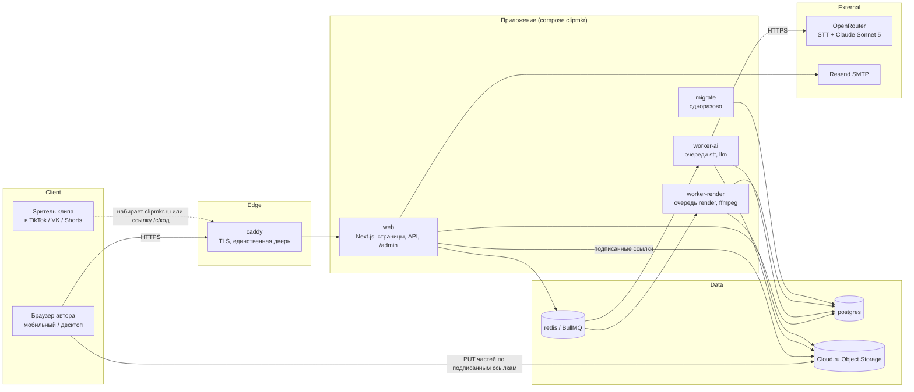
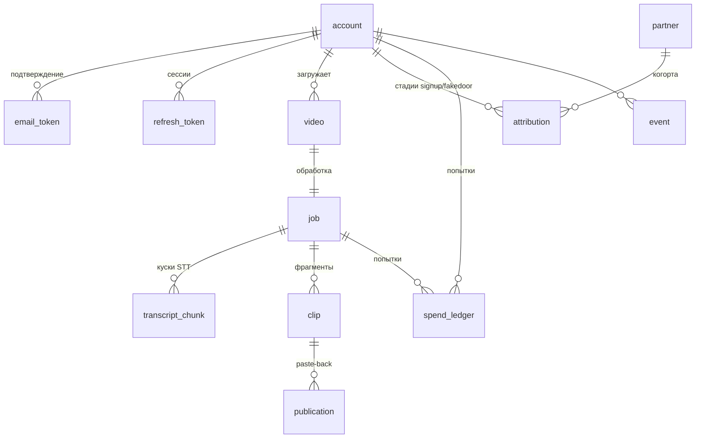

# Architecture — проект 05a «ClipMkr»

**RUN_ID:** 20260923T173212Z-replicate-05a-475b · **WORK_UNIT_ID:** architecture · **Автор:** Claude Opus 5.5 · 2026-09-23
**Основание:** [`ADR.md`](ADR.md) (ADR-001…017), канон имён [`canon.md`](canon.md) (sha256 `b16ad2d2…`, запись в `dispatch-plan.md`),
[`Specification.md`](Specification.md), аудит донора [`discovery/R3-jan-audit.md`](discovery/R3-jan-audit.md) и код
`.reference/jan-clone@cc6ac59`. Имена сервисов, таблиц, очередей, переменных и событий — только из канона.
Диаграммы C4 — в [`C4_Diagrams.md`](C4_Diagrams.md).

## Architecture Overview

**Стиль:** распределённый монолит в монорепо (Distributed Monolith). Один репозиторий, один образ, пять
процессов с разными ролями в Docker Compose на одном VPS в Нидерландах. Почему не микросервисы: неделя, один
разработчик-конвейер, одна БД; разделение на процессы нужно только там, где различаются ресурс (CPU ffmpeg против
сетевых вызовов) и права (ключи моделей только у одного процесса).



## Component Breakdown

| Компонент | Процесс | Отвечает за | Не делает |
|---|---|---|---|
| Edge | `caddy` | TLS для `clipmkr.ru` (ACME), проксирование на `web:3000`, лимит размера тела 1 МБ на `/api/*` | не видит видео: байты идут в S3 мимо него |
| Web UI | `web` | лендинг, `/plans`, fake-door, экраны задачи и клипов, `/admin/*` оператора | не зовёт модели, не запускает ffmpeg |
| Web API | `web` | вход, `POST /api/videos` (multipart-ссылки), `…/complete` → `202 {job_id}`, состояние задачи, события (включая `caption-copied`), paste-back, `/p/…`, `/c/…` | не держит соединение БД во время чтения тела запроса |
| Pipeline orchestration | `worker-ai` | нарезка аудио на куски, STT через `Transcriber`, сшивка спикеров, выбор фрагментов через `SelectionModel`, постановка рендеров, heartbeat задачи | не рендерит видео |
| Render | `worker-render` | ffmpeg: чёрные поля, ASS-субтитры, знак, превью; загрузка клипа в S3 | не имеет ключей моделей |
| Quota & spend | библиотека в `worker-ai` и `web` | атомарный резерв в `quota_counter`, факт в `spend_ledger` | не решает «пропустить» при недоступной БД — это отказ |
| Migrations | `migrate` | `prisma migrate deploy` до старта остальных | — |
| Ops | `/admin/*` в `web`, роль `operator` | партнёры, проверка публикаций, расход, метрики, смена плана; каждое изменение — в `audit_log` | роль не выдаётся через интерфейс: только `docker compose exec worker-ai ops grant-operator <email>` |

## Technology Stack

| Layer | Technology | Rationale |
|---|---|---|
| Frontend | Next.js 15.5.12 (App Router), React 19.2.4, Tailwind — по lock-файлу донора | переиспользование UI донора; версии после исправлений CVE-2025-29927 и CVE-2025-55182 (ADR-012) |
| Backend | Next.js route handlers + tRPC 11 (донор); Node.js 20 в воркерах | один язык, общие пакеты `@clipmkr/*` |
| Database | PostgreSQL 16 (`postgres:16-alpine`), Prisma 6 | схема донора урезается; атомарные условные `UPDATE` для потолков |
| Cache / rate limit | Redis 7 (`redis:7-alpine`, пароль) | общий с очередью; счётчики частоты входа и регистраций |
| Queue | BullMQ 5 на Redis (OWN-003) | три очереди `stt`/`llm`/`render` (канон §3) |
| Object storage | Cloud.ru Evolution Object Storage (S3, prod), MinIO (test) — OWN-004 | multipart, CORS, lifecycle (ADR-007) |
| Media | ffmpeg из `apk` в образе `node:20-alpine` | модуль донора `ffmpeg.ts` (ADR-009/010) |
| Models | OpenRouter: STT-модель по пробе дня 1, `anthropic/claude-sonnet-5` | единый маршрут из Нидерландов (ADR-003/005) |
| Infrastructure | Docker Compose, Caddy 2.8, VPS в Нидерландах | прямой деплой compose; TLS без отдельного инструмента |

## External Dependencies

Every capability this product needs from someone else's service. One row per capability, not one row per vendor.
Проверено 2026-09-23.

| Capability needed | Provider / API | Evidence | Verdict | Requirements relying on it |
|---|---|---|---|---|
| Транскрипция аудиофайла с метками времени | OpenRouter `/api/v1/audio/transcriptions` | [openrouter.ai/docs/guides/overview/multimodal/stt](https://openrouter.ai/docs/guides/overview/multimodal/stt) · checked 2026-09-23 · «Set `response_format` to `verbose_json` and include `"timestamp_granularities": ["segment"]`» | CONFIRMED | FR-clips-4, AC-clips-6 |
| Метки спикеров (диаризация) в ответе транскрипции | OpenRouter, опция провайдера модели | та же страница · checked 2026-09-23 · «Speaker diarization is enabled through the provider's own option under `provider.options`». Какая модель реально возвращает `speaker` через OpenRouter — решает проба дня 1 | CONFIRMED (механизм); модель — проба | FR-clips-4, FR-clips-7, AC-clips-24 |
| Предел запроса транскрипции | OpenRouter | та же страница · «Multipart uploads are limited to 25 MB» · «upstream providers time out after 60 seconds per request» | CONFIRMED (ограничение учтено куском 60–120 с) | FR-clips-4 |
| Выбор фрагментов с ответом по JSON-схеме | OpenRouter, `anthropic/claude-sonnet-5` | [openrouter.ai/docs/features/structured-outputs](https://openrouter.ai/docs/features/structured-outputs) · «OpenRouter supports structured outputs for compatible models, ensuring responses follow a specific JSON Schema format»; [openrouter.ai/api/v1/models](https://openrouter.ai/api/v1/models): у `anthropic/claude-sonnet-5` в `supported_parameters` есть `structured_outputs` · checked 2026-09-23 | CONFIRMED | FR-clips-5, FR-clips-6, AC-clips-8, AC-clips-9 |
| Фактическая стоимость каждого вызова | OpenRouter usage accounting | [openrouter.ai/docs/use-cases/usage-accounting](https://openrouter.ai/docs/use-cases/usage-accounting) · checked 2026-09-23 · «`cost`: The total amount charged to your account» | CONFIRMED | FR-clips-10, AC-clips-16 |
| Запасной STT с диаризацией напрямую | OpenAI `gpt-4o-transcribe-diarize` | [developers.openai.com/api/docs/guides/speech-to-text](https://developers.openai.com/api/docs/guides/speech-to-text) · checked 2026-09-23 · «Request the `diarized_json` response format to receive segments with `speaker`, `start`, and `end` metadata» | CONFIRMED | FR-clips-4 (запасной путь) |
| Загрузка частями из браузера в бакет | Cloud.ru Evolution Object Storage | [cloud.ru/docs/s3e/ug/topics/api__methods](https://cloud.ru/docs/s3e/ug/topics/api__methods) · checked 2026-09-23 · `CreateMultipartUpload` — «Запускает multipart-загрузку объекта» | CONFIRMED | FR-clips-2, AC-clips-2 |
| Подписанные ссылки на объект | Cloud.ru Evolution Object Storage | [cloud.ru/docs/s3e/ug/topics/api__aws-sig-v4](https://cloud.ru/docs/s3e/ug/topics/api__aws-sig-v4) · checked 2026-09-23 · «Такой метод аутентификации позволяет сформировать подписанную ссылку (presigned URL)» | CONFIRMED | FR-clips-2, FR-clips-8, AC-clips-20 |
| CORS бакета для загрузки из браузера | Cloud.ru Evolution Object Storage | methods · checked 2026-09-23 · `PutBucketCors` — «Устанавливает конфигурацию CORS бакета» | CONFIRMED | FR-clips-2 |
| Удаление объектов по сроку | Cloud.ru Evolution Object Storage | methods · checked 2026-09-23 · `PutBucketLifecycleConfiguration` — «Создает новую конфигурацию жизненного цикла бакета» | CONFIRMED | FR-clips-13, AC-clips-17 |
| Отправка письма подтверждения email по SMTP | Resend, `smtp.resend.com:465` (OWN-05A-011) | [resend.com/docs/send-with-smtp](https://resend.com/docs/send-with-smtp) · checked 2026-09-23 · host `smtp.resend.com`, порт `465` — «Implicit SSL/TLS (Immediately connects via SSL/TLS)», пароль — API-ключ | CONFIRMED | FR-clips-1, AC-clips-21 |
| Отправка с домена `clipmkr.ru` (SPF/DKIM) | Resend, проверка домена | [resend.com/docs/add-a-domain](https://resend.com/docs/add-a-domain) · checked 2026-09-23 · «Provide the DKIM and SPF configurations (`TXT` and `MX` or `CNAME` records) to your DNS provider» | CONFIRMED (записи в DNS — чек-лист до беты) | FR-clips-1, AC-clips-21 |
| Выпуск TLS-сертификата для `clipmkr.ru` | Caddy + ACME (Let's Encrypt / ZeroSSL) | [caddyserver.com/docs/automatic-https](https://caddyserver.com/docs/automatic-https) · checked 2026-09-23 · «By default, Caddy serves all sites over HTTPS» | CONFIRMED (требует DNS A на сервер и открытые 80/443) | NFR-clips-2, FR-clips-14 |

**Строк UNCONFIRMED нет.** Почтовый провайдер выбран владельцем — Resend (OWN-05A-011): `SMTP_URL=smtps://resend:<API-ключ>@smtp.resend.com:465`,
`MAIL_FROM` на домене `clipmkr.ru` с SPF/DKIM. FR-clips-1 п. 1 и AC-clips-21 входят в Phase 3. Доставка на
`mail.ru` и `yandex.ru` проверяется письмом в день 1 `[НЕ ПРОВЕРЕНО]`.

## Deployment Topology (Docker Compose)

Файл `docker-compose.yml`, `name: clipmkr`. Сервисы — строго канон §1: caddy, web, migrate, worker-ai, worker-render,
postgres, redis, minio. Профиль `prod` — VPS в Нидерландах; профиль `test` — машина разработки (здесь заняты 80, 443,
3002, 5480, 8080, 8081, 8088, 11000, 11001, 11379, 11432, поэтому `caddy` здесь не стартует).

```yaml
name: clipmkr
x-app: &app
  build: { context: ., dockerfile: Dockerfile }   # контекст — корень монорепо
  image: clipmkr/app:${APP_VERSION:?APP_VERSION обязателен}
  restart: unless-stopped
  depends_on:
    postgres: { condition: service_healthy }
    redis:    { condition: service_healthy }
    migrate:  { condition: service_completed_successfully }
services:
  caddy:
    image: caddy:2.8-alpine
    profiles: [prod]
    restart: unless-stopped
    ports: ["${CADDY_HTTP_PORT:-80}:80", "${CADDY_HTTPS_PORT:-443}:443"]
    depends_on: { web: { condition: service_healthy } }
  web:
    <<: *app
    profiles: [prod, test]
    command: ["web"]
    ports: ["127.0.0.1:${WEB_PORT:-3105}:3000"]   # только петля: снаружи обойти caddy нельзя
    healthcheck: { test: ["CMD", "wget", "-qO-", "http://127.0.0.1:3000/api/health"], interval: 10s, retries: 6 }
  migrate:
    <<: *app
    profiles: [prod, test]
    command: ["migrate"]
    restart: "no"
    depends_on: { postgres: { condition: service_healthy } }
  worker-ai:
    <<: *app
    profiles: [prod, test]
    command: ["worker-ai"]
    stop_grace_period: 60s
  worker-render:
    <<: *app
    profiles: [prod, test]
    command: ["worker-render"]
    stop_grace_period: 60s
    cpus: "${RENDER_CPUS:-2}"
  postgres:
    image: postgres:16-alpine
    restart: unless-stopped
    healthcheck: { test: ["CMD-SHELL", "pg_isready -U $$POSTGRES_USER"], interval: 5s, retries: 10 }
    # ports: НЕТ — правило №0 docker-ports
  redis:
    image: redis:7-alpine
    restart: unless-stopped
    environment: { REDIS_PASSWORD: "${REDIS_PASSWORD:?REDIS_PASSWORD обязателен}" }   # нужен healthcheck внутри контейнера
    command: ["redis-server", "--requirepass", "${REDIS_PASSWORD:?REDIS_PASSWORD обязателен}"]
    healthcheck: { test: ["CMD-SHELL", "redis-cli -a $$REDIS_PASSWORD ping"], interval: 5s, retries: 10 }
  minio:
    image: minio/minio:${MINIO_TAG:?тег RELEASE.… обязателен}
    profiles: [test]
    restart: unless-stopped
    healthcheck: { test: ["CMD", "mc", "ready", "local"], interval: 5s, retries: 10 }
```

Правила топологии (каждое проверяется скриптом, а не глазами):

1. **Хранилища не публикуются.** У `postgres`, `redis`, `minio` нет `ports:`; соседи обращаются по имени сервиса.
   Проверка: `node .claude/hooks/check-ports.cjs projects/05a-podcast-clips-opus` → 0.
2. **Единственная дверь в prod — `caddy`.** `web` публикуется только на петлю `127.0.0.1` (для отладки с самого
   сервера); на внешний интерфейс — никогда, иначе прокси обходится вместе с TLS и лимитами. Проверка — тот же
   `check-ports.cjs` (раздел «за reverse-proxy»).
3. **Хостовые порты — только `${VAR:-default}`**; дефолты `3105`, `80`, `443`. Перед `up` на машине разработки —
   `bash scripts/check-port-conflicts.sh projects/05a-podcast-clips-opus`.
4. `restart: unless-stopped` у всех, кроме одноразового `migrate`; зависимости ждут `service_healthy`, а
   приложения — `service_completed_successfully` у `migrate` (урок compose-hygiene §4: воркер раньше миграций).
5. Все образы с тегами; `latest` запрещён; у каждого дополнительного compose-файла свой `name:` (для тестового
   стека — `clipmkr-test`).
6. Секреты — `env_file` на сервер (права 600, вне git); список `environment:` у каждого сервиса — ровно его
   переменные из канона §6: ключи моделей есть только у `worker-ai`, ключи оплаты (v1) — только у `web`.

### Сборка монорепо (compose-hygiene §5)

| Правило | Как исполняется |
|---|---|
| Контекст сборки — корень монорепо | `build.context: .` в `x-app` |
| `npm ci` видит манифесты всех workspace | Dockerfile копирует `package.json` каждого из 9 пакетов канона §2 до `npm ci` (дефект донора: не копировались `s3`, `crypto`) |
| `COPY` результата из пути workspace | `COPY --from=build /app/apps/web/.next /app/apps/web/.next`, `apps/worker/dist` |
| Команда — существующий скрипт | точка входа `docker-entrypoint.sh` с ролями `web`, `migrate`, `worker-ai`, `worker-render`; каждая роль → скрипт своего `package.json` (у донора compose звал несуществующий `video.js`) |
| `.dockerignore` | `node_modules`, `.env*`, `tests`, `.reference`, `docs` |

ffmpeg ставится в финальный образ один раз (`apk add ffmpeg font-noto`); шрифт для кириллицы и знака — из образа.

### Деплой на VPS в Нидерландах

1. VPS: Linux, 4 vCPU / 8 ГБ ОЗУ / 80 ГБ диска `[ПРЕДЛОЖЕНИЕ; уточнить по замеру рендера ADR-010]`; провайдер
   из ограничений (AdminVPS/HOSTKEY), наличие площадки в Нидерландах `[НЕ ПРОВЕРЕНО]`.
2. DNS: A-запись `clipmkr.ru` → IP сервера (сейчас домен делегирован на `ns*.yandexcloud.net`, A = 212.192.0.33,
   HTTPS не отвечает — OWN-05A-006).
3. Файрвол: наружу открыты только 22, 80, 443.
4. `git pull` → `docker compose --profile prod build` → `docker compose --profile prod up -d`. Откат: предыдущий `APP_VERSION`.
5. После `up`: `bash scripts/check-cjm.sh https://clipmkr.ru` — сквозной путь по выданным адресам, не по
   `localhost` (deployment-seams).

## Data Architecture

Поля таблиц перечислены **один раз** — в каноне §4; здесь только связи, хранение и индексы.



| Хранилище | Что | Срок |
|---|---|---|
| Postgres | всё состояние; `job` — источник истины задачи (ADR-008) | бессрочно; `event` без сырого IP |
| Redis | очереди BullMQ, счётчики частоты входа/регистраций | эфемерно; потеря Redis не теряет задач: `job` в Postgres, воркер переставляет незавершённые куски |
| S3 | исходник, аудио-куски, клипы, превью — ключи канона §8 | исходник 72 ч после завершения задачи (+ правило бакета 7 дней), `tmp/` 1 день, клипы 30 дней |

**Индексы и ограничения, на которых держатся инварианты:**

- `job (account_id, idempotency_key)` UNIQUE — повторное «завершить загрузку» возвращает тот же `job_id`;
- `transcript_chunk (job_id, chunk_idx)` UNIQUE — кусок сохраняется один раз, повтор его пропускает;
- `clip.clip_code` UNIQUE, `publication.url_normalized` UNIQUE, `partner.partner_code` UNIQUE,
  `attribution (account_id, stage)` UNIQUE;
- `quota_counter` PK (`scope`, `scope_id`, `day`, `kind`); резерв —
  `INSERT … ON CONFLICT DO UPDATE SET used = used + :n WHERE quota_counter.used + :n <= :limit RETURNING used`;
  пустой `RETURNING` = отказ. Схема «прочитать, затем записать» запрещена;
- `event` — дедупликация `download_clicked`/`share_clicked` частичным уникальным индексом по
  (`name`, `account_id`, `clip_id`, дата Europe/Moscow).

Деньги — целые копейки (`_kop`), стоимость OpenRouter — целые микродоллары (`_usd_micro`), медиа — миллисекунды
(`_ms`), квоты STT — секунды (`_sec`); плавающей точки в схеме нет (канон §11).

## Pipeline: загрузка → STT → LLM → рендер → просмотр → публикация

```mermaid
sequenceDiagram
  autonumber
  participant B as Браузер
  participant W as web
  participant S3 as Cloud.ru S3
  participant PG as postgres
  participant Q as BullMQ
  participant AI as worker-ai
  participant OR as OpenRouter
  participant R as worker-render
  B->>W: POST /api/videos {size, name}
  W->>W: сессия, email подтверждён, лимит частоты, размер ≤ 2 ГБ, ≤ 3 загрузок в сутки
  W->>S3: CreateMultipartUpload
  W-->>B: video_id + подписанные ссылки на части (TTL 15 мин)
  B->>S3: PUT частей
  B->>W: POST /api/videos/{video_id}/complete (Idempotency-Key)
  W->>S3: CompleteMultipartUpload, HeadObject
  W->>PG: INSERT job (running, transcribing) ON CONFLICT → тот же job_id
  W->>Q: add stt {job_id}:stt:prepare
  W-->>B: 202 {job_id}
  AI->>S3: скачать исходник; magic bytes; ffprobe (длительность ≤ 120 мин)
  AI->>PG: резерв quota_counter STT на секунды всего видео (атомарно), иначе failed/quota_*
  loop кусок 60–120 с, пропуская done
    AI->>PG: spend_ledger попытка; повтор куска резервирует его секунды дополнительно
    AI->>OR: transcriptions (verbose_json, диаризация)
    AI->>PG: transcript_chunk done + факт стоимости
  end
  AI->>AI: склейка, монотонность, сшивка спикеров
  AI->>PG: резерв LLM (копейки, верхняя оценка)
  AI->>OR: chat.completions anthropic/claude-sonnet-5, json_schema
  AI->>PG: clip × N (queued), step = rendering
  AI->>Q: add render {clip_id} × N
  R->>S3: исходник → ffmpeg (поля, ASS, знак) → клип
  R->>PG: clip ready; clips_done++; последний → job succeeded
  B->>W: GET /api/jobs/{job_id} (опрос)
  B->>W: GET /api/clips/{clip_id}/file → подписанная ссылка 15 мин
  B->>W: POST /api/clips/{clip_id}/publications (URL)
```

Чего в потоке нет намеренно: сервер не держит соединение БД во время сетевого вызова (STT, LLM, S3); результат
пишется короткой транзакцией после вызова. Недоступность провайдера — исключение, откатывающее транзакцию
(security-operation-order).

## Queues, Leases and Long-Running Job

| Очередь | Потребитель | Конкурентность | `jobId` | Повтор |
|---|---|---|---|---|
| `stt` | `worker-ai` | 2 задачи на процесс; ≤ 2 параллельных куска на задачу, ≤ 4 глобально (NFR-clips-5) | `{job_id}:stt:prepare` — подготовка (magic bytes, `ffprobe`, нарезка); `{job_id}:stt:{chunk_idx}` — кусок | 3 попытки, экспонента от 5 с |
| `llm` | `worker-ai` | 2 | `{job_id}:llm` | ≤ `LIMIT_LLM_ATTEMPTS_JOB` = 2 |
| `render` | `worker-render` | `RENDER_CONCURRENCY` (1 на 2 vCPU) | `{clip_id}:render` | 3 попытки; готовый клип не рендерится повторно |

- **Три состояния** `running` · `succeeded` · `failed` — поле `job.status`; шаг — `job.step`; причина —
  `job.fail_reason` из закрытого списка (канон §5).
- **Аренда.** BullMQ `lockDuration` 120 с с автопродлением; отдельно воркер пишет `job.heartbeat_at` каждые 30 с.
  Нет heartbeat 300 с → задача переставляется, `attempt_count` растёт; после 3 → `failed/worker_lost`. UI при
  heartbeat старше 2 мин показывает «обработчик молчит N мин» внутри `running` — молчание не выдаётся за работу.
- **Повтор продолжает.** Готовые `transcript_chunk`, результат LLM (строки `clip`) и готовые клипы не
  пересоздаются; резерв потолка на них не повторяется.
- **Остановка.** SIGTERM → `worker.close()` (дождаться активной задачи до `stop_grace_period`) — дефект донора
  `process.exit(0)` не переносится.
- Контракт для ворот — `docs/long-job-contract.md` (пишет единица refinement-completion).

## Security Architecture

**Аутентификация.** Email + пароль (argon2id), подтверждение почты до первой загрузки, JWT access 15 мин +
refresh-cookie `HttpOnly; Secure; SameSite=Lax`; refresh хранится хэшем в `refresh_token`, отзывается. Лимиты
регистраций и входа — в Redis, **до** проверки пароля; недоступный Redis — отказ `503`, а не «без лимита» (у донора
`rate-limit.ts` открывался при сбое — переписывается).

**Авторизация.** Проверка владения в каждом обработчике, не только в middleware (урок CVE-2025-29927). Чужой
`clip_id`/`job_id` → `404`. `/admin/*` — только `account.role = operator`, проверка в middleware **и** в каждом
серверном обработчике; значение роли, отличное от ровно `operator`, читается как `user` (fail-closed). Роль ставит
только `docker compose exec worker-ai ops grant-operator <email>`. План `paid` меняет только оператор; решение о знаке принимает `worker-render` по БД.

**Границы доверия и порядок операций** (security-operation-order):

| Граница | Порядок |
|---|---|
| Интернет → `caddy` → `web` | TLS → лимит тела → сессия → лимит частоты → валидация (размер, схема) → резерв потолка → действие |
| Браузер → S3 | подписанная ссылка на конкретный ключ и часть, TTL 15 мин; после сборки — `HeadObject`, magic bytes, `ffprobe` в воркере; отказ удаляет объект |
| `worker-ai` → OpenRouter | резерв потолка → вызов вне транзакции → факт в `spend_ledger`; TLS всегда проверяется |
| Транскрипт → LLM | транскрипт внутри `<transcript>` как данные; ответ проходит JSON-схему; цитаты сверяются с текстом кодом |
| Текст → ffmpeg | `execFile`/`spawn` без shell; экранирование `escapeAssText`/`escapeDrawtext` донора |
| Посетитель → `/p/…`, `/c/…` | лимит 30 обращений с IP в час; несуществующий код = обычный лендинг без события |

**Шифрование и секреты.** TLS на `caddy`; TLS до OpenRouter и S3 с проверкой сертификата. Секреты только из
окружения, у каждого сервиса свой минимальный набор (канон §6). Бакет приватный, ссылки подписанные.

**Честная конфигурация.** `@clipmkr/config` проверяет переменные канона §6 при старте процесса: отсутствует, `''`,
невалидно или потолок ≤ 0 → процесс падает с именем переменной и последствием. `BASE_URL` — `new URL`, в prod
только `https:`. Исключение — фаза сборки образа. У донора `env.ts` подставлял дефолты (`S3_BUCKET`, `S3_REGION`) и
делал ключи необязательными — переписывается.

**Оплата (v1, образец проекта 04).** Интерфейс `PaymentProvider` в `@clipmkr/payments` с
`FakePaymentProvider` (по умолчанию), `YooKassaProvider`, `CloudPaymentsProvider`; включён один
(`PAYMENTS_PROVIDER`), режим `PAYMENTS_MODE=fake|live` без дефолта. На неделе маршрутов оплаты и вебхуков нет;
fake-door пишет только событие и атрибуцию (ADR-013).

## Scalability Considerations

| Узкое место | Где проявится | Рычаг |
|---|---|---|
| CPU рендера | десятки клипов одновременно | `RENDER_CONCURRENCY`, второй `worker-render` на другом хосте (очередь общая) |
| Время STT | 40 кусков на час записи | параллельность кусков (≤ 4 глобально) и суточный потолок 90 000 с |
| Трафик Нидерланды ↔ Cloud.ru | исходник 1–2 ГБ идёт в воркер | замер в день 1; при проблеме — локальный кэш исходника на время задачи `[НЕ ПРОВЕРЕНО]` |
| Postgres | не узкое место на неделе | пул 10 на процесс, `connectionTimeoutMillis` 5 000 |
| Деньги | суточные потолки | числа в конфигурации (ADR-006) |

Горизонтально масштабируются `worker-ai` и `worker-render` (очередь общая, аренда исключает двойную обработку).
`web` масштабируется за `caddy`. Вертикально — CPU для рендера.

## Donor Reuse Map (file-by-file)

Вердикты: **ВЗЯТЬ** — перенос почти без правок; **ДОРАБОТАТЬ** — перенос с названными правками; **ПЕРЕПИСАТЬ** —
пишется заново, донор только как справка; **НЕ БРАТЬ**.

| Файл донора | Вердикт | Что меняется |
|---|---|---|
| `packages/s3/src/{client,operations,paths,validation}.ts` | ВЗЯТЬ | ключи — по канону §8 |
| `packages/s3/src/multipart.ts`, `presign.ts` | ДОРАБОТАТЬ | части 10 МБ без ограничения прокси Codespace; ссылки на части для браузера; TTL 15 мин |
| `packages/s3/src/config.ts` | ДОРАБОТАТЬ | без дефолтов региона и бакета; формат `tenant_id:key_id` сохранить |
| `packages/queue/src/queues.ts`, `constants.ts` | ДОРАБОТАТЬ | три очереди; `REDIS_URL` без дефолта `localhost`; `jobId` по канону |
| `packages/db/prisma/schema.prisma` | ПЕРЕПИСАТЬ | таблицы канона §4 (`account` вместо `User`, новые `transcript_chunk`, `quota_counter`, `spend_ledger`, `publication`, `partner`, `attribution`) |
| `packages/config/src/env.ts`, `llm-providers.ts` | ПЕРЕПИСАТЬ | проверка канона §6 без дефолтов; таблица провайдеров не нужна |
| `packages/types/src/*` | ПЕРЕПИСАТЬ | закрытые списки канона §5 |
| `packages/crypto/*` | НЕ БРАТЬ | BYOK вне недели |
| `apps/worker/lib/ffmpeg.ts` | ДОРАБОТАТЬ | `pad` на y = 420 вместо центра; знак сверху слева на плашке; `WATERMARK_TEXT` из конфигурации; таймаут; экранирование и `execFile` сохранить |
| `apps/worker/workers/video-render.ts` | ДОРАБОТАТЬ | `watermark = plan !== 'paid'` из БД; `clip.render_status`; завершение задачи при последнем клипе |
| `apps/worker/workers/stt.ts` | ПЕРЕПИСАТЬ | куски 60–120 с по паузе, `Transcriber`, `transcript_chunk`, резерв по попыткам; инфраструктура (`ffprobe`, WAV, `p-map`) как справка |
| `apps/worker/lib/audio-chunker.ts` | ПЕРЕПИСАТЬ | рез в паузе (`silencedetect`), перекрытие, смещения в мс |
| `apps/worker/lib/stt-client.ts` | ПЕРЕПИСАТЬ | `OpenRouterTranscriber`/`OpenAiTranscriber` в `@clipmkr/models`; `rejectUnauthorized: false` не переносится |
| `apps/worker/workers/llm-analyze.ts`, `llm-analyze-utils.ts` | ДОРАБОТАТЬ | один вызов `anthropic/claude-sonnet-5`, `start_unit`/`end_unit`; `validateMoments`, `deduplicateMoments`, `safeJsonParse` взять; `generateFallbackMoments` не использовать; потолок из `quota_counter` |
| `apps/worker/lib/llm-router.ts` | ПЕРЕПИСАТЬ | одна модель, без тиров и без фолбэка на других провайдеров |
| `apps/worker/lib/prompts/moment-selection.ts`, `virality-scoring.ts` | ДОРАБОТАТЬ | граница `<transcript>` сохранить; хук и завершённость с цитатами; длину не просить у модели |
| `apps/worker/lib/prompts/{title-generation,cta-suggestion}.ts` | НЕ БРАТЬ | название входит в тот же ответ; CTA вне недели |
| `apps/worker/lib/retry.ts`, `logger.ts`, `s3-download.ts` | ВЗЯТЬ | — |
| `apps/worker/workers/index.ts` | ПЕРЕПИСАТЬ | две точки входа по ролям; `worker.close()` по SIGTERM |
| `apps/worker/__tests__/llm-analyze-utils.test.ts` | ДОРАБОТАТЬ | под новую схему ответа |
| `apps/worker/workers/{publish,stats-collector,billing-cron,download}.ts`, `lib/providers/*`, `lib/byok-cache.ts`, `lib/yookassa.ts`, `lib/ssrf-validator.ts` | НЕ БРАТЬ | вне недели (загрузка по URL, автопостинг, BYOK, оплата) |
| `apps/web/middleware.ts` | ДОРАБОТАТЬ | JWT + refresh сохранить; очистка `x-user-*` сохранить; убрать VK/NextAuth-мост |
| `apps/web/lib/auth/{jwt,cookies,schemas}.ts` | ВЗЯТЬ | — |
| `apps/web/lib/auth/password.ts` | ДОРАБОТАТЬ | bcrypt → argon2id (FR-clips-1) |
| `apps/web/lib/auth/rate-limit.ts` | ПЕРЕПИСАТЬ | при недоступном Redis — отказ, а не «лимита нет» |
| `apps/web/lib/auth/email.ts` | ДОРАБОТАТЬ | в prod без SMTP — отказ старта, а не Ethereal |
| `apps/web/lib/auth/{options,vk-provider}.ts`, `app/api/auth/[...nextauth]`, `session-bridge`, `app/api/oauth/*` | НЕ БРАТЬ | NextAuth и VK OAuth не нужны |
| `apps/web/app/api/auth/{login,logout,verify-email}/route.ts` | ДОРАБОТАТЬ | маршруты канона §7; токен подтверждения хэшем, 24 ч |
| `apps/web/app/api/auth/{reset-password,new-password}/route.ts` | НЕ БРАТЬ | сброс делает оператор |
| `apps/web/app/api/upload/route.ts` | ПЕРЕПИСАТЬ | байты не идут через `web`; выдача ссылок на части |
| `apps/web/app/api/clips/[clipId]/file/route.ts` | ДОРАБОТАТЬ | подписанная ссылка 15 мин вместо стрима через `web`; владение из сессии |
| `apps/web/app/api/webhooks/yookassa/route.ts`, `lib/yookassa.ts`, `lib/trpc/routers/billing.ts` | НЕ БРАТЬ (справка для v1) | вебхуков на неделе нет |
| `apps/web/lib/trpc/routers/{video,clip,transcript,user}.ts` | ДОРАБОТАТЬ | подмножество процедур под экраны недели |
| `apps/web/lib/trpc/routers/{team,platform,analytics}.ts`, `lib/stores/clip-editor-store.ts`, `lib/crypto/byok-vault.ts` | НЕ БРАТЬ | вне недели |
| `docker-compose.yml`, `Dockerfile` | ПЕРЕПИСАТЬ | см. раздел «Deployment Topology» |

## Reconciliation with Pseudocode

`Pseudocode.md` пишется параллельно другой единицей и на момент написания этого файла недоступен. Поэтому
сверка по шагу 5.9 **не выполнена**: это не «расхождений нет». Ниже — чек-лист того, что `Pseudocode.md` обязан
содержать, чтобы совпасть с этой архитектурой. Сверку по нему делает координатор на валидации.

| Сущность.поле / алгоритм | Что обязан реализовать Pseudocode | Вид расхождения, если нет |
|---|---|---|
| `job.status` | ровно `running`, `succeeded`, `failed` | несовпадение набора значений |
| `job.step`, `job.fail_reason` | наборы канона §5 (3 шага, 9 причин) | несовпадение набора значений |
| `job.heartbeat_at`, `job.attempt_count` | запись heartbeat раз в 30 с; перестановка после 300 с; `worker_lost` после 3 | отсутствующая колонка |
| `job.idempotency_key` | создание задачи с `ON CONFLICT` по (`account_id`, `idempotency_key`) | отсутствующая колонка |
| `transcript_chunk.status`, `.speaker_map`, `.speaker_map_confident` | пропуск `done` при повторе; сшивка спикеров с флагом уверенности | отсутствующая колонка / смена типа (флаг — boolean) |
| `clip.start_unit`, `.end_unit`, `.start_ms`, `.end_ms` | модель отдаёт индексы, код считает мс | смена типа |
| `clip.hook_score`, `.completeness_score`, `.length_score`, `.total_score` | целые; длину и итог считает код | смена типа |
| `clip.render_status`, `.watermarked`, `.speaker_labels_shown` | 4 состояния рендера; знак по `plan !== 'paid'` | несовпадение набора значений |
| `quota_counter.used` | атомарный условный резерв, без «прочитать, затем записать» | — (алгоритм) |
| `spend_ledger.units_reserved`, `.units_actual`, `.cost_kop`, `.cost_usd_micro`, `.outcome` | резерв до вызова, факт после; таймаут не возвращает резерв | отсутствующая колонка |
| `account.email_verified_at`, `account.plan`, `account.role` | `403` без подтверждения; `plan` и `role` fail-closed (2 значения каждый) | смена типа / несовпадение набора значений |
| `publication.status`, `.url_normalized` | 4 статуса; уникальность нормализованной ссылки | несовпадение набора значений |
| `attribution.stage`, `.source`, `.self_referral` | код сильнее cookie; неизвестный код — отказ | несовпадение набора значений |
| Алгоритмы | загрузка и `complete`; нарезка аудио; STT куска; склейка и монотонность; сшивка спикеров; выбор фрагментов; оценка и сверка цитат; рендер; резерв потолка; paste-back; атрибуция; уборка исходников | отсутствующий алгоритм |

## Открытые расхождения (не решены этим документом)

Канон обновлён координатором 2026-09-23 (`/admin/*`, `account.role`, `caption_copied`); оставшиеся строки ниже
внесены в канон §12, Specification правит её автор. Эта архитектура следует канону и ADR.
`jobId` `{job_id}:stt:prepare` и переменные compose `REDIS_PASSWORD`, `APP_VERSION`, `MINIO_TAG`, `RENDER_CPUS`
внесены в канон (§3, §6) координатором.

| Specification | Канон / ADR | Здесь принято |
|---|---|---|
| таблица `usage_attempt` (FR-clips-10) | `spend_ledger` (канон §4) | `spend_ledger` |
| события `direct_visit`, `email_confirmed` (FR-clips-12) | `landing_visited` с `source=direct`, `email_verified` (канон §9, 17 событий, `caption_copied` принят) | имена канона |
| перекрытие кусков 2 с; подписи спикеров на шве «как есть» (FR-clips-4 п. 3, 8) | перекрытие 5 с, при неуверенной сшивке подписи не печатаются (ADR-002) | ADR-002 |
| ответ без `speaker` → `failed/stt_failed` (AC-clips-24) | субтитры без подписи (ADR-001) | ADR-001 |
| `job_id = video_id`, выдаётся до загрузки (Spec §9) | отдельный `job_id` на `…/complete` (канон §4, §7; FR-clips-3) | канон |
