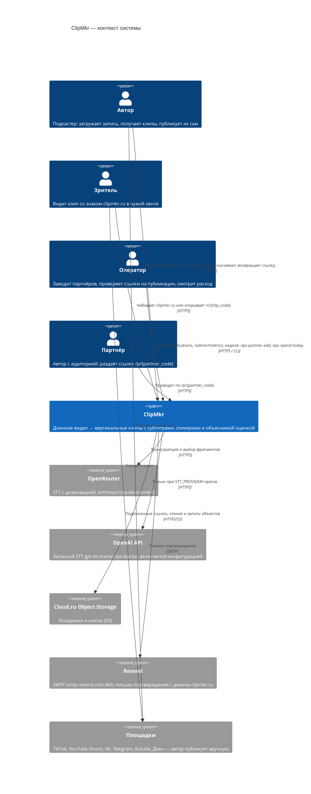
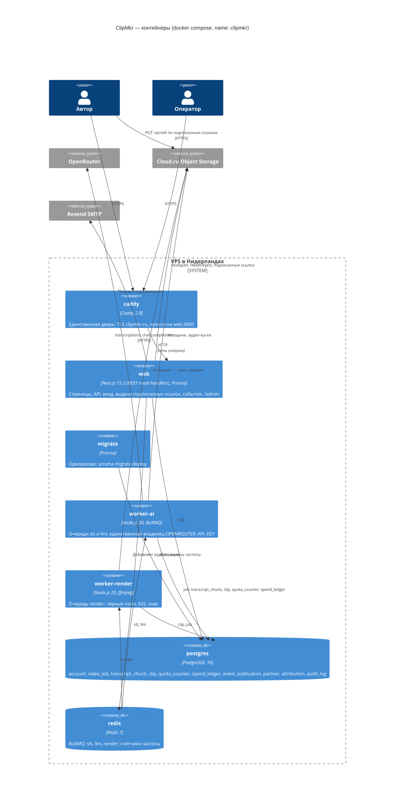
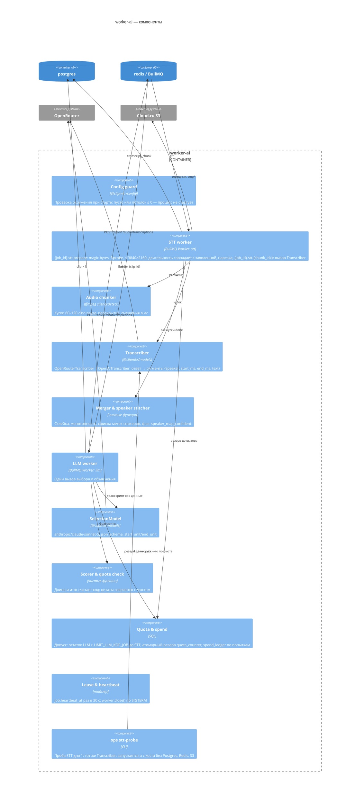
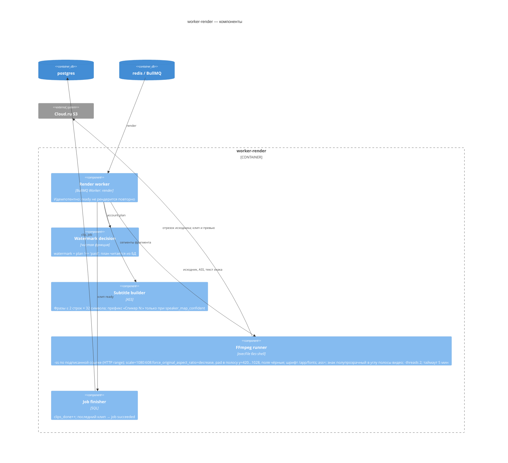

# C4 — проект 05a «ClipMkr»

**RUN_ID:** 20260923T173212Z-replicate-05a-475b · **WORK_UNIT_ID:** architecture · 2026-09-23
Имена контейнеров, очередей и таблиц — из [`canon.md`](canon.md); решения — [`ADR.md`](ADR.md); пояснения —
[`Architecture.md`](Architecture.md). Диаграммы в синтаксисе Mermaid C4.

## Уровень 1 — System Context

Граница системы: продукт ничего не публикует от имени автора и не открывает ссылки на посты — проверка
публикаций ручная (ADR-014).

## Уровень 2 — Containers

Порты на хосте: `caddy` — `${CADDY_HTTP_PORT:-80}`, `${CADDY_HTTPS_PORT:-443}` (только профиль `prod`); `web` —
`127.0.0.1:${WEB_PORT:-3105}`; `postgres`, `redis`, `minio` (тестовый профиль, на схеме не показан) — без публикации.

## Уровень 3 — Components: worker-ai

## Уровень 3 — Components: worker-render

