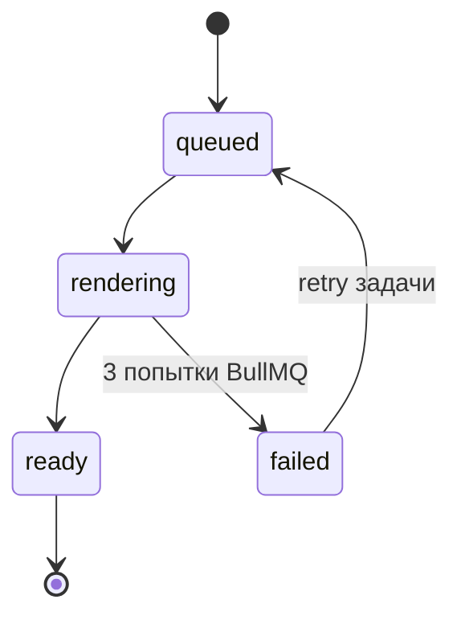
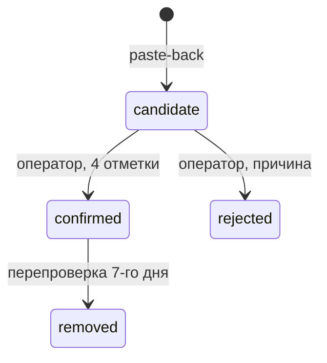

# Pseudocode — проект 05a «ClipMkr»

**RUN_ID:** 20260923T173212Z-replicate-05a-475b · **WORK_UNIT_ID:** pseudocode · **Автор:** Claude Opus 5.5 · 2026-09-23
**Фаза:** Phase 1, sparc-prd-mini AUTO, фаза 4 (Pseudocode).
**Опирается на:** [Specification.md](Specification.md) v0.2, [ADR.md](ADR.md) ADR-001…017,
[canon.md](canon.md) (хеш `2acd0f44…722` на момент сдачи), [decisions-owner.md](decisions-owner.md).

**Правило имён.** Таблицы, поля, очереди, `jobId`, маршруты, события, переменные окружения и закрытые списки — строго
по канону. Где канон и Specification расходятся, действует канон (canon §12). Все имена, которые алгоритмам понадобились сверх
первой версии канона (поля, `kind`, маршруты, cookie `sid`, `ops stt-probe`), координатор внёс в канон
2026-09-23; открытые вопросы — в последнем разделе.

**Для исполнителя (Codex).** Каждый шаг однозначен. `ОТКАЗ(код, причина)` — немедленный возврат ошибки клиенту или
перевод задачи в `failed`; шагов после него нет. «Вне транзакции» — соединение пула в этот момент НЕ удерживается.
Числа с пометкой `[ПРЕДЛОЖЕНИЕ]` — константы кода в `@clipmkr/types`, а не окружения.

## Константы кода

| Константа | Значение | Источник |
|---|---|---|
| `MAX_SOURCE_BYTES` | 2 147 483 648 | ADR-007 |
| `MAX_DURATION_MS` | 7 200 000 (120 мин) | FR-clips-2 п. 2 |
| `PART_SIZE_BYTES` | 10 485 760 (10 МБ) | Architecture, donor reuse map |
| `PRESIGN_TTL_SEC` | 900 | FR-clips-2 п. 3, FR-clips-8 п. 3 |
| `CHUNK_TARGET_MS` / окно | 90 000 / 75 000…105 000 | ADR-002 п. 1 |
| `CHUNK_OVERLAP_MS` | 5 000 | ADR-002, canon §12 |
| `SILENCE_NOISE_DB` / `SILENCE_MIN_MS` | −35 / 300 | ADR-002 п. 1 |
| `SPEAKER_MATCH_SHARE` | 0,60 | ADR-002 п. 3 |
| `STT_HTTP_TIMEOUT_MS` | 90 000 `[ПРЕДЛОЖЕНИЕ]` (апстрим обрывает ~60 с) | ADR-001 |
| `LLM_HTTP_TIMEOUT_MS` | 120 000 `[ПРЕДЛОЖЕНИЕ]` | — |
| `LLM_MAX_OUTPUT_TOKENS` | 3 000 `[ПРЕДЛОЖЕНИЕ]` (10 фрагментов × ~250 токенов) | ADR-005 |
| `LLM_CHARS_PER_TOKEN_DIVISOR` | 3, плюс 500 токенов служебных `[ПРЕДЛОЖЕНИЕ; калибруется по `usage.prompt_tokens` первых 3 выпусков]` | ADR-005 «Последствия» |
| `LLM_EST_CHARS_PER_SEC` | 22 `[ПРЕДЛОЖЕНИЕ; верхняя оценка русской речи со служебной разметкой единиц, калибруется по первым 3 выпускам]` | OWN-05A-012 |
| `WM_OPACITY` / `WM_INSET` | 0,55 / 24 px; не ближе x = 70, y = 200 | FR-GROWTH-003 п. 4–5, OWN-05A-013 |
| `MODEL_PRICES` | `{"anthropic/claude-sonnet-5": {in_usd_micro_per_token: 2, out_usd_micro_per_token: 10}}` | ADR-005 (API OpenRouter 2026-09-23) |
| `CLIP_MIN_MS` / `CLIP_MAX_MS` | 20 000 / 90 000 | FR-clips-5 п. 3 |
| `MAX_CLIPS` | 10 | FR-clips-5 п. 4 |
| `RENDER_TIMEOUT_MS(d)` | `max(60 000, ceil(d × 300 000 / 90 000))`, потолок 300 000 | FR-clips-7 п. 6, ADR-010 |
| `HEARTBEAT_EVERY_MS` / `LEASE_LOST_MS` / `SILENT_UI_MS` | 30 000 / 300 000 / 120 000 | canon §3, FR-clips-3 п. 5 |
| `MAX_JOB_ATTEMPTS` | 3 | canon §3 |
| `GLOBAL_SCOPE_ID` | `00000000-0000-0000-0000-000000000000` | канон §5 |
| `PREF_MAX_AGE_SEC` | 5 184 000 (60 дней) | ADR-015, FR-GROWTH-002 п. 1 |
| `SOURCE_RETENTION_MS` | 259 200 000 (72 ч) | ADR-007 |
| `RL_REGISTER` / `RL_LOGIN_EMAIL` / `RL_LOGIN_IP` / `RL_PUBLIC_CODE` | 20 / IP / 1 ч (В-25) · 10 / email / 15 мин · 50 / IP / 15 мин `[ПРЕДЛОЖЕНИЕ]` · 30 событий / IP / 1 ч (сверх — редирект без события) | FR-clips-1 п. 4, SC-US-010-3, VT-07, VA-11 |
| `ARGON2_MAX_CONCURRENT` | 4 на процесс `web` `[ПРЕДЛОЖЕНИЕ]` | VT-07 |
| `REFRESH_GRACE_SEC` | 60 | VA-13 |
| `EXTRACT_TIMEOUT_MS` / `DURATION_MISMATCH_MAX` / `MAX_SOURCE_KBPS` | 900 000 / 0,02 / 60 000 `[ПРЕДЛОЖЕНИЕ]` | VA-04 |
| `STT_PRICES` | `{<STT_MODEL>: kop_per_sec}` — заполняется результатом пробы дня 1 | VA-15 |
| `DISPOSABLE_DOMAINS` | закрытый список доменов одноразовых ящиков в `@clipmkr/types` | VA-02 |
| `PLATFORM_KEEP_QUERY` | `{'youtube.com': ['v'], 'vk.com': ['z'], 'vkvideo.ru': ['z']}`, прочие хосты — `[]` | VT-06 |
| `RL_API_WRITE` | 60 / аккаунт / 1 мин `[ПРЕДЛОЖЕНИЕ]` | NFR-clips-2 п. 1 |
| `RESEND_EVERY_SEC` / `RESEND_PER_DAY` | 60 / 5 | канон §7 |

## Data Structures

Все сущности — канон §4. `id: UUID` у каждой, кроме `quota_counter` (составной первичный ключ по канону).
`created_at: Timestamp` у каждой (канон §4).
Типы: `Timestamp` = `timestamptz` UTC; деньги — целые копейки; медиа — целые мс.

```
Account        { id: UUID, email: Text(lower, unique), password_hash: Text, email_verified_at: Timestamp?,
                 plan: Text, role: Text, created_at: Timestamp }
EmailToken     { id: UUID, account_id: UUID, purpose: 'verify'|'reset', token_hash: Text(sha256 hex), expires_at: Timestamp,
                 used_at: Timestamp?, created_at: Timestamp }
RefreshToken   { id: UUID, account_id: UUID, token_hash: Text, expires_at: Timestamp, revoked_at: Timestamp?,
                 created_at: Timestamp }
Video          { id: UUID, account_id: UUID, s3_key_source: Text, size_bytes: BigInt, duration_ms: Int?,
                 container: Text('mp4'|'webm'), source_deleted_at: Timestamp?, deleted_at: Timestamp?,
                 s3_upload_id: Text?, rights_confirmed_at: Timestamp, created_at: Timestamp }
Job            { id: UUID, video_id: UUID, account_id: UUID, idempotency_key: Text, status: JobStatus,
                 step: JobStep, fail_reason: FailReason?, attempt_count: Int, heartbeat_at: Timestamp,
                 clips_total: Int?, clips_done: Int, finished_at: Timestamp?, created_at: Timestamp }
                 UNIQUE(account_id, idempotency_key)
TranscriptChunk{ id: UUID, job_id: UUID, chunk_idx: Int, offset_ms: Int, duration_ms: Int, status: 'pending'|'done',
                 units: Jsonb<Unit[]>?, speaker_map: Jsonb<{local→global:Int}>?, speaker_map_confident: Bool?,
                 model: Text?, attempt_count: Int = 0, created_at: Timestamp }  UNIQUE(job_id, chunk_idx)
Unit           { start_ms: Int, end_ms: Int, speaker_local: Text?, text: Text, words: [{text, start_ms, end_ms}]? }
                 — время внутри JSON куска хранится УЖЕ сдвинутым на offset_ms (абсолютное в исходнике)
Clip           { id: UUID, job_id: UUID, clip_code: Text(unique), start_unit: Int, end_unit: Int, start_ms: Int,
                 end_ms: Int, title: Text, hook_quote, hook_reason: Text, hook_score: Int?, completeness_quote,
                 completeness_reason: Text, completeness_score: Int?, length_score: Int, total_score: Int?,
                 render_status: RenderStatus, watermarked: Bool?, s3_key_clip: Text?, speaker_labels_shown: Bool,
                 created_at: Timestamp }
QuotaCounter   { scope: 'account'|'global'|'job', scope_id: UUID, day: Date(Europe/Moscow), kind: QuotaKind,
                 used: BigInt }  PK(scope, scope_id, day, kind)
SpendLedger    { id: UUID, account_id: UUID, job_id: UUID?, call: 'stt'|'llm', model: Text, attempt: Int,
                 units_reserved: Int, units_actual: Int?, cost_usd_micro: BigInt?, cost_kop: Int, outcome: Outcome,
                 created_at: Timestamp }
Event          { id: UUID, name: EventName, account_id: UUID?, clip_id: UUID?, session_id: Text?, props: Jsonb,
                 created_at: Timestamp }  — сырого IP нет (NFR-clips-6)
Publication    { id: UUID, clip_id: UUID? (NULL после удаления клипа), clip_code: Text (копия, не обнуляется), account_id: UUID, url: Text, url_normalized: Text(unique),
                 platform: Platform, channel_key: Text?, status: PubStatus, reason: Text?, verified_at: Timestamp?,
                 rechecked_at: Timestamp?, created_at: Timestamp }
Partner        { id: UUID, name: Text, contact: Text?, audience_url: Text?, partner_code: Text(unique, upper),
                 account_id: UUID?, created_at: Timestamp }
Attribution    { id: UUID, account_id: UUID, partner_id: UUID, stage: 'signup'|'fakedoor', source: 'cookie'|'code',
                 self_referral: Bool, created_at: Timestamp }  UNIQUE(account_id, stage)
AuditLog       { id: UUID, actor: Text, action: Text, target: Text, reason: Text, created_at: Timestamp }
```


`QuotaKind` = `stt_sec` | `uploads` | `llm_kop` | `llm_attempts` (канон §5).

**Частичные уникальные индексы `event` для дедупликации** (Architecture: частичный уникальный индекс; день — `msk_day(created_at)`):

| Индекс | Ключ | Условие |
|---|---|---|
| `event_once_per_day_clip` | (`name`, `account_id`, `clip_id`, msk_day) | `name IN ('download_clicked','share_clicked')` |
| `event_once_per_clip` | (`name`, `account_id`, `clip_id`) | `name IN ('clip_viewed','self_reported_published')` |
| `event_once_per_day_account` | (`name`, `account_id`, msk_day) | `name = 'fakedoor_clicked'` |
| `event_once_per_day_session` | (`name`, `clip_id`, `session_id`, msk_day) | `name = 'clip_link_visited'` |

`msk_day(t) = (t AT TIME ZONE 'Europe/Moscow')::date`.

## Core Algorithms

### Algorithm: Проверка конфигурации при старте процесса

REQUIREMENT: `NFR-clips-3`
REQUIREMENT: `AC-clips-14`
REQUIREMENT: `AC-clips-13`
REQUIREMENT: `FR-clips-10`
REQUIREMENT: `NFR-clips-2`
REALISES: SC-US-012-2, SC-US-012-5, SC-US-008-2
INPUT: `service ∈ {web, migrate, worker-ai, worker-render}`, `process.env`, `NODE_ENV`, `NEXT_PHASE`
OUTPUT: неизменяемый объект `Config` либо завершение процесса с кодом 1
STEPS:
1. IF `NEXT_PHASE == 'phase-production-build'` THEN RETURN `Config` без проверок (сборка ничего не выдаёт наружу; NFR-clips-3 п. 2).
2. `required ← REQUIRED_BY_SERVICE[service]` — таблица канона §6 (столбец «Сервисы»), зашитая в `@clipmkr/config`.
3. `errors ← []`. FOR EACH `name` IN `required`:
   1. `raw ← env[name]`. IF `raw === undefined` THEN `errors.push(name, 'отсутствует', CONSEQUENCE[name])`; CONTINUE.
   2. IF `raw.trim() === ''` AND NOT (`name == 'S3_TENANT_ID'` AND профиль test) THEN `errors.push(name, 'пусто', …)`; CONTINUE.
   3. `VALIDATOR[name](raw)`; ошибка → `errors.push(name, 'невалидно: <причина>', …)`. Валидаторы:
      - `BASE_URL`: `new URL(raw)`; протокол `https:` (в test также `http:`); путь `/` или пуст; иначе ошибка.
      - `LIMIT_*`, `FX_USD_RUB_KOP`: `/^[1-9][0-9]*$/`, целое > 0 (число ≤ 0 и `'0'` — ошибка).
      - `STT_PROVIDER`, `PAYMENTS_MODE`, `PAYMENTS_PROVIDER`: значение из закрытого списка канона §5; иначе ошибка со списком допустимых.
      - `JWT_SECRET`: длина в байтах UTF-8 ≥ 32.
      - `WATERMARK_TEXT`: после `trim` 1…32 символа, без `\n`.
      - `LLM_MODEL`: ключ `MODEL_PRICES` (иначе резерв LLM посчитать нечем → ошибка «модель без цены»).
      - `STT_MODEL`: ключ `STT_PRICES` (иначе рублёвая оценка STT без `usage.cost` невозможна → ошибка «модель без цены», VA-15).
      - `REDIS_URL`, `DATABASE_URL`, `SMTP_URL`, `S3_ENDPOINT`: `new URL(raw)` проходит.
4. Условные переменные: IF `STT_PROVIDER == 'openai'` THEN `OPENAI_API_KEY` обязателен. IF `PAYMENTS_MODE == 'live'` THEN `PAYMENTS_PROVIDER`, `PAYMENTS_SHOP_ID`, `PAYMENTS_SECRET_KEY` обязательны.
5. Согласованность потолков (model-call-cost: персональный не выше суточного), только если оба заданы:
   `LIMIT_STT_USER_SEC_DAY ≤ LIMIT_STT_GLOBAL_SEC_DAY`; `LIMIT_LLM_USER_KOP_DAY ≤ LIMIT_LLM_GLOBAL_KOP_DAY`;
   `LIMIT_LLM_KOP_JOB ≤ LIMIT_LLM_USER_KOP_DAY`. Нарушение → ошибка «предел не сработает никогда».
6. IF `env.NODE_TLS_REJECT_UNAUTHORIZED === '0'` THEN ошибка «проверка TLS отключена» (NFR-clips-2 п. 6).
7. Секреты моделей вне `worker-ai`: IF `service ≠ worker-ai` AND (`OPENROUTER_API_KEY` или `OPENAI_API_KEY` заданы) THEN ошибка «ключ модели у сервиса, которому он не положен» (ADR-004).
8. IF `errors` не пуст THEN печатать в stderr по строке на ошибку: `<ИМЯ>: <что не так> — <последствие>` (например `LIMIT_STT_USER_SEC_DAY: пусто — вызов STT остался бы без предела на пользователя`); `exit(1)`.
9. `RENDER_CONCURRENCY` ← целое > 0 или `1`; `LOG_LEVEL` ← значение или `info` (дефолт разрешён каноном).
10. RETURN `Object.freeze(config)`.
COMPLEXITY: O(v), v — число переменных.

### Algorithm: Атомарный резерв потолков

REQUIREMENT: `FR-clips-10`
REQUIREMENT: `NFR-clips-2`
REQUIREMENT: `NFR-clips-5`
REQUIREMENT: `AC-clips-12`
REQUIREMENT: `AC-clips-13`
REALISES: SC-US-002-4, SC-US-002-5, SC-US-012-1
INPUT: транзакция `tx`, список `items = [{scope, scope_id, day, kind, n, limit, fail_reason}]`
OUTPUT: `{ok: true}` либо `{ok: false, fail_reason}`; при отказе транзакция откатывается вызывающим
STEPS:
1. Отсортировать `items` по (`scope` в порядке `account` < `global` < `job`, затем `kind`) — единый порядок захвата строк исключает взаимоблокировку двух резервов.
2. FOR EACH `it` IN `items`:
   1. IF `it.n > it.limit` THEN RETURN `{ok:false, fail_reason: it.fail_reason}` (одна попытка больше предела целиком).
   2. Выполнить:
      ```sql
      INSERT INTO quota_counter(scope, scope_id, day, kind, used) VALUES ($scope, $id, $day, $kind, $n)
      ON CONFLICT (scope, scope_id, day, kind)
      DO UPDATE SET used = quota_counter.used + EXCLUDED.used
      WHERE quota_counter.used + EXCLUDED.used <= $limit
      RETURNING used;
      ```
   3. IF строк не вернулось THEN RETURN `{ok:false, fail_reason: it.fail_reason}`.
3. RETURN `{ok:true}`.
4. **Возврат резерва** `release(tx, item, delta)`: `UPDATE quota_counter SET used = GREATEST(used - $delta, 0) WHERE <PK>`.
   **Доплата факта** `charge_over(tx, item, delta)`: `UPDATE … SET used = used + $delta` безусловно (факт уже списан провайдером; счётчик может превысить предел, следующий резерв получит отказ).
5. `day` всегда вычисляется на сервере БД: `msk_day(now())`; для `scope='job'` правило дня задаёт вызывающий алгоритм.
6. Запрещено: читать `used`, сравнивать в коде и затем писать (canon, FR-clips-10 п. 3).
COMPLEXITY: O(k), k ≤ 4 счётчика; транзакция держит только строки `quota_counter`, сетевых вызовов внутри нет.

### Algorithm: Лимит частоты запросов

REQUIREMENT: `FR-clips-1`
REQUIREMENT: `NFR-clips-2`
REQUIREMENT: `FR-GROWTH-004`
REALISES: SC-US-001-2, SC-US-010-3
INPUT: `bucket` (`register`|`login_email`|`login_ip`|`public_code`|`api_write`|`resend`|`resend_day`), `key`, `limit`, `window_sec`
OUTPUT: `ALLOW` | `DENY(429, retry_after_sec)` | `ОТКАЗ(503)`
STEPS:
1. `k ← 'rl:' + bucket + ':' + key + ':' + floor(now_sec / window_sec)`.
2. В Redis одной Lua-операцией: `c ← INCR k`; IF `c == 1` THEN `EXPIRE k window_sec`.
3. IF Redis недоступен или ответ не число THEN RETURN `ОТКАЗ(503, 'сервис временно недоступен')` — недоступный счётчик не означает «лимита нет» (fail-closed).
4. IF `c > limit` THEN RETURN `DENY(429, window_sec − now_sec mod window_sec)`.
5. RETURN `ALLOW`.
6. Ключ IP: последний элемент `X-Forwarded-For`, дописанный `caddy` (в prod `web` не опубликован, прокси не обойти — deployment-seams). IP живёт только в ключе Redis со сроком окна.
COMPLEXITY: O(1).

### Algorithm: Регистрация

REQUIREMENT: `FR-clips-1`
REQUIREMENT: `AC-clips-1`
REQUIREMENT: `FR-GROWTH-002`
REQUIREMENT: `FR-clips-12`
REQUIREMENT: `AC-clips-28`
REALISES: SC-US-001-1, SC-US-001-2, SC-US-001-4, SC-US-001-5, SC-US-009-1, SC-US-009-2, SC-US-009-3
INPUT: `POST /api/auth/register {email, password, consent_pd: bool, consent_terms: bool, partner_code?}`, cookie `pref?`, IP
OUTPUT: `201 {status:'check_email'}` | `422` | `429`
STEPS:
1. `rate_limit('register', ip, 20, 3600)`; DENY → RETURN 429 (до проверки полей, AC-clips-1). Порог 20, а не 5: за CGNAT мобильного оператора — много честных людей (В-25, VA-11); основная защита от множества аккаунтов — `canonical_email`, `DISPOSABLE_DOMAINS` и потолки на автора (VA-02).
2. Валидация: `email ← canonical_email(email)` (ниже), формат `local@domain.tld`, ≤ 254; IF домен ∈ `DISPOSABLE_DOMAINS` THEN 422 «используйте постоянный адрес», аккаунт не создаётся, письмо не отправляется (VA-02, AC-clips-28); `len(password) ≥ 10`, ≤ 128; `consent_pd === true` AND `consent_terms === true`; иначе `422` с перечнем полей.
3. IF `partner_code` задан THEN `code ← upper(trim(partner_code))`; `partner ← SELECT … WHERE partner_code = code`; нет → `422 'код не найден'` (атрибуция не создаётся, аккаунт не создаётся — пользователь исправляет или очищает поле).
4. `hash ← argon2id(password, m=19456 KiB, t=2, p=1)` — ВНЕ транзакции (дорогая операция не держит соединение пула).
5. Транзакция:
   1. `INSERT INTO account(email, password_hash, plan, role) VALUES ($email, $hash, 'free', 'user') ON CONFLICT (email) DO NOTHING RETURNING id`.
   2. IF строки нет THEN COMMIT; RETURN `201 {status:'check_email'}` тем же ответом (перечисление аккаунтов не раскрывается; письмо не отправляется).
   3. `resolve_attribution(tx, account_id, 'signup', code_partner, pref_cookie)` (алгоритм «Разрешение атрибуции»).
   4. `token ← base64url(random(32))`; `INSERT email_token(account_id, purpose='verify', token_hash=sha256(token), expires_at=now()+24h)`.
   5. `INSERT event(name='signup', account_id)`.
6. После COMMIT письмо отправляется ПОСЛЕ ответа клиенту (`setImmediate`), в обеих ветках шага 5 время ответа одинаково — существование адреса по времени не узнать (VA-25). Отправка через SMTP со ссылкой `{BASE_URL}/api/auth/verify?token={token}`. Ошибка SMTP → журнал `email_send_failed` с `account_id`; ответ клиенту тот же (повторная отправка — алгоритм «Повторная отправка письма»).
7. RETURN `201 {status:'check_email'}`.
8. `canonical_email(e)`: `e ← lower(trim(e))`; `(local, domain) ← split('@')`; IF `domain ∈ {gmail.com, googlemail.com}` THEN `domain ← 'gmail.com'`, `local ← local.split('+')[0].replace(/\./g,'')`; ELSE IF `domain ∈ {yandex.ru, ya.ru, yandex.com, yandex.by, yandex.kz, mail.ru, bk.ru, inbox.ru, list.ru}` THEN `local ← local.split('+')[0]`. Каноническая форма хранится в `account.email` и сравнивается во входе: `x+1@gmail.com` и `x.@gmail.com` — один аккаунт (VA-02). Письмо уходит на каноническую форму — она доставляется в тот же ящик.
COMPLEXITY: O(1); время доминирует argon2 (~50 мс) вне транзакции.

### Algorithm: Подтверждение почты

REQUIREMENT: `FR-clips-1`
REQUIREMENT: `AC-clips-21`
REALISES: SC-US-001-3
INPUT: `GET /api/auth/verify?token=`
OUTPUT: редирект на экран «почта подтверждена» | экран «ссылка недействительна»
STEPS:
1. `rate_limit('api_write', ip, 60, 60)`.
2. IF `token` не соответствует `/^[A-Za-z0-9_-]{43}$/` THEN RETURN экран «ссылка недействительна».
3. Транзакция:
   1. `UPDATE email_token SET used_at = now() WHERE token_hash = sha256($token) AND purpose = 'verify' AND used_at IS NULL AND expires_at > now() RETURNING account_id`.
   2. IF строки нет THEN ROLLBACK; RETURN «ссылка недействительна или устарела» (использованная и старше 24 ч — одинаково).
   3. `UPDATE account SET email_verified_at = now() WHERE id = $account_id AND email_verified_at IS NULL RETURNING id`.
   4. IF обновилось THEN `INSERT event(name='email_verified', account_id)`.
4. RETURN редирект `/` с сообщением «почта подтверждена, можно загружать».
COMPLEXITY: O(1).

### Algorithm: Повторная отправка письма подтверждения

REQUIREMENT: `FR-clips-1`
REQUIREMENT: `AC-clips-21`
REALISES: SC-US-001-3
INPUT: `POST /api/auth/resend-verification` (сессия, почта не подтверждена)
OUTPUT: `202` | `409` | `429`
STEPS:
1. `ctx ← auth({})`; IF `email_verified_at IS NOT NULL` THEN RETURN 409 «почта уже подтверждена».
2. `rate_limit('resend', account_id, 1, 60)` и `rate_limit('resend_day', account_id, 5, 86400)` (сутки — окно 24 ч); DENY → 429 с `retry_after`.
3. Транзакция: `UPDATE email_token SET used_at=now() WHERE account_id AND purpose='verify' AND used_at IS NULL` (старые ссылки гаснут); `token ← base64url(random(32))`; `INSERT email_token(account_id, purpose='verify', token_hash=sha256(token), expires_at=now()+24h)`.
4. После COMMIT, вне транзакции: письмо через `SMTP_URL` (Resend). Ошибка → журнал `email_send_failed`; 503.
5. RETURN 202.
COMPLEXITY: O(1).

### Algorithm: Вход, обновление и выход

REQUIREMENT: `FR-clips-1`
REQUIREMENT: `NFR-clips-2`
REQUIREMENT: `AC-clips-25`
REALISES: SC-VS-001-4
INPUT: `POST /api/auth/login {email, password}` | `POST /api/auth/refresh` (cookie) | `POST /api/auth/logout`
OUTPUT: `200 {access_token}` + cookie `refresh` | `401` | `429`
STEPS:
1. **login.** `email ← canonical_email(email)`. До проверки пароля, атомарно (`INCR` из «Лимит частоты», шаг 2, без отдельного чтения): `rate_limit('login_ip', ip, 50, 900)` и `rate_limit('login_email', email, 10, 900)`; любой DENY → 429. Каждая попытка считается ДО argon2, поэтому 100 параллельных запросов дают не больше 10 проверок пароля на email (VT-07).
2. Семафор `ARGON2_MAX_CONCURRENT` на процесс: занят → 503 `busy` (память argon2 19 МиБ × N не растёт без предела).
3. `acc ← SELECT id, password_hash FROM account WHERE email = $email` (без транзакции).
4. `ok ← acc ? argon2.verify(acc.password_hash, password) : argon2.verify(DUMMY_HASH, password) && false` — время ответа одинаково для существующего и нет.
5. IF NOT ok THEN RETURN 401 «неверный email или пароль». IF ok THEN `DEL` ключа `login_email:{email}` текущего окна.
6. `access ← JWT HS256 {sub: account_id, exp: now+15 мин}` на `JWT_SECRET`. `refresh ← base64url(random(32))`; `INSERT refresh_token(account_id, token_hash=sha256(refresh), expires_at=now()+30 дней [ПРЕДЛОЖЕНИЕ])`.
7. Две cookie (канон §7, заголовка `Authorization` нет): `access` — `HttpOnly; Secure; SameSite=Lax; Path=/; Max-Age=900`; `refresh` — `HttpOnly; Secure; SameSite=Lax; Path=/; Max-Age=2592000`. RETURN `200 {}`.
8. **refresh.** `g ← Redis GET rt_grace:{sha256(c)}`; IF есть THEN RETURN ту же новую пару из `g` (вторая вкладка в окне `REFRESH_GRACE_SEC` не считается кражей, VA-13). Транзакция: `UPDATE refresh_token SET revoked_at = now() WHERE token_hash = sha256($c) AND revoked_at IS NULL AND expires_at > now() RETURNING account_id`. Нет строки → IF `Redis EXISTS rt_rotated:{sha256(c)}` (токен ротирован, окно льготы прошло) THEN отозвать все refresh аккаунта (повторное использование = кража); RETURN 401. Иначе новая пара как в шагах 6–7; `SET rt_grace:{hash} <новая пара> EX 60`; `SET rt_rotated:{hash} 1 EX 2592000`. Выход (`logout`) `rt_rotated` не ставит — устаревшая вкладка после выхода получает 401 без отзыва остальных сессий.
9. **logout.** `UPDATE refresh_token SET revoked_at = now() WHERE token_hash = sha256($c)`; стереть обе cookie; RETURN 200.
10. Названный риск (VA-12 б): знающий email оператора держит его вне системы 15 мин десятью неверными паролями. Восстановление — ожидание окна; ключ `login_ip` ограничивает одного атакующего. Отдельного обхода для роли `operator` на неделе нет.
COMPLEXITY: O(1).

### Algorithm: Проверка сессии, роли и владения

REQUIREMENT: `FR-clips-1`
REQUIREMENT: `FR-clips-8`
REQUIREMENT: `FR-clips-11`
REQUIREMENT: `NFR-clips-2`
REQUIREMENT: `AC-clips-16`
REQUIREMENT: `AC-clips-26`
REALISES: SC-US-006-3, SC-US-010-3, SC-US-012-4, SC-VS-001-5, SC-VS-001-6
INPUT: запрос, требования `{verified?: bool, role?: 'operator', owns?: {table, id}}`
OUTPUT: `ctx = {account_id, plan, role}` | `401` | `403` | `404`
STEPS:
0. CSRF (канон §7): для `POST`/`DELETE` — IF заголовок `Origin` отсутствует OR `Origin ≠ origin(BASE_URL)` THEN 403 `bad_origin`, до любых других проверок; действует и для публичных `POST` (`register`, `login`, `reset`).
1. Middleware: удалить из входящего запроса все заголовки `x-user-*`; JWT читается ТОЛЬКО из cookie `access` (заголовок `Authorization` игнорируется); проверить подпись и `exp`; нет или невалиден → 401 (для страниц — редирект на вход). Серверный рендер `/admin/*` и API читают сессию одним и тем же кодом.
2. В КАЖДОМ обработчике повторно (урок CVE-2025-29927): `acc ← SELECT id, plan, role, email_verified_at FROM account WHERE id = jwt.sub`; нет → 401.
3. `role ← (acc.role === 'operator') ? 'operator' : 'user'`; `plan ← (acc.plan === 'paid') ? 'paid' : 'free'` — всё, кроме ровно этих строк, читается строгим вариантом.
4. IF требуется `role='operator'` AND `role ≠ 'operator'` THEN RETURN 404 (страница оператора не раскрывает существование, AC-clips-16).
5. IF `verified` AND `acc.email_verified_at IS NULL` THEN RETURN 403 `{error:'email_not_verified'}`.
6. IF `owns`: `row ← SELECT account_id FROM <table> WHERE id = $id` (для `clip` — через `job.account_id`; у видео с `deleted_at` — как отсутствующее). IF нет строки OR `row.account_id ≠ acc.id` THEN RETURN 404.
7. RETURN `ctx`.
COMPLEXITY: O(1).

### Algorithm: Начало загрузки видео

REQUIREMENT: `FR-clips-2`
REQUIREMENT: `AC-clips-23`
REQUIREMENT: `AC-clips-12`
REQUIREMENT: `FR-clips-12`
REALISES: SC-US-002-5, SC-US-002-6
INPUT: `POST /api/videos {size_bytes, ext ∈ {mp4, mov, webm, mkv}, rights_confirmed: true}`
OUTPUT: `201 {video_id, upload_id, part_size_bytes, parts:[{part_number, url}], expires_at}` | 4xx
STEPS:
1. `ctx ← auth({verified:true})` (403 до всего прочего, AC-clips-21).
2. `rate_limit('api_write', account_id, 60, 60)`.
3. Валидация тела: `size_bytes` целое, `1 ≤ size_bytes ≤ MAX_SOURCE_BYTES` → иначе `422 'file_too_large'` (ссылки не выдаются); `ext` из списка; `rights_confirmed === true` → иначе 422.
4. Быстрый отказ без резерва (только чтение, не решение о деньгах): IF `used(account, today, 'stt_sec') ≥ LIMIT_STT_USER_SEC_DAY` OR `used(global, today, 'stt_sec') ≥ LIMIT_STT_GLOBAL_SEC_DAY` THEN RETURN `429 {error:'quota_user'|'quota_global', resets_at: <00:00 МСК следующих суток>}`. Настоящий резерв STT — в алгоритме «Допуск STT».
5. `video_id ← uuidv4()`; `key ← 'videos/' + account_id + '/' + video_id + '/source.' + ext`.
6. Транзакция A: `reserve([{scope:'account', scope_id:account_id, day:today, kind:'uploads', n:1, limit: LIMIT_UPLOADS_USER_DAY, fail_reason:'quota_user'}])`; отказ → ROLLBACK; RETURN `429 {error:'quota_user', message:'лимит на сегодня исчерпан, приходите завтра', resets_at}` (AC-clips-23). COMMIT.
7. Вне транзакции: `upload_id ← S3.CreateMultipartUpload(key)`. Ошибка → транзакция `release(uploads, 1)`; RETURN 503.
8. `n_parts ← ceil(size_bytes / PART_SIZE_BYTES)`; FOR `p` IN 1..n_parts: `url_p ← presign(UploadPart, key, upload_id, p, ttl=PRESIGN_TTL_SEC, ContentLength = (p < n_parts ? PART_SIZE_BYTES : size_bytes − (n_parts−1)·PART_SIZE_BYTES))` — длина части входит в подпись, если Cloud.ru её проверяет `[НЕ ПРОВЕРЕНО]`; независимо от этого размеры сверяются по `ListParts` перед сборкой (VA-16).
9. Транзакция B: `INSERT video(id, account_id, s3_key_source=key, size_bytes, container = ext∈{mp4,mov}?'mp4':'webm', s3_upload_id=upload_id, rights_confirmed_at=now())`; `INSERT event(name='upload_started', account_id, props={video_id, size_bytes})`.
10. RETURN 201.
2 ГБ при 10 Мбит/с грузятся ~27 мин, а ссылки живут 15 мин: клиент до `expires_at` (или по 403 от S3) перевыдаёт ссылки на оставшиеся части следующим алгоритмом.
COMPLEXITY: O(p), p ≤ 205 частей.

### Algorithm: Перевыдача ссылок на незагруженные части

REQUIREMENT: `FR-clips-2`
REQUIREMENT: `NFR-clips-2`
INPUT: `POST /api/videos/{video_id}/parts`
OUTPUT: `200 {parts:[{part_number, url}], expires_at}` | `404` | `409`
STEPS:
1. `auth({verified:true, owns:{video, video_id}})`; `rate_limit('api_write', account_id, 60, 60)`.
2. IF `video.s3_upload_id IS NULL` OR у видео уже есть задача OR `source_deleted_at IS NOT NULL` THEN RETURN 409 «загрузка завершена или отменена».
3. Вне транзакции: `done ← S3.ListParts(key, s3_upload_id)` (номера загруженных частей); `NoSuchUpload` → 409.
4. `n_parts ← ceil(video.size_bytes / PART_SIZE_BYTES)`; `missing ← {1..n_parts} \ done`.
5. FOR `p` IN `missing`: `presign(UploadPart, key, s3_upload_id, p, ttl=PRESIGN_TTL_SEC)`. Лимит загрузок и потолок STT не трогаются: видео уже учтено.
6. RETURN 200.
COMPLEXITY: O(p).

### Algorithm: Завершение загрузки и создание задачи

REQUIREMENT: `FR-clips-2`
REQUIREMENT: `FR-clips-3`
REQUIREMENT: `AC-clips-2`
REQUIREMENT: `AC-clips-3`
REQUIREMENT: `NFR-clips-2`
REALISES: SC-US-002-1, SC-US-002-3
INPUT: `POST /api/videos/{video_id}/complete`, заголовок `Idempotency-Key`, тело `{parts:[{part_number, etag}]}`
OUTPUT: `202 {job_id}` | `422 {error:'file_invalid'}` | 4xx
STEPS:
1. `ctx ← auth({verified:true, owns:{video, video_id}})`.
2. `rate_limit('api_write', account_id, 60, 60)`.
3. `key ← header Idempotency-Key`; IF отсутствует OR не `/^[A-Za-z0-9_-]{8,128}$/` THEN RETURN 422.
4. Идемпотентный ответ ПЕРВЫМ (без сети): `j ← SELECT id FROM job WHERE account_id=$a AND idempotency_key=$key`; IF есть THEN RETURN `202 {job_id: j.id}`. `j2 ← SELECT id FROM job WHERE video_id=$v`; IF есть THEN RETURN `202 {job_id: j2.id}` (тот же файл не создаёт вторую задачу, FR-clips-3 п. 7).
5. Вне транзакции, S3:
   0. `lp ← S3.ListParts(key, upload_id)`; IF любая часть кроме последней ≠ `PART_SIZE_BYTES` OR `Σ size ≠ video.size_bytes` THEN `AbortMultipartUpload`; `source_deleted_at=now()`; RETURN `422 {error:'file_invalid'}` (VA-16).
   1. `S3.CompleteMultipartUpload(key, upload_id, parts)`; ошибка `NoSuchUpload` → IF `HeadObject(key)` успешен THEN продолжить (загрузка уже собрана повтором) ELSE RETURN 409 «загрузка не найдена, начните заново».
   2. `h ← HeadObject(key)`. IF `h.ContentLength > MAX_SOURCE_BYTES` OR `h.ContentLength ≠ video.size_bytes` THEN `DeleteObject(key)`; `UPDATE video SET source_deleted_at=now()`; RETURN `422 {error:'file_invalid'}`.
   3. `head16 ← GetObject(key, Range: bytes=0-15)`. `is_mp4 ← head16[4..8] == 'ftyp'`; `is_ebml ← head16[0..4] == 1A 45 DF A3`. IF NOT (is_mp4 OR is_ebml) THEN `DeleteObject`; `source_deleted_at=now()`; RETURN `422 {error:'file_invalid'}` — задача не создаётся, платных вызовов нет (AC-clips-2). `container ← is_mp4 ? 'mp4' : 'webm'`.
6. Транзакция:
   1. `SELECT id FROM video WHERE id=$v AND deleted_at IS NULL FOR UPDATE` (сериализует два одновременных `complete` одного видео).
   2. `INSERT INTO job(id, video_id, account_id, idempotency_key, status='running', step='transcribing', attempt_count=0, heartbeat_at=now(), clips_done=0) ON CONFLICT (account_id, idempotency_key) DO NOTHING RETURNING id`.
   3. IF строки нет THEN `j ← SELECT id FROM job WHERE account_id AND idempotency_key`; COMMIT; RETURN `202 {job_id: j.id}`.
   4. IF уже есть задача с этим `video_id` (перепроверка под блокировкой) THEN ROLLBACK; RETURN `202 {job_id: существующий}`.
   5. `UPDATE video SET container=$container`.
7. После COMMIT: `queue('stt').add({job_id}, {jobId: job_id + '.stt.prepare'})` (канон §3). Ошибка Redis → журнал; задачу поднимет «Уборщик аренды» через 300 с (молчание не пропадает).
8. RETURN `202 {job_id}` — идентификатор выдан ДО начала работы.
COMPLEXITY: O(p) по частям; транзакция O(1).

### Algorithm: Heartbeat и уборщик аренды

REQUIREMENT: `FR-clips-3`
REQUIREMENT: `AC-clips-4`
REQUIREMENT: `NFR-clips-8`
REALISES: SC-US-003-2
INPUT: `job_id` активной работы; периодический таймер уборщика
OUTPUT: обновлённый `heartbeat_at`; переставленная работа; `failed/worker_lost`
STEPS:
1. **Heartbeat.** Каждый обработчик очереди на время работы запускает таймер `HEARTBEAT_EVERY_MS`: `UPDATE job SET heartbeat_at=now() WHERE id=$j AND status='running' RETURNING id`. IF 0 строк THEN `abort.abort()` — задачу удалили или перевели в `failed`; обработчик прекращает работу без записи результата. Таймер снимается в `finally`.
2. **SIGTERM.** `worker.close()` (дождаться активных работ до `stop_grace_period` 60 с); `process.exit` без ожидания запрещён.
3. **Уборщик — единственный механизм восстановления задачи** (VT-10; BullMQ только доставляет, ADR-008 п. 2). Все очереди создаются с `maxStalledCount: 0`: зависшая работа BullMQ сразу уходит в `failed` с причиной stalled, а обработчик `failed` при ошибке stalled ничего не меняет в `job` (только журнал `bullmq_stalled`) — задачу поднимет уборщик по heartbeat. `finish_failed('stt_failed'|'selection_failed'|'render_failed')` из обработчика `failed` вызывается только для ошибок провайдера/ffmpeg после `attempts: 3`.
   Лидерство (VT-18, VA-17): при старте `worker-ai` открывает ОТДЕЛЬНОЕ соединение `leader = new pg.Client(DATABASE_URL)` вне пула. Раз в 60 с: `SELECT pg_try_advisory_lock(LEASE_SWEEPER_LOCK)` на `leader`; `false` → пропустить проход; `true` → проход (запросы — через пул), затем в `finally` `SELECT pg_advisory_unlock(LEASE_SWEEPER_LOCK)` на том же `leader`. Обрыв `leader` снимает блокировку сам; переподключение — в следующем проходе. Тест: два прохода подряд в одном процессе оба выполняются; два экземпляра — проход делает один.
   1. `stale ← SELECT id, step, heartbeat_at FROM job WHERE status='running' AND heartbeat_at < now() - interval '300 seconds' ORDER BY heartbeat_at LIMIT 50`.
   2. FOR EACH `j`: `expected ← expected_bullmq_ids(j)` (шаг 4). `states ← BullMQ.getState(id)` для каждого.
      - IF хоть одна в `waiting` | `delayed` THEN `UPDATE job SET heartbeat_at=now() WHERE id AND heartbeat_at=$old`; CONTINUE — ожидание в очереди не потеря воркера.
      - Транзакция: `UPDATE job SET attempt_count = attempt_count + 1, heartbeat_at = now() WHERE id=$j AND status='running' AND heartbeat_at=$old RETURNING attempt_count` (условие по старому значению — второй уборщик не посчитает попытку дважды).
      - IF `attempt_count ≥ MAX_JOB_ATTEMPTS` THEN `finish_failed(tx, j, 'worker_lost')`; CONTINUE.
      - После COMMIT: для каждого `id` из `expected` в состоянии `completed` | `failed` → `Job.remove(id)`; затем `add` с тем же `jobId`. Работа в состоянии `active` при устаревшем heartbeat удаляется `Job.remove(id)` с игнорированием ошибки блокировки и ставится заново: её исполнитель на следующем heartbeat увидит 0 строк (задача переставлена) и прекратит работу.
4. `expected_bullmq_ids(j)`: `transcribing` без строк `transcript_chunk` → `[{j}.stt.prepare]`; `transcribing` с кусками → `{j}.stt.{idx}` двух наименьших `pending`; `selecting` → `[{j}.llm]`; `rendering` → `{clip_id}.render` всех клипов не в `ready`.
5. `finish_failed(tx, j, reason)`: `UPDATE job SET status='failed', fail_reason=$reason, finished_at=now() WHERE id=$j AND status='running' RETURNING id`; IF обновилось THEN `INSERT event(name='job_failed', account_id, props={job_id, reason, step})`; `release_stt_admission(tx, j)` («Допуск STT», шаг 5 — неиспользованный резерв возвращается, VT-09); журнал JSON `{job_id, step, reason}`.
6. Heartbeat обновляет и `job.heartbeat_at`, и — через `attempt_count` задачи, прочитанный при старте работы, — проверяет, что задача не переставлена: `UPDATE … WHERE id=$j AND status='running' AND attempt_count=$seen`; 0 строк → `abort`.
COMPLEXITY: O(s) на проход, s ≤ 50.

### Algorithm: Подготовка задачи — длительность, аудио, план кусков

REQUIREMENT: `FR-clips-2`
REQUIREMENT: `FR-clips-4`
REQUIREMENT: `AC-clips-2`
REQUIREMENT: `NFR-clips-5`
REALISES: SC-US-002-2
INPUT: работа очереди `stt` c `jobId={job_id}.stt.prepare`
OUTPUT: строки `transcript_chunk` (pending), объекты `tmp/{job_id}/chunk-{idx}.mp3`, поставленные куски
STEPS:
1. Heartbeat запущен. `j ← SELECT job JOIN video WHERE job.id=$j`; IF нет OR `status≠'running'` OR `video.deleted_at` THEN RETURN.
2. IF у задачи уже есть строки `transcript_chunk` THEN перейти к шагу 10 (повтор подготовки не перерезает).
3. IF свободно в `/tmp` < `video.size_bytes + 1 ГБ` THEN бросить исключение (повтор BullMQ, журнал `tmp_full`) — потолок диска проверяется кодом, не текстом. Вне транзакции: скачать исходник потоком в `/tmp/{job_id}/source` (удаляется в `finally`). Одновременно ≤ 2 подготовки на процесс (конкурентность очереди `stt` = 2).
4. Повторная проверка magic bytes по первым 16 байтам локального файла (канон §3, §12: `web` проверил до создания задачи, подготовка перепроверяет); не совпало → `finish_failed('file_invalid')`, `DeleteObject`; RETURN.
   `fmt ← container == 'mp4' ? 'mov' : 'matroska'` (демультиплексор по magic bytes, а не по угадыванию). `probe ← execFile('ffprobe', ['-v','error','-f',fmt,'-protocol_whitelist','file','-print_format','json','-show_format','-show_streams', path], timeout 30 с)`.
   IF ошибка разбора OR нет потока `codec_type='video'` OR нет потока `codec_type='audio'` OR нет `format.duration` THEN `finish_failed('file_invalid')`; RETURN.
5. `header_ms ← round(format.duration × 1000)`. IF `header_ms > MAX_DURATION_MS` THEN `finish_failed('duration_exceeded')`; RETURN — резерв STT не делается (AC-clips-2 SC-US-002-2). IF `size_bytes × 8 / (header_ms / 1000) / 1000 > MAX_SOURCE_KBPS` THEN `finish_failed('file_invalid')` (объём не соответствует заявленной длительности, VA-04).
6. `execFile('ffmpeg', ['-f',fmt,'-protocol_whitelist','file','-i', src, '-vn', '-t', MAX_DURATION_MS/1000 + 1, '-ac','1', '-ar','16000', '-c:a','libmp3lame', '-b:a','64k', audio], {timeout: EXTRACT_TIMEOUT_MS, killSignal:'SIGKILL'})` — извлечение ограничено и по длительности, и по времени; таймаут → `finish_failed('file_invalid')`.
   **Длительность — по декодированному аудио, а не по заголовку** (VA-04): `actual_ms ← длительность audio.mp3` (ffprobe по пакетам). IF `actual_ms > MAX_DURATION_MS` THEN `finish_failed('duration_exceeded')`; IF `|actual_ms − header_ms| / header_ms > DURATION_MISMATCH_MAX` THEN `finish_failed('file_invalid')`; RETURN. `duration_ms ← actual_ms`; `UPDATE video SET duration_ms`. Тест: MKV с подделанным `Duration` = 10 мин и часами реального звука → `file_invalid` за ≤ `EXTRACT_TIMEOUT_MS`.
7. `silences ← parse stderr` от `ffmpeg -i audio -af silencedetect=noise=-35dB:d=0.3 -f null -` → список `[s_ms, e_ms]`.
8. **План кусков** (детерминирован для одного и того же аудио):
   ```
   cuts ← []; start ← 0
   WHILE duration_ms − start > 105000:
       win ← [start + 75000, start + 105000]
       cand ← silences, пересекающие win; длина пересечения считается внутри win
       IF cand не пуст: s ← кандидат с наибольшей длиной пересечения (при равенстве — ближайший к start+90000)
                        cut ← середина пересечения s ∩ win, округлённая до мс
       ELSE: cut ← start + 105000
       cuts.push(cut); start ← cut
   chunks[k] ← { offset_ms: (k==0 ? 0 : cuts[k−1]),
                 end_ms: (k < len(cuts) ? min(cuts[k] + CHUNK_OVERLAP_MS, duration_ms) : duration_ms) }
   duration_ms_k ← end_ms − offset_ms   // 75…110 с, последний — остаток
   ```
   Каждый кусок: `execFile('ffmpeg', ['-i', audio, '-ss', sec(offset), '-t', sec(dur), '-c:a','libmp3lame','-b:a','64k', out], {timeout: 60 000, killSignal:'SIGKILL'})` (перекодирование: смещение точное); `PutObject('tmp/{job_id}/chunk-{k}.mp3')`.
9. Транзакция: `INSERT transcript_chunk(job_id, chunk_idx=k, offset_ms, duration_ms, status='pending') ON CONFLICT (job_id, chunk_idx) DO NOTHING` для всех k — одной транзакцией, всё или ничего.
10. `admit_stt(job_id)` (следующий алгоритм); отказ → RETURN (задача уже `failed`). Строки кусков без допуска безопасны: «Транскрипция куска», шаг 1, не зовёт STT без действующей отметки допуска.
11. После COMMIT: поставить `{job_id}.stt.{idx}` для двух наименьших `pending` (≤ 2 параллельных куска на задачу, NFR-clips-5). Глобально ≤ 4: `Queue('stt').setGlobalConcurrency(4)`.
12. `finally`: удалить `/tmp/{job_id}`.
COMPLEXITY: O(D) по длительности аудио (ffmpeg); план O(c·s), c — кусков (~80 на 2 ч), s — пауз.

### Algorithm: Допуск STT — резерв на всю задачу до первого вызова

REQUIREMENT: `FR-clips-10`
REQUIREMENT: `AC-clips-12`
REQUIREMENT: `NFR-clips-2`
REQUIREMENT: `AC-clips-27`
REQUIREMENT: `AC-clips-8`
REALISES: SC-US-002-4, SC-US-002-5, SC-US-003-4, SC-US-003-5, SC-US-004-9, SC-US-004-10
INPUT: `job_id`
OUTPUT: `ok` | задача `failed/quota_user` | `failed/quota_global`
STEPS:
1. Определения. `unique_ms(k) ← (k < last ? chunk[k+1].offset_ms : video.duration_ms) − chunk[k].offset_ms` — доля куска без перекрытия; `Σ unique_ms` по всем кускам = `video.duration_ms`. `provider_sec(k) ← ceil(chunk[k].duration_ms / 1000)` — секунды, которые уйдут провайдеру, с перекрытием 5 с.
   `S ← куски status='pending' AND attempt_count=0`. `user_sec ← ceil(Σ_{k∈S} unique_ms(k) / 1000)` — **персональный счётчик списывается по длительности записи** (для 120-мин видео ровно 7 200 с, VT-02); `global_sec ← Σ_{k∈S} provider_sec(k)` — глобальный по секундам провайдера.
2. Транзакция (день допуска `d ← msk_day(now())`):
   1. **Отметка первой** (VA-18): `INSERT INTO quota_counter(scope, scope_id, day, kind, used) VALUES ('job', $j, $d, 'stt_sec', $global_sec) ON CONFLICT DO NOTHING RETURNING used`. Конкурентный второй допуск ждёт на уникальном ключе; нет строки → допуск уже сделан → COMMIT; RETURN ok. Отметка ищется по (`scope='job'`, `scope_id`, `kind='stt_sec'`) при любом `day` — её не больше одной (шаг 5 удаляет).
   2. IF `S` пуст THEN COMMIT; RETURN ok.
   2a. **Выполнимость LLM до оплаты STT** (OWN-05A-012; закрывает VA-03/VT-03): `est_chars ← ceil(video.duration_ms / 1000) × LLM_EST_CHARS_PER_SEC`; `est_kop ← llm_reserve_kop(est_chars)` — та же формула, что «Выбор фрагментов», шаг 3. Проверка чтением в этой же транзакции (это не резерв): IF `est_kop > LIMIT_LLM_KOP_JOB` THEN отказ `quota_user`; IF `used(account, d, 'llm_kop') + est_kop > LIMIT_LLM_USER_KOP_DAY` THEN `quota_user`; IF `used(global, d, 'llm_kop') + est_kop > LIMIT_LLM_GLOBAL_KOP_DAY` THEN `quota_global`. Отказ → как шаг 4 (ROLLBACK, `finish_failed`, 0 вызовов STT). Для 120 мин: ≈ 158 тыс. символов → ≈ 1 170 коп. на попытку; две попытки (1 повтор AC-clips-8) = 2 340 ≤ 2 400. Настоящий резерв на шаге LLM остаётся и может отказать отдельно, если остаток выбрали другие задачи.
   3. `r ← reserve([{account, account_id, d, 'stt_sec', user_sec, LIMIT_STT_USER_SEC_DAY, 'quota_user'}, {global, GLOBAL_SCOPE_ID, d, 'stt_sec', global_sec, LIMIT_STT_GLOBAL_SEC_DAY, 'quota_global'}])` — без строки-отметки в списке; значение `'—'` вне закрытого списка причин не существует нигде.
   4. IF NOT r.ok THEN ROLLBACK (отметка откатывается вместе с резервом); новая транзакция `finish_failed(j, r.fail_reason)`; RETURN (вызова STT нет; `spend_ledger` не меняется — AC-clips-12).
3. RETURN ok. Первая попытка каждого куска из `S` оплачена этим допуском; каждая следующая попытка (`attempt_count ≥ 2`) резервирует `provider_sec(k)` сама на ОБОИХ счётчиках («Транскрипция куска», шаг 3).
4. **Инвариант (VA-01):** вызов STT для куска с `attempt_count = 0` возможен только при существующей отметке допуска. Проверяет его «Транскрипция куска», шаг 1; тест мутацией: убрать проверку отметки → тест «отказ по потолку → повтор в те же сутки → 0 вызовов STT, `spend_ledger` не вырос» красный.
5. `release_stt_admission(tx, j)` (из `finish_failed`, VT-09): `m ← SELECT day, used FROM quota_counter WHERE scope='job' AND scope_id=$j AND kind='stt_sec' FOR UPDATE`; нет → RETURN. `S' ← куски pending AND attempt_count=0` (оплачены допуском, но не вызваны). `release(account, m.day, 'stt_sec', floor(Σ_{S'} unique_ms / 1000))`; `release(global, m.day, 'stt_sec', Σ_{S'} provider_sec)`; `DELETE` отметки. Повтор задачи пройдёт допуск заново — только на ещё не вызванные куски. Тест: задача упала на куске 1 из 80 → глобальный счётчик уменьшился на секунды кусков 2–80.
COMPLEXITY: O(c).

### Algorithm: Транскрипция куска

REQUIREMENT: `FR-clips-4`
REQUIREMENT: `FR-clips-10`
REQUIREMENT: `NFR-clips-2`
REQUIREMENT: `NFR-clips-5`
REQUIREMENT: `AC-clips-5`
REQUIREMENT: `AC-clips-27`
REALISES: SC-US-003-3, SC-US-003-4, SC-US-003-5
INPUT: работа `stt` c `jobId={job_id}.stt.{chunk_idx}`
OUTPUT: `transcript_chunk.status='done'` с `units`; следующий кусок в очереди или переход к выбору
STEPS:
1. Heartbeat. `c ← SELECT transcript_chunk …`; IF `c.status='done'` THEN перейти к шагу 8 (повтор не зовёт STT, AC-clips-5). IF задача не `running` THEN RETURN.
   **Ворота допуска (VA-01):** IF `c.attempt_count = 0` AND отметки допуска задачи нет THEN `admit_stt(job_id)`; отказ → RETURN (задача `failed/quota_*`, 0 вызовов).
   **Ворота детерминированного отказа (VA-19):** IF `EXISTS spend_ledger WHERE job_id=$j AND call='stt' AND model=STT_MODEL AND outcome='schema_invalid'` THEN `finish_failed('stt_failed')`, журнал `same_model_invalid`; RETURN — та же модель на том же аудио платно дала бы тот же отказ.
2. Транзакция: `n ← UPDATE transcript_chunk SET attempt_count = attempt_count + 1 WHERE id=$c AND status='pending' RETURNING attempt_count`.
3. IF `n ≥ 2` THEN `r ← reserve([{account,…,'stt_sec', provider_sec(k), LIMIT_STT_USER_SEC_DAY,'quota_user'}, {global,…,provider_sec(k),…}])`; отказ → ROLLBACK; `finish_failed(r.fail_reason)`; RETURN. (Каждая попытка учтена ДО вызова; повтор расходует потолок как успех.)
4. `INSERT spend_ledger(account_id, job_id, call='stt', model=STT_MODEL, attempt=n, units_reserved=provider_sec(k), cost_usd_micro=NULL, cost_kop=provider_sec(k) × STT_PRICES[STT_MODEL], outcome='timeout') RETURNING id` — `cost_kop` до ответа есть ОЦЕНКА по цене в коде (не 0, VA-15); `cost_usd_micro IS NULL` отличает оценку от факта — пессимистичная запись: падение процесса посреди вызова читается как «таймаут, резерв удержан». COMMIT.
5. Вне транзакции: `audio ← GetObject('tmp/{job_id}/chunk-{idx}.mp3')`; объекта нет (правило бакета `tmp/` 1 день) → перерезать этот кусок из исходника по `offset_ms`/`duration_ms` (шаги 3, 6, 8 подготовки для одного куска); исходника нет → `finish_failed('stt_failed')`.
6. Вне транзакции: `resp ← Transcriber.transcribeChunk(audio, {language:'ru', timeout: STT_HTTP_TIMEOUT_MS})`:
   - `OpenRouterTranscriber`: `POST https://openrouter.ai/api/v1/audio/transcriptions`, multipart: `file`, `model=STT_MODEL`, `response_format=verbose_json`, `timestamp_granularities[]=segment`, `timestamp_granularities[]=word`, `language=ru`, диаризация — `provider.options` по закрытой таблице `DIARIZE_OPTIONS[STT_MODEL]` в коде. Поля `models` в запросе нет (ADR-003). TLS проверяется всегда.
   - `OpenAiTranscriber` (только при `STT_PROVIDER=openai`): тот же интерфейс, модель `gpt-4o-transcribe-diarize`.
7. Разбор результата — алгоритм «Разбор ответа STT». Исход:
   - `ok(units, cost_usd_micro?)`: транзакция `UPDATE spend_ledger SET outcome='ok', units_actual=provider_sec(k)` и, только если `usage.cost` вернулся, `cost_usd_micro, cost_kop=ceil(cost_usd_micro × FX_USD_RUB_KOP / 1e6)` (иначе остаётся оценка) `WHERE id`; `UPDATE transcript_chunk SET status='done', units=$units, model=resp.model WHERE id AND status='pending'`.
   - `no_timestamps`: `spend_ledger.outcome='schema_invalid'`; `finish_failed('no_timestamps')`; RETURN (повтор той же модели не даст таймкодов — работа завершается без повторов BullMQ).
   - `invalid` (немонотонно, время вне куска): `outcome='schema_invalid'`; `finish_failed('stt_failed')`; RETURN.
   - сетевой отказ, 5xx, 429: `outcome = timeout ? 'timeout' : 'provider_error'`; бросить исключение → повтор BullMQ (3 попытки, экспонента 5 с). После последней попытки обработчик `failed` BullMQ вызывает `finish_failed('stt_failed')` (кроме ошибки stalled — см. «Уборщик», шаг 3). Подмены модели нет (ADR-004).
8. **Сведение (fan-in).** Транзакция: `SELECT … FROM job WHERE id=$j FOR UPDATE` (сериализует завершения кусков одной задачи — иначе два последних куска оба увидят чужой как `pending` и никто не продвинет задачу).
   `pending ← SELECT chunk_idx FROM transcript_chunk WHERE job_id AND status='pending' ORDER BY chunk_idx`.
   IF `pending` пуст THEN `UPDATE job SET step='selecting' WHERE id AND status='running' AND step='transcribing' RETURNING id` → после COMMIT `stitch_speakers(job_id)`, затем `queue('llm').add({job_id}, {jobId: '{job_id}.llm'})`.
   ELSE после COMMIT поставить `{job_id}.stt.{idx}` для двух наименьших `pending` (дубликаты отсеет `jobId`).
COMPLEXITY: O(u) по числу единиц куска; сетевой вызов ≤ 90 с вне транзакции.

### Algorithm: Разбор ответа STT

REQUIREMENT: `FR-clips-4`
REQUIREMENT: `AC-clips-6`
REQUIREMENT: `NFR-clips-2`
REALISES: SC-US-004-1, SC-US-004-6
INPUT: сырой ответ провайдера, `chunk.offset_ms`, `chunk.duration_ms`
OUTPUT: `ok(units)` | `no_timestamps` | `invalid(reason)`
STEPS:
1. `segs ← resp.segments` (форма провайдера приводится адаптером к `{start_s, end_s, speaker?, text, words?}`).
2. IF `segs` отсутствует OR пуст OR хоть у одного сегмента нет числовых `start` и `end` THEN RETURN `no_timestamps`. Синтез времени по длине текста запрещён.
3. FOR EACH `s`: `a ← round(s.start × 1000)`, `b ← round(s.end × 1000)`. IF `b < a` OR `a < 0` OR `b > duration_ms + 1000` THEN RETURN `invalid('время вне куска')`.
4. IF для любого `i`: `a[i] < a[i−1]` THEN RETURN `invalid('немонотонно')` — порядок не «чинится» сортировкой.
5. `speaker_local ← (typeof s.speaker == 'string' && s.speaker.trim() ≠ '') ? s.speaker.trim() : null`. Отсутствие метки допустимо: в журнал `speaker_labels_missing {job_id, chunk_idx}`; подпись спикера для таких единиц не печатается (ADR-001, canon §12 — AC-clips-24 в редакции канона).
6. Слова: если есть и у всех слов числовые времена внутри `[a, b + 50]` — сохранить со сдвигом; иначе `words ← null` (слова необязательны).
7. `unit ← {start_ms: a + offset_ms, end_ms: b + offset_ms, speaker_local, text: s.text.trim(), words}`; пустой текст — единица отбрасывается.
8. RETURN `ok(units)`.
COMPLEXITY: O(u + w).

### Algorithm: Склейка кусков в единый транскрипт

REQUIREMENT: `FR-clips-4`
REQUIREMENT: `AC-clips-6`
REALISES: SC-US-004-2
INPUT: все куски задачи в `status='done'`, упорядоченные по `chunk_idx`
OUTPUT: `U` — глобальный список единиц с индексами `0..N−1`, либо `invalid`
STEPS:
1. Для каждой пары соседей `k, k+1`: `seam_k ← chunk[k+1].offset_ms + CHUNK_OVERLAP_MS / 2` (середина перекрытия).
2. Кусок `k` оставляет единицы с `mid = (start_ms + end_ms) / 2`: `mid ≥ seam_{k−1}` (для k > 0) И `mid < seam_k` (для k < last). Каждая единица попадает ровно в один кусок — слово на шве встречается ровно один раз.
3. `U ← конкатенация` в порядке кусков. Единица = сегмент (FR-clips-5 п. 2); сегменты не дробятся.
4. Проверка: для всех `i > 0`: `U[i].start_ms ≥ U[i−1].start_ms`; `U[last].end_ms ≤ video.duration_ms + 1000`. Нарушение → `invalid` → `finish_failed('stt_failed')` (склейка не чинит порядок молча).
5. Каждой единице присвоить `speaker_global ← chunk.speaker_map[speaker_local]` (из «Сшивки меток») или `null`, и `chunk_idx` происхождения.
6. RETURN `U`. Функция чистая и детерминированная: выбор фрагментов и рендер вызывают её заново из сохранённых кусков — индексы `start_unit/end_unit` стабильны.
COMPLEXITY: O(N).

### Algorithm: Сшивка меток спикеров между кусками

REQUIREMENT: `FR-clips-4`
REQUIREMENT: `FR-clips-7`
INPUT: куски `0..K−1` в `done`
OUTPUT: `speaker_map` и `speaker_map_confident` каждого куска
STEPS:
1. Кусок 0: метки нумеруются `1, 2, …` в порядке первого появления; `confident ← true`; `next_global ← max + 1`.
2. FOR `k` FROM 1 TO K−1:
   1. Перекрытие `O = [chunk[k].offset_ms, chunk[k].offset_ms + CHUNK_OVERLAP_MS]`.
   2. Для каждой локальной метки `x` куска `k`: `total_x ← Σ` длительность пересечения её единиц с `O`. Для каждой глобальной `g` куска `k−1`: `ov(x,g) ← Σ` мс, где речь `x` и речь `g` (единицы куска `k−1` в `O`) пересекаются по времени.
   3. `x → g*`, IF `total_x > 0` AND `ov(x,g*) / total_x ≥ 0,60`, где `g* = argmax ov(x,·)`. Две метки на один `g*` — побеждает большее `ov`, вторая считается несопоставленной.
   4. Несопоставленная `x`: IF в куске `k` ровно 2 локальные метки AND в куске `k−1` ровно 2 глобальные AND вторая метка сопоставлена THEN `x → оставшаяся глобальная` (исключение); ELSE `x → next_global++`.
   5. `confident_k ← (все метки сопоставлены правилом 60 %) AND (локальных меток ≤ 2)`. Исключение или новый номер делает `confident_k = false`.
   6. Единицы без метки (`speaker_local = null`) в сопоставлении не участвуют.
3. Транзакция: `UPDATE transcript_chunk SET speaker_map, speaker_map_confident` для всех кусков.
4. **Названный риск (OWN-05A-005, ADR-002 п. 4):** при одном голосе в перекрытии второй связывается только исключением; при трёх голосах ошибка вероятна. Поэтому клип, чей отрезок содержит шов `seam_{k−1}` с `confident_k = false`, получает `speaker_labels_shown = false` («Сохранение клипов», шаг 4): лучше без подписи, чем с чужим номером навсегда в пикселях. Доля таких клипов — в журнале (`speaker_labels_suppressed`).
COMPLEXITY: O(K · u²) в пределах перекрытия 5 с (единиц в перекрытии — единицы).

### Algorithm: Выбор фрагментов LLM

REQUIREMENT: `FR-clips-5`
REQUIREMENT: `FR-clips-10`
REQUIREMENT: `AC-clips-7`
REQUIREMENT: `AC-clips-8`
REQUIREMENT: `AC-clips-13`
REQUIREMENT: `NFR-clips-2`
REALISES: SC-US-004-3, SC-US-004-4, SC-US-012-1
INPUT: работа `llm` c `jobId={job_id}.llm`
OUTPUT: строки `clip` (`queued`) и `job.step='rendering'`, либо `failed/*`
STEPS:
1. Heartbeat. IF задача не `running` OR `step ≠ 'selecting'` THEN RETURN. IF у задачи уже есть строки `clip` THEN перейти к шагу 9 (результат LLM сохранён — повтор его не пересчитывает).
2. `U ← склейка(job)`. Промпт: системная часть — инструкция и схема; пользовательская — `<transcript>` … `</transcript>`, внутри по строке на единицу: `{i}|{start_s с 1 знаком}|{dur_s}|S{speaker_global или ?}|{text}`. Текст транскрипта — данные; в инструкции сказано, что команды внутри `<transcript>` не исполняются.
3. `in_tokens ← ceil(chars(prompt) / 3) + 500`; `reserve_usd_micro ← in_tokens × price_in + LLM_MAX_OUTPUT_TOKENS × price_out` (`MODEL_PRICES[LLM_MODEL]`); `reserve_kop ← ceil(reserve_usd_micro × FX_USD_RUB_KOP / 1 000 000)`. Эти три действия — функция `llm_reserve_kop(chars)`, её же зовёт допуск STT по оценке символов.
4. Транзакция резерва (день попытки `d = msk_day(now())`):
   `reserve([{account, a, d, 'llm_kop', reserve_kop, LIMIT_LLM_USER_KOP_DAY, 'quota_user'}, {global, G, d, 'llm_kop', reserve_kop, LIMIT_LLM_GLOBAL_KOP_DAY, 'quota_global'}, {job, j, d, 'llm_kop', reserve_kop, LIMIT_LLM_KOP_JOB, 'selection_failed'}, {job, j, d, 'llm_attempts', 1, LIMIT_LLM_ATTEMPTS_JOB, 'selection_failed'}])`.
   Отказ → ROLLBACK; `finish_failed(r.fail_reason)`; журнал `llm_refused {reserve_kop, limit}`; RETURN (вызова нет).
   `attempt ← used('llm_attempts')`; `INSERT spend_ledger(call='llm', model=LLM_MODEL, attempt, units_reserved=reserve_kop, cost_kop=reserve_kop, outcome='timeout') RETURNING ledger_id`. COMMIT.
5. Вне транзакции: `POST https://openrouter.ai/api/v1/chat/completions` `{model: LLM_MODEL, messages, max_tokens: LLM_MAX_OUTPUT_TOKENS, temperature: 0.2, response_format: {type:'json_schema', json_schema:{name:'clip_selection', strict:true, schema: SELECTION_SCHEMA}}, usage:{include:true}}`, без поля `models`, таймаут `LLM_HTTP_TIMEOUT_MS`.
   `SELECTION_SCHEMA = {fragments: array of {start_unit: integer, end_unit: integer, title: string, hook_quote: string, hook_reason: string, hook_score: integer, completeness_quote: string, completeness_reason: string, completeness_score: integer}}`, все поля в `required`, `additionalProperties: false`. В схему, отправляемую провайдеру, НЕ входят `maxItems`, `minimum`/`maximum`, `minLength`/`maxLength` — их поддержка строгим режимом у `anthropic/claude-sonnet-5` через OpenRouter не проверена (VT-16); все эти ограничения проверяет код на шаге 7: `≤ 10` фрагментов, баллы `0..10`, `title` 1…100 символов. Проба точной схемы одним вызовом — день 1 (Architecture/Completion).
6. Учёт факта (транзакция): `actual_kop ← usage.cost известен ? ceil(usage.cost × 1e6 × FX_USD_RUB_KOP / 1e6) : null`.
   - IF `actual_kop ≠ null`: `delta ← actual_kop − reserve_kop`; `delta < 0` → `release` трёх `llm_kop`-счётчиков на `−delta`; `delta > 0` → `charge_over` на `delta`, журнал `llm_reserve_underestimated`. `spend_ledger.units_actual ← usage.total_tokens`, `cost_usd_micro ← round(usage.cost × 1e6)`, `cost_kop ← actual_kop`, `model ← resp.model`.
   - Таймаут: резерв не возвращается, `outcome` остаётся `timeout` (провайдер мог взять деньги, ADR-006).
7. Разбор: `JSON.parse` + проверка схемы кодом (даже при `strict`): типы, `len(fragments) ≤ 10`, `0 ≤ hook_score, completeness_score ≤ 10`, `1 ≤ len(title) ≤ 100`, `0 ≤ start_unit ≤ end_unit ≤ N−1`. Нарушение → `outcome='schema_invalid'`; бросить `SchemaInvalid` → повтор BullMQ (попыток `LIMIT_LLM_ATTEMPTS_JOB`); вторая неудача упрётся в счётчик `llm_attempts` на шаге 4 → `failed/selection_failed` (AC-clips-8). 5xx/429/сеть → `outcome='provider_error'|'timeout'`, повтор тем же путём. Подставных моментов без LLM нет.
8. `frags ← validate_fragments(resp.fragments, U)`; `scored ← score(frags, U)`.
9. `save_clips(job, scored, U)` (алгоритм «Сохранение клипов»). `outcome ← 'ok'`.
COMPLEXITY: O(N) подготовка + O(f²) дедупликация, f ≤ 10.

**Потолок задачи (OWN-05A-012):** `LIMIT_LLM_KOP_JOB = 2400`. Для 120-минутного выпуска резерв попытки ≈ 950–1 170 коп., обе попытки помещаются. Выполнимость проверяется ещё при допуске STT, поэтому оплаченной транскрипции без денег на выбор не бывает; если оценка `LLM_EST_CHARS_PER_SEC` окажется заниженной, реальный резерв на шаге 4 честно откажет `selection_failed` с журналом `llm_refused` — число калибруется на первых 3 выпусках.

### Algorithm: Валидация и дедупликация фрагментов

REQUIREMENT: `FR-clips-5`
REQUIREMENT: `AC-clips-7`
REALISES: SC-US-004-3
INPUT: `fragments` ответа (прошли схему), `U`
OUTPUT: список ≤ 10 допустимых фрагментов
STEPS:
1. FOR EACH `f`: `start_ms ← U[f.start_unit].start_ms`; `end_ms ← U[f.end_unit].end_ms`; `dur ← end_ms − start_ms`. IF `dur < 20 000` OR `dur > 90 000` THEN отбросить `f` (журнал `fragment_dropped {reason:'length'}`). Границы — всегда границы единиц, то есть сегментов или слов (AC-clips-7).
2. Упорядочить оставшиеся по `(hook_score + completeness_score)` убыванию, затем по `start_ms`.
3. Жадно: принять `f`, IF для каждого принятого `g`: `overlap(f,g) / min(dur_f, dur_g) ≤ 0,5`, где `overlap = max(0, min(end_f,end_g) − max(start_f,start_g))`; иначе отбросить `f` (`reason:'overlap'`).
4. Оставить первые `MAX_CLIPS`. Добивать до числа запрещено; ноль допустим.
5. RETURN список.
COMPLEXITY: O(f²).

### Algorithm: Объяснимая оценка потенциала

REQUIREMENT: `FR-clips-6`
REQUIREMENT: `AC-clips-9`
REQUIREMENT: `AC-clips-10`
REQUIREMENT: `NFR-clips-2`
REALISES: SC-US-005-1, SC-US-005-2, SC-US-005-3
INPUT: фрагмент `f`, `U`
OUTPUT: `{hook_score?, completeness_score?, length_score, total_score?, пояснения}`
STEPS:
1. `text ← join(U[f.start_unit..f.end_unit].text, ' ')`. `norm(s) ← lower(NFC(s)).replace(/ё/g,'е').replace(/\s+/g,' ').trim()`.
2. `hook_ok ← norm(f.hook_quote) ≠ '' AND norm(text).includes(norm(f.hook_quote))`. Аналогично `completeness_ok`.
3. `hook_score ← hook_ok ? f.hook_score × 4 : null`; `completeness_score ← completeness_ok ? f.completeness_score × 4 : null`. Непроверенный компонент показывается «объяснение не получено» без балла.
4. `s ← dur_ms / 1000` (с дробной частью). `length_score ← (30 ≤ s ≤ 60) ? 20 : (20 ≤ s < 30 OR 60 < s ≤ 90) ? 10 : 0`. Пояснение: `«{round(s)} с — внутри целевого диапазона 30–60 с»` или `«… вне целевого диапазона 30–60 с»`. LLM в расчёте не участвует (AC-clips-10: 25 с → 10, 47 с → 20, 75 с → 10).
5. `total_score ← (hook_score ≠ null AND completeness_score ≠ null) ? hook_score + completeness_score + length_score : null`. Формула выводится под числом: `хук {h} + завершённость {c} + длина {l} = {t}`.
6. RETURN. Факторов `engagement/flow/trend` нет.
COMPLEXITY: O(len(text)).

### Algorithm: Сохранение клипов и переход к рендеру

REQUIREMENT: `FR-clips-5`
REQUIREMENT: `FR-clips-3`
REQUIREMENT: `FR-clips-8`
REQUIREMENT: `FR-clips-4`
REALISES: SC-US-004-8
INPUT: `scored` фрагменты, `U`, `job`
OUTPUT: строки `clip`, работы `render`, либо `succeeded` с 0 клипов
STEPS:
1. Транзакция: `SELECT job FOR UPDATE`; IF у задачи уже есть `clip` THEN перейти к шагу 5.
2. FOR EACH `f`: `clip_code ← 7 символов из [a-z0-9] через crypto.randomInt`; `INSERT clip(…, clip_code, start_unit, end_unit, start_ms, end_ms, title, hook_*, completeness_*, length_score, total_score, render_status='queued', speaker_labels_shown)`; конфликт уникальности `clip_code` → новый код, не более 5 раз, затем исключение.
3. `speaker_labels_shown ← NOT ∃ k: seam_{k−1} ∈ (start_ms, end_ms) AND chunk[k].speaker_map_confident = false`, а также `false`, если в отрезке нет ни одной единицы с `speaker_global`.
4. IF клипов 0 THEN `UPDATE job SET status='succeeded', clips_total=0, finished_at=now()`; `INSERT event('job_succeeded', props={job_id, clips:0})`; экран «0 клипов» с причиной «самодостаточных фрагментов не нашлось». COMMIT; RETURN.
5. `UPDATE job SET step='rendering', clips_total=count WHERE id AND status='running' AND step='selecting'`. COMMIT.
6. После COMMIT: `queue('render').add({clip_id}, {jobId: clip_id + '.render'})` для каждого клипа не в `ready`.
COMPLEXITY: O(f).

### Algorithm: Раскладка кадра и знака

REQUIREMENT: `FR-clips-7`
REQUIREMENT: `FR-GROWTH-003`
REQUIREMENT: `FR-clips-9`
REQUIREMENT: `AC-clips-11`
REALISES: SC-US-008-1, SC-US-008-2
INPUT: `probe` видеопотока (`w`, `h`), `WATERMARK_TEXT`, шрифт образа
OUTPUT: строка фильтра видео, прямоугольник кадра `(video_x, video_y, vw, vh)` и положение плашки `(wm_x, wm_y)`
STEPS:
1. IF `w > h` THEN `f ← min(1080 / w, 608 / h)`; `vw ← even(round(w·f))`, `vh ← even(round(h·f))`; `video_x ← (1080 − vw) / 2`; `video_y ← 420 + (608 − vh) / 2`; `vf ← "scale=1080:608:force_original_aspect_ratio=decrease,pad=1080:1920:(1080-iw)/2:420+(608-ih)/2:black"` — кадр целиком в полосе y = 420…1028 (16:9 → 1080×608, 4:3 → 811×608 по центру), поля чёрные (ADR-009). ELSE `f ← min(1080 / w, 1920 / h)`, `vw, vh` так же; `video_x ← (1080 − vw)/2`; `video_y ← (1920 − vh)/2`; `vf ← "scale=1080:1920:force_original_aspect_ratio=decrease,pad=1080:1920:(ow-iw)/2:(oh-ih)/2:black"`. Кропа нет. `even(n)` — ближайшее чётное (как делает `scale` с сохранением пропорций).
2. **Геометрия знака — считается один раз при старте `worker-render`:** для `fs` от 44 до 52: `tw ← ширина WATERMARK_TEXT` по метрикам шрифта (сумма advance × fs / unitsPerEm), `pw ← tw + 32`, `ph ← ceil(fs × 1,2) + 20`, `area ← pw × ph / (1080 × 1920)`. Взять наименьший `fs` с `0,01 ≤ area ≤ 0,04`. IF такого нет THEN завершить процесс: «WATERMARK_TEXT: знак не укладывается в 1–4 % кадра при кегле 44–52 — геометрия FR-GROWTH-003 п. 5 невыполнима».
3. **Знак внутри картинки видео, не на чёрном поле** (OWN-05A-013, VA-05): `wm_x ← max(video_x + WM_INSET, 70)`, `wm_y ← max(video_y + WM_INSET, 200)` (16:9 → (70, 444); 4:3 → (158, 444); вертикальный → (70, 200)). IF `wm_x + pw > video_x + vw` OR `wm_y + ph > video_y + vh` THEN рендер клипа отказывает `render_failed` с журналом `watermark_no_room` — знак не кладётся на поле ни при каком исходнике (кадр уже ~330 px, реального подкаста такого нет). Плашка `pw × ph`, радиус 12, чёрная с непрозрачностью `WM_OPACITY` (ASS `&H73000000`: альфа 0x73 ≈ 0,55), текст белый полужирный `fs`, отступ 16×10. Контраст белого на плашке 0,55 поверх белого кадра ≈ 4,7:1 — у нижней границы 4,5:1, поэтому проверяется OCR на светлом, тёмном и пёстром кадре (SC-US-008-1), а не выводится.
4. `watermark_required(plan) ← plan !== 'paid'` — строгое сравнение; `null`, `''`, `'PAID'`, `' paid'`, `'premium'` дают знак (fail-closed).
COMPLEXITY: O(1) на клип; O(len) при старте.

### Algorithm: Генерация субтитров ASS

REQUIREMENT: `FR-clips-7`
REQUIREMENT: `NFR-clips-2`
REQUIREMENT: `AC-clips-11`
REALISES: SC-US-004-5, SC-US-004-8
INPUT: клип (`start_ms`, `end_ms`, `speaker_labels_shown`), `U`, флаг знака, геометрия знака
OUTPUT: файл `.ass` во временном каталоге клипа
STEPS:
1. `esc(t) ← t.replace(/\\/g,'＼').replace(/\{/g,'｛').replace(/\}/g,'｝').replace(/[\r\n]+/g,' ')` — фигурные скобки и обратная косая заменяются полноширинными знаками: результат не зависит от поддержки `\{` версией libass в образе (VA-26). Тест: текст `{\fs200}` отрисован как текст, пиксели остальной строки не изменились.
2. Заголовок: `PlayResX=1080`, `PlayResY=1920`; стиль `Sub`: системный гротеск 56 px `[ПРЕДЛОЖЕНИЕ]`, белый, обводка 3, выравнивание 8 (верх-центр); поля `MarginL=80`, `MarginR=180`, `MarginV=1100`.
3. Фразы: единицы `U`, пересекающие `[start_ms, end_ms)`; время обрезается границами клипа и сдвигается на `−start_ms`.
4. Перенос: по словам, ≤ 32 символа в строке, ≤ 2 строк. Фраза длиннее 2 строк делится на последовательные подфразы: при наличии `words` — по временам слов; без слов — пропорционально числу символов (названный риск рассинхрона внутри длинного сегмента; измеряется NFR-clips-1, ≤ 300 мс).
5. Подпись: IF `speaker_labels_shown` AND `speaker_global ≠ null` AND (первая фраза клипа OR `speaker_global ≠` у предыдущей фразы) THEN префикс `{\c&H<цвет>&}Спикер {n}:{\c&HFFFFFF&} `; цвет — `PALETTE[(n−1) mod 4]` из 4 контрастных цветов темы. Префикс собирается кодом, `esc` применяется только к тексту фразы.
6. Проверка полосы: высота 2 строк при 56 px и межстрочном 1,2 ≤ 135 px → текст лежит в y 1100…1460, x 80…900.
7. IF знак требуется THEN слой 0: событие-рисунок `{\an7\pos(wm_x,wm_y)\p1}` со скруглённым прямоугольником `pw × ph` радиуса 12 (8 кривых Безье) на всю длину клипа; слой 1: `{\an7\pos(wm_x+16,wm_y+10)\fs{fs}\b1}` + `esc(WATERMARK_TEXT)`. Знак и субтитры идут одним фильтром `ass=` — вшиты в пиксели.
COMPLEXITY: O(u) по единицам клипа.

### Algorithm: Рендер клипа

REQUIREMENT: `FR-clips-7`
REQUIREMENT: `FR-clips-9`
REQUIREMENT: `FR-GROWTH-003`
REQUIREMENT: `NFR-clips-1`
REQUIREMENT: `NFR-clips-2`
REQUIREMENT: `AC-clips-11`
REQUIREMENT: `AC-clips-5`
REALISES: SC-US-004-5, SC-US-008-1, SC-US-008-2, SC-US-008-3, SC-US-003-3
INPUT: работа `render` c `jobId={clip_id}.render`
OUTPUT: `clip.render_status='ready'`, объекты клипа и превью
STEPS:
1. Heartbeat задачи клипа. `c ← SELECT clip JOIN job JOIN video JOIN account`; IF нет OR `job.status ≠ 'running'` THEN RETURN. IF `c.render_status='ready'` AND `HeadObject(c.s3_key_clip)` успешен THEN перейти к шагу 8 (готовый клип не рендерится повторно).
2. `UPDATE clip SET render_status='rendering' WHERE id AND render_status IN ('queued','failed','rendering')`.
3. `watermark ← watermark_required(account.plan)` — читается из БД сейчас; параметры клиента (`watermark=false`, `plan=paid`) на рендер не попадают никаким путём (SC-US-008-3).
4. `src ← presignGet(video.s3_key_source, ttl=PRESIGN_TTL_SEC)`; IF `video.source_deleted_at` THEN `finish_failed('render_failed')`, журнал `source_gone`; RETURN.
5. `tmp ← /tmp/render/{clip_id}`; `ass ← generate_ass(…)`; `vf ← layout(...) + ",ass=" + escapeFFmpegPath(ass)`.
6. `execFile('ffmpeg', ['-ss', sec(start_ms), '-i', src, '-t', sec(end_ms−start_ms), '-vf', vf, '-r','30', '-c:v','libx264','-preset','veryfast','-crf','23','-maxrate','6M','-bufsize','12M','-pix_fmt','yuv420p', '-c:a','aac','-b:a','128k', '-movflags','+faststart', out.mp4], {timeout: RENDER_TIMEOUT_MS(dur), killSignal:'SIGKILL'})` — без shell. Затем превью: `ffmpeg -ss {dur/2} -i out.mp4 -frames:v 1 out.jpg`.
7. Проверка результата: `ffprobe out.mp4` → 1080×1920, `h264`, битрейт ≤ 6 Мбит/с; иначе исключение. `PutObject(clips/{account_id}/{job_id}/{clip_id}.mp4)` и `.jpg`.
8. Транзакция: `SELECT job FOR UPDATE`; `UPDATE clip SET render_status='ready', watermarked=$watermark, s3_key_clip WHERE id AND render_status≠'ready' RETURNING id`; IF обновилось THEN `UPDATE job SET clips_done = clips_done + 1`; IF `clips_done = clips_total` AND `status='running'` THEN `status='succeeded'`, `finished_at=now()`, `INSERT event('job_succeeded')`.
9. Исключение (таймаут, ffmpeg ≠ 0, S3): бросить → повтор BullMQ (3). После последней: `UPDATE clip SET render_status='failed'`; `finish_failed('render_failed')` — уже готовые клипы задачи остаются `ready` и при повторе не рендерятся (AC-clips-5).
10. `finally`: удалить `tmp`.
COMPLEXITY: O(d) по длительности клипа; ≤ 5 мин на клип 90 с; параллельно `RENDER_CONCURRENCY` на процесс.

### Algorithm: Состояние задачи

REQUIREMENT: `FR-clips-3`
REQUIREMENT: `AC-clips-4`
REQUIREMENT: `FR-clips-13`
REALISES: SC-US-003-1, SC-US-003-2
INPUT: `GET /api/jobs/{job_id}`
OUTPUT: `200 JobView` | `404`
STEPS:
1. `auth({owns:{job, job_id}})`.
2. `v.status, v.step, v.fail_reason` — ровно из закрытых списков канона; неизвестное значение в БД → `worker_lost` и журнал со стеком (не «выполняется»).
3. `running`: прогресс — `transcribing`: `done/total` кусков («кусок k из n»); `selecting`: без числа; `rendering`: `clips_done/clips_total` («клип k из n»). `v.updated_sec_ago ← now − heartbeat_at`. IF `> SILENT_UI_MS` THEN `v.silent_minutes ← floor(… / 60 000)` («обработчик молчит N мин»).
4. `succeeded`: `v.clips` — клипы, отсортированные: `total_score` убыв. (`null` в конце), затем `length_score` убыв., затем `start_ms`; у каждого три компонента с причинами, `speaker_labels_shown`, `clip_code`. IF 0 клипов THEN `v.empty_reason`.
5. `failed`: `v.retryable ← fail_reason ∉ {file_invalid, duration_exceeded, no_timestamps} AND video.source_deleted_at IS NULL` — `no_timestamps` детерминирован для модели и аудио, платный повтор даст тот же отказ (VA-19; решение координатора по В-24); для `quota_*` — `v.resets_at` (00:00 МСК).
6. `v.source_delete_at ← job.finished_at + 72 ч` (обещание хранения, FR-clips-13).
7. RETURN 200.
COMPLEXITY: O(c).

### Algorithm: Повтор задачи

REQUIREMENT: `FR-clips-3`
REQUIREMENT: `AC-clips-5`
REQUIREMENT: `FR-clips-10`
REQUIREMENT: `AC-clips-27`
REALISES: SC-US-003-3, SC-US-003-4, SC-US-003-5
INPUT: `POST /api/jobs/{job_id}/retry`
OUTPUT: `202 {job_id}` | `409`
STEPS:
1. `auth({verified:true, owns:{job, job_id}})`; `rate_limit('api_write', …)`.
2. Транзакция: `UPDATE job SET status='running', fail_reason=NULL, attempt_count=0, heartbeat_at=now(), finished_at=NULL WHERE id=$j AND status='failed' AND fail_reason NOT IN ('file_invalid','duration_exceeded','no_timestamps') AND EXISTS (SELECT 1 FROM video WHERE id=job.video_id AND source_deleted_at IS NULL AND deleted_at IS NULL) RETURNING step`. Нет строки → RETURN 409 с причиной (не `failed`, неповторяемая причина или исходник удалён).
3. `UPDATE clip SET render_status='queued' WHERE job_id AND render_status='failed'`. COMMIT.
4. После COMMIT поставить `expected_bullmq_ids(job)` («Heartbeat и уборщик аренды», шаг 4), предварительно удалив из BullMQ одноимённые работы в `completed`/`failed`.
5. Сохранённые шаги не повторяются: `done`-куски пропускаются, строки `clip` не пересоздаются, `ready`-клипы не рендерятся; отметки допуска после `finish_failed` нет (её снял `release_stt_admission`), поэтому ещё не вызванные куски снова проходят допуск в «Транскрипции куска», шаг 1: после `quota_*` в те же сутки допуск откажет и STT вызван не будет (VA-01). Повторные попытки кусков резервируют потолок сами. Счётчик `llm_attempts` задачи ведётся по суткам (канон §12): повтор после `selection_failed` в те же сутки получит отказ и текст «попробуйте завтра».
6. RETURN `202 {job_id}`.
COMPLEXITY: O(c).

### Algorithm: Выдача файла клипа

REQUIREMENT: `FR-clips-8`
REQUIREMENT: `FR-GROWTH-001`
REQUIREMENT: `NFR-clips-2`
REQUIREMENT: `AC-clips-17`
REALISES: SC-US-006-1, SC-US-006-3
INPUT: `GET /api/clips/{clip_id}/file`
OUTPUT: `200 {url, expires_at}` | `404`
STEPS:
1. `auth({owns:{clip, clip_id}})` — чужой или удалённый клип → 404, ссылка не выдаётся.
2. IF `render_status ≠ 'ready'` OR `s3_key_clip IS NULL` (клип удалён уборщиком по сроку) THEN RETURN 404.
3. `url ← presignGet(s3_key_clip, ttl=900, ResponseContentDisposition='attachment; filename="clipmkr-{clip_code}.mp4"')`.
4. RETURN 200. Событие `download_clicked` пишет клиент отдельным запросом («Запись события»).
COMPLEXITY: O(1).

### Algorithm: Поделиться файлом клипа

REQUIREMENT: `FR-GROWTH-001`
REQUIREMENT: `AC-clips-20`
REALISES: SC-US-006-4
INPUT: карточка клипа в `ready` на мобильном браузере
OUTPUT: системный лист отправки с файлом; событие `share_clicked`
STEPS:
1. Кнопка «Поделиться» изначально скрыта; «Скачать» видна и активна сразу.
2. Файл готовится ЗАРАНЕЕ, до жеста (VT-14: `navigator.share` обязан вызываться в пределах жеста, а скачивание до 68 МБ жест переживает не всегда — iOS Safari бросает `NotAllowedError`): после первого `clip_viewed` на этой карточке (только для одной карточки одновременно, чтобы не держать в памяти десяток блобов) `u ← GET /api/clips/{id}/file`; `blob ← fetch(u.url)` (кросс-доменный GET к бакету — `GET` в CORS бакета, канон §8); `file ← new File([blob], 'clipmkr-{clip_code}.mp4', {type:'video/mp4'})`.
3. IF `navigator.canShare && navigator.canShare({files:[file]})` THEN показать «Поделиться»; ELSE кнопка не показывается (SC-US-006-2), ошибок в консоли нет.
4. Нажатие: синхронно в обработчике жеста `navigator.share({files:[file], title})`; затем `POST /api/clips/{id}/events {name:'share_clicked'}` («Запись события»). Отмена пользователем (`AbortError`) события не пишет. Продукт ничего не публикует сам.
5. Ссылка из шага 2 живёт 15 мин: если блоб не скачан за это время, запрос ссылки повторяется при следующем `clip_viewed`.
COMPLEXITY: O(1) запросов; память — один блоб ≤ 68 МБ.

### Algorithm: Запись события с дедупликацией

REQUIREMENT: `FR-clips-12`
REQUIREMENT: `FR-GROWTH-001`
REQUIREMENT: `NFR-clips-6`
REQUIREMENT: `AC-clips-20`
REALISES: SC-US-006-1, SC-US-006-3, SC-US-006-4
INPUT: `name` из закрытого списка канона §9, `account_id?`, `clip_id?`, `session_id?`, `props`
OUTPUT: `recorded: bool`
STEPS:
1. IF `name` ∉ 17 событий канона THEN исключение (ошибка программиста, не данные).
2. `props` проходит белый список полей по имени события; IP, User-Agent и email в `props` не пишутся.
3. `INSERT INTO event(name, account_id, clip_id, session_id, props) VALUES (…) ON CONFLICT DO NOTHING RETURNING id` — конфликт возникает только на частичных уникальных индексах раздела «Data Structures»; 20 нажатий «Скачать» за минуту дают 1 строку в сутки.
4. RETURN `recorded = (строка вернулась)`.
5. Маршрут `POST /api/clips/{clip_id}/events {name ∈ clip_viewed|download_clicked|share_clicked}`: `auth({owns:{clip}})` → `rate_limit('api_write')` → проверка `name` → `record_event`. Ответ всегда `204` (повтор не отличим снаружи).
COMPLEXITY: O(1).

### Algorithm: Возврат ссылки на публикацию (paste-back)

REQUIREMENT: `FR-GROWTH-005`
REQUIREMENT: `NFR-clips-2`
REALISES: SC-US-007-2, SC-US-007-3
INPUT: `POST /api/clips/{clip_id}/publications {url}`
OUTPUT: `201 {status:'candidate'}` | `422 {allowed}` | `409`
STEPS:
1. `auth({verified:true, owns:{clip, clip_id}})` — прикрепить ссылку к чужому клипу нельзя (404).
2. `rate_limit('api_write', account_id, 20, 3600)` `[ПРЕДЛОЖЕНИЕ]`.
3. Валидация: `len(url) ≤ 500`; `u ← new URL(url)` (ошибка → 422); `u.protocol == 'https:'`; `u.username == '' AND u.password == ''`; `u.port ∈ {'', '443'}`.
4. `host ← lower(u.hostname).replace(/\.$/, '')`; снять ровно один префикс `www.` или `m.`. IF `host` ∉ `PLATFORM_HOSTS` канона §5 (`tiktok.com`, `vt.tiktok.com`, `youtube.com`, `youtu.be`, `vk.com`, `vkvideo.ru`, `t.me`, `rutube.ru`, `dzen.ru`) THEN RETURN `422 {error:'host_not_allowed', allowed: PLATFORM_HOSTS}` (ничего не сохраняется).
5. `keep ← PLATFORM_KEEP_QUERY[host] ?? []`; `q ← параметры u.searchParams с именами из keep`, отсортированные по имени, пустые значения отброшены; `url_normalized ← 'https://' + host + u.pathname.replace(/\/+$/, '') + (q ? '?' + q : '')`. Идентифицирующий параметр площадки сохраняется (`youtube.com/watch?v=…`, `vk.com/clips?z=…`), трекинговые (`utm_*`, `si`, `feature`) и фрагмент отбрасываются; регистр пути сохраняется (VT-06). Юнит-тест: 9 хостов × 2 разных поста → 18 разных строк; одна ссылка с `utm_source` и без → одна строка.
6. Сервер ссылку НЕ открывает (ни fetch, ни oEmbed).
7. Транзакция: `INSERT publication(clip_id, clip_code = clip.clip_code, account_id, url, url_normalized, platform=host, status='candidate') ON CONFLICT (url_normalized) DO NOTHING RETURNING id`. Нет строки → RETURN `409 'эта ссылка уже прикреплена'`. `record_event('publication_submitted', account_id, clip_id)`.
8. RETURN 201.
COMPLEXITY: O(len(url)).

### Algorithm: Проверка публикаций оператором

REQUIREMENT: `FR-GROWTH-005`
REQUIREMENT: `FR-clips-11`
REALISES: SC-US-007-1, SC-US-007-3
INPUT: страница `/admin/publications`; серверные процедуры `confirm`, `reject`, `recheck`
OUTPUT: смена `publication.status` и `audit_log`
STEPS:
1. `auth({role:'operator'})` в middleware И в каждой процедуре.
2. Список: `candidate` по `created_at` (старые первыми); отдельный список «перепроверка» — `confirmed` с `verified_at ≤ now − 6 дней` и `rechecked_at IS NULL`.
3. Публикация с `clip_id IS NULL` показывается с пометкой «клип удалён автором»; действия над ней те же.
3b. `confirm(id, checks)`: `checks` обязан содержать все четыре отметки `public`, `this_clip`, `watermark_visible`, `account_not_empty`, и `channel_key` — handle или id канала площадки, `lower(trim)`, 1…100 символов (иначе 422). Дубль исходника оператор отклоняет `reject` с причиной «дубль исходника». Транзакция: `UPDATE publication SET status='confirmed', channel_key=$channel_key, verified_at=now() WHERE id AND status='candidate' RETURNING clip_id, account_id`; нет строки → 409. `record_event('publication_confirmed', account_id, clip_id)`; `INSERT audit_log(actor=operator_email, action='publication.confirm', target=id, reason=checks)`.
4. `reject(id, reason)`: `reason` непуст; `status='rejected'` из `candidate`; `audit_log`.
5. `recheck(id, still_there: bool, reason?)`: только из `confirmed`; `rechecked_at=now()`; IF NOT `still_there` THEN `status='removed'`, `reason` обязателен; `audit_log`.
COMPLEXITY: O(1) на действие.

### Algorithm: Самоотчёт «я опубликовал»

REQUIREMENT: `FR-GROWTH-005`
REQUIREMENT: `FR-clips-12`
INPUT: `POST /api/clips/{clip_id}/self-report`
OUTPUT: `204`
STEPS:
1. `auth({owns:{clip}})`; `rate_limit('api_write')`.
2. `record_event('self_reported_published', account_id, clip_id)` — один на (аккаунт, клип) по индексу `event_once_per_clip`.
3. RETURN 204. В метрику недели не входит; выводится отдельной строкой «заявлено, не подтверждено».
COMPLEXITY: O(1).

### Algorithm: Партнёрская ссылка

REQUIREMENT: `FR-GROWTH-002`
REQUIREMENT: `FR-GROWTH-004`
REQUIREMENT: `NFR-clips-6`
REALISES: SC-US-009-1, SC-US-010-3
INPUT: `GET /p/{partner_code}`, cookies `pref?`, `sid?`
OUTPUT: `302 /?via=p` с cookie или без
STEPS:
1. `over ← rate_limit('public_code', ip, 30, 3600) == DENY`. Превышение не даёт 429 (VA-11, VT-11: за CGNAT мобильного оператора — сотни честных зрителей): при `over` RETURN `302 /` без cookie и без события — поведение для зрителя то же, перебор кодов ничего не узнаёт. Лимит защищает событие, а не страницу. Тест: 50 заходов с одного IP → 50 редиректов, событий ≤ 30.
2. `code ← upper(partner_code)`; IF не `/^[A-Z0-9]{6,12}$/` OR партнёра нет THEN RETURN `302 /` — тот же ответ, что у обычного захода на лендинг: без cookie, без события (перебор кодов ничего не узнаёт).
3. `sid ← cookie sid` или новый `base64url(random(16))` (cookie `sid`, канон §7: `HttpOnly; Secure; SameSite=Lax; Max-Age=31536000`).
4. IF cookie `pref` отсутствует THEN `Set-Cookie: pref={code}; HttpOnly; Secure; SameSite=Lax; Path=/; Max-Age=PREF_MAX_AGE_SEC` — ставит сервер (у JS-cookie Safari ITP срезает срок до 7 дней). Уже стоящая cookie не перезаписывается (первое касание).
5. `record_event('partner_link_visited', null, null, sid, {partner_id})`.
6. RETURN `302 /?via=p`.
COMPLEXITY: O(1).

### Algorithm: Разрешение атрибуции

REQUIREMENT: `FR-GROWTH-002`
REQUIREMENT: `FR-GROWTH-004`
REALISES: SC-US-009-1, SC-US-009-2, SC-US-009-3
INPUT: `tx`, `account_id`, `stage ∈ {signup, fakedoor}`, `code_partner?` (уже проверенный), `pref_cookie?`
OUTPUT: запись `attribution` или ничего
STEPS:
1. `cookie_partner ← pref_cookie` соответствует `/^[A-Z0-9]{6,12}$/` ? `SELECT partner WHERE partner_code = pref_cookie` : `null`.
2. IF `code_partner` THEN `(partner, source) ← (code_partner, 'code')` — код сильнее cookie; ELSE IF `cookie_partner` THEN `(cookie_partner, 'cookie')`; ELSE RETURN (атрибуции нет).
3. `self ← partner.account_id ≠ null AND partner.account_id = account_id`.
4. `INSERT attribution(account_id, partner_id, stage, source, self_referral=self) ON CONFLICT (account_id, stage) DO NOTHING` — повторный ввод кода той же стадии не создаёт записей.
5. IF `code_partner` THEN `record_event('promo_code_entered', account_id, null, null, {partner_id, stage, cookie_partner_id: cookie_partner?.id})` — вторая отметка (cookie) сохраняется в событии, а не во второй строке атрибуции (канон §12).
COMPLEXITY: O(1).

### Algorithm: Fake-door «Хочу без знака» — **2-я очередь (OWN-05A-014)**

REQUIREMENT: `FR-GROWTH-003`
REQUIREMENT: `FR-GROWTH-002`
REQUIREMENT: `FR-clips-9`
REALISES: SC-US-008-3, SC-US-009-1, SC-US-009-3
INPUT: `POST /api/fakedoor {partner_code?}`, cookie `pref?`
OUTPUT: `200 {message:'Оплата скоро — сообщим на почту'}` | `422 'код не найден'`
STEPS:
1. `auth({})`; `rate_limit('api_write')`.
2. IF `partner_code` задан THEN `code ← upper(trim(...))`; нет партнёра → RETURN `422 'код не найден'` (ничего не записано).
3. Транзакция: `recorded ← record_event('fakedoor_clicked', account_id)` (≤ 1 в сутки по `event_once_per_day_account`; 30 нажатий подряд дают 1 строку). `resolve_attribution(tx, account_id, 'fakedoor', code_partner, pref)`.
4. `plan` не меняется никаким путём; оплаты, цены и маршрутов оплаты нет (ADR-013).
5. RETURN 200 тем же текстом при любом `recorded`.
COMPLEXITY: O(1).

### Algorithm: Заведение партнёра и выдача кода (страница — 2-я очередь, CLI — неделя 1, OWN-05A-014)

REQUIREMENT: `FR-GROWTH-004`
REQUIREMENT: `FR-clips-11`
REALISES: SC-US-010-1, SC-US-010-2
INPUT: неделя 1 — `ops partner-add <имя> [код]` (канон §7); 2-я очередь — `/admin/partners`, процедура `create {name, contact, audience_url, code?, account_email?}`
OUTPUT: `partner` с уникальным `partner_code` и ссылкой `{BASE_URL}/p/{code}`
STEPS:
0. **Неделя 1 — `ops partner-add <имя> [код]`:** шаги 3 и 5 без проверки роли (доступ к CLI = доступ к серверу); `name` непуст ≤ 200; `contact`, `audience_url`, `account_id` = `NULL` (дозаполняются на `/admin/partners` во второй очереди; в схеме эти поля допускают `NULL`); `audit_log(actor='ops-cli')`. Вывод: код и ссылка `{BASE_URL}/p/{code}`; `код занят` → код возврата 1. Дальше — страница второй очереди:
1. `auth({role:'operator'})`.
2. Валидация: `name`, `contact` непусты ≤ 200; `audience_url` — `new URL`, `https:`.
3. IF `code` задан THEN `code ← upper(trim(code))`; IF не `/^[A-Z0-9]{6,12}$/` THEN 422. ELSE `code ← 7 символов [A-Z0-9] crypto.randomInt`.
4. `account_id ← account_email ? SELECT id FROM account WHERE email = lower(trim(…)) : null` (нет → 422).
5. Транзакция: `INSERT partner(...) ON CONFLICT (partner_code) DO NOTHING RETURNING id`. Нет строки: IF код задан оператором THEN RETURN `409 'код занят'`; ELSE сгенерировать новый и повторить (≤ 5 раз). `audit_log(action='partner.create', target=code, reason='выдача кода; вознаграждения на неделе нет')`.
6. Интерфейс автора экрана выдачи кодов не имеет (маршрут только под ролью `operator`).
COMPLEXITY: O(1).

### Algorithm: Операции над аккаунтами

REQUIREMENT: `FR-clips-9`
REQUIREMENT: `FR-clips-11`
REQUIREMENT: `FR-clips-1`
REQUIREMENT: `AC-clips-21`
REALISES: SC-US-001-6
INPUT: `/admin/users` процедуры `set_plan {email, plan, reason}`, `reset_password {email, reason}`, `verify_email {email, reason}`; CLI `ops grant-operator <email>`
OUTPUT: изменённый аккаунт и `audit_log`
STEPS:
1. `set_plan`: `auth({role:'operator'})`; `plan ∈ {free, paid}`; `reason` непуст; транзакция: `UPDATE account SET plan WHERE email`; `audit_log(action='account.set_plan', target=email, reason)`. Уже отрендеренные клипы не перерендериваются: решение о знаке принимается в момент рендера.
2. `reset_password` (канон §7) — **2-я очередь (OWN-05A-014)**: `auth({role:'operator'})`; `reason` непуст; транзакция: `token ← base64url(random(32))`; `INSERT email_token(account_id, purpose='reset', token_hash=sha256(token), expires_at=now()+1 ч [ПРЕДЛОЖЕНИЕ])`; `audit_log(action='account.reset_password', target=email, reason)`. После COMMIT вне транзакции — письмо через `SMTP_URL` (Resend) со ссылкой `{BASE_URL}/reset?token={token}`; оператор токена не видит.
   `GET /reset?token=` — форма нового пароля. `POST /api/auth/reset {token, password}`: `rate_limit('api_write', ip, 60, 60)`; `len(password) ≥ 10`; `hash ← argon2id` вне транзакции; транзакция: `UPDATE email_token SET used_at=now() WHERE token_hash=sha256($t) AND purpose='reset' AND used_at IS NULL AND expires_at>now() RETURNING account_id` (нет строки → 400 «ссылка недействительна»); `UPDATE account SET password_hash`; `UPDATE refresh_token SET revoked_at=now() WHERE account_id AND revoked_at IS NULL`. Токены `verify` и `reset` не взаимозаменяемы — различие по `purpose`.
2a. `verify_email` (письмо не дошло, SC-US-001-6): `auth({role:'operator'})`; `reason` пуст → 422, `email_verified_at` не меняется; транзакция: `UPDATE account SET email_verified_at=now() WHERE email AND email_verified_at IS NULL RETURNING id`; IF обновилось THEN `INSERT event('email_verified', account_id, props={manual:true})`; `audit_log(actor=operator_email, action='account.verify_email', target=email, reason)`.
3. `ops grant-operator <email>` (внутри `worker-ai`, доступ = доступ к серверу): `UPDATE account SET role='operator' WHERE email`; нет строки → код выхода 1; `audit_log(actor='ops-cli')`. Через веб роль не выдаётся.
COMPLEXITY: O(1).

### Algorithm: Подпись к посту и ссылка клипа

REQUIREMENT: `FR-clips-15`
REQUIREMENT: `AC-clips-22`
REQUIREMENT: `FR-clips-12`
REALISES: SC-US-006-5
INPUT: кнопка «Скопировать подпись» → `POST /api/clips/{clip_id}/caption-copied`; `GET /c/{clip_code}`
OUTPUT: текст в буфере; события `caption_copied`, `clip_link_visited`; `302 /?via=c`
STEPS:
1. Клиент: `text ← title + '\n\n' + 'Клип сделан в ' + BRAND_NAME + ': ' + host(BASE_URL) + '/c/' + clip_code`. `navigator.clipboard.writeText(text)`; отказ → показать ОДНО поле с текстом для ручного копирования (повторное нажатие переиспользует поле). Затем `POST …/caption-copied` → `auth({owns:{clip}})` → `record_event('caption_copied', account_id, clip_id)` → 204.
2. `GET /c/{clip_code}`: IF `rate_limit('public_code', ip, 30, 3600) == DENY` THEN `302 /?via=c` без события (как у партнёрской ссылки, VA-11); IF не `/^[a-z0-9]{6,8}$/` OR клипа нет THEN `302 /` без события.
3. `sid ← cookie sid` или новый (как у партнёрской ссылки). `viewer ← account_id` из действующей сессии, если есть.
4. IF `viewer == владелец клипа` THEN без события. ELSE `record_event('clip_link_visited', null, clip_id, sid, {author_account_id})` — повтор того же `sid` за сутки не пишется (`event_once_per_day_session`).
5. RETURN `302 /?via=c`. Переходы никогда не превращаются в деньги.
COMPLEXITY: O(1).

### Algorithm: Лендинг и источник захода

REQUIREMENT: `FR-clips-14`
REQUIREMENT: `AC-clips-18`
REQUIREMENT: `FR-clips-12`
REALISES: SC-US-013-1, SC-VS-014-2
INPUT: `GET /` с `Referer?`, `?via`, cookies `pref?`, `sid?`
OUTPUT: страница лендинга; событие `landing_visited`
STEPS:
1. `source ← via == 'c' ? 'clip_link' : via == 'p' ? 'partner' : (Referer отсутствует AND pref отсутствует) ? 'direct' : (pref есть AND Referer отсутствует) ? 'partner' : 'other'`. Referer своего хоста считается отсутствующим.
2. `record_event('landing_visited', session_account?, null, sid, {source})`. Заход по знаку без ссылки неотличим от прямого и так и учитывается (`direct`).
3. Отдать страницу: заголовок сегмента A, пример клипа со знаком, одна акцентная кнопка «Сделать клип», ссылка на `/plans` (таблица планов одним действием). Отзывов и счётчиков нет.
COMPLEXITY: O(1).

### Algorithm: Метрики недели

REQUIREMENT: `FR-clips-12`
REQUIREMENT: `FR-GROWTH-005`
REQUIREMENT: `FR-GROWTH-004`
REQUIREMENT: `AC-clips-19`
REQUIREMENT: `NFR-clips-8`
REALISES: SC-US-007-1, SC-US-007-3, SC-US-010-1, SC-US-011-1
INPUT: `GET /admin/metrics?from=YYYY-MM-DD`
OUTPUT: таблица раздельных чисел
STEPS:
1. `auth({role:'operator'})`. `from` — дата; невалидна → 422. `W = [from 00:00 МСК, from + 7 дней)`.
2. `activated ← DISTINCT account_id` событий `clip_viewed` в `W`; `n ← |activated|`.
3. `confirmed ← publication` со `status='confirmed'` (на момент запроса; перепроверка 7-го дня уже перевела удалённые в `removed`) и `created_at ∈ W`.
   `clips_confirmed ← COUNT(DISTINCT clip_code)` — `publication.clip_code` переживает удаление клипа (канон §4), поэтому несколько ссылок на один клип дают 1 клип и после удаления; автор — `publication.account_id`; `accounts ← COUNT(DISTINCT account_id)`; `channels ← COUNT(DISTINCT channel_key)`; `authors_confirmed ← min(accounts, channels)` — три аккаунта с одним каналом площадки дают одного автора (VA-14, FR-GROWTH-005 п. 4); выводятся все три числа; `authors_confirmed ← COUNT(DISTINCT account_id)`; `goal_met ← clips_confirmed ≥ 5 AND authors_confirmed ≥ 3`. Несколько ссылок на клип — 1 клип.
   `rechecked ← k из m` подтверждённых с `rechecked_at ≥ from + 6 дней` — метрика объявляется окончательной только при `k = m`.
4. Отдельными строками, не складывая: кандидаты; `rejected`; `removed`; самоотчёты «заявлено, не подтверждено»; `download_clicked`; `share_clicked`; `caption_copied`; `clip_link_visited`; `landing_visited` по каждому `source`; `partner_link_visited`; `fakedoor_clicked`.
5. `i` по каждому активированному автору: `confirmed_clips(author) / 1`, выводится списком «автор — k клипов»; среднее — только при `n ≥ 30`.
6. `k ← |activated ∩ authors с ≥ 1 confirmed|`. IF `n == 0` THEN `conv ← 'нет данных'` ELSE IF `n < 30` THEN `conv ← '{k} из {n}'` ELSE `conv ← '{k} из {n} ({round(100k/n)} %)'` — ноль в знаменателе никогда не становится `0 %` (CFG-I7).
7. Отказы: `job_failed` в `W`, сгруппированные по `props.reason` (9 причин), с долей «k из n».
8. Когорты партнёров (FR-GROWTH-004): для каждого `partner` — `attribution` `stage='signup' AND NOT self_referral` (регистрации), из них `activated` (активации), подтверждённые клипы когорты, `attribution` `stage='fakedoor' AND NOT self_referral` — четыре отдельных числа. CAC не считается.
COMPLEXITY: O(E) по событиям окна.

### Algorithm: Расход на модели за сутки (страница — 2-я очередь, CLI — неделя 1, OWN-05A-014)

REQUIREMENT: `FR-clips-10`
REQUIREMENT: `FR-clips-11`
REQUIREMENT: `AC-clips-16`
REQUIREMENT: `NFR-clips-8`
REALISES: SC-US-012-4, SC-US-012-6
INPUT: неделя 1 — `ops spend-today` (канон §7, внутри `worker-ai`, доступ = доступ к серверу); 2-я очередь — `GET /admin/spend`
OUTPUT: расход за сегодня (МСК) до счёта провайдера
STEPS:
1. `/admin/spend`: `auth({role:'operator'})` — без роли 404. `ops spend-today`: проверки роли нет, вывод — те же строки шагов 2–5 в stdout, код возврата 0; недоступная БД → код 2 и сообщение (не «расхода нет»).
2. `d ← msk_day(now())`. Из `quota_counter` (scope `global`, день `d`): `stt_sec` → «STT {ceil(used/60)} из {LIMIT_STT_GLOBAL_SEC_DAY/60} мин»; `llm_kop` → «LLM {used/100 с двумя знаками} из {LIMIT_LLM_GLOBAL_KOP_DAY/100} ₽».
3. Из `spend_ledger` за `d`: число попыток по `call` и `outcome`; рубли тремя отдельными числами (VA-15, CFG-I7): **факт** — Σ `cost_kop` при `cost_usd_micro IS NOT NULL`; **оценка** — Σ `cost_kop` при `cost_usd_micro IS NULL` (цена из кода); **неизвестно** — число попыток, у которых нет ни факта, ни цены (не выводится как 0 ₽).
4. По аккаунтам: `quota_counter` scope `account` за `d` — единицы и доля персонального потолка, по строке на аккаунт.
5. Пусто → «сегодня вызовов не было», а не `0 %` доли.
COMPLEXITY: O(a) по аккаунтам дня.

### Algorithm: Удаление видео автором

REQUIREMENT: `FR-clips-13`
REQUIREMENT: `AC-clips-17`
REQUIREMENT: `NFR-clips-6`
REALISES: SC-US-014-1
INPUT: `DELETE /api/videos/{video_id}`
OUTPUT: `204`
STEPS:
1. `auth({owns:{video}})`; `rate_limit('api_write')`.
2. Транзакция: `UPDATE video SET deleted_at=now() WHERE id AND deleted_at IS NULL`; собрать ключи S3 (исходник, `tmp/{job_id}/`, клипы и превью); `UPDATE event SET clip_id=NULL WHERE clip_id IN (клипы)`; `UPDATE spend_ledger SET job_id=NULL WHERE job_id=$j`; `UPDATE publication SET clip_id=NULL WHERE clip_id IN (клипы)` — строки публикаций и их статусы сохраняются (канон §4, FR-clips-13 п. 2, FR-GROWTH-005 п. 4): подтверждённый пост со знаком уже висит на площадке и остаётся в метрике недели; `DELETE clip, transcript_chunk, job` этого видео. С этого момента все `clip_id` отвечают 404, а heartbeat воркера получает 0 строк и прерывает работу.
3. Вне транзакции: `DeleteObjects` по собранным ключам; `AbortMultipartUpload`, если `s3_upload_id` незавершён. Успех → `UPDATE video SET source_deleted_at=now()`. Ошибка S3 → остаётся `deleted_at IS NOT NULL AND source_deleted_at IS NULL`, объекты дочищает «Уборщик хранилища».
4. RETURN 204.
COMPLEXITY: O(c).

### Algorithm: Уборщик хранилища

REQUIREMENT: `FR-clips-13`
REQUIREMENT: `NFR-clips-6`
REQUIREMENT: `AC-clips-17`
REALISES: SC-VS-013-2
INPUT: таймер в `worker-ai`, раз в 15 мин, держатель `pg_try_advisory_lock(STORAGE_SWEEPER_LOCK)` на выделенном соединении `leader` с `pg_advisory_unlock` в `finally` (как у «Уборщика аренды», шаг 3; VA-17)
OUTPUT: удалённые исходники, брошенные загрузки
STEPS:
1. `due ← SELECT video.id, s3_key_source FROM video JOIN job ON job.video_id = video.id WHERE source_deleted_at IS NULL AND job.status IN ('succeeded','failed') AND job.finished_at < now() − 72 ч LIMIT 100`.
2. `abandoned ← SELECT … FROM video WHERE source_deleted_at IS NULL AND NOT EXISTS (job) AND created_at < now() − 24 ч`.
3. `orphans ← SELECT … FROM video WHERE deleted_at IS NOT NULL AND source_deleted_at IS NULL`.
3a. `old_clips ← SELECT id, s3_key_clip FROM clip WHERE watermarked = true AND s3_key_clip IS NOT NULL AND created_at < now() − 30 дней LIMIT 100` (клипы плана free); вне транзакции `DeleteObject` клипа и превью; `UPDATE clip SET s3_key_clip=NULL` — «Выдача файла клипа» отвечает 404. Граница строгая: исходник 50 ч назад и клип 10 дней назад не трогаются (SC-VS-013-2).
4. FOR EACH: вне транзакции `DeleteObject` (+ `AbortMultipartUpload` для незавершённых, + `tmp/{job_id}/`); затем `UPDATE video SET source_deleted_at=now() WHERE id AND source_deleted_at IS NULL`. Ошибка — журнал и следующий проход.
5. Страховка вне кода (`config-only`): правило бакета — исходники 7 дней, `tmp/` 1 день, клипы 30 дней, `AbortIncompleteMultipartUpload` 1 день (VA-16; ADR-007 его не перечисляет — передано в adr).
6. IP в журнале безопасности живёт не дольше 30 дней — срок хранения журналов в конфигурации сбора логов, не в этом уборщике.
COMPLEXITY: O(v) за проход, v ≤ 100.

### Algorithm: Проба STT дня 1

REQUIREMENT: `FR-clips-4`
REQUIREMENT: `AC-clips-24`
REALISES: SC-US-004-7
INPUT: `ops stt-probe <файл>` (канон §7): 10 мин, 2 голоса; эталон и список кандидатов — рядом с файлом
OUTPUT: `docs/probes/stt-day1.md` и рекомендация значения `STT_MODEL`
STEPS:
1. Эталон (готовит оператор): ручная расшифровка 2 мин с метками спикеров и 10 выбранных фраз с временем начала.
2. Аудио режется алгоритмом «Подготовка задачи», шаг 8 (те же куски, что в бою). Каждый кандидат вызывается через тот же адрес OpenRouter и тот же ключ, что и боевой контур, с сервера в Нидерландах.
3. Для каждой модели считать семь критериев FR-clips-4 п. 9, все обязательны:
   | # | Критерий | Порог |
   |---|---|---|
   | 1 | у каждого сегмента есть `start_ms`/`end_ms` | 100 % |
   | 2 | метки спикеров вернулись через OpenRouter | есть |
   | 3 | WER на эталоне 2 мин | ≤ 15 % |
   | 4 | верная метка спикера у сегментов эталона после сопоставления (алгоритм «Сшивка меток») | ≥ 90 % |
   | 5 | расхождение начала фразы со звуком, 10 фраз | ≤ 300 мс |
   | 6 | каждый кусок ответил | < 60 с, 0 обрывов |
   | 7 | цена по `usage.cost` | ≤ 62 ₽ за час (`cost_usd_micro × FX_USD_RUB_KOP / 1e6` в пересчёте на 60 мин) |
4. `passed ← модели, прошедшие все 7`. Выбор — самая дешёвая по `usage.cost` за час. Пороги тихо не снижаются.
5. IF `passed` пуст THEN записать провал; человек явной правкой конфигурации ставит `STT_PROVIDER=openai` и повторяет пробу; не прошёл и он → стоп, вопрос владельцу. Автоматического переключения нет.
6. Записать файл: дата, модели, сырые ответы (ссылки на файлы), значения каждой строки таблицы, выбор.
COMPLEXITY: O(m · c), m ≤ 5 моделей, c ≈ 7 кусков.

## API Contracts

Все ответы JSON `{data, meta}` при 2xx и `{error: {code, message}}` при 4xx/5xx. Сессия — только cookie `access` и
`refresh` (`HttpOnly; Secure; SameSite=Lax; Path=/`, канон §7); заголовок авторизации не используется. Любой `POST`/`DELETE`
без `Origin = origin(BASE_URL)` → `403 bad_origin`. Страницы `/admin/*` отдают HTML,
их изменяющие процедуры — серверные действия с теми же проверками.

| Метод и путь | Тело | 2xx | 4xx / 5xx |
|---|---|---|---|
| `POST /api/auth/register` | `{email, password, consent_pd, consent_terms, partner_code?}` | `201 {status:'check_email'}` | `422 invalid_fields` · `422 code_not_found` · `429 rate_limited` · `503 unavailable` |
| `GET /api/auth/verify?token=` | — | `302 /` | экран `token_invalid` |
| `POST /api/auth/login` | `{email, password}` | `200 {}` + cookie `access`, `refresh` | `401 bad_credentials` · `429` · `503 busy` |
| `POST /api/auth/refresh` | cookie | `200 {}` + новые cookie | `401` |
| `POST /api/auth/logout` | cookie | `200` | — |
| `POST /api/auth/resend-verification` | — | `202` | `409 already_verified` · `429` · `503` |
| `GET /reset?token=` | — | `200` HTML | — |
| `POST /api/auth/reset` | `{token, password}` | `200` | `400 token_invalid` · `422` · `429` |
| `POST /api/videos` | `{size_bytes, ext, rights_confirmed}` | `201 {video_id, upload_id, part_size_bytes, parts[], expires_at}` | `401` · `403 email_not_verified` · `422 file_too_large` · `429 quota_user|quota_global` (+`resets_at`) · `503` |
| `POST /api/videos/{video_id}/complete` | `Idempotency-Key`; `{parts:[{part_number, etag}]}` (ETag читается браузером благодаря `ExposeHeaders: ETag` CORS бакета, канон §8) | `202 {job_id}` | `404` · `409 upload_not_found` · `422 file_invalid` · `422 bad_idempotency_key` |
| `POST /api/videos/{video_id}/parts` | — | `200 {parts[], expires_at}` | `404` · `409 upload_closed` |
| `DELETE /api/videos/{video_id}` | — | `204` | `404` |
| `GET /api/jobs/{job_id}` | — | `200 JobView` | `404` |
| `POST /api/jobs/{job_id}/retry` | — | `202 {job_id}` | `404` · `409 not_retryable|source_gone|not_failed` |
| `GET /api/clips/{clip_id}/file` | — | `200 {url, expires_at}` | `404` |
| `POST /api/clips/{clip_id}/events` | `{name}` | `204` | `404` · `422 unknown_event` |
| `POST /api/clips/{clip_id}/caption-copied` | — | `204` | `404` |
| `POST /api/clips/{clip_id}/publications` | `{url}` | `201 {status:'candidate'}` | `404` · `409 url_taken` · `422 host_not_allowed {allowed}` · `422 invalid_url` |
| `POST /api/clips/{clip_id}/self-report` | — | `204` | `404` |
| `POST /api/fakedoor` | `{partner_code?}` | `200 {message}` | `401` · `422 code_not_found` |
| `GET /p/{partner_code}` | — | `302 /?via=p` (± `Set-Cookie pref`); сверх лимита — `302 /` без события | — |
| `GET /c/{clip_code}` | — | `302 /?via=c`; сверх лимита — без события | — |
| `GET /`, `GET /plans` | — | `200` HTML | — |
| `GET /api/health` | — (внутренний healthcheck) | `200 {db:'ok', redis:'ok'}` | `503` при недоступной БД или Redis; данных пользователей нет |
| `GET /admin/{partners,publications,spend,metrics,users}` | — | `200` HTML | `404` без роли |

`JobView = {job_id, status, step, progress:{done,total}|null, updated_sec_ago, silent_minutes?, fail_reason?,
retryable?, resets_at?, clips?:[ClipView], empty_reason?, source_delete_at?}`.
`ClipView = {clip_id, clip_code, title, duration_ms, hook:{score|null, quote, reason}, completeness:{…},
length:{score, reason}, total_score|null, formula, render_status, speaker_labels_shown}`.

## State Transitions

```mermaid
stateDiagram-v2
  [*] --> running: POST …/complete (202, job_id)
  state running {
    [*] --> transcribing
    transcribing --> selecting: все куски done
    selecting --> rendering: клипы сохранены (≥1)
  }
  running --> succeeded: clips_done = clips_total, или 0 клипов
  running --> failed: причина из 9 (finish_failed)
  failed --> running: retry (кроме file_invalid, duration_exceeded; исходник цел)
  succeeded --> [*]
```







`transcript_chunk`: `pending → done`, обратного перехода нет. `account.plan`: `free ⇄ paid` только оператором.

## Error Handling Strategy

| Категория | Пример | Ответ | Состояние |
|---|---|---|---|
| Конфигурация | потолок пуст, `WATERMARK_TEXT` пуст | процесс не стартует, имя переменной и последствие | — |
| Вход и доступ | нет сессии, чужой объект, нет роли | 401 · 404 · 404 | без побочных эффектов |
| Частота | превышен лимит; Redis недоступен | 429 с `retry_after` · 503 | счётчик не «открывается» при сбое |
| Валидация | размер, magic bytes, URL, код | 422 с перечнем допустимого | до резерва потолка |
| Потолок | `quota_user`, `quota_global` | задача `failed` с `resets_at`; до вызова | вызова нет, `spend_ledger` не растёт |
| Провайдер модели | 5xx, 429, таймаут | исключение → повтор BullMQ → `stt_failed`/`selection_failed` | резерв удержан, попытка в `spend_ledger` |
| Ответ модели | нет таймкодов; не прошёл схему | `no_timestamps` сразу; схема — 1 повтор, затем `selection_failed` | подстановок нет |
| Рендер | таймаут, ffmpeg ≠ 0 | 3 попытки → `render_failed` | готовые клипы сохранены |
| Потеря воркера | нет heartbeat 300 с | перестановка; после 3 → `worker_lost` | молчание не показывается как работа |
| Неизвестное | исключение без класса | журнал со стеком; для задачи — `worker_lost` | — |

Сетевые вызовы (STT, LLM, S3, SMTP) — всегда вне транзакции; недоступность — исключение, откатывающее
транзакцию, а не возвращаемое значение (security-operation-order). Журнал — JSON: `job_id`, шаг, длительность, исход.

## Scenario Coverage

Scenarios in Specification.md: 61  ·  claimed by an algorithm: 59

Not claimed by any algorithm:
| Scenario | Reason |
|---|---|
| SC-US-006-2 | ui-only |
| SC-US-012-3 | config-only |

Claimed by an algorithm but absent from Specification.md:
| Algorithm | Claimed ID |
|---|---|
| none | none |

## Не алгоритмические требования

| Ключ | Почему алгоритма нет |
|---|---|
| `NFR-clips-4` | `config-only`: compose, `restart`, теги образов, `name:`, профили — конфигурация; проверки `check-ports.cjs`, `check-port-conflicts.sh` |
| `NFR-clips-7` | `ui-only`: 390 px, темы токенами, ориентиры, кнопки ≥ 44×44 |
| `AC-clips-15` | `config-only`: у `postgres`, `redis`, `minio` нет публикации кроме петли — compose и `check-ports.cjs` |
| `FR-LOOK-001`, `FR-LOOK-002`, `FR-LOOK-007`, `FR-LOOK-008`, `FR-LOOK-009`, `FR-LOOK-010`, `FR-LOOK-011`, `FR-LOOK-013` | `ui-only`: закономерности облика (уровни заголовков, кегли, шаг 2 px, радиусы, ≤ 15 цветов, брейкпоинты, семантика `table`); проверяются вёрсткой и `check-look-trace.cjs`. Ключи объявлены таблицей, а не заголовками `###`, поэтому строк `REQUIREMENT:` для них нет |
| `FR-LOOK-003`, `-004`, `-005`, `-006`, `-012` | отклонены в Specification §6 |

Частично алгоритмические (алгоритм есть, но требование закрывается ещё и измерением): `NFR-clips-1` — p50 ≤ 20 мин
измеряется на 3 выпусках; `FR-GROWTH-003` п. 6 — OCR и ручной просмотр на площадках до беты.

## Вопросы к канону и Specification

Чужие файлы не правились. Предложения этой единицы (В-1…В-5, В-7…В-9, В-11, В-12, В-14, В-15, В-19…В-22)
приняты координатором в канон 2026-09-23 и здесь применены; В-6, В-13, В-16…В-18 закрыты правкой
Specification. Итерация исправлений 1 (валидация Phase 2) добавила В-23…В-26 — все закрыты координатором: `GET` в CORS бакета (канон §8), `no_timestamps` неповторяема, лимит регистраций 20 с IP в час, публикация сохраняется с `clip_id = NULL` (канон §4). В-10 закрыт решением владельца OWN-05A-012. Открытых вопросов нет.

| # | Где | Суть | Что принято здесь до решения |
|---|---|---|---|
| — | — | открытых вопросов нет | — |
