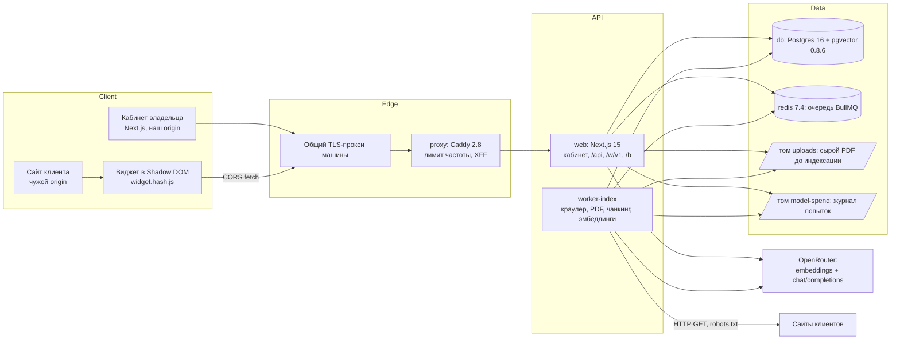

# Architecture — N6 «Суфлёр», CJM H (временно)

**Версия:** 0.1 · **Дата:** 2026-09-25 · **Канон:** [`canon.md`](canon.md) · **Решения:** [`ADR.md`](ADR.md)
· **Диаграммы C4:** [`C4_Diagrams.md`](C4_Diagrams.md).

## Architecture Overview

**Стиль:** Distributed Monolith в монорепо (Architecture Constraints пайплайна): один репозиторий,
npm workspaces, шесть сервисов Docker Compose на одной VPS (AdminVPS/HOSTKEY), прямой деплой
`docker compose up -d`. Хранилище — **PostgreSQL в контейнере с расширением pgvector**: вектора
живут в той же БД, что и аккаунты (никакой отдельной векторной БД и managed-сервисов).
AI-интеграция продукта — HTTP-вызовы шлюза OpenRouter из `web` и `worker-index`; MCP-серверы — для
агентов разработки (Phase 3), продукт их не требует.

## Component Breakdown

| Сервис compose | Образ / сборка | Ответственность | Порты |
|---|---|---|---|
| `proxy` | `caddy:2.8-alpine` | единственная дверь; лимит частоты 30 мутаций / 120 чтений в минуту на IP (плагин caddy-ratelimit, донор N4), `X-Forwarded-For` заменяется `{client_ip}`; кэш `immutable` для `/w/widget.*.js`; НЕ ставит CORS-заголовки | `"${HTTP_PORT:-8086}:80"` только к общему TLS-прокси |
| `web` | `apps/web` (Next.js 15, Node 22) | кабинет, API, предпросмотр, `/w/v1/*` для виджета, `/b/{slug}`, `/r/{code}`, раздача бандла; ответы RAG (эмбеддинг вопроса, поиск, модель, проверка цитат) | нет |
| `worker-index` | `apps/worker` | задачи индексации BullMQ: `CrawlSite`, `ExtractPdf`, `ChunkDocument`, `EmbedAndStore`; сторож раз в минуту | нет |
| `db` | `pgvector/pgvector:0.8.6-pg16` | все данные, вектора `vector(1536)` с HNSW | нет (`expose` не требуется) |
| `redis` | `redis:7.4-alpine` | транспорт очереди; AOF, `noeviction`, пароль `${REDIS_PASSWORD:?}` | нет |
| `migrate` | `apps/web` (скрипт) | миграции SQL до старта `web`/`worker-index` (`service_completed_successfully`) | нет |

Пакеты монорепо: `apps/web`, `apps/worker`, `apps/widget` (бандл, сборка в `apps/web/public/w/`),
`packages/db` (пул, миграции, `quota.ts`), `packages/rag` (чанкинг, промпт, `ValidateModelAnswer`,
клиент OpenRouter), `packages/queue` (BullMQ + fence, донор N5). Каждый сервис — `restart:
unless-stopped`, healthcheck, `depends_on: condition: service_healthy`; дополнительный compose-файл
тестов объявляет `name:` (compose-hygiene).

## Technology Stack

| Layer | Technology | Rationale |
|---|---|---|
| Frontend | Next.js 15 (App Router), дизайн-токены N5, шрифт Onest | донор N5 живёт на проде; тёмная тема и прибор адаптивности готовы (ADR-012) |
| Widget | TypeScript → один IIFE-бандл (esbuild), Shadow DOM, ≤ 45 КБ gzip | донор N1 `apps/widget` (ADR-013); без фреймворка — бюджет бандла |
| Backend | Node 22, Next.js route handlers, `pg` без ORM, zod | как N5; SQL нужен явный для pgvector и атомарных квот |
| Database | PostgreSQL 16 + pgvector 0.8.6, HNSW `vector_cosine_ops` | вектора в НАШЕМ Postgres (постановка); ≤ 2000 измерений (ADR-001) |
| Cache/Queue | Redis 7.4 + BullMQ | донор N5 `packages/queue` с фенсом попыток (ADR-009) |
| AI | OpenRouter: `anthropic/claude-haiku-4.5` (ответы), `openai/text-embedding-3-small` (1536) | один шлюз, работающий из РФ-контура у N5 (ADR-002, ADR-011) |
| Parsing | undici (HTTP), собственный разбор robots.txt, `linkedom` + извлечение основного текста, `pdfjs-dist` | без браузера (ADR-010); PDF в процессе воркера |
| Infrastructure | Docker Compose, Caddy, VPS | Architecture Constraints |

## External Dependencies

Каждая способность, которая нужна продукту от чужого сервиса. Одна строка — одна СПОСОБНОСТЬ.
Доказательство — документация или машинный каталог самого поставщика, с датой и дословной цитатой.
Проверено агентом 2026-09-25 (WebFetch/curl из этой VPS).

| Capability needed | Provider / API | Evidence | Verdict | Requirements relying on it |
|---|---|---|---|---|
| отдаёт эмбеддинги текста по HTTP API | OpenRouter, `POST /api/v1/embeddings` | [openrouter.ai/docs/api/reference/embeddings](https://openrouter.ai/docs/api/reference/embeddings) · проверено 2026-09-25 · «To generate embeddings, send a POST request to `/embeddings`» | CONFIRMED | FR-INDEX-002, FR-ANSWER-001 |
| предоставляет модель `openai/text-embedding-3-small` с выходом-эмбеддингом | OpenRouter, каталог `GET /api/v1/embeddings/models` | [openrouter.ai/api/v1/embeddings/models](https://openrouter.ai/api/v1/embeddings/models) · проверено 2026-09-25 · `"id":"openai/text-embedding-3-small"` и `"output_modalities":["embeddings"]` | CONFIRMED | FR-INDEX-002 |
| вектор `text-embedding-3-small` имеет длину 1536 (≤ 2000 для HNSW) | OpenAI, руководство по эмбеддингам | [developers.openai.com/api/docs/guides/embeddings](https://developers.openai.com/api/docs/guides/embeddings) · проверено 2026-09-25 · «By default, the length of the embedding vector is `1536` for `text-embedding-3-small` or `3072` for `text-embedding-3-large`.» | CONFIRMED | FR-INDEX-002, NFR-SCALE-001 |
| тарифицирует эмбеддинги за токен ($0,02 за 1 млн) | OpenRouter, каталог моделей | [openrouter.ai/api/v1/embeddings/models](https://openrouter.ai/api/v1/embeddings/models) · проверено 2026-09-25 · `"pricing":{"prompt":"0.00000002","completion":"0"}` | CONFIRMED | FR-LIMIT-003, `model-cost-contract.md` |
| отвечает моделью `anthropic/claude-haiku-4.5` через chat/completions | OpenRouter | [openrouter.ai/anthropic/claude-haiku-4.5](https://openrouter.ai/anthropic/claude-haiku-4.5) · проверено 2026-09-25 · «Model ID: `anthropic/claude-haiku-4.5`» и «POST https://openrouter.ai/api/v1/chat/completions» | CONFIRMED | FR-ANSWER-002 |
| принимает для этой модели структурированный ответ по схеме | OpenRouter, каталог `GET /api/v1/models` | [openrouter.ai/api/v1/models](https://openrouter.ai/api/v1/models) · проверено 2026-09-25 · `"response_format","stop","structured_outputs"` в `supported_parameters` модели `anthropic/claude-haiku-4.5` | CONFIRMED | FR-ANSWER-002 (проверку цитат делает наш код — ADR-003) |
| тарифицирует Haiku 4.5 за токены ($1 / $5 за 1 млн) | OpenRouter, каталог `GET /api/v1/models` | [openrouter.ai/api/v1/models](https://openrouter.ai/api/v1/models) · проверено 2026-09-25 · `"pricing":{"prompt":"0.000001","completion":"0.000005"` | CONFIRMED | FR-LIMIT-001, FR-LIMIT-002, `model-cost-contract.md` |
| отвечает на запросы с этой VPS (РФ-контур) | OpenRouter, проба с ключом | проверено 2026-09-25 · проба с ключом 21:19Z (A-N6-019): `POST https://openrouter.ai/api/v1/embeddings`, `openai/text-embedding-3-small`, `dimensions:1536` → HTTP 200, 1536 измерений, 6 токенов, $0.00000012 (ключ стенда N5, временный); ранее без ключа — HTTP 401 (сеть доступна) | CONFIRMED | FR-INDEX-002, FR-ANSWER-002 — сеть подтверждена; СВОЙ ключ N6 проверяет `EmbedProbe` при первом старте (Completion, шаг 3) |
| индексирует `vector` до 2000 измерений HNSW | pgvector (библиотека в нашем образе, не сервис) | [github.com/pgvector/pgvector](https://github.com/pgvector/pgvector) · проверено 2026-09-25 · «Supported types are: `vector` - up to 2,000 dimensions» | CONFIRMED | FR-INDEX-002, ADR-001 |
| доставляет оповещение мониторинга оператору | Telegram Bot API `sendMessage` (как у N5) | не проверялось в этой фазе: это операционный канал, не функция продукта | UNCONFIRMED | Completion «Monitoring» (оповещения) — до подтверждения мониторинг читается вручную раз в сутки |
| принимает платежи и шлёт уведомления | ЮKassa | не проверялось в этой фазе: оплата — спящий код (A-N6-011), собственного тестового магазина N6 нет | UNCONFIRMED | FR-TARIFF-002 (оплата) — отложено, в неделю только экран интереса |

Строка сетевой доступности — `CONFIRMED` по пробе A-N6-019 (обновлено после Phase 2, находка M1):
шлюз отвечает с этой VPS на ключ, но ключ был ЧУЖОЙ (стенд N5). «Сеть доступна» доказано, «ключ N6
работает» — ещё нет; поэтому требования этой строки в Phase 3 входят вместе с пробой при старте `worker-index` (`EmbedProbe`: один эмбеддинг «проба», проверка длины 1536 — иначе
процесс не стартует). N5 на этой же машине ходит к OpenRouter за chat/completions в проде
(reuse-inventory §6) — косвенный, не прямой довод.

## Data Architecture

Логические поля — [`Pseudocode.md`](Pseudocode.md) «Data Structures»; здесь — только отображение на
хранилище, связи и индексы.

- Все сущности — таблицы одной схемы `public`; первичные ключи `uuid` (`gen_random_uuid()`),
  `created_at timestamptz DEFAULT now()`. Перечисления — `text` + `CHECK (col IN (…))`, чтобы закрытость
  набора держала БД, а не только код.
- `chunk.embedding` — `vector(1536)`; индекс `CREATE INDEX … USING hnsw (embedding vector_cosine_ops)
  WITH (m = 16, ef_construction = 64)`; `SET hnsw.ef_search = 40` на сессию поиска. Поиск всегда с
  `WHERE bot_id = $1`: при малых ботах planner выберет индекс `(bot_id)` и точный перебор — это
  корректно и быстро (≤ 3000 фрагментов на бот); при большом боте — HNSW с пост-фильтром и
  `hnsw.iterative_scan = relaxed_order` (pgvector ≥ 0.8), чтобы фильтр не выедал результаты.
  **Поправка A-N6-028 (фича `chunk-embed`, 2026-09-26):** путь HNSW + фильтр + `iterative_scan` на прогоне
  вернул 0 из 3 своих фрагментов при 300 чужих ближайших; поиск реализован ТОЧНЫМ перебором внутри бота
  (`MATERIALIZED`-выборка по `bot_id`, 5001 фрагмент — 34 мс), индекс HNSW остаётся в схеме и поиском не
  используется.
- Связи: `account 1—N bot`; `bot 1—N source 1—N page 1—N chunk`; `bot 1—N allowed_origin`,
  `widget_install (UNIQUE bot_id, origin)`, `question_log`, `visitor_session`; `index_job N—1 source`,
  `job_attempt N—1 index_job`; `attribution (UNIQUE account_id) N—1 partner_code`;
  `studio_invite N—1 bot`. Удаление бота каскадирует на источники, страницы, фрагменты, журналы.
- Уникальные ограничения, несущие атомарность: `index_job (bot_id, idempotency_key)`,
  `quota_counter (scope, scope_key, period)`, `growth_event (type, dedup_key)`,
  `account (email)`, `bot (public_key)`, `bot (public_slug)`, `studio_invite (token_hash)`.
- Лимиты потолков — НЕ колонки: параметры из окружения (канон §6). Сырой PDF — том `uploads`
  (не объектное хранилище, ADR-018), удаляется после индексации.
- Резервная копия: `pg_dump` раз в сутки в том `backups`, хранение 7 дней (Completion).

## Security Architecture

- **Аутентификация:** почта + пароль, bcrypt 10 вне транзакции, сессия 7 дней, в БД хэш токена,
  cookie `__Host-n6_session; HttpOnly; Secure; SameSite=Lax`; предпросмотр — отдельный HttpOnly-cookie
  с хэшем токена в БД.
- **Авторизация:** каждый маршрут кабинета проверяет владение ботом (`bot.account_id = session.account_id`
  или право чтения студии); поиск RAG фильтрует `bot_id` в том же SQL (NFR-SEC-001).
- **Виджет на чужой странице:** Shadow DOM; `textContent`; CORS — точный origin из списка бота, без
  cookie и без `*`; заголовок ставит только `web`; CSP хозяина без `unsafe-inline` (ADR-005).
- **Галлюцинация как угроза:** порог сходства ДО модели + проверка цитат ПОСЛЕ (ADR-003);
  фрагменты помечены как данные (prompt injection, FR-ANSWER-004).
- **Краулер:** SSRF-фильтр после DNS и на каждом перенаправлении, соединение по проверенному IP.
- **Шифрование:** TLS на общем прокси; секреты только в `.env` машины (`${VAR:?}`), не в образах;
  `OPENROUTER_API_KEY` никогда не уходит в браузер (ключ продукта — серверный; паттерн «ключ в
  IndexedDB» пайплайна к нему не применяется: ключ принадлежит нам, а не пользователю).
- **Хранилища:** `db` и `redis` без `ports:` (docker-ports Правило №0); `web` не публикуется мимо
  `proxy` (deployment-seams: иначе XFF от клиента обходит лимиты).
- **152-ФЗ:** текст вопросов только у `unknown`, 14 дней; IP — префикс; удаление аккаунта ≤ 72 ч.

## Scalability Considerations

- **Вертикально (неделя):** одна VPS 4 vCPU / 8 ГБ. 1 000 000 фрагментов × 1536 × 4 байта ≈ 6,1 ГБ
  векторов + HNSW — предел одной машины; до него — `shared_buffers` 2 ГБ.
- **Узкие места:** (1) модель ответа — p95 ≤ 6 с держит поставщик, не мы; (2) краулер намеренно
  медленный (1 с/страница); 2 параллельные задачи индексации (`concurrency: 2`); (3) HNSW-построение
  при массовой вставке — вставка по странице, не пачкой на весь сайт.
- **Горизонтально (v1):** `web` масштабируется репликами (состояние в Postgres/Redis); квоты атомарны в
  БД, поэтому корректны на нескольких репликах. При росте векторов — `halfvec(1536)` (вдвое меньше,
  HNSW до 4000) без смены модели.

## Reconciliation with Pseudocode

Сверены сущности: `account`, `session`, `bot`, `allowed_origin`, `source`, `page`, `chunk`,
`index_job`, `job_attempt`, `preview`, `visitor_session`, `question_log`, `widget_install`,
`quota_counter`, `growth_event`, `partner_code`, `attribution`, `studio_invite`, `pro_interest`;
алгоритмы: все 34 блока `### Algorithm` из [`Pseudocode.md`](Pseudocode.md).

| Сущность.поле | Вид расхождения | Что сделано |
|---|---|---|
| `index_job.current_fence` | отсутствующая колонка | `RunIndexJob`, `EmbedAndStore`, `DeleteSource`, `WatchdogTick` читают и пишут fence, а в первой редакции Data Structures его не было — поле добавлено в Pseudocode (логический смысл) и в схему `bigint NOT NULL DEFAULT 0` |
| `quota_counter.scope` | несовпадение набора значений | `global_previews` в каноне несёт ДВА предела (предпросмотры и ответы предпросмотра) при одном scope — разведено на ключи `scope_key = 'previews'` и `'preview_answers'` при `scope = global_previews`; набор scope остаётся 10 |
| `quota_counter.scope` (preview_session) | один scope — два предела, общий счётчик | после Phase 2 (H1): `CreatePreview` и ответы предпросмотра списывали ОДНУ пару `(preview_session, сессия)` — создание съедало 1 из 10 ответов, SC-US-002-3 давал 9. Разведено на `scope_key = '<сессия>:create'` (1/сутки) и `'<сессия>:answers'` (10/сутки), у каждого своя переменная; у `global_previews` так же две переменные (`QUOTA_GLOBAL_PREVIEWS` / `QUOTA_GLOBAL_PREVIEW_ANSWERS`) — одно имя не держит два числа. Scope — 10, переменных — 14 (A-N6-020) |
| `question_log.text` | смена типа | логически «только у unknown» — физически `text NULL` + `CHECK (outcome = 'unknown' OR text IS NULL)`, чтобы инвариант держала БД |
| `bot.account_id` | смена типа | у `draft` владельца нет — колонка `NULL`-допустима, `CHECK (status = 'draft' OR account_id IS NOT NULL)` |
