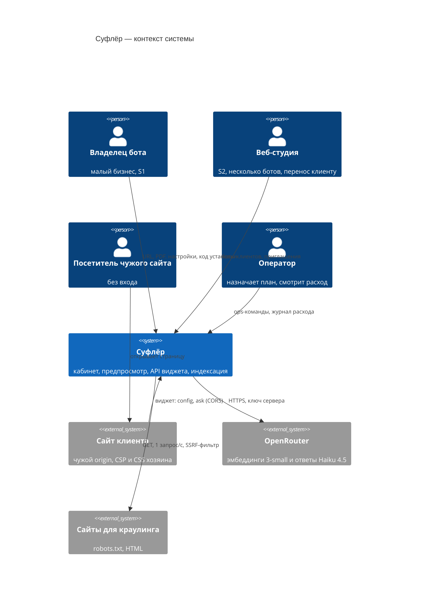
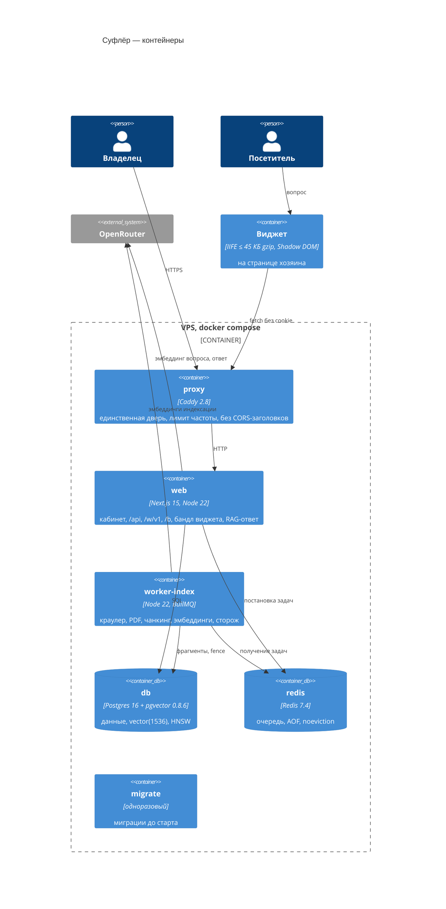
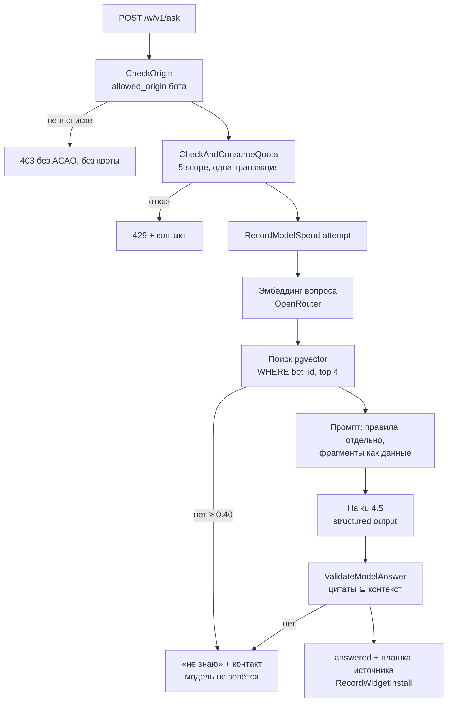
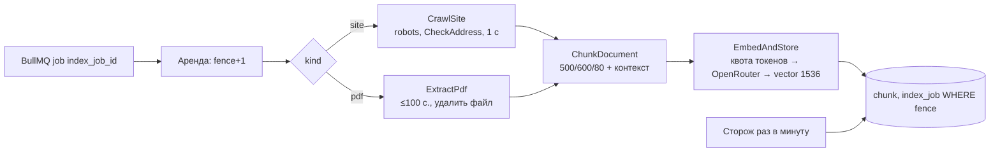

# C4-диаграммы — N6 «Суфлёр»

Дата: 2026-09-25 · Канон: [`canon.md`](canon.md) · Архитектура: [`Architecture.md`](Architecture.md) ·
Решения: [`ADR.md`](ADR.md).

## Уровень 1 · Контекст

## Уровень 2 · Контейнеры (сервисы compose)

## Уровень 3 · Компоненты `web` — путь ответа посетителю

## Уровень 3 · Компоненты `worker-index`

## Что диаграммы НЕ показывают (намеренно)
Общий TLS-прокси машины (вне проекта); спящую ЮKassa (ADR-017); тома `uploads`, `model-spend`,
`backups` — они в Architecture «Data Architecture».
