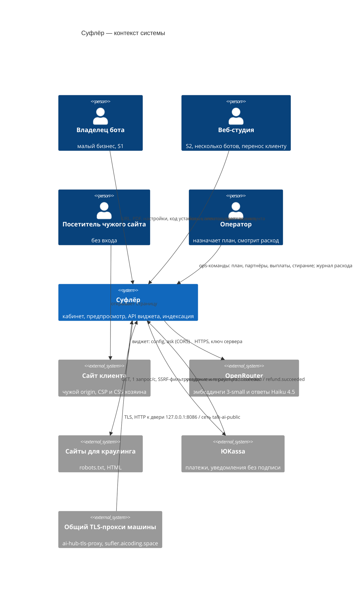
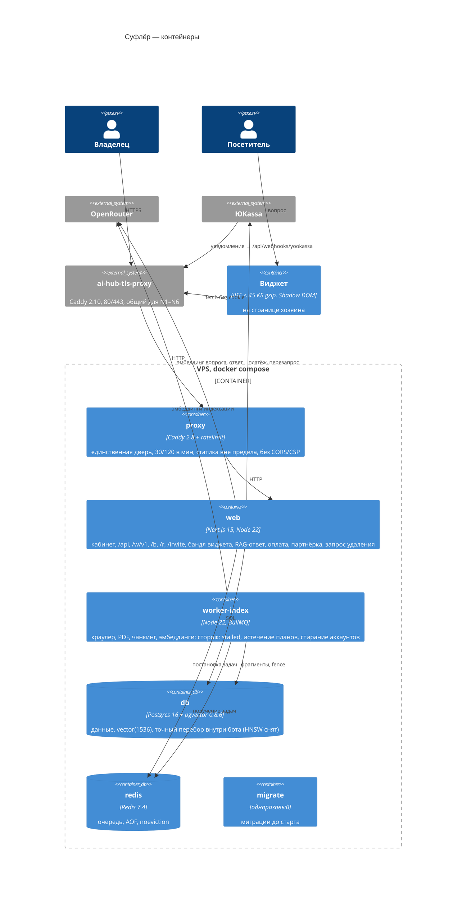
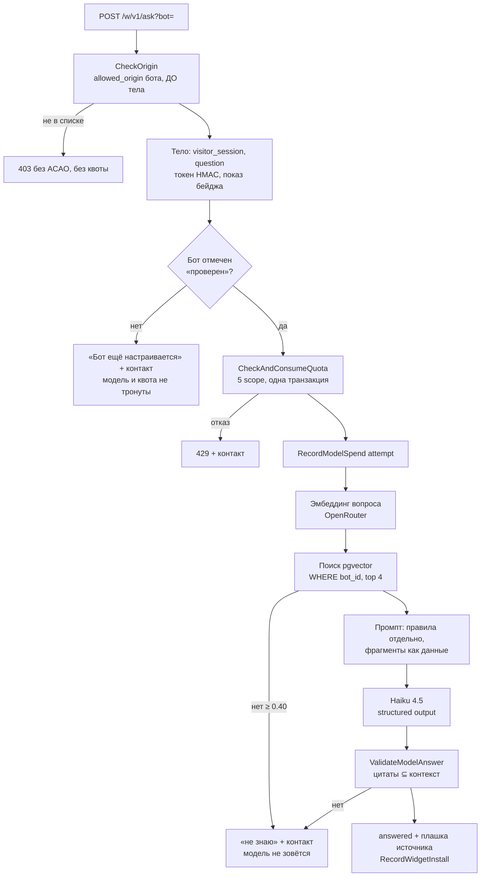
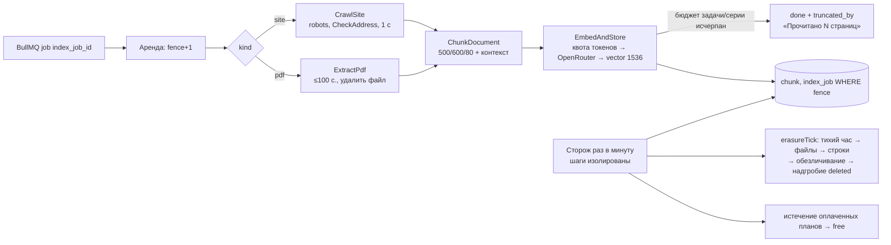
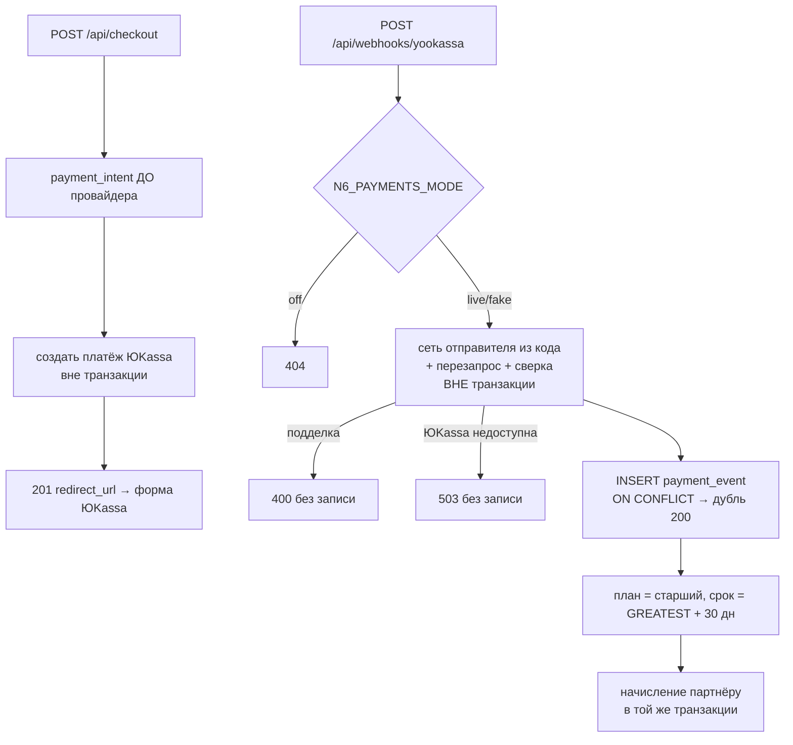

# C4-диаграммы — N6 «Суфлёр»

Дата: 2026-09-27 «как построено» (первая редакция — 2026-09-25) · Канон: [`canon.md`](canon.md) · Архитектура: [`Architecture.md`](Architecture.md) ·
Решения: [`ADR.md`](ADR.md).

## Уровень 1 · Контекст

```mermaid
C4Context
  title Суфлёр — контекст системы
  Person(owner, "Владелец бота", "малый бизнес, S1")
  Person(studio, "Веб-студия", "S2, несколько ботов, перенос клиенту")
  Person(visitor, "Посетитель чужого сайта", "без входа")
  Person(operator, "Оператор", "назначает план, смотрит расход")
  System(sufler, "Суфлёр", "кабинет, предпросмотр, API виджета, индексация")
  System_Ext(host, "Сайт клиента", "чужой origin, CSP и CSS хозяина")
  System_Ext(openrouter, "OpenRouter", "эмбеддинги 3-small и ответы Haiku 4.5")
  System_Ext(sites, "Сайты для краулинга", "robots.txt, HTML")
  System_Ext(yookassa, "ЮKassa", "платежи, уведомления без подписи")
  System_Ext(edge, "Общий TLS-прокси машины", "ai-hub-tls-proxy, sufler.aicoding.space")
  Rel(owner, sufler, "URL, PDF, настройки, код установки, оплата, удаление аккаунта")
  Rel(studio, sufler, "боты клиентов, приглашения")
  Rel(visitor, host, "открывает страницу")
  Rel(host, sufler, "виджет: config, ask (CORS)")
  Rel(sufler, openrouter, "HTTPS, ключ сервера")
  Rel(sufler, sites, "GET, 1 запрос/с, SSRF-фильтр")
  Rel(operator, sufler, "ops-команды: план, партнёры, выплаты, стирание; журнал расхода")
  Rel(sufler, yookassa, "создание и перезапрос платежа")
  Rel(yookassa, sufler, "уведомление payment.succeeded / refund.succeeded")
  Rel(edge, sufler, "TLS, HTTP к двери 127.0.0.1:8086 / сеть talk-ai-public")
```

## Уровень 2 · Контейнеры (сервисы compose)

```mermaid
C4Container
  title Суфлёр — контейнеры
  Person(owner, "Владелец")
  Person(visitor, "Посетитель")
  System_Ext(openrouter, "OpenRouter")
  System_Ext(yookassa, "ЮKassa")
  System_Ext(edge, "ai-hub-tls-proxy", "Caddy 2.10, 80/443, общий для N1–N6")
  Container_Boundary(vps, "VPS, docker compose") {
    Container(proxy, "proxy", "Caddy 2.8 + ratelimit", "единственная дверь, 30/120 в мин, статика вне предела, без CORS/CSP")
    Container(web, "web", "Next.js 15, Node 22", "кабинет, /api, /w/v1, /b, /r, /invite, бандл виджета, RAG-ответ, оплата, партнёрка, запрос удаления")
    Container(worker, "worker-index", "Node 22, BullMQ", "краулер, PDF, чанкинг, эмбеддинги; сторож: stalled, истечение планов, стирание аккаунтов")
    ContainerDb(db, "db", "Postgres 16 + pgvector 0.8.6", "данные, vector(1536), точный перебор внутри бота (HNSW снят)")
    ContainerDb(redis, "redis", "Redis 7.4", "очередь, AOF, noeviction")
    Container(migrate, "migrate", "одноразовый", "миграции до старта")
  }
  Container(widget, "Виджет", "IIFE ≤ 45 КБ gzip, Shadow DOM", "на странице хозяина")
  Rel(owner, edge, "HTTPS")
  Rel(edge, proxy, "HTTP")
  Rel(visitor, widget, "вопрос")
  Rel(widget, edge, "fetch без cookie")
  Rel(proxy, web, "HTTP")
  Rel(web, db, "SQL")
  Rel(web, redis, "постановка задач")
  Rel(worker, redis, "получение задач")
  Rel(worker, db, "фрагменты, fence")
  Rel(web, openrouter, "эмбеддинг вопроса, ответ")
  Rel(worker, openrouter, "эмбеддинги индексации")
  Rel(web, yookassa, "платёж, перезапрос")
  Rel(yookassa, edge, "уведомление → /api/webhooks/yookassa")
```

## Уровень 3 · Компоненты `web` — путь ответа посетителю

```mermaid
flowchart TB
  A[POST /w/v1/ask?bot=] --> B[CheckOrigin<br/>allowed_origin бота, ДО тела]
  B -- не в списке --> R403[403 без ACAO, без квоты]
  B --> T[Тело: visitor_session, question<br/>токен HMAC, показ бейджа]
  T --> VR{Бот отмечен<br/>«проверен»?}
  VR -- нет --> NV[«Бот ещё настраивается» + контакт<br/>модель и квота не тронуты]
  VR -- да --> C[CheckAndConsumeQuota<br/>5 scope, одна транзакция]
  C -- отказ --> RL[429 + контакт]
  C --> D[RecordModelSpend attempt]
  D --> E[Эмбеддинг вопроса<br/>OpenRouter]
  E --> F[Поиск pgvector<br/>WHERE bot_id, top 4]
  F -- нет ≥ 0.40 --> U[«не знаю» + контакт<br/>модель не зовётся]
  F --> G[Промпт: правила отдельно,<br/>фрагменты как данные]
  G --> H[Haiku 4.5<br/>structured output]
  H --> V[ValidateModelAnswer<br/>цитаты ⊆ контекст]
  V -- нет --> U
  V --> OK[answered + плашка источника<br/>RecordWidgetInstall]
```

## Уровень 3 · Компоненты `worker-index`

```mermaid
flowchart LR
  Q[BullMQ job index_job_id] --> L[Аренда: fence+1]
  L --> S{kind}
  S -- site --> CR[CrawlSite<br/>robots, CheckAddress, 1 с]
  S -- pdf --> PDF[ExtractPdf<br/>≤100 с., удалить файл]
  CR --> CH[ChunkDocument<br/>500/600/80 + контекст]
  PDF --> CH
  CH --> EM[EmbedAndStore<br/>квота токенов → OpenRouter → vector 1536]
  EM -- бюджет задачи/серии исчерпан --> TR[done + truncated_by<br/>«Прочитано N страниц»]
  EM --> DB[(chunk, index_job WHERE fence)]
  W[Сторож раз в минуту<br/>шаги изолированы] --> DB
  W --> ER[erasureTick: тихий час → файлы → строки<br/>→ обезличивание → надгробие deleted]
  W --> EX[истечение оплаченных планов → free]
```

## Уровень 3 · Компоненты `web` — оплата (ADR-019)

```mermaid
flowchart TB
  CK[POST /api/checkout] --> PI[payment_intent ДО провайдера]
  PI --> YC[создать платёж ЮKassa<br/>вне транзакции]
  YC --> RED[201 redirect_url → форма ЮKassa]
  WH[POST /api/webhooks/yookassa] --> MODE{N6_PAYMENTS_MODE}
  MODE -- off --> N404[404]
  MODE -- live/fake --> AUTH[сеть отправителя из кода<br/>+ перезапрос + сверка<br/>ВНЕ транзакции]
  AUTH -- подделка --> R400[400 без записи]
  AUTH -- ЮKassa недоступна --> R503[503 без записи]
  AUTH --> KEY[INSERT payment_event<br/>ON CONFLICT → дубль 200]
  KEY --> PLAN[план = старший, срок = GREATEST + 30 дн]
  PLAN --> COM[начисление партнёру<br/>в той же транзакции]
```

## Что диаграммы НЕ показывают (намеренно)
Тома `uploads`, `model-spend`, `backups` — они в Architecture «Data Architecture»; внутренности стирания и партнёрского
учёта — Architecture «Payments, Partners and Erasure» и ADR-020/021. Общий TLS-прокси и ЮKassa с 27.09 показаны (раньше —
«вне проекта» и «спящая»).
