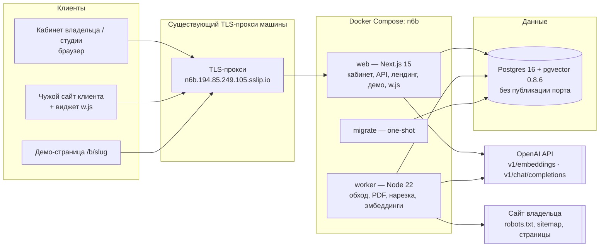

# Architecture — N6b «RAG-бот для сайта»

**Фаза:** 1 · `sparc-prd-mini` внутренняя фаза 5 · **Дата:** 2026-09-30 · Решения — [`ADR.md`](ADR.md), диаграммы — [`C4_Diagrams.md`](C4_Diagrams.md)

**Architecture Constraints (обязательны):** Distributed Monolith в монорепо · Docker + Docker Compose · VPS
(AdminVPS/HOSTKEY) · деплой Docker Compose напрямую · у хранилищ НЕТ публикации на хост (кроме петли) · хостовые порты
только `${VAR:-default}` · тестовый домен `n6b.194.85.249.105.sslip.io`.

**AI Integration: MCP servers — как понято здесь.** Продукт зовёт модели по HTTP через порт-адаптер (ADR-004). MCP-сервер
продукта (например, «спроси моего бота» для агентов) в MVP не строится — это не выход из ограничения, а решение объёма; MCP
остаётся средством разработки (Claude Code). Записано, чтобы валидатор не читал молчание как нарушение.

**Решения, на которых стоит документ:** ADR-001 (монорепо без Redis) · ADR-002 (pgvector, HNSW) · ADR-003 (граница «не
знаю» в коде) · ADR-004 (модели за портом) · ADR-005 (долгие задачи) · ADR-006 (бейдж на сервере) · ADR-007 (разрешённые
origin) · ADR-008 (передача аккаунта) · ADR-009 (демо сохранённого бота) · ADR-010 (потолки расходов) · ADR-011 (серверный
ключ) · ADR-012 (PDF в Postgres) · ADR-013 (обходчик) · ADR-014 (стенд за прокси).

## Architecture Overview

Стиль: **Distributed Monolith (Monorepo)** — одна кодовая база, три процесса (web, worker, migrate) и одна БД.

## Component Breakdown

| Компонент | Путь в монорепо | Ответственность | Переиспользование (PD-REUSE-001, номер строки инвентаря) |
|---|---|---|---|
| web | `apps/web` | регистрация/вход, кабинет, API ботов и источников, песочница, публикация, `/api/widget/*`, `/r/b/*`, `/b/*`, лендинг, `/admin/metrics`, отдача `w.js` | #24 auth N5 (bcrypt, фиктивный хэш), #26 публичные страницы N5/N2, #3 бейдж на сервере N1, #4 учёт установок N1 |
| widget | `apps/widget` | бандл одним `<script data-bot async>`: Shadow DOM, чат, бейдж, beacon-события | #1 виджет N1 (esbuild, currentScript, Shadow DOM, ≤30 KB), #2 бейдж на клиенте N1 |
| worker | `services/worker` | аренда задач, обход сайта, извлечение PDF, нарезка, эмбеддинги, уборщики | #13 аренда + fence N4, #7 SKIP LOCKED N1, #15 журнал вызовов модели N4, #16 порт провайдера N4 |
| db | `packages/db` | миграции, роли, RLS, функции квот | #9 RLS-транзакция N1, #14 атомарные квоты N4, #5 лимитер на Postgres N1, #11 подаккаунты N2 |
| rag | `packages/rag` | чанкинг, поиск, сборка промпта, проверка цитат, «не знаю» | пишется с нуля (в N1–N5 нет) |
| scripts | `scripts/` | стражи стыков: порты, проброс env, собираемость, сквозной CJM | #10 скрипты N1/N4/N5 |

Писать с нуля (в N1–N5 нет, см. инвентарь): обходчик и robots/sitemap, извлечение PDF, pgvector и RAG, «не знаю + контакт».

## Technology Stack

| Layer | Technology | Rationale |
|---|---|---|
| Frontend | Next.js 15 (App Router), собственный CSS на токенах (фолбэк-палитра slate/orange) | кабинет и публичные страницы в одном процессе с API; облик источника не снят — палитра подписана как фолбэк |
| Widget | TypeScript + esbuild, Shadow DOM, без фреймворка | бюджет ≤ 30 KB gzip, нет инлайновых скриптов/стилей (CSP хозяина) |
| Backend | Node 22 + TypeScript, Route Handlers Next.js; `pg` с пулом | один язык во всём монорепо; готовые модули N1–N5 на TS |
| Database | Postgres 16 + pgvector 0.8.6, образ `pgvector/pgvector:0.8.6-pg16` | pgvector — расширение нашего Postgres, не отдельная БД (постановка); закреплённый тег |
| Vector index | HNSW `vector_cosine_ops`, `vector(1536)`; `SET LOCAL hnsw.iterative_scan = strict_order` | фильтр по `bot_id` применяется после скана индекса; итеративный скан добирает top-5 (Research T12) |
| Cache | нет отдельного кэша; кэш эмбеддингов — по `text_sha256` в таблице `chunk` | повтор не платит дважды; Redis не нужен |
| Queue | таблица `index_job` + `FOR UPDATE SKIP LOCKED` + аренда с fence | минутные задачи без Redis (правило долгих задач) |
| PDF | `pdfjs-dist` (локально) | извлечение текста без внешнего сервиса |
| HTML | `undici` для загрузки + `cheerio` для блочного извлечения | контроль DNS/редиректов для SSRF-фильтра |
| Tokens | `js-tiktoken` (`cl100k_base`) | подсчёт токенов для нарезки и пределов ДО вызова |
| Infrastructure | Docker Compose на VPS; существующий TLS-прокси машины | 80/443 на машине заняты чужим прокси — свой не публикуем |

## External Dependencies

Every capability this product needs from someone else's service. One row per capability, not one row per vendor.

| Capability needed | Provider / API | Evidence | Verdict | Requirements relying on it |
|---|---|---|---|---|
| Векторизация текста в вектор длины 1536 | OpenAI API, `POST v1/embeddings`, модель `text-embedding-3-small` | https://developers.openai.com/api/docs/guides/embeddings · checked 2026-09-30 · «By default, the length of the embedding vector is 1536 for text-embedding-3-small» | CONFIRMED | FR-n6b-4, FR-n6b-5, FR-n6b-16 |
| Модель эмбеддингов обслуживается эндпоинтом эмбеддингов, цена $0.02 за 1M токенов | OpenAI API, `text-embedding-3-small` | https://developers.openai.com/api/docs/models/text-embedding-3-small · checked 2026-09-30 · «Embeddings Per 1M tokens ∙ Batch API price Cost $0.02» | CONFIRMED | FR-n6b-16 |
| Генерация ответа по переданным фрагментам | OpenAI API, `POST v1/chat/completions`, модель `gpt-4.1-mini` | https://developers.openai.com/api/docs/models/gpt-4.1-mini · checked 2026-09-30 · «Chat Completions v1/chat/completions» | CONFIRMED | FR-n6b-5, FR-n6b-6 |
| Ответ модели в заданной JSON-схеме (`answer`, `cited_ids`, `unknown`) | OpenAI API, `gpt-4.1-mini` | https://developers.openai.com/api/docs/models/gpt-4.1-mini · checked 2026-09-30 · «Structured outputs Supported» | CONFIRMED | FR-n6b-5, FR-n6b-6 |
| Цена генерации для потолков: вход/выход за 1M токенов | OpenAI API, `gpt-4.1-mini` | https://developers.openai.com/api/docs/models/gpt-4.1-mini · checked 2026-09-30 · «Input $0.40 Cached input $0.10 Output $1.60» | CONFIRMED | FR-n6b-16 |
| Поиск ближайших векторов HNSW по косинусному расстоянию с фильтром | pgvector 0.8.6 (расширение в нашем контейнере) | https://raw.githubusercontent.com/pgvector/pgvector/master/README.md · checked 2026-09-30 · «CREATE INDEX ON items USING hnsw (embedding vector_cosine_ops)» | CONFIRMED | FR-n6b-5, NFR-n6b-1 |
| Итеративный скан HNSW, добирающий top-5 при фильтре `bot_id` (нужна версия pgvector ≥ 0.8) | pgvector 0.8.6 (расширение в нашем контейнере) | https://raw.githubusercontent.com/pgvector/pgvector/master/README.md · checked 2026-09-30 · «SET hnsw.iterative_scan = strict_order;» | CONFIRMED | FR-n6b-5, FR-n6b-6 |

Не зависимость, а вход: сайт владельца (robots.txt, sitemap.xml, страницы) — его ответы обрабатываются по RFC 9309 и
отказывают задачу с причиной, а не «пропускаются». Метрики продукта берутся из нашей БД — внешнего API метрик нет.

## Docker Compose (план, порты и сети)

| Сервис | Образ | Порты на хосте | Сети | Здоровье | Перезапуск |
|---|---|---|---|---|---|
| db | `pgvector/pgvector:0.8.6-pg16` | **нет** (только сеть compose) | `internal` | `pg_isready` | `unless-stopped` |
| migrate | сборка `packages/db` | нет | `internal` | one-shot, `service_completed_successfully` | `no` |
| web | сборка `apps/web` (контекст — корень монорепо) | опционально `127.0.0.1:${N6B_WEB_PORT:-3106}:3000` для отладки | `internal`, `proxy` (внешняя, имя `${PROXY_NETWORK:?}`) | `GET /api/health` | `unless-stopped` |
| worker | сборка `services/worker` | нет | `internal` + исходящий интернет | файл-пульс | `unless-stopped` |

- `name: n6b` в compose; тестовый стек — отдельный файл с `name: n6b-test` и паролями `${VAR:?}`.
- Приложение не публикуется на все интерфейсы: единственная дверь — существующий TLS-прокси; поэтому последний элемент
  `X-Forwarded-For` доверенный (web недоступен напрямую снаружи).
- `CORS` для `/api/widget/*` ставит только web; прокси заголовки CORS не трогает (урок двойного CORS).
- Перед `up`: `node .claude/hooks/check-ports.cjs .` и `bash scripts/check-port-conflicts.sh projects/06b-rag-class`.

## Data Architecture

Логические поля — `Pseudocode.md` → Data Structures; здесь только физическое отображение и связи.

| Сущность | Таблица | Ключевые ограничения и индексы | RLS |
|---|---|---|---|
| Account | `account` | `unique(lower(email)) WHERE email IS NOT NULL`; `parent_account_id` FK → account, триггер «один уровень»; `plan text` (толкование в коде); `studio_access bool DEFAULT false`; `is_test bool DEFAULT false` (только CLI оператора) | своя строка или дочерняя для студии |
| Session | `session` | `unique(token_hash)`, индекс `expires_at` | нет доступа из приложения кроме своих |
| Bot | `bot` | `unique(public_id)`, `unique(demo_slug)`, `allowed_origins text[]` | по `account_id` |
| Source / SourceFile | `source`, `source_file` | `source_file.bytes bytea`, CHECK размер ≤ 10 МБ | по `account_id` |
| Document | `document` | `unique(source_id, locator_url)`, `unique(source_id, locator_page)` | по `account_id` |
| Chunk | `chunk` | `embedding vector(1536)`; HNSW `vector_cosine_ops` (m=16, ef_construction=64); btree `bot_id`; `unique(document_id, text_sha256)` | по `account_id` |
| IndexJob | `index_job` | частичный `unique(source_id) WHERE state IN ('queued','running')` — идемпотентный ключ; `run_started_at` — отсчёт потолка 15 мин | по `account_id` |
| QuestionLog | `question_log` | индекс `created_at` (уборка 30 дней) | по `account_id` |
| ModelCallLog | `model_call_log` | индекс `(kind, created_at)` | только оператор |
| QuotaCounter | `quota_counter` | `unique(scope, day)`; инкремент `INSERT … ON CONFLICT DO UPDATE SET used = used + n WHERE used + n <= limit RETURNING` | сервисная роль |
| WidgetInstall | `widget_install` | `unique(bot_id, origin_host)`; `config_seen_at NOT NULL`, `first_question_at`, `page_url`, `page_verified_at` (метрика недели — FR-n6b-15) | сервисная роль |
| BadgeEvent | `badge_event` | `unique(bot_id, kind, visitor_key, day)` для click | сервисная роль |
| GrowthEvent / HandoverToken | `growth_event`, `handover_token` | `unique(token_hash)` | по `account_id` |
| Operator | `operator` | `unique(account_id)`; запись только миграцией/CLI оператора | чтение сервисной ролью |

Связи: account 1—N bot 1—N source 1—N document 1—N chunk; source 1—N index_job; account(студия) 1—N account(подаккаунт).
`account_id` денормализован в source/document/chunk/job/log для RLS одним предикатом (урок N1 #9: `SET LOCAL` в транзакции).

## Security Architecture

- **Аутентификация:** e-mail + пароль (bcrypt cost 12, фиктивный хэш при отсутствии аккаунта), cookie сессии httpOnly,
  Secure, SameSite=Lax, в БД — HMAC токена. `SESSION_SECRET` отсутствует → отказ старта.
- **Авторизация:** RLS по `account_id` через роль приложения и `SET LOCAL app.account_ids` в транзакции; студия видит дочерние
  аккаунты только при `studio_access=true`; подаккаунт создаётся с `studio_access=true` явно, у обычного аккаунта `false`
  (DEFAULT false в схеме). Оператор — по списку id в таблице `operator` (пусто = никто).
- **Публичные ручки входа:** регистрация и вход — 10 попыток/час на адрес (`quota_counter`, ключ `auth:addr:<hmac>:<час>`).
- **Публичные ручки:** `/api/widget/*` — origin из списка бота; `/b/*`, `/r/b/*` — без сессии; все публичные ответы без
  `credentials`, CORS не ставит `*`.
- **Модель и данные:** инструкция модели отделена от фрагментов; фрагменты — данные; ответ выводится как текст; ссылки из БД.
- **SSRF:** DNS-резолв до запроса, запрет loopback/частных/link-local/CGNAT/метаданных облака, соединение на проверенный IP,
  повтор проверки на каждом редиректе, только http/https и порты 80/443.
- **Шифрование:** TLS на прокси; секреты — переменные окружения (`.env` не коммитится); IP посетителя не хранится
  (HMAC префикса с `VISITOR_SECRET`).
- **Паттерн «ключи пользователя в браузере» (IndexedDB, AES-GCM) не применяется** — ключ модели наш и серверный, виджет
  отвечает посетителям без браузера владельца (ADR-011).

## Scalability Considerations

- Горизонтально: web без состояния (сессии в БД) — несколько реплик; worker — несколько экземпляров, аренда с fence исключает
  двойную обработку.
- Вертикально: Postgres — узкое место; HNSW в памяти: 200 000 фрагментов × 1536 × 4 байта ≈ 1,2 ГБ без учёта графа `[H]` —
  предел MVP на VPS; дальше — `halfvec` (вдвое меньше) или раздельные индексы.
- Узкие места: генерация (внешний вызов 2–5 с) — вне транзакции, соединение пула не держится; пул `pg` = 10, таймаут
  получения соединения 5 с (недоступность — отказ, а не вечное ожидание).
- Лимиты и квоты — одна инструкция на ключ, все ключи попытки в одной транзакции (N4 #14), без блокировок на время вызова.

## Reconciliation with Pseudocode

| Сущность.поле | Вид расхождения | Что сделано |
|---|---|---|
| Account.plan | смена типа | в псевдокоде толкование — закрытое множество {free, start, studio} через `plan_of()`; физически `text` без CHECK, чтобы неопознанное значение читалось как `free`, а не роняло запись (fail-closed в коде, ADR-006) |
| Account.email | отсутствующая колонка / nullability | подаккаунт до передачи без e-mail: в схеме `email NULL`, уникальность частичным индексом |
| Document.text | отсутствующая колонка | алгоритм «Chunk and embed» читает `doc.text` — поле добавлено в Data Structures и в таблицу `document` |
| IndexJob.state | несовпадение набора значений | в хранилище 4 значения (`queued`, `running`, `succeeded`, `failed`), пользователю 3 состояния: `queued` и `running` показываются одним «выполняется» — согласовано в обоих документах |
| Bot.allowed_origins | смена типа | список → `text[]` нормализованных origin; пустой массив = закрыто |
| IndexJob.run_started_at, IndexJob.note | отсутствующая колонка | добавлены по валидации (H-1, H-2): отсчёт потолка задачи от текущего запуска; текст «обойдено N из ≥N+1» |
| WidgetInstall.config_seen_at, page_url, page_verified_at | отсутствующая колонка | добавлены по валидации (H-3): единое определение метрики недели |
| Account.is_test, Account.studio_access | nullability / значение по умолчанию | `DEFAULT false`; подаккаунт вставляется с `studio_access=true` явно (M-2) |

Сверены сущности: Account, Session, Bot, Source, SourceFile, Document, Chunk, IndexJob, QuestionLog, ModelCallLog,
QuotaCounter, WidgetInstall, BadgeEvent, GrowthEvent, HandoverToken, Operator; алгоритмы: Register and login, Create source and enqueue
index job, Worker lease loop, Crawl site, Extract PDF, Chunk and embed, Answer question, Widget ask gate, Widget config and
badge decision, Badge click and referral, Demo page, Publish bot, Studio sub-account, Handover to client, Weekly metric, Boot
config check, Source management and retention.
