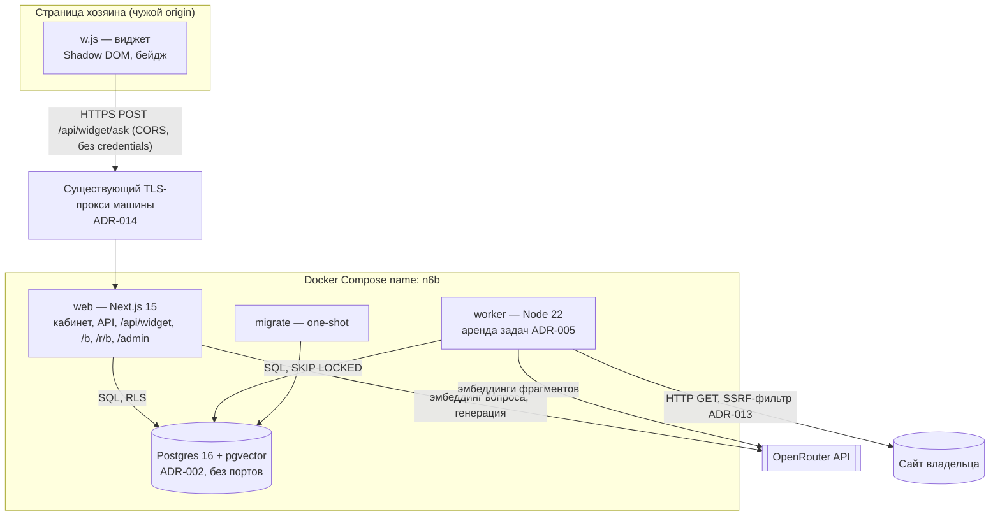
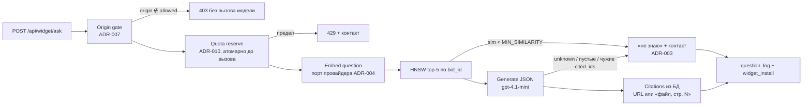
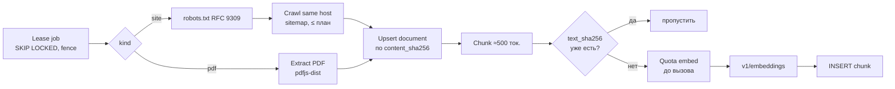

# C4 Diagrams — N6b «RAG-бот для сайта»

**Фаза:** 1 · **Дата:** 2026-09-30 · Текстовое описание компонентов — [`Architecture.md`](Architecture.md).

## Level 1 — System Context

```mermaid
flowchart TB
  owner([Владелец сайта / студия])
  visitor([Посетитель чужого сайта])
  operator([Оператор N6b])
  n6b[[N6b — RAG-бот для сайта]]
  site[(Сайт владельца<br/>страницы, robots.txt, sitemap)]
  openrouter[[OpenRouter API (шлюз к OpenAI)<br/>эмбеддинги и генерация]]
  owner -- "регистрирует бота, даёт URL и PDF, вставляет script" --> n6b
  visitor -- "задаёт вопрос в виджете / на демо" --> n6b
  operator -- "метрика недели, пределы, план" --> n6b
  n6b -- "обходит по RFC 9309" --> site
  n6b -- "v1/embeddings, v1/chat/completions" --> openrouter
```

## Level 2 — Containers



## Level 3 — Components (web: путь ответа)



## Level 3 — Components (worker: индексация)


